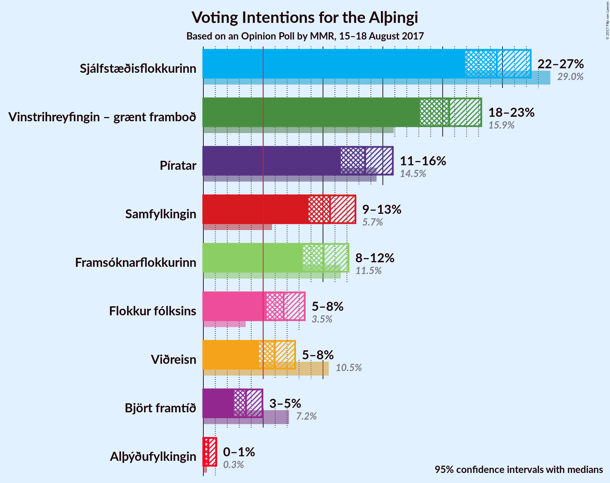

# Opinion Poll by MMR, 15–18 August 2017

<a href="#voting-intentions">Voting Intentions</a> | <a href="#seats">Seats</a> | <a href="#coalitions">Coalitions</a> | <a href="#technical-information">Technical Information</a>

## Voting Intentions

### Confidence Intervals

| Party | Last Result | Poll Result | 80% Confidence Interval | 90% Confidence Interval | 95% Confidence Interval | 99% Confidence Interval |
|:-----:|:-----------:|:-----------:|:-----------------------:|:-----------------------:|:-----------------------:|:-----------------------:|
| Sjálfstæðisflokkurinn | 29.0% | 24.5% | 22.8–26.4% |22.3–26.9% |21.9–27.4% |21.1–28.3% |
| Vinstrihreyfingin – grænt framboð | 15.9% | 20.5% | 18.9–22.3% |18.5–22.8% |18.1–23.2% |17.4–24.1% |
| Píratar | 14.5% | 13.5% | 12.2–15.0% |11.8–15.5% |11.5–15.8% |10.9–16.6% |
| Samfylkingin | 5.7% | 10.6% | 9.4–12.0% |9.1–12.4% |8.8–12.7% |8.3–13.4% |
| Framsóknarflokkurinn | 11.5% | 10.1% | 8.9–11.4% |8.6–11.8% |8.3–12.1% |7.8–12.8% |
| Flokkur fólksins | 3.5% | 6.7% | 5.8–7.9% |5.5–8.2% |5.3–8.5% |4.9–9.1% |
| Viðreisn | 10.5% | 6.0% | 5.1–7.1% |4.8–7.4% |4.6–7.7% |4.3–8.2% |
| Björt framtíð | 7.2% | 3.6% | 2.9–4.5% |2.7–4.7% |2.6–4.9% |2.3–5.4% |

*Note:* The poll result column reflects the actual value used in the calculations. Published results may vary slightly, and in addition be rounded to fewer digits.

## Seats

### Confidence Intervals

| Party | Last Result | Median | 80% Confidence Interval | 90% Confidence Interval | 95% Confidence Interval | 99% Confidence Interval |
|:-----:|:-----------:|:------:|:-----------------------:|:-----------------------:|:-----------------------:|:-----------------------:|
| <a href="#sjálfstæðisflokkurinn">Sjálfstæðisflokkurinn</a> | 21 | 17 | 15–19 |15–20 |15–20 |14–21 |
| <a href="#vinstrihreyfingin-–-grænt-framboð">Vinstrihreyfingin – grænt framboð</a> | 10 | 14 | 13–16 |12–17 |12–17 |12–17 |
| <a href="#píratar">Píratar</a> | 10 | 9 | 8–10 |8–10 |7–11 |7–11 |
| <a href="#samfylkingin">Samfylkingin</a> | 3 | 7 | 6–8 |6–8 |6–9 |5–9 |
| <a href="#framsóknarflokkurinn">Framsóknarflokkurinn</a> | 8 | 7 | 6–8 |5–8 |5–8 |5–9 |
| <a href="#flokkur-fólksins">Flokkur fólksins</a> | 0 | 4 | 4–5 |3–5 |3–6 |0–6 |
| <a href="#viðreisn">Viðreisn</a> | 7 | 4 | 3–5 |0–5 |0–5 |0–5 |
| <a href="#björt-framtíð">Björt framtíð</a> | 4 | 0 | 0 |0 |0–1 |0–3 |

### Sjálfstæðisflokkurinn

*For a full overview of the results for this party, see the [Sjálfstæðisflokkurinn](party-sjlfstisflokkurinn.html) page.*

| Number of Seats | Probability | Accumulated | Special Marks |
|:---------------:|:-----------:|:-----------:|:-------------:|
| 14 | 2% | 100% |  |
| 15 | 16% | 98% |  |
| 16 | 21% | 82% |  |
| 17 | 27% | 61% | Median |
| 18 | 21% | 34% |  |
| 19 | 8% | 13% |  |
| 20 | 5% | 5% |  |
| 21 | 0.6% | 0.7% | Last Result |
| 22 | 0% | 0% |  |

### Vinstrihreyfingin – grænt framboð

*For a full overview of the results for this party, see the [Vinstrihreyfingin – grænt framboð](party-vinstrihreyfingingrntframbo.html) page.*

| Number of Seats | Probability | Accumulated | Special Marks |
|:---------------:|:-----------:|:-----------:|:-------------:|
| 10 | 0% | 100% | Last Result |
| 11 | 0.4% | 100% |  |
| 12 | 5% | 99.6% |  |
| 13 | 17% | 95% |  |
| 14 | 37% | 77% | Median |
| 15 | 18% | 40% |  |
| 16 | 12% | 22% |  |
| 17 | 10% | 10% |  |
| 18 | 0.2% | 0.2% |  |
| 19 | 0% | 0% |  |

### Píratar

*For a full overview of the results for this party, see the [Píratar](party-pratar.html) page.*

| Number of Seats | Probability | Accumulated | Special Marks |
|:---------------:|:-----------:|:-----------:|:-------------:|
| 6 | 0.1% | 100% |  |
| 7 | 3% | 99.9% |  |
| 8 | 23% | 96% |  |
| 9 | 46% | 73% | Median |
| 10 | 22% | 27% | Last Result |
| 11 | 4% | 5% |  |
| 12 | 0.3% | 0.3% |  |
| 13 | 0% | 0% |  |

### Samfylkingin

*For a full overview of the results for this party, see the [Samfylkingin](party-samfylkingin.html) page.*

| Number of Seats | Probability | Accumulated | Special Marks |
|:---------------:|:-----------:|:-----------:|:-------------:|
| 3 | 0% | 100% | Last Result |
| 4 | 0% | 100% |  |
| 5 | 1.2% | 100% |  |
| 6 | 29% | 98.8% |  |
| 7 | 40% | 69% | Median |
| 8 | 27% | 29% |  |
| 9 | 3% | 3% |  |
| 10 | 0.1% | 0.1% |  |
| 11 | 0% | 0% |  |

### Framsóknarflokkurinn

*For a full overview of the results for this party, see the [Framsóknarflokkurinn](party-framsknarflokkurinn.html) page.*

| Number of Seats | Probability | Accumulated | Special Marks |
|:---------------:|:-----------:|:-----------:|:-------------:|
| 4 | 0.3% | 100% |  |
| 5 | 6% | 99.7% |  |
| 6 | 34% | 94% |  |
| 7 | 47% | 60% | Median |
| 8 | 11% | 12% | Last Result |
| 9 | 0.8% | 0.9% |  |
| 10 | 0.1% | 0.2% |  |
| 11 | 0% | 0% |  |

### Flokkur fólksins

*For a full overview of the results for this party, see the [Flokkur fólksins](party-flokkurflksins.html) page.*

| Number of Seats | Probability | Accumulated | Special Marks |
|:---------------:|:-----------:|:-----------:|:-------------:|
| 0 | 1.0% | 100% | Last Result |
| 1 | 0% | 99.0% |  |
| 2 | 0% | 99.0% |  |
| 3 | 7% | 99.0% |  |
| 4 | 53% | 92% | Median |
| 5 | 36% | 39% |  |
| 6 | 3% | 3% |  |
| 7 | 0% | 0% |  |

### Viðreisn

*For a full overview of the results for this party, see the [Viðreisn](party-vireisn.html) page.*

| Number of Seats | Probability | Accumulated | Special Marks |
|:---------------:|:-----------:|:-----------:|:-------------:|
| 0 | 6% | 100% |  |
| 1 | 0% | 94% |  |
| 2 | 0% | 94% |  |
| 3 | 21% | 94% |  |
| 4 | 57% | 73% | Median |
| 5 | 16% | 16% |  |
| 6 | 0.2% | 0.2% |  |
| 7 | 0% | 0% | Last Result |

### Björt framtíð

*For a full overview of the results for this party, see the [Björt framtíð](party-bjrtframt.html) page.*

| Number of Seats | Probability | Accumulated | Special Marks |
|:---------------:|:-----------:|:-----------:|:-------------:|
| 0 | 97% | 100% | Median |
| 1 | 1.3% | 3% |  |
| 2 | 0% | 2% |  |
| 3 | 2% | 2% |  |
| 4 | 0.1% | 0.1% | Last Result |
| 5 | 0% | 0% |  |

## Coalitions

### Confidence Intervals

| Coalition | Last Result | Median | Majority? | 80% Confidence Interval | 90% Confidence Interval | 95% Confidence Interval | 99% Confidence Interval |
|:---------:|:-----------:|:------:|:---------:|:-----------------------:|:-----------------------:|:-----------------------:|:-----------------------:|
| Vinstrihreyfingin – grænt framboð – Píratar – Samfylkingin – Viðreisn – Björt framtíð | 34 | 34 | 91% | 32–36 | 31–37 | 31–38 | 29–38 |
| Sjálfstæðisflokkurinn – Samfylkingin | 24 | 24 | 0% | 22–26 | 22–27 | 21–27 | 21–28 |
| Vinstrihreyfingin – grænt framboð – Samfylkingin | 13 | 21 | 0% | 20–24 | 19–24 | 19–25 | 18–25 |
| Sjálfstæðisflokkurinn – Viðreisn – Björt framtíð | 32 | 21 | 0% | 19–23 | 18–23 | 18–24 | 17–24 |

### Vinstrihreyfingin – grænt framboð – Píratar – Samfylkingin – Viðreisn – Björt framtíð

| Number of Seats | Probability | Accumulated | Special Marks |
|:---------------:|:-----------:|:-----------:|:-------------:|
| 29 | 0.9% | 100% |  |
| 30 | 0.9% | 99.0% |  |
| 31 | 7% | 98% |  |
| 32 | 5% | 91% | Majority |
| 33 | 21% | 85% |  |
| 34 | 16% | 65% | Last Result, Median |
| 35 | 25% | 48% |  |
| 36 | 15% | 24% |  |
| 37 | 6% | 9% |  |
| 38 | 3% | 4% |  |
| 39 | 0.3% | 0.3% |  |
| 40 | 0% | 0% |  |

### Sjálfstæðisflokkurinn – Samfylkingin

| Number of Seats | Probability | Accumulated | Special Marks |
|:---------------:|:-----------:|:-----------:|:-------------:|
| 20 | 0.4% | 100% |  |
| 21 | 3% | 99.6% |  |
| 22 | 14% | 97% |  |
| 23 | 19% | 83% |  |
| 24 | 36% | 64% | Last Result, Median |
| 25 | 14% | 28% |  |
| 26 | 7% | 14% |  |
| 27 | 6% | 7% |  |
| 28 | 0.7% | 1.2% |  |
| 29 | 0.5% | 0.5% |  |
| 30 | 0% | 0% |  |

### Vinstrihreyfingin – grænt framboð – Samfylkingin

| Number of Seats | Probability | Accumulated | Special Marks |
|:---------------:|:-----------:|:-----------:|:-------------:|
| 13 | 0% | 100% | Last Result |
| 14 | 0% | 100% |  |
| 15 | 0% | 100% |  |
| 16 | 0% | 100% |  |
| 17 | 0.1% | 100% |  |
| 18 | 1.1% | 99.9% |  |
| 19 | 7% | 98.8% |  |
| 20 | 24% | 92% |  |
| 21 | 24% | 68% | Median |
| 22 | 17% | 44% |  |
| 23 | 16% | 27% |  |
| 24 | 8% | 11% |  |
| 25 | 3% | 3% |  |
| 26 | 0.2% | 0.2% |  |
| 27 | 0% | 0% |  |

### Sjálfstæðisflokkurinn – Viðreisn – Björt framtíð

| Number of Seats | Probability | Accumulated | Special Marks |
|:---------------:|:-----------:|:-----------:|:-------------:|
| 15 | 0.1% | 100% |  |
| 16 | 0.4% | 99.9% |  |
| 17 | 2% | 99.6% |  |
| 18 | 5% | 98% |  |
| 19 | 16% | 93% |  |
| 20 | 22% | 77% |  |
| 21 | 19% | 55% | Median |
| 22 | 25% | 36% |  |
| 23 | 8% | 11% |  |
| 24 | 2% | 3% |  |
| 25 | 0.3% | 0.3% |  |
| 26 | 0.1% | 0.1% |  |
| 27 | 0% | 0% |  |
| 28 | 0% | 0% |  |
| 29 | 0% | 0% |  |
| 30 | 0% | 0% |  |
| 31 | 0% | 0% |  |
| 32 | 0% | 0% | Last Result, Majority |

## Technical Information

### Opinion Poll

+ **Pollster:** MMR
+ **Media:** —
+ **Fieldwork period:** 15–18 August 2017

### Calculations

+ **Sample size:** 954
+ **Simulations done:** 524,288
+ **Error estimate:** 3.14%

