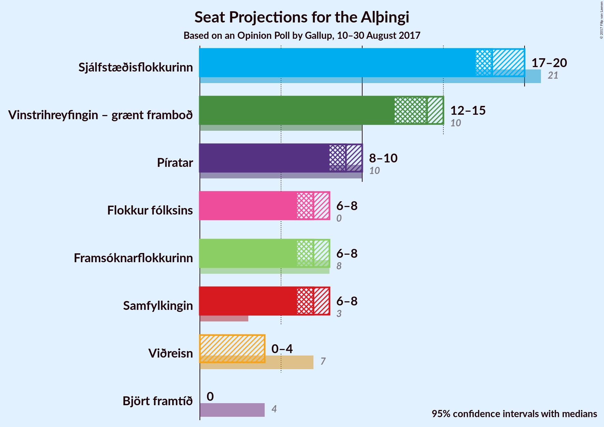
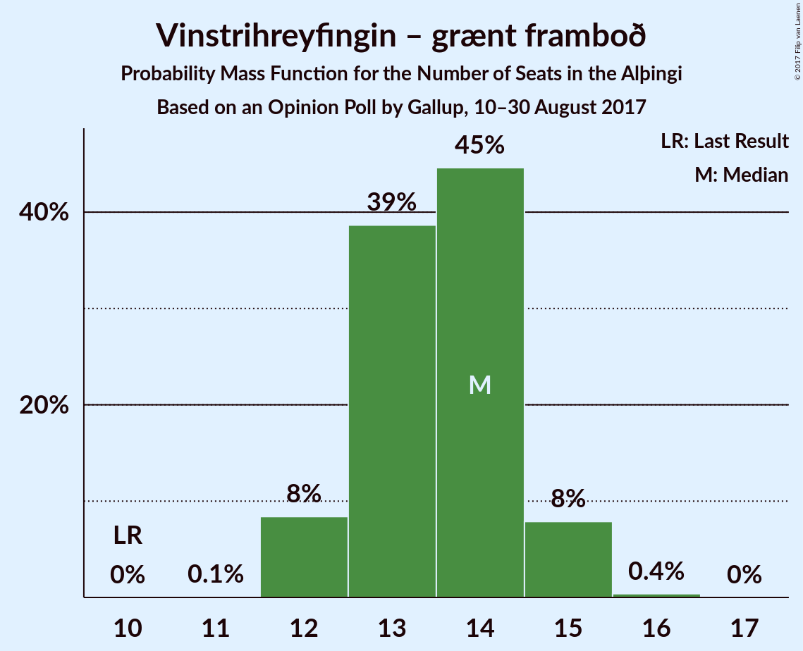
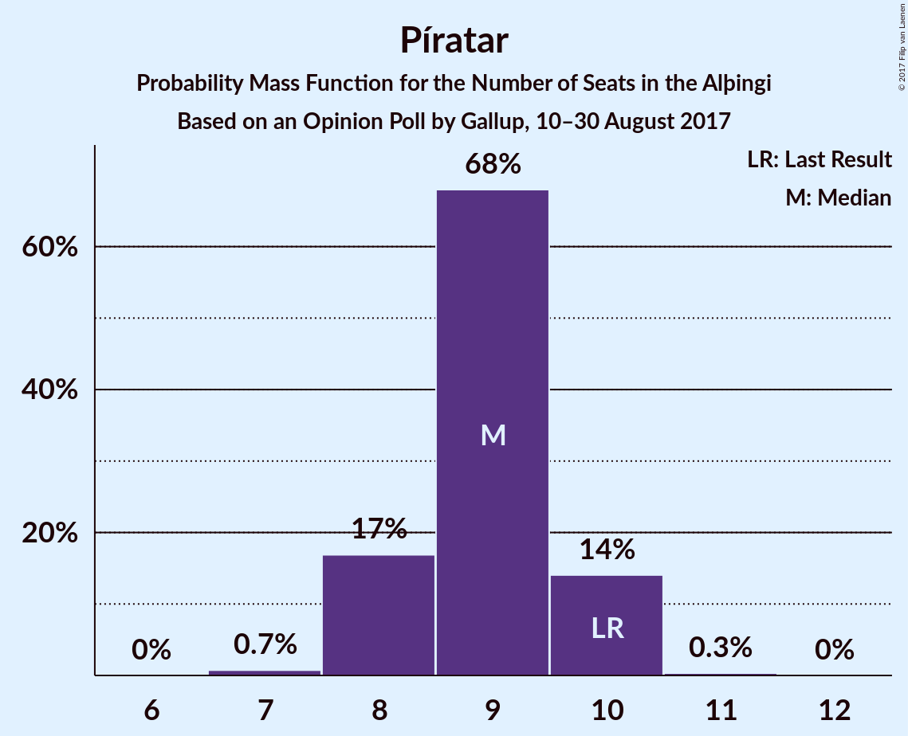
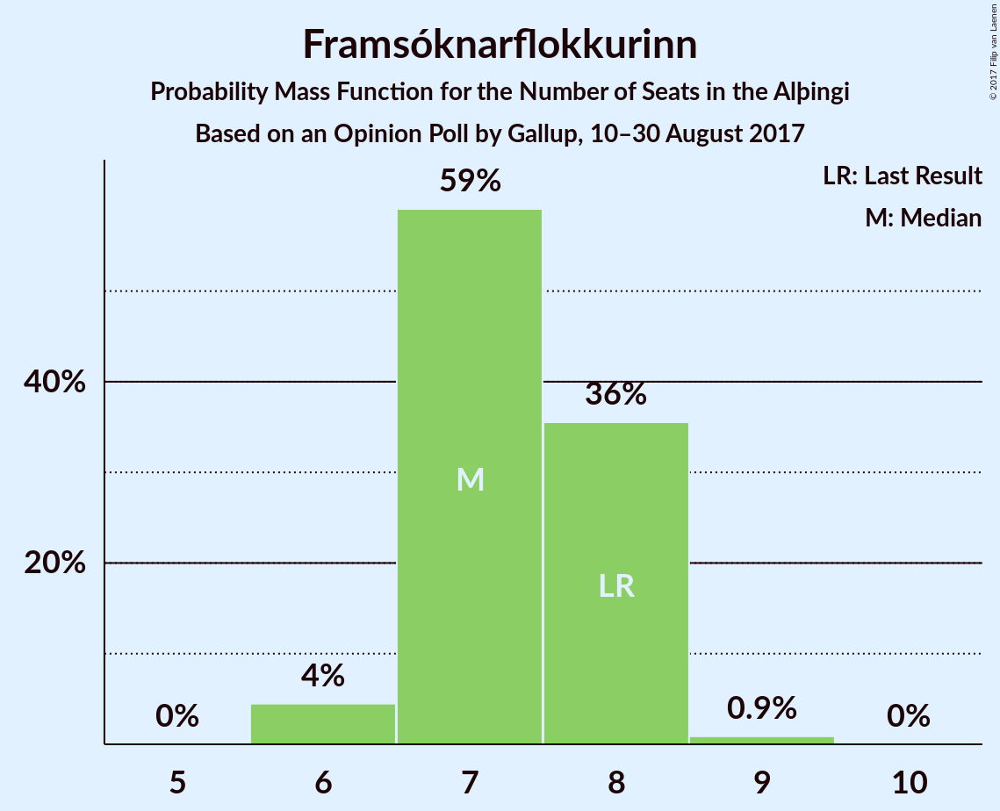
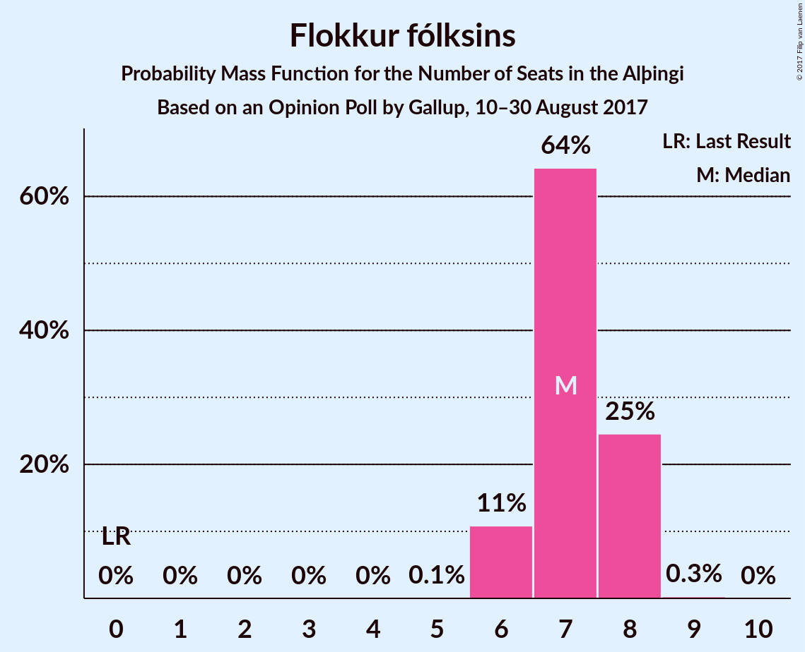
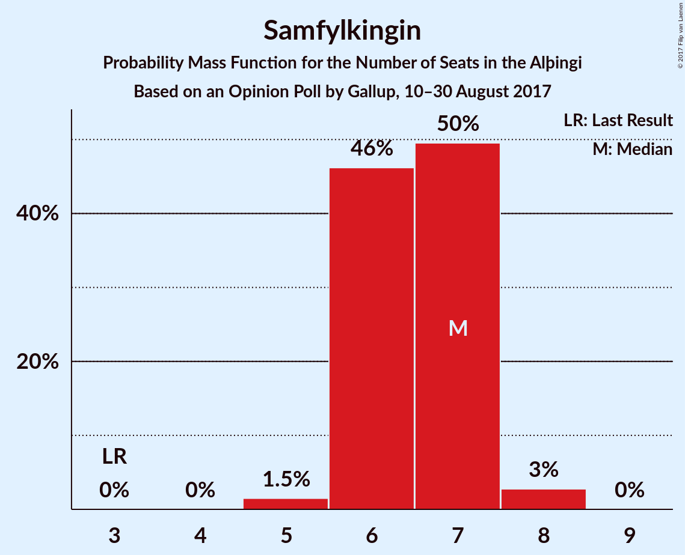
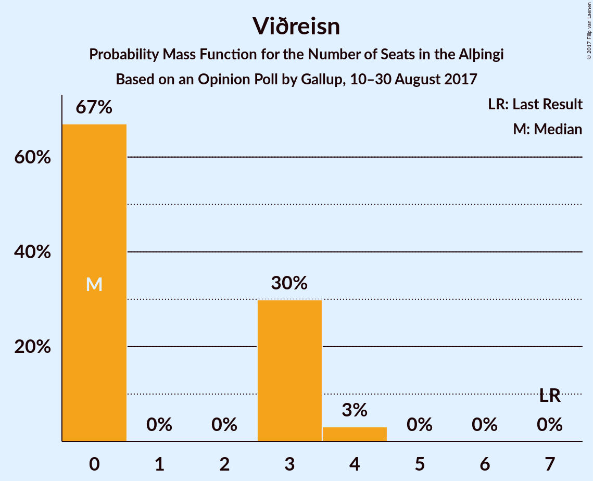
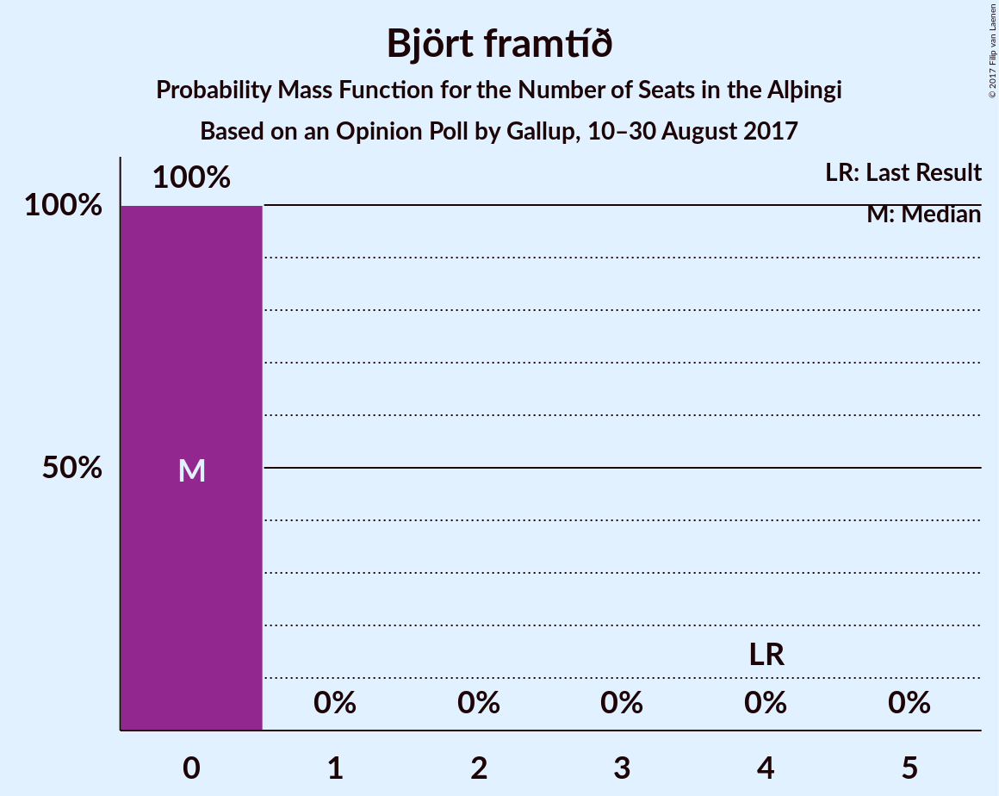

# Opinion Poll by Gallup, 10–30 August 2017

<a href="#voting-intentions">Voting Intentions</a> | <a href="#seats">Seats</a> | <a href="#coalitions">Coalitions</a> | <a href="#technical-information">Technical Information</a>

## Voting Intentions

### Confidence Intervals

| Party | Last Result | Poll Result | 80% Confidence Interval | 90% Confidence Interval | 95% Confidence Interval | 99% Confidence Interval |
|:-----:|:-----------:|:-----------:|:-----------------------:|:-----------------------:|:-----------------------:|:-----------------------:|
| Sjálfstæðisflokkurinn | 29.0% | 26.3% | 25.1–27.5% |24.8–27.9% |24.5–28.2% |23.9–28.8% |
| Vinstrihreyfingin – grænt framboð | 15.9% | 19.5% | 18.5–20.6% |18.2–21.0% |17.9–21.2% |17.4–21.8% |
| Píratar | 14.5% | 13.1% | 12.2–14.1% |12.0–14.4% |11.8–14.6% |11.4–15.1% |
| Framsóknarflokkurinn | 11.5% | 10.8% | 10.0–11.7% |9.8–12.0% |9.6–12.2% |9.2–12.6% |
| Flokkur fólksins | 3.5% | 10.6% | 9.8–11.5% |9.6–11.7% |9.4–11.9% |9.0–12.4% |
| Samfylkingin | 5.7% | 9.7% | 8.9–10.6% |8.7–10.8% |8.5–11.0% |8.2–11.4% |
| Viðreisn | 10.5% | 4.8% | 4.2–5.4% |4.1–5.6% |4.0–5.8% |3.7–6.1% |
| Björt framtíð | 7.2% | 2.8% | 2.4–3.3% |2.3–3.5% |2.2–3.6% |2.0–3.9% |

*Note:* The poll result column reflects the actual value used in the calculations. Published results may vary slightly, and in addition be rounded to fewer digits.

## Seats

### Confidence Intervals

| Party | Last Result | Median | 80% Confidence Interval | 90% Confidence Interval | 95% Confidence Interval | 99% Confidence Interval |
|:-----:|:-----------:|:------:|:-----------------------:|:-----------------------:|:-----------------------:|:-----------------------:|
| <a href="#sjálfstæðisflokkurinn">Sjálfstæðisflokkurinn</a> | 21 | 18 | 17–20 |17–20 |17–20 |16–20 |
| <a href="#vinstrihreyfingin-–-grænt-framboð">Vinstrihreyfingin – grænt framboð</a> | 10 | 14 | 13–14 |12–15 |12–15 |12–15 |
| <a href="#píratar">Píratar</a> | 10 | 9 | 8–10 |8–10 |8–10 |7–10 |
| <a href="#framsóknarflokkurinn">Framsóknarflokkurinn</a> | 8 | 7 | 7–8 |7–8 |6–8 |6–9 |
| <a href="#flokkur-fólksins">Flokkur fólksins</a> | 0 | 7 | 6–8 |6–8 |6–8 |6–8 |
| <a href="#samfylkingin">Samfylkingin</a> | 3 | 7 | 6–7 |6–7 |6–8 |5–8 |
| <a href="#viðreisn">Viðreisn</a> | 7 | 0 | 0–3 |0–3 |0–4 |0–4 |
| <a href="#björt-framtíð">Björt framtíð</a> | 4 | 0 | 0 |0 |0 |0 |

### Sjálfstæðisflokkurinn

*For a full overview of the results for this party, see the [Sjálfstæðisflokkurinn](party-sjlfstisflokkurinn.html) page.*

| Number of Seats | Probability | Accumulated | Special Marks |
|:---------------:|:-----------:|:-----------:|:-------------:|
| 16 | 0.6% | 100% |  |
| 17 | 13% | 99.4% |  |
| 18 | 38% | 86% | Median |
| 19 | 34% | 48% |  |
| 20 | 13% | 14% |  |
| 21 | 0.3% | 0.3% | Last Result |
| 22 | 0% | 0% |  |

### Vinstrihreyfingin – grænt framboð

*For a full overview of the results for this party, see the [Vinstrihreyfingin – grænt framboð](party-vinstrihreyfingingrntframbo.html) page.*

| Number of Seats | Probability | Accumulated | Special Marks |
|:---------------:|:-----------:|:-----------:|:-------------:|
| 10 | 0% | 100% | Last Result |
| 11 | 0.1% | 100% |  |
| 12 | 8% | 99.9% |  |
| 13 | 39% | 92% |  |
| 14 | 45% | 53% | Median |
| 15 | 8% | 8% |  |
| 16 | 0.4% | 0.4% |  |
| 17 | 0% | 0% |  |

### Píratar

*For a full overview of the results for this party, see the [Píratar](party-pratar.html) page.*

| Number of Seats | Probability | Accumulated | Special Marks |
|:---------------:|:-----------:|:-----------:|:-------------:|
| 7 | 0.7% | 100% |  |
| 8 | 17% | 99.3% |  |
| 9 | 68% | 82% | Median |
| 10 | 14% | 14% | Last Result |
| 11 | 0.3% | 0.3% |  |
| 12 | 0% | 0% |  |

### Framsóknarflokkurinn

*For a full overview of the results for this party, see the [Framsóknarflokkurinn](party-framsknarflokkurinn.html) page.*

| Number of Seats | Probability | Accumulated | Special Marks |
|:---------------:|:-----------:|:-----------:|:-------------:|
| 6 | 4% | 100% |  |
| 7 | 59% | 95% | Median |
| 8 | 36% | 36% | Last Result |
| 9 | 0.9% | 0.9% |  |
| 10 | 0% | 0% |  |

### Flokkur fólksins

*For a full overview of the results for this party, see the [Flokkur fólksins](party-flokkurflksins.html) page.*

| Number of Seats | Probability | Accumulated | Special Marks |
|:---------------:|:-----------:|:-----------:|:-------------:|
| 0 | 0% | 100% | Last Result |
| 1 | 0% | 100% |  |
| 2 | 0% | 100% |  |
| 3 | 0% | 100% |  |
| 4 | 0% | 100% |  |
| 5 | 0.1% | 100% |  |
| 6 | 11% | 99.9% |  |
| 7 | 64% | 89% | Median |
| 8 | 25% | 25% |  |
| 9 | 0.3% | 0.3% |  |
| 10 | 0% | 0% |  |

### Samfylkingin

*For a full overview of the results for this party, see the [Samfylkingin](party-samfylkingin.html) page.*

| Number of Seats | Probability | Accumulated | Special Marks |
|:---------------:|:-----------:|:-----------:|:-------------:|
| 3 | 0% | 100% | Last Result |
| 4 | 0% | 100% |  |
| 5 | 1.5% | 100% |  |
| 6 | 46% | 98.5% |  |
| 7 | 50% | 52% | Median |
| 8 | 3% | 3% |  |
| 9 | 0% | 0% |  |

### Viðreisn

*For a full overview of the results for this party, see the [Viðreisn](party-vireisn.html) page.*

| Number of Seats | Probability | Accumulated | Special Marks |
|:---------------:|:-----------:|:-----------:|:-------------:|
| 0 | 67% | 100% | Median |
| 1 | 0% | 33% |  |
| 2 | 0% | 33% |  |
| 3 | 30% | 33% |  |
| 4 | 3% | 3% |  |
| 5 | 0% | 0% |  |
| 6 | 0% | 0% |  |
| 7 | 0% | 0% | Last Result |

### Björt framtíð

*For a full overview of the results for this party, see the [Björt framtíð](party-bjrtframt.html) page.*

| Number of Seats | Probability | Accumulated | Special Marks |
|:---------------:|:-----------:|:-----------:|:-------------:|
| 0 | 100% | 100% | Median |
| 1 | 0% | 0% |  |
| 2 | 0% | 0% |  |
| 3 | 0% | 0% |  |
| 4 | 0% | 0% | Last Result |

## Coalitions

### Confidence Intervals

| Coalition | Last Result | Median | Majority? | 80% Confidence Interval | 90% Confidence Interval | 95% Confidence Interval | 99% Confidence Interval |
|:---------:|:-----------:|:------:|:---------:|:-----------------------:|:-----------------------:|:-----------------------:|:-----------------------:|
| Sjálfstæðisflokkurinn – Vinstrihreyfingin – grænt framboð | 31 | 32 | 69% | 30–34 | 30–34 | 30–34 | 29–34 |
| Vinstrihreyfingin – grænt framboð – Píratar – Samfylkingin – Viðreisn – Björt framtíð | 34 | 30 | 14% | 29–32 | 29–32 | 28–32 | 27–33 |
| Vinstrihreyfingin – grænt framboð – Píratar – Samfylkingin – Viðreisn | 30 | 30 | 14% | 29–32 | 29–32 | 28–32 | 27–33 |
| Vinstrihreyfingin – grænt framboð – Píratar – Samfylkingin – Björt framtíð | 27 | 29 | 0.3% | 28–30 | 27–31 | 27–31 | 26–31 |
| Vinstrihreyfingin – grænt framboð – Píratar – Samfylkingin | 23 | 29 | 0.3% | 28–30 | 27–31 | 27–31 | 26–31 |
| Vinstrihreyfingin – grænt framboð – Framsóknarflokkurinn – Samfylkingin | 21 | 27 | 0% | 26–29 | 26–29 | 25–29 | 25–30 |
| Sjálfstæðisflokkurinn – Framsóknarflokkurinn | 29 | 26 | 0% | 24–27 | 24–27 | 24–27 | 23–28 |
| Sjálfstæðisflokkurinn – Samfylkingin | 24 | 25 | 0% | 24–26 | 23–27 | 23–27 | 23–27 |
| Vinstrihreyfingin – grænt framboð – Píratar | 20 | 23 | 0% | 21–24 | 21–24 | 21–24 | 20–25 |
| Vinstrihreyfingin – grænt framboð – Framsóknarflokkurinn | 18 | 21 | 0% | 20–22 | 19–22 | 19–23 | 19–23 |
| Sjálfstæðisflokkurinn – Viðreisn – Björt framtíð | 32 | 19 | 0% | 18–21 | 18–22 | 18–22 | 17–23 |
| Vinstrihreyfingin – grænt framboð – Samfylkingin | 13 | 20 | 0% | 19–21 | 18–22 | 18–22 | 18–22 |
| Sjálfstæðisflokkurinn – Viðreisn | 28 | 19 | 0% | 18–21 | 18–22 | 18–22 | 17–23 |
| Sjálfstæðisflokkurinn – Björt framtíð | 25 | 18 | 0% | 17–20 | 17–20 | 17–20 | 16–20 |

### Sjálfstæðisflokkurinn – Vinstrihreyfingin – grænt framboð

| Number of Seats | Probability | Accumulated | Special Marks |
|:---------------:|:-----------:|:-----------:|:-------------:|
| 29 | 1.0% | 100% |  |
| 30 | 12% | 99.0% |  |
| 31 | 18% | 87% | Last Result |
| 32 | 34% | 69% | Median, Majority |
| 33 | 24% | 35% |  |
| 34 | 10% | 11% |  |
| 35 | 0.3% | 0.3% |  |
| 36 | 0% | 0% |  |

### Vinstrihreyfingin – grænt framboð – Píratar – Samfylkingin – Viðreisn – Björt framtíð

| Number of Seats | Probability | Accumulated | Special Marks |
|:---------------:|:-----------:|:-----------:|:-------------:|
| 27 | 0.7% | 100% |  |
| 28 | 4% | 99.3% |  |
| 29 | 35% | 96% |  |
| 30 | 27% | 61% | Median |
| 31 | 20% | 34% |  |
| 32 | 13% | 14% | Majority |
| 33 | 1.2% | 1.3% |  |
| 34 | 0.1% | 0.1% | Last Result |
| 35 | 0% | 0% |  |

### Vinstrihreyfingin – grænt framboð – Píratar – Samfylkingin – Viðreisn

| Number of Seats | Probability | Accumulated | Special Marks |
|:---------------:|:-----------:|:-----------:|:-------------:|
| 27 | 0.7% | 100% |  |
| 28 | 4% | 99.3% |  |
| 29 | 35% | 96% |  |
| 30 | 27% | 61% | Last Result, Median |
| 31 | 20% | 34% |  |
| 32 | 13% | 14% | Majority |
| 33 | 1.2% | 1.3% |  |
| 34 | 0.1% | 0.1% |  |
| 35 | 0% | 0% |  |

### Vinstrihreyfingin – grænt framboð – Píratar – Samfylkingin – Björt framtíð

| Number of Seats | Probability | Accumulated | Special Marks |
|:---------------:|:-----------:|:-----------:|:-------------:|
| 26 | 1.0% | 100% |  |
| 27 | 8% | 99.0% | Last Result |
| 28 | 16% | 91% |  |
| 29 | 45% | 75% |  |
| 30 | 22% | 30% | Median |
| 31 | 8% | 8% |  |
| 32 | 0.3% | 0.3% | Majority |
| 33 | 0% | 0% |  |

### Vinstrihreyfingin – grænt framboð – Píratar – Samfylkingin

| Number of Seats | Probability | Accumulated | Special Marks |
|:---------------:|:-----------:|:-----------:|:-------------:|
| 23 | 0% | 100% | Last Result |
| 24 | 0% | 100% |  |
| 25 | 0% | 100% |  |
| 26 | 1.0% | 100% |  |
| 27 | 8% | 99.0% |  |
| 28 | 16% | 91% |  |
| 29 | 45% | 75% |  |
| 30 | 22% | 30% | Median |
| 31 | 8% | 8% |  |
| 32 | 0.3% | 0.3% | Majority |
| 33 | 0% | 0% |  |

### Vinstrihreyfingin – grænt framboð – Framsóknarflokkurinn – Samfylkingin

| Number of Seats | Probability | Accumulated | Special Marks |
|:---------------:|:-----------:|:-----------:|:-------------:|
| 21 | 0% | 100% | Last Result |
| 22 | 0% | 100% |  |
| 23 | 0% | 100% |  |
| 24 | 0.1% | 100% |  |
| 25 | 4% | 99.9% |  |
| 26 | 16% | 96% |  |
| 27 | 32% | 80% |  |
| 28 | 34% | 48% | Median |
| 29 | 13% | 14% |  |
| 30 | 1.5% | 1.5% |  |
| 31 | 0% | 0% |  |

### Sjálfstæðisflokkurinn – Framsóknarflokkurinn

| Number of Seats | Probability | Accumulated | Special Marks |
|:---------------:|:-----------:|:-----------:|:-------------:|
| 23 | 0.6% | 100% |  |
| 24 | 11% | 99.4% |  |
| 25 | 27% | 88% | Median |
| 26 | 31% | 61% |  |
| 27 | 28% | 30% |  |
| 28 | 2% | 2% |  |
| 29 | 0.1% | 0.1% | Last Result |
| 30 | 0% | 0% |  |

### Sjálfstæðisflokkurinn – Samfylkingin

| Number of Seats | Probability | Accumulated | Special Marks |
|:---------------:|:-----------:|:-----------:|:-------------:|
| 22 | 0.3% | 100% |  |
| 23 | 8% | 99.6% |  |
| 24 | 20% | 91% | Last Result |
| 25 | 39% | 71% | Median |
| 26 | 27% | 33% |  |
| 27 | 6% | 6% |  |
| 28 | 0.2% | 0.2% |  |
| 29 | 0% | 0% |  |

### Vinstrihreyfingin – grænt framboð – Píratar

| Number of Seats | Probability | Accumulated | Special Marks |
|:---------------:|:-----------:|:-----------:|:-------------:|
| 20 | 1.4% | 100% | Last Result |
| 21 | 12% | 98.6% |  |
| 22 | 36% | 87% |  |
| 23 | 39% | 51% | Median |
| 24 | 11% | 12% |  |
| 25 | 1.0% | 1.0% |  |
| 26 | 0% | 0% |  |

### Vinstrihreyfingin – grænt framboð – Framsóknarflokkurinn

| Number of Seats | Probability | Accumulated | Special Marks |
|:---------------:|:-----------:|:-----------:|:-------------:|
| 18 | 0.2% | 100% | Last Result |
| 19 | 8% | 99.8% |  |
| 20 | 23% | 92% |  |
| 21 | 48% | 70% | Median |
| 22 | 19% | 22% |  |
| 23 | 3% | 3% |  |
| 24 | 0% | 0% |  |

### Sjálfstæðisflokkurinn – Viðreisn – Björt framtíð

| Number of Seats | Probability | Accumulated | Special Marks |
|:---------------:|:-----------:|:-----------:|:-------------:|
| 17 | 2% | 100% |  |
| 18 | 23% | 98% | Median |
| 19 | 29% | 75% |  |
| 20 | 23% | 46% |  |
| 21 | 15% | 23% |  |
| 22 | 8% | 8% |  |
| 23 | 0.6% | 0.6% |  |
| 24 | 0% | 0% |  |
| 25 | 0% | 0% |  |
| 26 | 0% | 0% |  |
| 27 | 0% | 0% |  |
| 28 | 0% | 0% |  |
| 29 | 0% | 0% |  |
| 30 | 0% | 0% |  |
| 31 | 0% | 0% |  |
| 32 | 0% | 0% | Last Result, Majority |

### Vinstrihreyfingin – grænt framboð – Samfylkingin

| Number of Seats | Probability | Accumulated | Special Marks |
|:---------------:|:-----------:|:-----------:|:-------------:|
| 13 | 0% | 100% | Last Result |
| 14 | 0% | 100% |  |
| 15 | 0% | 100% |  |
| 16 | 0% | 100% |  |
| 17 | 0.1% | 100% |  |
| 18 | 6% | 99.9% |  |
| 19 | 21% | 94% |  |
| 20 | 42% | 74% |  |
| 21 | 26% | 32% | Median |
| 22 | 6% | 6% |  |
| 23 | 0.1% | 0.1% |  |
| 24 | 0% | 0% |  |

### Sjálfstæðisflokkurinn – Viðreisn

| Number of Seats | Probability | Accumulated | Special Marks |
|:---------------:|:-----------:|:-----------:|:-------------:|
| 17 | 2% | 100% |  |
| 18 | 23% | 98% | Median |
| 19 | 29% | 75% |  |
| 20 | 23% | 46% |  |
| 21 | 15% | 23% |  |
| 22 | 8% | 8% |  |
| 23 | 0.6% | 0.6% |  |
| 24 | 0% | 0% |  |
| 25 | 0% | 0% |  |
| 26 | 0% | 0% |  |
| 27 | 0% | 0% |  |
| 28 | 0% | 0% | Last Result |

### Sjálfstæðisflokkurinn – Björt framtíð

| Number of Seats | Probability | Accumulated | Special Marks |
|:---------------:|:-----------:|:-----------:|:-------------:|
| 16 | 0.6% | 100% |  |
| 17 | 13% | 99.4% |  |
| 18 | 38% | 86% | Median |
| 19 | 34% | 48% |  |
| 20 | 13% | 14% |  |
| 21 | 0.3% | 0.3% |  |
| 22 | 0% | 0% |  |
| 23 | 0% | 0% |  |
| 24 | 0% | 0% |  |
| 25 | 0% | 0% | Last Result |

## Technical Information

### Opinion Poll

+ **Polling firm:** Gallup
+ **Commissioner(s):** —
+ **Fieldwork period:** 10–30 August 2017

### Calculations

+ **Sample size:** 2173
+ **Simulations done:** 1,048,576
+ **Error estimate:** 0.53%

