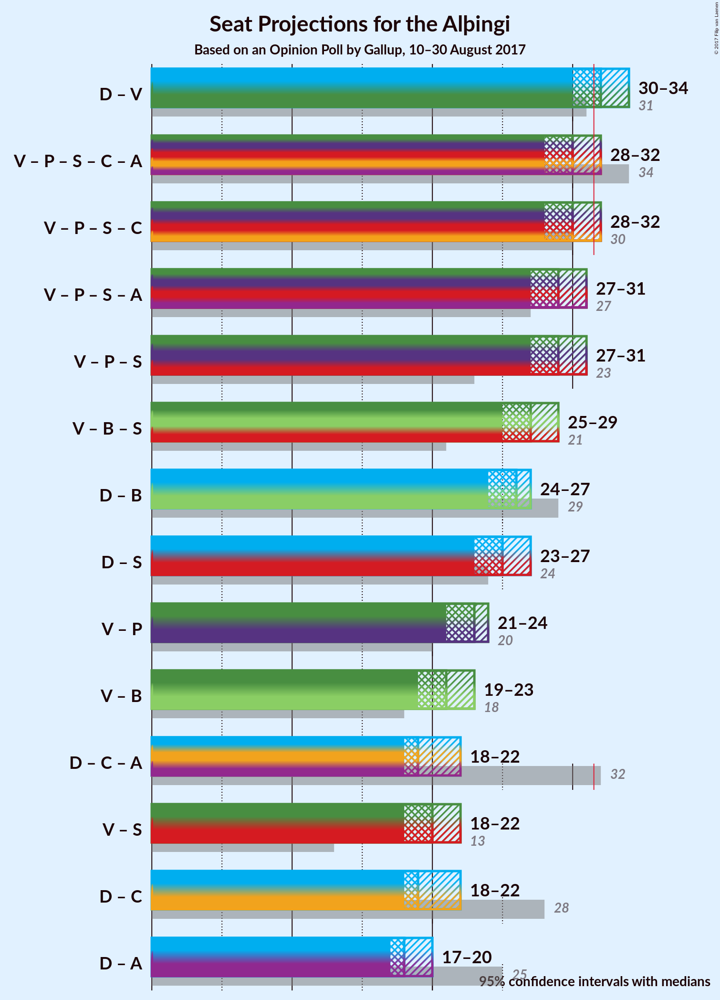

# Opinion Poll by Gallup, 10–30 August 2017

<a href="#voting-intentions">Voting Intentions</a> | <a href="#seats">Seats</a> | <a href="#coalitions">Coalitions</a> | <a href="#technical-information">Technical Information</a>

## Voting Intentions

### Confidence Intervals

| Party | Last Result | Poll Result | 80% Confidence Interval | 90% Confidence Interval | 95% Confidence Interval | 99% Confidence Interval |
|:-----:|:-----------:|:-----------:|:-----------------------:|:-----------------------:|:-----------------------:|:-----------------------:|
| Sjálfstæðisflokkurinn | 29.0% | 26.3% | 25.1–27.5% |24.8–27.9% |24.5–28.2% |23.9–28.8% |
| Vinstrihreyfingin – grænt framboð | 15.9% | 19.5% | 18.5–20.6% |18.2–21.0% |17.9–21.2% |17.4–21.8% |
| Píratar | 14.5% | 13.1% | 12.2–14.1% |12.0–14.4% |11.8–14.6% |11.4–15.1% |
| Framsóknarflokkurinn | 11.5% | 10.8% | 10.0–11.7% |9.8–12.0% |9.6–12.2% |9.2–12.6% |
| Flokkur fólksins | 3.5% | 10.6% | 9.8–11.5% |9.6–11.7% |9.4–11.9% |9.0–12.4% |
| Samfylkingin | 5.7% | 9.7% | 8.9–10.6% |8.7–10.8% |8.5–11.0% |8.2–11.4% |
| Viðreisn | 10.5% | 4.8% | 4.2–5.4% |4.1–5.6% |4.0–5.8% |3.7–6.1% |
| Björt framtíð | 7.2% | 2.8% | 2.4–3.3% |2.3–3.5% |2.2–3.6% |2.0–3.9% |

*Note:* The poll result column reflects the actual value used in the calculations. Published results may vary slightly, and in addition be rounded to fewer digits.

## Seats

### Confidence Intervals

| Party | Last Result | Median | 80% Confidence Interval | 90% Confidence Interval | 95% Confidence Interval | 99% Confidence Interval |
|:-----:|:-----------:|:------:|:-----------------------:|:-----------------------:|:-----------------------:|:-----------------------:|
| <a href="#sjálfstæðisflokkurinn">Sjálfstæðisflokkurinn</a> | 21 | 19 | 17–19 |17–19 |17–20 |17–20 |
| <a href="#vinstrihreyfingin-–-grænt-framboð">Vinstrihreyfingin – grænt framboð</a> | 10 | 13 | 13–14 |13–15 |12–16 |12–16 |
| <a href="#píratar">Píratar</a> | 10 | 9 | 8–10 |8–10 |8–10 |7–11 |
| <a href="#framsóknarflokkurinn">Framsóknarflokkurinn</a> | 8 | 8 | 7–8 |7–8 |6–8 |6–8 |
| <a href="#flokkur-fólksins">Flokkur fólksins</a> | 0 | 7 | 6–8 |6–8 |6–8 |6–8 |
| <a href="#samfylkingin">Samfylkingin</a> | 3 | 7 | 6–7 |6–7 |6–7 |5–8 |
| <a href="#viðreisn">Viðreisn</a> | 7 | 0 | 0–3 |0–3 |0–3 |0–4 |
| <a href="#björt-framtíð">Björt framtíð</a> | 4 | 0 | 0 |0 |0 |0 |

### Sjálfstæðisflokkurinn

*For a full overview of the results for this party, see the [Sjálfstæðisflokkurinn](party-sjlfstisflokkurinn.html) page.*

| Number of Seats | Probability | Accumulated | Special Marks |
|:---------------:|:-----------:|:-----------:|:-------------:|
| 16 | 0.5% | 100% |  |
| 17 | 14% | 99.5% |  |
| 18 | 21% | 86% |  |
| 19 | 61% | 65% | Median |
| 20 | 4% | 4% |  |
| 21 | 0.4% | 0.4% | Last Result |
| 22 | 0% | 0% |  |

### Vinstrihreyfingin – grænt framboð

*For a full overview of the results for this party, see the [Vinstrihreyfingin – grænt framboð](party-vinstrihreyfingingrntframbo.html) page.*

| Number of Seats | Probability | Accumulated | Special Marks |
|:---------------:|:-----------:|:-----------:|:-------------:|
| 10 | 0% | 100% | Last Result |
| 11 | 0.1% | 100% |  |
| 12 | 3% | 99.9% |  |
| 13 | 76% | 97% | Median |
| 14 | 14% | 21% |  |
| 15 | 3% | 7% |  |
| 16 | 4% | 4% |  |
| 17 | 0% | 0% |  |

### Píratar

*For a full overview of the results for this party, see the [Píratar](party-pratar.html) page.*

| Number of Seats | Probability | Accumulated | Special Marks |
|:---------------:|:-----------:|:-----------:|:-------------:|
| 7 | 0.7% | 100% |  |
| 8 | 13% | 99.3% |  |
| 9 | 71% | 87% | Median |
| 10 | 14% | 16% | Last Result |
| 11 | 2% | 2% |  |
| 12 | 0% | 0% |  |

### Framsóknarflokkurinn

*For a full overview of the results for this party, see the [Framsóknarflokkurinn](party-framsknarflokkurinn.html) page.*

| Number of Seats | Probability | Accumulated | Special Marks |
|:---------------:|:-----------:|:-----------:|:-------------:|
| 6 | 3% | 100% |  |
| 7 | 37% | 97% |  |
| 8 | 60% | 60% | Last Result, Median |
| 9 | 0.2% | 0.3% |  |
| 10 | 0% | 0% |  |

### Flokkur fólksins

*For a full overview of the results for this party, see the [Flokkur fólksins](party-flokkurflksins.html) page.*

| Number of Seats | Probability | Accumulated | Special Marks |
|:---------------:|:-----------:|:-----------:|:-------------:|
| 0 | 0% | 100% | Last Result |
| 1 | 0% | 100% |  |
| 2 | 0% | 100% |  |
| 3 | 0% | 100% |  |
| 4 | 0% | 100% |  |
| 5 | 0% | 100% |  |
| 6 | 16% | 100% |  |
| 7 | 61% | 84% | Median |
| 8 | 23% | 24% |  |
| 9 | 0.2% | 0.2% |  |
| 10 | 0% | 0% |  |

### Samfylkingin

*For a full overview of the results for this party, see the [Samfylkingin](party-samfylkingin.html) page.*

| Number of Seats | Probability | Accumulated | Special Marks |
|:---------------:|:-----------:|:-----------:|:-------------:|
| 3 | 0% | 100% | Last Result |
| 4 | 0% | 100% |  |
| 5 | 1.3% | 100% |  |
| 6 | 43% | 98.7% |  |
| 7 | 54% | 55% | Median |
| 8 | 2% | 2% |  |
| 9 | 0% | 0% |  |

### Viðreisn

*For a full overview of the results for this party, see the [Viðreisn](party-vireisn.html) page.*

| Number of Seats | Probability | Accumulated | Special Marks |
|:---------------:|:-----------:|:-----------:|:-------------:|
| 0 | 70% | 100% | Median |
| 1 | 0% | 30% |  |
| 2 | 0% | 30% |  |
| 3 | 28% | 30% |  |
| 4 | 2% | 2% |  |
| 5 | 0% | 0% |  |
| 6 | 0% | 0% |  |
| 7 | 0% | 0% | Last Result |

### Björt framtíð

*For a full overview of the results for this party, see the [Björt framtíð](party-bjrtframt.html) page.*

| Number of Seats | Probability | Accumulated | Special Marks |
|:---------------:|:-----------:|:-----------:|:-------------:|
| 0 | 100% | 100% | Median |
| 1 | 0% | 0% |  |
| 2 | 0% | 0% |  |
| 3 | 0% | 0% |  |
| 4 | 0% | 0% | Last Result |

## Coalitions

### Confidence Intervals

| Coalition | Last Result | Median | Majority? | 80% Confidence Interval | 90% Confidence Interval | 95% Confidence Interval | 99% Confidence Interval |
|:---------:|:-----------:|:------:|:---------:|:-----------------------:|:-----------------------:|:-----------------------:|:-----------------------:|
| Vinstrihreyfingin – grænt framboð – Píratar – Samfylkingin – Viðreisn – Björt framtíð | 34 | 30 | 5% | 29–31 | 28–31 | 28–32 | 28–32 |
| Sjálfstæðisflokkurinn – Samfylkingin | 24 | 25 | 0% | 23–26 | 23–26 | 23–27 | 22–27 |
| Sjálfstæðisflokkurinn – Viðreisn – Björt framtíð | 32 | 19 | 0% | 18–22 | 18–22 | 18–22 | 17–23 |
| Vinstrihreyfingin – grænt framboð – Samfylkingin | 13 | 20 | 0% | 19–21 | 19–22 | 18–22 | 18–22 |

### Vinstrihreyfingin – grænt framboð – Píratar – Samfylkingin – Viðreisn – Björt framtíð

| Number of Seats | Probability | Accumulated | Special Marks |
|:---------------:|:-----------:|:-----------:|:-------------:|
| 27 | 0.1% | 100% |  |
| 28 | 6% | 99.9% |  |
| 29 | 42% | 94% | Median |
| 30 | 22% | 52% |  |
| 31 | 25% | 30% |  |
| 32 | 4% | 5% | Majority |
| 33 | 0.3% | 0.4% |  |
| 34 | 0.1% | 0.1% | Last Result |
| 35 | 0% | 0% |  |

### Sjálfstæðisflokkurinn – Samfylkingin

| Number of Seats | Probability | Accumulated | Special Marks |
|:---------------:|:-----------:|:-----------:|:-------------:|
| 22 | 0.8% | 100% |  |
| 23 | 12% | 99.2% |  |
| 24 | 10% | 87% | Last Result |
| 25 | 34% | 77% |  |
| 26 | 39% | 43% | Median |
| 27 | 4% | 4% |  |
| 28 | 0.3% | 0.3% |  |
| 29 | 0% | 0% |  |

### Sjálfstæðisflokkurinn – Viðreisn – Björt framtíð

| Number of Seats | Probability | Accumulated | Special Marks |
|:---------------:|:-----------:|:-----------:|:-------------:|
| 17 | 1.1% | 100% |  |
| 18 | 16% | 98.9% |  |
| 19 | 49% | 83% | Median |
| 20 | 16% | 33% |  |
| 21 | 4% | 18% |  |
| 22 | 13% | 14% |  |
| 23 | 0.9% | 0.9% |  |
| 24 | 0% | 0% |  |
| 25 | 0% | 0% |  |
| 26 | 0% | 0% |  |
| 27 | 0% | 0% |  |
| 28 | 0% | 0% |  |
| 29 | 0% | 0% |  |
| 30 | 0% | 0% |  |
| 31 | 0% | 0% |  |
| 32 | 0% | 0% | Last Result, Majority |

### Vinstrihreyfingin – grænt framboð – Samfylkingin

| Number of Seats | Probability | Accumulated | Special Marks |
|:---------------:|:-----------:|:-----------:|:-------------:|
| 13 | 0% | 100% | Last Result |
| 14 | 0% | 100% |  |
| 15 | 0% | 100% |  |
| 16 | 0% | 100% |  |
| 17 | 0% | 100% |  |
| 18 | 3% | 100% |  |
| 19 | 29% | 97% |  |
| 20 | 56% | 68% | Median |
| 21 | 5% | 12% |  |
| 22 | 7% | 7% |  |
| 23 | 0.3% | 0.3% |  |
| 24 | 0% | 0% |  |

## Technical Information

### Opinion Poll

+ **Pollster:** Gallup
+ **Media:** —
+ **Fieldwork period:** 10–30 August 2017

### Calculations

+ **Sample size:** 2173
+ **Simulations done:** 65,536
+ **Error estimate:** 1.84%

