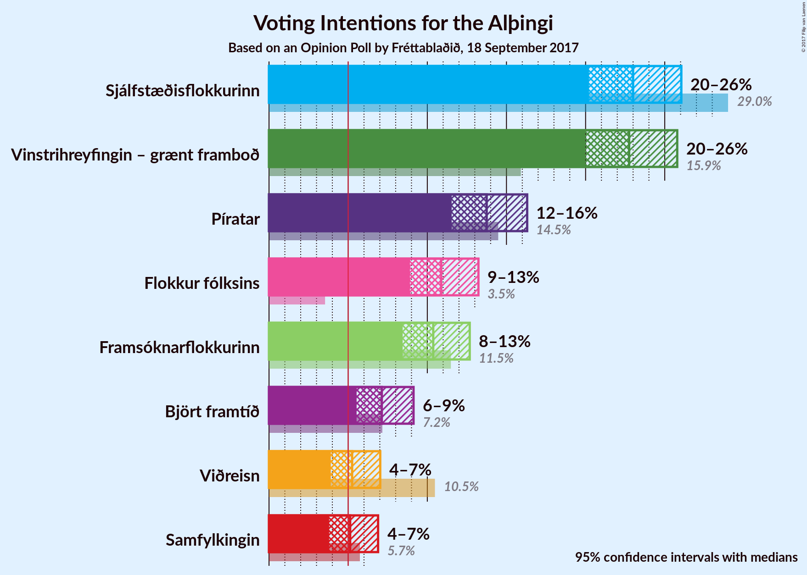

# Opinion Poll by Fréttablaðið, 18 September 2017

<a href="#voting-intentions">Voting Intentions</a> | <a href="#seats">Seats</a> | <a href="#coalitions">Coalitions</a> | <a href="#technical-information">Technical Information</a>

## Voting Intentions

### Confidence Intervals

| Party | Last Result | Poll Result | 80% Confidence Interval | 90% Confidence Interval | 95% Confidence Interval | 99% Confidence Interval |
|:-----:|:-----------:|:-----------:|:-----------------------:|:-----------------------:|:-----------------------:|:-----------------------:|
| Sjálfstæðisflokkurinn | 29.0% | 23.0% | 21.2–25.0% |20.7–25.6% |20.2–26.0% |19.4–27.0% |
| Vinstrihreyfingin – grænt framboð | 15.9% | 22.8% | 20.9–24.7% |20.4–25.3% |20.0–25.8% |19.1–26.7% |
| Píratar | 14.5% | 13.8% | 12.3–15.4% |11.9–15.9% |11.5–16.3% |10.9–17.1% |
| Flokkur fólksins | 3.5% | 10.9% | 9.6–12.4% |9.2–12.8% |8.9–13.2% |8.3–14.0% |
| Framsóknarflokkurinn | 11.5% | 10.4% | 9.1–11.9% |8.7–12.3% |8.4–12.7% |7.9–13.4% |
| Björt framtíð | 7.2% | 7.1% | 6.1–8.4% |5.8–8.8% |5.5–9.1% |5.1–9.8% |
| Viðreisn | 10.5% | 5.2% | 4.4–6.4% |4.1–6.7% |3.9–7.0% |3.5–7.6% |
| Samfylkingin | 5.7% | 5.1% | 4.3–6.3% |4.0–6.6% |3.8–6.9% |3.4–7.5% |

*Note:* The poll result column reflects the actual value used in the calculations. Published results may vary slightly, and in addition be rounded to fewer digits.

## Seats

### Confidence Intervals

| Party | Last Result | Median | 80% Confidence Interval | 90% Confidence Interval | 95% Confidence Interval | 99% Confidence Interval |
|:-----:|:-----------:|:------:|:-----------------------:|:-----------------------:|:-----------------------:|:-----------------------:|
| <a href="#sjálfstæðisflokkurinn">Sjálfstæðisflokkurinn</a> | 21 | 15 | 14–17 |14–18 |14–18 |13–20 |
| <a href="#vinstrihreyfingin-–-grænt-framboð">Vinstrihreyfingin – grænt framboð</a> | 10 | 17 | 15–17 |14–18 |13–18 |12–19 |
| <a href="#píratar">Píratar</a> | 10 | 9 | 8–10 |8–11 |7–11 |7–12 |
| <a href="#flokkur-fólksins">Flokkur fólksins</a> | 0 | 7 | 6–8 |6–8 |5–9 |5–9 |
| <a href="#framsóknarflokkurinn">Framsóknarflokkurinn</a> | 8 | 7 | 6–8 |6–8 |5–9 |5–10 |
| <a href="#björt-framtíð">Björt framtíð</a> | 4 | 4 | 4–5 |3–6 |3–6 |1–6 |
| <a href="#viðreisn">Viðreisn</a> | 7 | 3 | 0–4 |0–4 |0–4 |0–5 |
| <a href="#samfylkingin">Samfylkingin</a> | 3 | 3 | 0–4 |0–4 |0–4 |0–5 |

### Sjálfstæðisflokkurinn

*For a full overview of the results for this party, see the [Sjálfstæðisflokkurinn](party-sjlfstisflokkurinn.html) page.*

| Number of Seats | Probability | Accumulated | Special Marks |
|:---------------:|:-----------:|:-----------:|:-------------:|
| 12 | 0.1% | 100% |  |
| 13 | 0.6% | 99.9% |  |
| 14 | 20% | 99.2% |  |
| 15 | 34% | 80% | Median |
| 16 | 29% | 45% |  |
| 17 | 11% | 17% |  |
| 18 | 3% | 5% |  |
| 19 | 2% | 2% |  |
| 20 | 0.5% | 0.5% |  |
| 21 | 0% | 0% | Last Result |

### Vinstrihreyfingin – grænt framboð

*For a full overview of the results for this party, see the [Vinstrihreyfingin – grænt framboð](party-vinstrihreyfingingrntframbo.html) page.*

| Number of Seats | Probability | Accumulated | Special Marks |
|:---------------:|:-----------:|:-----------:|:-------------:|
| 10 | 0% | 100% | Last Result |
| 11 | 0% | 100% |  |
| 12 | 0.7% | 100% |  |
| 13 | 2% | 99.3% |  |
| 14 | 3% | 97% |  |
| 15 | 12% | 94% |  |
| 16 | 31% | 82% |  |
| 17 | 46% | 52% | Median |
| 18 | 5% | 6% |  |
| 19 | 0.6% | 0.8% |  |
| 20 | 0.2% | 0.2% |  |
| 21 | 0% | 0% |  |

### Píratar

*For a full overview of the results for this party, see the [Píratar](party-pratar.html) page.*

| Number of Seats | Probability | Accumulated | Special Marks |
|:---------------:|:-----------:|:-----------:|:-------------:|
| 6 | 0.4% | 100% |  |
| 7 | 3% | 99.6% |  |
| 8 | 28% | 96% |  |
| 9 | 40% | 69% | Median |
| 10 | 20% | 29% | Last Result |
| 11 | 7% | 8% |  |
| 12 | 1.0% | 1.0% |  |
| 13 | 0% | 0% |  |

### Flokkur fólksins

*For a full overview of the results for this party, see the [Flokkur fólksins](party-flokkurflksins.html) page.*

| Number of Seats | Probability | Accumulated | Special Marks |
|:---------------:|:-----------:|:-----------:|:-------------:|
| 0 | 0% | 100% | Last Result |
| 1 | 0% | 100% |  |
| 2 | 0% | 100% |  |
| 3 | 0% | 100% |  |
| 4 | 0.1% | 100% |  |
| 5 | 4% | 99.9% |  |
| 6 | 19% | 95% |  |
| 7 | 50% | 77% | Median |
| 8 | 22% | 26% |  |
| 9 | 4% | 4% |  |
| 10 | 0.4% | 0.5% |  |
| 11 | 0% | 0% |  |

### Framsóknarflokkurinn

*For a full overview of the results for this party, see the [Framsóknarflokkurinn](party-framsknarflokkurinn.html) page.*

| Number of Seats | Probability | Accumulated | Special Marks |
|:---------------:|:-----------:|:-----------:|:-------------:|
| 4 | 0.3% | 100% |  |
| 5 | 5% | 99.7% |  |
| 6 | 37% | 95% |  |
| 7 | 41% | 58% | Median |
| 8 | 13% | 17% | Last Result |
| 9 | 2% | 3% |  |
| 10 | 0.8% | 1.0% |  |
| 11 | 0.2% | 0.2% |  |
| 12 | 0% | 0% |  |

### Björt framtíð

*For a full overview of the results for this party, see the [Björt framtíð](party-bjrtframt.html) page.*

| Number of Seats | Probability | Accumulated | Special Marks |
|:---------------:|:-----------:|:-----------:|:-------------:|
| 0 | 0.3% | 100% |  |
| 1 | 0.3% | 99.7% |  |
| 2 | 0% | 99.4% |  |
| 3 | 6% | 99.4% |  |
| 4 | 45% | 93% | Last Result, Median |
| 5 | 41% | 48% |  |
| 6 | 7% | 7% |  |
| 7 | 0.4% | 0.4% |  |
| 8 | 0% | 0% |  |

### Viðreisn

*For a full overview of the results for this party, see the [Viðreisn](party-vireisn.html) page.*

| Number of Seats | Probability | Accumulated | Special Marks |
|:---------------:|:-----------:|:-----------:|:-------------:|
| 0 | 39% | 100% |  |
| 1 | 0% | 61% |  |
| 2 | 0% | 61% |  |
| 3 | 42% | 61% | Median |
| 4 | 18% | 19% |  |
| 5 | 0.9% | 0.9% |  |
| 6 | 0% | 0% |  |
| 7 | 0% | 0% | Last Result |

### Samfylkingin

*For a full overview of the results for this party, see the [Samfylkingin](party-samfylkingin.html) page.*

| Number of Seats | Probability | Accumulated | Special Marks |
|:---------------:|:-----------:|:-----------:|:-------------:|
| 0 | 42% | 100% |  |
| 1 | 0% | 58% |  |
| 2 | 0.1% | 58% |  |
| 3 | 41% | 58% | Last Result, Median |
| 4 | 16% | 17% |  |
| 5 | 0.8% | 0.8% |  |
| 6 | 0% | 0% |  |

## Coalitions

### Confidence Intervals

| Coalition | Last Result | Median | Majority? | 80% Confidence Interval | 90% Confidence Interval | 95% Confidence Interval | 99% Confidence Interval |
|:---------:|:-----------:|:------:|:---------:|:-----------------------:|:-----------------------:|:-----------------------:|:-----------------------:|
| Vinstrihreyfingin – grænt framboð – Píratar – Björt framtíð – Viðreisn – Samfylkingin | 34 | 34 | 91% | 32–36 | 31–36 | 30–37 | 29–37 |
| Vinstrihreyfingin – grænt framboð – Píratar – Björt framtíð – Samfylkingin | 27 | 32 | 57% | 30–34 | 29–34 | 28–35 | 26–35 |
| Vinstrihreyfingin – grænt framboð – Píratar – Viðreisn – Samfylkingin | 30 | 29 | 12% | 27–32 | 26–32 | 26–33 | 24–33 |
| Vinstrihreyfingin – grænt framboð – Píratar – Samfylkingin | 23 | 27 | 0.2% | 25–30 | 24–30 | 24–30 | 22–31 |
| Vinstrihreyfingin – grænt framboð – Píratar | 20 | 25 | 0% | 24–27 | 22–27 | 22–28 | 21–28 |
| Sjálfstæðisflokkurinn – Björt framtíð – Viðreisn | 32 | 22 | 0% | 20–24 | 19–25 | 18–26 | 18–27 |
| Sjálfstæðisflokkurinn – Björt framtíð | 25 | 20 | 0% | 18–22 | 18–22 | 17–23 | 17–24 |
| Vinstrihreyfingin – grænt framboð – Samfylkingin | 13 | 18 | 0% | 16–20 | 15–21 | 15–21 | 13–22 |
| Sjálfstæðisflokkurinn – Samfylkingin | 24 | 18 | 0% | 15–19 | 15–20 | 14–21 | 14–22 |
| Sjálfstæðisflokkurinn – Viðreisn | 28 | 18 | 0% | 15–20 | 15–20 | 14–21 | 14–23 |

### Vinstrihreyfingin – grænt framboð – Píratar – Björt framtíð – Viðreisn – Samfylkingin

| Number of Seats | Probability | Accumulated | Special Marks |
|:---------------:|:-----------:|:-----------:|:-------------:|
| 28 | 0.3% | 100% |  |
| 29 | 0.6% | 99.7% |  |
| 30 | 2% | 99.0% |  |
| 31 | 6% | 97% |  |
| 32 | 11% | 91% | Majority |
| 33 | 21% | 80% |  |
| 34 | 27% | 59% | Last Result |
| 35 | 19% | 32% |  |
| 36 | 10% | 13% | Median |
| 37 | 3% | 3% |  |
| 38 | 0.2% | 0.2% |  |
| 39 | 0% | 0% |  |

### Vinstrihreyfingin – grænt framboð – Píratar – Björt framtíð – Samfylkingin

| Number of Seats | Probability | Accumulated | Special Marks |
|:---------------:|:-----------:|:-----------:|:-------------:|
| 25 | 0.1% | 100% |  |
| 26 | 0.6% | 99.9% |  |
| 27 | 1.0% | 99.4% | Last Result |
| 28 | 2% | 98% |  |
| 29 | 5% | 96% |  |
| 30 | 18% | 91% |  |
| 31 | 16% | 73% |  |
| 32 | 21% | 57% | Majority |
| 33 | 18% | 36% | Median |
| 34 | 13% | 17% |  |
| 35 | 4% | 4% |  |
| 36 | 0.2% | 0.3% |  |
| 37 | 0% | 0.1% |  |
| 38 | 0% | 0% |  |

### Vinstrihreyfingin – grænt framboð – Píratar – Viðreisn – Samfylkingin

| Number of Seats | Probability | Accumulated | Special Marks |
|:---------------:|:-----------:|:-----------:|:-------------:|
| 23 | 0.2% | 100% |  |
| 24 | 0.3% | 99.8% |  |
| 25 | 2% | 99.4% |  |
| 26 | 5% | 98% |  |
| 27 | 10% | 93% |  |
| 28 | 16% | 83% |  |
| 29 | 22% | 68% |  |
| 30 | 20% | 45% | Last Result |
| 31 | 14% | 26% |  |
| 32 | 9% | 12% | Median, Majority |
| 33 | 3% | 3% |  |
| 34 | 0.2% | 0.3% |  |
| 35 | 0% | 0% |  |

### Vinstrihreyfingin – grænt framboð – Píratar – Samfylkingin

| Number of Seats | Probability | Accumulated | Special Marks |
|:---------------:|:-----------:|:-----------:|:-------------:|
| 21 | 0.1% | 100% |  |
| 22 | 0.9% | 99.9% |  |
| 23 | 1.3% | 98.9% | Last Result |
| 24 | 3% | 98% |  |
| 25 | 11% | 95% |  |
| 26 | 21% | 83% |  |
| 27 | 15% | 63% |  |
| 28 | 21% | 48% |  |
| 29 | 15% | 27% | Median |
| 30 | 10% | 11% |  |
| 31 | 1.0% | 1.2% |  |
| 32 | 0.1% | 0.2% | Majority |
| 33 | 0% | 0.1% |  |
| 34 | 0% | 0% |  |

### Vinstrihreyfingin – grænt framboð – Píratar

| Number of Seats | Probability | Accumulated | Special Marks |
|:---------------:|:-----------:|:-----------:|:-------------:|
| 20 | 0.3% | 100% | Last Result |
| 21 | 1.4% | 99.7% |  |
| 22 | 3% | 98% |  |
| 23 | 4% | 95% |  |
| 24 | 10% | 91% |  |
| 25 | 32% | 81% |  |
| 26 | 35% | 50% | Median |
| 27 | 12% | 15% |  |
| 28 | 2% | 3% |  |
| 29 | 0.3% | 0.5% |  |
| 30 | 0.2% | 0.2% |  |
| 31 | 0% | 0% |  |

### Sjálfstæðisflokkurinn – Björt framtíð – Viðreisn

| Number of Seats | Probability | Accumulated | Special Marks |
|:---------------:|:-----------:|:-----------:|:-------------:|
| 17 | 0.3% | 100% |  |
| 18 | 3% | 99.7% |  |
| 19 | 6% | 97% |  |
| 20 | 10% | 91% |  |
| 21 | 22% | 81% |  |
| 22 | 23% | 59% | Median |
| 23 | 16% | 37% |  |
| 24 | 13% | 21% |  |
| 25 | 6% | 8% |  |
| 26 | 2% | 3% |  |
| 27 | 0.6% | 0.7% |  |
| 28 | 0.1% | 0.1% |  |
| 29 | 0% | 0% |  |
| 30 | 0% | 0% |  |
| 31 | 0% | 0% |  |
| 32 | 0% | 0% | Last Result, Majority |

### Sjálfstæðisflokkurinn – Björt framtíð

| Number of Seats | Probability | Accumulated | Special Marks |
|:---------------:|:-----------:|:-----------:|:-------------:|
| 15 | 0.1% | 100% |  |
| 16 | 0.3% | 99.9% |  |
| 17 | 2% | 99.6% |  |
| 18 | 13% | 97% |  |
| 19 | 25% | 84% | Median |
| 20 | 23% | 59% |  |
| 21 | 23% | 37% |  |
| 22 | 10% | 14% |  |
| 23 | 3% | 4% |  |
| 24 | 0.9% | 1.0% |  |
| 25 | 0.1% | 0.1% | Last Result |
| 26 | 0% | 0% |  |

### Vinstrihreyfingin – grænt framboð – Samfylkingin

| Number of Seats | Probability | Accumulated | Special Marks |
|:---------------:|:-----------:|:-----------:|:-------------:|
| 13 | 0.7% | 100% | Last Result |
| 14 | 1.3% | 99.2% |  |
| 15 | 4% | 98% |  |
| 16 | 13% | 94% |  |
| 17 | 21% | 80% |  |
| 18 | 9% | 59% |  |
| 19 | 16% | 49% |  |
| 20 | 24% | 33% | Median |
| 21 | 9% | 9% |  |
| 22 | 0.5% | 0.7% |  |
| 23 | 0.1% | 0.2% |  |
| 24 | 0% | 0% |  |

### Sjálfstæðisflokkurinn – Samfylkingin

| Number of Seats | Probability | Accumulated | Special Marks |
|:---------------:|:-----------:|:-----------:|:-------------:|
| 13 | 0.2% | 100% |  |
| 14 | 4% | 99.8% |  |
| 15 | 12% | 96% |  |
| 16 | 15% | 84% |  |
| 17 | 19% | 69% |  |
| 18 | 24% | 50% | Median |
| 19 | 16% | 26% |  |
| 20 | 6% | 10% |  |
| 21 | 2% | 3% |  |
| 22 | 1.2% | 2% |  |
| 23 | 0.4% | 0.4% |  |
| 24 | 0% | 0% | Last Result |

### Sjálfstæðisflokkurinn – Viðreisn

| Number of Seats | Probability | Accumulated | Special Marks |
|:---------------:|:-----------:|:-----------:|:-------------:|
| 13 | 0.1% | 100% |  |
| 14 | 4% | 99.8% |  |
| 15 | 10% | 96% |  |
| 16 | 16% | 86% |  |
| 17 | 19% | 70% |  |
| 18 | 22% | 51% | Median |
| 19 | 17% | 29% |  |
| 20 | 8% | 13% |  |
| 21 | 3% | 5% |  |
| 22 | 1.4% | 2% |  |
| 23 | 0.5% | 0.5% |  |
| 24 | 0% | 0% |  |
| 25 | 0% | 0% |  |
| 26 | 0% | 0% |  |
| 27 | 0% | 0% |  |
| 28 | 0% | 0% | Last Result |

## Technical Information

### Opinion Poll

+ **Pollster:** Fréttablaðið
+ **Media:** —
+ **Fieldwork period:** 18 September 2017

### Calculations

+ **Sample size:** 800
+ **Simulations done:** 2,097,152
+ **Error estimate:** 1.27%

