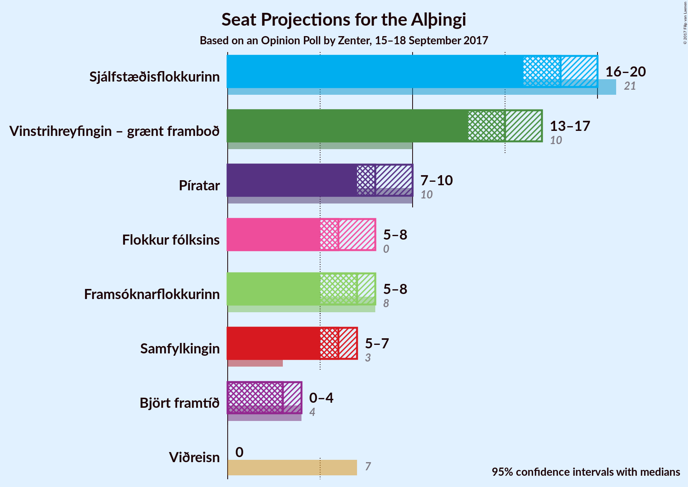

# Opinion Poll by Zenter, 15–18 September 2017

<a href="#voting-intentions">Voting Intentions</a> | <a href="#seats">Seats</a> | <a href="#coalitions">Coalitions</a> | <a href="#technical-information">Technical Information</a>

## Voting Intentions

### Confidence Intervals

| Party | Last Result | Poll Result | 80% Confidence Interval | 90% Confidence Interval | 95% Confidence Interval | 99% Confidence Interval |
|:-----:|:-----------:|:-----------:|:-----------------------:|:-----------------------:|:-----------------------:|:-----------------------:|
| Sjálfstæðisflokkurinn | 29.0% | 26.4% | 24.6–28.2% |24.1–28.8% |23.7–29.2% |22.8–30.2% |
| Vinstrihreyfingin – grænt framboð | 15.9% | 22.8% | 21.1–24.6% |20.7–25.1% |20.3–25.6% |19.5–26.5% |
| Píratar | 14.5% | 12.4% | 11.2–13.9% |10.8–14.3% |10.5–14.7% |9.9–15.4% |
| Framsóknarflokkurinn | 11.5% | 10.5% | 9.3–11.8% |9.0–12.2% |8.7–12.6% |8.1–13.2% |
| Flokkur fólksins | 3.5% | 9.8% | 8.7–11.2% |8.4–11.6% |8.1–11.9% |7.6–12.6% |
| Samfylkingin | 5.7% | 9.0% | 7.9–10.3% |7.6–10.7% |7.3–11.0% |6.9–11.6% |
| Björt framtíð | 7.2% | 5.5% | 4.7–6.6% |4.5–6.9% |4.3–7.2% |3.9–7.7% |
| Viðreisn | 10.5% | 2.7% | 2.1–3.5% |2.0–3.7% |1.9–4.0% |1.6–4.4% |

*Note:* The poll result column reflects the actual value used in the calculations. Published results may vary slightly, and in addition be rounded to fewer digits.

## Seats

### Confidence Intervals

| Party | Last Result | Median | 80% Confidence Interval | 90% Confidence Interval | 95% Confidence Interval | 99% Confidence Interval |
|:-----:|:-----------:|:------:|:-----------------------:|:-----------------------:|:-----------------------:|:-----------------------:|
| <a href="#sjálfstæðisflokkurinn">Sjálfstæðisflokkurinn</a> | 21 | 18 | 16–19 |15–20 |15–20 |15–20 |
| <a href="#vinstrihreyfingin-–-grænt-framboð">Vinstrihreyfingin – grænt framboð</a> | 10 | 16 | 14–17 |14–17 |13–18 |12–18 |
| <a href="#píratar">Píratar</a> | 10 | 8 | 7–10 |7–10 |6–10 |6–10 |
| <a href="#framsóknarflokkurinn">Framsóknarflokkurinn</a> | 8 | 7 | 6–8 |6–8 |5–8 |5–9 |
| <a href="#flokkur-fólksins">Flokkur fólksins</a> | 0 | 6 | 5–7 |5–8 |5–8 |5–8 |
| <a href="#samfylkingin">Samfylkingin</a> | 3 | 6 | 5–6 |5–7 |4–7 |4–8 |
| <a href="#björt-framtíð">Björt framtíð</a> | 4 | 3 | 0–4 |0–4 |0–4 |0–5 |
| <a href="#viðreisn">Viðreisn</a> | 7 | 0 | 0 |0 |0 |0 |

### Sjálfstæðisflokkurinn

*For a full overview of the results for this party, see the [Sjálfstæðisflokkurinn](party-sjlfstisflokkurinn.html) page.*

| Number of Seats | Probability | Accumulated | Special Marks |
|:---------------:|:-----------:|:-----------:|:-------------:|
| 14 | 0.1% | 100% |  |
| 15 | 7% | 99.9% |  |
| 16 | 8% | 93% |  |
| 17 | 30% | 85% |  |
| 18 | 30% | 54% | Median |
| 19 | 16% | 24% |  |
| 20 | 8% | 8% |  |
| 21 | 0.2% | 0.2% | Last Result |
| 22 | 0% | 0% |  |

### Vinstrihreyfingin – grænt framboð

*For a full overview of the results for this party, see the [Vinstrihreyfingin – grænt framboð](party-vinstrihreyfingingrntframbo.html) page.*

| Number of Seats | Probability | Accumulated | Special Marks |
|:---------------:|:-----------:|:-----------:|:-------------:|
| 10 | 0% | 100% | Last Result |
| 11 | 0% | 100% |  |
| 12 | 0.6% | 100% |  |
| 13 | 3% | 99.4% |  |
| 14 | 14% | 96% |  |
| 15 | 12% | 83% |  |
| 16 | 46% | 71% | Median |
| 17 | 20% | 25% |  |
| 18 | 4% | 4% |  |
| 19 | 0.1% | 0.1% |  |
| 20 | 0% | 0% |  |

### Píratar

*For a full overview of the results for this party, see the [Píratar](party-pratar.html) page.*

| Number of Seats | Probability | Accumulated | Special Marks |
|:---------------:|:-----------:|:-----------:|:-------------:|
| 6 | 3% | 100% |  |
| 7 | 11% | 97% |  |
| 8 | 60% | 86% | Median |
| 9 | 14% | 26% |  |
| 10 | 12% | 12% | Last Result |
| 11 | 0.1% | 0.1% |  |
| 12 | 0% | 0% |  |

### Framsóknarflokkurinn

*For a full overview of the results for this party, see the [Framsóknarflokkurinn](party-framsknarflokkurinn.html) page.*

| Number of Seats | Probability | Accumulated | Special Marks |
|:---------------:|:-----------:|:-----------:|:-------------:|
| 5 | 3% | 100% |  |
| 6 | 41% | 97% |  |
| 7 | 33% | 56% | Median |
| 8 | 22% | 24% | Last Result |
| 9 | 1.3% | 1.3% |  |
| 10 | 0% | 0% |  |

### Flokkur fólksins

*For a full overview of the results for this party, see the [Flokkur fólksins](party-flokkurflksins.html) page.*

| Number of Seats | Probability | Accumulated | Special Marks |
|:---------------:|:-----------:|:-----------:|:-------------:|
| 0 | 0% | 100% | Last Result |
| 1 | 0% | 100% |  |
| 2 | 0% | 100% |  |
| 3 | 0% | 100% |  |
| 4 | 0.2% | 100% |  |
| 5 | 11% | 99.8% |  |
| 6 | 52% | 89% | Median |
| 7 | 30% | 37% |  |
| 8 | 6% | 7% |  |
| 9 | 0.2% | 0.2% |  |
| 10 | 0% | 0% |  |

### Samfylkingin

*For a full overview of the results for this party, see the [Samfylkingin](party-samfylkingin.html) page.*

| Number of Seats | Probability | Accumulated | Special Marks |
|:---------------:|:-----------:|:-----------:|:-------------:|
| 3 | 0% | 100% | Last Result |
| 4 | 3% | 100% |  |
| 5 | 44% | 97% |  |
| 6 | 45% | 54% | Median |
| 7 | 8% | 8% |  |
| 8 | 0.5% | 0.5% |  |
| 9 | 0% | 0% |  |

### Björt framtíð

*For a full overview of the results for this party, see the [Björt framtíð](party-bjrtframt.html) page.*

| Number of Seats | Probability | Accumulated | Special Marks |
|:---------------:|:-----------:|:-----------:|:-------------:|
| 0 | 18% | 100% |  |
| 1 | 4% | 82% |  |
| 2 | 0% | 79% |  |
| 3 | 53% | 79% | Median |
| 4 | 24% | 26% | Last Result |
| 5 | 1.4% | 1.4% |  |
| 6 | 0% | 0% |  |

### Viðreisn

*For a full overview of the results for this party, see the [Viðreisn](party-vireisn.html) page.*

| Number of Seats | Probability | Accumulated | Special Marks |
|:---------------:|:-----------:|:-----------:|:-------------:|
| 0 | 100% | 100% | Median |
| 1 | 0% | 0% |  |
| 2 | 0% | 0% |  |
| 3 | 0% | 0% |  |
| 4 | 0% | 0% |  |
| 5 | 0% | 0% |  |
| 6 | 0% | 0% |  |
| 7 | 0% | 0% | Last Result |

## Coalitions

### Confidence Intervals

| Coalition | Last Result | Median | Majority? | 80% Confidence Interval | 90% Confidence Interval | 95% Confidence Interval | 99% Confidence Interval |
|:---------:|:-----------:|:------:|:---------:|:-----------------------:|:-----------------------:|:-----------------------:|:-----------------------:|
| Sjálfstæðisflokkurinn – Vinstrihreyfingin – grænt framboð | 31 | 33 | 94% | 32–35 | 31–36 | 30–37 | 30–37 |
| Vinstrihreyfingin – grænt framboð – Píratar – Samfylkingin – Björt framtíð | 27 | 32 | 73% | 31–34 | 30–35 | 29–35 | 29–35 |
| Vinstrihreyfingin – grænt framboð – Píratar – Samfylkingin – Björt framtíð – Viðreisn | 34 | 32 | 73% | 31–34 | 30–35 | 29–35 | 29–35 |
| Vinstrihreyfingin – grænt framboð – Píratar – Samfylkingin | 23 | 30 | 13% | 27–32 | 27–32 | 26–32 | 26–33 |
| Vinstrihreyfingin – grænt framboð – Píratar – Samfylkingin – Viðreisn | 30 | 30 | 13% | 27–32 | 27–32 | 26–32 | 26–33 |
| Vinstrihreyfingin – grænt framboð – Framsóknarflokkurinn – Samfylkingin | 21 | 28 | 0.1% | 26–30 | 26–30 | 26–30 | 25–31 |
| Sjálfstæðisflokkurinn – Framsóknarflokkurinn | 29 | 24 | 0% | 22–26 | 22–27 | 22–27 | 22–28 |
| Vinstrihreyfingin – grænt framboð – Píratar | 20 | 24 | 0% | 22–26 | 21–27 | 21–27 | 20–27 |
| Sjálfstæðisflokkurinn – Samfylkingin | 24 | 23 | 0% | 21–25 | 21–25 | 21–25 | 21–27 |
| Vinstrihreyfingin – grænt framboð – Framsóknarflokkurinn | 18 | 22 | 0% | 21–24 | 20–24 | 20–25 | 19–25 |
| Vinstrihreyfingin – grænt framboð – Samfylkingin | 13 | 22 | 0% | 19–23 | 19–23 | 19–24 | 18–24 |
| Sjálfstæðisflokkurinn – Björt framtíð | 25 | 21 | 0% | 18–22 | 17–23 | 17–23 | 17–24 |
| Sjálfstæðisflokkurinn – Björt framtíð – Viðreisn | 32 | 21 | 0% | 18–22 | 17–23 | 17–23 | 17–24 |
| Sjálfstæðisflokkurinn – Viðreisn | 28 | 18 | 0% | 16–19 | 15–20 | 15–20 | 15–20 |

### Sjálfstæðisflokkurinn – Vinstrihreyfingin – grænt framboð

| Number of Seats | Probability | Accumulated | Special Marks |
|:---------------:|:-----------:|:-----------:|:-------------:|
| 29 | 0.2% | 100% |  |
| 30 | 3% | 99.8% |  |
| 31 | 3% | 97% | Last Result |
| 32 | 21% | 94% | Majority |
| 33 | 25% | 74% |  |
| 34 | 32% | 49% | Median |
| 35 | 8% | 17% |  |
| 36 | 6% | 9% |  |
| 37 | 3% | 3% |  |
| 38 | 0.1% | 0.1% |  |
| 39 | 0% | 0% |  |

### Vinstrihreyfingin – grænt framboð – Píratar – Samfylkingin – Björt framtíð

| Number of Seats | Probability | Accumulated | Special Marks |
|:---------------:|:-----------:|:-----------:|:-------------:|
| 27 | 0% | 100% | Last Result |
| 28 | 0.2% | 100% |  |
| 29 | 3% | 99.8% |  |
| 30 | 5% | 96% |  |
| 31 | 18% | 91% |  |
| 32 | 33% | 73% | Majority |
| 33 | 22% | 41% | Median |
| 34 | 13% | 19% |  |
| 35 | 5% | 5% |  |
| 36 | 0.4% | 0.4% |  |
| 37 | 0% | 0% |  |

### Vinstrihreyfingin – grænt framboð – Píratar – Samfylkingin – Björt framtíð – Viðreisn

| Number of Seats | Probability | Accumulated | Special Marks |
|:---------------:|:-----------:|:-----------:|:-------------:|
| 28 | 0.2% | 100% |  |
| 29 | 3% | 99.8% |  |
| 30 | 5% | 96% |  |
| 31 | 18% | 91% |  |
| 32 | 33% | 73% | Majority |
| 33 | 22% | 41% | Median |
| 34 | 13% | 19% | Last Result |
| 35 | 5% | 5% |  |
| 36 | 0.4% | 0.4% |  |
| 37 | 0% | 0% |  |

### Vinstrihreyfingin – grænt framboð – Píratar – Samfylkingin

| Number of Seats | Probability | Accumulated | Special Marks |
|:---------------:|:-----------:|:-----------:|:-------------:|
| 23 | 0% | 100% | Last Result |
| 24 | 0% | 100% |  |
| 25 | 0.1% | 100% |  |
| 26 | 4% | 99.9% |  |
| 27 | 9% | 96% |  |
| 28 | 10% | 88% |  |
| 29 | 25% | 78% |  |
| 30 | 23% | 54% | Median |
| 31 | 18% | 30% |  |
| 32 | 12% | 13% | Majority |
| 33 | 0.6% | 0.6% |  |
| 34 | 0% | 0% |  |

### Vinstrihreyfingin – grænt framboð – Píratar – Samfylkingin – Viðreisn

| Number of Seats | Probability | Accumulated | Special Marks |
|:---------------:|:-----------:|:-----------:|:-------------:|
| 25 | 0.1% | 100% |  |
| 26 | 4% | 99.9% |  |
| 27 | 9% | 96% |  |
| 28 | 10% | 88% |  |
| 29 | 25% | 78% |  |
| 30 | 23% | 54% | Last Result, Median |
| 31 | 18% | 30% |  |
| 32 | 12% | 13% | Majority |
| 33 | 0.6% | 0.6% |  |
| 34 | 0% | 0% |  |

### Vinstrihreyfingin – grænt framboð – Framsóknarflokkurinn – Samfylkingin

| Number of Seats | Probability | Accumulated | Special Marks |
|:---------------:|:-----------:|:-----------:|:-------------:|
| 21 | 0% | 100% | Last Result |
| 22 | 0% | 100% |  |
| 23 | 0% | 100% |  |
| 24 | 0.4% | 100% |  |
| 25 | 1.4% | 99.6% |  |
| 26 | 13% | 98% |  |
| 27 | 14% | 86% |  |
| 28 | 30% | 72% |  |
| 29 | 25% | 42% | Median |
| 30 | 17% | 18% |  |
| 31 | 0.7% | 0.9% |  |
| 32 | 0.1% | 0.1% | Majority |
| 33 | 0% | 0% |  |

### Sjálfstæðisflokkurinn – Framsóknarflokkurinn

| Number of Seats | Probability | Accumulated | Special Marks |
|:---------------:|:-----------:|:-----------:|:-------------:|
| 21 | 0.4% | 100% |  |
| 22 | 11% | 99.6% |  |
| 23 | 5% | 89% |  |
| 24 | 37% | 84% |  |
| 25 | 32% | 47% | Median |
| 26 | 8% | 15% |  |
| 27 | 6% | 7% |  |
| 28 | 0.5% | 0.6% |  |
| 29 | 0.1% | 0.1% | Last Result |
| 30 | 0% | 0% |  |

### Vinstrihreyfingin – grænt framboð – Píratar

| Number of Seats | Probability | Accumulated | Special Marks |
|:---------------:|:-----------:|:-----------:|:-------------:|
| 20 | 0.6% | 100% | Last Result |
| 21 | 9% | 99.4% |  |
| 22 | 10% | 91% |  |
| 23 | 9% | 80% |  |
| 24 | 39% | 71% | Median |
| 25 | 16% | 33% |  |
| 26 | 8% | 16% |  |
| 27 | 8% | 8% |  |
| 28 | 0% | 0% |  |

### Sjálfstæðisflokkurinn – Samfylkingin

| Number of Seats | Probability | Accumulated | Special Marks |
|:---------------:|:-----------:|:-----------:|:-------------:|
| 20 | 0.4% | 100% |  |
| 21 | 10% | 99.5% |  |
| 22 | 28% | 89% |  |
| 23 | 13% | 61% |  |
| 24 | 25% | 48% | Last Result, Median |
| 25 | 22% | 24% |  |
| 26 | 0.9% | 2% |  |
| 27 | 0.6% | 0.7% |  |
| 28 | 0% | 0% |  |

### Vinstrihreyfingin – grænt framboð – Framsóknarflokkurinn

| Number of Seats | Probability | Accumulated | Special Marks |
|:---------------:|:-----------:|:-----------:|:-------------:|
| 18 | 0% | 100% | Last Result |
| 19 | 1.0% | 100% |  |
| 20 | 8% | 99.0% |  |
| 21 | 14% | 91% |  |
| 22 | 30% | 77% |  |
| 23 | 8% | 47% | Median |
| 24 | 35% | 39% |  |
| 25 | 4% | 4% |  |
| 26 | 0.1% | 0.1% |  |
| 27 | 0% | 0% |  |

### Vinstrihreyfingin – grænt framboð – Samfylkingin

| Number of Seats | Probability | Accumulated | Special Marks |
|:---------------:|:-----------:|:-----------:|:-------------:|
| 13 | 0% | 100% | Last Result |
| 14 | 0% | 100% |  |
| 15 | 0% | 100% |  |
| 16 | 0% | 100% |  |
| 17 | 0.2% | 100% |  |
| 18 | 0.7% | 99.8% |  |
| 19 | 9% | 99.0% |  |
| 20 | 10% | 90% |  |
| 21 | 29% | 80% |  |
| 22 | 39% | 52% | Median |
| 23 | 9% | 13% |  |
| 24 | 4% | 4% |  |
| 25 | 0.1% | 0.1% |  |
| 26 | 0% | 0% |  |

### Sjálfstæðisflokkurinn – Björt framtíð

| Number of Seats | Probability | Accumulated | Special Marks |
|:---------------:|:-----------:|:-----------:|:-------------:|
| 16 | 0.1% | 100% |  |
| 17 | 9% | 99.9% |  |
| 18 | 8% | 91% |  |
| 19 | 8% | 83% |  |
| 20 | 23% | 75% |  |
| 21 | 28% | 51% | Median |
| 22 | 16% | 23% |  |
| 23 | 6% | 7% |  |
| 24 | 1.2% | 1.3% |  |
| 25 | 0% | 0% | Last Result |

### Sjálfstæðisflokkurinn – Björt framtíð – Viðreisn

| Number of Seats | Probability | Accumulated | Special Marks |
|:---------------:|:-----------:|:-----------:|:-------------:|
| 16 | 0.1% | 100% |  |
| 17 | 9% | 99.9% |  |
| 18 | 8% | 91% |  |
| 19 | 8% | 83% |  |
| 20 | 23% | 75% |  |
| 21 | 28% | 51% | Median |
| 22 | 16% | 23% |  |
| 23 | 6% | 7% |  |
| 24 | 1.2% | 1.3% |  |
| 25 | 0% | 0% |  |
| 26 | 0% | 0% |  |
| 27 | 0% | 0% |  |
| 28 | 0% | 0% |  |
| 29 | 0% | 0% |  |
| 30 | 0% | 0% |  |
| 31 | 0% | 0% |  |
| 32 | 0% | 0% | Last Result, Majority |

### Sjálfstæðisflokkurinn – Viðreisn

| Number of Seats | Probability | Accumulated | Special Marks |
|:---------------:|:-----------:|:-----------:|:-------------:|
| 14 | 0.1% | 100% |  |
| 15 | 7% | 99.9% |  |
| 16 | 8% | 93% |  |
| 17 | 30% | 85% |  |
| 18 | 30% | 54% | Median |
| 19 | 16% | 24% |  |
| 20 | 8% | 8% |  |
| 21 | 0.2% | 0.2% |  |
| 22 | 0% | 0% |  |
| 23 | 0% | 0% |  |
| 24 | 0% | 0% |  |
| 25 | 0% | 0% |  |
| 26 | 0% | 0% |  |
| 27 | 0% | 0% |  |
| 28 | 0% | 0% | Last Result |

## Technical Information

### Opinion Poll

+ **Pollster:** Zenter
+ **Media:** —
+ **Fieldwork period:** 15–18 September 2017

### Calculations

+ **Sample size:** 956
+ **Simulations done:** 131,072
+ **Error estimate:** 3.32%

