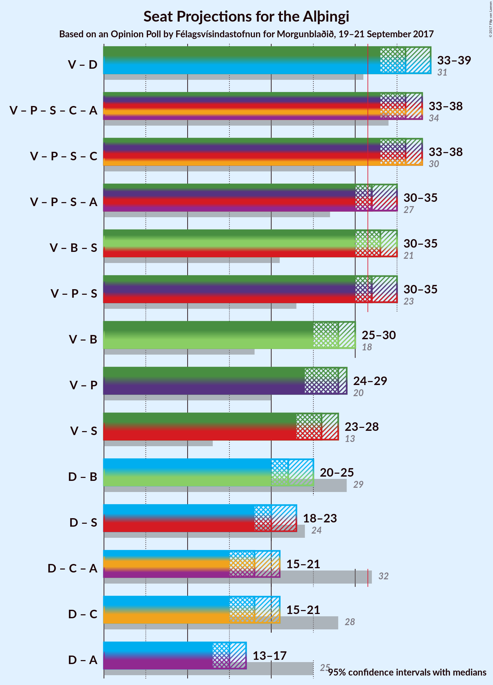

# Opinion Poll by Félagsvísindastofnun for Morgunblaðið, 19–21 September 2017

<a href="#voting-intentions">Voting Intentions</a> | <a href="#seats">Seats</a> | <a href="#coalitions">Coalitions</a> | <a href="#technical-information">Technical Information</a>

## Voting Intentions

### Confidence Intervals

| Party | Last Result | Poll Result | 80% Confidence Interval | 90% Confidence Interval | 95% Confidence Interval | 99% Confidence Interval |
|:-----:|:-----------:|:-----------:|:-----------------------:|:-----------------------:|:-----------------------:|:-----------------------:|
| Vinstrihreyfingin – grænt framboð | 15.9% | 29.9% | 28.0–31.9% |27.5–32.4% |27.0–32.9% |26.1–33.9% |
| Sjálfstæðisflokkurinn | 29.0% | 22.9% | 21.2–24.8% |20.7–25.3% |20.3–25.8% |19.5–26.7% |
| Framsóknarflokkurinn | 11.5% | 10.9% | 9.7–12.3% |9.3–12.8% |9.1–13.1% |8.5–13.8% |
| Píratar | 14.5% | 9.9% | 8.7–11.3% |8.4–11.7% |8.1–12.0% |7.6–12.7% |
| Flokkur fólksins | 3.5% | 8.9% | 7.8–10.3% |7.5–10.6% |7.2–11.0% |6.7–11.6% |
| Samfylkingin | 5.7% | 7.9% | 6.9–9.2% |6.6–9.6% |6.4–9.9% |5.9–10.5% |
| Viðreisn | 10.5% | 6.0% | 5.1–7.1% |4.8–7.4% |4.6–7.7% |4.2–8.3% |
| Björt framtíð | 7.2% | 3.0% | 2.4–3.8% |2.2–4.1% |2.1–4.3% |1.8–4.8% |

*Note:* The poll result column reflects the actual value used in the calculations. Published results may vary slightly, and in addition be rounded to fewer digits.

## Seats

### Confidence Intervals

| Party | Last Result | Median | 80% Confidence Interval | 90% Confidence Interval | 95% Confidence Interval | 99% Confidence Interval |
|:-----:|:-----------:|:------:|:-----------------------:|:-----------------------:|:-----------------------:|:-----------------------:|
| <a href="#vinstrihreyfingin-–-grænt-framboð">Vinstrihreyfingin – grænt framboð</a> | 10 | 21 | 19–22 |19–22 |18–23 |17–23 |
| <a href="#sjálfstæðisflokkurinn">Sjálfstæðisflokkurinn</a> | 21 | 15 | 14–16 |13–17 |13–17 |13–18 |
| <a href="#framsóknarflokkurinn">Framsóknarflokkurinn</a> | 8 | 7 | 6–8 |6–8 |6–8 |5–9 |
| <a href="#píratar">Píratar</a> | 10 | 6 | 5–7 |5–7 |5–8 |5–8 |
| <a href="#flokkur-fólksins">Flokkur fólksins</a> | 0 | 6 | 5–6 |5–7 |4–7 |4–7 |
| <a href="#samfylkingin">Samfylkingin</a> | 3 | 5 | 4–6 |4–6 |4–6 |3–7 |
| <a href="#viðreisn">Viðreisn</a> | 7 | 4 | 0–4 |0–5 |0–5 |0–5 |
| <a href="#björt-framtíð">Björt framtíð</a> | 4 | 0 | 0 |0 |0 |0 |

### Vinstrihreyfingin – grænt framboð

*For a full overview of the results for this party, see the [Vinstrihreyfingin – grænt framboð](party-vinstrihreyfingingrntframbo.html) page.*

| Number of Seats | Probability | Accumulated | Special Marks |
|:---------------:|:-----------:|:-----------:|:-------------:|
| 10 | 0% | 100% | Last Result |
| 11 | 0% | 100% |  |
| 12 | 0% | 100% |  |
| 13 | 0% | 100% |  |
| 14 | 0% | 100% |  |
| 15 | 0% | 100% |  |
| 16 | 0% | 100% |  |
| 17 | 0.5% | 100% |  |
| 18 | 3% | 99.4% |  |
| 19 | 10% | 96% |  |
| 20 | 14% | 86% |  |
| 21 | 22% | 71% | Median |
| 22 | 45% | 49% |  |
| 23 | 4% | 4% |  |
| 24 | 0.4% | 0.5% |  |
| 25 | 0% | 0.1% |  |
| 26 | 0% | 0% |  |

### Sjálfstæðisflokkurinn

*For a full overview of the results for this party, see the [Sjálfstæðisflokkurinn](party-sjlfstisflokkurinn.html) page.*

| Number of Seats | Probability | Accumulated | Special Marks |
|:---------------:|:-----------:|:-----------:|:-------------:|
| 12 | 0.2% | 100% |  |
| 13 | 7% | 99.8% |  |
| 14 | 27% | 93% |  |
| 15 | 38% | 65% | Median |
| 16 | 17% | 27% |  |
| 17 | 8% | 10% |  |
| 18 | 2% | 2% |  |
| 19 | 0.2% | 0.2% |  |
| 20 | 0% | 0% |  |
| 21 | 0% | 0% | Last Result |

### Framsóknarflokkurinn

*For a full overview of the results for this party, see the [Framsóknarflokkurinn](party-framsknarflokkurinn.html) page.*

| Number of Seats | Probability | Accumulated | Special Marks |
|:---------------:|:-----------:|:-----------:|:-------------:|
| 5 | 2% | 100% |  |
| 6 | 26% | 98% |  |
| 7 | 50% | 73% | Median |
| 8 | 21% | 23% | Last Result |
| 9 | 2% | 2% |  |
| 10 | 0.2% | 0.2% |  |
| 11 | 0% | 0% |  |

### Píratar

*For a full overview of the results for this party, see the [Píratar](party-pratar.html) page.*

| Number of Seats | Probability | Accumulated | Special Marks |
|:---------------:|:-----------:|:-----------:|:-------------:|
| 4 | 0.3% | 100% |  |
| 5 | 13% | 99.7% |  |
| 6 | 55% | 87% | Median |
| 7 | 28% | 32% |  |
| 8 | 5% | 5% |  |
| 9 | 0.2% | 0.2% |  |
| 10 | 0% | 0% | Last Result |

### Flokkur fólksins

*For a full overview of the results for this party, see the [Flokkur fólksins](party-flokkurflksins.html) page.*

| Number of Seats | Probability | Accumulated | Special Marks |
|:---------------:|:-----------:|:-----------:|:-------------:|
| 0 | 0% | 100% | Last Result |
| 1 | 0% | 100% |  |
| 2 | 0% | 100% |  |
| 3 | 0% | 100% |  |
| 4 | 4% | 100% |  |
| 5 | 43% | 96% |  |
| 6 | 45% | 53% | Median |
| 7 | 7% | 7% |  |
| 8 | 0.4% | 0.4% |  |
| 9 | 0% | 0% |  |

### Samfylkingin

*For a full overview of the results for this party, see the [Samfylkingin](party-samfylkingin.html) page.*

| Number of Seats | Probability | Accumulated | Special Marks |
|:---------------:|:-----------:|:-----------:|:-------------:|
| 3 | 1.3% | 100% | Last Result |
| 4 | 27% | 98.7% |  |
| 5 | 51% | 72% | Median |
| 6 | 20% | 21% |  |
| 7 | 1.1% | 1.1% |  |
| 8 | 0% | 0% |  |

### Viðreisn

*For a full overview of the results for this party, see the [Viðreisn](party-vireisn.html) page.*

| Number of Seats | Probability | Accumulated | Special Marks |
|:---------------:|:-----------:|:-----------:|:-------------:|
| 0 | 11% | 100% |  |
| 1 | 0% | 89% |  |
| 2 | 0% | 89% |  |
| 3 | 38% | 89% |  |
| 4 | 46% | 52% | Median |
| 5 | 5% | 6% |  |
| 6 | 0.1% | 0.1% |  |
| 7 | 0% | 0% | Last Result |

### Björt framtíð

*For a full overview of the results for this party, see the [Björt framtíð](party-bjrtframt.html) page.*

| Number of Seats | Probability | Accumulated | Special Marks |
|:---------------:|:-----------:|:-----------:|:-------------:|
| 0 | 99.8% | 100% | Median |
| 1 | 0.1% | 0.2% |  |
| 2 | 0% | 0.1% |  |
| 3 | 0.1% | 0.1% |  |
| 4 | 0% | 0% | Last Result |

## Coalitions

### Confidence Intervals

| Coalition | Last Result | Median | Majority? | 80% Confidence Interval | 90% Confidence Interval | 95% Confidence Interval | 99% Confidence Interval |
|:---------:|:-----------:|:------:|:---------:|:-----------------------:|:-----------------------:|:-----------------------:|:-----------------------:|
| Vinstrihreyfingin – grænt framboð – Sjálfstæðisflokkurinn | 31 | 36 | 99.9% | 34–38 | 34–38 | 33–39 | 32–40 |
| Vinstrihreyfingin – grænt framboð – Píratar – Samfylkingin – Viðreisn – Björt framtíð | 34 | 36 | 99.7% | 34–37 | 33–37 | 33–38 | 32–38 |
| Vinstrihreyfingin – grænt framboð – Píratar – Samfylkingin – Viðreisn | 30 | 36 | 99.6% | 34–37 | 33–37 | 33–38 | 32–38 |
| Vinstrihreyfingin – grænt framboð – Píratar – Samfylkingin – Björt framtíð | 27 | 32 | 76% | 31–34 | 30–34 | 30–35 | 29–35 |
| Vinstrihreyfingin – grænt framboð – Framsóknarflokkurinn – Samfylkingin | 21 | 33 | 87% | 31–34 | 31–35 | 30–35 | 29–36 |
| Vinstrihreyfingin – grænt framboð – Píratar – Samfylkingin | 23 | 32 | 76% | 31–34 | 30–34 | 30–35 | 29–35 |
| Vinstrihreyfingin – grænt framboð – Framsóknarflokkurinn | 18 | 28 | 0.1% | 26–30 | 26–30 | 25–30 | 24–31 |
| Vinstrihreyfingin – grænt framboð – Píratar | 20 | 28 | 0% | 25–29 | 25–29 | 24–30 | 24–30 |
| Vinstrihreyfingin – grænt framboð – Samfylkingin | 13 | 26 | 0% | 24–27 | 24–28 | 23–28 | 22–29 |
| Sjálfstæðisflokkurinn – Framsóknarflokkurinn | 29 | 22 | 0% | 20–24 | 20–24 | 20–25 | 19–26 |
| Sjálfstæðisflokkurinn – Samfylkingin | 24 | 20 | 0% | 18–22 | 18–22 | 18–23 | 17–23 |
| Sjálfstæðisflokkurinn – Viðreisn – Björt framtíð | 32 | 18 | 0% | 17–20 | 16–20 | 15–21 | 15–22 |
| Sjálfstæðisflokkurinn – Viðreisn | 28 | 18 | 0% | 17–20 | 16–20 | 15–21 | 15–22 |
| Sjálfstæðisflokkurinn – Björt framtíð | 25 | 15 | 0% | 14–17 | 13–17 | 13–17 | 13–18 |

### Vinstrihreyfingin – grænt framboð – Sjálfstæðisflokkurinn

| Number of Seats | Probability | Accumulated | Special Marks |
|:---------------:|:-----------:|:-----------:|:-------------:|
| 31 | 0.1% | 100% | Last Result |
| 32 | 0.8% | 99.9% | Majority |
| 33 | 3% | 99.1% |  |
| 34 | 9% | 96% |  |
| 35 | 24% | 87% |  |
| 36 | 25% | 64% | Median |
| 37 | 25% | 39% |  |
| 38 | 9% | 14% |  |
| 39 | 4% | 5% |  |
| 40 | 0.5% | 0.5% |  |
| 41 | 0% | 0.1% |  |
| 42 | 0% | 0% |  |

### Vinstrihreyfingin – grænt framboð – Píratar – Samfylkingin – Viðreisn – Björt framtíð

| Number of Seats | Probability | Accumulated | Special Marks |
|:---------------:|:-----------:|:-----------:|:-------------:|
| 30 | 0.1% | 100% |  |
| 31 | 0.3% | 99.9% |  |
| 32 | 2% | 99.7% | Majority |
| 33 | 6% | 98% |  |
| 34 | 13% | 92% | Last Result |
| 35 | 25% | 79% |  |
| 36 | 32% | 54% | Median |
| 37 | 18% | 22% |  |
| 38 | 4% | 4% |  |
| 39 | 0.3% | 0.4% |  |
| 40 | 0% | 0% |  |

### Vinstrihreyfingin – grænt framboð – Píratar – Samfylkingin – Viðreisn

| Number of Seats | Probability | Accumulated | Special Marks |
|:---------------:|:-----------:|:-----------:|:-------------:|
| 30 | 0.1% | 100% | Last Result |
| 31 | 0.3% | 99.9% |  |
| 32 | 2% | 99.6% | Majority |
| 33 | 6% | 98% |  |
| 34 | 13% | 92% |  |
| 35 | 25% | 79% |  |
| 36 | 32% | 54% | Median |
| 37 | 18% | 22% |  |
| 38 | 4% | 4% |  |
| 39 | 0.3% | 0.3% |  |
| 40 | 0% | 0% |  |

### Vinstrihreyfingin – grænt framboð – Píratar – Samfylkingin – Björt framtíð

| Number of Seats | Probability | Accumulated | Special Marks |
|:---------------:|:-----------:|:-----------:|:-------------:|
| 27 | 0% | 100% | Last Result |
| 28 | 0.4% | 100% |  |
| 29 | 2% | 99.6% |  |
| 30 | 7% | 98% |  |
| 31 | 15% | 91% |  |
| 32 | 33% | 76% | Median, Majority |
| 33 | 28% | 43% |  |
| 34 | 11% | 14% |  |
| 35 | 2% | 3% |  |
| 36 | 0.4% | 0.5% |  |
| 37 | 0% | 0% |  |

### Vinstrihreyfingin – grænt framboð – Framsóknarflokkurinn – Samfylkingin

| Number of Seats | Probability | Accumulated | Special Marks |
|:---------------:|:-----------:|:-----------:|:-------------:|
| 21 | 0% | 100% | Last Result |
| 22 | 0% | 100% |  |
| 23 | 0% | 100% |  |
| 24 | 0% | 100% |  |
| 25 | 0% | 100% |  |
| 26 | 0% | 100% |  |
| 27 | 0% | 100% |  |
| 28 | 0.1% | 100% |  |
| 29 | 0.5% | 99.9% |  |
| 30 | 3% | 99.4% |  |
| 31 | 9% | 96% |  |
| 32 | 20% | 87% | Majority |
| 33 | 32% | 67% | Median |
| 34 | 26% | 36% |  |
| 35 | 8% | 10% |  |
| 36 | 1.3% | 1.4% |  |
| 37 | 0.1% | 0.2% |  |
| 38 | 0% | 0% |  |

### Vinstrihreyfingin – grænt framboð – Píratar – Samfylkingin

| Number of Seats | Probability | Accumulated | Special Marks |
|:---------------:|:-----------:|:-----------:|:-------------:|
| 23 | 0% | 100% | Last Result |
| 24 | 0% | 100% |  |
| 25 | 0% | 100% |  |
| 26 | 0% | 100% |  |
| 27 | 0% | 100% |  |
| 28 | 0.4% | 100% |  |
| 29 | 2% | 99.6% |  |
| 30 | 7% | 98% |  |
| 31 | 15% | 91% |  |
| 32 | 34% | 76% | Median, Majority |
| 33 | 28% | 42% |  |
| 34 | 11% | 14% |  |
| 35 | 2% | 3% |  |
| 36 | 0.4% | 0.5% |  |
| 37 | 0% | 0% |  |

### Vinstrihreyfingin – grænt framboð – Framsóknarflokkurinn

| Number of Seats | Probability | Accumulated | Special Marks |
|:---------------:|:-----------:|:-----------:|:-------------:|
| 18 | 0% | 100% | Last Result |
| 19 | 0% | 100% |  |
| 20 | 0% | 100% |  |
| 21 | 0% | 100% |  |
| 22 | 0% | 100% |  |
| 23 | 0.1% | 100% |  |
| 24 | 0.6% | 99.9% |  |
| 25 | 4% | 99.3% |  |
| 26 | 10% | 95% |  |
| 27 | 19% | 86% |  |
| 28 | 25% | 66% | Median |
| 29 | 27% | 41% |  |
| 30 | 13% | 14% |  |
| 31 | 1.0% | 1.1% |  |
| 32 | 0.1% | 0.1% | Majority |
| 33 | 0% | 0% |  |

### Vinstrihreyfingin – grænt framboð – Píratar

| Number of Seats | Probability | Accumulated | Special Marks |
|:---------------:|:-----------:|:-----------:|:-------------:|
| 20 | 0% | 100% | Last Result |
| 21 | 0% | 100% |  |
| 22 | 0% | 100% |  |
| 23 | 0.4% | 100% |  |
| 24 | 2% | 99.6% |  |
| 25 | 8% | 97% |  |
| 26 | 15% | 90% |  |
| 27 | 24% | 75% | Median |
| 28 | 35% | 51% |  |
| 29 | 13% | 16% |  |
| 30 | 2% | 3% |  |
| 31 | 0.2% | 0.2% |  |
| 32 | 0% | 0% | Majority |

### Vinstrihreyfingin – grænt framboð – Samfylkingin

| Number of Seats | Probability | Accumulated | Special Marks |
|:---------------:|:-----------:|:-----------:|:-------------:|
| 13 | 0% | 100% | Last Result |
| 14 | 0% | 100% |  |
| 15 | 0% | 100% |  |
| 16 | 0% | 100% |  |
| 17 | 0% | 100% |  |
| 18 | 0% | 100% |  |
| 19 | 0% | 100% |  |
| 20 | 0% | 100% |  |
| 21 | 0.1% | 100% |  |
| 22 | 0.7% | 99.9% |  |
| 23 | 3% | 99.3% |  |
| 24 | 7% | 96% |  |
| 25 | 18% | 89% |  |
| 26 | 33% | 71% | Median |
| 27 | 32% | 38% |  |
| 28 | 5% | 6% |  |
| 29 | 0.9% | 1.0% |  |
| 30 | 0.1% | 0.1% |  |
| 31 | 0% | 0% |  |

### Sjálfstæðisflokkurinn – Framsóknarflokkurinn

| Number of Seats | Probability | Accumulated | Special Marks |
|:---------------:|:-----------:|:-----------:|:-------------:|
| 19 | 1.1% | 100% |  |
| 20 | 10% | 98.9% |  |
| 21 | 29% | 89% |  |
| 22 | 28% | 60% | Median |
| 23 | 20% | 32% |  |
| 24 | 9% | 11% |  |
| 25 | 2% | 3% |  |
| 26 | 0.5% | 0.7% |  |
| 27 | 0.1% | 0.1% |  |
| 28 | 0% | 0% |  |
| 29 | 0% | 0% | Last Result |

### Sjálfstæðisflokkurinn – Samfylkingin

| Number of Seats | Probability | Accumulated | Special Marks |
|:---------------:|:-----------:|:-----------:|:-------------:|
| 16 | 0.1% | 100% |  |
| 17 | 2% | 99.9% |  |
| 18 | 10% | 98% |  |
| 19 | 29% | 87% |  |
| 20 | 27% | 58% | Median |
| 21 | 18% | 31% |  |
| 22 | 10% | 13% |  |
| 23 | 2% | 3% |  |
| 24 | 0.5% | 0.5% | Last Result |
| 25 | 0% | 0% |  |

### Sjálfstæðisflokkurinn – Viðreisn – Björt framtíð

| Number of Seats | Probability | Accumulated | Special Marks |
|:---------------:|:-----------:|:-----------:|:-------------:|
| 14 | 0.4% | 100% |  |
| 15 | 2% | 99.6% |  |
| 16 | 6% | 97% |  |
| 17 | 18% | 91% |  |
| 18 | 33% | 73% |  |
| 19 | 24% | 40% | Median |
| 20 | 12% | 16% |  |
| 21 | 4% | 4% |  |
| 22 | 0.5% | 0.6% |  |
| 23 | 0% | 0% |  |
| 24 | 0% | 0% |  |
| 25 | 0% | 0% |  |
| 26 | 0% | 0% |  |
| 27 | 0% | 0% |  |
| 28 | 0% | 0% |  |
| 29 | 0% | 0% |  |
| 30 | 0% | 0% |  |
| 31 | 0% | 0% |  |
| 32 | 0% | 0% | Last Result, Majority |

### Sjálfstæðisflokkurinn – Viðreisn

| Number of Seats | Probability | Accumulated | Special Marks |
|:---------------:|:-----------:|:-----------:|:-------------:|
| 14 | 0.4% | 100% |  |
| 15 | 2% | 99.6% |  |
| 16 | 6% | 97% |  |
| 17 | 18% | 91% |  |
| 18 | 33% | 73% |  |
| 19 | 24% | 40% | Median |
| 20 | 12% | 16% |  |
| 21 | 4% | 4% |  |
| 22 | 0.5% | 0.6% |  |
| 23 | 0% | 0% |  |
| 24 | 0% | 0% |  |
| 25 | 0% | 0% |  |
| 26 | 0% | 0% |  |
| 27 | 0% | 0% |  |
| 28 | 0% | 0% | Last Result |

### Sjálfstæðisflokkurinn – Björt framtíð

| Number of Seats | Probability | Accumulated | Special Marks |
|:---------------:|:-----------:|:-----------:|:-------------:|
| 12 | 0.2% | 100% |  |
| 13 | 7% | 99.8% |  |
| 14 | 27% | 93% |  |
| 15 | 38% | 65% | Median |
| 16 | 18% | 28% |  |
| 17 | 8% | 10% |  |
| 18 | 2% | 2% |  |
| 19 | 0.2% | 0.2% |  |
| 20 | 0% | 0% |  |
| 21 | 0% | 0% |  |
| 22 | 0% | 0% |  |
| 23 | 0% | 0% |  |
| 24 | 0% | 0% |  |
| 25 | 0% | 0% | Last Result |

## Technical Information

### Opinion Poll

+ **Pollster:** Félagsvísindastofnun
+ **Media:** Morgunblaðið
+ **Fieldwork period:** 19–21 September 2017

### Calculations

+ **Sample size:** 907
+ **Simulations done:** 4,194,304
+ **Error estimate:** 1.07%

