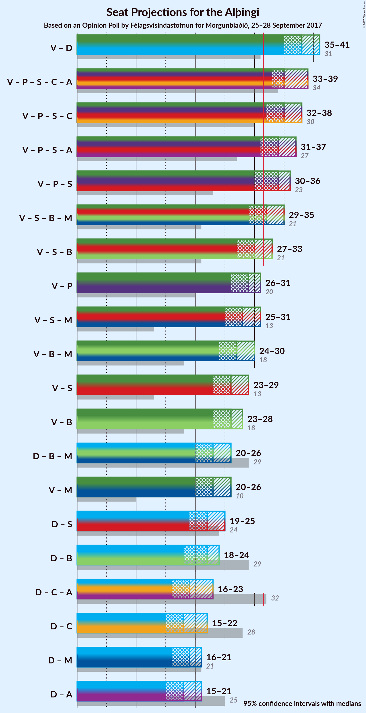

# Opinion Poll by Félagsvísindastofnun for Morgunblaðið, 25–28 September 2017

<a href="#voting-intentions">Voting Intentions</a> | <a href="#seats">Seats</a> | <a href="#coalitions">Coalitions</a> | <a href="#technical-information">Technical Information</a>

## Voting Intentions

### Confidence Intervals

| Party | Last Result | Poll Result | 80% Confidence Interval | 90% Confidence Interval | 95% Confidence Interval | 99% Confidence Interval |
|:-----:|:-----------:|:-----------:|:-----------------------:|:-----------------------:|:-----------------------:|:-----------------------:|
| Vinstrihreyfingin – grænt framboð | 15.9% | 28.8% | 26.9–30.7% |26.4–31.3% |26.0–31.7% |25.1–32.7% |
| Sjálfstæðisflokkurinn | 29.0% | 24.3% | 22.5–26.1% |22.1–26.6% |21.6–27.1% |20.9–28.0% |
| Píratar | 14.5% | 11.6% | 10.3–13.0% |10.0–13.4% |9.7–13.7% |9.1–14.4% |
| Samfylkingin | 5.7% | 7.5% | 6.5–8.7% |6.2–9.0% |6.0–9.3% |5.5–9.9% |
| Framsóknarflokkurinn | 11.5% | 7.0% | 6.1–8.2% |5.8–8.6% |5.6–8.8% |5.2–9.4% |
| Flokkur fólksins | 3.5% | 6.5% | 5.6–7.7% |5.3–8.0% |5.1–8.3% |4.7–8.8% |
| Viðreisn | 10.5% | 4.8% | 4.0–5.9% |3.8–6.1% |3.6–6.4% |3.3–6.9% |
| Miðflokkurinn | 0.0% | 4.6% | 3.9–5.6% |3.6–5.9% |3.5–6.2% |3.1–6.7% |
| Björt framtíð | 7.2% | 4.3% | 3.6–5.3% |3.4–5.5% |3.2–5.8% |2.9–6.3% |

*Note:* The poll result column reflects the actual value used in the calculations. Published results may vary slightly, and in addition be rounded to fewer digits.

## Seats

### Confidence Intervals

| Party | Last Result | Median | 80% Confidence Interval | 90% Confidence Interval | 95% Confidence Interval | 99% Confidence Interval |
|:-----:|:-----------:|:------:|:-----------------------:|:-----------------------:|:-----------------------:|:-----------------------:|
| <a href="#vinstrihreyfingin-–-grænt-framboð">Vinstrihreyfingin – grænt framboð</a> | 10 | 21 | 19–22 |19–23 |18–23 |18–24 |
| <a href="#sjálfstæðisflokkurinn">Sjálfstæðisflokkurinn</a> | 21 | 17 | 16–18 |15–19 |15–20 |14–21 |
| <a href="#píratar">Píratar</a> | 10 | 8 | 7–9 |6–9 |6–9 |5–10 |
| <a href="#samfylkingin">Samfylkingin</a> | 3 | 5 | 4–6 |4–6 |3–6 |3–7 |
| <a href="#framsóknarflokkurinn">Framsóknarflokkurinn</a> | 8 | 4 | 4–5 |3–5 |3–6 |3–6 |
| <a href="#flokkur-fólksins">Flokkur fólksins</a> | 0 | 4 | 3–5 |3–5 |3–5 |0–6 |
| <a href="#viðreisn">Viðreisn</a> | 7 | 0 | 0–4 |0–4 |0–4 |0–4 |
| <a href="#miðflokkurinn">Miðflokkurinn</a> | 0 | 3 | 0–3 |0–4 |0–4 |0–4 |
| <a href="#björt-framtíð">Björt framtíð</a> | 4 | 0 | 0–3 |0–3 |0–3 |0–4 |

### Vinstrihreyfingin – grænt framboð

*For a full overview of the results for this party, see the [Vinstrihreyfingin – grænt framboð](party-vinstrihreyfingingrntframbo.html) page.*

| Number of Seats | Probability | Accumulated | Special Marks |
|:---------------:|:-----------:|:-----------:|:-------------:|
| 10 | 0% | 100% | Last Result |
| 11 | 0% | 100% |  |
| 12 | 0% | 100% |  |
| 13 | 0% | 100% |  |
| 14 | 0% | 100% |  |
| 15 | 0% | 100% |  |
| 16 | 0% | 100% |  |
| 17 | 0.5% | 100% |  |
| 18 | 4% | 99.5% |  |
| 19 | 6% | 96% |  |
| 20 | 13% | 90% |  |
| 21 | 37% | 77% | Median |
| 22 | 33% | 40% |  |
| 23 | 6% | 7% |  |
| 24 | 0.9% | 1.4% |  |
| 25 | 0.3% | 0.5% |  |
| 26 | 0.2% | 0.2% |  |
| 27 | 0% | 0% |  |

### Sjálfstæðisflokkurinn

*For a full overview of the results for this party, see the [Sjálfstæðisflokkurinn](party-sjlfstisflokkurinn.html) page.*

| Number of Seats | Probability | Accumulated | Special Marks |
|:---------------:|:-----------:|:-----------:|:-------------:|
| 14 | 1.4% | 100% |  |
| 15 | 8% | 98.5% |  |
| 16 | 27% | 91% |  |
| 17 | 30% | 63% | Median |
| 18 | 26% | 34% |  |
| 19 | 5% | 8% |  |
| 20 | 3% | 3% |  |
| 21 | 0.8% | 0.8% | Last Result |
| 22 | 0% | 0% |  |

### Píratar

*For a full overview of the results for this party, see the [Píratar](party-pratar.html) page.*

| Number of Seats | Probability | Accumulated | Special Marks |
|:---------------:|:-----------:|:-----------:|:-------------:|
| 5 | 2% | 100% |  |
| 6 | 8% | 98% |  |
| 7 | 35% | 90% |  |
| 8 | 45% | 55% | Median |
| 9 | 9% | 10% |  |
| 10 | 1.0% | 1.1% | Last Result |
| 11 | 0.1% | 0.1% |  |
| 12 | 0% | 0% |  |

### Samfylkingin

*For a full overview of the results for this party, see the [Samfylkingin](party-samfylkingin.html) page.*

| Number of Seats | Probability | Accumulated | Special Marks |
|:---------------:|:-----------:|:-----------:|:-------------:|
| 2 | 0% | 100% |  |
| 3 | 3% | 99.9% | Last Result |
| 4 | 28% | 97% |  |
| 5 | 47% | 69% | Median |
| 6 | 19% | 21% |  |
| 7 | 2% | 2% |  |
| 8 | 0% | 0% |  |

### Framsóknarflokkurinn

*For a full overview of the results for this party, see the [Framsóknarflokkurinn](party-framsknarflokkurinn.html) page.*

| Number of Seats | Probability | Accumulated | Special Marks |
|:---------------:|:-----------:|:-----------:|:-------------:|
| 3 | 8% | 100% |  |
| 4 | 55% | 92% | Median |
| 5 | 35% | 37% |  |
| 6 | 2% | 3% |  |
| 7 | 0.3% | 0.3% |  |
| 8 | 0% | 0% | Last Result |

### Flokkur fólksins

*For a full overview of the results for this party, see the [Flokkur fólksins](party-flokkurflksins.html) page.*

| Number of Seats | Probability | Accumulated | Special Marks |
|:---------------:|:-----------:|:-----------:|:-------------:|
| 0 | 2% | 100% | Last Result |
| 1 | 0% | 98% |  |
| 2 | 0% | 98% |  |
| 3 | 18% | 98% |  |
| 4 | 47% | 80% | Median |
| 5 | 30% | 33% |  |
| 6 | 2% | 2% |  |
| 7 | 0% | 0% |  |

### Viðreisn

*For a full overview of the results for this party, see the [Viðreisn](party-vireisn.html) page.*

| Number of Seats | Probability | Accumulated | Special Marks |
|:---------------:|:-----------:|:-----------:|:-------------:|
| 0 | 61% | 100% | Median |
| 1 | 0% | 39% |  |
| 2 | 5% | 39% |  |
| 3 | 24% | 34% |  |
| 4 | 10% | 10% |  |
| 5 | 0.1% | 0.1% |  |
| 6 | 0% | 0% |  |
| 7 | 0% | 0% | Last Result |

### Miðflokkurinn

*For a full overview of the results for this party, see the [Miðflokkurinn](party-miflokkurinn.html) page.*

| Number of Seats | Probability | Accumulated | Special Marks |
|:---------------:|:-----------:|:-----------:|:-------------:|
| 0 | 17% | 100% | Last Result |
| 1 | 11% | 83% |  |
| 2 | 20% | 72% |  |
| 3 | 47% | 52% | Median |
| 4 | 5% | 5% |  |
| 5 | 0% | 0% |  |

### Björt framtíð

*For a full overview of the results for this party, see the [Björt framtíð](party-bjrtframt.html) page.*

| Number of Seats | Probability | Accumulated | Special Marks |
|:---------------:|:-----------:|:-----------:|:-------------:|
| 0 | 61% | 100% | Median |
| 1 | 24% | 39% |  |
| 2 | 0% | 15% |  |
| 3 | 14% | 15% |  |
| 4 | 2% | 2% | Last Result |
| 5 | 0% | 0% |  |

## Coalitions

### Confidence Intervals

| Coalition | Last Result | Median | Majority? | 80% Confidence Interval | 90% Confidence Interval | 95% Confidence Interval | 99% Confidence Interval |
|:---------:|:-----------:|:------:|:---------:|:-----------------------:|:-----------------------:|:-----------------------:|:-----------------------:|
| Vinstrihreyfingin – grænt framboð – Sjálfstæðisflokkurinn | 31 | 38 | 100% | 36–40 | 35–41 | 35–41 | 34–42 |
| Vinstrihreyfingin – grænt framboð – Píratar – Samfylkingin – Viðreisn – Björt framtíð | 34 | 35 | 99.6% | 34–38 | 33–38 | 33–39 | 32–40 |
| Vinstrihreyfingin – grænt framboð – Píratar – Samfylkingin – Viðreisn | 30 | 34 | 98% | 33–37 | 32–38 | 32–38 | 31–40 |
| Vinstrihreyfingin – grænt framboð – Píratar – Samfylkingin – Björt framtíð | 27 | 34 | 97% | 32–36 | 32–37 | 31–37 | 30–38 |
| Vinstrihreyfingin – grænt framboð – Píratar – Samfylkingin | 23 | 34 | 90% | 31–35 | 31–36 | 30–36 | 29–37 |
| Vinstrihreyfingin – grænt framboð – Samfylkingin – Framsóknarflokkurinn – Miðflokkurinn | 21 | 32 | 69% | 30–35 | 29–35 | 29–36 | 28–36 |
| Vinstrihreyfingin – grænt framboð – Samfylkingin – Framsóknarflokkurinn | 21 | 30 | 20% | 28–32 | 28–33 | 27–34 | 26–34 |
| Vinstrihreyfingin – grænt framboð – Píratar | 20 | 29 | 2% | 27–30 | 26–31 | 26–31 | 25–32 |
| Vinstrihreyfingin – grænt framboð – Samfylkingin – Miðflokkurinn | 13 | 28 | 0.7% | 26–30 | 25–31 | 25–31 | 23–32 |
| Vinstrihreyfingin – grænt framboð – Framsóknarflokkurinn – Miðflokkurinn | 18 | 27 | 0.5% | 25–30 | 24–30 | 24–31 | 23–32 |
| Vinstrihreyfingin – grænt framboð – Samfylkingin | 13 | 26 | 0% | 24–28 | 24–28 | 23–29 | 22–29 |
| Vinstrihreyfingin – grænt framboð – Framsóknarflokkurinn | 18 | 26 | 0% | 24–27 | 23–28 | 22–28 | 22–29 |
| Sjálfstæðisflokkurinn – Framsóknarflokkurinn – Miðflokkurinn | 29 | 24 | 0% | 21–25 | 21–25 | 20–26 | 19–27 |
| Vinstrihreyfingin – grænt framboð – Miðflokkurinn | 10 | 23 | 0% | 21–25 | 20–25 | 20–26 | 18–27 |
| Sjálfstæðisflokkurinn – Framsóknarflokkurinn | 29 | 21 | 0% | 20–22 | 19–24 | 19–25 | 18–26 |
| Sjálfstæðisflokkurinn – Samfylkingin | 24 | 22 | 0% | 20–24 | 20–24 | 19–25 | 18–26 |
| Sjálfstæðisflokkurinn – Viðreisn – Björt framtíð | 32 | 18 | 0% | 17–22 | 16–23 | 16–23 | 15–24 |
| Sjálfstæðisflokkurinn – Viðreisn | 28 | 18 | 0% | 16–20 | 16–21 | 16–22 | 15–23 |
| Sjálfstæðisflokkurinn – Miðflokkurinn | 21 | 19 | 0% | 17–21 | 17–21 | 16–21 | 15–22 |
| Sjálfstæðisflokkurinn – Björt framtíð | 25 | 18 | 0% | 16–20 | 15–20 | 15–21 | 14–22 |

### Vinstrihreyfingin – grænt framboð – Sjálfstæðisflokkurinn

| Number of Seats | Probability | Accumulated | Special Marks |
|:---------------:|:-----------:|:-----------:|:-------------:|
| 31 | 0% | 100% | Last Result |
| 32 | 0% | 100% | Majority |
| 33 | 0.2% | 100% |  |
| 34 | 2% | 99.8% |  |
| 35 | 4% | 98% |  |
| 36 | 9% | 94% |  |
| 37 | 18% | 85% |  |
| 38 | 23% | 67% | Median |
| 39 | 30% | 45% |  |
| 40 | 9% | 14% |  |
| 41 | 3% | 5% |  |
| 42 | 1.4% | 2% |  |
| 43 | 0.4% | 0.4% |  |
| 44 | 0.1% | 0.1% |  |
| 45 | 0% | 0% |  |

### Vinstrihreyfingin – grænt framboð – Píratar – Samfylkingin – Viðreisn – Björt framtíð

| Number of Seats | Probability | Accumulated | Special Marks |
|:---------------:|:-----------:|:-----------:|:-------------:|
| 30 | 0.1% | 100% |  |
| 31 | 0.3% | 99.9% |  |
| 32 | 2% | 99.6% | Majority |
| 33 | 5% | 98% |  |
| 34 | 25% | 93% | Last Result, Median |
| 35 | 24% | 67% |  |
| 36 | 13% | 43% |  |
| 37 | 17% | 30% |  |
| 38 | 10% | 13% |  |
| 39 | 2% | 3% |  |
| 40 | 0.6% | 0.9% |  |
| 41 | 0.2% | 0.3% |  |
| 42 | 0% | 0% |  |

### Vinstrihreyfingin – grænt framboð – Píratar – Samfylkingin – Viðreisn

| Number of Seats | Probability | Accumulated | Special Marks |
|:---------------:|:-----------:|:-----------:|:-------------:|
| 29 | 0% | 100% |  |
| 30 | 0.2% | 99.9% | Last Result |
| 31 | 2% | 99.7% |  |
| 32 | 4% | 98% | Majority |
| 33 | 11% | 94% |  |
| 34 | 37% | 84% | Median |
| 35 | 18% | 47% |  |
| 36 | 12% | 29% |  |
| 37 | 13% | 18% |  |
| 38 | 3% | 5% |  |
| 39 | 1.0% | 2% |  |
| 40 | 0.5% | 0.6% |  |
| 41 | 0% | 0% |  |

### Vinstrihreyfingin – grænt framboð – Píratar – Samfylkingin – Björt framtíð

| Number of Seats | Probability | Accumulated | Special Marks |
|:---------------:|:-----------:|:-----------:|:-------------:|
| 27 | 0% | 100% | Last Result |
| 28 | 0% | 100% |  |
| 29 | 0.1% | 100% |  |
| 30 | 0.5% | 99.9% |  |
| 31 | 3% | 99.4% |  |
| 32 | 8% | 97% | Majority |
| 33 | 12% | 88% |  |
| 34 | 32% | 77% | Median |
| 35 | 31% | 44% |  |
| 36 | 8% | 14% |  |
| 37 | 4% | 6% |  |
| 38 | 1.5% | 2% |  |
| 39 | 0.4% | 0.4% |  |
| 40 | 0% | 0% |  |

### Vinstrihreyfingin – grænt framboð – Píratar – Samfylkingin

| Number of Seats | Probability | Accumulated | Special Marks |
|:---------------:|:-----------:|:-----------:|:-------------:|
| 23 | 0% | 100% | Last Result |
| 24 | 0% | 100% |  |
| 25 | 0% | 100% |  |
| 26 | 0% | 100% |  |
| 27 | 0% | 100% |  |
| 28 | 0.1% | 100% |  |
| 29 | 1.0% | 99.9% |  |
| 30 | 2% | 98.9% |  |
| 31 | 7% | 97% |  |
| 32 | 12% | 90% | Majority |
| 33 | 16% | 78% |  |
| 34 | 40% | 61% | Median |
| 35 | 13% | 21% |  |
| 36 | 6% | 8% |  |
| 37 | 2% | 2% |  |
| 38 | 0.1% | 0.2% |  |
| 39 | 0% | 0% |  |

### Vinstrihreyfingin – grænt framboð – Samfylkingin – Framsóknarflokkurinn – Miðflokkurinn

| Number of Seats | Probability | Accumulated | Special Marks |
|:---------------:|:-----------:|:-----------:|:-------------:|
| 21 | 0% | 100% | Last Result |
| 22 | 0% | 100% |  |
| 23 | 0% | 100% |  |
| 24 | 0% | 100% |  |
| 25 | 0% | 100% |  |
| 26 | 0% | 100% |  |
| 27 | 0.3% | 100% |  |
| 28 | 2% | 99.7% |  |
| 29 | 3% | 98% |  |
| 30 | 5% | 95% |  |
| 31 | 21% | 90% |  |
| 32 | 26% | 69% | Majority |
| 33 | 12% | 43% | Median |
| 34 | 16% | 31% |  |
| 35 | 12% | 15% |  |
| 36 | 3% | 3% |  |
| 37 | 0.4% | 0.5% |  |
| 38 | 0.1% | 0.1% |  |
| 39 | 0% | 0% |  |

### Vinstrihreyfingin – grænt framboð – Samfylkingin – Framsóknarflokkurinn

| Number of Seats | Probability | Accumulated | Special Marks |
|:---------------:|:-----------:|:-----------:|:-------------:|
| 21 | 0% | 100% | Last Result |
| 22 | 0% | 100% |  |
| 23 | 0% | 100% |  |
| 24 | 0% | 100% |  |
| 25 | 0.2% | 100% |  |
| 26 | 1.2% | 99.8% |  |
| 27 | 2% | 98.6% |  |
| 28 | 12% | 96% |  |
| 29 | 7% | 84% |  |
| 30 | 31% | 77% | Median |
| 31 | 26% | 46% |  |
| 32 | 13% | 20% | Majority |
| 33 | 4% | 7% |  |
| 34 | 3% | 3% |  |
| 35 | 0.2% | 0.2% |  |
| 36 | 0% | 0% |  |

### Vinstrihreyfingin – grænt framboð – Píratar

| Number of Seats | Probability | Accumulated | Special Marks |
|:---------------:|:-----------:|:-----------:|:-------------:|
| 20 | 0% | 100% | Last Result |
| 21 | 0% | 100% |  |
| 22 | 0% | 100% |  |
| 23 | 0% | 100% |  |
| 24 | 0.1% | 100% |  |
| 25 | 1.3% | 99.8% |  |
| 26 | 7% | 98.5% |  |
| 27 | 9% | 92% |  |
| 28 | 20% | 83% |  |
| 29 | 39% | 63% | Median |
| 30 | 18% | 24% |  |
| 31 | 4% | 5% |  |
| 32 | 1.3% | 2% | Majority |
| 33 | 0.2% | 0.3% |  |
| 34 | 0% | 0% |  |

### Vinstrihreyfingin – grænt framboð – Samfylkingin – Miðflokkurinn

| Number of Seats | Probability | Accumulated | Special Marks |
|:---------------:|:-----------:|:-----------:|:-------------:|
| 13 | 0% | 100% | Last Result |
| 14 | 0% | 100% |  |
| 15 | 0% | 100% |  |
| 16 | 0% | 100% |  |
| 17 | 0% | 100% |  |
| 18 | 0% | 100% |  |
| 19 | 0% | 100% |  |
| 20 | 0% | 100% |  |
| 21 | 0% | 100% |  |
| 22 | 0.1% | 100% |  |
| 23 | 0.5% | 99.9% |  |
| 24 | 2% | 99.4% |  |
| 25 | 4% | 98% |  |
| 26 | 6% | 94% |  |
| 27 | 17% | 88% |  |
| 28 | 32% | 71% |  |
| 29 | 20% | 39% | Median |
| 30 | 14% | 19% |  |
| 31 | 4% | 5% |  |
| 32 | 0.7% | 0.7% | Majority |
| 33 | 0.1% | 0.1% |  |
| 34 | 0% | 0% |  |

### Vinstrihreyfingin – grænt framboð – Framsóknarflokkurinn – Miðflokkurinn

| Number of Seats | Probability | Accumulated | Special Marks |
|:---------------:|:-----------:|:-----------:|:-------------:|
| 18 | 0% | 100% | Last Result |
| 19 | 0% | 100% |  |
| 20 | 0% | 100% |  |
| 21 | 0% | 100% |  |
| 22 | 0.3% | 100% |  |
| 23 | 1.3% | 99.7% |  |
| 24 | 3% | 98% |  |
| 25 | 5% | 95% |  |
| 26 | 13% | 90% |  |
| 27 | 32% | 77% |  |
| 28 | 11% | 45% | Median |
| 29 | 21% | 34% |  |
| 30 | 11% | 13% |  |
| 31 | 2% | 3% |  |
| 32 | 0.4% | 0.5% | Majority |
| 33 | 0.1% | 0.1% |  |
| 34 | 0% | 0% |  |

### Vinstrihreyfingin – grænt framboð – Samfylkingin

| Number of Seats | Probability | Accumulated | Special Marks |
|:---------------:|:-----------:|:-----------:|:-------------:|
| 13 | 0% | 100% | Last Result |
| 14 | 0% | 100% |  |
| 15 | 0% | 100% |  |
| 16 | 0% | 100% |  |
| 17 | 0% | 100% |  |
| 18 | 0% | 100% |  |
| 19 | 0% | 100% |  |
| 20 | 0% | 100% |  |
| 21 | 0.2% | 100% |  |
| 22 | 1.4% | 99.8% |  |
| 23 | 3% | 98% |  |
| 24 | 7% | 95% |  |
| 25 | 15% | 88% |  |
| 26 | 40% | 73% | Median |
| 27 | 22% | 32% |  |
| 28 | 7% | 10% |  |
| 29 | 3% | 4% |  |
| 30 | 0.3% | 0.3% |  |
| 31 | 0% | 0% |  |

### Vinstrihreyfingin – grænt framboð – Framsóknarflokkurinn

| Number of Seats | Probability | Accumulated | Special Marks |
|:---------------:|:-----------:|:-----------:|:-------------:|
| 18 | 0% | 100% | Last Result |
| 19 | 0% | 100% |  |
| 20 | 0% | 100% |  |
| 21 | 0.3% | 100% |  |
| 22 | 3% | 99.7% |  |
| 23 | 5% | 97% |  |
| 24 | 17% | 93% |  |
| 25 | 25% | 76% | Median |
| 26 | 29% | 51% |  |
| 27 | 16% | 21% |  |
| 28 | 5% | 5% |  |
| 29 | 0.5% | 0.8% |  |
| 30 | 0.2% | 0.3% |  |
| 31 | 0.1% | 0.1% |  |
| 32 | 0% | 0% | Majority |

### Sjálfstæðisflokkurinn – Framsóknarflokkurinn – Miðflokkurinn

| Number of Seats | Probability | Accumulated | Special Marks |
|:---------------:|:-----------:|:-----------:|:-------------:|
| 18 | 0.2% | 100% |  |
| 19 | 0.6% | 99.8% |  |
| 20 | 2% | 99.2% |  |
| 21 | 10% | 97% |  |
| 22 | 9% | 87% |  |
| 23 | 22% | 78% |  |
| 24 | 37% | 56% | Median |
| 25 | 13% | 18% |  |
| 26 | 3% | 5% |  |
| 27 | 1.1% | 1.5% |  |
| 28 | 0.3% | 0.4% |  |
| 29 | 0.1% | 0.1% | Last Result |
| 30 | 0% | 0% |  |

### Vinstrihreyfingin – grænt framboð – Miðflokkurinn

| Number of Seats | Probability | Accumulated | Special Marks |
|:---------------:|:-----------:|:-----------:|:-------------:|
| 10 | 0% | 100% | Last Result |
| 11 | 0% | 100% |  |
| 12 | 0% | 100% |  |
| 13 | 0% | 100% |  |
| 14 | 0% | 100% |  |
| 15 | 0% | 100% |  |
| 16 | 0% | 100% |  |
| 17 | 0.1% | 100% |  |
| 18 | 0.4% | 99.9% |  |
| 19 | 1.4% | 99.5% |  |
| 20 | 4% | 98% |  |
| 21 | 6% | 94% |  |
| 22 | 15% | 88% |  |
| 23 | 27% | 73% |  |
| 24 | 24% | 46% | Median |
| 25 | 19% | 22% |  |
| 26 | 3% | 3% |  |
| 27 | 0.3% | 0.6% |  |
| 28 | 0.3% | 0.3% |  |
| 29 | 0% | 0% |  |

### Sjálfstæðisflokkurinn – Framsóknarflokkurinn

| Number of Seats | Probability | Accumulated | Special Marks |
|:---------------:|:-----------:|:-----------:|:-------------:|
| 17 | 0.2% | 100% |  |
| 18 | 1.1% | 99.8% |  |
| 19 | 5% | 98.7% |  |
| 20 | 17% | 94% |  |
| 21 | 34% | 77% | Median |
| 22 | 33% | 43% |  |
| 23 | 5% | 10% |  |
| 24 | 3% | 5% |  |
| 25 | 2% | 3% |  |
| 26 | 0.7% | 0.7% |  |
| 27 | 0% | 0% |  |
| 28 | 0% | 0% |  |
| 29 | 0% | 0% | Last Result |

### Sjálfstæðisflokkurinn – Samfylkingin

| Number of Seats | Probability | Accumulated | Special Marks |
|:---------------:|:-----------:|:-----------:|:-------------:|
| 17 | 0.1% | 100% |  |
| 18 | 0.9% | 99.9% |  |
| 19 | 4% | 99.0% |  |
| 20 | 9% | 95% |  |
| 21 | 31% | 86% |  |
| 22 | 22% | 56% | Median |
| 23 | 24% | 34% |  |
| 24 | 6% | 10% | Last Result |
| 25 | 2% | 4% |  |
| 26 | 2% | 2% |  |
| 27 | 0.1% | 0.1% |  |
| 28 | 0% | 0% |  |

### Sjálfstæðisflokkurinn – Viðreisn – Björt framtíð

| Number of Seats | Probability | Accumulated | Special Marks |
|:---------------:|:-----------:|:-----------:|:-------------:|
| 15 | 0.6% | 100% |  |
| 16 | 8% | 99.4% |  |
| 17 | 17% | 91% | Median |
| 18 | 26% | 74% |  |
| 19 | 14% | 48% |  |
| 20 | 10% | 34% |  |
| 21 | 12% | 24% |  |
| 22 | 7% | 12% |  |
| 23 | 3% | 5% |  |
| 24 | 2% | 2% |  |
| 25 | 0.1% | 0.2% |  |
| 26 | 0.1% | 0.1% |  |
| 27 | 0% | 0% |  |
| 28 | 0% | 0% |  |
| 29 | 0% | 0% |  |
| 30 | 0% | 0% |  |
| 31 | 0% | 0% |  |
| 32 | 0% | 0% | Last Result, Majority |

### Sjálfstæðisflokkurinn – Viðreisn

| Number of Seats | Probability | Accumulated | Special Marks |
|:---------------:|:-----------:|:-----------:|:-------------:|
| 14 | 0.3% | 100% |  |
| 15 | 2% | 99.6% |  |
| 16 | 16% | 98% |  |
| 17 | 15% | 82% | Median |
| 18 | 28% | 67% |  |
| 19 | 17% | 38% |  |
| 20 | 13% | 22% |  |
| 21 | 5% | 8% |  |
| 22 | 2% | 3% |  |
| 23 | 1.4% | 2% |  |
| 24 | 0.3% | 0.3% |  |
| 25 | 0% | 0% |  |
| 26 | 0% | 0% |  |
| 27 | 0% | 0% |  |
| 28 | 0% | 0% | Last Result |

### Sjálfstæðisflokkurinn – Miðflokkurinn

| Number of Seats | Probability | Accumulated | Special Marks |
|:---------------:|:-----------:|:-----------:|:-------------:|
| 14 | 0.3% | 100% |  |
| 15 | 1.1% | 99.7% |  |
| 16 | 2% | 98.6% |  |
| 17 | 10% | 97% |  |
| 18 | 13% | 86% |  |
| 19 | 30% | 73% |  |
| 20 | 32% | 43% | Median |
| 21 | 8% | 10% | Last Result |
| 22 | 2% | 2% |  |
| 23 | 0.4% | 0.5% |  |
| 24 | 0.1% | 0.1% |  |
| 25 | 0% | 0% |  |

### Sjálfstæðisflokkurinn – Björt framtíð

| Number of Seats | Probability | Accumulated | Special Marks |
|:---------------:|:-----------:|:-----------:|:-------------:|
| 14 | 0.5% | 100% |  |
| 15 | 6% | 99.5% |  |
| 16 | 15% | 94% |  |
| 17 | 26% | 78% | Median |
| 18 | 28% | 53% |  |
| 19 | 9% | 24% |  |
| 20 | 11% | 15% |  |
| 21 | 4% | 5% |  |
| 22 | 0.4% | 0.7% |  |
| 23 | 0.2% | 0.3% |  |
| 24 | 0.1% | 0.1% |  |
| 25 | 0% | 0% | Last Result |

## Technical Information

### Opinion Poll

+ **Pollster:** Félagsvísindastofnun
+ **Media:** Morgunblaðið
+ **Fieldwork period:** 25–28 September 2017

### Calculations

+ **Sample size:** 952
+ **Simulations done:** 2,097,152
+ **Error estimate:** 1.48%

