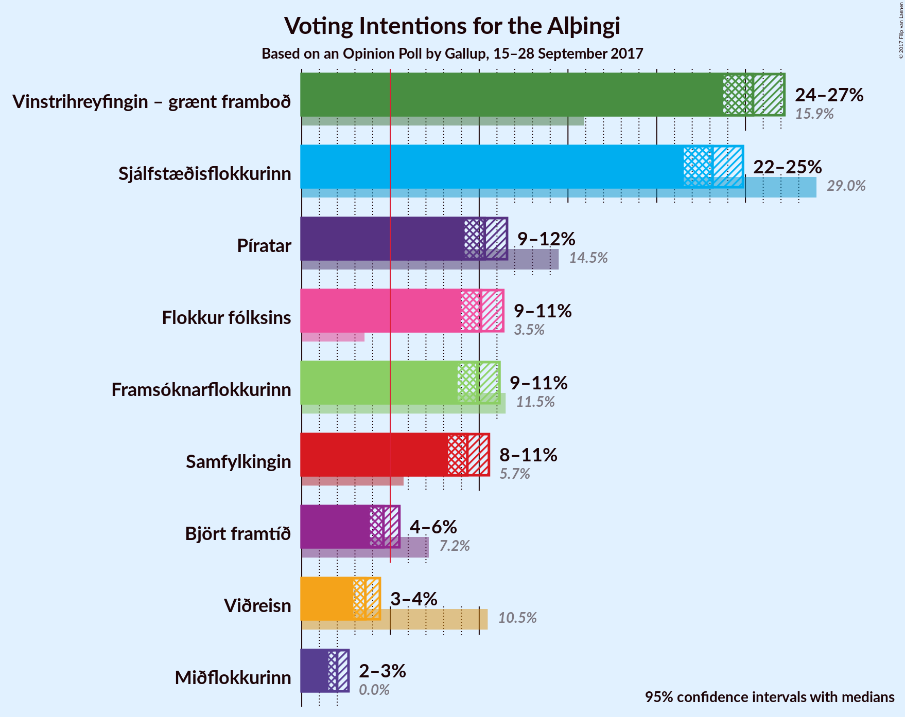
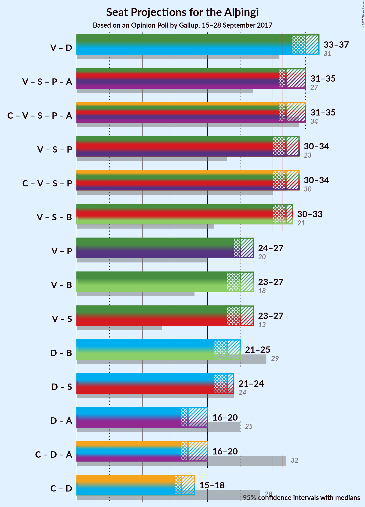

# Opinion Poll by Gallup, 15–28 September 2017

<a href="#voting-intentions">Voting Intentions</a> | <a href="#seats">Seats</a> | <a href="#coalitions">Coalitions</a> | <a href="#technical-information">Technical Information</a>

## Voting Intentions

### Confidence Intervals

| Party | Last Result | Poll Result | 80% Confidence Interval | 90% Confidence Interval | 95% Confidence Interval | 99% Confidence Interval |
|:-----:|:-----------:|:-----------:|:-----------------------:|:-----------------------:|:-----------------------:|:-----------------------:|
| Vinstrihreyfingin – grænt framboð | 15.9% | 25.4% | 24.3–26.6% |24.0–26.9% |23.7–27.2% |23.2–27.7% |
| Sjálfstæðisflokkurinn | 29.0% | 23.1% | 22.1–24.3% |21.8–24.6% |21.5–24.9% |21.0–25.4% |
| Píratar | 14.5% | 10.3% | 9.6–11.1% |9.3–11.4% |9.2–11.6% |8.8–12.0% |
| Flokkur fólksins | 3.5% | 10.1% | 9.4–10.9% |9.2–11.2% |9.0–11.4% |8.6–11.8% |
| Framsóknarflokkurinn | 11.5% | 9.9% | 9.2–10.7% |9.0–10.9% |8.8–11.1% |8.4–11.6% |
| Samfylkingin | 5.7% | 9.3% | 8.6–10.1% |8.4–10.3% |8.2–10.5% |7.9–10.9% |
| Björt framtíð | 7.2% | 4.6% | 4.1–5.2% |4.0–5.4% |3.8–5.5% |3.6–5.8% |
| Viðreisn | 10.5% | 3.6% | 3.1–4.1% |3.0–4.3% |2.9–4.4% |2.7–4.7% |
| Miðflokkurinn | 0.0% | 2.0% | 1.7–2.4% |1.6–2.5% |1.5–2.6% |1.4–2.9% |

*Note:* The poll result column reflects the actual value used in the calculations. Published results may vary slightly, and in addition be rounded to fewer digits.

## Seats

### Confidence Intervals

| Party | Last Result | Median | 80% Confidence Interval | 90% Confidence Interval | 95% Confidence Interval | 99% Confidence Interval |
|:-----:|:-----------:|:------:|:-----------------------:|:-----------------------:|:-----------------------:|:-----------------------:|
| <a href="#vinstrihreyfingin-–-grænt-framboð">Vinstrihreyfingin – grænt framboð</a> | 10 | 18 | 17–19 |17–20 |17–20 |16–21 |
| <a href="#sjálfstæðisflokkurinn">Sjálfstæðisflokkurinn</a> | 21 | 16 | 16–18 |15–18 |15–18 |15–18 |
| <a href="#píratar">Píratar</a> | 10 | 7 | 6–8 |6–8 |6–8 |6–8 |
| <a href="#flokkur-fólksins">Flokkur fólksins</a> | 0 | 7 | 6–8 |6–8 |6–8 |6–8 |
| <a href="#framsóknarflokkurinn">Framsóknarflokkurinn</a> | 8 | 7 | 6–7 |6–8 |6–8 |6–8 |
| <a href="#samfylkingin">Samfylkingin</a> | 3 | 6 | 6–7 |6–7 |6–7 |5–8 |
| <a href="#björt-framtíð">Björt framtíð</a> | 4 | 0 | 0–3 |0–3 |0–3 |0–4 |
| <a href="#viðreisn">Viðreisn</a> | 7 | 0 | 0 |0 |0 |0 |
| <a href="#miðflokkurinn">Miðflokkurinn</a> | 0 | 0 | 0 |0 |0 |0 |

### Vinstrihreyfingin – grænt framboð

*For a full overview of the results for this party, see the [Vinstrihreyfingin – grænt framboð](party-vinstrihreyfingingrntframbo.html) page.*

| Number of Seats | Probability | Accumulated | Special Marks |
|:---------------:|:-----------:|:-----------:|:-------------:|
| 10 | 0% | 100% | Last Result |
| 11 | 0% | 100% |  |
| 12 | 0% | 100% |  |
| 13 | 0% | 100% |  |
| 14 | 0% | 100% |  |
| 15 | 0% | 100% |  |
| 16 | 0.8% | 100% |  |
| 17 | 15% | 99.1% |  |
| 18 | 42% | 84% | Median |
| 19 | 36% | 43% |  |
| 20 | 6% | 7% |  |
| 21 | 0.8% | 0.9% |  |
| 22 | 0% | 0% |  |

### Sjálfstæðisflokkurinn

*For a full overview of the results for this party, see the [Sjálfstæðisflokkurinn](party-sjlfstisflokkurinn.html) page.*

| Number of Seats | Probability | Accumulated | Special Marks |
|:---------------:|:-----------:|:-----------:|:-------------:|
| 14 | 0.2% | 100% |  |
| 15 | 9% | 99.8% |  |
| 16 | 43% | 91% | Median |
| 17 | 37% | 48% |  |
| 18 | 11% | 11% |  |
| 19 | 0.2% | 0.2% |  |
| 20 | 0% | 0% |  |
| 21 | 0% | 0% | Last Result |

### Píratar

*For a full overview of the results for this party, see the [Píratar](party-pratar.html) page.*

| Number of Seats | Probability | Accumulated | Special Marks |
|:---------------:|:-----------:|:-----------:|:-------------:|
| 6 | 11% | 100% |  |
| 7 | 71% | 89% | Median |
| 8 | 18% | 18% |  |
| 9 | 0.2% | 0.2% |  |
| 10 | 0% | 0% | Last Result |

### Flokkur fólksins

*For a full overview of the results for this party, see the [Flokkur fólksins](party-flokkurflksins.html) page.*

| Number of Seats | Probability | Accumulated | Special Marks |
|:---------------:|:-----------:|:-----------:|:-------------:|
| 0 | 0% | 100% | Last Result |
| 1 | 0% | 100% |  |
| 2 | 0% | 100% |  |
| 3 | 0% | 100% |  |
| 4 | 0% | 100% |  |
| 5 | 0.1% | 100% |  |
| 6 | 18% | 99.9% |  |
| 7 | 58% | 82% | Median |
| 8 | 24% | 24% |  |
| 9 | 0.1% | 0.1% |  |
| 10 | 0% | 0% |  |

### Framsóknarflokkurinn

*For a full overview of the results for this party, see the [Framsóknarflokkurinn](party-framsknarflokkurinn.html) page.*

| Number of Seats | Probability | Accumulated | Special Marks |
|:---------------:|:-----------:|:-----------:|:-------------:|
| 5 | 0.3% | 100% |  |
| 6 | 27% | 99.7% |  |
| 7 | 63% | 73% | Median |
| 8 | 10% | 10% | Last Result |
| 9 | 0.1% | 0.1% |  |
| 10 | 0% | 0% |  |

### Samfylkingin

*For a full overview of the results for this party, see the [Samfylkingin](party-samfylkingin.html) page.*

| Number of Seats | Probability | Accumulated | Special Marks |
|:---------------:|:-----------:|:-----------:|:-------------:|
| 3 | 0% | 100% | Last Result |
| 4 | 0% | 100% |  |
| 5 | 2% | 100% |  |
| 6 | 53% | 98% | Median |
| 7 | 44% | 45% |  |
| 8 | 0.7% | 0.7% |  |
| 9 | 0% | 0% |  |

### Björt framtíð

*For a full overview of the results for this party, see the [Björt framtíð](party-bjrtframt.html) page.*

| Number of Seats | Probability | Accumulated | Special Marks |
|:---------------:|:-----------:|:-----------:|:-------------:|
| 0 | 61% | 100% | Median |
| 1 | 22% | 39% |  |
| 2 | 0% | 17% |  |
| 3 | 16% | 17% |  |
| 4 | 1.4% | 1.4% | Last Result |
| 5 | 0% | 0% |  |

### Viðreisn

*For a full overview of the results for this party, see the [Viðreisn](party-vireisn.html) page.*

| Number of Seats | Probability | Accumulated | Special Marks |
|:---------------:|:-----------:|:-----------:|:-------------:|
| 0 | 100% | 100% | Median |
| 1 | 0% | 0% |  |
| 2 | 0% | 0% |  |
| 3 | 0% | 0% |  |
| 4 | 0% | 0% |  |
| 5 | 0% | 0% |  |
| 6 | 0% | 0% |  |
| 7 | 0% | 0% | Last Result |

### Miðflokkurinn

*For a full overview of the results for this party, see the [Miðflokkurinn](party-miflokkurinn.html) page.*

| Number of Seats | Probability | Accumulated | Special Marks |
|:---------------:|:-----------:|:-----------:|:-------------:|
| 0 | 100% | 100% | Last Result, Median |

## Coalitions

### Confidence Intervals

| Coalition | Last Result | Median | Majority? | 80% Confidence Interval | 90% Confidence Interval | 95% Confidence Interval | 99% Confidence Interval |
|:---------:|:-----------:|:------:|:---------:|:-----------------------:|:-----------------------:|:-----------------------:|:-----------------------:|
| Vinstrihreyfingin – grænt framboð – Sjálfstæðisflokkurinn | 31 | 35 | 100% | 34–36 | 33–37 | 33–37 | 32–37 |
| Vinstrihreyfingin – grænt framboð – Píratar – Samfylkingin – Björt framtíð | 27 | 32 | 84% | 31–34 | 31–35 | 31–35 | 30–36 |
| Vinstrihreyfingin – grænt framboð – Píratar – Samfylkingin – Björt framtíð – Viðreisn | 34 | 32 | 84% | 31–34 | 31–35 | 31–35 | 30–36 |
| Vinstrihreyfingin – grænt framboð – Píratar – Samfylkingin | 23 | 32 | 62% | 31–33 | 30–33 | 30–34 | 29–35 |
| Vinstrihreyfingin – grænt framboð – Píratar – Samfylkingin – Viðreisn | 30 | 32 | 62% | 31–33 | 30–33 | 30–34 | 29–35 |
| Vinstrihreyfingin – grænt framboð – Framsóknarflokkurinn – Samfylkingin | 21 | 32 | 54% | 30–33 | 30–33 | 30–33 | 29–34 |
| Vinstrihreyfingin – grænt framboð – Píratar | 20 | 25 | 0% | 24–27 | 24–27 | 24–27 | 23–28 |
| Vinstrihreyfingin – grænt framboð – Framsóknarflokkurinn | 18 | 25 | 0% | 24–26 | 24–27 | 23–27 | 23–28 |
| Vinstrihreyfingin – grænt framboð – Samfylkingin | 13 | 25 | 0% | 24–26 | 23–26 | 23–27 | 23–27 |
| Sjálfstæðisflokkurinn – Framsóknarflokkurinn | 29 | 23 | 0% | 22–25 | 22–25 | 21–25 | 21–26 |
| Sjálfstæðisflokkurinn – Samfylkingin | 24 | 23 | 0% | 22–24 | 21–24 | 21–24 | 21–25 |
| Sjálfstæðisflokkurinn – Björt framtíð | 25 | 17 | 0% | 16–19 | 16–20 | 16–20 | 15–20 |
| Sjálfstæðisflokkurinn – Björt framtíð – Viðreisn | 32 | 17 | 0% | 16–19 | 16–20 | 16–20 | 15–20 |
| Sjálfstæðisflokkurinn – Viðreisn | 28 | 16 | 0% | 16–18 | 15–18 | 15–18 | 15–18 |

### Vinstrihreyfingin – grænt framboð – Sjálfstæðisflokkurinn

| Number of Seats | Probability | Accumulated | Special Marks |
|:---------------:|:-----------:|:-----------:|:-------------:|
| 31 | 0% | 100% | Last Result |
| 32 | 2% | 100% | Majority |
| 33 | 6% | 98% |  |
| 34 | 33% | 93% | Median |
| 35 | 31% | 59% |  |
| 36 | 23% | 28% |  |
| 37 | 5% | 5% |  |
| 38 | 0.2% | 0.2% |  |
| 39 | 0% | 0% |  |

### Vinstrihreyfingin – grænt framboð – Píratar – Samfylkingin – Björt framtíð

| Number of Seats | Probability | Accumulated | Special Marks |
|:---------------:|:-----------:|:-----------:|:-------------:|
| 27 | 0% | 100% | Last Result |
| 28 | 0% | 100% |  |
| 29 | 0% | 100% |  |
| 30 | 0.7% | 100% |  |
| 31 | 15% | 99.2% | Median |
| 32 | 35% | 84% | Majority |
| 33 | 29% | 49% |  |
| 34 | 14% | 20% |  |
| 35 | 5% | 6% |  |
| 36 | 1.4% | 1.4% |  |
| 37 | 0% | 0% |  |

### Vinstrihreyfingin – grænt framboð – Píratar – Samfylkingin – Björt framtíð – Viðreisn

| Number of Seats | Probability | Accumulated | Special Marks |
|:---------------:|:-----------:|:-----------:|:-------------:|
| 30 | 0.7% | 100% |  |
| 31 | 15% | 99.3% | Median |
| 32 | 35% | 84% | Majority |
| 33 | 29% | 49% |  |
| 34 | 14% | 20% | Last Result |
| 35 | 5% | 6% |  |
| 36 | 1.4% | 1.4% |  |
| 37 | 0% | 0% |  |

### Vinstrihreyfingin – grænt framboð – Píratar – Samfylkingin

| Number of Seats | Probability | Accumulated | Special Marks |
|:---------------:|:-----------:|:-----------:|:-------------:|
| 23 | 0% | 100% | Last Result |
| 24 | 0% | 100% |  |
| 25 | 0% | 100% |  |
| 26 | 0% | 100% |  |
| 27 | 0% | 100% |  |
| 28 | 0% | 100% |  |
| 29 | 1.4% | 100% |  |
| 30 | 7% | 98.6% |  |
| 31 | 30% | 92% | Median |
| 32 | 34% | 62% | Majority |
| 33 | 23% | 28% |  |
| 34 | 4% | 5% |  |
| 35 | 0.5% | 0.5% |  |
| 36 | 0% | 0% |  |

### Vinstrihreyfingin – grænt framboð – Píratar – Samfylkingin – Viðreisn

| Number of Seats | Probability | Accumulated | Special Marks |
|:---------------:|:-----------:|:-----------:|:-------------:|
| 29 | 1.4% | 100% |  |
| 30 | 7% | 98.6% | Last Result |
| 31 | 30% | 92% | Median |
| 32 | 34% | 62% | Majority |
| 33 | 23% | 28% |  |
| 34 | 4% | 5% |  |
| 35 | 0.5% | 0.5% |  |
| 36 | 0% | 0% |  |

### Vinstrihreyfingin – grænt framboð – Framsóknarflokkurinn – Samfylkingin

| Number of Seats | Probability | Accumulated | Special Marks |
|:---------------:|:-----------:|:-----------:|:-------------:|
| 21 | 0% | 100% | Last Result |
| 22 | 0% | 100% |  |
| 23 | 0% | 100% |  |
| 24 | 0% | 100% |  |
| 25 | 0% | 100% |  |
| 26 | 0% | 100% |  |
| 27 | 0% | 100% |  |
| 28 | 0.1% | 100% |  |
| 29 | 2% | 99.9% |  |
| 30 | 11% | 98% |  |
| 31 | 33% | 87% | Median |
| 32 | 36% | 54% | Majority |
| 33 | 17% | 19% |  |
| 34 | 2% | 2% |  |
| 35 | 0.2% | 0.2% |  |
| 36 | 0% | 0% |  |

### Vinstrihreyfingin – grænt framboð – Píratar

| Number of Seats | Probability | Accumulated | Special Marks |
|:---------------:|:-----------:|:-----------:|:-------------:|
| 20 | 0% | 100% | Last Result |
| 21 | 0% | 100% |  |
| 22 | 0% | 100% |  |
| 23 | 2% | 100% |  |
| 24 | 14% | 98% |  |
| 25 | 38% | 84% | Median |
| 26 | 34% | 46% |  |
| 27 | 11% | 12% |  |
| 28 | 1.4% | 1.5% |  |
| 29 | 0% | 0% |  |

### Vinstrihreyfingin – grænt framboð – Framsóknarflokkurinn

| Number of Seats | Probability | Accumulated | Special Marks |
|:---------------:|:-----------:|:-----------:|:-------------:|
| 18 | 0% | 100% | Last Result |
| 19 | 0% | 100% |  |
| 20 | 0% | 100% |  |
| 21 | 0% | 100% |  |
| 22 | 0.2% | 100% |  |
| 23 | 4% | 99.8% |  |
| 24 | 16% | 96% |  |
| 25 | 46% | 80% | Median |
| 26 | 29% | 34% |  |
| 27 | 5% | 5% |  |
| 28 | 0.6% | 0.6% |  |
| 29 | 0% | 0% |  |

### Vinstrihreyfingin – grænt framboð – Samfylkingin

| Number of Seats | Probability | Accumulated | Special Marks |
|:---------------:|:-----------:|:-----------:|:-------------:|
| 13 | 0% | 100% | Last Result |
| 14 | 0% | 100% |  |
| 15 | 0% | 100% |  |
| 16 | 0% | 100% |  |
| 17 | 0% | 100% |  |
| 18 | 0% | 100% |  |
| 19 | 0% | 100% |  |
| 20 | 0% | 100% |  |
| 21 | 0% | 100% |  |
| 22 | 0.4% | 100% |  |
| 23 | 9% | 99.6% |  |
| 24 | 29% | 91% | Median |
| 25 | 42% | 62% |  |
| 26 | 17% | 21% |  |
| 27 | 3% | 4% |  |
| 28 | 0.5% | 0.5% |  |
| 29 | 0% | 0% |  |

### Sjálfstæðisflokkurinn – Framsóknarflokkurinn

| Number of Seats | Probability | Accumulated | Special Marks |
|:---------------:|:-----------:|:-----------:|:-------------:|
| 20 | 0.2% | 100% |  |
| 21 | 4% | 99.8% |  |
| 22 | 12% | 96% |  |
| 23 | 41% | 83% | Median |
| 24 | 31% | 42% |  |
| 25 | 10% | 11% |  |
| 26 | 0.6% | 0.6% |  |
| 27 | 0% | 0% |  |
| 28 | 0% | 0% |  |
| 29 | 0% | 0% | Last Result |

### Sjálfstæðisflokkurinn – Samfylkingin

| Number of Seats | Probability | Accumulated | Special Marks |
|:---------------:|:-----------:|:-----------:|:-------------:|
| 20 | 0.3% | 100% |  |
| 21 | 5% | 99.7% |  |
| 22 | 26% | 95% | Median |
| 23 | 41% | 69% |  |
| 24 | 25% | 28% | Last Result |
| 25 | 2% | 2% |  |
| 26 | 0.1% | 0.1% |  |
| 27 | 0% | 0% |  |

### Sjálfstæðisflokkurinn – Björt framtíð

| Number of Seats | Probability | Accumulated | Special Marks |
|:---------------:|:-----------:|:-----------:|:-------------:|
| 15 | 1.5% | 100% |  |
| 16 | 23% | 98.5% | Median |
| 17 | 44% | 76% |  |
| 18 | 18% | 32% |  |
| 19 | 9% | 14% |  |
| 20 | 5% | 5% |  |
| 21 | 0.2% | 0.2% |  |
| 22 | 0% | 0% |  |
| 23 | 0% | 0% |  |
| 24 | 0% | 0% |  |
| 25 | 0% | 0% | Last Result |

### Sjálfstæðisflokkurinn – Björt framtíð – Viðreisn

| Number of Seats | Probability | Accumulated | Special Marks |
|:---------------:|:-----------:|:-----------:|:-------------:|
| 15 | 1.5% | 100% |  |
| 16 | 23% | 98.5% | Median |
| 17 | 44% | 76% |  |
| 18 | 18% | 32% |  |
| 19 | 9% | 14% |  |
| 20 | 5% | 5% |  |
| 21 | 0.2% | 0.2% |  |
| 22 | 0% | 0% |  |
| 23 | 0% | 0% |  |
| 24 | 0% | 0% |  |
| 25 | 0% | 0% |  |
| 26 | 0% | 0% |  |
| 27 | 0% | 0% |  |
| 28 | 0% | 0% |  |
| 29 | 0% | 0% |  |
| 30 | 0% | 0% |  |
| 31 | 0% | 0% |  |
| 32 | 0% | 0% | Last Result, Majority |

### Sjálfstæðisflokkurinn – Viðreisn

| Number of Seats | Probability | Accumulated | Special Marks |
|:---------------:|:-----------:|:-----------:|:-------------:|
| 14 | 0.2% | 100% |  |
| 15 | 9% | 99.8% |  |
| 16 | 43% | 91% | Median |
| 17 | 37% | 48% |  |
| 18 | 11% | 11% |  |
| 19 | 0.2% | 0.2% |  |
| 20 | 0% | 0% |  |
| 21 | 0% | 0% |  |
| 22 | 0% | 0% |  |
| 23 | 0% | 0% |  |
| 24 | 0% | 0% |  |
| 25 | 0% | 0% |  |
| 26 | 0% | 0% |  |
| 27 | 0% | 0% |  |
| 28 | 0% | 0% | Last Result |

## Technical Information

### Opinion Poll

+ **Pollster:** Gallup
+ **Media:** —
+ **Fieldwork period:** 15–28 September 2017

### Calculations

+ **Sample size:** 2454
+ **Simulations done:** 2,097,152
+ **Error estimate:** 1.25%

