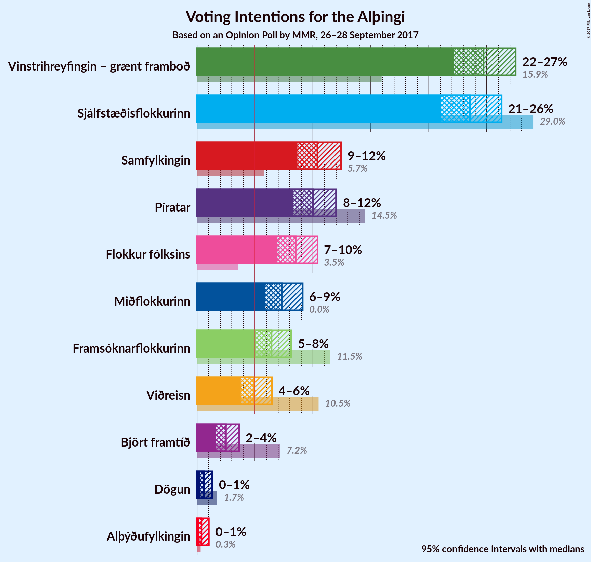

# Opinion Poll by MMR, 26–28 September 2017

<a href="#voting-intentions">Voting Intentions</a> | <a href="#seats">Seats</a> | <a href="#coalitions">Coalitions</a> | <a href="#technical-information">Technical Information</a>

## Voting Intentions

### Confidence Intervals

| Party | Last Result | Poll Result | 80% Confidence Interval | 90% Confidence Interval | 95% Confidence Interval | 99% Confidence Interval |
|:-----:|:-----------:|:-----------:|:-----------------------:|:-----------------------:|:-----------------------:|:-----------------------:|
| Vinstrihreyfingin – grænt framboð | 15.9% | 24.7% | 23.0–26.5% |22.6–27.0% |22.2–27.5% |21.4–28.4% |
| Sjálfstæðisflokkurinn | 29.0% | 23.5% | 21.9–25.3% |21.4–25.8% |21.0–26.3% |20.3–27.1% |
| Samfylkingin | 5.7% | 10.4% | 9.3–11.7% |8.9–12.1% |8.7–12.4% |8.1–13.1% |
| Píratar | 14.5% | 10.0% | 8.9–11.3% |8.6–11.7% |8.3–12.0% |7.8–12.7% |
| Flokkur fólksins | 3.5% | 8.5% | 7.5–9.7% |7.2–10.1% |6.9–10.4% |6.5–11.0% |
| Miðflokkurinn | 0.0% | 7.3% | 6.4–8.5% |6.1–8.8% |5.9–9.1% |5.4–9.7% |
| Framsóknarflokkurinn | 11.5% | 6.4% | 5.5–7.5% |5.3–7.8% |5.1–8.1% |4.7–8.7% |
| Viðreisn | 10.5% | 4.9% | 4.2–5.9% |3.9–6.2% |3.8–6.5% |3.4–7.0% |
| Björt framtíð | 7.2% | 2.5% | 2.0–3.2% |1.8–3.4% |1.7–3.6% |1.5–4.0% |
| Dögun | 1.7% | 0.6% | 0.4–1.1% |0.3–1.2% |0.3–1.3% |0.2–1.5% |

*Note:* The poll result column reflects the actual value used in the calculations. Published results may vary slightly, and in addition be rounded to fewer digits.

## Seats

### Confidence Intervals

| Party | Last Result | Median | 80% Confidence Interval | 90% Confidence Interval | 95% Confidence Interval | 99% Confidence Interval |
|:-----:|:-----------:|:------:|:-----------------------:|:-----------------------:|:-----------------------:|:-----------------------:|
| <a href="#vinstrihreyfingin-–-grænt-framboð">Vinstrihreyfingin – grænt framboð</a> | 10 | 17 | 16–20 |16–20 |16–21 |15–21 |
| <a href="#sjálfstæðisflokkurinn">Sjálfstæðisflokkurinn</a> | 21 | 17 | 14–18 |14–18 |14–18 |13–19 |
| <a href="#samfylkingin">Samfylkingin</a> | 3 | 7 | 6–8 |6–8 |6–8 |5–9 |
| <a href="#píratar">Píratar</a> | 10 | 6 | 6–8 |5–8 |5–8 |5–8 |
| <a href="#flokkur-fólksins">Flokkur fólksins</a> | 0 | 6 | 5–7 |4–7 |4–7 |4–7 |
| <a href="#miðflokkurinn">Miðflokkurinn</a> | 0 | 5 | 4–6 |4–6 |4–6 |3–6 |
| <a href="#framsóknarflokkurinn">Framsóknarflokkurinn</a> | 8 | 4 | 3–5 |3–5 |3–5 |2–5 |
| <a href="#viðreisn">Viðreisn</a> | 7 | 3 | 0–4 |0–4 |0–4 |0–4 |
| <a href="#björt-framtíð">Björt framtíð</a> | 4 | 0 | 0 |0 |0 |0 |
| <a href="#dögun">Dögun</a> | 0 | 0 | 0 |0 |0 |0 |

### Vinstrihreyfingin – grænt framboð

*For a full overview of the results for this party, see the [Vinstrihreyfingin – grænt framboð](party-vinstrihreyfingingrntframbo.html) page.*

| Number of Seats | Probability | Accumulated | Special Marks |
|:---------------:|:-----------:|:-----------:|:-------------:|
| 10 | 0% | 100% | Last Result |
| 11 | 0% | 100% |  |
| 12 | 0% | 100% |  |
| 13 | 0% | 100% |  |
| 14 | 0.1% | 100% |  |
| 15 | 2% | 99.9% |  |
| 16 | 20% | 98% |  |
| 17 | 35% | 78% | Median |
| 18 | 19% | 43% |  |
| 19 | 11% | 23% |  |
| 20 | 10% | 13% |  |
| 21 | 2% | 3% |  |
| 22 | 0.1% | 0.1% |  |
| 23 | 0% | 0% |  |

### Sjálfstæðisflokkurinn

*For a full overview of the results for this party, see the [Sjálfstæðisflokkurinn](party-sjlfstisflokkurinn.html) page.*

| Number of Seats | Probability | Accumulated | Special Marks |
|:---------------:|:-----------:|:-----------:|:-------------:|
| 13 | 0.6% | 100% |  |
| 14 | 11% | 99.4% |  |
| 15 | 14% | 89% |  |
| 16 | 24% | 75% |  |
| 17 | 41% | 51% | Median |
| 18 | 8% | 10% |  |
| 19 | 2% | 2% |  |
| 20 | 0.2% | 0.2% |  |
| 21 | 0% | 0% | Last Result |

### Samfylkingin

*For a full overview of the results for this party, see the [Samfylkingin](party-samfylkingin.html) page.*

| Number of Seats | Probability | Accumulated | Special Marks |
|:---------------:|:-----------:|:-----------:|:-------------:|
| 3 | 0% | 100% | Last Result |
| 4 | 0% | 100% |  |
| 5 | 0.8% | 100% |  |
| 6 | 41% | 99.2% |  |
| 7 | 46% | 58% | Median |
| 8 | 11% | 13% |  |
| 9 | 2% | 2% |  |
| 10 | 0.1% | 0.1% |  |
| 11 | 0% | 0% |  |

### Píratar

*For a full overview of the results for this party, see the [Píratar](party-pratar.html) page.*

| Number of Seats | Probability | Accumulated | Special Marks |
|:---------------:|:-----------:|:-----------:|:-------------:|
| 4 | 0.1% | 100% |  |
| 5 | 7% | 99.9% |  |
| 6 | 50% | 93% | Median |
| 7 | 33% | 43% |  |
| 8 | 10% | 10% |  |
| 9 | 0.4% | 0.4% |  |
| 10 | 0% | 0% | Last Result |

### Flokkur fólksins

*For a full overview of the results for this party, see the [Flokkur fólksins](party-flokkurflksins.html) page.*

| Number of Seats | Probability | Accumulated | Special Marks |
|:---------------:|:-----------:|:-----------:|:-------------:|
| 0 | 0% | 100% | Last Result |
| 1 | 0% | 100% |  |
| 2 | 0% | 100% |  |
| 3 | 0.1% | 100% |  |
| 4 | 7% | 99.9% |  |
| 5 | 34% | 93% |  |
| 6 | 48% | 59% | Median |
| 7 | 10% | 11% |  |
| 8 | 0.2% | 0.2% |  |
| 9 | 0% | 0% |  |

### Miðflokkurinn

*For a full overview of the results for this party, see the [Miðflokkurinn](party-miflokkurinn.html) page.*

| Number of Seats | Probability | Accumulated | Special Marks |
|:---------------:|:-----------:|:-----------:|:-------------:|
| 0 | 0% | 100% | Last Result |
| 1 | 0% | 100% |  |
| 2 | 0% | 100% |  |
| 3 | 2% | 100% |  |
| 4 | 43% | 98% |  |
| 5 | 43% | 55% | Median |
| 6 | 11% | 11% |  |
| 7 | 0.3% | 0.3% |  |
| 8 | 0% | 0% |  |

### Framsóknarflokkurinn

*For a full overview of the results for this party, see the [Framsóknarflokkurinn](party-framsknarflokkurinn.html) page.*

| Number of Seats | Probability | Accumulated | Special Marks |
|:---------------:|:-----------:|:-----------:|:-------------:|
| 0 | 0.1% | 100% |  |
| 1 | 0.2% | 99.9% |  |
| 2 | 1.1% | 99.7% |  |
| 3 | 18% | 98.7% |  |
| 4 | 64% | 81% | Median |
| 5 | 16% | 17% |  |
| 6 | 0.5% | 0.5% |  |
| 7 | 0% | 0% |  |
| 8 | 0% | 0% | Last Result |

### Viðreisn

*For a full overview of the results for this party, see the [Viðreisn](party-vireisn.html) page.*

| Number of Seats | Probability | Accumulated | Special Marks |
|:---------------:|:-----------:|:-----------:|:-------------:|
| 0 | 45% | 100% |  |
| 1 | 0% | 55% |  |
| 2 | 0% | 54% |  |
| 3 | 43% | 54% | Median |
| 4 | 11% | 12% |  |
| 5 | 0.2% | 0.2% |  |
| 6 | 0% | 0% |  |
| 7 | 0% | 0% | Last Result |

### Björt framtíð

*For a full overview of the results for this party, see the [Björt framtíð](party-bjrtframt.html) page.*

| Number of Seats | Probability | Accumulated | Special Marks |
|:---------------:|:-----------:|:-----------:|:-------------:|
| 0 | 100% | 100% | Median |
| 1 | 0% | 0% |  |
| 2 | 0% | 0% |  |
| 3 | 0% | 0% |  |
| 4 | 0% | 0% | Last Result |

### Dögun

*For a full overview of the results for this party, see the [Dögun](party-dgun.html) page.*

| Number of Seats | Probability | Accumulated | Special Marks |
|:---------------:|:-----------:|:-----------:|:-------------:|
| 0 | 100% | 100% | Last Result, Median |

## Coalitions

### Confidence Intervals

| Coalition | Last Result | Median | Majority? | 80% Confidence Interval | 90% Confidence Interval | 95% Confidence Interval | 99% Confidence Interval |
|:---------:|:-----------:|:------:|:---------:|:-----------------------:|:-----------------------:|:-----------------------:|:-----------------------:|
| Vinstrihreyfingin – grænt framboð – Sjálfstæðisflokkurinn | 31 | 34 | 97% | 32–35 | 32–36 | 31–36 | 30–37 |
| Vinstrihreyfingin – grænt framboð – Samfylkingin – Píratar – Viðreisn – Björt framtíð | 34 | 32 | 74% | 30–35 | 30–35 | 30–36 | 29–37 |
| Vinstrihreyfingin – grænt framboð – Samfylkingin – Miðflokkurinn – Framsóknarflokkurinn | 21 | 33 | 76% | 31–35 | 30–36 | 30–36 | 29–37 |
| Vinstrihreyfingin – grænt framboð – Samfylkingin – Píratar – Viðreisn | 30 | 32 | 74% | 30–35 | 30–35 | 30–36 | 29–37 |
| Vinstrihreyfingin – grænt framboð – Samfylkingin – Píratar – Björt framtíð | 27 | 31 | 35% | 29–33 | 28–33 | 28–34 | 27–35 |
| Vinstrihreyfingin – grænt framboð – Samfylkingin – Píratar | 23 | 31 | 35% | 29–33 | 28–33 | 28–34 | 27–35 |
| Vinstrihreyfingin – grænt framboð – Samfylkingin – Miðflokkurinn | 13 | 29 | 8% | 27–31 | 27–32 | 26–32 | 25–33 |
| Vinstrihreyfingin – grænt framboð – Samfylkingin – Framsóknarflokkurinn | 21 | 28 | 2% | 27–30 | 26–31 | 26–31 | 25–32 |
| Vinstrihreyfingin – grænt framboð – Miðflokkurinn – Framsóknarflokkurinn | 18 | 26 | 0% | 24–28 | 23–29 | 23–29 | 23–30 |
| Sjálfstæðisflokkurinn – Miðflokkurinn – Framsóknarflokkurinn | 29 | 25 | 0% | 22–27 | 22–27 | 22–28 | 21–28 |
| Vinstrihreyfingin – grænt framboð – Píratar | 20 | 24 | 0% | 22–26 | 22–26 | 22–27 | 21–28 |
| Vinstrihreyfingin – grænt framboð – Samfylkingin | 13 | 24 | 0% | 23–26 | 22–27 | 22–27 | 21–28 |
| Sjálfstæðisflokkurinn – Samfylkingin | 24 | 23 | 0% | 21–25 | 20–25 | 20–26 | 20–27 |
| Vinstrihreyfingin – grænt framboð – Miðflokkurinn | 10 | 22 | 0% | 20–24 | 20–25 | 20–25 | 19–26 |
| Vinstrihreyfingin – grænt framboð – Framsóknarflokkurinn | 18 | 21 | 0% | 20–24 | 19–24 | 19–24 | 19–25 |
| Sjálfstæðisflokkurinn – Framsóknarflokkurinn | 29 | 20 | 0% | 18–22 | 18–22 | 18–23 | 17–23 |
| Sjálfstæðisflokkurinn – Miðflokkurinn | 21 | 21 | 0% | 19–23 | 18–23 | 18–23 | 18–24 |
| Sjálfstæðisflokkurinn – Viðreisn – Björt framtíð | 32 | 18 | 0% | 16–20 | 16–20 | 15–21 | 14–22 |
| Sjálfstæðisflokkurinn – Viðreisn | 28 | 18 | 0% | 16–20 | 16–20 | 15–21 | 14–22 |
| Sjálfstæðisflokkurinn – Björt framtíð | 25 | 17 | 0% | 14–18 | 14–18 | 14–18 | 13–19 |

### Vinstrihreyfingin – grænt framboð – Sjálfstæðisflokkurinn

| Number of Seats | Probability | Accumulated | Special Marks |
|:---------------:|:-----------:|:-----------:|:-------------:|
| 29 | 0.1% | 100% |  |
| 30 | 0.6% | 99.9% |  |
| 31 | 2% | 99.3% | Last Result |
| 32 | 8% | 97% | Majority |
| 33 | 26% | 89% |  |
| 34 | 38% | 63% | Median |
| 35 | 17% | 25% |  |
| 36 | 6% | 7% |  |
| 37 | 1.4% | 2% |  |
| 38 | 0.4% | 0.4% |  |
| 39 | 0% | 0% |  |

### Vinstrihreyfingin – grænt framboð – Samfylkingin – Píratar – Viðreisn – Björt framtíð

| Number of Seats | Probability | Accumulated | Special Marks |
|:---------------:|:-----------:|:-----------:|:-------------:|
| 28 | 0.1% | 100% |  |
| 29 | 2% | 99.9% |  |
| 30 | 11% | 98% |  |
| 31 | 12% | 86% |  |
| 32 | 26% | 74% | Majority |
| 33 | 22% | 48% | Median |
| 34 | 11% | 26% | Last Result |
| 35 | 12% | 15% |  |
| 36 | 2% | 3% |  |
| 37 | 0.9% | 1.0% |  |
| 38 | 0% | 0% |  |

### Vinstrihreyfingin – grænt framboð – Samfylkingin – Miðflokkurinn – Framsóknarflokkurinn

| Number of Seats | Probability | Accumulated | Special Marks |
|:---------------:|:-----------:|:-----------:|:-------------:|
| 21 | 0% | 100% | Last Result |
| 22 | 0% | 100% |  |
| 23 | 0% | 100% |  |
| 24 | 0% | 100% |  |
| 25 | 0% | 100% |  |
| 26 | 0% | 100% |  |
| 27 | 0% | 100% |  |
| 28 | 0.1% | 100% |  |
| 29 | 1.2% | 99.9% |  |
| 30 | 5% | 98.7% |  |
| 31 | 17% | 93% |  |
| 32 | 17% | 76% | Majority |
| 33 | 21% | 59% | Median |
| 34 | 22% | 38% |  |
| 35 | 8% | 16% |  |
| 36 | 6% | 7% |  |
| 37 | 1.1% | 1.2% |  |
| 38 | 0.1% | 0.1% |  |
| 39 | 0% | 0% |  |

### Vinstrihreyfingin – grænt framboð – Samfylkingin – Píratar – Viðreisn

| Number of Seats | Probability | Accumulated | Special Marks |
|:---------------:|:-----------:|:-----------:|:-------------:|
| 28 | 0.1% | 100% |  |
| 29 | 2% | 99.9% |  |
| 30 | 11% | 98% | Last Result |
| 31 | 12% | 86% |  |
| 32 | 26% | 74% | Majority |
| 33 | 22% | 48% | Median |
| 34 | 11% | 26% |  |
| 35 | 12% | 15% |  |
| 36 | 2% | 3% |  |
| 37 | 0.9% | 1.0% |  |
| 38 | 0% | 0% |  |

### Vinstrihreyfingin – grænt framboð – Samfylkingin – Píratar – Björt framtíð

| Number of Seats | Probability | Accumulated | Special Marks |
|:---------------:|:-----------:|:-----------:|:-------------:|
| 26 | 0.1% | 100% |  |
| 27 | 0.5% | 99.9% | Last Result |
| 28 | 4% | 99.4% |  |
| 29 | 16% | 95% |  |
| 30 | 28% | 79% | Median |
| 31 | 16% | 51% |  |
| 32 | 23% | 35% | Majority |
| 33 | 8% | 12% |  |
| 34 | 3% | 4% |  |
| 35 | 0.9% | 0.9% |  |
| 36 | 0% | 0% |  |

### Vinstrihreyfingin – grænt framboð – Samfylkingin – Píratar

| Number of Seats | Probability | Accumulated | Special Marks |
|:---------------:|:-----------:|:-----------:|:-------------:|
| 23 | 0% | 100% | Last Result |
| 24 | 0% | 100% |  |
| 25 | 0% | 100% |  |
| 26 | 0.1% | 100% |  |
| 27 | 0.5% | 99.9% |  |
| 28 | 4% | 99.4% |  |
| 29 | 16% | 95% |  |
| 30 | 28% | 79% | Median |
| 31 | 16% | 51% |  |
| 32 | 23% | 35% | Majority |
| 33 | 8% | 12% |  |
| 34 | 3% | 4% |  |
| 35 | 0.9% | 0.9% |  |
| 36 | 0% | 0% |  |

### Vinstrihreyfingin – grænt framboð – Samfylkingin – Miðflokkurinn

| Number of Seats | Probability | Accumulated | Special Marks |
|:---------------:|:-----------:|:-----------:|:-------------:|
| 13 | 0% | 100% | Last Result |
| 14 | 0% | 100% |  |
| 15 | 0% | 100% |  |
| 16 | 0% | 100% |  |
| 17 | 0% | 100% |  |
| 18 | 0% | 100% |  |
| 19 | 0% | 100% |  |
| 20 | 0% | 100% |  |
| 21 | 0% | 100% |  |
| 22 | 0% | 100% |  |
| 23 | 0% | 100% |  |
| 24 | 0% | 100% |  |
| 25 | 0.5% | 100% |  |
| 26 | 3% | 99.4% |  |
| 27 | 19% | 96% |  |
| 28 | 20% | 78% |  |
| 29 | 20% | 57% | Median |
| 30 | 21% | 37% |  |
| 31 | 8% | 16% |  |
| 32 | 7% | 8% | Majority |
| 33 | 1.2% | 1.3% |  |
| 34 | 0.1% | 0.1% |  |
| 35 | 0% | 0% |  |

### Vinstrihreyfingin – grænt framboð – Samfylkingin – Framsóknarflokkurinn

| Number of Seats | Probability | Accumulated | Special Marks |
|:---------------:|:-----------:|:-----------:|:-------------:|
| 21 | 0% | 100% | Last Result |
| 22 | 0% | 100% |  |
| 23 | 0% | 100% |  |
| 24 | 0.1% | 100% |  |
| 25 | 2% | 99.8% |  |
| 26 | 7% | 98% |  |
| 27 | 25% | 91% |  |
| 28 | 25% | 65% | Median |
| 29 | 16% | 40% |  |
| 30 | 18% | 24% |  |
| 31 | 4% | 5% |  |
| 32 | 2% | 2% | Majority |
| 33 | 0.3% | 0.3% |  |
| 34 | 0% | 0% |  |

### Vinstrihreyfingin – grænt framboð – Miðflokkurinn – Framsóknarflokkurinn

| Number of Seats | Probability | Accumulated | Special Marks |
|:---------------:|:-----------:|:-----------:|:-------------:|
| 18 | 0% | 100% | Last Result |
| 19 | 0% | 100% |  |
| 20 | 0% | 100% |  |
| 21 | 0% | 100% |  |
| 22 | 0.2% | 100% |  |
| 23 | 5% | 99.8% |  |
| 24 | 9% | 95% |  |
| 25 | 23% | 86% |  |
| 26 | 24% | 63% | Median |
| 27 | 16% | 40% |  |
| 28 | 16% | 23% |  |
| 29 | 6% | 8% |  |
| 30 | 2% | 2% |  |
| 31 | 0.2% | 0.2% |  |
| 32 | 0% | 0% | Majority |

### Sjálfstæðisflokkurinn – Miðflokkurinn – Framsóknarflokkurinn

| Number of Seats | Probability | Accumulated | Special Marks |
|:---------------:|:-----------:|:-----------:|:-------------:|
| 20 | 0.1% | 100% |  |
| 21 | 1.4% | 99.9% |  |
| 22 | 9% | 98.5% |  |
| 23 | 10% | 90% |  |
| 24 | 15% | 79% |  |
| 25 | 27% | 65% |  |
| 26 | 25% | 38% | Median |
| 27 | 9% | 13% |  |
| 28 | 3% | 4% |  |
| 29 | 0.2% | 0.3% | Last Result |
| 30 | 0.1% | 0.1% |  |
| 31 | 0% | 0% |  |

### Vinstrihreyfingin – grænt framboð – Píratar

| Number of Seats | Probability | Accumulated | Special Marks |
|:---------------:|:-----------:|:-----------:|:-------------:|
| 20 | 0.1% | 100% | Last Result |
| 21 | 2% | 99.9% |  |
| 22 | 8% | 98% |  |
| 23 | 34% | 90% | Median |
| 24 | 19% | 56% |  |
| 25 | 19% | 37% |  |
| 26 | 13% | 18% |  |
| 27 | 3% | 4% |  |
| 28 | 1.0% | 1.0% |  |
| 29 | 0% | 0% |  |

### Vinstrihreyfingin – grænt framboð – Samfylkingin

| Number of Seats | Probability | Accumulated | Special Marks |
|:---------------:|:-----------:|:-----------:|:-------------:|
| 13 | 0% | 100% | Last Result |
| 14 | 0% | 100% |  |
| 15 | 0% | 100% |  |
| 16 | 0% | 100% |  |
| 17 | 0% | 100% |  |
| 18 | 0% | 100% |  |
| 19 | 0% | 100% |  |
| 20 | 0.1% | 100% |  |
| 21 | 0.9% | 99.9% |  |
| 22 | 6% | 99.0% |  |
| 23 | 29% | 93% |  |
| 24 | 24% | 64% | Median |
| 25 | 17% | 40% |  |
| 26 | 17% | 23% |  |
| 27 | 4% | 6% |  |
| 28 | 2% | 2% |  |
| 29 | 0.2% | 0.2% |  |
| 30 | 0% | 0% |  |

### Sjálfstæðisflokkurinn – Samfylkingin

| Number of Seats | Probability | Accumulated | Special Marks |
|:---------------:|:-----------:|:-----------:|:-------------:|
| 19 | 0.3% | 100% |  |
| 20 | 8% | 99.7% |  |
| 21 | 6% | 91% |  |
| 22 | 18% | 85% |  |
| 23 | 30% | 67% |  |
| 24 | 26% | 38% | Last Result, Median |
| 25 | 9% | 12% |  |
| 26 | 3% | 3% |  |
| 27 | 0.6% | 0.7% |  |
| 28 | 0% | 0% |  |

### Vinstrihreyfingin – grænt framboð – Miðflokkurinn

| Number of Seats | Probability | Accumulated | Special Marks |
|:---------------:|:-----------:|:-----------:|:-------------:|
| 10 | 0% | 100% | Last Result |
| 11 | 0% | 100% |  |
| 12 | 0% | 100% |  |
| 13 | 0% | 100% |  |
| 14 | 0% | 100% |  |
| 15 | 0% | 100% |  |
| 16 | 0% | 100% |  |
| 17 | 0% | 100% |  |
| 18 | 0.1% | 100% |  |
| 19 | 1.2% | 99.9% |  |
| 20 | 10% | 98.7% |  |
| 21 | 27% | 88% |  |
| 22 | 21% | 61% | Median |
| 23 | 19% | 40% |  |
| 24 | 13% | 22% |  |
| 25 | 6% | 8% |  |
| 26 | 2% | 2% |  |
| 27 | 0.1% | 0.1% |  |
| 28 | 0% | 0% |  |

### Vinstrihreyfingin – grænt framboð – Framsóknarflokkurinn

| Number of Seats | Probability | Accumulated | Special Marks |
|:---------------:|:-----------:|:-----------:|:-------------:|
| 17 | 0% | 100% |  |
| 18 | 0.4% | 99.9% | Last Result |
| 19 | 6% | 99.5% |  |
| 20 | 19% | 94% |  |
| 21 | 27% | 75% | Median |
| 22 | 24% | 47% |  |
| 23 | 11% | 23% |  |
| 24 | 10% | 12% |  |
| 25 | 2% | 2% |  |
| 26 | 0.3% | 0.3% |  |
| 27 | 0% | 0% |  |

### Sjálfstæðisflokkurinn – Framsóknarflokkurinn

| Number of Seats | Probability | Accumulated | Special Marks |
|:---------------:|:-----------:|:-----------:|:-------------:|
| 16 | 0.1% | 100% |  |
| 17 | 2% | 99.9% |  |
| 18 | 13% | 98% |  |
| 19 | 11% | 84% |  |
| 20 | 26% | 73% |  |
| 21 | 32% | 48% | Median |
| 22 | 12% | 16% |  |
| 23 | 3% | 3% |  |
| 24 | 0.4% | 0.4% |  |
| 25 | 0% | 0% |  |
| 26 | 0% | 0% |  |
| 27 | 0% | 0% |  |
| 28 | 0% | 0% |  |
| 29 | 0% | 0% | Last Result |

### Sjálfstæðisflokkurinn – Miðflokkurinn

| Number of Seats | Probability | Accumulated | Special Marks |
|:---------------:|:-----------:|:-----------:|:-------------:|
| 17 | 0.2% | 100% |  |
| 18 | 10% | 99.8% |  |
| 19 | 7% | 90% |  |
| 20 | 14% | 83% |  |
| 21 | 34% | 70% | Last Result |
| 22 | 25% | 35% | Median |
| 23 | 9% | 10% |  |
| 24 | 1.0% | 1.2% |  |
| 25 | 0.2% | 0.2% |  |
| 26 | 0% | 0% |  |

### Sjálfstæðisflokkurinn – Viðreisn – Björt framtíð

| Number of Seats | Probability | Accumulated | Special Marks |
|:---------------:|:-----------:|:-----------:|:-------------:|
| 13 | 0.1% | 100% |  |
| 14 | 1.1% | 99.9% |  |
| 15 | 3% | 98.8% |  |
| 16 | 15% | 95% |  |
| 17 | 27% | 80% |  |
| 18 | 15% | 54% |  |
| 19 | 10% | 39% |  |
| 20 | 24% | 29% | Median |
| 21 | 4% | 5% |  |
| 22 | 0.5% | 0.7% |  |
| 23 | 0.2% | 0.2% |  |
| 24 | 0% | 0% |  |
| 25 | 0% | 0% |  |
| 26 | 0% | 0% |  |
| 27 | 0% | 0% |  |
| 28 | 0% | 0% |  |
| 29 | 0% | 0% |  |
| 30 | 0% | 0% |  |
| 31 | 0% | 0% |  |
| 32 | 0% | 0% | Last Result, Majority |

### Sjálfstæðisflokkurinn – Viðreisn

| Number of Seats | Probability | Accumulated | Special Marks |
|:---------------:|:-----------:|:-----------:|:-------------:|
| 13 | 0.1% | 100% |  |
| 14 | 1.1% | 99.9% |  |
| 15 | 3% | 98.8% |  |
| 16 | 15% | 95% |  |
| 17 | 27% | 80% |  |
| 18 | 15% | 54% |  |
| 19 | 10% | 39% |  |
| 20 | 24% | 29% | Median |
| 21 | 4% | 5% |  |
| 22 | 0.5% | 0.7% |  |
| 23 | 0.2% | 0.2% |  |
| 24 | 0% | 0% |  |
| 25 | 0% | 0% |  |
| 26 | 0% | 0% |  |
| 27 | 0% | 0% |  |
| 28 | 0% | 0% | Last Result |

### Sjálfstæðisflokkurinn – Björt framtíð

| Number of Seats | Probability | Accumulated | Special Marks |
|:---------------:|:-----------:|:-----------:|:-------------:|
| 13 | 0.6% | 100% |  |
| 14 | 11% | 99.4% |  |
| 15 | 14% | 89% |  |
| 16 | 24% | 75% |  |
| 17 | 41% | 51% | Median |
| 18 | 8% | 10% |  |
| 19 | 2% | 2% |  |
| 20 | 0.2% | 0.2% |  |
| 21 | 0% | 0% |  |
| 22 | 0% | 0% |  |
| 23 | 0% | 0% |  |
| 24 | 0% | 0% |  |
| 25 | 0% | 0% | Last Result |

## Technical Information

### Opinion Poll

+ **Pollster:** MMR
+ **Media:** —
+ **Fieldwork period:** 26–28 September 2017

### Calculations

+ **Sample size:** 1011
+ **Simulations done:** 4,194,304
+ **Error estimate:** 2.88%

