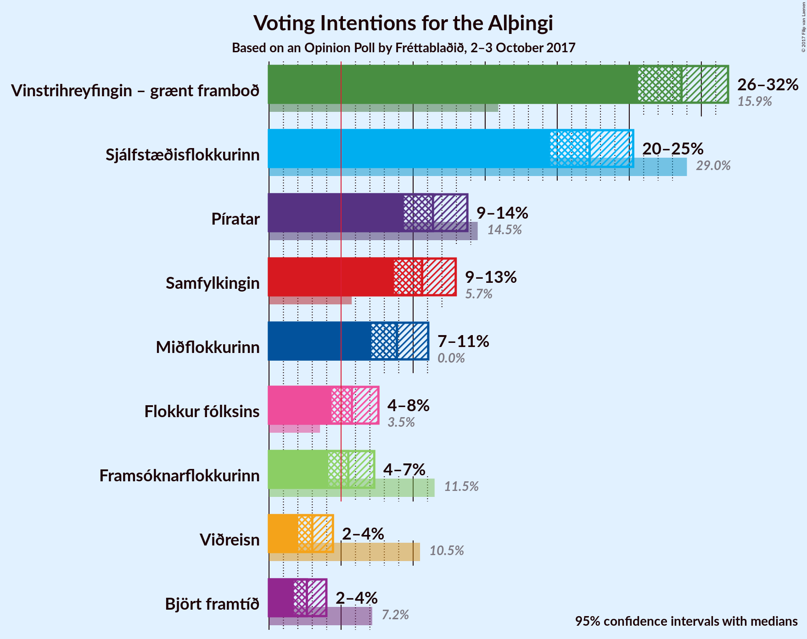

# Opinion Poll by Fréttablaðið, 2–3 October 2017

<a href="#voting-intentions">Voting Intentions</a> | <a href="#seats">Seats</a> | <a href="#coalitions">Coalitions</a> | <a href="#technical-information">Technical Information</a>

## Voting Intentions

### Confidence Intervals

| Party | Last Result | Poll Result | 80% Confidence Interval | 90% Confidence Interval | 95% Confidence Interval | 99% Confidence Interval |
|:-----:|:-----------:|:-----------:|:-----------------------:|:-----------------------:|:-----------------------:|:-----------------------:|
| Vinstrihreyfingin – grænt framboð | 15.9% | 28.6% | 26.6–30.7% |26.1–31.3% |25.6–31.9% |24.7–32.9% |
| Sjálfstæðisflokkurinn | 29.0% | 22.2% | 20.5–24.2% |19.9–24.8% |19.5–25.3% |18.7–26.2% |
| Píratar | 14.5% | 11.4% | 10.0–12.9% |9.7–13.4% |9.4–13.8% |8.7–14.5% |
| Samfylkingin | 5.7% | 10.6% | 9.3–12.1% |9.0–12.6% |8.7–13.0% |8.1–13.7% |
| Miðflokkurinn | 0.0% | 8.9% | 7.7–10.3% |7.4–10.7% |7.1–11.1% |6.6–11.8% |
| Flokkur fólksins | 3.5% | 5.8% | 4.8–7.0% |4.6–7.3% |4.3–7.6% |3.9–8.2% |
| Framsóknarflokkurinn | 11.5% | 5.5% | 4.6–6.7% |4.3–7.0% |4.1–7.3% |3.7–7.9% |
| Viðreisn | 10.5% | 3.0% | 2.3–3.9% |2.2–4.2% |2.0–4.4% |1.8–4.9% |
| Björt framtíð | 7.2% | 2.6% | 2.0–3.5% |1.9–3.8% |1.7–4.0% |1.5–4.5% |

*Note:* The poll result column reflects the actual value used in the calculations. Published results may vary slightly, and in addition be rounded to fewer digits.

## Seats

### Confidence Intervals

| Party | Last Result | Median | 80% Confidence Interval | 90% Confidence Interval | 95% Confidence Interval | 99% Confidence Interval |
|:-----:|:-----------:|:------:|:-----------------------:|:-----------------------:|:-----------------------:|:-----------------------:|
| <a href="#vinstrihreyfingin-–-grænt-framboð">Vinstrihreyfingin – grænt framboð</a> | 10 | 21 | 19–22 |19–23 |18–23 |17–24 |
| <a href="#sjálfstæðisflokkurinn">Sjálfstæðisflokkurinn</a> | 21 | 15 | 14–17 |14–17 |13–18 |13–19 |
| <a href="#píratar">Píratar</a> | 10 | 8 | 7–9 |6–9 |6–10 |6–10 |
| <a href="#samfylkingin">Samfylkingin</a> | 3 | 7 | 6–8 |6–9 |6–9 |5–9 |
| <a href="#miðflokkurinn">Miðflokkurinn</a> | 0 | 6 | 5–7 |5–7 |5–8 |4–8 |
| <a href="#flokkur-fólksins">Flokkur fólksins</a> | 0 | 4 | 0–4 |0–5 |0–5 |0–5 |
| <a href="#framsóknarflokkurinn">Framsóknarflokkurinn</a> | 8 | 3 | 1–4 |0–5 |0–5 |0–5 |
| <a href="#viðreisn">Viðreisn</a> | 7 | 0 | 0 |0 |0 |0 |
| <a href="#björt-framtíð">Björt framtíð</a> | 4 | 0 | 0 |0 |0 |0 |

### Vinstrihreyfingin – grænt framboð

*For a full overview of the results for this party, see the [Vinstrihreyfingin – grænt framboð](party-vinstrihreyfingingrntframbo.html) page.*

| Number of Seats | Probability | Accumulated | Special Marks |
|:---------------:|:-----------:|:-----------:|:-------------:|
| 10 | 0% | 100% | Last Result |
| 11 | 0% | 100% |  |
| 12 | 0% | 100% |  |
| 13 | 0% | 100% |  |
| 14 | 0% | 100% |  |
| 15 | 0% | 100% |  |
| 16 | 0.1% | 100% |  |
| 17 | 0.8% | 99.9% |  |
| 18 | 4% | 99.1% |  |
| 19 | 14% | 95% |  |
| 20 | 29% | 82% |  |
| 21 | 26% | 52% | Median |
| 22 | 21% | 26% |  |
| 23 | 4% | 5% |  |
| 24 | 0.8% | 1.1% |  |
| 25 | 0.4% | 0.4% |  |
| 26 | 0% | 0% |  |

### Sjálfstæðisflokkurinn

*For a full overview of the results for this party, see the [Sjálfstæðisflokkurinn](party-sjlfstisflokkurinn.html) page.*

| Number of Seats | Probability | Accumulated | Special Marks |
|:---------------:|:-----------:|:-----------:|:-------------:|
| 12 | 0.2% | 100% |  |
| 13 | 3% | 99.8% |  |
| 14 | 14% | 97% |  |
| 15 | 37% | 83% | Median |
| 16 | 27% | 45% |  |
| 17 | 15% | 19% |  |
| 18 | 3% | 4% |  |
| 19 | 0.7% | 0.8% |  |
| 20 | 0.1% | 0.1% |  |
| 21 | 0% | 0% | Last Result |

### Píratar

*For a full overview of the results for this party, see the [Píratar](party-pratar.html) page.*

| Number of Seats | Probability | Accumulated | Special Marks |
|:---------------:|:-----------:|:-----------:|:-------------:|
| 5 | 0.4% | 100% |  |
| 6 | 9% | 99.6% |  |
| 7 | 33% | 91% |  |
| 8 | 38% | 58% | Median |
| 9 | 17% | 20% |  |
| 10 | 2% | 3% | Last Result |
| 11 | 0.5% | 0.5% |  |
| 12 | 0% | 0% |  |

### Samfylkingin

*For a full overview of the results for this party, see the [Samfylkingin](party-samfylkingin.html) page.*

| Number of Seats | Probability | Accumulated | Special Marks |
|:---------------:|:-----------:|:-----------:|:-------------:|
| 3 | 0% | 100% | Last Result |
| 4 | 0% | 100% |  |
| 5 | 0.8% | 100% |  |
| 6 | 24% | 99.2% |  |
| 7 | 45% | 76% | Median |
| 8 | 22% | 30% |  |
| 9 | 8% | 8% |  |
| 10 | 0.5% | 0.5% |  |
| 11 | 0% | 0% |  |

### Miðflokkurinn

*For a full overview of the results for this party, see the [Miðflokkurinn](party-miflokkurinn.html) page.*

| Number of Seats | Probability | Accumulated | Special Marks |
|:---------------:|:-----------:|:-----------:|:-------------:|
| 0 | 0% | 100% | Last Result |
| 1 | 0% | 100% |  |
| 2 | 0% | 100% |  |
| 3 | 0% | 100% |  |
| 4 | 2% | 100% |  |
| 5 | 28% | 98% |  |
| 6 | 50% | 70% | Median |
| 7 | 17% | 20% |  |
| 8 | 3% | 3% |  |
| 9 | 0.2% | 0.2% |  |
| 10 | 0% | 0% |  |

### Flokkur fólksins

*For a full overview of the results for this party, see the [Flokkur fólksins](party-flokkurflksins.html) page.*

| Number of Seats | Probability | Accumulated | Special Marks |
|:---------------:|:-----------:|:-----------:|:-------------:|
| 0 | 19% | 100% | Last Result |
| 1 | 0% | 81% |  |
| 2 | 0% | 81% |  |
| 3 | 31% | 81% |  |
| 4 | 41% | 50% | Median |
| 5 | 9% | 9% |  |
| 6 | 0.2% | 0.2% |  |
| 7 | 0% | 0% |  |

### Framsóknarflokkurinn

*For a full overview of the results for this party, see the [Framsóknarflokkurinn](party-framsknarflokkurinn.html) page.*

| Number of Seats | Probability | Accumulated | Special Marks |
|:---------------:|:-----------:|:-----------:|:-------------:|
| 0 | 8% | 100% |  |
| 1 | 5% | 92% |  |
| 2 | 6% | 87% |  |
| 3 | 36% | 80% | Median |
| 4 | 37% | 44% |  |
| 5 | 7% | 7% |  |
| 6 | 0.1% | 0.1% |  |
| 7 | 0% | 0% |  |
| 8 | 0% | 0% | Last Result |

### Viðreisn

*For a full overview of the results for this party, see the [Viðreisn](party-vireisn.html) page.*

| Number of Seats | Probability | Accumulated | Special Marks |
|:---------------:|:-----------:|:-----------:|:-------------:|
| 0 | 99.6% | 100% | Median |
| 1 | 0% | 0.4% |  |
| 2 | 0% | 0.4% |  |
| 3 | 0.3% | 0.4% |  |
| 4 | 0% | 0% |  |
| 5 | 0% | 0% |  |
| 6 | 0% | 0% |  |
| 7 | 0% | 0% | Last Result |

### Björt framtíð

*For a full overview of the results for this party, see the [Björt framtíð](party-bjrtframt.html) page.*

| Number of Seats | Probability | Accumulated | Special Marks |
|:---------------:|:-----------:|:-----------:|:-------------:|
| 0 | 99.7% | 100% | Median |
| 1 | 0.3% | 0.3% |  |
| 2 | 0% | 0% |  |
| 3 | 0% | 0% |  |
| 4 | 0% | 0% | Last Result |

## Coalitions

### Confidence Intervals

| Coalition | Last Result | Median | Majority? | 80% Confidence Interval | 90% Confidence Interval | 95% Confidence Interval | 99% Confidence Interval |
|:---------:|:-----------:|:------:|:---------:|:-----------------------:|:-----------------------:|:-----------------------:|:-----------------------:|
| Vinstrihreyfingin – grænt framboð – Samfylkingin – Miðflokkurinn – Framsóknarflokkurinn | 21 | 37 | 99.9% | 35–39 | 34–40 | 34–40 | 33–41 |
| Vinstrihreyfingin – grænt framboð – Sjálfstæðisflokkurinn | 31 | 36 | 99.9% | 34–38 | 34–39 | 33–39 | 32–40 |
| Vinstrihreyfingin – grænt framboð – Píratar – Samfylkingin – Björt framtíð | 27 | 35 | 99.4% | 34–38 | 33–38 | 32–39 | 31–40 |
| Vinstrihreyfingin – grænt framboð – Píratar – Samfylkingin – Viðreisn – Björt framtíð | 34 | 35 | 99.4% | 34–38 | 33–38 | 32–39 | 31–40 |
| Vinstrihreyfingin – grænt framboð – Píratar – Samfylkingin | 23 | 35 | 99.4% | 34–38 | 33–38 | 32–39 | 31–40 |
| Vinstrihreyfingin – grænt framboð – Píratar – Samfylkingin – Viðreisn | 30 | 35 | 99.4% | 34–38 | 33–38 | 32–39 | 31–40 |
| Vinstrihreyfingin – grænt framboð – Samfylkingin – Miðflokkurinn | 13 | 34 | 94% | 32–36 | 31–36 | 31–37 | 30–38 |
| Vinstrihreyfingin – grænt framboð – Samfylkingin – Framsóknarflokkurinn | 21 | 31 | 31% | 29–33 | 28–34 | 28–34 | 26–35 |
| Vinstrihreyfingin – grænt framboð – Miðflokkurinn – Framsóknarflokkurinn | 18 | 30 | 12% | 28–32 | 27–32 | 26–33 | 25–34 |
| Vinstrihreyfingin – grænt framboð – Píratar | 20 | 28 | 2% | 26–30 | 26–30 | 26–31 | 25–32 |
| Vinstrihreyfingin – grænt framboð – Samfylkingin | 13 | 28 | 0.9% | 26–30 | 26–30 | 25–31 | 24–32 |
| Vinstrihreyfingin – grænt framboð – Miðflokkurinn | 10 | 26 | 0.1% | 25–28 | 24–29 | 24–29 | 23–30 |
| Sjálfstæðisflokkurinn – Miðflokkurinn – Framsóknarflokkurinn | 29 | 25 | 0% | 23–27 | 22–27 | 21–28 | 20–29 |
| Vinstrihreyfingin – grænt framboð – Framsóknarflokkurinn | 18 | 24 | 0% | 22–26 | 21–26 | 20–27 | 19–27 |
| Sjálfstæðisflokkurinn – Samfylkingin | 24 | 23 | 0% | 21–25 | 20–25 | 20–26 | 19–26 |
| Sjálfstæðisflokkurinn – Miðflokkurinn | 21 | 21 | 0% | 20–23 | 19–24 | 19–24 | 18–26 |
| Sjálfstæðisflokkurinn – Framsóknarflokkurinn | 29 | 19 | 0% | 17–21 | 16–21 | 15–22 | 14–22 |
| Sjálfstæðisflokkurinn – Björt framtíð | 25 | 15 | 0% | 14–17 | 14–17 | 13–18 | 13–19 |
| Sjálfstæðisflokkurinn – Viðreisn – Björt framtíð | 32 | 15 | 0% | 14–17 | 14–17 | 13–18 | 13–19 |
| Sjálfstæðisflokkurinn – Viðreisn | 28 | 15 | 0% | 14–17 | 14–17 | 13–18 | 13–19 |

### Vinstrihreyfingin – grænt framboð – Samfylkingin – Miðflokkurinn – Framsóknarflokkurinn

| Number of Seats | Probability | Accumulated | Special Marks |
|:---------------:|:-----------:|:-----------:|:-------------:|
| 21 | 0% | 100% | Last Result |
| 22 | 0% | 100% |  |
| 23 | 0% | 100% |  |
| 24 | 0% | 100% |  |
| 25 | 0% | 100% |  |
| 26 | 0% | 100% |  |
| 27 | 0% | 100% |  |
| 28 | 0% | 100% |  |
| 29 | 0% | 100% |  |
| 30 | 0% | 100% |  |
| 31 | 0.1% | 100% |  |
| 32 | 0.3% | 99.9% | Majority |
| 33 | 1.3% | 99.6% |  |
| 34 | 7% | 98% |  |
| 35 | 13% | 92% |  |
| 36 | 22% | 79% |  |
| 37 | 29% | 56% | Median |
| 38 | 11% | 28% |  |
| 39 | 11% | 17% |  |
| 40 | 5% | 6% |  |
| 41 | 0.7% | 0.9% |  |
| 42 | 0.2% | 0.2% |  |
| 43 | 0% | 0% |  |

### Vinstrihreyfingin – grænt framboð – Sjálfstæðisflokkurinn

| Number of Seats | Probability | Accumulated | Special Marks |
|:---------------:|:-----------:|:-----------:|:-------------:|
| 31 | 0.1% | 100% | Last Result |
| 32 | 1.0% | 99.9% | Majority |
| 33 | 4% | 98.9% |  |
| 34 | 11% | 95% |  |
| 35 | 22% | 84% |  |
| 36 | 21% | 62% | Median |
| 37 | 21% | 41% |  |
| 38 | 14% | 20% |  |
| 39 | 4% | 6% |  |
| 40 | 1.4% | 2% |  |
| 41 | 0.2% | 0.3% |  |
| 42 | 0.1% | 0.1% |  |
| 43 | 0% | 0% |  |

### Vinstrihreyfingin – grænt framboð – Píratar – Samfylkingin – Björt framtíð

| Number of Seats | Probability | Accumulated | Special Marks |
|:---------------:|:-----------:|:-----------:|:-------------:|
| 27 | 0% | 100% | Last Result |
| 28 | 0% | 100% |  |
| 29 | 0% | 100% |  |
| 30 | 0% | 100% |  |
| 31 | 0.5% | 100% |  |
| 32 | 2% | 99.4% | Majority |
| 33 | 4% | 97% |  |
| 34 | 16% | 93% |  |
| 35 | 35% | 77% |  |
| 36 | 19% | 42% | Median |
| 37 | 12% | 23% |  |
| 38 | 7% | 11% |  |
| 39 | 3% | 4% |  |
| 40 | 0.7% | 0.8% |  |
| 41 | 0.1% | 0.1% |  |
| 42 | 0.1% | 0.1% |  |
| 43 | 0% | 0% |  |

### Vinstrihreyfingin – grænt framboð – Píratar – Samfylkingin – Viðreisn – Björt framtíð

| Number of Seats | Probability | Accumulated | Special Marks |
|:---------------:|:-----------:|:-----------:|:-------------:|
| 31 | 0.5% | 100% |  |
| 32 | 2% | 99.4% | Majority |
| 33 | 4% | 97% |  |
| 34 | 16% | 93% | Last Result |
| 35 | 35% | 77% |  |
| 36 | 19% | 42% | Median |
| 37 | 12% | 23% |  |
| 38 | 7% | 11% |  |
| 39 | 3% | 4% |  |
| 40 | 0.7% | 0.8% |  |
| 41 | 0.1% | 0.1% |  |
| 42 | 0.1% | 0.1% |  |
| 43 | 0% | 0% |  |

### Vinstrihreyfingin – grænt framboð – Píratar – Samfylkingin

| Number of Seats | Probability | Accumulated | Special Marks |
|:---------------:|:-----------:|:-----------:|:-------------:|
| 23 | 0% | 100% | Last Result |
| 24 | 0% | 100% |  |
| 25 | 0% | 100% |  |
| 26 | 0% | 100% |  |
| 27 | 0% | 100% |  |
| 28 | 0% | 100% |  |
| 29 | 0% | 100% |  |
| 30 | 0% | 100% |  |
| 31 | 0.5% | 100% |  |
| 32 | 2% | 99.4% | Majority |
| 33 | 4% | 97% |  |
| 34 | 16% | 93% |  |
| 35 | 35% | 77% |  |
| 36 | 19% | 42% | Median |
| 37 | 12% | 23% |  |
| 38 | 7% | 11% |  |
| 39 | 3% | 4% |  |
| 40 | 0.6% | 0.8% |  |
| 41 | 0.1% | 0.1% |  |
| 42 | 0.1% | 0.1% |  |
| 43 | 0% | 0% |  |

### Vinstrihreyfingin – grænt framboð – Píratar – Samfylkingin – Viðreisn

| Number of Seats | Probability | Accumulated | Special Marks |
|:---------------:|:-----------:|:-----------:|:-------------:|
| 30 | 0% | 100% | Last Result |
| 31 | 0.5% | 100% |  |
| 32 | 2% | 99.4% | Majority |
| 33 | 4% | 97% |  |
| 34 | 16% | 93% |  |
| 35 | 35% | 77% |  |
| 36 | 19% | 42% | Median |
| 37 | 12% | 23% |  |
| 38 | 7% | 11% |  |
| 39 | 3% | 4% |  |
| 40 | 0.7% | 0.8% |  |
| 41 | 0.1% | 0.1% |  |
| 42 | 0.1% | 0.1% |  |
| 43 | 0% | 0% |  |

### Vinstrihreyfingin – grænt framboð – Samfylkingin – Miðflokkurinn

| Number of Seats | Probability | Accumulated | Special Marks |
|:---------------:|:-----------:|:-----------:|:-------------:|
| 13 | 0% | 100% | Last Result |
| 14 | 0% | 100% |  |
| 15 | 0% | 100% |  |
| 16 | 0% | 100% |  |
| 17 | 0% | 100% |  |
| 18 | 0% | 100% |  |
| 19 | 0% | 100% |  |
| 20 | 0% | 100% |  |
| 21 | 0% | 100% |  |
| 22 | 0% | 100% |  |
| 23 | 0% | 100% |  |
| 24 | 0% | 100% |  |
| 25 | 0% | 100% |  |
| 26 | 0% | 100% |  |
| 27 | 0% | 100% |  |
| 28 | 0% | 100% |  |
| 29 | 0.3% | 100% |  |
| 30 | 1.4% | 99.7% |  |
| 31 | 4% | 98% |  |
| 32 | 18% | 94% | Majority |
| 33 | 25% | 76% |  |
| 34 | 26% | 51% | Median |
| 35 | 9% | 25% |  |
| 36 | 11% | 16% |  |
| 37 | 4% | 5% |  |
| 38 | 0.8% | 1.0% |  |
| 39 | 0.2% | 0.2% |  |
| 40 | 0% | 0% |  |

### Vinstrihreyfingin – grænt framboð – Samfylkingin – Framsóknarflokkurinn

| Number of Seats | Probability | Accumulated | Special Marks |
|:---------------:|:-----------:|:-----------:|:-------------:|
| 21 | 0% | 100% | Last Result |
| 22 | 0% | 100% |  |
| 23 | 0% | 100% |  |
| 24 | 0% | 100% |  |
| 25 | 0.1% | 100% |  |
| 26 | 0.7% | 99.9% |  |
| 27 | 2% | 99.2% |  |
| 28 | 4% | 98% |  |
| 29 | 15% | 94% |  |
| 30 | 19% | 78% |  |
| 31 | 28% | 59% | Median |
| 32 | 12% | 31% | Majority |
| 33 | 14% | 19% |  |
| 34 | 4% | 5% |  |
| 35 | 0.7% | 0.9% |  |
| 36 | 0.1% | 0.1% |  |
| 37 | 0% | 0% |  |

### Vinstrihreyfingin – grænt framboð – Miðflokkurinn – Framsóknarflokkurinn

| Number of Seats | Probability | Accumulated | Special Marks |
|:---------------:|:-----------:|:-----------:|:-------------:|
| 18 | 0% | 100% | Last Result |
| 19 | 0% | 100% |  |
| 20 | 0% | 100% |  |
| 21 | 0% | 100% |  |
| 22 | 0% | 100% |  |
| 23 | 0% | 100% |  |
| 24 | 0.1% | 100% |  |
| 25 | 0.5% | 99.9% |  |
| 26 | 2% | 99.4% |  |
| 27 | 5% | 97% |  |
| 28 | 17% | 92% |  |
| 29 | 23% | 75% |  |
| 30 | 21% | 52% | Median |
| 31 | 19% | 31% |  |
| 32 | 9% | 12% | Majority |
| 33 | 2% | 3% |  |
| 34 | 0.5% | 0.6% |  |
| 35 | 0% | 0% |  |

### Vinstrihreyfingin – grænt framboð – Píratar

| Number of Seats | Probability | Accumulated | Special Marks |
|:---------------:|:-----------:|:-----------:|:-------------:|
| 20 | 0% | 100% | Last Result |
| 21 | 0% | 100% |  |
| 22 | 0% | 100% |  |
| 23 | 0.1% | 100% |  |
| 24 | 0.2% | 99.9% |  |
| 25 | 2% | 99.7% |  |
| 26 | 9% | 98% |  |
| 27 | 11% | 89% |  |
| 28 | 34% | 78% |  |
| 29 | 27% | 44% | Median |
| 30 | 12% | 17% |  |
| 31 | 3% | 5% |  |
| 32 | 1.3% | 2% | Majority |
| 33 | 0.2% | 0.2% |  |
| 34 | 0% | 0% |  |

### Vinstrihreyfingin – grænt framboð – Samfylkingin

| Number of Seats | Probability | Accumulated | Special Marks |
|:---------------:|:-----------:|:-----------:|:-------------:|
| 13 | 0% | 100% | Last Result |
| 14 | 0% | 100% |  |
| 15 | 0% | 100% |  |
| 16 | 0% | 100% |  |
| 17 | 0% | 100% |  |
| 18 | 0% | 100% |  |
| 19 | 0% | 100% |  |
| 20 | 0% | 100% |  |
| 21 | 0% | 100% |  |
| 22 | 0% | 100% |  |
| 23 | 0.1% | 100% |  |
| 24 | 1.3% | 99.9% |  |
| 25 | 3% | 98.5% |  |
| 26 | 13% | 95% |  |
| 27 | 29% | 82% |  |
| 28 | 25% | 53% | Median |
| 29 | 15% | 28% |  |
| 30 | 10% | 13% |  |
| 31 | 2% | 3% |  |
| 32 | 0.8% | 0.9% | Majority |
| 33 | 0.1% | 0.1% |  |
| 34 | 0% | 0% |  |

### Vinstrihreyfingin – grænt framboð – Miðflokkurinn

| Number of Seats | Probability | Accumulated | Special Marks |
|:---------------:|:-----------:|:-----------:|:-------------:|
| 10 | 0% | 100% | Last Result |
| 11 | 0% | 100% |  |
| 12 | 0% | 100% |  |
| 13 | 0% | 100% |  |
| 14 | 0% | 100% |  |
| 15 | 0% | 100% |  |
| 16 | 0% | 100% |  |
| 17 | 0% | 100% |  |
| 18 | 0% | 100% |  |
| 19 | 0% | 100% |  |
| 20 | 0% | 100% |  |
| 21 | 0% | 100% |  |
| 22 | 0.2% | 100% |  |
| 23 | 2% | 99.8% |  |
| 24 | 4% | 98% |  |
| 25 | 17% | 94% |  |
| 26 | 27% | 76% |  |
| 27 | 24% | 49% | Median |
| 28 | 18% | 25% |  |
| 29 | 5% | 7% |  |
| 30 | 1.3% | 2% |  |
| 31 | 0.4% | 0.4% |  |
| 32 | 0.1% | 0.1% | Majority |
| 33 | 0% | 0% |  |

### Sjálfstæðisflokkurinn – Miðflokkurinn – Framsóknarflokkurinn

| Number of Seats | Probability | Accumulated | Special Marks |
|:---------------:|:-----------:|:-----------:|:-------------:|
| 20 | 0.7% | 100% |  |
| 21 | 2% | 99.3% |  |
| 22 | 6% | 97% |  |
| 23 | 16% | 91% |  |
| 24 | 25% | 75% | Median |
| 25 | 29% | 50% |  |
| 26 | 11% | 21% |  |
| 27 | 6% | 11% |  |
| 28 | 4% | 5% |  |
| 29 | 0.5% | 0.6% | Last Result |
| 30 | 0.1% | 0.1% |  |
| 31 | 0% | 0% |  |

### Vinstrihreyfingin – grænt framboð – Framsóknarflokkurinn

| Number of Seats | Probability | Accumulated | Special Marks |
|:---------------:|:-----------:|:-----------:|:-------------:|
| 18 | 0.3% | 100% | Last Result |
| 19 | 0.7% | 99.7% |  |
| 20 | 2% | 99.1% |  |
| 21 | 6% | 97% |  |
| 22 | 15% | 92% |  |
| 23 | 21% | 77% |  |
| 24 | 22% | 56% | Median |
| 25 | 19% | 33% |  |
| 26 | 12% | 14% |  |
| 27 | 2% | 3% |  |
| 28 | 0.5% | 0.5% |  |
| 29 | 0% | 0% |  |

### Sjálfstæðisflokkurinn – Samfylkingin

| Number of Seats | Probability | Accumulated | Special Marks |
|:---------------:|:-----------:|:-----------:|:-------------:|
| 19 | 0.7% | 100% |  |
| 20 | 5% | 99.3% |  |
| 21 | 19% | 95% |  |
| 22 | 23% | 76% | Median |
| 23 | 27% | 53% |  |
| 24 | 15% | 26% | Last Result |
| 25 | 8% | 11% |  |
| 26 | 2% | 3% |  |
| 27 | 0.4% | 0.4% |  |
| 28 | 0.1% | 0.1% |  |
| 29 | 0% | 0% |  |

### Sjálfstæðisflokkurinn – Miðflokkurinn

| Number of Seats | Probability | Accumulated | Special Marks |
|:---------------:|:-----------:|:-----------:|:-------------:|
| 17 | 0.1% | 100% |  |
| 18 | 0.8% | 99.9% |  |
| 19 | 5% | 99.2% |  |
| 20 | 22% | 94% |  |
| 21 | 27% | 72% | Last Result, Median |
| 22 | 27% | 45% |  |
| 23 | 12% | 18% |  |
| 24 | 5% | 7% |  |
| 25 | 2% | 2% |  |
| 26 | 0.3% | 0.5% |  |
| 27 | 0.2% | 0.2% |  |
| 28 | 0% | 0% |  |

### Sjálfstæðisflokkurinn – Framsóknarflokkurinn

| Number of Seats | Probability | Accumulated | Special Marks |
|:---------------:|:-----------:|:-----------:|:-------------:|
| 14 | 0.7% | 100% |  |
| 15 | 4% | 99.3% |  |
| 16 | 4% | 96% |  |
| 17 | 10% | 91% |  |
| 18 | 28% | 81% | Median |
| 19 | 29% | 53% |  |
| 20 | 13% | 24% |  |
| 21 | 7% | 11% |  |
| 22 | 3% | 3% |  |
| 23 | 0.3% | 0.3% |  |
| 24 | 0% | 0% |  |
| 25 | 0% | 0% |  |
| 26 | 0% | 0% |  |
| 27 | 0% | 0% |  |
| 28 | 0% | 0% |  |
| 29 | 0% | 0% | Last Result |

### Sjálfstæðisflokkurinn – Björt framtíð

| Number of Seats | Probability | Accumulated | Special Marks |
|:---------------:|:-----------:|:-----------:|:-------------:|
| 12 | 0.2% | 100% |  |
| 13 | 3% | 99.8% |  |
| 14 | 14% | 97% |  |
| 15 | 37% | 83% | Median |
| 16 | 27% | 45% |  |
| 17 | 15% | 19% |  |
| 18 | 3% | 4% |  |
| 19 | 0.7% | 0.8% |  |
| 20 | 0.1% | 0.1% |  |
| 21 | 0% | 0% |  |
| 22 | 0% | 0% |  |
| 23 | 0% | 0% |  |
| 24 | 0% | 0% |  |
| 25 | 0% | 0% | Last Result |

### Sjálfstæðisflokkurinn – Viðreisn – Björt framtíð

| Number of Seats | Probability | Accumulated | Special Marks |
|:---------------:|:-----------:|:-----------:|:-------------:|
| 12 | 0.2% | 100% |  |
| 13 | 3% | 99.8% |  |
| 14 | 14% | 97% |  |
| 15 | 37% | 83% | Median |
| 16 | 27% | 46% |  |
| 17 | 15% | 19% |  |
| 18 | 3% | 4% |  |
| 19 | 0.7% | 0.9% |  |
| 20 | 0.2% | 0.2% |  |
| 21 | 0% | 0% |  |
| 22 | 0% | 0% |  |
| 23 | 0% | 0% |  |
| 24 | 0% | 0% |  |
| 25 | 0% | 0% |  |
| 26 | 0% | 0% |  |
| 27 | 0% | 0% |  |
| 28 | 0% | 0% |  |
| 29 | 0% | 0% |  |
| 30 | 0% | 0% |  |
| 31 | 0% | 0% |  |
| 32 | 0% | 0% | Last Result, Majority |

### Sjálfstæðisflokkurinn – Viðreisn

| Number of Seats | Probability | Accumulated | Special Marks |
|:---------------:|:-----------:|:-----------:|:-------------:|
| 12 | 0.2% | 100% |  |
| 13 | 3% | 99.8% |  |
| 14 | 14% | 97% |  |
| 15 | 37% | 83% | Median |
| 16 | 27% | 46% |  |
| 17 | 15% | 19% |  |
| 18 | 3% | 4% |  |
| 19 | 0.7% | 0.9% |  |
| 20 | 0.2% | 0.2% |  |
| 21 | 0% | 0% |  |
| 22 | 0% | 0% |  |
| 23 | 0% | 0% |  |
| 24 | 0% | 0% |  |
| 25 | 0% | 0% |  |
| 26 | 0% | 0% |  |
| 27 | 0% | 0% |  |
| 28 | 0% | 0% | Last Result |

## Technical Information

### Opinion Poll

+ **Pollster:** Fréttablaðið
+ **Media:** —
+ **Fieldwork period:** 2–3 October 2017

### Calculations

+ **Sample size:** 800
+ **Simulations done:** 1,048,576
+ **Error estimate:** 1.37%

