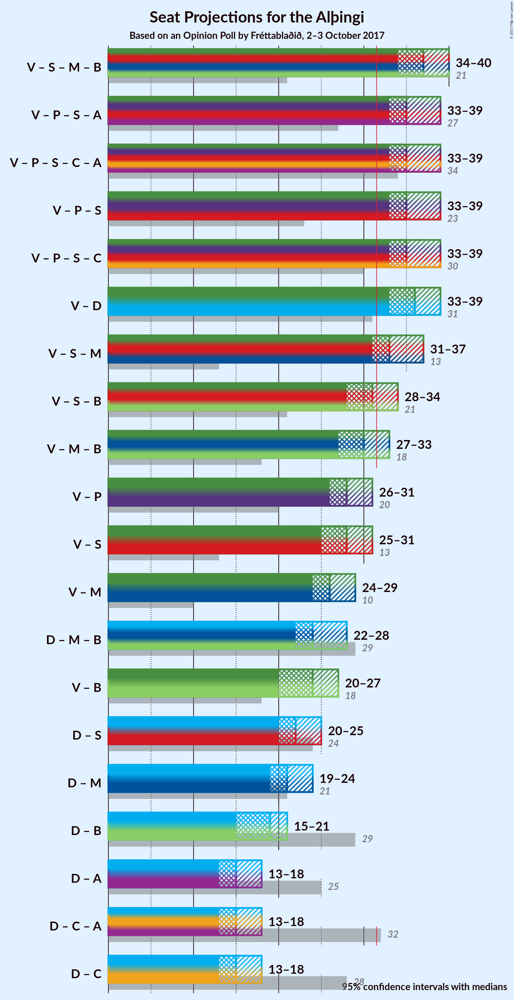

# Opinion Poll by Fréttablaðið, 2–3 October 2017

<a href="#voting-intentions">Voting Intentions</a> | <a href="#seats">Seats</a> | <a href="#coalitions">Coalitions</a> | <a href="#technical-information">Technical Information</a>

## Voting Intentions

### Confidence Intervals

| Party | Last Result | Poll Result | 80% Confidence Interval | 90% Confidence Interval | 95% Confidence Interval | 99% Confidence Interval |
|:-----:|:-----------:|:-----------:|:-----------------------:|:-----------------------:|:-----------------------:|:-----------------------:|
| Vinstrihreyfingin – grænt framboð | 15.9% | 28.6% | 26.6–30.7% |26.1–31.3% |25.6–31.9% |24.7–32.9% |
| Sjálfstæðisflokkurinn | 29.0% | 22.2% | 20.5–24.2% |19.9–24.8% |19.5–25.3% |18.7–26.2% |
| Píratar | 14.5% | 11.4% | 10.0–12.9% |9.7–13.4% |9.4–13.8% |8.7–14.5% |
| Samfylkingin | 5.7% | 10.6% | 9.3–12.1% |9.0–12.6% |8.7–13.0% |8.1–13.7% |
| Miðflokkurinn | 0.0% | 8.9% | 7.7–10.3% |7.4–10.7% |7.1–11.1% |6.6–11.8% |
| Flokkur fólksins | 3.5% | 5.8% | 4.8–7.0% |4.6–7.3% |4.3–7.6% |3.9–8.2% |
| Framsóknarflokkurinn | 11.5% | 5.5% | 4.6–6.7% |4.3–7.0% |4.1–7.3% |3.7–7.9% |
| Viðreisn | 10.5% | 3.0% | 2.3–3.9% |2.2–4.2% |2.0–4.4% |1.8–4.9% |
| Björt framtíð | 7.2% | 2.6% | 2.0–3.5% |1.9–3.8% |1.7–4.0% |1.5–4.5% |

*Note:* The poll result column reflects the actual value used in the calculations. Published results may vary slightly, and in addition be rounded to fewer digits.

## Seats

### Confidence Intervals

| Party | Last Result | Median | 80% Confidence Interval | 90% Confidence Interval | 95% Confidence Interval | 99% Confidence Interval |
|:-----:|:-----------:|:------:|:-----------------------:|:-----------------------:|:-----------------------:|:-----------------------:|
| <a href="#vinstrihreyfingin-–-grænt-framboð">Vinstrihreyfingin – grænt framboð</a> | 10 | 21 | 20–24 |19–24 |19–25 |18–26 |
| <a href="#sjálfstæðisflokkurinn">Sjálfstæðisflokkurinn</a> | 21 | 16 | 14–17 |14–18 |14–18 |13–20 |
| <a href="#píratar">Píratar</a> | 10 | 7 | 6–8 |6–9 |5–9 |5–10 |
| <a href="#samfylkingin">Samfylkingin</a> | 3 | 7 | 6–8 |6–8 |6–9 |5–9 |
| <a href="#miðflokkurinn">Miðflokkurinn</a> | 0 | 6 | 5–6 |4–7 |4–7 |4–7 |
| <a href="#flokkur-fólksins">Flokkur fólksins</a> | 0 | 3 | 0–4 |0–5 |0–5 |0–5 |
| <a href="#framsóknarflokkurinn">Framsóknarflokkurinn</a> | 8 | 3 | 3–4 |2–4 |1–5 |1–5 |
| <a href="#viðreisn">Viðreisn</a> | 7 | 0 | 0 |0 |0 |0 |
| <a href="#björt-framtíð">Björt framtíð</a> | 4 | 0 | 0 |0 |0 |0–1 |

### Vinstrihreyfingin – grænt framboð

*For a full overview of the results for this party, see the [Vinstrihreyfingin – grænt framboð](party-vinstrihreyfingingrntframbo.html) page.*

| Number of Seats | Probability | Accumulated | Special Marks |
|:---------------:|:-----------:|:-----------:|:-------------:|
| 10 | 0% | 100% | Last Result |
| 11 | 0% | 100% |  |
| 12 | 0% | 100% |  |
| 13 | 0% | 100% |  |
| 14 | 0% | 100% |  |
| 15 | 0% | 100% |  |
| 16 | 0% | 100% |  |
| 17 | 0.3% | 100% |  |
| 18 | 1.5% | 99.7% |  |
| 19 | 4% | 98% |  |
| 20 | 15% | 94% |  |
| 21 | 35% | 80% | Median |
| 22 | 23% | 45% |  |
| 23 | 9% | 22% |  |
| 24 | 9% | 12% |  |
| 25 | 2% | 3% |  |
| 26 | 0.6% | 0.8% |  |
| 27 | 0.2% | 0.2% |  |
| 28 | 0% | 0% |  |

### Sjálfstæðisflokkurinn

*For a full overview of the results for this party, see the [Sjálfstæðisflokkurinn](party-sjlfstisflokkurinn.html) page.*

| Number of Seats | Probability | Accumulated | Special Marks |
|:---------------:|:-----------:|:-----------:|:-------------:|
| 12 | 0% | 100% |  |
| 13 | 0.7% | 99.9% |  |
| 14 | 14% | 99.2% |  |
| 15 | 32% | 86% |  |
| 16 | 31% | 53% | Median |
| 17 | 15% | 22% |  |
| 18 | 5% | 7% |  |
| 19 | 1.4% | 2% |  |
| 20 | 0.7% | 0.7% |  |
| 21 | 0% | 0% | Last Result |

### Píratar

*For a full overview of the results for this party, see the [Píratar](party-pratar.html) page.*

| Number of Seats | Probability | Accumulated | Special Marks |
|:---------------:|:-----------:|:-----------:|:-------------:|
| 5 | 4% | 100% |  |
| 6 | 15% | 96% |  |
| 7 | 38% | 81% | Median |
| 8 | 33% | 42% |  |
| 9 | 8% | 10% |  |
| 10 | 2% | 2% | Last Result |
| 11 | 0% | 0% |  |

### Samfylkingin

*For a full overview of the results for this party, see the [Samfylkingin](party-samfylkingin.html) page.*

| Number of Seats | Probability | Accumulated | Special Marks |
|:---------------:|:-----------:|:-----------:|:-------------:|
| 3 | 0% | 100% | Last Result |
| 4 | 0% | 100% |  |
| 5 | 0.9% | 100% |  |
| 6 | 41% | 99.1% |  |
| 7 | 34% | 58% | Median |
| 8 | 20% | 24% |  |
| 9 | 4% | 5% |  |
| 10 | 0.3% | 0.4% |  |
| 11 | 0% | 0% |  |

### Miðflokkurinn

*For a full overview of the results for this party, see the [Miðflokkurinn](party-miflokkurinn.html) page.*

| Number of Seats | Probability | Accumulated | Special Marks |
|:---------------:|:-----------:|:-----------:|:-------------:|
| 0 | 0% | 100% | Last Result |
| 1 | 0% | 100% |  |
| 2 | 0% | 100% |  |
| 3 | 0% | 100% |  |
| 4 | 5% | 100% |  |
| 5 | 42% | 95% |  |
| 6 | 46% | 53% | Median |
| 7 | 7% | 7% |  |
| 8 | 0.3% | 0.4% |  |
| 9 | 0% | 0% |  |

### Flokkur fólksins

*For a full overview of the results for this party, see the [Flokkur fólksins](party-flokkurflksins.html) page.*

| Number of Seats | Probability | Accumulated | Special Marks |
|:---------------:|:-----------:|:-----------:|:-------------:|
| 0 | 19% | 100% | Last Result |
| 1 | 0.1% | 81% |  |
| 2 | 0.2% | 81% |  |
| 3 | 49% | 81% | Median |
| 4 | 26% | 32% |  |
| 5 | 6% | 6% |  |
| 6 | 0.1% | 0.1% |  |
| 7 | 0% | 0% |  |

### Framsóknarflokkurinn

*For a full overview of the results for this party, see the [Framsóknarflokkurinn](party-framsknarflokkurinn.html) page.*

| Number of Seats | Probability | Accumulated | Special Marks |
|:---------------:|:-----------:|:-----------:|:-------------:|
| 0 | 0.5% | 100% |  |
| 1 | 3% | 99.5% |  |
| 2 | 4% | 97% |  |
| 3 | 64% | 92% | Median |
| 4 | 26% | 28% |  |
| 5 | 2% | 3% |  |
| 6 | 0.1% | 0.1% |  |
| 7 | 0% | 0% |  |
| 8 | 0% | 0% | Last Result |

### Viðreisn

*For a full overview of the results for this party, see the [Viðreisn](party-vireisn.html) page.*

| Number of Seats | Probability | Accumulated | Special Marks |
|:---------------:|:-----------:|:-----------:|:-------------:|
| 0 | 99.6% | 100% | Median |
| 1 | 0.1% | 0.4% |  |
| 2 | 0% | 0.4% |  |
| 3 | 0.3% | 0.3% |  |
| 4 | 0% | 0% |  |
| 5 | 0% | 0% |  |
| 6 | 0% | 0% |  |
| 7 | 0% | 0% | Last Result |

### Björt framtíð

*For a full overview of the results for this party, see the [Björt framtíð](party-bjrtframt.html) page.*

| Number of Seats | Probability | Accumulated | Special Marks |
|:---------------:|:-----------:|:-----------:|:-------------:|
| 0 | 99.4% | 100% | Median |
| 1 | 0.5% | 0.6% |  |
| 2 | 0% | 0% |  |
| 3 | 0% | 0% |  |
| 4 | 0% | 0% | Last Result |

## Coalitions

### Confidence Intervals

| Coalition | Last Result | Median | Majority? | 80% Confidence Interval | 90% Confidence Interval | 95% Confidence Interval | 99% Confidence Interval |
|:---------:|:-----------:|:------:|:---------:|:-----------------------:|:-----------------------:|:-----------------------:|:-----------------------:|
| Vinstrihreyfingin – grænt framboð – Sjálfstæðisflokkurinn | 31 | 37 | 100% | 35–40 | 35–40 | 34–40 | 34–41 |
| Vinstrihreyfingin – grænt framboð – Píratar – Samfylkingin – Björt framtíð | 27 | 36 | 99.5% | 34–38 | 33–38 | 33–39 | 31–40 |
| Vinstrihreyfingin – grænt framboð – Píratar – Samfylkingin – Viðreisn – Björt framtíð | 34 | 36 | 99.5% | 34–38 | 33–38 | 33–39 | 31–40 |
| Vinstrihreyfingin – grænt framboð – Píratar – Samfylkingin | 23 | 36 | 99.5% | 34–38 | 33–38 | 33–39 | 31–40 |
| Vinstrihreyfingin – grænt framboð – Píratar – Samfylkingin – Viðreisn | 30 | 36 | 99.5% | 34–38 | 33–38 | 33–39 | 31–40 |
| Vinstrihreyfingin – grænt framboð – Samfylkingin – Framsóknarflokkurinn | 21 | 32 | 50% | 30–34 | 29–34 | 28–35 | 28–36 |
| Vinstrihreyfingin – grænt framboð – Píratar | 20 | 29 | 3% | 27–31 | 27–31 | 26–32 | 25–33 |
| Vinstrihreyfingin – grænt framboð – Samfylkingin | 13 | 28 | 2% | 27–30 | 26–31 | 25–31 | 25–32 |
| Vinstrihreyfingin – grænt framboð – Framsóknarflokkurinn | 18 | 24 | 0% | 23–27 | 22–27 | 22–28 | 21–29 |
| Sjálfstæðisflokkurinn – Samfylkingin | 24 | 23 | 0% | 21–25 | 20–25 | 20–25 | 19–26 |
| Sjálfstæðisflokkurinn – Framsóknarflokkurinn | 29 | 19 | 0% | 17–21 | 17–21 | 17–22 | 16–23 |
| Sjálfstæðisflokkurinn – Björt framtíð | 25 | 16 | 0% | 14–17 | 14–18 | 14–18 | 13–20 |
| Sjálfstæðisflokkurinn – Viðreisn – Björt framtíð | 32 | 16 | 0% | 14–17 | 14–18 | 14–18 | 13–20 |
| Sjálfstæðisflokkurinn – Viðreisn | 28 | 16 | 0% | 14–17 | 14–18 | 14–18 | 13–20 |

### Vinstrihreyfingin – grænt framboð – Sjálfstæðisflokkurinn

| Number of Seats | Probability | Accumulated | Special Marks |
|:---------------:|:-----------:|:-----------:|:-------------:|
| 31 | 0% | 100% | Last Result |
| 32 | 0% | 100% | Majority |
| 33 | 0.3% | 100% |  |
| 34 | 3% | 99.6% |  |
| 35 | 10% | 97% |  |
| 36 | 18% | 87% |  |
| 37 | 30% | 69% | Median |
| 38 | 17% | 38% |  |
| 39 | 9% | 21% |  |
| 40 | 10% | 12% |  |
| 41 | 2% | 2% |  |
| 42 | 0.1% | 0.1% |  |
| 43 | 0% | 0% |  |

### Vinstrihreyfingin – grænt framboð – Píratar – Samfylkingin – Björt framtíð

| Number of Seats | Probability | Accumulated | Special Marks |
|:---------------:|:-----------:|:-----------:|:-------------:|
| 27 | 0% | 100% | Last Result |
| 28 | 0% | 100% |  |
| 29 | 0% | 100% |  |
| 30 | 0% | 100% |  |
| 31 | 0.5% | 100% |  |
| 32 | 1.1% | 99.5% | Majority |
| 33 | 5% | 98% |  |
| 34 | 14% | 94% |  |
| 35 | 25% | 80% | Median |
| 36 | 26% | 55% |  |
| 37 | 17% | 29% |  |
| 38 | 10% | 13% |  |
| 39 | 2% | 3% |  |
| 40 | 0.8% | 0.9% |  |
| 41 | 0.1% | 0.1% |  |
| 42 | 0% | 0% |  |

### Vinstrihreyfingin – grænt framboð – Píratar – Samfylkingin – Viðreisn – Björt framtíð

| Number of Seats | Probability | Accumulated | Special Marks |
|:---------------:|:-----------:|:-----------:|:-------------:|
| 31 | 0.5% | 100% |  |
| 32 | 1.1% | 99.5% | Majority |
| 33 | 4% | 98% |  |
| 34 | 14% | 94% | Last Result |
| 35 | 25% | 80% | Median |
| 36 | 26% | 56% |  |
| 37 | 17% | 30% |  |
| 38 | 10% | 13% |  |
| 39 | 2% | 3% |  |
| 40 | 0.8% | 0.9% |  |
| 41 | 0.1% | 0.1% |  |
| 42 | 0% | 0% |  |

### Vinstrihreyfingin – grænt framboð – Píratar – Samfylkingin

| Number of Seats | Probability | Accumulated | Special Marks |
|:---------------:|:-----------:|:-----------:|:-------------:|
| 23 | 0% | 100% | Last Result |
| 24 | 0% | 100% |  |
| 25 | 0% | 100% |  |
| 26 | 0% | 100% |  |
| 27 | 0% | 100% |  |
| 28 | 0% | 100% |  |
| 29 | 0% | 100% |  |
| 30 | 0% | 100% |  |
| 31 | 0.5% | 100% |  |
| 32 | 1.1% | 99.5% | Majority |
| 33 | 5% | 98% |  |
| 34 | 14% | 94% |  |
| 35 | 25% | 80% | Median |
| 36 | 26% | 55% |  |
| 37 | 17% | 29% |  |
| 38 | 10% | 13% |  |
| 39 | 2% | 3% |  |
| 40 | 0.8% | 0.8% |  |
| 41 | 0.1% | 0.1% |  |
| 42 | 0% | 0% |  |

### Vinstrihreyfingin – grænt framboð – Píratar – Samfylkingin – Viðreisn

| Number of Seats | Probability | Accumulated | Special Marks |
|:---------------:|:-----------:|:-----------:|:-------------:|
| 30 | 0% | 100% | Last Result |
| 31 | 0.5% | 100% |  |
| 32 | 1.1% | 99.5% | Majority |
| 33 | 5% | 98% |  |
| 34 | 14% | 94% |  |
| 35 | 25% | 80% | Median |
| 36 | 26% | 56% |  |
| 37 | 17% | 29% |  |
| 38 | 10% | 13% |  |
| 39 | 2% | 3% |  |
| 40 | 0.8% | 0.8% |  |
| 41 | 0.1% | 0.1% |  |
| 42 | 0% | 0% |  |

### Vinstrihreyfingin – grænt framboð – Samfylkingin – Framsóknarflokkurinn

| Number of Seats | Probability | Accumulated | Special Marks |
|:---------------:|:-----------:|:-----------:|:-------------:|
| 21 | 0% | 100% | Last Result |
| 22 | 0% | 100% |  |
| 23 | 0% | 100% |  |
| 24 | 0% | 100% |  |
| 25 | 0% | 100% |  |
| 26 | 0% | 100% |  |
| 27 | 0.4% | 100% |  |
| 28 | 2% | 99.6% |  |
| 29 | 4% | 97% |  |
| 30 | 19% | 94% |  |
| 31 | 24% | 74% | Median |
| 32 | 20% | 50% | Majority |
| 33 | 19% | 31% |  |
| 34 | 9% | 11% |  |
| 35 | 2% | 3% |  |
| 36 | 0.5% | 0.6% |  |
| 37 | 0.1% | 0.1% |  |
| 38 | 0% | 0% |  |

### Vinstrihreyfingin – grænt framboð – Píratar

| Number of Seats | Probability | Accumulated | Special Marks |
|:---------------:|:-----------:|:-----------:|:-------------:|
| 20 | 0% | 100% | Last Result |
| 21 | 0% | 100% |  |
| 22 | 0% | 100% |  |
| 23 | 0% | 100% |  |
| 24 | 0.1% | 100% |  |
| 25 | 0.9% | 99.9% |  |
| 26 | 3% | 99.0% |  |
| 27 | 12% | 96% |  |
| 28 | 24% | 84% | Median |
| 29 | 29% | 60% |  |
| 30 | 19% | 31% |  |
| 31 | 9% | 12% |  |
| 32 | 2% | 3% | Majority |
| 33 | 0.4% | 0.5% |  |
| 34 | 0.1% | 0.1% |  |
| 35 | 0% | 0% |  |

### Vinstrihreyfingin – grænt framboð – Samfylkingin

| Number of Seats | Probability | Accumulated | Special Marks |
|:---------------:|:-----------:|:-----------:|:-------------:|
| 13 | 0% | 100% | Last Result |
| 14 | 0% | 100% |  |
| 15 | 0% | 100% |  |
| 16 | 0% | 100% |  |
| 17 | 0% | 100% |  |
| 18 | 0% | 100% |  |
| 19 | 0% | 100% |  |
| 20 | 0% | 100% |  |
| 21 | 0% | 100% |  |
| 22 | 0% | 100% |  |
| 23 | 0% | 100% |  |
| 24 | 0.4% | 100% |  |
| 25 | 3% | 99.6% |  |
| 26 | 6% | 97% |  |
| 27 | 18% | 91% |  |
| 28 | 26% | 72% | Median |
| 29 | 20% | 46% |  |
| 30 | 17% | 25% |  |
| 31 | 7% | 8% |  |
| 32 | 1.4% | 2% | Majority |
| 33 | 0.3% | 0.4% |  |
| 34 | 0.1% | 0.1% |  |
| 35 | 0% | 0% |  |

### Vinstrihreyfingin – grænt framboð – Framsóknarflokkurinn

| Number of Seats | Probability | Accumulated | Special Marks |
|:---------------:|:-----------:|:-----------:|:-------------:|
| 18 | 0% | 100% | Last Result |
| 19 | 0% | 100% |  |
| 20 | 0.4% | 100% |  |
| 21 | 1.1% | 99.6% |  |
| 22 | 4% | 98.5% |  |
| 23 | 14% | 95% |  |
| 24 | 32% | 81% | Median |
| 25 | 19% | 49% |  |
| 26 | 16% | 31% |  |
| 27 | 11% | 15% |  |
| 28 | 3% | 4% |  |
| 29 | 0.7% | 1.1% |  |
| 30 | 0.3% | 0.4% |  |
| 31 | 0% | 0% |  |

### Sjálfstæðisflokkurinn – Samfylkingin

| Number of Seats | Probability | Accumulated | Special Marks |
|:---------------:|:-----------:|:-----------:|:-------------:|
| 19 | 0.5% | 100% |  |
| 20 | 6% | 99.5% |  |
| 21 | 19% | 93% |  |
| 22 | 24% | 74% |  |
| 23 | 24% | 50% | Median |
| 24 | 16% | 26% | Last Result |
| 25 | 8% | 11% |  |
| 26 | 2% | 2% |  |
| 27 | 0.3% | 0.4% |  |
| 28 | 0% | 0% |  |

### Sjálfstæðisflokkurinn – Framsóknarflokkurinn

| Number of Seats | Probability | Accumulated | Special Marks |
|:---------------:|:-----------:|:-----------:|:-------------:|
| 15 | 0.3% | 100% |  |
| 16 | 1.1% | 99.7% |  |
| 17 | 13% | 98.6% |  |
| 18 | 25% | 86% |  |
| 19 | 33% | 61% | Median |
| 20 | 16% | 28% |  |
| 21 | 7% | 11% |  |
| 22 | 3% | 4% |  |
| 23 | 1.0% | 1.1% |  |
| 24 | 0.1% | 0.1% |  |
| 25 | 0% | 0% |  |
| 26 | 0% | 0% |  |
| 27 | 0% | 0% |  |
| 28 | 0% | 0% |  |
| 29 | 0% | 0% | Last Result |

### Sjálfstæðisflokkurinn – Björt framtíð

| Number of Seats | Probability | Accumulated | Special Marks |
|:---------------:|:-----------:|:-----------:|:-------------:|
| 12 | 0% | 100% |  |
| 13 | 0.7% | 99.9% |  |
| 14 | 13% | 99.2% |  |
| 15 | 33% | 86% |  |
| 16 | 31% | 53% | Median |
| 17 | 15% | 22% |  |
| 18 | 5% | 7% |  |
| 19 | 1.4% | 2% |  |
| 20 | 0.7% | 0.7% |  |
| 21 | 0% | 0% |  |
| 22 | 0% | 0% |  |
| 23 | 0% | 0% |  |
| 24 | 0% | 0% |  |
| 25 | 0% | 0% | Last Result |

### Sjálfstæðisflokkurinn – Viðreisn – Björt framtíð

| Number of Seats | Probability | Accumulated | Special Marks |
|:---------------:|:-----------:|:-----------:|:-------------:|
| 12 | 0% | 100% |  |
| 13 | 0.7% | 99.9% |  |
| 14 | 13% | 99.2% |  |
| 15 | 33% | 86% |  |
| 16 | 31% | 54% | Median |
| 17 | 15% | 23% |  |
| 18 | 5% | 7% |  |
| 19 | 1.4% | 2% |  |
| 20 | 0.7% | 0.8% |  |
| 21 | 0% | 0.1% |  |
| 22 | 0% | 0% |  |
| 23 | 0% | 0% |  |
| 24 | 0% | 0% |  |
| 25 | 0% | 0% |  |
| 26 | 0% | 0% |  |
| 27 | 0% | 0% |  |
| 28 | 0% | 0% |  |
| 29 | 0% | 0% |  |
| 30 | 0% | 0% |  |
| 31 | 0% | 0% |  |
| 32 | 0% | 0% | Last Result, Majority |

### Sjálfstæðisflokkurinn – Viðreisn

| Number of Seats | Probability | Accumulated | Special Marks |
|:---------------:|:-----------:|:-----------:|:-------------:|
| 12 | 0% | 100% |  |
| 13 | 0.7% | 99.9% |  |
| 14 | 13% | 99.2% |  |
| 15 | 32% | 86% |  |
| 16 | 31% | 53% | Median |
| 17 | 15% | 23% |  |
| 18 | 5% | 7% |  |
| 19 | 1.4% | 2% |  |
| 20 | 0.7% | 0.8% |  |
| 21 | 0% | 0.1% |  |
| 22 | 0% | 0% |  |
| 23 | 0% | 0% |  |
| 24 | 0% | 0% |  |
| 25 | 0% | 0% |  |
| 26 | 0% | 0% |  |
| 27 | 0% | 0% |  |
| 28 | 0% | 0% | Last Result |

## Technical Information

### Opinion Poll

+ **Pollster:** Fréttablaðið
+ **Media:** —
+ **Fieldwork period:** 2–3 October 2017

### Calculations

+ **Sample size:** 800
+ **Simulations done:** 1,048,576
+ **Error estimate:** 1.37%

