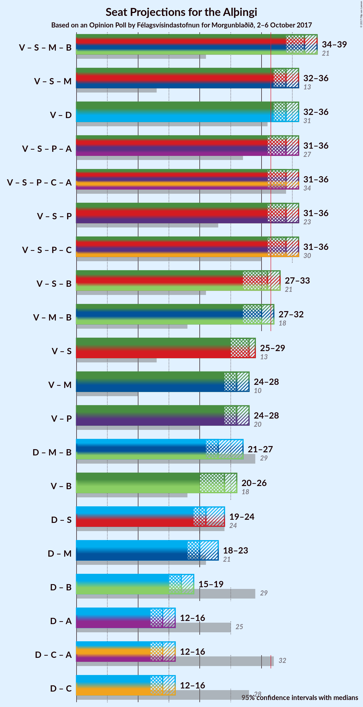

# Opinion Poll by Félagsvísindastofnun for Morgunblaðið, 2–6 October 2017

<a href="#voting-intentions">Voting Intentions</a> | <a href="#seats">Seats</a> | <a href="#coalitions">Coalitions</a> | <a href="#technical-information">Technical Information</a>

## Voting Intentions

### Confidence Intervals

| Party | Last Result | Poll Result | 80% Confidence Interval | 90% Confidence Interval | 95% Confidence Interval | 99% Confidence Interval |
|:-----:|:-----------:|:-----------:|:-----------------------:|:-----------------------:|:-----------------------:|:-----------------------:|
| Vinstrihreyfingin – grænt framboð | 15.9% | 28.1% | 26.3–30.0% |25.8–30.6% |25.3–31.1% |24.5–32.0% |
| Sjálfstæðisflokkurinn | 29.0% | 20.7% | 19.1–22.5% |18.6–22.9% |18.2–23.4% |17.5–24.2% |
| Samfylkingin | 5.7% | 10.8% | 9.6–12.2% |9.3–12.6% |9.0–13.0% |8.4–13.7% |
| Miðflokkurinn | 0.0% | 9.4% | 8.3–10.8% |8.0–11.1% |7.7–11.5% |7.2–12.1% |
| Píratar | 14.5% | 9.1% | 8.0–10.4% |7.7–10.8% |7.4–11.1% |7.0–11.8% |
| Flokkur fólksins | 3.5% | 9.0% | 7.9–10.3% |7.6–10.7% |7.3–11.0% |6.9–11.7% |
| Framsóknarflokkurinn | 11.5% | 5.5% | 4.7–6.6% |4.4–6.9% |4.2–7.2% |3.9–7.7% |
| Viðreisn | 10.5% | 3.1% | 2.5–3.9% |2.3–4.2% |2.1–4.4% |1.9–4.8% |
| Björt framtíð | 7.2% | 2.7% | 2.1–3.5% |1.9–3.7% |1.8–3.9% |1.6–4.3% |
| Íslenska þjóðfylkingin | 0.2% | 0.4% | 0.2–0.9% |0.2–1.0% |0.2–1.1% |0.1–1.3% |
| Alþýðufylkingin | 0.3% | 0.3% | 0.2–0.7% |0.1–0.8% |0.1–0.9% |0.1–1.2% |
| Dögun | 1.7% | 0.0% | 0.0–0.2% |0.0–0.3% |0.0–0.4% |0.0–0.6% |

*Note:* The poll result column reflects the actual value used in the calculations. Published results may vary slightly, and in addition be rounded to fewer digits.

## Seats

### Confidence Intervals

| Party | Last Result | Median | 80% Confidence Interval | 90% Confidence Interval | 95% Confidence Interval | 99% Confidence Interval |
|:-----:|:-----------:|:------:|:-----------------------:|:-----------------------:|:-----------------------:|:-----------------------:|
| <a href="#vinstrihreyfingin-–-grænt-framboð">Vinstrihreyfingin – grænt framboð</a> | 10 | 20 | 19–21 |18–22 |17–22 |17–23 |
| <a href="#sjálfstæðisflokkurinn">Sjálfstæðisflokkurinn</a> | 21 | 14 | 13–16 |12–16 |12–17 |12–17 |
| <a href="#samfylkingin">Samfylkingin</a> | 3 | 7 | 6–8 |6–8 |6–9 |6–9 |
| <a href="#miðflokkurinn">Miðflokkurinn</a> | 0 | 6 | 5–8 |5–8 |5–8 |4–8 |
| <a href="#píratar">Píratar</a> | 10 | 6 | 5–7 |5–7 |5–7 |4–8 |
| <a href="#flokkur-fólksins">Flokkur fólksins</a> | 0 | 6 | 5–7 |5–7 |5–8 |4–8 |
| <a href="#framsóknarflokkurinn">Framsóknarflokkurinn</a> | 8 | 3 | 1–4 |0–4 |0–5 |0–5 |
| <a href="#viðreisn">Viðreisn</a> | 7 | 0 | 0 |0 |0 |0 |
| <a href="#björt-framtíð">Björt framtíð</a> | 4 | 0 | 0 |0 |0 |0 |
| <a href="#Íslenska-þjóðfylkingin">Íslenska þjóðfylkingin</a> | 0 | 0 | 0 |0 |0 |0 |
| <a href="#alþýðufylkingin">Alþýðufylkingin</a> | 0 | 0 | 0 |0 |0 |0 |
| <a href="#dögun">Dögun</a> | 0 | 0 | 0 |0 |0 |0 |

### Vinstrihreyfingin – grænt framboð

*For a full overview of the results for this party, see the [Vinstrihreyfingin – grænt framboð](party-vinstrihreyfingingrntframbo.html) page.*

| Number of Seats | Probability | Accumulated | Special Marks |
|:---------------:|:-----------:|:-----------:|:-------------:|
| 10 | 0% | 100% | Last Result |
| 11 | 0% | 100% |  |
| 12 | 0% | 100% |  |
| 13 | 0% | 100% |  |
| 14 | 0% | 100% |  |
| 15 | 0% | 100% |  |
| 16 | 0.3% | 100% |  |
| 17 | 4% | 99.7% |  |
| 18 | 5% | 96% |  |
| 19 | 30% | 91% |  |
| 20 | 28% | 60% | Median |
| 21 | 25% | 32% |  |
| 22 | 6% | 7% |  |
| 23 | 0.8% | 0.8% |  |
| 24 | 0.1% | 0.1% |  |
| 25 | 0% | 0% |  |

### Sjálfstæðisflokkurinn

*For a full overview of the results for this party, see the [Sjálfstæðisflokkurinn](party-sjlfstisflokkurinn.html) page.*

| Number of Seats | Probability | Accumulated | Special Marks |
|:---------------:|:-----------:|:-----------:|:-------------:|
| 11 | 0.1% | 100% |  |
| 12 | 6% | 99.9% |  |
| 13 | 23% | 94% |  |
| 14 | 39% | 72% | Median |
| 15 | 22% | 33% |  |
| 16 | 8% | 11% |  |
| 17 | 3% | 3% |  |
| 18 | 0.2% | 0.2% |  |
| 19 | 0% | 0% |  |
| 20 | 0% | 0% |  |
| 21 | 0% | 0% | Last Result |

### Samfylkingin

*For a full overview of the results for this party, see the [Samfylkingin](party-samfylkingin.html) page.*

| Number of Seats | Probability | Accumulated | Special Marks |
|:---------------:|:-----------:|:-----------:|:-------------:|
| 3 | 0% | 100% | Last Result |
| 4 | 0% | 100% |  |
| 5 | 0.2% | 100% |  |
| 6 | 16% | 99.8% |  |
| 7 | 40% | 84% | Median |
| 8 | 40% | 44% |  |
| 9 | 4% | 4% |  |
| 10 | 0.2% | 0.2% |  |
| 11 | 0% | 0% |  |

### Miðflokkurinn

*For a full overview of the results for this party, see the [Miðflokkurinn](party-miflokkurinn.html) page.*

| Number of Seats | Probability | Accumulated | Special Marks |
|:---------------:|:-----------:|:-----------:|:-------------:|
| 0 | 0% | 100% | Last Result |
| 1 | 0% | 100% |  |
| 2 | 0% | 100% |  |
| 3 | 0% | 100% |  |
| 4 | 0.8% | 100% |  |
| 5 | 13% | 99.2% |  |
| 6 | 37% | 86% | Median |
| 7 | 39% | 49% |  |
| 8 | 11% | 11% |  |
| 9 | 0.1% | 0.1% |  |
| 10 | 0% | 0% |  |

### Píratar

*For a full overview of the results for this party, see the [Píratar](party-pratar.html) page.*

| Number of Seats | Probability | Accumulated | Special Marks |
|:---------------:|:-----------:|:-----------:|:-------------:|
| 4 | 1.1% | 100% |  |
| 5 | 18% | 98.9% |  |
| 6 | 40% | 81% | Median |
| 7 | 40% | 41% |  |
| 8 | 1.5% | 2% |  |
| 9 | 0.2% | 0.2% |  |
| 10 | 0% | 0% | Last Result |

### Flokkur fólksins

*For a full overview of the results for this party, see the [Flokkur fólksins](party-flokkurflksins.html) page.*

| Number of Seats | Probability | Accumulated | Special Marks |
|:---------------:|:-----------:|:-----------:|:-------------:|
| 0 | 0% | 100% | Last Result |
| 1 | 0% | 100% |  |
| 2 | 0% | 100% |  |
| 3 | 0% | 100% |  |
| 4 | 0.5% | 100% |  |
| 5 | 27% | 99.4% |  |
| 6 | 56% | 72% | Median |
| 7 | 13% | 16% |  |
| 8 | 3% | 3% |  |
| 9 | 0.1% | 0.1% |  |
| 10 | 0% | 0% |  |

### Framsóknarflokkurinn

*For a full overview of the results for this party, see the [Framsóknarflokkurinn](party-framsknarflokkurinn.html) page.*

| Number of Seats | Probability | Accumulated | Special Marks |
|:---------------:|:-----------:|:-----------:|:-------------:|
| 0 | 6% | 100% |  |
| 1 | 9% | 94% |  |
| 2 | 8% | 86% |  |
| 3 | 30% | 77% | Median |
| 4 | 43% | 47% |  |
| 5 | 4% | 4% |  |
| 6 | 0% | 0% |  |
| 7 | 0% | 0% |  |
| 8 | 0% | 0% | Last Result |

### Viðreisn

*For a full overview of the results for this party, see the [Viðreisn](party-vireisn.html) page.*

| Number of Seats | Probability | Accumulated | Special Marks |
|:---------------:|:-----------:|:-----------:|:-------------:|
| 0 | 99.9% | 100% | Median |
| 1 | 0% | 0.1% |  |
| 2 | 0% | 0.1% |  |
| 3 | 0.1% | 0.1% |  |
| 4 | 0% | 0% |  |
| 5 | 0% | 0% |  |
| 6 | 0% | 0% |  |
| 7 | 0% | 0% | Last Result |

### Björt framtíð

*For a full overview of the results for this party, see the [Björt framtíð](party-bjrtframt.html) page.*

| Number of Seats | Probability | Accumulated | Special Marks |
|:---------------:|:-----------:|:-----------:|:-------------:|
| 0 | 99.9% | 100% | Median |
| 1 | 0.1% | 0.1% |  |
| 2 | 0% | 0% |  |
| 3 | 0% | 0% |  |
| 4 | 0% | 0% | Last Result |

### Íslenska þjóðfylkingin

*For a full overview of the results for this party, see the [Íslenska þjóðfylkingin](party-slenskajfylkingin.html) page.*

| Number of Seats | Probability | Accumulated | Special Marks |
|:---------------:|:-----------:|:-----------:|:-------------:|
| 0 | 99.9% | 100% | Last Result, Median |
| 1 | 0.1% | 0.1% |  |
| 2 | 0% | 0% |  |

### Alþýðufylkingin

*For a full overview of the results for this party, see the [Alþýðufylkingin](party-alufylkingin.html) page.*

| Number of Seats | Probability | Accumulated | Special Marks |
|:---------------:|:-----------:|:-----------:|:-------------:|
| 0 | 100% | 100% | Last Result, Median |

### Dögun

*For a full overview of the results for this party, see the [Dögun](party-dgun.html) page.*

| Number of Seats | Probability | Accumulated | Special Marks |
|:---------------:|:-----------:|:-----------:|:-------------:|
| 0 | 100% | 100% | Last Result, Median |

## Coalitions

### Confidence Intervals

| Coalition | Last Result | Median | Majority? | 80% Confidence Interval | 90% Confidence Interval | 95% Confidence Interval | 99% Confidence Interval |
|:---------:|:-----------:|:------:|:---------:|:-----------------------:|:-----------------------:|:-----------------------:|:-----------------------:|
| Vinstrihreyfingin – grænt framboð – Samfylkingin – Miðflokkurinn – Framsóknarflokkurinn | 21 | 37 | 100% | 35–38 | 34–39 | 33–39 | 33–40 |
| Vinstrihreyfingin – grænt framboð – Sjálfstæðisflokkurinn | 31 | 34 | 94% | 32–36 | 31–36 | 31–37 | 31–38 |
| Vinstrihreyfingin – grænt framboð – Samfylkingin – Píratar – Björt framtíð | 27 | 33 | 89% | 31–35 | 31–36 | 31–36 | 30–37 |
| Vinstrihreyfingin – grænt framboð – Samfylkingin – Píratar – Viðreisn – Björt framtíð | 34 | 33 | 89% | 31–35 | 31–36 | 31–36 | 30–37 |
| Vinstrihreyfingin – grænt framboð – Samfylkingin – Píratar | 23 | 33 | 89% | 31–35 | 31–36 | 31–36 | 30–37 |
| Vinstrihreyfingin – grænt framboð – Samfylkingin – Píratar – Viðreisn | 30 | 33 | 89% | 31–35 | 31–36 | 31–36 | 30–37 |
| Vinstrihreyfingin – grænt framboð – Samfylkingin – Miðflokkurinn | 13 | 34 | 96% | 32–35 | 32–35 | 30–36 | 30–37 |
| Vinstrihreyfingin – grænt framboð – Samfylkingin – Framsóknarflokkurinn | 21 | 30 | 19% | 28–32 | 27–33 | 27–33 | 26–34 |
| Vinstrihreyfingin – grænt framboð – Miðflokkurinn – Framsóknarflokkurinn | 18 | 29 | 7% | 28–31 | 27–32 | 26–32 | 26–33 |
| Vinstrihreyfingin – grænt framboð – Samfylkingin | 13 | 27 | 0% | 25–29 | 25–29 | 24–30 | 24–31 |
| Vinstrihreyfingin – grænt framboð – Miðflokkurinn | 10 | 26 | 0% | 25–28 | 25–28 | 24–29 | 23–29 |
| Vinstrihreyfingin – grænt framboð – Píratar | 20 | 26 | 0% | 25–28 | 24–28 | 23–28 | 23–29 |
| Sjálfstæðisflokkurinn – Miðflokkurinn – Framsóknarflokkurinn | 29 | 23 | 0% | 22–26 | 21–27 | 21–27 | 20–28 |
| Vinstrihreyfingin – grænt framboð – Framsóknarflokkurinn | 18 | 23 | 0% | 21–25 | 20–25 | 20–26 | 19–26 |
| Sjálfstæðisflokkurinn – Samfylkingin | 24 | 21 | 0% | 20–23 | 20–24 | 19–24 | 19–24 |
| Sjálfstæðisflokkurinn – Miðflokkurinn | 21 | 20 | 0% | 19–23 | 19–23 | 18–24 | 18–24 |
| Sjálfstæðisflokkurinn – Framsóknarflokkurinn | 29 | 17 | 0% | 16–19 | 15–19 | 15–20 | 14–20 |
| Sjálfstæðisflokkurinn – Björt framtíð | 25 | 14 | 0% | 13–16 | 12–16 | 12–17 | 12–17 |
| Sjálfstæðisflokkurinn – Viðreisn – Björt framtíð | 32 | 14 | 0% | 13–16 | 12–16 | 12–17 | 12–17 |
| Sjálfstæðisflokkurinn – Viðreisn | 28 | 14 | 0% | 13–16 | 12–16 | 12–17 | 12–17 |

### Vinstrihreyfingin – grænt framboð – Samfylkingin – Miðflokkurinn – Framsóknarflokkurinn

| Number of Seats | Probability | Accumulated | Special Marks |
|:---------------:|:-----------:|:-----------:|:-------------:|
| 21 | 0% | 100% | Last Result |
| 22 | 0% | 100% |  |
| 23 | 0% | 100% |  |
| 24 | 0% | 100% |  |
| 25 | 0% | 100% |  |
| 26 | 0% | 100% |  |
| 27 | 0% | 100% |  |
| 28 | 0% | 100% |  |
| 29 | 0% | 100% |  |
| 30 | 0% | 100% |  |
| 31 | 0% | 100% |  |
| 32 | 0.4% | 100% | Majority |
| 33 | 2% | 99.6% |  |
| 34 | 3% | 97% |  |
| 35 | 12% | 95% |  |
| 36 | 23% | 82% | Median |
| 37 | 29% | 59% |  |
| 38 | 22% | 30% |  |
| 39 | 7% | 8% |  |
| 40 | 0.6% | 0.7% |  |
| 41 | 0% | 0% |  |

### Vinstrihreyfingin – grænt framboð – Sjálfstæðisflokkurinn

| Number of Seats | Probability | Accumulated | Special Marks |
|:---------------:|:-----------:|:-----------:|:-------------:|
| 30 | 0.2% | 100% |  |
| 31 | 6% | 99.8% | Last Result |
| 32 | 9% | 94% | Majority |
| 33 | 20% | 85% |  |
| 34 | 30% | 65% | Median |
| 35 | 17% | 35% |  |
| 36 | 15% | 18% |  |
| 37 | 2% | 3% |  |
| 38 | 0.6% | 0.7% |  |
| 39 | 0% | 0% |  |

### Vinstrihreyfingin – grænt framboð – Samfylkingin – Píratar – Björt framtíð

| Number of Seats | Probability | Accumulated | Special Marks |
|:---------------:|:-----------:|:-----------:|:-------------:|
| 27 | 0% | 100% | Last Result |
| 28 | 0% | 100% |  |
| 29 | 0.2% | 100% |  |
| 30 | 2% | 99.8% |  |
| 31 | 8% | 98% |  |
| 32 | 13% | 89% | Majority |
| 33 | 27% | 76% | Median |
| 34 | 26% | 49% |  |
| 35 | 16% | 23% |  |
| 36 | 6% | 6% |  |
| 37 | 0.6% | 0.7% |  |
| 38 | 0.1% | 0.1% |  |
| 39 | 0% | 0% |  |

### Vinstrihreyfingin – grænt framboð – Samfylkingin – Píratar – Viðreisn – Björt framtíð

| Number of Seats | Probability | Accumulated | Special Marks |
|:---------------:|:-----------:|:-----------:|:-------------:|
| 29 | 0.2% | 100% |  |
| 30 | 2% | 99.8% |  |
| 31 | 8% | 98% |  |
| 32 | 13% | 89% | Majority |
| 33 | 27% | 76% | Median |
| 34 | 26% | 49% | Last Result |
| 35 | 16% | 23% |  |
| 36 | 6% | 6% |  |
| 37 | 0.6% | 0.7% |  |
| 38 | 0.1% | 0.1% |  |
| 39 | 0% | 0% |  |

### Vinstrihreyfingin – grænt framboð – Samfylkingin – Píratar

| Number of Seats | Probability | Accumulated | Special Marks |
|:---------------:|:-----------:|:-----------:|:-------------:|
| 23 | 0% | 100% | Last Result |
| 24 | 0% | 100% |  |
| 25 | 0% | 100% |  |
| 26 | 0% | 100% |  |
| 27 | 0% | 100% |  |
| 28 | 0% | 100% |  |
| 29 | 0.2% | 100% |  |
| 30 | 2% | 99.7% |  |
| 31 | 8% | 98% |  |
| 32 | 13% | 89% | Majority |
| 33 | 27% | 76% | Median |
| 34 | 26% | 49% |  |
| 35 | 16% | 23% |  |
| 36 | 6% | 6% |  |
| 37 | 0.6% | 0.7% |  |
| 38 | 0.1% | 0.1% |  |
| 39 | 0% | 0% |  |

### Vinstrihreyfingin – grænt framboð – Samfylkingin – Píratar – Viðreisn

| Number of Seats | Probability | Accumulated | Special Marks |
|:---------------:|:-----------:|:-----------:|:-------------:|
| 29 | 0.2% | 100% |  |
| 30 | 2% | 99.8% | Last Result |
| 31 | 8% | 98% |  |
| 32 | 13% | 89% | Majority |
| 33 | 27% | 76% | Median |
| 34 | 26% | 49% |  |
| 35 | 16% | 23% |  |
| 36 | 6% | 6% |  |
| 37 | 0.6% | 0.7% |  |
| 38 | 0.1% | 0.1% |  |
| 39 | 0% | 0% |  |

### Vinstrihreyfingin – grænt framboð – Samfylkingin – Miðflokkurinn

| Number of Seats | Probability | Accumulated | Special Marks |
|:---------------:|:-----------:|:-----------:|:-------------:|
| 13 | 0% | 100% | Last Result |
| 14 | 0% | 100% |  |
| 15 | 0% | 100% |  |
| 16 | 0% | 100% |  |
| 17 | 0% | 100% |  |
| 18 | 0% | 100% |  |
| 19 | 0% | 100% |  |
| 20 | 0% | 100% |  |
| 21 | 0% | 100% |  |
| 22 | 0% | 100% |  |
| 23 | 0% | 100% |  |
| 24 | 0% | 100% |  |
| 25 | 0% | 100% |  |
| 26 | 0% | 100% |  |
| 27 | 0% | 100% |  |
| 28 | 0% | 100% |  |
| 29 | 0% | 100% |  |
| 30 | 3% | 100% |  |
| 31 | 2% | 97% |  |
| 32 | 12% | 96% | Majority |
| 33 | 28% | 83% | Median |
| 34 | 29% | 56% |  |
| 35 | 22% | 26% |  |
| 36 | 4% | 5% |  |
| 37 | 0.7% | 0.9% |  |
| 38 | 0.1% | 0.2% |  |
| 39 | 0% | 0% |  |

### Vinstrihreyfingin – grænt framboð – Samfylkingin – Framsóknarflokkurinn

| Number of Seats | Probability | Accumulated | Special Marks |
|:---------------:|:-----------:|:-----------:|:-------------:|
| 21 | 0% | 100% | Last Result |
| 22 | 0% | 100% |  |
| 23 | 0% | 100% |  |
| 24 | 0% | 100% |  |
| 25 | 0.3% | 100% |  |
| 26 | 0.7% | 99.6% |  |
| 27 | 5% | 98.9% |  |
| 28 | 4% | 94% |  |
| 29 | 22% | 90% |  |
| 30 | 19% | 68% | Median |
| 31 | 30% | 48% |  |
| 32 | 12% | 19% | Majority |
| 33 | 6% | 7% |  |
| 34 | 1.4% | 1.4% |  |
| 35 | 0% | 0% |  |

### Vinstrihreyfingin – grænt framboð – Miðflokkurinn – Framsóknarflokkurinn

| Number of Seats | Probability | Accumulated | Special Marks |
|:---------------:|:-----------:|:-----------:|:-------------:|
| 18 | 0% | 100% | Last Result |
| 19 | 0% | 100% |  |
| 20 | 0% | 100% |  |
| 21 | 0% | 100% |  |
| 22 | 0% | 100% |  |
| 23 | 0% | 100% |  |
| 24 | 0% | 100% |  |
| 25 | 0.1% | 100% |  |
| 26 | 3% | 99.9% |  |
| 27 | 7% | 97% |  |
| 28 | 17% | 90% |  |
| 29 | 28% | 73% | Median |
| 30 | 17% | 45% |  |
| 31 | 21% | 28% |  |
| 32 | 6% | 7% | Majority |
| 33 | 0.5% | 0.5% |  |
| 34 | 0% | 0% |  |

### Vinstrihreyfingin – grænt framboð – Samfylkingin

| Number of Seats | Probability | Accumulated | Special Marks |
|:---------------:|:-----------:|:-----------:|:-------------:|
| 13 | 0% | 100% | Last Result |
| 14 | 0% | 100% |  |
| 15 | 0% | 100% |  |
| 16 | 0% | 100% |  |
| 17 | 0% | 100% |  |
| 18 | 0% | 100% |  |
| 19 | 0% | 100% |  |
| 20 | 0% | 100% |  |
| 21 | 0% | 100% |  |
| 22 | 0% | 100% |  |
| 23 | 0.1% | 100% |  |
| 24 | 4% | 99.9% |  |
| 25 | 8% | 96% |  |
| 26 | 16% | 88% |  |
| 27 | 29% | 72% | Median |
| 28 | 27% | 43% |  |
| 29 | 12% | 16% |  |
| 30 | 3% | 3% |  |
| 31 | 0.6% | 0.6% |  |
| 32 | 0% | 0% | Majority |

### Vinstrihreyfingin – grænt framboð – Miðflokkurinn

| Number of Seats | Probability | Accumulated | Special Marks |
|:---------------:|:-----------:|:-----------:|:-------------:|
| 10 | 0% | 100% | Last Result |
| 11 | 0% | 100% |  |
| 12 | 0% | 100% |  |
| 13 | 0% | 100% |  |
| 14 | 0% | 100% |  |
| 15 | 0% | 100% |  |
| 16 | 0% | 100% |  |
| 17 | 0% | 100% |  |
| 18 | 0% | 100% |  |
| 19 | 0% | 100% |  |
| 20 | 0% | 100% |  |
| 21 | 0% | 100% |  |
| 22 | 0.1% | 100% |  |
| 23 | 2% | 99.9% |  |
| 24 | 2% | 98% |  |
| 25 | 21% | 96% |  |
| 26 | 33% | 75% | Median |
| 27 | 23% | 42% |  |
| 28 | 16% | 19% |  |
| 29 | 2% | 3% |  |
| 30 | 0.3% | 0.3% |  |
| 31 | 0% | 0% |  |

### Vinstrihreyfingin – grænt framboð – Píratar

| Number of Seats | Probability | Accumulated | Special Marks |
|:---------------:|:-----------:|:-----------:|:-------------:|
| 20 | 0% | 100% | Last Result |
| 21 | 0% | 100% |  |
| 22 | 0.3% | 100% |  |
| 23 | 3% | 99.7% |  |
| 24 | 4% | 97% |  |
| 25 | 17% | 92% |  |
| 26 | 43% | 75% | Median |
| 27 | 20% | 32% |  |
| 28 | 10% | 12% |  |
| 29 | 1.2% | 1.5% |  |
| 30 | 0.2% | 0.3% |  |
| 31 | 0% | 0% |  |

### Sjálfstæðisflokkurinn – Miðflokkurinn – Framsóknarflokkurinn

| Number of Seats | Probability | Accumulated | Special Marks |
|:---------------:|:-----------:|:-----------:|:-------------:|
| 19 | 0.3% | 100% |  |
| 20 | 0.5% | 99.7% |  |
| 21 | 5% | 99.2% |  |
| 22 | 8% | 94% |  |
| 23 | 37% | 86% | Median |
| 24 | 30% | 49% |  |
| 25 | 8% | 19% |  |
| 26 | 5% | 12% |  |
| 27 | 5% | 7% |  |
| 28 | 1.5% | 1.5% |  |
| 29 | 0% | 0% | Last Result |

### Vinstrihreyfingin – grænt framboð – Framsóknarflokkurinn

| Number of Seats | Probability | Accumulated | Special Marks |
|:---------------:|:-----------:|:-----------:|:-------------:|
| 18 | 0.3% | 100% | Last Result |
| 19 | 0.7% | 99.7% |  |
| 20 | 5% | 99.1% |  |
| 21 | 16% | 94% |  |
| 22 | 11% | 78% |  |
| 23 | 34% | 68% | Median |
| 24 | 16% | 33% |  |
| 25 | 13% | 17% |  |
| 26 | 4% | 5% |  |
| 27 | 0.2% | 0.2% |  |
| 28 | 0% | 0% |  |

### Sjálfstæðisflokkurinn – Samfylkingin

| Number of Seats | Probability | Accumulated | Special Marks |
|:---------------:|:-----------:|:-----------:|:-------------:|
| 18 | 0.4% | 100% |  |
| 19 | 4% | 99.6% |  |
| 20 | 15% | 95% |  |
| 21 | 38% | 81% | Median |
| 22 | 21% | 42% |  |
| 23 | 16% | 21% |  |
| 24 | 5% | 6% | Last Result |
| 25 | 0.4% | 0.4% |  |
| 26 | 0% | 0.1% |  |
| 27 | 0% | 0% |  |

### Sjálfstæðisflokkurinn – Miðflokkurinn

| Number of Seats | Probability | Accumulated | Special Marks |
|:---------------:|:-----------:|:-----------:|:-------------:|
| 17 | 0.4% | 100% |  |
| 18 | 4% | 99.6% |  |
| 19 | 18% | 95% |  |
| 20 | 30% | 77% | Median |
| 21 | 25% | 47% | Last Result |
| 22 | 10% | 23% |  |
| 23 | 8% | 12% |  |
| 24 | 4% | 4% |  |
| 25 | 0.3% | 0.3% |  |
| 26 | 0% | 0% |  |

### Sjálfstæðisflokkurinn – Framsóknarflokkurinn

| Number of Seats | Probability | Accumulated | Special Marks |
|:---------------:|:-----------:|:-----------:|:-------------:|
| 12 | 0.1% | 100% |  |
| 13 | 0.2% | 99.9% |  |
| 14 | 0.9% | 99.7% |  |
| 15 | 5% | 98.8% |  |
| 16 | 22% | 94% |  |
| 17 | 36% | 72% | Median |
| 18 | 20% | 36% |  |
| 19 | 11% | 16% |  |
| 20 | 5% | 5% |  |
| 21 | 0.3% | 0.3% |  |
| 22 | 0% | 0% |  |
| 23 | 0% | 0% |  |
| 24 | 0% | 0% |  |
| 25 | 0% | 0% |  |
| 26 | 0% | 0% |  |
| 27 | 0% | 0% |  |
| 28 | 0% | 0% |  |
| 29 | 0% | 0% | Last Result |

### Sjálfstæðisflokkurinn – Björt framtíð

| Number of Seats | Probability | Accumulated | Special Marks |
|:---------------:|:-----------:|:-----------:|:-------------:|
| 11 | 0.1% | 100% |  |
| 12 | 6% | 99.9% |  |
| 13 | 22% | 94% |  |
| 14 | 39% | 72% | Median |
| 15 | 22% | 33% |  |
| 16 | 8% | 11% |  |
| 17 | 3% | 3% |  |
| 18 | 0.2% | 0.2% |  |
| 19 | 0% | 0% |  |
| 20 | 0% | 0% |  |
| 21 | 0% | 0% |  |
| 22 | 0% | 0% |  |
| 23 | 0% | 0% |  |
| 24 | 0% | 0% |  |
| 25 | 0% | 0% | Last Result |

### Sjálfstæðisflokkurinn – Viðreisn – Björt framtíð

| Number of Seats | Probability | Accumulated | Special Marks |
|:---------------:|:-----------:|:-----------:|:-------------:|
| 11 | 0.1% | 100% |  |
| 12 | 5% | 99.9% |  |
| 13 | 22% | 94% |  |
| 14 | 39% | 72% | Median |
| 15 | 22% | 33% |  |
| 16 | 8% | 11% |  |
| 17 | 3% | 4% |  |
| 18 | 0.2% | 0.2% |  |
| 19 | 0% | 0% |  |
| 20 | 0% | 0% |  |
| 21 | 0% | 0% |  |
| 22 | 0% | 0% |  |
| 23 | 0% | 0% |  |
| 24 | 0% | 0% |  |
| 25 | 0% | 0% |  |
| 26 | 0% | 0% |  |
| 27 | 0% | 0% |  |
| 28 | 0% | 0% |  |
| 29 | 0% | 0% |  |
| 30 | 0% | 0% |  |
| 31 | 0% | 0% |  |
| 32 | 0% | 0% | Last Result, Majority |

### Sjálfstæðisflokkurinn – Viðreisn

| Number of Seats | Probability | Accumulated | Special Marks |
|:---------------:|:-----------:|:-----------:|:-------------:|
| 11 | 0.1% | 100% |  |
| 12 | 6% | 99.9% |  |
| 13 | 22% | 94% |  |
| 14 | 39% | 72% | Median |
| 15 | 22% | 33% |  |
| 16 | 8% | 11% |  |
| 17 | 3% | 3% |  |
| 18 | 0.2% | 0.2% |  |
| 19 | 0% | 0% |  |
| 20 | 0% | 0% |  |
| 21 | 0% | 0% |  |
| 22 | 0% | 0% |  |
| 23 | 0% | 0% |  |
| 24 | 0% | 0% |  |
| 25 | 0% | 0% |  |
| 26 | 0% | 0% |  |
| 27 | 0% | 0% |  |
| 28 | 0% | 0% | Last Result |

## Technical Information

### Opinion Poll

+ **Pollster:** Félagsvísindastofnun
+ **Media:** Morgunblaðið
+ **Fieldwork period:** 2–6 October 2017

### Calculations

+ **Sample size:** 943
+ **Simulations done:** 4,194,304
+ **Error estimate:** 2.62%

