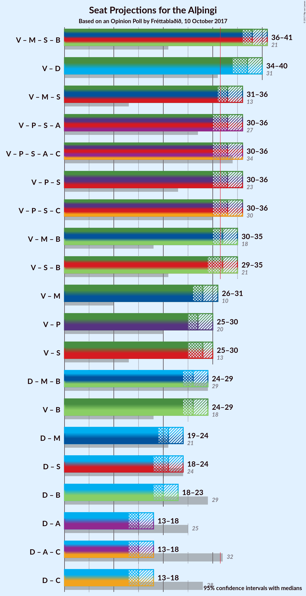

# Opinion Poll by Fréttablaðið, 10 October 2017

<a href="#voting-intentions">Voting Intentions</a> | <a href="#seats">Seats</a> | <a href="#coalitions">Coalitions</a> | <a href="#technical-information">Technical Information</a>

## Voting Intentions

### Confidence Intervals

| Party | Last Result | Poll Result | 80% Confidence Interval | 90% Confidence Interval | 95% Confidence Interval | 99% Confidence Interval |
|:-----:|:-----------:|:-----------:|:-----------------------:|:-----------------------:|:-----------------------:|:-----------------------:|
| Vinstrihreyfingin – grænt framboð | 15.9% | 29.9% | 27.9–32.0% |27.3–32.6% |26.8–33.1% |25.9–34.2% |
| Sjálfstæðisflokkurinn | 29.0% | 22.2% | 20.4–24.1% |19.9–24.7% |19.4–25.2% |18.6–26.1% |
| Miðflokkurinn | 0.0% | 9.2% | 8.0–10.7% |7.7–11.1% |7.4–11.4% |6.9–12.1% |
| Píratar | 14.5% | 8.5% | 7.3–9.9% |7.0–10.3% |6.7–10.6% |6.2–11.3% |
| Samfylkingin | 5.7% | 8.3% | 7.2–9.7% |6.9–10.1% |6.6–10.5% |6.1–11.2% |
| Framsóknarflokkurinn | 11.5% | 7.1% | 6.1–8.4% |5.8–8.8% |5.5–9.1% |5.1–9.8% |
| Flokkur fólksins | 3.5% | 6.1% | 5.1–7.3% |4.9–7.7% |4.6–8.0% |4.2–8.6% |
| Björt framtíð | 7.2% | 3.6% | 2.9–4.6% |2.7–4.9% |2.5–5.1% |2.2–5.7% |
| Viðreisn | 10.5% | 3.4% | 2.7–4.3% |2.5–4.6% |2.3–4.8% |2.0–5.4% |

*Note:* The poll result column reflects the actual value used in the calculations. Published results may vary slightly, and in addition be rounded to fewer digits.

## Seats

### Confidence Intervals

| Party | Last Result | Median | 80% Confidence Interval | 90% Confidence Interval | 95% Confidence Interval | 99% Confidence Interval |
|:-----:|:-----------:|:------:|:-----------------------:|:-----------------------:|:-----------------------:|:-----------------------:|
| <a href="#vinstrihreyfingin-–-grænt-framboð">Vinstrihreyfingin – grænt framboð</a> | 10 | 22 | 20–23 |20–24 |20–25 |19–25 |
| <a href="#sjálfstæðisflokkurinn">Sjálfstæðisflokkurinn</a> | 21 | 15 | 14–17 |14–18 |13–18 |13–18 |
| <a href="#miðflokkurinn">Miðflokkurinn</a> | 0 | 6 | 5–7 |5–8 |5–8 |4–8 |
| <a href="#píratar">Píratar</a> | 10 | 5 | 5–6 |5–7 |4–7 |4–8 |
| <a href="#samfylkingin">Samfylkingin</a> | 3 | 6 | 4–6 |4–7 |4–7 |4–8 |
| <a href="#framsóknarflokkurinn">Framsóknarflokkurinn</a> | 8 | 5 | 4–5 |4–6 |3–6 |3–6 |
| <a href="#flokkur-fólksins">Flokkur fólksins</a> | 0 | 4 | 3–5 |0–5 |0–5 |0–6 |
| <a href="#björt-framtíð">Björt framtíð</a> | 4 | 0 | 0 |0–1 |0–3 |0–3 |
| <a href="#viðreisn">Viðreisn</a> | 7 | 0 | 0 |0 |0 |0–3 |

### Vinstrihreyfingin – grænt framboð

*For a full overview of the results for this party, see the [Vinstrihreyfingin – grænt framboð](party-vinstrihreyfingingrntframbo.html) page.*

| Number of Seats | Probability | Accumulated | Special Marks |
|:---------------:|:-----------:|:-----------:|:-------------:|
| 10 | 0% | 100% | Last Result |
| 11 | 0% | 100% |  |
| 12 | 0% | 100% |  |
| 13 | 0% | 100% |  |
| 14 | 0% | 100% |  |
| 15 | 0% | 100% |  |
| 16 | 0% | 100% |  |
| 17 | 0.1% | 100% |  |
| 18 | 0.4% | 99.9% |  |
| 19 | 2% | 99.5% |  |
| 20 | 11% | 98% |  |
| 21 | 21% | 87% |  |
| 22 | 46% | 66% | Median |
| 23 | 14% | 20% |  |
| 24 | 2% | 6% |  |
| 25 | 3% | 4% |  |
| 26 | 0.3% | 0.3% |  |
| 27 | 0% | 0.1% |  |
| 28 | 0% | 0% |  |

### Sjálfstæðisflokkurinn

*For a full overview of the results for this party, see the [Sjálfstæðisflokkurinn](party-sjlfstisflokkurinn.html) page.*

| Number of Seats | Probability | Accumulated | Special Marks |
|:---------------:|:-----------:|:-----------:|:-------------:|
| 12 | 0.2% | 100% |  |
| 13 | 3% | 99.8% |  |
| 14 | 12% | 97% |  |
| 15 | 49% | 85% | Median |
| 16 | 22% | 37% |  |
| 17 | 9% | 14% |  |
| 18 | 5% | 5% |  |
| 19 | 0.4% | 0.5% |  |
| 20 | 0% | 0% |  |
| 21 | 0% | 0% | Last Result |

### Miðflokkurinn

*For a full overview of the results for this party, see the [Miðflokkurinn](party-miflokkurinn.html) page.*

| Number of Seats | Probability | Accumulated | Special Marks |
|:---------------:|:-----------:|:-----------:|:-------------:|
| 0 | 0% | 100% | Last Result |
| 1 | 0% | 100% |  |
| 2 | 0% | 100% |  |
| 3 | 0% | 100% |  |
| 4 | 1.3% | 100% |  |
| 5 | 25% | 98.7% |  |
| 6 | 46% | 74% | Median |
| 7 | 22% | 28% |  |
| 8 | 5% | 5% |  |
| 9 | 0.2% | 0.2% |  |
| 10 | 0% | 0% |  |

### Píratar

*For a full overview of the results for this party, see the [Píratar](party-pratar.html) page.*

| Number of Seats | Probability | Accumulated | Special Marks |
|:---------------:|:-----------:|:-----------:|:-------------:|
| 4 | 5% | 100% |  |
| 5 | 45% | 95% | Median |
| 6 | 42% | 50% |  |
| 7 | 7% | 8% |  |
| 8 | 0.7% | 0.7% |  |
| 9 | 0% | 0% |  |
| 10 | 0% | 0% | Last Result |

### Samfylkingin

*For a full overview of the results for this party, see the [Samfylkingin](party-samfylkingin.html) page.*

| Number of Seats | Probability | Accumulated | Special Marks |
|:---------------:|:-----------:|:-----------:|:-------------:|
| 3 | 0.3% | 100% | Last Result |
| 4 | 10% | 99.7% |  |
| 5 | 22% | 90% |  |
| 6 | 60% | 67% | Median |
| 7 | 7% | 8% |  |
| 8 | 0.7% | 0.7% |  |
| 9 | 0% | 0% |  |

### Framsóknarflokkurinn

*For a full overview of the results for this party, see the [Framsóknarflokkurinn](party-framsknarflokkurinn.html) page.*

| Number of Seats | Probability | Accumulated | Special Marks |
|:---------------:|:-----------:|:-----------:|:-------------:|
| 1 | 0.1% | 100% |  |
| 2 | 0.2% | 99.8% |  |
| 3 | 4% | 99.6% |  |
| 4 | 36% | 96% |  |
| 5 | 52% | 60% | Median |
| 6 | 7% | 7% |  |
| 7 | 0.5% | 0.5% |  |
| 8 | 0% | 0% | Last Result |

### Flokkur fólksins

*For a full overview of the results for this party, see the [Flokkur fólksins](party-flokkurflksins.html) page.*

| Number of Seats | Probability | Accumulated | Special Marks |
|:---------------:|:-----------:|:-----------:|:-------------:|
| 0 | 7% | 100% | Last Result |
| 1 | 0.1% | 93% |  |
| 2 | 0% | 93% |  |
| 3 | 20% | 93% |  |
| 4 | 56% | 73% | Median |
| 5 | 17% | 17% |  |
| 6 | 0.8% | 0.8% |  |
| 7 | 0% | 0% |  |

### Björt framtíð

*For a full overview of the results for this party, see the [Björt framtíð](party-bjrtframt.html) page.*

| Number of Seats | Probability | Accumulated | Special Marks |
|:---------------:|:-----------:|:-----------:|:-------------:|
| 0 | 90% | 100% | Median |
| 1 | 7% | 10% |  |
| 2 | 0% | 3% |  |
| 3 | 3% | 3% |  |
| 4 | 0.1% | 0.1% | Last Result |
| 5 | 0% | 0% |  |

### Viðreisn

*For a full overview of the results for this party, see the [Viðreisn](party-vireisn.html) page.*

| Number of Seats | Probability | Accumulated | Special Marks |
|:---------------:|:-----------:|:-----------:|:-------------:|
| 0 | 98% | 100% | Median |
| 1 | 0% | 2% |  |
| 2 | 0% | 2% |  |
| 3 | 2% | 2% |  |
| 4 | 0.1% | 0.1% |  |
| 5 | 0% | 0% |  |
| 6 | 0% | 0% |  |
| 7 | 0% | 0% | Last Result |

## Coalitions

### Confidence Intervals

| Coalition | Last Result | Median | Majority? | 80% Confidence Interval | 90% Confidence Interval | 95% Confidence Interval | 99% Confidence Interval |
|:---------:|:-----------:|:------:|:---------:|:-----------------------:|:-----------------------:|:-----------------------:|:-----------------------:|
| Vinstrihreyfingin – grænt framboð – Miðflokkurinn – Samfylkingin – Framsóknarflokkurinn | 21 | 38 | 100% | 37–40 | 36–40 | 36–41 | 35–42 |
| Vinstrihreyfingin – grænt framboð – Sjálfstæðisflokkurinn | 31 | 37 | 100% | 35–39 | 35–39 | 34–40 | 34–41 |
| Vinstrihreyfingin – grænt framboð – Miðflokkurinn – Samfylkingin | 13 | 33 | 97% | 32–35 | 32–35 | 31–36 | 30–37 |
| Vinstrihreyfingin – grænt framboð – Píratar – Samfylkingin – Björt framtíð | 27 | 33 | 89% | 31–35 | 31–35 | 30–36 | 29–37 |
| Vinstrihreyfingin – grænt framboð – Píratar – Samfylkingin – Björt framtíð – Viðreisn | 34 | 33 | 89% | 31–35 | 31–35 | 30–36 | 29–37 |
| Vinstrihreyfingin – grænt framboð – Miðflokkurinn – Framsóknarflokkurinn | 18 | 32 | 82% | 31–34 | 31–35 | 30–36 | 29–37 |
| Vinstrihreyfingin – grænt framboð – Píratar – Samfylkingin | 23 | 33 | 87% | 31–35 | 31–35 | 30–36 | 29–37 |
| Vinstrihreyfingin – grænt framboð – Píratar – Samfylkingin – Viðreisn | 30 | 33 | 88% | 31–35 | 31–35 | 30–36 | 29–37 |
| Vinstrihreyfingin – grænt framboð – Samfylkingin – Framsóknarflokkurinn | 21 | 32 | 68% | 30–34 | 30–34 | 29–34 | 28–36 |
| Vinstrihreyfingin – grænt framboð – Miðflokkurinn | 10 | 28 | 0.7% | 27–29 | 26–30 | 26–31 | 25–32 |
| Vinstrihreyfingin – grænt framboð – Píratar | 20 | 27 | 0.3% | 26–29 | 25–30 | 25–30 | 24–31 |
| Vinstrihreyfingin – grænt framboð – Samfylkingin | 13 | 28 | 0.1% | 26–29 | 25–29 | 25–30 | 24–31 |
| Sjálfstæðisflokkurinn – Miðflokkurinn – Framsóknarflokkurinn | 29 | 26 | 0% | 25–28 | 24–29 | 24–30 | 23–30 |
| Vinstrihreyfingin – grænt framboð – Framsóknarflokkurinn | 18 | 26 | 0% | 25–28 | 24–28 | 24–30 | 23–30 |
| Sjálfstæðisflokkurinn – Miðflokkurinn | 21 | 21 | 0% | 20–23 | 19–24 | 19–25 | 18–25 |
| Sjálfstæðisflokkurinn – Samfylkingin | 24 | 21 | 0% | 19–23 | 19–23 | 18–24 | 18–24 |
| Sjálfstæðisflokkurinn – Framsóknarflokkurinn | 29 | 20 | 0% | 19–22 | 18–22 | 18–23 | 17–24 |
| Sjálfstæðisflokkurinn – Björt framtíð | 25 | 15 | 0% | 14–17 | 14–18 | 14–18 | 13–19 |
| Sjálfstæðisflokkurinn – Björt framtíð – Viðreisn | 32 | 15 | 0% | 14–17 | 14–18 | 14–18 | 13–19 |
| Sjálfstæðisflokkurinn – Viðreisn | 28 | 15 | 0% | 14–17 | 14–18 | 13–18 | 13–19 |

### Vinstrihreyfingin – grænt framboð – Miðflokkurinn – Samfylkingin – Framsóknarflokkurinn

| Number of Seats | Probability | Accumulated | Special Marks |
|:---------------:|:-----------:|:-----------:|:-------------:|
| 21 | 0% | 100% | Last Result |
| 22 | 0% | 100% |  |
| 23 | 0% | 100% |  |
| 24 | 0% | 100% |  |
| 25 | 0% | 100% |  |
| 26 | 0% | 100% |  |
| 27 | 0% | 100% |  |
| 28 | 0% | 100% |  |
| 29 | 0% | 100% |  |
| 30 | 0% | 100% |  |
| 31 | 0% | 100% |  |
| 32 | 0% | 100% | Majority |
| 33 | 0% | 100% |  |
| 34 | 0.3% | 100% |  |
| 35 | 1.2% | 99.7% |  |
| 36 | 8% | 98% |  |
| 37 | 21% | 91% |  |
| 38 | 33% | 70% |  |
| 39 | 25% | 37% | Median |
| 40 | 9% | 13% |  |
| 41 | 3% | 4% |  |
| 42 | 0.8% | 1.1% |  |
| 43 | 0.3% | 0.3% |  |
| 44 | 0% | 0% |  |

### Vinstrihreyfingin – grænt framboð – Sjálfstæðisflokkurinn

| Number of Seats | Probability | Accumulated | Special Marks |
|:---------------:|:-----------:|:-----------:|:-------------:|
| 31 | 0% | 100% | Last Result |
| 32 | 0% | 100% | Majority |
| 33 | 0.4% | 100% |  |
| 34 | 3% | 99.6% |  |
| 35 | 8% | 97% |  |
| 36 | 18% | 89% |  |
| 37 | 30% | 71% | Median |
| 38 | 27% | 41% |  |
| 39 | 10% | 14% |  |
| 40 | 2% | 5% |  |
| 41 | 2% | 2% |  |
| 42 | 0.2% | 0.3% |  |
| 43 | 0.1% | 0.1% |  |
| 44 | 0% | 0% |  |

### Vinstrihreyfingin – grænt framboð – Miðflokkurinn – Samfylkingin

| Number of Seats | Probability | Accumulated | Special Marks |
|:---------------:|:-----------:|:-----------:|:-------------:|
| 13 | 0% | 100% | Last Result |
| 14 | 0% | 100% |  |
| 15 | 0% | 100% |  |
| 16 | 0% | 100% |  |
| 17 | 0% | 100% |  |
| 18 | 0% | 100% |  |
| 19 | 0% | 100% |  |
| 20 | 0% | 100% |  |
| 21 | 0% | 100% |  |
| 22 | 0% | 100% |  |
| 23 | 0% | 100% |  |
| 24 | 0% | 100% |  |
| 25 | 0% | 100% |  |
| 26 | 0% | 100% |  |
| 27 | 0% | 100% |  |
| 28 | 0% | 100% |  |
| 29 | 0.1% | 100% |  |
| 30 | 0.6% | 99.9% |  |
| 31 | 3% | 99.3% |  |
| 32 | 13% | 97% | Majority |
| 33 | 38% | 84% |  |
| 34 | 27% | 46% | Median |
| 35 | 14% | 19% |  |
| 36 | 3% | 5% |  |
| 37 | 1.0% | 1.4% |  |
| 38 | 0.4% | 0.4% |  |
| 39 | 0% | 0% |  |

### Vinstrihreyfingin – grænt framboð – Píratar – Samfylkingin – Björt framtíð

| Number of Seats | Probability | Accumulated | Special Marks |
|:---------------:|:-----------:|:-----------:|:-------------:|
| 27 | 0% | 100% | Last Result |
| 28 | 0% | 100% |  |
| 29 | 0.5% | 100% |  |
| 30 | 3% | 99.4% |  |
| 31 | 7% | 96% |  |
| 32 | 21% | 89% | Majority |
| 33 | 27% | 68% | Median |
| 34 | 26% | 42% |  |
| 35 | 11% | 15% |  |
| 36 | 3% | 4% |  |
| 37 | 1.1% | 1.3% |  |
| 38 | 0.1% | 0.2% |  |
| 39 | 0.1% | 0.1% |  |
| 40 | 0% | 0% |  |

### Vinstrihreyfingin – grænt framboð – Píratar – Samfylkingin – Björt framtíð – Viðreisn

| Number of Seats | Probability | Accumulated | Special Marks |
|:---------------:|:-----------:|:-----------:|:-------------:|
| 29 | 0.5% | 100% |  |
| 30 | 3% | 99.5% |  |
| 31 | 7% | 96% |  |
| 32 | 20% | 89% | Majority |
| 33 | 27% | 70% | Median |
| 34 | 26% | 43% | Last Result |
| 35 | 12% | 17% |  |
| 36 | 3% | 4% |  |
| 37 | 1.4% | 2% |  |
| 38 | 0.2% | 0.3% |  |
| 39 | 0.1% | 0.1% |  |
| 40 | 0% | 0% |  |

### Vinstrihreyfingin – grænt framboð – Miðflokkurinn – Framsóknarflokkurinn

| Number of Seats | Probability | Accumulated | Special Marks |
|:---------------:|:-----------:|:-----------:|:-------------:|
| 18 | 0% | 100% | Last Result |
| 19 | 0% | 100% |  |
| 20 | 0% | 100% |  |
| 21 | 0% | 100% |  |
| 22 | 0% | 100% |  |
| 23 | 0% | 100% |  |
| 24 | 0% | 100% |  |
| 25 | 0% | 100% |  |
| 26 | 0% | 100% |  |
| 27 | 0% | 100% |  |
| 28 | 0.1% | 100% |  |
| 29 | 0.8% | 99.8% |  |
| 30 | 3% | 99.1% |  |
| 31 | 14% | 96% |  |
| 32 | 39% | 82% | Majority |
| 33 | 24% | 43% | Median |
| 34 | 12% | 18% |  |
| 35 | 3% | 7% |  |
| 36 | 3% | 3% |  |
| 37 | 0.5% | 0.6% |  |
| 38 | 0.1% | 0.1% |  |
| 39 | 0% | 0% |  |

### Vinstrihreyfingin – grænt framboð – Píratar – Samfylkingin

| Number of Seats | Probability | Accumulated | Special Marks |
|:---------------:|:-----------:|:-----------:|:-------------:|
| 23 | 0% | 100% | Last Result |
| 24 | 0% | 100% |  |
| 25 | 0% | 100% |  |
| 26 | 0% | 100% |  |
| 27 | 0% | 100% |  |
| 28 | 0.1% | 100% |  |
| 29 | 0.7% | 99.9% |  |
| 30 | 4% | 99.2% |  |
| 31 | 8% | 96% |  |
| 32 | 22% | 87% | Majority |
| 33 | 28% | 65% | Median |
| 34 | 24% | 36% |  |
| 35 | 10% | 12% |  |
| 36 | 2% | 3% |  |
| 37 | 0.7% | 0.8% |  |
| 38 | 0.1% | 0.1% |  |
| 39 | 0% | 0% |  |

### Vinstrihreyfingin – grænt framboð – Píratar – Samfylkingin – Viðreisn

| Number of Seats | Probability | Accumulated | Special Marks |
|:---------------:|:-----------:|:-----------:|:-------------:|
| 28 | 0.1% | 100% |  |
| 29 | 0.7% | 99.9% |  |
| 30 | 4% | 99.3% | Last Result |
| 31 | 8% | 96% |  |
| 32 | 21% | 88% | Majority |
| 33 | 28% | 66% | Median |
| 34 | 24% | 38% |  |
| 35 | 11% | 14% |  |
| 36 | 2% | 3% |  |
| 37 | 0.9% | 1.1% |  |
| 38 | 0.1% | 0.1% |  |
| 39 | 0% | 0% |  |

### Vinstrihreyfingin – grænt framboð – Samfylkingin – Framsóknarflokkurinn

| Number of Seats | Probability | Accumulated | Special Marks |
|:---------------:|:-----------:|:-----------:|:-------------:|
| 21 | 0% | 100% | Last Result |
| 22 | 0% | 100% |  |
| 23 | 0% | 100% |  |
| 24 | 0% | 100% |  |
| 25 | 0% | 100% |  |
| 26 | 0% | 100% |  |
| 27 | 0.1% | 100% |  |
| 28 | 0.5% | 99.9% |  |
| 29 | 2% | 99.4% |  |
| 30 | 9% | 97% |  |
| 31 | 20% | 88% |  |
| 32 | 28% | 68% | Majority |
| 33 | 27% | 40% | Median |
| 34 | 11% | 13% |  |
| 35 | 1.1% | 2% |  |
| 36 | 0.6% | 0.7% |  |
| 37 | 0.1% | 0.1% |  |
| 38 | 0% | 0% |  |

### Vinstrihreyfingin – grænt framboð – Miðflokkurinn

| Number of Seats | Probability | Accumulated | Special Marks |
|:---------------:|:-----------:|:-----------:|:-------------:|
| 10 | 0% | 100% | Last Result |
| 11 | 0% | 100% |  |
| 12 | 0% | 100% |  |
| 13 | 0% | 100% |  |
| 14 | 0% | 100% |  |
| 15 | 0% | 100% |  |
| 16 | 0% | 100% |  |
| 17 | 0% | 100% |  |
| 18 | 0% | 100% |  |
| 19 | 0% | 100% |  |
| 20 | 0% | 100% |  |
| 21 | 0% | 100% |  |
| 22 | 0% | 100% |  |
| 23 | 0% | 100% |  |
| 24 | 0.4% | 100% |  |
| 25 | 1.0% | 99.6% |  |
| 26 | 5% | 98.6% |  |
| 27 | 36% | 93% |  |
| 28 | 34% | 57% | Median |
| 29 | 15% | 23% |  |
| 30 | 4% | 8% |  |
| 31 | 4% | 5% |  |
| 32 | 0.5% | 0.7% | Majority |
| 33 | 0.2% | 0.2% |  |
| 34 | 0% | 0% |  |

### Vinstrihreyfingin – grænt framboð – Píratar

| Number of Seats | Probability | Accumulated | Special Marks |
|:---------------:|:-----------:|:-----------:|:-------------:|
| 20 | 0% | 100% | Last Result |
| 21 | 0% | 100% |  |
| 22 | 0% | 100% |  |
| 23 | 0.2% | 100% |  |
| 24 | 0.9% | 99.8% |  |
| 25 | 7% | 98.8% |  |
| 26 | 17% | 92% |  |
| 27 | 32% | 76% | Median |
| 28 | 27% | 44% |  |
| 29 | 11% | 16% |  |
| 30 | 4% | 6% |  |
| 31 | 1.3% | 2% |  |
| 32 | 0.3% | 0.3% | Majority |
| 33 | 0% | 0% |  |

### Vinstrihreyfingin – grænt framboð – Samfylkingin

| Number of Seats | Probability | Accumulated | Special Marks |
|:---------------:|:-----------:|:-----------:|:-------------:|
| 13 | 0% | 100% | Last Result |
| 14 | 0% | 100% |  |
| 15 | 0% | 100% |  |
| 16 | 0% | 100% |  |
| 17 | 0% | 100% |  |
| 18 | 0% | 100% |  |
| 19 | 0% | 100% |  |
| 20 | 0% | 100% |  |
| 21 | 0% | 100% |  |
| 22 | 0% | 100% |  |
| 23 | 0.1% | 100% |  |
| 24 | 0.9% | 99.8% |  |
| 25 | 5% | 98.9% |  |
| 26 | 13% | 94% |  |
| 27 | 31% | 81% |  |
| 28 | 33% | 51% | Median |
| 29 | 14% | 17% |  |
| 30 | 2% | 3% |  |
| 31 | 0.8% | 0.8% |  |
| 32 | 0.1% | 0.1% | Majority |
| 33 | 0% | 0% |  |

### Sjálfstæðisflokkurinn – Miðflokkurinn – Framsóknarflokkurinn

| Number of Seats | Probability | Accumulated | Special Marks |
|:---------------:|:-----------:|:-----------:|:-------------:|
| 22 | 0.2% | 100% |  |
| 23 | 2% | 99.7% |  |
| 24 | 8% | 98% |  |
| 25 | 25% | 90% |  |
| 26 | 35% | 65% | Median |
| 27 | 17% | 30% |  |
| 28 | 5% | 13% |  |
| 29 | 6% | 8% | Last Result |
| 30 | 2% | 3% |  |
| 31 | 0.2% | 0.2% |  |
| 32 | 0% | 0% | Majority |

### Vinstrihreyfingin – grænt framboð – Framsóknarflokkurinn

| Number of Seats | Probability | Accumulated | Special Marks |
|:---------------:|:-----------:|:-----------:|:-------------:|
| 18 | 0% | 100% | Last Result |
| 19 | 0% | 100% |  |
| 20 | 0% | 100% |  |
| 21 | 0% | 100% |  |
| 22 | 0.3% | 100% |  |
| 23 | 0.9% | 99.7% |  |
| 24 | 4% | 98.8% |  |
| 25 | 17% | 94% |  |
| 26 | 28% | 78% |  |
| 27 | 34% | 49% | Median |
| 28 | 11% | 16% |  |
| 29 | 2% | 5% |  |
| 30 | 2% | 3% |  |
| 31 | 0.3% | 0.3% |  |
| 32 | 0% | 0% | Majority |

### Sjálfstæðisflokkurinn – Miðflokkurinn

| Number of Seats | Probability | Accumulated | Special Marks |
|:---------------:|:-----------:|:-----------:|:-------------:|
| 18 | 0.5% | 100% |  |
| 19 | 5% | 99.4% |  |
| 20 | 18% | 95% |  |
| 21 | 35% | 77% | Last Result, Median |
| 22 | 25% | 42% |  |
| 23 | 8% | 18% |  |
| 24 | 7% | 10% |  |
| 25 | 3% | 3% |  |
| 26 | 0.2% | 0.3% |  |
| 27 | 0% | 0% |  |

### Sjálfstæðisflokkurinn – Samfylkingin

| Number of Seats | Probability | Accumulated | Special Marks |
|:---------------:|:-----------:|:-----------:|:-------------:|
| 17 | 0.3% | 100% |  |
| 18 | 3% | 99.6% |  |
| 19 | 7% | 97% |  |
| 20 | 15% | 90% |  |
| 21 | 45% | 75% | Median |
| 22 | 19% | 29% |  |
| 23 | 6% | 10% |  |
| 24 | 3% | 4% | Last Result |
| 25 | 0.4% | 0.5% |  |
| 26 | 0.1% | 0.1% |  |
| 27 | 0% | 0% |  |

### Sjálfstæðisflokkurinn – Framsóknarflokkurinn

| Number of Seats | Probability | Accumulated | Special Marks |
|:---------------:|:-----------:|:-----------:|:-------------:|
| 16 | 0.1% | 100% |  |
| 17 | 1.4% | 99.8% |  |
| 18 | 6% | 98% |  |
| 19 | 23% | 93% |  |
| 20 | 45% | 70% | Median |
| 21 | 13% | 25% |  |
| 22 | 8% | 12% |  |
| 23 | 3% | 4% |  |
| 24 | 0.4% | 0.5% |  |
| 25 | 0.1% | 0.1% |  |
| 26 | 0% | 0% |  |
| 27 | 0% | 0% |  |
| 28 | 0% | 0% |  |
| 29 | 0% | 0% | Last Result |

### Sjálfstæðisflokkurinn – Björt framtíð

| Number of Seats | Probability | Accumulated | Special Marks |
|:---------------:|:-----------:|:-----------:|:-------------:|
| 12 | 0.2% | 100% |  |
| 13 | 2% | 99.8% |  |
| 14 | 10% | 98% |  |
| 15 | 47% | 88% | Median |
| 16 | 23% | 41% |  |
| 17 | 11% | 18% |  |
| 18 | 6% | 7% |  |
| 19 | 1.4% | 2% |  |
| 20 | 0.2% | 0.3% |  |
| 21 | 0.1% | 0.1% |  |
| 22 | 0% | 0% |  |
| 23 | 0% | 0% |  |
| 24 | 0% | 0% |  |
| 25 | 0% | 0% | Last Result |

### Sjálfstæðisflokkurinn – Björt framtíð – Viðreisn

| Number of Seats | Probability | Accumulated | Special Marks |
|:---------------:|:-----------:|:-----------:|:-------------:|
| 12 | 0.2% | 100% |  |
| 13 | 2% | 99.8% |  |
| 14 | 9% | 98% |  |
| 15 | 46% | 89% | Median |
| 16 | 23% | 43% |  |
| 17 | 11% | 20% |  |
| 18 | 7% | 9% |  |
| 19 | 2% | 2% |  |
| 20 | 0.2% | 0.3% |  |
| 21 | 0.1% | 0.1% |  |
| 22 | 0% | 0% |  |
| 23 | 0% | 0% |  |
| 24 | 0% | 0% |  |
| 25 | 0% | 0% |  |
| 26 | 0% | 0% |  |
| 27 | 0% | 0% |  |
| 28 | 0% | 0% |  |
| 29 | 0% | 0% |  |
| 30 | 0% | 0% |  |
| 31 | 0% | 0% |  |
| 32 | 0% | 0% | Last Result, Majority |

### Sjálfstæðisflokkurinn – Viðreisn

| Number of Seats | Probability | Accumulated | Special Marks |
|:---------------:|:-----------:|:-----------:|:-------------:|
| 12 | 0.2% | 100% |  |
| 13 | 2% | 99.8% |  |
| 14 | 11% | 97% |  |
| 15 | 48% | 86% | Median |
| 16 | 22% | 38% |  |
| 17 | 10% | 16% |  |
| 18 | 6% | 6% |  |
| 19 | 0.6% | 0.7% |  |
| 20 | 0.1% | 0.1% |  |
| 21 | 0% | 0% |  |
| 22 | 0% | 0% |  |
| 23 | 0% | 0% |  |
| 24 | 0% | 0% |  |
| 25 | 0% | 0% |  |
| 26 | 0% | 0% |  |
| 27 | 0% | 0% |  |
| 28 | 0% | 0% | Last Result |

## Technical Information

### Opinion Poll

+ **Pollster:** Fréttablaðið
+ **Media:** —
+ **Fieldwork period:** 10 October 2017

### Calculations

+ **Sample size:** 803
+ **Simulations done:** 1,048,576
+ **Error estimate:** 1.49%

