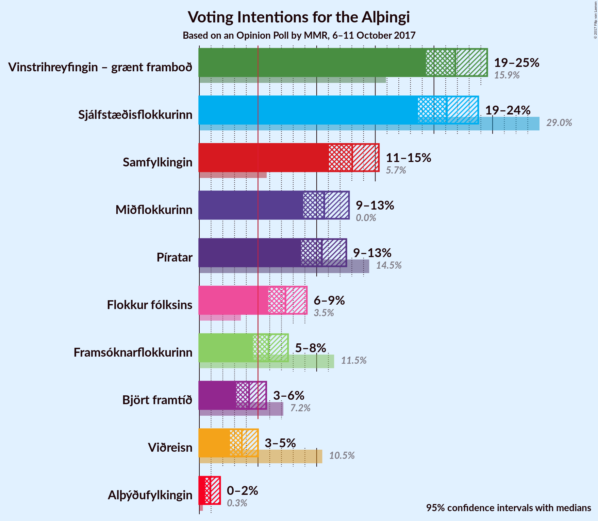
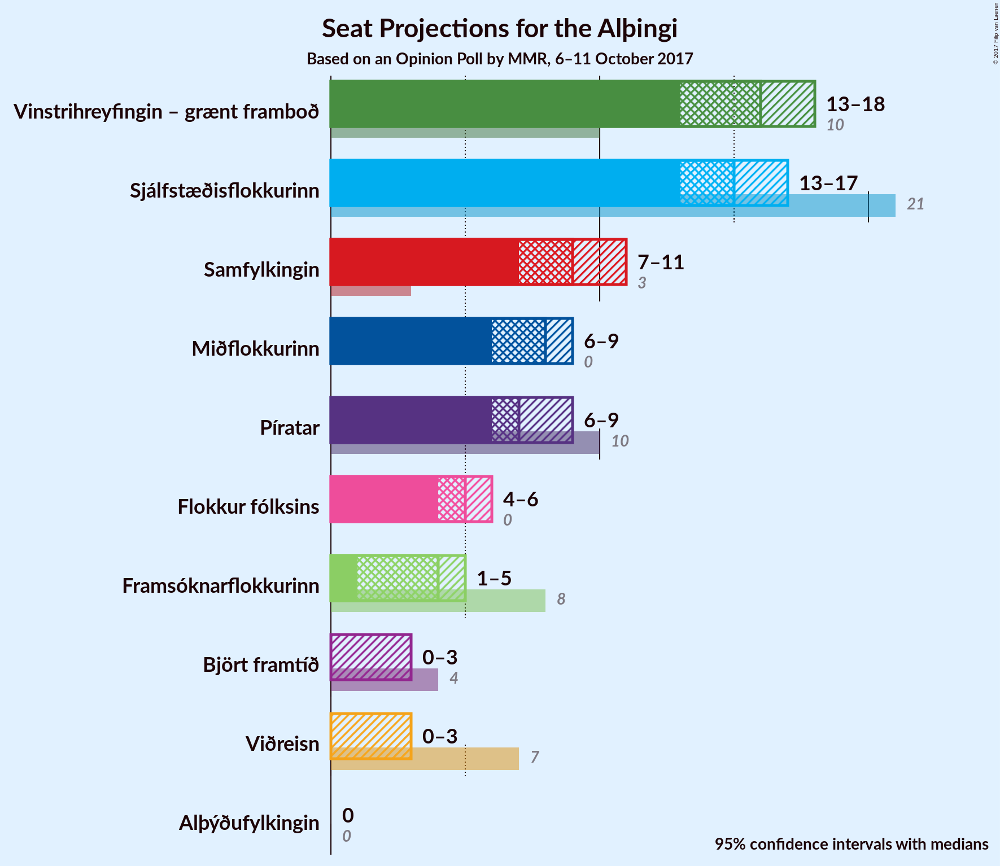
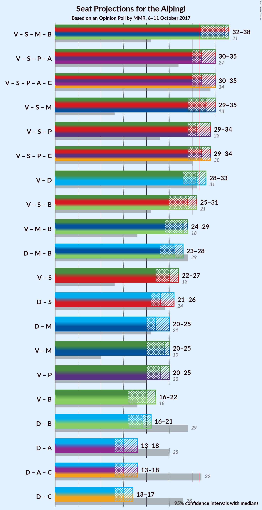

# Opinion Poll by MMR, 6–11 October 2017

<a href="#voting-intentions">Voting Intentions</a> | <a href="#seats">Seats</a> | <a href="#coalitions">Coalitions</a> | <a href="#technical-information">Technical Information</a>

## Voting Intentions

### Confidence Intervals

| Party | Last Result | Poll Result | 80% Confidence Interval | 90% Confidence Interval | 95% Confidence Interval | 99% Confidence Interval |
|:-----:|:-----------:|:-----------:|:-----------------------:|:-----------------------:|:-----------------------:|:-----------------------:|
| Vinstrihreyfingin – grænt framboð | 15.9% | 21.8% | 20.2–23.6% |19.7–24.1% |19.3–24.5% |18.6–25.4% |
| Sjálfstæðisflokkurinn | 29.0% | 21.1% | 19.5–22.8% |19.0–23.3% |18.6–23.8% |17.9–24.6% |
| Samfylkingin | 5.7% | 13.0% | 11.7–14.5% |11.4–14.9% |11.1–15.3% |10.5–16.0% |
| Miðflokkurinn | 0.0% | 10.7% | 9.5–12.0% |9.1–12.4% |8.9–12.8% |8.3–13.4% |
| Píratar | 14.5% | 10.4% | 9.3–11.8% |8.9–12.2% |8.7–12.5% |8.1–13.2% |
| Flokkur fólksins | 3.5% | 7.3% | 6.4–8.5% |6.1–8.9% |5.9–9.2% |5.4–9.8% |
| Framsóknarflokkurinn | 11.5% | 5.9% | 5.0–7.0% |4.8–7.3% |4.6–7.6% |4.2–8.1% |
| Björt framtíð | 7.2% | 4.2% | 3.5–5.2% |3.3–5.5% |3.1–5.7% |2.8–6.2% |
| Viðreisn | 10.5% | 3.6% | 3.0–4.5% |2.8–4.8% |2.6–5.0% |2.3–5.5% |
| Alþýðufylkingin | 0.3% | 0.9% | 0.6–1.5% |0.5–1.6% |0.5–1.8% |0.4–2.1% |

*Note:* The poll result column reflects the actual value used in the calculations. Published results may vary slightly, and in addition be rounded to fewer digits.

## Seats

### Confidence Intervals

| Party | Last Result | Median | 80% Confidence Interval | 90% Confidence Interval | 95% Confidence Interval | 99% Confidence Interval |
|:-----:|:-----------:|:------:|:-----------------------:|:-----------------------:|:-----------------------:|:-----------------------:|
| <a href="#vinstrihreyfingin-–-grænt-framboð">Vinstrihreyfingin – grænt framboð</a> | 10 | 16 | 14–17 |14–17 |13–18 |13–19 |
| <a href="#sjálfstæðisflokkurinn">Sjálfstæðisflokkurinn</a> | 21 | 15 | 14–16 |13–16 |13–17 |12–18 |
| <a href="#samfylkingin">Samfylkingin</a> | 3 | 9 | 8–10 |8–10 |7–11 |7–12 |
| <a href="#miðflokkurinn">Miðflokkurinn</a> | 0 | 7 | 6–8 |6–9 |6–9 |5–9 |
| <a href="#píratar">Píratar</a> | 10 | 7 | 6–8 |6–8 |6–8 |5–9 |
| <a href="#flokkur-fólksins">Flokkur fólksins</a> | 0 | 5 | 4–6 |4–6 |4–6 |3–7 |
| <a href="#framsóknarflokkurinn">Framsóknarflokkurinn</a> | 8 | 4 | 3–5 |2–5 |1–5 |0–5 |
| <a href="#björt-framtíð">Björt framtíð</a> | 4 | 0 | 0–3 |0–3 |0–3 |0–4 |
| <a href="#viðreisn">Viðreisn</a> | 7 | 0 | 0 |0 |0 |0–3 |
| <a href="#alþýðufylkingin">Alþýðufylkingin</a> | 0 | 0 | 0 |0 |0 |0 |

### Vinstrihreyfingin – grænt framboð

*For a full overview of the results for this party, see the [Vinstrihreyfingin – grænt framboð](party-vinstrihreyfingingrntframbo.html) page.*

| Number of Seats | Probability | Accumulated | Special Marks |
|:---------------:|:-----------:|:-----------:|:-------------:|
| 10 | 0% | 100% | Last Result |
| 11 | 0% | 100% |  |
| 12 | 0.2% | 100% |  |
| 13 | 2% | 99.8% |  |
| 14 | 10% | 97% |  |
| 15 | 23% | 87% |  |
| 16 | 51% | 64% | Median |
| 17 | 10% | 13% |  |
| 18 | 3% | 3% |  |
| 19 | 0.5% | 0.6% |  |
| 20 | 0.1% | 0.1% |  |
| 21 | 0% | 0% |  |

### Sjálfstæðisflokkurinn

*For a full overview of the results for this party, see the [Sjálfstæðisflokkurinn](party-sjlfstisflokkurinn.html) page.*

| Number of Seats | Probability | Accumulated | Special Marks |
|:---------------:|:-----------:|:-----------:|:-------------:|
| 12 | 0.6% | 100% |  |
| 13 | 8% | 99.3% |  |
| 14 | 27% | 91% |  |
| 15 | 39% | 64% | Median |
| 16 | 21% | 25% |  |
| 17 | 4% | 5% |  |
| 18 | 0.7% | 0.7% |  |
| 19 | 0% | 0% |  |
| 20 | 0% | 0% |  |
| 21 | 0% | 0% | Last Result |

### Samfylkingin

*For a full overview of the results for this party, see the [Samfylkingin](party-samfylkingin.html) page.*

| Number of Seats | Probability | Accumulated | Special Marks |
|:---------------:|:-----------:|:-----------:|:-------------:|
| 3 | 0% | 100% | Last Result |
| 4 | 0% | 100% |  |
| 5 | 0% | 100% |  |
| 6 | 0.1% | 100% |  |
| 7 | 4% | 99.9% |  |
| 8 | 26% | 96% |  |
| 9 | 44% | 71% | Median |
| 10 | 24% | 27% |  |
| 11 | 3% | 3% |  |
| 12 | 0.5% | 0.5% |  |
| 13 | 0% | 0% |  |

### Miðflokkurinn

*For a full overview of the results for this party, see the [Miðflokkurinn](party-miflokkurinn.html) page.*

| Number of Seats | Probability | Accumulated | Special Marks |
|:---------------:|:-----------:|:-----------:|:-------------:|
| 0 | 0% | 100% | Last Result |
| 1 | 0% | 100% |  |
| 2 | 0% | 100% |  |
| 3 | 0% | 100% |  |
| 4 | 0% | 100% |  |
| 5 | 0.7% | 100% |  |
| 6 | 15% | 99.3% |  |
| 7 | 35% | 84% | Median |
| 8 | 43% | 49% |  |
| 9 | 5% | 6% |  |
| 10 | 0.3% | 0.4% |  |
| 11 | 0.1% | 0.1% |  |
| 12 | 0% | 0% |  |

### Píratar

*For a full overview of the results for this party, see the [Píratar](party-pratar.html) page.*

| Number of Seats | Probability | Accumulated | Special Marks |
|:---------------:|:-----------:|:-----------:|:-------------:|
| 5 | 1.1% | 100% |  |
| 6 | 19% | 98.9% |  |
| 7 | 55% | 80% | Median |
| 8 | 22% | 25% |  |
| 9 | 2% | 2% |  |
| 10 | 0.1% | 0.1% | Last Result |
| 11 | 0% | 0% |  |

### Flokkur fólksins

*For a full overview of the results for this party, see the [Flokkur fólksins](party-flokkurflksins.html) page.*

| Number of Seats | Probability | Accumulated | Special Marks |
|:---------------:|:-----------:|:-----------:|:-------------:|
| 0 | 0.1% | 100% | Last Result |
| 1 | 0% | 99.9% |  |
| 2 | 0% | 99.9% |  |
| 3 | 1.0% | 99.9% |  |
| 4 | 27% | 98.9% |  |
| 5 | 59% | 72% | Median |
| 6 | 13% | 14% |  |
| 7 | 0.6% | 0.6% |  |
| 8 | 0% | 0% |  |

### Framsóknarflokkurinn

*For a full overview of the results for this party, see the [Framsóknarflokkurinn](party-framsknarflokkurinn.html) page.*

| Number of Seats | Probability | Accumulated | Special Marks |
|:---------------:|:-----------:|:-----------:|:-------------:|
| 0 | 1.3% | 100% |  |
| 1 | 1.2% | 98.7% |  |
| 2 | 4% | 97% |  |
| 3 | 27% | 94% |  |
| 4 | 55% | 67% | Median |
| 5 | 11% | 12% |  |
| 6 | 0.2% | 0.2% |  |
| 7 | 0% | 0% |  |
| 8 | 0% | 0% | Last Result |

### Björt framtíð

*For a full overview of the results for this party, see the [Björt framtíð](party-bjrtframt.html) page.*

| Number of Seats | Probability | Accumulated | Special Marks |
|:---------------:|:-----------:|:-----------:|:-------------:|
| 0 | 77% | 100% | Median |
| 1 | 11% | 23% |  |
| 2 | 0% | 12% |  |
| 3 | 10% | 12% |  |
| 4 | 2% | 2% | Last Result |
| 5 | 0% | 0% |  |

### Viðreisn

*For a full overview of the results for this party, see the [Viðreisn](party-vireisn.html) page.*

| Number of Seats | Probability | Accumulated | Special Marks |
|:---------------:|:-----------:|:-----------:|:-------------:|
| 0 | 98% | 100% | Median |
| 1 | 0.3% | 2% |  |
| 2 | 0% | 2% |  |
| 3 | 2% | 2% |  |
| 4 | 0.2% | 0.2% |  |
| 5 | 0% | 0% |  |
| 6 | 0% | 0% |  |
| 7 | 0% | 0% | Last Result |

### Alþýðufylkingin

*For a full overview of the results for this party, see the [Alþýðufylkingin](party-alufylkingin.html) page.*

| Number of Seats | Probability | Accumulated | Special Marks |
|:---------------:|:-----------:|:-----------:|:-------------:|
| 0 | 100% | 100% | Last Result, Median |

## Coalitions

### Confidence Intervals

| Coalition | Last Result | Median | Majority? | 80% Confidence Interval | 90% Confidence Interval | 95% Confidence Interval | 99% Confidence Interval |
|:---------:|:-----------:|:------:|:---------:|:-----------------------:|:-----------------------:|:-----------------------:|:-----------------------:|
| Vinstrihreyfingin – grænt framboð – Samfylkingin – Miðflokkurinn – Framsóknarflokkurinn | 21 | 36 | 99.8% | 34–37 | 33–38 | 33–38 | 32–39 |
| Vinstrihreyfingin – grænt framboð – Samfylkingin – Píratar – Björt framtíð | 27 | 32 | 70% | 31–34 | 30–34 | 30–35 | 29–36 |
| Vinstrihreyfingin – grænt framboð – Samfylkingin – Píratar – Björt framtíð – Viðreisn | 34 | 32 | 71% | 31–34 | 30–35 | 30–35 | 29–36 |
| Vinstrihreyfingin – grænt framboð – Samfylkingin – Miðflokkurinn | 13 | 32 | 71% | 30–34 | 30–34 | 29–34 | 28–35 |
| Vinstrihreyfingin – grænt framboð – Samfylkingin – Píratar | 23 | 32 | 59% | 30–33 | 30–34 | 29–34 | 28–35 |
| Vinstrihreyfingin – grænt framboð – Samfylkingin – Píratar – Viðreisn | 30 | 32 | 60% | 30–33 | 30–34 | 29–34 | 28–35 |
| Vinstrihreyfingin – grænt framboð – Sjálfstæðisflokkurinn | 31 | 31 | 22% | 29–32 | 28–32 | 28–33 | 27–34 |
| Vinstrihreyfingin – grænt framboð – Samfylkingin – Framsóknarflokkurinn | 21 | 28 | 0.5% | 27–30 | 26–30 | 26–31 | 25–32 |
| Vinstrihreyfingin – grænt framboð – Miðflokkurinn – Framsóknarflokkurinn | 18 | 27 | 0% | 25–28 | 24–29 | 24–29 | 23–30 |
| Sjálfstæðisflokkurinn – Miðflokkurinn – Framsóknarflokkurinn | 29 | 26 | 0% | 24–27 | 24–28 | 23–28 | 22–29 |
| Vinstrihreyfingin – grænt framboð – Samfylkingin | 13 | 25 | 0% | 23–26 | 23–26 | 22–27 | 21–28 |
| Sjálfstæðisflokkurinn – Samfylkingin | 24 | 24 | 0% | 22–25 | 22–26 | 21–26 | 21–27 |
| Sjálfstæðisflokkurinn – Miðflokkurinn | 21 | 22 | 0% | 21–24 | 20–24 | 20–25 | 19–25 |
| Vinstrihreyfingin – grænt framboð – Miðflokkurinn | 10 | 23 | 0% | 22–24 | 21–25 | 20–25 | 20–26 |
| Vinstrihreyfingin – grænt framboð – Píratar | 20 | 23 | 0% | 21–24 | 21–25 | 20–25 | 19–26 |
| Vinstrihreyfingin – grænt framboð – Framsóknarflokkurinn | 18 | 19 | 0% | 18–21 | 17–21 | 17–22 | 16–23 |
| Sjálfstæðisflokkurinn – Framsóknarflokkurinn | 29 | 19 | 0% | 17–20 | 17–20 | 16–21 | 15–22 |
| Sjálfstæðisflokkurinn – Björt framtíð | 25 | 15 | 0% | 14–17 | 14–18 | 13–18 | 13–19 |
| Sjálfstæðisflokkurinn – Björt framtíð – Viðreisn | 32 | 15 | 0% | 14–17 | 14–18 | 13–18 | 13–19 |
| Sjálfstæðisflokkurinn – Viðreisn | 28 | 15 | 0% | 14–16 | 13–17 | 13–17 | 12–18 |

### Vinstrihreyfingin – grænt framboð – Samfylkingin – Miðflokkurinn – Framsóknarflokkurinn

| Number of Seats | Probability | Accumulated | Special Marks |
|:---------------:|:-----------:|:-----------:|:-------------:|
| 21 | 0% | 100% | Last Result |
| 22 | 0% | 100% |  |
| 23 | 0% | 100% |  |
| 24 | 0% | 100% |  |
| 25 | 0% | 100% |  |
| 26 | 0% | 100% |  |
| 27 | 0% | 100% |  |
| 28 | 0% | 100% |  |
| 29 | 0% | 100% |  |
| 30 | 0% | 100% |  |
| 31 | 0.2% | 100% |  |
| 32 | 1.2% | 99.8% | Majority |
| 33 | 4% | 98.6% |  |
| 34 | 11% | 94% |  |
| 35 | 25% | 84% |  |
| 36 | 33% | 59% | Median |
| 37 | 18% | 25% |  |
| 38 | 6% | 7% |  |
| 39 | 1.4% | 1.4% |  |
| 40 | 0.1% | 0.1% |  |
| 41 | 0% | 0% |  |

### Vinstrihreyfingin – grænt framboð – Samfylkingin – Píratar – Björt framtíð

| Number of Seats | Probability | Accumulated | Special Marks |
|:---------------:|:-----------:|:-----------:|:-------------:|
| 27 | 0% | 100% | Last Result |
| 28 | 0.1% | 100% |  |
| 29 | 1.3% | 99.8% |  |
| 30 | 7% | 98.5% |  |
| 31 | 21% | 91% |  |
| 32 | 34% | 70% | Median, Majority |
| 33 | 23% | 36% |  |
| 34 | 9% | 14% |  |
| 35 | 3% | 4% |  |
| 36 | 0.8% | 1.0% |  |
| 37 | 0.2% | 0.2% |  |
| 38 | 0% | 0% |  |

### Vinstrihreyfingin – grænt framboð – Samfylkingin – Píratar – Björt framtíð – Viðreisn

| Number of Seats | Probability | Accumulated | Special Marks |
|:---------------:|:-----------:|:-----------:|:-------------:|
| 28 | 0.1% | 100% |  |
| 29 | 1.2% | 99.9% |  |
| 30 | 7% | 98.7% |  |
| 31 | 21% | 92% |  |
| 32 | 34% | 71% | Median, Majority |
| 33 | 23% | 38% |  |
| 34 | 10% | 15% | Last Result |
| 35 | 4% | 5% |  |
| 36 | 1.0% | 1.3% |  |
| 37 | 0.3% | 0.3% |  |
| 38 | 0% | 0% |  |

### Vinstrihreyfingin – grænt framboð – Samfylkingin – Miðflokkurinn

| Number of Seats | Probability | Accumulated | Special Marks |
|:---------------:|:-----------:|:-----------:|:-------------:|
| 13 | 0% | 100% | Last Result |
| 14 | 0% | 100% |  |
| 15 | 0% | 100% |  |
| 16 | 0% | 100% |  |
| 17 | 0% | 100% |  |
| 18 | 0% | 100% |  |
| 19 | 0% | 100% |  |
| 20 | 0% | 100% |  |
| 21 | 0% | 100% |  |
| 22 | 0% | 100% |  |
| 23 | 0% | 100% |  |
| 24 | 0% | 100% |  |
| 25 | 0% | 100% |  |
| 26 | 0% | 100% |  |
| 27 | 0.1% | 100% |  |
| 28 | 0.7% | 99.9% |  |
| 29 | 2% | 99.2% |  |
| 30 | 8% | 97% |  |
| 31 | 18% | 89% |  |
| 32 | 39% | 71% | Median, Majority |
| 33 | 22% | 32% |  |
| 34 | 8% | 11% |  |
| 35 | 2% | 2% |  |
| 36 | 0.2% | 0.2% |  |
| 37 | 0% | 0% |  |

### Vinstrihreyfingin – grænt framboð – Samfylkingin – Píratar

| Number of Seats | Probability | Accumulated | Special Marks |
|:---------------:|:-----------:|:-----------:|:-------------:|
| 23 | 0% | 100% | Last Result |
| 24 | 0% | 100% |  |
| 25 | 0% | 100% |  |
| 26 | 0% | 100% |  |
| 27 | 0.1% | 100% |  |
| 28 | 1.2% | 99.9% |  |
| 29 | 3% | 98.7% |  |
| 30 | 13% | 96% |  |
| 31 | 24% | 83% |  |
| 32 | 35% | 59% | Median, Majority |
| 33 | 17% | 23% |  |
| 34 | 5% | 7% |  |
| 35 | 1.0% | 1.2% |  |
| 36 | 0.2% | 0.2% |  |
| 37 | 0% | 0% |  |

### Vinstrihreyfingin – grænt framboð – Samfylkingin – Píratar – Viðreisn

| Number of Seats | Probability | Accumulated | Special Marks |
|:---------------:|:-----------:|:-----------:|:-------------:|
| 27 | 0.1% | 100% |  |
| 28 | 1.1% | 99.9% |  |
| 29 | 3% | 98.9% |  |
| 30 | 12% | 96% | Last Result |
| 31 | 24% | 84% |  |
| 32 | 35% | 60% | Median, Majority |
| 33 | 17% | 25% |  |
| 34 | 6% | 8% |  |
| 35 | 1.4% | 2% |  |
| 36 | 0.3% | 0.4% |  |
| 37 | 0.1% | 0.1% |  |
| 38 | 0% | 0% |  |

### Vinstrihreyfingin – grænt framboð – Sjálfstæðisflokkurinn

| Number of Seats | Probability | Accumulated | Special Marks |
|:---------------:|:-----------:|:-----------:|:-------------:|
| 26 | 0.2% | 100% |  |
| 27 | 2% | 99.8% |  |
| 28 | 5% | 98% |  |
| 29 | 15% | 93% |  |
| 30 | 22% | 78% |  |
| 31 | 35% | 56% | Last Result, Median |
| 32 | 18% | 22% | Majority |
| 33 | 3% | 3% |  |
| 34 | 0.6% | 0.6% |  |
| 35 | 0.1% | 0.1% |  |
| 36 | 0% | 0% |  |

### Vinstrihreyfingin – grænt framboð – Samfylkingin – Framsóknarflokkurinn

| Number of Seats | Probability | Accumulated | Special Marks |
|:---------------:|:-----------:|:-----------:|:-------------:|
| 21 | 0% | 100% | Last Result |
| 22 | 0% | 100% |  |
| 23 | 0% | 100% |  |
| 24 | 0.3% | 100% |  |
| 25 | 2% | 99.6% |  |
| 26 | 7% | 98% |  |
| 27 | 16% | 91% |  |
| 28 | 28% | 75% |  |
| 29 | 33% | 47% | Median |
| 30 | 10% | 14% |  |
| 31 | 4% | 5% |  |
| 32 | 0.4% | 0.5% | Majority |
| 33 | 0.1% | 0.1% |  |
| 34 | 0% | 0% |  |

### Vinstrihreyfingin – grænt framboð – Miðflokkurinn – Framsóknarflokkurinn

| Number of Seats | Probability | Accumulated | Special Marks |
|:---------------:|:-----------:|:-----------:|:-------------:|
| 18 | 0% | 100% | Last Result |
| 19 | 0% | 100% |  |
| 20 | 0% | 100% |  |
| 21 | 0% | 100% |  |
| 22 | 0.2% | 100% |  |
| 23 | 0.9% | 99.8% |  |
| 24 | 5% | 98.8% |  |
| 25 | 9% | 94% |  |
| 26 | 29% | 85% |  |
| 27 | 25% | 55% | Median |
| 28 | 21% | 30% |  |
| 29 | 7% | 9% |  |
| 30 | 1.2% | 1.3% |  |
| 31 | 0.1% | 0.1% |  |
| 32 | 0% | 0% | Majority |

### Sjálfstæðisflokkurinn – Miðflokkurinn – Framsóknarflokkurinn

| Number of Seats | Probability | Accumulated | Special Marks |
|:---------------:|:-----------:|:-----------:|:-------------:|
| 21 | 0.1% | 100% |  |
| 22 | 0.8% | 99.8% |  |
| 23 | 3% | 99.1% |  |
| 24 | 9% | 96% |  |
| 25 | 21% | 88% |  |
| 26 | 35% | 67% | Median |
| 27 | 22% | 32% |  |
| 28 | 8% | 9% |  |
| 29 | 2% | 2% | Last Result |
| 30 | 0.2% | 0.2% |  |
| 31 | 0% | 0% |  |

### Vinstrihreyfingin – grænt framboð – Samfylkingin

| Number of Seats | Probability | Accumulated | Special Marks |
|:---------------:|:-----------:|:-----------:|:-------------:|
| 13 | 0% | 100% | Last Result |
| 14 | 0% | 100% |  |
| 15 | 0% | 100% |  |
| 16 | 0% | 100% |  |
| 17 | 0% | 100% |  |
| 18 | 0% | 100% |  |
| 19 | 0% | 100% |  |
| 20 | 0.1% | 100% |  |
| 21 | 0.7% | 99.9% |  |
| 22 | 4% | 99.2% |  |
| 23 | 11% | 95% |  |
| 24 | 27% | 84% |  |
| 25 | 34% | 56% | Median |
| 26 | 18% | 22% |  |
| 27 | 4% | 5% |  |
| 28 | 0.6% | 0.7% |  |
| 29 | 0.1% | 0.1% |  |
| 30 | 0% | 0% |  |

### Sjálfstæðisflokkurinn – Samfylkingin

| Number of Seats | Probability | Accumulated | Special Marks |
|:---------------:|:-----------:|:-----------:|:-------------:|
| 20 | 0.3% | 100% |  |
| 21 | 4% | 99.7% |  |
| 22 | 12% | 96% |  |
| 23 | 24% | 84% |  |
| 24 | 27% | 60% | Last Result, Median |
| 25 | 24% | 33% |  |
| 26 | 6% | 8% |  |
| 27 | 2% | 2% |  |
| 28 | 0.2% | 0.3% |  |
| 29 | 0% | 0% |  |

### Sjálfstæðisflokkurinn – Miðflokkurinn

| Number of Seats | Probability | Accumulated | Special Marks |
|:---------------:|:-----------:|:-----------:|:-------------:|
| 18 | 0.1% | 100% |  |
| 19 | 1.3% | 99.9% |  |
| 20 | 6% | 98.6% |  |
| 21 | 16% | 92% | Last Result |
| 22 | 34% | 76% | Median |
| 23 | 31% | 42% |  |
| 24 | 9% | 12% |  |
| 25 | 2% | 3% |  |
| 26 | 0.2% | 0.3% |  |
| 27 | 0% | 0% |  |

### Vinstrihreyfingin – grænt framboð – Miðflokkurinn

| Number of Seats | Probability | Accumulated | Special Marks |
|:---------------:|:-----------:|:-----------:|:-------------:|
| 10 | 0% | 100% | Last Result |
| 11 | 0% | 100% |  |
| 12 | 0% | 100% |  |
| 13 | 0% | 100% |  |
| 14 | 0% | 100% |  |
| 15 | 0% | 100% |  |
| 16 | 0% | 100% |  |
| 17 | 0% | 100% |  |
| 18 | 0% | 100% |  |
| 19 | 0.4% | 100% |  |
| 20 | 3% | 99.6% |  |
| 21 | 7% | 97% |  |
| 22 | 18% | 90% |  |
| 23 | 37% | 72% | Median |
| 24 | 25% | 34% |  |
| 25 | 8% | 9% |  |
| 26 | 2% | 2% |  |
| 27 | 0.1% | 0.1% |  |
| 28 | 0% | 0% |  |

### Vinstrihreyfingin – grænt framboð – Píratar

| Number of Seats | Probability | Accumulated | Special Marks |
|:---------------:|:-----------:|:-----------:|:-------------:|
| 18 | 0.1% | 100% |  |
| 19 | 0.5% | 99.9% |  |
| 20 | 3% | 99.4% | Last Result |
| 21 | 9% | 97% |  |
| 22 | 25% | 87% |  |
| 23 | 45% | 63% | Median |
| 24 | 11% | 18% |  |
| 25 | 5% | 6% |  |
| 26 | 0.8% | 0.9% |  |
| 27 | 0.1% | 0.1% |  |
| 28 | 0% | 0% |  |

### Vinstrihreyfingin – grænt framboð – Framsóknarflokkurinn

| Number of Seats | Probability | Accumulated | Special Marks |
|:---------------:|:-----------:|:-----------:|:-------------:|
| 15 | 0.3% | 100% |  |
| 16 | 2% | 99.6% |  |
| 17 | 5% | 98% |  |
| 18 | 14% | 93% | Last Result |
| 19 | 32% | 78% |  |
| 20 | 31% | 46% | Median |
| 21 | 12% | 15% |  |
| 22 | 2% | 3% |  |
| 23 | 0.6% | 0.6% |  |
| 24 | 0.1% | 0.1% |  |
| 25 | 0% | 0% |  |

### Sjálfstæðisflokkurinn – Framsóknarflokkurinn

| Number of Seats | Probability | Accumulated | Special Marks |
|:---------------:|:-----------:|:-----------:|:-------------:|
| 14 | 0.2% | 100% |  |
| 15 | 1.2% | 99.8% |  |
| 16 | 4% | 98.5% |  |
| 17 | 12% | 95% |  |
| 18 | 29% | 83% |  |
| 19 | 36% | 55% | Median |
| 20 | 15% | 19% |  |
| 21 | 3% | 3% |  |
| 22 | 0.6% | 0.7% |  |
| 23 | 0.1% | 0.1% |  |
| 24 | 0% | 0% |  |
| 25 | 0% | 0% |  |
| 26 | 0% | 0% |  |
| 27 | 0% | 0% |  |
| 28 | 0% | 0% |  |
| 29 | 0% | 0% | Last Result |

### Sjálfstæðisflokkurinn – Björt framtíð

| Number of Seats | Probability | Accumulated | Special Marks |
|:---------------:|:-----------:|:-----------:|:-------------:|
| 12 | 0.3% | 100% |  |
| 13 | 5% | 99.7% |  |
| 14 | 19% | 95% |  |
| 15 | 36% | 76% | Median |
| 16 | 25% | 41% |  |
| 17 | 10% | 15% |  |
| 18 | 4% | 5% |  |
| 19 | 0.8% | 1.0% |  |
| 20 | 0.2% | 0.3% |  |
| 21 | 0.1% | 0.1% |  |
| 22 | 0% | 0% |  |
| 23 | 0% | 0% |  |
| 24 | 0% | 0% |  |
| 25 | 0% | 0% | Last Result |

### Sjálfstæðisflokkurinn – Björt framtíð – Viðreisn

| Number of Seats | Probability | Accumulated | Special Marks |
|:---------------:|:-----------:|:-----------:|:-------------:|
| 12 | 0.2% | 100% |  |
| 13 | 4% | 99.8% |  |
| 14 | 18% | 96% |  |
| 15 | 35% | 77% | Median |
| 16 | 25% | 42% |  |
| 17 | 10% | 17% |  |
| 18 | 5% | 6% |  |
| 19 | 1.0% | 1.4% |  |
| 20 | 0.3% | 0.4% |  |
| 21 | 0.1% | 0.1% |  |
| 22 | 0% | 0% |  |
| 23 | 0% | 0% |  |
| 24 | 0% | 0% |  |
| 25 | 0% | 0% |  |
| 26 | 0% | 0% |  |
| 27 | 0% | 0% |  |
| 28 | 0% | 0% |  |
| 29 | 0% | 0% |  |
| 30 | 0% | 0% |  |
| 31 | 0% | 0% |  |
| 32 | 0% | 0% | Last Result, Majority |

### Sjálfstæðisflokkurinn – Viðreisn

| Number of Seats | Probability | Accumulated | Special Marks |
|:---------------:|:-----------:|:-----------:|:-------------:|
| 12 | 0.6% | 100% |  |
| 13 | 7% | 99.4% |  |
| 14 | 26% | 92% |  |
| 15 | 39% | 66% | Median |
| 16 | 21% | 27% |  |
| 17 | 5% | 6% |  |
| 18 | 1.0% | 1.2% |  |
| 19 | 0.1% | 0.2% |  |
| 20 | 0% | 0% |  |
| 21 | 0% | 0% |  |
| 22 | 0% | 0% |  |
| 23 | 0% | 0% |  |
| 24 | 0% | 0% |  |
| 25 | 0% | 0% |  |
| 26 | 0% | 0% |  |
| 27 | 0% | 0% |  |
| 28 | 0% | 0% | Last Result |

## Technical Information

### Opinion Poll

+ **Polling firm:** MMR
+ **Commissioner(s):** —
+ **Fieldwork period:** 6–11 October 2017

### Calculations

+ **Sample size:** 967
+ **Simulations done:** 8,388,608
+ **Error estimate:** 1.28%

