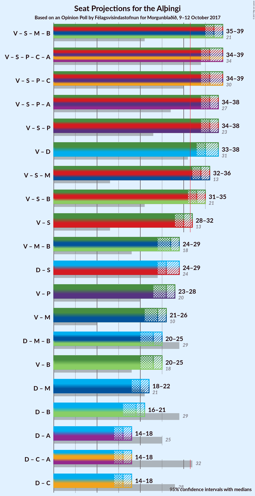

# Opinion Poll by Félagsvísindastofnun for Morgunblaðið, 9–12 October 2017

<a href="#voting-intentions">Voting Intentions</a> | <a href="#seats">Seats</a> | <a href="#coalitions">Coalitions</a> | <a href="#technical-information">Technical Information</a>

## Voting Intentions

### Confidence Intervals

| Party | Last Result | Poll Result | 80% Confidence Interval | 90% Confidence Interval | 95% Confidence Interval | 99% Confidence Interval |
|:-----:|:-----------:|:-----------:|:-----------------------:|:-----------------------:|:-----------------------:|:-----------------------:|
| Vinstrihreyfingin – grænt framboð | 15.9% | 27.4% | 25.8–29.1% |25.4–29.5% |25.0–29.9% |24.3–30.7% |
| Sjálfstæðisflokkurinn | 29.0% | 22.6% | 21.1–24.2% |20.7–24.6% |20.4–25.0% |19.7–25.8% |
| Samfylkingin | 5.7% | 15.3% | 14.0–16.6% |13.7–17.0% |13.4–17.4% |12.8–18.0% |
| Píratar | 14.5% | 9.2% | 8.2–10.3% |7.9–10.6% |7.7–10.9% |7.3–11.5% |
| Flokkur fólksins | 3.5% | 6.5% | 5.7–7.5% |5.4–7.7% |5.2–8.0% |4.9–8.5% |
| Miðflokkurinn | 0.0% | 6.4% | 5.6–7.4% |5.4–7.6% |5.2–7.9% |4.8–8.4% |
| Framsóknarflokkurinn | 11.5% | 5.5% | 4.8–6.4% |4.6–6.7% |4.4–6.9% |4.0–7.4% |
| Viðreisn | 10.5% | 3.4% | 2.9–4.2% |2.7–4.4% |2.6–4.6% |2.3–5.0% |
| Björt framtíð | 7.2% | 2.6% | 2.1–3.3% |2.0–3.5% |1.9–3.7% |1.7–4.0% |

*Note:* The poll result column reflects the actual value used in the calculations. Published results may vary slightly, and in addition be rounded to fewer digits.

## Seats

### Confidence Intervals

| Party | Last Result | Median | 80% Confidence Interval | 90% Confidence Interval | 95% Confidence Interval | 99% Confidence Interval |
|:-----:|:-----------:|:------:|:-----------------------:|:-----------------------:|:-----------------------:|:-----------------------:|
| <a href="#vinstrihreyfingin-–-grænt-framboð">Vinstrihreyfingin – grænt framboð</a> | 10 | 20 | 18–21 |18–22 |17–22 |17–22 |
| <a href="#sjálfstæðisflokkurinn">Sjálfstæðisflokkurinn</a> | 21 | 16 | 15–17 |14–17 |14–18 |13–18 |
| <a href="#samfylkingin">Samfylkingin</a> | 3 | 10 | 9–12 |9–12 |9–12 |8–13 |
| <a href="#píratar">Píratar</a> | 10 | 6 | 5–7 |5–7 |5–7 |5–8 |
| <a href="#flokkur-fólksins">Flokkur fólksins</a> | 0 | 4 | 3–5 |3–5 |3–5 |0–6 |
| <a href="#miðflokkurinn">Miðflokkurinn</a> | 0 | 4 | 3–5 |3–5 |3–5 |2–5 |
| <a href="#framsóknarflokkurinn">Framsóknarflokkurinn</a> | 8 | 3 | 2–4 |1–4 |1–4 |0–5 |
| <a href="#viðreisn">Viðreisn</a> | 7 | 0 | 0 |0 |0 |0 |
| <a href="#björt-framtíð">Björt framtíð</a> | 4 | 0 | 0 |0 |0 |0 |

### Vinstrihreyfingin – grænt framboð

*For a full overview of the results for this party, see the [Vinstrihreyfingin – grænt framboð](party-vinstrihreyfingingrntframbo.html) page.*

| Number of Seats | Probability | Accumulated | Special Marks |
|:---------------:|:-----------:|:-----------:|:-------------:|
| 10 | 0% | 100% | Last Result |
| 11 | 0% | 100% |  |
| 12 | 0% | 100% |  |
| 13 | 0% | 100% |  |
| 14 | 0% | 100% |  |
| 15 | 0% | 100% |  |
| 16 | 0.2% | 100% |  |
| 17 | 4% | 99.8% |  |
| 18 | 16% | 95% |  |
| 19 | 20% | 79% |  |
| 20 | 35% | 59% | Median |
| 21 | 18% | 24% |  |
| 22 | 6% | 6% |  |
| 23 | 0.1% | 0.1% |  |
| 24 | 0% | 0% |  |

### Sjálfstæðisflokkurinn

*For a full overview of the results for this party, see the [Sjálfstæðisflokkurinn](party-sjlfstisflokkurinn.html) page.*

| Number of Seats | Probability | Accumulated | Special Marks |
|:---------------:|:-----------:|:-----------:|:-------------:|
| 13 | 0.6% | 100% |  |
| 14 | 8% | 99.4% |  |
| 15 | 41% | 91% |  |
| 16 | 36% | 50% | Median |
| 17 | 11% | 14% |  |
| 18 | 2% | 3% |  |
| 19 | 0.2% | 0.2% |  |
| 20 | 0% | 0% |  |
| 21 | 0% | 0% | Last Result |

### Samfylkingin

*For a full overview of the results for this party, see the [Samfylkingin](party-samfylkingin.html) page.*

| Number of Seats | Probability | Accumulated | Special Marks |
|:---------------:|:-----------:|:-----------:|:-------------:|
| 3 | 0% | 100% | Last Result |
| 4 | 0% | 100% |  |
| 5 | 0% | 100% |  |
| 6 | 0% | 100% |  |
| 7 | 0% | 100% |  |
| 8 | 0.6% | 100% |  |
| 9 | 14% | 99.4% |  |
| 10 | 49% | 85% | Median |
| 11 | 19% | 36% |  |
| 12 | 16% | 17% |  |
| 13 | 0.5% | 0.5% |  |
| 14 | 0% | 0% |  |

### Píratar

*For a full overview of the results for this party, see the [Píratar](party-pratar.html) page.*

| Number of Seats | Probability | Accumulated | Special Marks |
|:---------------:|:-----------:|:-----------:|:-------------:|
| 4 | 0.2% | 100% |  |
| 5 | 17% | 99.8% |  |
| 6 | 61% | 83% | Median |
| 7 | 21% | 22% |  |
| 8 | 1.2% | 1.2% |  |
| 9 | 0% | 0% |  |
| 10 | 0% | 0% | Last Result |

### Flokkur fólksins

*For a full overview of the results for this party, see the [Flokkur fólksins](party-flokkurflksins.html) page.*

| Number of Seats | Probability | Accumulated | Special Marks |
|:---------------:|:-----------:|:-----------:|:-------------:|
| 0 | 0.9% | 100% | Last Result |
| 1 | 0% | 99.1% |  |
| 2 | 0% | 99.1% |  |
| 3 | 9% | 99.1% |  |
| 4 | 65% | 90% | Median |
| 5 | 24% | 24% |  |
| 6 | 0.7% | 0.7% |  |
| 7 | 0% | 0% |  |

### Miðflokkurinn

*For a full overview of the results for this party, see the [Miðflokkurinn](party-miflokkurinn.html) page.*

| Number of Seats | Probability | Accumulated | Special Marks |
|:---------------:|:-----------:|:-----------:|:-------------:|
| 0 | 0.1% | 100% | Last Result |
| 1 | 0.3% | 99.9% |  |
| 2 | 0.7% | 99.6% |  |
| 3 | 12% | 98.9% |  |
| 4 | 69% | 87% | Median |
| 5 | 18% | 18% |  |
| 6 | 0.3% | 0.3% |  |
| 7 | 0% | 0% |  |

### Framsóknarflokkurinn

*For a full overview of the results for this party, see the [Framsóknarflokkurinn](party-framsknarflokkurinn.html) page.*

| Number of Seats | Probability | Accumulated | Special Marks |
|:---------------:|:-----------:|:-----------:|:-------------:|
| 0 | 2% | 100% |  |
| 1 | 7% | 98% |  |
| 2 | 6% | 91% |  |
| 3 | 42% | 85% | Median |
| 4 | 41% | 42% |  |
| 5 | 1.4% | 1.4% |  |
| 6 | 0% | 0% |  |
| 7 | 0% | 0% |  |
| 8 | 0% | 0% | Last Result |

### Viðreisn

*For a full overview of the results for this party, see the [Viðreisn](party-vireisn.html) page.*

| Number of Seats | Probability | Accumulated | Special Marks |
|:---------------:|:-----------:|:-----------:|:-------------:|
| 0 | 99.6% | 100% | Median |
| 1 | 0% | 0.4% |  |
| 2 | 0% | 0.4% |  |
| 3 | 0.4% | 0.4% |  |
| 4 | 0% | 0% |  |
| 5 | 0% | 0% |  |
| 6 | 0% | 0% |  |
| 7 | 0% | 0% | Last Result |

### Björt framtíð

*For a full overview of the results for this party, see the [Björt framtíð](party-bjrtframt.html) page.*

| Number of Seats | Probability | Accumulated | Special Marks |
|:---------------:|:-----------:|:-----------:|:-------------:|
| 0 | 100% | 100% | Median |
| 1 | 0% | 0% |  |
| 2 | 0% | 0% |  |
| 3 | 0% | 0% |  |
| 4 | 0% | 0% | Last Result |

## Coalitions

### Confidence Intervals

| Coalition | Last Result | Median | Majority? | 80% Confidence Interval | 90% Confidence Interval | 95% Confidence Interval | 99% Confidence Interval |
|:---------:|:-----------:|:------:|:---------:|:-----------------------:|:-----------------------:|:-----------------------:|:-----------------------:|
| Vinstrihreyfingin – grænt framboð – Samfylkingin – Miðflokkurinn – Framsóknarflokkurinn | 21 | 37 | 100% | 36–39 | 35–39 | 35–39 | 34–40 |
| Vinstrihreyfingin – grænt framboð – Samfylkingin – Píratar – Viðreisn – Björt framtíð | 34 | 36 | 100% | 34–38 | 34–38 | 34–39 | 33–39 |
| Vinstrihreyfingin – grænt framboð – Samfylkingin – Píratar – Viðreisn | 30 | 36 | 100% | 34–38 | 34–38 | 34–39 | 33–39 |
| Vinstrihreyfingin – grænt framboð – Samfylkingin – Píratar – Björt framtíð | 27 | 36 | 100% | 34–38 | 34–38 | 34–38 | 33–39 |
| Vinstrihreyfingin – grænt framboð – Samfylkingin – Píratar | 23 | 36 | 100% | 34–38 | 34–38 | 34–38 | 33–39 |
| Vinstrihreyfingin – grænt framboð – Sjálfstæðisflokkurinn | 31 | 35 | 99.9% | 33–37 | 33–37 | 33–38 | 32–39 |
| Vinstrihreyfingin – grænt framboð – Samfylkingin – Miðflokkurinn | 13 | 34 | 98% | 33–36 | 32–36 | 32–36 | 31–37 |
| Vinstrihreyfingin – grænt framboð – Samfylkingin – Framsóknarflokkurinn | 21 | 33 | 91% | 32–34 | 31–35 | 31–35 | 30–36 |
| Vinstrihreyfingin – grænt framboð – Samfylkingin | 13 | 30 | 9% | 29–31 | 28–32 | 28–32 | 27–33 |
| Vinstrihreyfingin – grænt framboð – Miðflokkurinn – Framsóknarflokkurinn | 18 | 27 | 0% | 25–28 | 24–29 | 24–29 | 23–30 |
| Sjálfstæðisflokkurinn – Samfylkingin | 24 | 26 | 0% | 25–28 | 24–28 | 24–29 | 23–29 |
| Vinstrihreyfingin – grænt framboð – Píratar | 20 | 26 | 0% | 24–27 | 24–28 | 23–28 | 23–29 |
| Vinstrihreyfingin – grænt framboð – Miðflokkurinn | 10 | 24 | 0% | 22–25 | 21–26 | 21–26 | 21–27 |
| Sjálfstæðisflokkurinn – Miðflokkurinn – Framsóknarflokkurinn | 29 | 23 | 0% | 21–24 | 21–25 | 20–25 | 20–26 |
| Vinstrihreyfingin – grænt framboð – Framsóknarflokkurinn | 18 | 23 | 0% | 21–24 | 20–25 | 20–25 | 19–26 |
| Sjálfstæðisflokkurinn – Miðflokkurinn | 21 | 20 | 0% | 19–21 | 18–21 | 18–22 | 17–23 |
| Sjálfstæðisflokkurinn – Framsóknarflokkurinn | 29 | 19 | 0% | 17–20 | 17–20 | 16–21 | 15–22 |
| Sjálfstæðisflokkurinn – Björt framtíð | 25 | 16 | 0% | 15–17 | 14–17 | 14–18 | 13–18 |
| Sjálfstæðisflokkurinn – Viðreisn – Björt framtíð | 32 | 16 | 0% | 15–17 | 14–17 | 14–18 | 13–18 |
| Sjálfstæðisflokkurinn – Viðreisn | 28 | 16 | 0% | 15–17 | 14–17 | 14–18 | 13–18 |

### Vinstrihreyfingin – grænt framboð – Samfylkingin – Miðflokkurinn – Framsóknarflokkurinn

| Number of Seats | Probability | Accumulated | Special Marks |
|:---------------:|:-----------:|:-----------:|:-------------:|
| 21 | 0% | 100% | Last Result |
| 22 | 0% | 100% |  |
| 23 | 0% | 100% |  |
| 24 | 0% | 100% |  |
| 25 | 0% | 100% |  |
| 26 | 0% | 100% |  |
| 27 | 0% | 100% |  |
| 28 | 0% | 100% |  |
| 29 | 0% | 100% |  |
| 30 | 0% | 100% |  |
| 31 | 0% | 100% |  |
| 32 | 0% | 100% | Majority |
| 33 | 0.1% | 100% |  |
| 34 | 1.1% | 99.8% |  |
| 35 | 5% | 98.8% |  |
| 36 | 18% | 93% |  |
| 37 | 34% | 76% | Median |
| 38 | 31% | 42% |  |
| 39 | 9% | 10% |  |
| 40 | 2% | 2% |  |
| 41 | 0.2% | 0.3% |  |
| 42 | 0% | 0% |  |

### Vinstrihreyfingin – grænt framboð – Samfylkingin – Píratar – Viðreisn – Björt framtíð

| Number of Seats | Probability | Accumulated | Special Marks |
|:---------------:|:-----------:|:-----------:|:-------------:|
| 32 | 0.1% | 100% | Majority |
| 33 | 2% | 99.9% |  |
| 34 | 9% | 98% | Last Result |
| 35 | 19% | 90% |  |
| 36 | 35% | 71% | Median |
| 37 | 25% | 36% |  |
| 38 | 8% | 11% |  |
| 39 | 2% | 3% |  |
| 40 | 0.4% | 0.5% |  |
| 41 | 0% | 0.1% |  |
| 42 | 0% | 0% |  |

### Vinstrihreyfingin – grænt framboð – Samfylkingin – Píratar – Viðreisn

| Number of Seats | Probability | Accumulated | Special Marks |
|:---------------:|:-----------:|:-----------:|:-------------:|
| 30 | 0% | 100% | Last Result |
| 31 | 0% | 100% |  |
| 32 | 0.1% | 100% | Majority |
| 33 | 2% | 99.9% |  |
| 34 | 9% | 98% |  |
| 35 | 19% | 90% |  |
| 36 | 35% | 71% | Median |
| 37 | 25% | 36% |  |
| 38 | 8% | 11% |  |
| 39 | 2% | 3% |  |
| 40 | 0.4% | 0.5% |  |
| 41 | 0% | 0.1% |  |
| 42 | 0% | 0% |  |

### Vinstrihreyfingin – grænt framboð – Samfylkingin – Píratar – Björt framtíð

| Number of Seats | Probability | Accumulated | Special Marks |
|:---------------:|:-----------:|:-----------:|:-------------:|
| 27 | 0% | 100% | Last Result |
| 28 | 0% | 100% |  |
| 29 | 0% | 100% |  |
| 30 | 0% | 100% |  |
| 31 | 0% | 100% |  |
| 32 | 0.1% | 100% | Majority |
| 33 | 2% | 99.9% |  |
| 34 | 9% | 98% |  |
| 35 | 19% | 90% |  |
| 36 | 35% | 71% | Median |
| 37 | 25% | 35% |  |
| 38 | 8% | 11% |  |
| 39 | 2% | 2% |  |
| 40 | 0.4% | 0.4% |  |
| 41 | 0% | 0% |  |

### Vinstrihreyfingin – grænt framboð – Samfylkingin – Píratar

| Number of Seats | Probability | Accumulated | Special Marks |
|:---------------:|:-----------:|:-----------:|:-------------:|
| 23 | 0% | 100% | Last Result |
| 24 | 0% | 100% |  |
| 25 | 0% | 100% |  |
| 26 | 0% | 100% |  |
| 27 | 0% | 100% |  |
| 28 | 0% | 100% |  |
| 29 | 0% | 100% |  |
| 30 | 0% | 100% |  |
| 31 | 0% | 100% |  |
| 32 | 0.1% | 100% | Majority |
| 33 | 2% | 99.9% |  |
| 34 | 9% | 98% |  |
| 35 | 19% | 90% |  |
| 36 | 35% | 71% | Median |
| 37 | 25% | 35% |  |
| 38 | 8% | 11% |  |
| 39 | 2% | 2% |  |
| 40 | 0.4% | 0.4% |  |
| 41 | 0% | 0% |  |

### Vinstrihreyfingin – grænt framboð – Sjálfstæðisflokkurinn

| Number of Seats | Probability | Accumulated | Special Marks |
|:---------------:|:-----------:|:-----------:|:-------------:|
| 31 | 0.1% | 100% | Last Result |
| 32 | 2% | 99.9% | Majority |
| 33 | 8% | 98% |  |
| 34 | 19% | 90% |  |
| 35 | 31% | 71% |  |
| 36 | 22% | 39% | Median |
| 37 | 13% | 17% |  |
| 38 | 4% | 4% |  |
| 39 | 0.6% | 0.7% |  |
| 40 | 0.1% | 0.1% |  |
| 41 | 0% | 0% |  |

### Vinstrihreyfingin – grænt framboð – Samfylkingin – Miðflokkurinn

| Number of Seats | Probability | Accumulated | Special Marks |
|:---------------:|:-----------:|:-----------:|:-------------:|
| 13 | 0% | 100% | Last Result |
| 14 | 0% | 100% |  |
| 15 | 0% | 100% |  |
| 16 | 0% | 100% |  |
| 17 | 0% | 100% |  |
| 18 | 0% | 100% |  |
| 19 | 0% | 100% |  |
| 20 | 0% | 100% |  |
| 21 | 0% | 100% |  |
| 22 | 0% | 100% |  |
| 23 | 0% | 100% |  |
| 24 | 0% | 100% |  |
| 25 | 0% | 100% |  |
| 26 | 0% | 100% |  |
| 27 | 0% | 100% |  |
| 28 | 0% | 100% |  |
| 29 | 0% | 100% |  |
| 30 | 0.1% | 100% |  |
| 31 | 2% | 99.9% |  |
| 32 | 7% | 98% | Majority |
| 33 | 21% | 91% |  |
| 34 | 38% | 70% | Median |
| 35 | 21% | 32% |  |
| 36 | 9% | 11% |  |
| 37 | 2% | 2% |  |
| 38 | 0.3% | 0.3% |  |
| 39 | 0% | 0% |  |

### Vinstrihreyfingin – grænt framboð – Samfylkingin – Framsóknarflokkurinn

| Number of Seats | Probability | Accumulated | Special Marks |
|:---------------:|:-----------:|:-----------:|:-------------:|
| 21 | 0% | 100% | Last Result |
| 22 | 0% | 100% |  |
| 23 | 0% | 100% |  |
| 24 | 0% | 100% |  |
| 25 | 0% | 100% |  |
| 26 | 0% | 100% |  |
| 27 | 0% | 100% |  |
| 28 | 0% | 100% |  |
| 29 | 0.1% | 100% |  |
| 30 | 1.3% | 99.9% |  |
| 31 | 8% | 98.5% |  |
| 32 | 16% | 91% | Majority |
| 33 | 32% | 75% | Median |
| 34 | 35% | 43% |  |
| 35 | 7% | 8% |  |
| 36 | 2% | 2% |  |
| 37 | 0.2% | 0.3% |  |
| 38 | 0% | 0% |  |

### Vinstrihreyfingin – grænt framboð – Samfylkingin

| Number of Seats | Probability | Accumulated | Special Marks |
|:---------------:|:-----------:|:-----------:|:-------------:|
| 13 | 0% | 100% | Last Result |
| 14 | 0% | 100% |  |
| 15 | 0% | 100% |  |
| 16 | 0% | 100% |  |
| 17 | 0% | 100% |  |
| 18 | 0% | 100% |  |
| 19 | 0% | 100% |  |
| 20 | 0% | 100% |  |
| 21 | 0% | 100% |  |
| 22 | 0% | 100% |  |
| 23 | 0% | 100% |  |
| 24 | 0% | 100% |  |
| 25 | 0% | 100% |  |
| 26 | 0.1% | 100% |  |
| 27 | 1.4% | 99.9% |  |
| 28 | 8% | 98% |  |
| 29 | 20% | 90% |  |
| 30 | 39% | 71% | Median |
| 31 | 23% | 32% |  |
| 32 | 7% | 9% | Majority |
| 33 | 1.4% | 2% |  |
| 34 | 0.1% | 0.1% |  |
| 35 | 0% | 0% |  |

### Vinstrihreyfingin – grænt framboð – Miðflokkurinn – Framsóknarflokkurinn

| Number of Seats | Probability | Accumulated | Special Marks |
|:---------------:|:-----------:|:-----------:|:-------------:|
| 18 | 0% | 100% | Last Result |
| 19 | 0% | 100% |  |
| 20 | 0% | 100% |  |
| 21 | 0% | 100% |  |
| 22 | 0.1% | 100% |  |
| 23 | 0.6% | 99.9% |  |
| 24 | 6% | 99.2% |  |
| 25 | 11% | 93% |  |
| 26 | 18% | 82% |  |
| 27 | 30% | 64% | Median |
| 28 | 24% | 34% |  |
| 29 | 8% | 10% |  |
| 30 | 1.5% | 2% |  |
| 31 | 0.1% | 0.1% |  |
| 32 | 0% | 0% | Majority |

### Sjálfstæðisflokkurinn – Samfylkingin

| Number of Seats | Probability | Accumulated | Special Marks |
|:---------------:|:-----------:|:-----------:|:-------------:|
| 22 | 0.1% | 100% |  |
| 23 | 1.2% | 99.9% |  |
| 24 | 8% | 98.7% | Last Result |
| 25 | 32% | 91% |  |
| 26 | 28% | 59% | Median |
| 27 | 17% | 31% |  |
| 28 | 11% | 14% |  |
| 29 | 3% | 3% |  |
| 30 | 0.2% | 0.3% |  |
| 31 | 0% | 0% |  |

### Vinstrihreyfingin – grænt framboð – Píratar

| Number of Seats | Probability | Accumulated | Special Marks |
|:---------------:|:-----------:|:-----------:|:-------------:|
| 20 | 0% | 100% | Last Result |
| 21 | 0% | 100% |  |
| 22 | 0.5% | 100% |  |
| 23 | 4% | 99.5% |  |
| 24 | 16% | 95% |  |
| 25 | 22% | 79% |  |
| 26 | 28% | 57% | Median |
| 27 | 23% | 30% |  |
| 28 | 5% | 6% |  |
| 29 | 1.1% | 1.1% |  |
| 30 | 0.1% | 0.1% |  |
| 31 | 0% | 0% |  |

### Vinstrihreyfingin – grænt framboð – Miðflokkurinn

| Number of Seats | Probability | Accumulated | Special Marks |
|:---------------:|:-----------:|:-----------:|:-------------:|
| 10 | 0% | 100% | Last Result |
| 11 | 0% | 100% |  |
| 12 | 0% | 100% |  |
| 13 | 0% | 100% |  |
| 14 | 0% | 100% |  |
| 15 | 0% | 100% |  |
| 16 | 0% | 100% |  |
| 17 | 0% | 100% |  |
| 18 | 0% | 100% |  |
| 19 | 0% | 100% |  |
| 20 | 0.4% | 100% |  |
| 21 | 5% | 99.5% |  |
| 22 | 14% | 95% |  |
| 23 | 22% | 80% |  |
| 24 | 33% | 58% | Median |
| 25 | 17% | 25% |  |
| 26 | 7% | 8% |  |
| 27 | 0.8% | 0.8% |  |
| 28 | 0% | 0% |  |

### Sjálfstæðisflokkurinn – Miðflokkurinn – Framsóknarflokkurinn

| Number of Seats | Probability | Accumulated | Special Marks |
|:---------------:|:-----------:|:-----------:|:-------------:|
| 19 | 0.4% | 100% |  |
| 20 | 2% | 99.6% |  |
| 21 | 9% | 97% |  |
| 22 | 27% | 88% |  |
| 23 | 36% | 61% | Median |
| 24 | 20% | 26% |  |
| 25 | 5% | 6% |  |
| 26 | 0.9% | 1.0% |  |
| 27 | 0.1% | 0.1% |  |
| 28 | 0% | 0% |  |
| 29 | 0% | 0% | Last Result |

### Vinstrihreyfingin – grænt framboð – Framsóknarflokkurinn

| Number of Seats | Probability | Accumulated | Special Marks |
|:---------------:|:-----------:|:-----------:|:-------------:|
| 18 | 0.1% | 100% | Last Result |
| 19 | 0.8% | 99.9% |  |
| 20 | 7% | 99.1% |  |
| 21 | 13% | 92% |  |
| 22 | 15% | 80% |  |
| 23 | 28% | 64% | Median |
| 24 | 30% | 36% |  |
| 25 | 6% | 7% |  |
| 26 | 0.8% | 0.8% |  |
| 27 | 0% | 0.1% |  |
| 28 | 0% | 0% |  |

### Sjálfstæðisflokkurinn – Miðflokkurinn

| Number of Seats | Probability | Accumulated | Special Marks |
|:---------------:|:-----------:|:-----------:|:-------------:|
| 16 | 0.1% | 100% |  |
| 17 | 1.3% | 99.9% |  |
| 18 | 8% | 98.5% |  |
| 19 | 39% | 90% |  |
| 20 | 34% | 51% | Median |
| 21 | 14% | 18% | Last Result |
| 22 | 3% | 4% |  |
| 23 | 0.5% | 0.5% |  |
| 24 | 0% | 0% |  |

### Sjálfstæðisflokkurinn – Framsóknarflokkurinn

| Number of Seats | Probability | Accumulated | Special Marks |
|:---------------:|:-----------:|:-----------:|:-------------:|
| 15 | 0.5% | 100% |  |
| 16 | 3% | 99.5% |  |
| 17 | 10% | 97% |  |
| 18 | 26% | 87% |  |
| 19 | 37% | 62% | Median |
| 20 | 19% | 24% |  |
| 21 | 4% | 5% |  |
| 22 | 0.6% | 0.7% |  |
| 23 | 0% | 0% |  |
| 24 | 0% | 0% |  |
| 25 | 0% | 0% |  |
| 26 | 0% | 0% |  |
| 27 | 0% | 0% |  |
| 28 | 0% | 0% |  |
| 29 | 0% | 0% | Last Result |

### Sjálfstæðisflokkurinn – Björt framtíð

| Number of Seats | Probability | Accumulated | Special Marks |
|:---------------:|:-----------:|:-----------:|:-------------:|
| 13 | 0.6% | 100% |  |
| 14 | 8% | 99.4% |  |
| 15 | 41% | 91% |  |
| 16 | 36% | 50% | Median |
| 17 | 11% | 14% |  |
| 18 | 2% | 3% |  |
| 19 | 0.2% | 0.2% |  |
| 20 | 0% | 0% |  |
| 21 | 0% | 0% |  |
| 22 | 0% | 0% |  |
| 23 | 0% | 0% |  |
| 24 | 0% | 0% |  |
| 25 | 0% | 0% | Last Result |

### Sjálfstæðisflokkurinn – Viðreisn – Björt framtíð

| Number of Seats | Probability | Accumulated | Special Marks |
|:---------------:|:-----------:|:-----------:|:-------------:|
| 13 | 0.6% | 100% |  |
| 14 | 8% | 99.4% |  |
| 15 | 41% | 92% |  |
| 16 | 36% | 51% | Median |
| 17 | 12% | 14% |  |
| 18 | 3% | 3% |  |
| 19 | 0.2% | 0.2% |  |
| 20 | 0% | 0% |  |
| 21 | 0% | 0% |  |
| 22 | 0% | 0% |  |
| 23 | 0% | 0% |  |
| 24 | 0% | 0% |  |
| 25 | 0% | 0% |  |
| 26 | 0% | 0% |  |
| 27 | 0% | 0% |  |
| 28 | 0% | 0% |  |
| 29 | 0% | 0% |  |
| 30 | 0% | 0% |  |
| 31 | 0% | 0% |  |
| 32 | 0% | 0% | Last Result, Majority |

### Sjálfstæðisflokkurinn – Viðreisn

| Number of Seats | Probability | Accumulated | Special Marks |
|:---------------:|:-----------:|:-----------:|:-------------:|
| 13 | 0.6% | 100% |  |
| 14 | 8% | 99.4% |  |
| 15 | 41% | 92% |  |
| 16 | 36% | 51% | Median |
| 17 | 12% | 14% |  |
| 18 | 3% | 3% |  |
| 19 | 0.2% | 0.2% |  |
| 20 | 0% | 0% |  |
| 21 | 0% | 0% |  |
| 22 | 0% | 0% |  |
| 23 | 0% | 0% |  |
| 24 | 0% | 0% |  |
| 25 | 0% | 0% |  |
| 26 | 0% | 0% |  |
| 27 | 0% | 0% |  |
| 28 | 0% | 0% | Last Result |

## Technical Information

### Opinion Poll

+ **Polling firm:** Félagsvísindastofnun
+ **Commissioner(s):** Morgunblaðið
+ **Fieldwork period:** 9–12 October 2017

### Calculations

+ **Sample size:** 1252
+ **Simulations done:** 4,194,304
+ **Error estimate:** 0.96%

