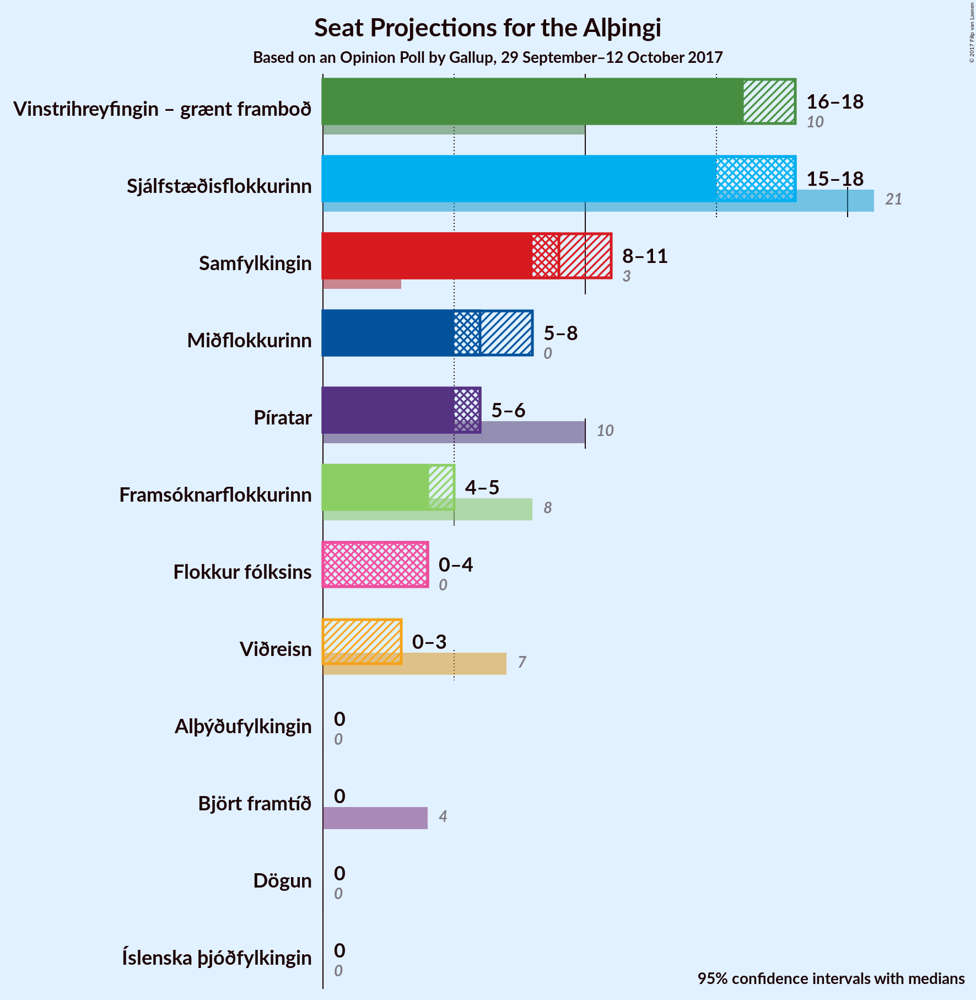

# Opinion Poll by Gallup, 29 September–12 October 2017

<a href="#voting-intentions">Voting Intentions</a> | <a href="#seats">Seats</a> | <a href="#coalitions">Coalitions</a> | <a href="#technical-information">Technical Information</a>

## Voting Intentions

### Confidence Intervals

| Party | Last Result | Poll Result | 80% Confidence Interval | 90% Confidence Interval | 95% Confidence Interval | 99% Confidence Interval |
|:-----:|:-----------:|:-----------:|:-----------------------:|:-----------------------:|:-----------------------:|:-----------------------:|
| Sjálfstæðisflokkurinn | 29.0% | 23.7% | 22.6–24.9% |22.3–25.2% |22.0–25.5% |21.5–26.0% |
| Vinstrihreyfingin – grænt framboð | 15.9% | 23.0% | 21.9–24.2% |21.6–24.5% |21.3–24.8% |20.8–25.3% |
| Samfylkingin | 5.7% | 13.4% | 12.5–14.4% |12.3–14.6% |12.1–14.9% |11.7–15.3% |
| Miðflokkurinn | 0.0% | 9.5% | 8.7–10.3% |8.6–10.6% |8.4–10.8% |8.0–11.2% |
| Píratar | 14.5% | 8.8% | 8.1–9.6% |7.9–9.8% |7.7–10.0% |7.4–10.4% |
| Framsóknarflokkurinn | 11.5% | 7.2% | 6.5–7.9% |6.4–8.1% |6.2–8.3% |5.9–8.7% |
| Flokkur fólksins | 3.5% | 5.7% | 5.1–6.4% |5.0–6.6% |4.8–6.7% |4.6–7.1% |
| Viðreisn | 10.5% | 4.8% | 4.3–5.4% |4.1–5.6% |4.0–5.7% |3.7–6.1% |
| Björt framtíð | 7.2% | 3.0% | 2.6–3.5% |2.5–3.7% |2.4–3.8% |2.2–4.1% |
| Dögun | 1.7% | 0.5% | 0.3–0.7% |0.3–0.8% |0.3–0.9% |0.2–1.0% |
| Alþýðufylkingin | 0.3% | 0.2% | 0.1–0.4% |0.1–0.5% |0.1–0.5% |0.1–0.6% |
| Íslenska þjóðfylkingin | 0.2% | 0.1% | 0.0–0.2% |0.0–0.3% |0.0–0.3% |0.0–0.4% |

*Note:* The poll result column reflects the actual value used in the calculations. Published results may vary slightly, and in addition be rounded to fewer digits.

## Seats

### Confidence Intervals

| Party | Last Result | Median | 80% Confidence Interval | 90% Confidence Interval | 95% Confidence Interval | 99% Confidence Interval |
|:-----:|:-----------:|:------:|:-----------------------:|:-----------------------:|:-----------------------:|:-----------------------:|
| <a href="#sjálfstæðisflokkurinn">Sjálfstæðisflokkurinn</a> | 21 | 17 | 16–17 |16–17 |16–18 |16–19 |
| <a href="#vinstrihreyfingin-–-grænt-framboð">Vinstrihreyfingin – grænt framboð</a> | 10 | 18 | 16–18 |16–18 |16–18 |15–18 |
| <a href="#samfylkingin">Samfylkingin</a> | 3 | 8 | 7–8 |7–9 |7–9 |7–9 |
| <a href="#miðflokkurinn">Miðflokkurinn</a> | 0 | 6 | 6–8 |6–8 |6–8 |6–8 |
| <a href="#píratar">Píratar</a> | 10 | 6 | 5–6 |5–6 |5–6 |5–7 |
| <a href="#framsóknarflokkurinn">Framsóknarflokkurinn</a> | 8 | 5 | 4–5 |4–5 |4–5 |4–5 |
| <a href="#flokkur-fólksins">Flokkur fólksins</a> | 0 | 3 | 3 |3 |3–4 |0–4 |
| <a href="#viðreisn">Viðreisn</a> | 7 | 0 | 0–3 |0–3 |0–3 |0–3 |
| <a href="#björt-framtíð">Björt framtíð</a> | 4 | 0 | 0 |0 |0 |0 |
| <a href="#dögun">Dögun</a> | 0 | 0 | 0 |0 |0 |0 |
| <a href="#alþýðufylkingin">Alþýðufylkingin</a> | 0 | 0 | 0 |0 |0 |0 |
| <a href="#Íslenska-þjóðfylkingin">Íslenska þjóðfylkingin</a> | 0 | 0 | 0 |0 |0 |0 |

### Sjálfstæðisflokkurinn

*For a full overview of the results for this party, see the [Sjálfstæðisflokkurinn](party-sjlfstisflokkurinn.html) page.*

| Number of Seats | Probability | Accumulated | Special Marks |
|:---------------:|:-----------:|:-----------:|:-------------:|
| 15 | 0.1% | 100% |  |
| 16 | 22% | 99.9% |  |
| 17 | 73% | 78% | Median |
| 18 | 2% | 4% |  |
| 19 | 2% | 2% |  |
| 20 | 0% | 0% |  |
| 21 | 0% | 0% | Last Result |

### Vinstrihreyfingin – grænt framboð

*For a full overview of the results for this party, see the [Vinstrihreyfingin – grænt framboð](party-vinstrihreyfingingrntframbo.html) page.*

| Number of Seats | Probability | Accumulated | Special Marks |
|:---------------:|:-----------:|:-----------:|:-------------:|
| 10 | 0% | 100% | Last Result |
| 11 | 0% | 100% |  |
| 12 | 0% | 100% |  |
| 13 | 0% | 100% |  |
| 14 | 0% | 100% |  |
| 15 | 0.6% | 100% |  |
| 16 | 41% | 99.4% |  |
| 17 | 0.3% | 59% |  |
| 18 | 59% | 59% | Median |
| 19 | 0% | 0% |  |

### Samfylkingin

*For a full overview of the results for this party, see the [Samfylkingin](party-samfylkingin.html) page.*

| Number of Seats | Probability | Accumulated | Special Marks |
|:---------------:|:-----------:|:-----------:|:-------------:|
| 3 | 0% | 100% | Last Result |
| 4 | 0% | 100% |  |
| 5 | 0% | 100% |  |
| 6 | 0% | 100% |  |
| 7 | 10% | 100% |  |
| 8 | 83% | 90% | Median |
| 9 | 7% | 7% |  |
| 10 | 0.1% | 0.1% |  |
| 11 | 0% | 0% |  |

### Miðflokkurinn

*For a full overview of the results for this party, see the [Miðflokkurinn](party-miflokkurinn.html) page.*

| Number of Seats | Probability | Accumulated | Special Marks |
|:---------------:|:-----------:|:-----------:|:-------------:|
| 0 | 0% | 100% | Last Result |
| 1 | 0% | 100% |  |
| 2 | 0% | 100% |  |
| 3 | 0% | 100% |  |
| 4 | 0% | 100% |  |
| 5 | 0.5% | 100% |  |
| 6 | 84% | 99.5% | Median |
| 7 | 5% | 15% |  |
| 8 | 10% | 10% |  |
| 9 | 0% | 0% |  |

### Píratar

*For a full overview of the results for this party, see the [Píratar](party-pratar.html) page.*

| Number of Seats | Probability | Accumulated | Special Marks |
|:---------------:|:-----------:|:-----------:|:-------------:|
| 5 | 12% | 100% |  |
| 6 | 87% | 88% | Median |
| 7 | 0.6% | 0.6% |  |
| 8 | 0% | 0% |  |
| 9 | 0% | 0% |  |
| 10 | 0% | 0% | Last Result |

### Framsóknarflokkurinn

*For a full overview of the results for this party, see the [Framsóknarflokkurinn](party-framsknarflokkurinn.html) page.*

| Number of Seats | Probability | Accumulated | Special Marks |
|:---------------:|:-----------:|:-----------:|:-------------:|
| 4 | 11% | 100% |  |
| 5 | 89% | 89% | Median |
| 6 | 0.3% | 0.3% |  |
| 7 | 0% | 0% |  |
| 8 | 0% | 0% | Last Result |

### Flokkur fólksins

*For a full overview of the results for this party, see the [Flokkur fólksins](party-flokkurflksins.html) page.*

| Number of Seats | Probability | Accumulated | Special Marks |
|:---------------:|:-----------:|:-----------:|:-------------:|
| 0 | 2% | 100% | Last Result |
| 1 | 0% | 98% |  |
| 2 | 0% | 98% |  |
| 3 | 95% | 98% | Median |
| 4 | 3% | 3% |  |
| 5 | 0.2% | 0.2% |  |
| 6 | 0% | 0% |  |

### Viðreisn

*For a full overview of the results for this party, see the [Viðreisn](party-vireisn.html) page.*

| Number of Seats | Probability | Accumulated | Special Marks |
|:---------------:|:-----------:|:-----------:|:-------------:|
| 0 | 66% | 100% | Median |
| 1 | 0% | 34% |  |
| 2 | 0% | 34% |  |
| 3 | 34% | 34% |  |
| 4 | 0.1% | 0.1% |  |
| 5 | 0% | 0% |  |
| 6 | 0% | 0% |  |
| 7 | 0% | 0% | Last Result |

### Björt framtíð

*For a full overview of the results for this party, see the [Björt framtíð](party-bjrtframt.html) page.*

| Number of Seats | Probability | Accumulated | Special Marks |
|:---------------:|:-----------:|:-----------:|:-------------:|
| 0 | 100% | 100% | Median |
| 1 | 0% | 0% |  |
| 2 | 0% | 0% |  |
| 3 | 0% | 0% |  |
| 4 | 0% | 0% | Last Result |

### Dögun

*For a full overview of the results for this party, see the [Dögun](party-dgun.html) page.*

| Number of Seats | Probability | Accumulated | Special Marks |
|:---------------:|:-----------:|:-----------:|:-------------:|
| 0 | 100% | 100% | Last Result, Median |

### Alþýðufylkingin

*For a full overview of the results for this party, see the [Alþýðufylkingin](party-alufylkingin.html) page.*

| Number of Seats | Probability | Accumulated | Special Marks |
|:---------------:|:-----------:|:-----------:|:-------------:|
| 0 | 100% | 100% | Last Result, Median |

### Íslenska þjóðfylkingin

*For a full overview of the results for this party, see the [Íslenska þjóðfylkingin](party-slenskajfylkingin.html) page.*

| Number of Seats | Probability | Accumulated | Special Marks |
|:---------------:|:-----------:|:-----------:|:-------------:|
| 0 | 100% | 100% | Last Result, Median |

## Coalitions

### Confidence Intervals

| Coalition | Last Result | Median | Majority? | 80% Confidence Interval | 90% Confidence Interval | 95% Confidence Interval | 99% Confidence Interval |
|:---------:|:-----------:|:------:|:---------:|:-----------------------:|:-----------------------:|:-----------------------:|:-----------------------:|
| Vinstrihreyfingin – grænt framboð – Samfylkingin – Miðflokkurinn – Framsóknarflokkurinn | 21 | 37 | 100% | 35–37 | 35–37 | 35–37 | 35–37 |
| Sjálfstæðisflokkurinn – Vinstrihreyfingin – grænt framboð | 31 | 35 | 99.9% | 32–35 | 32–35 | 32–35 | 32–35 |
| Vinstrihreyfingin – grænt framboð – Samfylkingin – Píratar – Viðreisn – Björt framtíð | 34 | 32 | 83% | 31–33 | 31–33 | 31–33 | 30–33 |
| Vinstrihreyfingin – grænt framboð – Samfylkingin – Píratar – Viðreisn | 30 | 32 | 83% | 31–33 | 31–33 | 31–33 | 30–33 |
| Vinstrihreyfingin – grænt framboð – Samfylkingin – Miðflokkurinn | 13 | 32 | 64% | 30–32 | 30–32 | 30–32 | 30–32 |
| Vinstrihreyfingin – grænt framboð – Samfylkingin – Píratar – Björt framtíð | 27 | 32 | 59% | 28–32 | 28–32 | 28–32 | 28–32 |
| Vinstrihreyfingin – grænt framboð – Samfylkingin – Píratar | 23 | 32 | 59% | 28–32 | 28–32 | 28–32 | 28–32 |
| Vinstrihreyfingin – grænt framboð – Samfylkingin – Framsóknarflokkurinn | 21 | 31 | 0% | 27–31 | 27–31 | 27–31 | 27–31 |
| Sjálfstæðisflokkurinn – Miðflokkurinn – Framsóknarflokkurinn | 29 | 28 | 0% | 27–29 | 27–29 | 27–29 | 27–30 |
| Vinstrihreyfingin – grænt framboð – Miðflokkurinn – Framsóknarflokkurinn | 18 | 29 | 0% | 27–29 | 27–29 | 27–29 | 27–29 |
| Sjálfstæðisflokkurinn – Samfylkingin | 24 | 25 | 0% | 24–25 | 24–26 | 24–27 | 24–27 |
| Vinstrihreyfingin – grænt framboð – Samfylkingin | 13 | 26 | 0% | 23–26 | 23–26 | 23–26 | 23–26 |
| Sjálfstæðisflokkurinn – Miðflokkurinn | 21 | 23 | 0% | 22–25 | 22–25 | 22–25 | 22–25 |
| Vinstrihreyfingin – grænt framboð – Miðflokkurinn | 10 | 24 | 0% | 22–24 | 22–24 | 22–24 | 22–24 |
| Vinstrihreyfingin – grænt framboð – Píratar | 20 | 24 | 0% | 21–24 | 21–24 | 21–24 | 21–24 |
| Sjálfstæðisflokkurinn – Framsóknarflokkurinn | 29 | 22 | 0% | 21–22 | 21–22 | 21–23 | 21–24 |
| Vinstrihreyfingin – grænt framboð – Framsóknarflokkurinn | 18 | 23 | 0% | 20–23 | 20–23 | 20–23 | 20–23 |
| Sjálfstæðisflokkurinn – Viðreisn – Björt framtíð | 32 | 17 | 0% | 17–20 | 17–20 | 17–20 | 16–22 |
| Sjálfstæðisflokkurinn – Viðreisn | 28 | 17 | 0% | 17–20 | 17–20 | 17–20 | 16–22 |
| Sjálfstæðisflokkurinn – Björt framtíð | 25 | 17 | 0% | 16–17 | 16–17 | 16–18 | 16–19 |

### Vinstrihreyfingin – grænt framboð – Samfylkingin – Miðflokkurinn – Framsóknarflokkurinn

| Number of Seats | Probability | Accumulated | Special Marks |
|:---------------:|:-----------:|:-----------:|:-------------:|
| 21 | 0% | 100% | Last Result |
| 22 | 0% | 100% |  |
| 23 | 0% | 100% |  |
| 24 | 0% | 100% |  |
| 25 | 0% | 100% |  |
| 26 | 0% | 100% |  |
| 27 | 0% | 100% |  |
| 28 | 0% | 100% |  |
| 29 | 0% | 100% |  |
| 30 | 0% | 100% |  |
| 31 | 0% | 100% |  |
| 32 | 0% | 100% | Majority |
| 33 | 0.2% | 100% |  |
| 34 | 0.2% | 99.8% |  |
| 35 | 33% | 99.6% |  |
| 36 | 3% | 66% |  |
| 37 | 63% | 63% | Median |
| 38 | 0% | 0.1% |  |
| 39 | 0% | 0% |  |

### Sjálfstæðisflokkurinn – Vinstrihreyfingin – grænt framboð

| Number of Seats | Probability | Accumulated | Special Marks |
|:---------------:|:-----------:|:-----------:|:-------------:|
| 31 | 0.1% | 100% | Last Result |
| 32 | 22% | 99.9% | Majority |
| 33 | 15% | 78% |  |
| 34 | 2% | 63% |  |
| 35 | 60% | 60% | Median |
| 36 | 0% | 0% |  |

### Vinstrihreyfingin – grænt framboð – Samfylkingin – Píratar – Viðreisn – Björt framtíð

| Number of Seats | Probability | Accumulated | Special Marks |
|:---------------:|:-----------:|:-----------:|:-------------:|
| 30 | 2% | 100% |  |
| 31 | 15% | 98% |  |
| 32 | 59% | 83% | Median, Majority |
| 33 | 24% | 24% |  |
| 34 | 0.1% | 0.1% | Last Result |
| 35 | 0% | 0.1% |  |
| 36 | 0% | 0% |  |

### Vinstrihreyfingin – grænt framboð – Samfylkingin – Píratar – Viðreisn

| Number of Seats | Probability | Accumulated | Special Marks |
|:---------------:|:-----------:|:-----------:|:-------------:|
| 30 | 2% | 100% | Last Result |
| 31 | 15% | 98% |  |
| 32 | 59% | 83% | Median, Majority |
| 33 | 24% | 24% |  |
| 34 | 0.1% | 0.1% |  |
| 35 | 0% | 0.1% |  |
| 36 | 0% | 0% |  |

### Vinstrihreyfingin – grænt framboð – Samfylkingin – Miðflokkurinn

| Number of Seats | Probability | Accumulated | Special Marks |
|:---------------:|:-----------:|:-----------:|:-------------:|
| 13 | 0% | 100% | Last Result |
| 14 | 0% | 100% |  |
| 15 | 0% | 100% |  |
| 16 | 0% | 100% |  |
| 17 | 0% | 100% |  |
| 18 | 0% | 100% |  |
| 19 | 0% | 100% |  |
| 20 | 0% | 100% |  |
| 21 | 0% | 100% |  |
| 22 | 0% | 100% |  |
| 23 | 0% | 100% |  |
| 24 | 0% | 100% |  |
| 25 | 0% | 100% |  |
| 26 | 0% | 100% |  |
| 27 | 0% | 100% |  |
| 28 | 0% | 100% |  |
| 29 | 0.2% | 100% |  |
| 30 | 24% | 99.8% |  |
| 31 | 12% | 76% |  |
| 32 | 63% | 64% | Median, Majority |
| 33 | 0.1% | 0.1% |  |
| 34 | 0% | 0% |  |

### Vinstrihreyfingin – grænt framboð – Samfylkingin – Píratar – Björt framtíð

| Number of Seats | Probability | Accumulated | Special Marks |
|:---------------:|:-----------:|:-----------:|:-------------:|
| 27 | 0% | 100% | Last Result |
| 28 | 10% | 100% |  |
| 29 | 0.1% | 90% |  |
| 30 | 26% | 90% |  |
| 31 | 5% | 64% |  |
| 32 | 59% | 59% | Median, Majority |
| 33 | 0.2% | 0.2% |  |
| 34 | 0% | 0% |  |

### Vinstrihreyfingin – grænt framboð – Samfylkingin – Píratar

| Number of Seats | Probability | Accumulated | Special Marks |
|:---------------:|:-----------:|:-----------:|:-------------:|
| 23 | 0% | 100% | Last Result |
| 24 | 0% | 100% |  |
| 25 | 0% | 100% |  |
| 26 | 0% | 100% |  |
| 27 | 0% | 100% |  |
| 28 | 10% | 100% |  |
| 29 | 0.1% | 90% |  |
| 30 | 26% | 90% |  |
| 31 | 5% | 64% |  |
| 32 | 59% | 59% | Median, Majority |
| 33 | 0.2% | 0.2% |  |
| 34 | 0% | 0% |  |

### Vinstrihreyfingin – grænt framboð – Samfylkingin – Framsóknarflokkurinn

| Number of Seats | Probability | Accumulated | Special Marks |
|:---------------:|:-----------:|:-----------:|:-------------:|
| 21 | 0% | 100% | Last Result |
| 22 | 0% | 100% |  |
| 23 | 0% | 100% |  |
| 24 | 0% | 100% |  |
| 25 | 0% | 100% |  |
| 26 | 0% | 100% |  |
| 27 | 10% | 100% |  |
| 28 | 0.2% | 90% |  |
| 29 | 24% | 90% |  |
| 30 | 7% | 66% |  |
| 31 | 59% | 59% | Median |
| 32 | 0% | 0% | Majority |

### Sjálfstæðisflokkurinn – Miðflokkurinn – Framsóknarflokkurinn

| Number of Seats | Probability | Accumulated | Special Marks |
|:---------------:|:-----------:|:-----------:|:-------------:|
| 25 | 0.2% | 100% |  |
| 26 | 0.2% | 99.8% |  |
| 27 | 22% | 99.6% |  |
| 28 | 59% | 78% | Median |
| 29 | 17% | 19% | Last Result |
| 30 | 2% | 2% |  |
| 31 | 0% | 0% |  |

### Vinstrihreyfingin – grænt framboð – Miðflokkurinn – Framsóknarflokkurinn

| Number of Seats | Probability | Accumulated | Special Marks |
|:---------------:|:-----------:|:-----------:|:-------------:|
| 18 | 0% | 100% | Last Result |
| 19 | 0% | 100% |  |
| 20 | 0% | 100% |  |
| 21 | 0% | 100% |  |
| 22 | 0% | 100% |  |
| 23 | 0% | 100% |  |
| 24 | 0% | 100% |  |
| 25 | 0.4% | 100% |  |
| 26 | 0.1% | 99.6% |  |
| 27 | 26% | 99.5% |  |
| 28 | 15% | 74% |  |
| 29 | 59% | 59% | Median |
| 30 | 0% | 0% |  |

### Sjálfstæðisflokkurinn – Samfylkingin

| Number of Seats | Probability | Accumulated | Special Marks |
|:---------------:|:-----------:|:-----------:|:-------------:|
| 23 | 0.1% | 100% |  |
| 24 | 32% | 99.9% | Last Result |
| 25 | 59% | 68% | Median |
| 26 | 5% | 9% |  |
| 27 | 4% | 4% |  |
| 28 | 0% | 0.1% |  |
| 29 | 0% | 0% |  |

### Vinstrihreyfingin – grænt framboð – Samfylkingin

| Number of Seats | Probability | Accumulated | Special Marks |
|:---------------:|:-----------:|:-----------:|:-------------:|
| 13 | 0% | 100% | Last Result |
| 14 | 0% | 100% |  |
| 15 | 0% | 100% |  |
| 16 | 0% | 100% |  |
| 17 | 0% | 100% |  |
| 18 | 0% | 100% |  |
| 19 | 0% | 100% |  |
| 20 | 0% | 100% |  |
| 21 | 0% | 100% |  |
| 22 | 0% | 100% |  |
| 23 | 10% | 100% |  |
| 24 | 24% | 90% |  |
| 25 | 7% | 66% |  |
| 26 | 59% | 59% | Median |
| 27 | 0% | 0.1% |  |
| 28 | 0% | 0% |  |

### Sjálfstæðisflokkurinn – Miðflokkurinn

| Number of Seats | Probability | Accumulated | Special Marks |
|:---------------:|:-----------:|:-----------:|:-------------:|
| 21 | 0.4% | 100% | Last Result |
| 22 | 22% | 99.6% |  |
| 23 | 59% | 78% | Median |
| 24 | 7% | 19% |  |
| 25 | 12% | 12% |  |
| 26 | 0% | 0% |  |

### Vinstrihreyfingin – grænt framboð – Miðflokkurinn

| Number of Seats | Probability | Accumulated | Special Marks |
|:---------------:|:-----------:|:-----------:|:-------------:|
| 10 | 0% | 100% | Last Result |
| 11 | 0% | 100% |  |
| 12 | 0% | 100% |  |
| 13 | 0% | 100% |  |
| 14 | 0% | 100% |  |
| 15 | 0% | 100% |  |
| 16 | 0% | 100% |  |
| 17 | 0% | 100% |  |
| 18 | 0% | 100% |  |
| 19 | 0% | 100% |  |
| 20 | 0% | 100% |  |
| 21 | 0.4% | 100% |  |
| 22 | 26% | 99.6% |  |
| 23 | 5% | 74% |  |
| 24 | 69% | 69% | Median |
| 25 | 0% | 0% |  |

### Vinstrihreyfingin – grænt framboð – Píratar

| Number of Seats | Probability | Accumulated | Special Marks |
|:---------------:|:-----------:|:-----------:|:-------------:|
| 20 | 0.1% | 100% | Last Result |
| 21 | 12% | 99.9% |  |
| 22 | 28% | 87% |  |
| 23 | 0.4% | 59% |  |
| 24 | 59% | 59% | Median |
| 25 | 0.1% | 0.2% |  |
| 26 | 0% | 0% |  |

### Sjálfstæðisflokkurinn – Framsóknarflokkurinn

| Number of Seats | Probability | Accumulated | Special Marks |
|:---------------:|:-----------:|:-----------:|:-------------:|
| 19 | 0.1% | 100% |  |
| 20 | 0.3% | 99.9% |  |
| 21 | 32% | 99.6% |  |
| 22 | 64% | 68% | Median |
| 23 | 2% | 4% |  |
| 24 | 2% | 2% |  |
| 25 | 0% | 0% |  |
| 26 | 0% | 0% |  |
| 27 | 0% | 0% |  |
| 28 | 0% | 0% |  |
| 29 | 0% | 0% | Last Result |

### Vinstrihreyfingin – grænt framboð – Framsóknarflokkurinn

| Number of Seats | Probability | Accumulated | Special Marks |
|:---------------:|:-----------:|:-----------:|:-------------:|
| 18 | 0% | 100% | Last Result |
| 19 | 0.1% | 100% |  |
| 20 | 11% | 99.8% |  |
| 21 | 30% | 89% |  |
| 22 | 0.4% | 59% |  |
| 23 | 59% | 59% | Median |
| 24 | 0% | 0% |  |

### Sjálfstæðisflokkurinn – Viðreisn – Björt framtíð

| Number of Seats | Probability | Accumulated | Special Marks |
|:---------------:|:-----------:|:-----------:|:-------------:|
| 15 | 0.1% | 100% |  |
| 16 | 0.4% | 99.9% |  |
| 17 | 63% | 99.5% | Median |
| 18 | 2% | 36% |  |
| 19 | 22% | 34% |  |
| 20 | 10% | 13% |  |
| 21 | 0.6% | 2% |  |
| 22 | 2% | 2% |  |
| 23 | 0% | 0% |  |
| 24 | 0% | 0% |  |
| 25 | 0% | 0% |  |
| 26 | 0% | 0% |  |
| 27 | 0% | 0% |  |
| 28 | 0% | 0% |  |
| 29 | 0% | 0% |  |
| 30 | 0% | 0% |  |
| 31 | 0% | 0% |  |
| 32 | 0% | 0% | Last Result, Majority |

### Sjálfstæðisflokkurinn – Viðreisn

| Number of Seats | Probability | Accumulated | Special Marks |
|:---------------:|:-----------:|:-----------:|:-------------:|
| 15 | 0.1% | 100% |  |
| 16 | 0.4% | 99.9% |  |
| 17 | 63% | 99.5% | Median |
| 18 | 2% | 36% |  |
| 19 | 22% | 34% |  |
| 20 | 10% | 13% |  |
| 21 | 0.6% | 2% |  |
| 22 | 2% | 2% |  |
| 23 | 0% | 0% |  |
| 24 | 0% | 0% |  |
| 25 | 0% | 0% |  |
| 26 | 0% | 0% |  |
| 27 | 0% | 0% |  |
| 28 | 0% | 0% | Last Result |

### Sjálfstæðisflokkurinn – Björt framtíð

| Number of Seats | Probability | Accumulated | Special Marks |
|:---------------:|:-----------:|:-----------:|:-------------:|
| 15 | 0.1% | 100% |  |
| 16 | 22% | 99.9% |  |
| 17 | 73% | 78% | Median |
| 18 | 2% | 4% |  |
| 19 | 2% | 2% |  |
| 20 | 0% | 0% |  |
| 21 | 0% | 0% |  |
| 22 | 0% | 0% |  |
| 23 | 0% | 0% |  |
| 24 | 0% | 0% |  |
| 25 | 0% | 0% | Last Result |

## Technical Information

### Opinion Poll

+ **Pollster:** Gallup
+ **Media:** —
+ **Fieldwork period:** 29 September–12 October 2017

### Calculations

+ **Sample size:** 2295
+ **Simulations done:** 32,768
+ **Error estimate:** 2.58%

