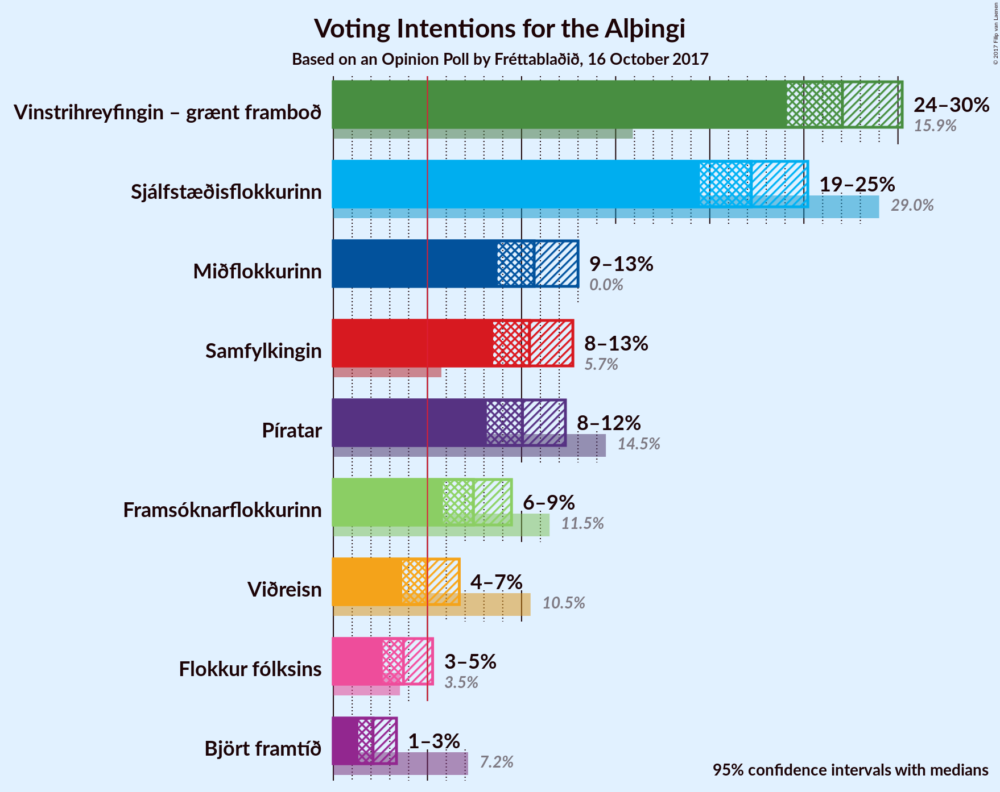
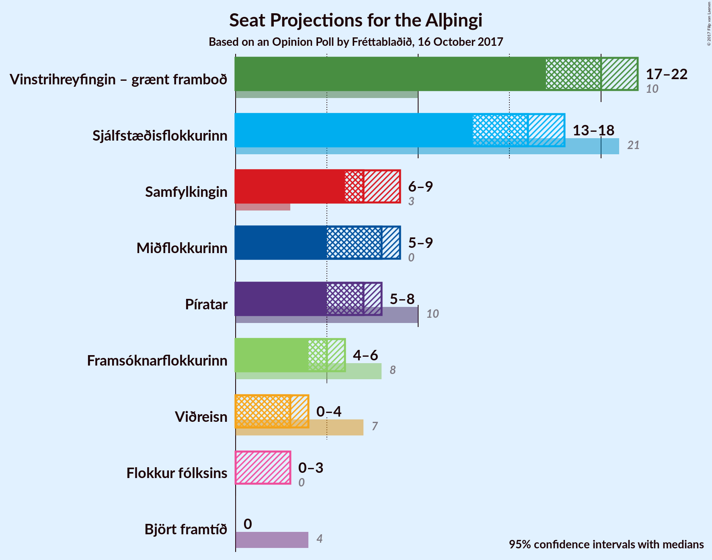

# Opinion Poll by Fréttablaðið, 16 October 2017

<a href="#voting-intentions">Voting Intentions</a> | <a href="#seats">Seats</a> | <a href="#coalitions">Coalitions</a> | <a href="#technical-information">Technical Information</a>

## Voting Intentions

### Confidence Intervals

| Party | Last Result | Poll Result | 80% Confidence Interval | 90% Confidence Interval | 95% Confidence Interval | 99% Confidence Interval |
|:-----:|:-----------:|:-----------:|:-----------------------:|:-----------------------:|:-----------------------:|:-----------------------:|
| Vinstrihreyfingin – grænt framboð | 15.9% | 27.0% | 25.1–29.1% |24.6–29.7% |24.1–30.2% |23.2–31.2% |
| Sjálfstæðisflokkurinn | 29.0% | 22.2% | 20.4–24.2% |19.9–24.7% |19.5–25.2% |18.6–26.2% |
| Miðflokkurinn | 0.0% | 10.7% | 9.4–12.2% |9.0–12.6% |8.7–13.0% |8.1–13.7% |
| Samfylkingin | 5.7% | 10.4% | 9.2–11.9% |8.8–12.3% |8.5–12.7% |7.9–13.5% |
| Píratar | 14.5% | 10.0% | 8.8–11.5% |8.5–11.9% |8.2–12.3% |7.6–13.1% |
| Framsóknarflokkurinn | 11.5% | 7.4% | 6.4–8.8% |6.1–9.1% |5.8–9.5% |5.4–10.1% |
| Viðreisn | 10.5% | 5.0% | 4.1–6.1% |3.9–6.4% |3.7–6.7% |3.3–7.3% |
| Flokkur fólksins | 3.5% | 3.7% | 3.0–4.7% |2.8–5.0% |2.6–5.3% |2.3–5.8% |
| Björt framtíð | 7.2% | 2.1% | 1.6–2.9% |1.4–3.2% |1.3–3.4% |1.1–3.8% |

*Note:* The poll result column reflects the actual value used in the calculations. Published results may vary slightly, and in addition be rounded to fewer digits.

## Seats

### Confidence Intervals

| Party | Last Result | Median | 80% Confidence Interval | 90% Confidence Interval | 95% Confidence Interval | 99% Confidence Interval |
|:-----:|:-----------:|:------:|:-----------------------:|:-----------------------:|:-----------------------:|:-----------------------:|
| <a href="#vinstrihreyfingin-–-grænt-framboð">Vinstrihreyfingin – grænt framboð</a> | 10 | 20 | 18–21 |17–22 |17–22 |16–23 |
| <a href="#sjálfstæðisflokkurinn">Sjálfstæðisflokkurinn</a> | 21 | 16 | 14–17 |13–17 |13–18 |13–19 |
| <a href="#miðflokkurinn">Miðflokkurinn</a> | 0 | 8 | 6–8 |6–9 |6–9 |5–10 |
| <a href="#samfylkingin">Samfylkingin</a> | 3 | 7 | 6–8 |6–8 |6–9 |5–9 |
| <a href="#píratar">Píratar</a> | 10 | 7 | 6–8 |5–8 |5–8 |5–9 |
| <a href="#framsóknarflokkurinn">Framsóknarflokkurinn</a> | 8 | 5 | 4–6 |4–6 |4–6 |3–7 |
| <a href="#viðreisn">Viðreisn</a> | 7 | 0 | 0–4 |0–4 |0–4 |0–5 |
| <a href="#flokkur-fólksins">Flokkur fólksins</a> | 0 | 0 | 0 |0 |0–3 |0–3 |
| <a href="#björt-framtíð">Björt framtíð</a> | 4 | 0 | 0 |0 |0 |0 |

### Vinstrihreyfingin – grænt framboð

*For a full overview of the results for this party, see the [Vinstrihreyfingin – grænt framboð](party-vinstrihreyfingingrntframbo.html) page.*

| Number of Seats | Probability | Accumulated | Special Marks |
|:---------------:|:-----------:|:-----------:|:-------------:|
| 10 | 0% | 100% | Last Result |
| 11 | 0% | 100% |  |
| 12 | 0% | 100% |  |
| 13 | 0% | 100% |  |
| 14 | 0% | 100% |  |
| 15 | 0% | 100% |  |
| 16 | 1.1% | 100% |  |
| 17 | 8% | 98.9% |  |
| 18 | 14% | 91% |  |
| 19 | 21% | 76% |  |
| 20 | 34% | 55% | Median |
| 21 | 15% | 21% |  |
| 22 | 5% | 6% |  |
| 23 | 1.0% | 1.0% |  |
| 24 | 0% | 0% |  |

### Sjálfstæðisflokkurinn

*For a full overview of the results for this party, see the [Sjálfstæðisflokkurinn](party-sjlfstisflokkurinn.html) page.*

| Number of Seats | Probability | Accumulated | Special Marks |
|:---------------:|:-----------:|:-----------:|:-------------:|
| 12 | 0.3% | 100% |  |
| 13 | 5% | 99.7% |  |
| 14 | 12% | 95% |  |
| 15 | 25% | 83% |  |
| 16 | 32% | 58% | Median |
| 17 | 22% | 26% |  |
| 18 | 3% | 4% |  |
| 19 | 0.8% | 0.8% |  |
| 20 | 0.1% | 0.1% |  |
| 21 | 0% | 0% | Last Result |

### Miðflokkurinn

*For a full overview of the results for this party, see the [Miðflokkurinn](party-miflokkurinn.html) page.*

| Number of Seats | Probability | Accumulated | Special Marks |
|:---------------:|:-----------:|:-----------:|:-------------:|
| 0 | 0% | 100% | Last Result |
| 1 | 0% | 100% |  |
| 2 | 0% | 100% |  |
| 3 | 0% | 100% |  |
| 4 | 0% | 100% |  |
| 5 | 2% | 100% |  |
| 6 | 20% | 98% |  |
| 7 | 23% | 78% |  |
| 8 | 48% | 55% | Median |
| 9 | 7% | 7% |  |
| 10 | 0.6% | 0.7% |  |
| 11 | 0% | 0% |  |

### Samfylkingin

*For a full overview of the results for this party, see the [Samfylkingin](party-samfylkingin.html) page.*

| Number of Seats | Probability | Accumulated | Special Marks |
|:---------------:|:-----------:|:-----------:|:-------------:|
| 3 | 0% | 100% | Last Result |
| 4 | 0% | 100% |  |
| 5 | 0.6% | 100% |  |
| 6 | 20% | 99.3% |  |
| 7 | 48% | 79% | Median |
| 8 | 29% | 32% |  |
| 9 | 3% | 3% |  |
| 10 | 0.2% | 0.2% |  |
| 11 | 0% | 0% |  |

### Píratar

*For a full overview of the results for this party, see the [Píratar](party-pratar.html) page.*

| Number of Seats | Probability | Accumulated | Special Marks |
|:---------------:|:-----------:|:-----------:|:-------------:|
| 4 | 0.1% | 100% |  |
| 5 | 6% | 99.9% |  |
| 6 | 35% | 94% |  |
| 7 | 40% | 59% | Median |
| 8 | 17% | 19% |  |
| 9 | 2% | 2% |  |
| 10 | 0.1% | 0.1% | Last Result |
| 11 | 0% | 0% |  |

### Framsóknarflokkurinn

*For a full overview of the results for this party, see the [Framsóknarflokkurinn](party-framsknarflokkurinn.html) page.*

| Number of Seats | Probability | Accumulated | Special Marks |
|:---------------:|:-----------:|:-----------:|:-------------:|
| 2 | 0% | 100% |  |
| 3 | 0.7% | 99.9% |  |
| 4 | 33% | 99.2% |  |
| 5 | 46% | 66% | Median |
| 6 | 19% | 20% |  |
| 7 | 1.0% | 1.1% |  |
| 8 | 0.1% | 0.1% | Last Result |
| 9 | 0% | 0% |  |

### Viðreisn

*For a full overview of the results for this party, see the [Viðreisn](party-vireisn.html) page.*

| Number of Seats | Probability | Accumulated | Special Marks |
|:---------------:|:-----------:|:-----------:|:-------------:|
| 0 | 53% | 100% | Median |
| 1 | 0% | 47% |  |
| 2 | 0% | 47% |  |
| 3 | 25% | 47% |  |
| 4 | 21% | 22% |  |
| 5 | 1.2% | 1.2% |  |
| 6 | 0% | 0% |  |
| 7 | 0% | 0% | Last Result |

### Flokkur fólksins

*For a full overview of the results for this party, see the [Flokkur fólksins](party-flokkurflksins.html) page.*

| Number of Seats | Probability | Accumulated | Special Marks |
|:---------------:|:-----------:|:-----------:|:-------------:|
| 0 | 97% | 100% | Last Result, Median |
| 1 | 0.1% | 3% |  |
| 2 | 0.2% | 3% |  |
| 3 | 3% | 3% |  |
| 4 | 0.3% | 0.3% |  |
| 5 | 0% | 0% |  |

### Björt framtíð

*For a full overview of the results for this party, see the [Björt framtíð](party-bjrtframt.html) page.*

| Number of Seats | Probability | Accumulated | Special Marks |
|:---------------:|:-----------:|:-----------:|:-------------:|
| 0 | 100% | 100% | Median |
| 1 | 0% | 0% |  |
| 2 | 0% | 0% |  |
| 3 | 0% | 0% |  |
| 4 | 0% | 0% | Last Result |

## Coalitions

### Confidence Intervals

| Coalition | Last Result | Median | Majority? | 80% Confidence Interval | 90% Confidence Interval | 95% Confidence Interval | 99% Confidence Interval |
|:---------:|:-----------:|:------:|:---------:|:-----------------------:|:-----------------------:|:-----------------------:|:-----------------------:|
| Vinstrihreyfingin – grænt framboð – Miðflokkurinn – Samfylkingin – Framsóknarflokkurinn | 21 | 39 | 100% | 36–41 | 36–42 | 36–42 | 35–43 |
| Vinstrihreyfingin – grænt framboð – Samfylkingin – Píratar – Viðreisn – Björt framtíð | 34 | 35 | 99.0% | 33–37 | 32–38 | 32–39 | 31–39 |
| Vinstrihreyfingin – grænt framboð – Samfylkingin – Píratar – Viðreisn | 30 | 35 | 99.0% | 33–37 | 32–38 | 32–39 | 31–39 |
| Vinstrihreyfingin – grænt framboð – Sjálfstæðisflokkurinn | 31 | 35 | 98.9% | 33–37 | 32–38 | 32–38 | 31–39 |
| Vinstrihreyfingin – grænt framboð – Miðflokkurinn – Samfylkingin | 13 | 34 | 92% | 32–36 | 31–36 | 30–37 | 30–38 |
| Vinstrihreyfingin – grænt framboð – Samfylkingin – Píratar – Björt framtíð | 27 | 33 | 86% | 31–35 | 31–36 | 30–36 | 29–37 |
| Vinstrihreyfingin – grænt framboð – Samfylkingin – Píratar | 23 | 33 | 86% | 31–35 | 31–36 | 30–36 | 29–37 |
| Vinstrihreyfingin – grænt framboð – Miðflokkurinn – Framsóknarflokkurinn | 18 | 32 | 58% | 30–34 | 29–34 | 28–35 | 28–35 |
| Vinstrihreyfingin – grænt framboð – Samfylkingin – Framsóknarflokkurinn | 21 | 32 | 54% | 29–34 | 29–34 | 28–35 | 28–35 |
| Sjálfstæðisflokkurinn – Miðflokkurinn – Framsóknarflokkurinn | 29 | 28 | 0.8% | 26–30 | 25–31 | 24–31 | 24–32 |
| Vinstrihreyfingin – grænt framboð – Miðflokkurinn | 10 | 27 | 0% | 25–28 | 24–29 | 24–29 | 23–30 |
| Vinstrihreyfingin – grænt framboð – Píratar | 20 | 26 | 0% | 24–28 | 24–29 | 23–29 | 22–30 |
| Vinstrihreyfingin – grænt framboð – Samfylkingin | 13 | 27 | 0% | 24–29 | 24–29 | 23–29 | 23–30 |
| Vinstrihreyfingin – grænt framboð – Framsóknarflokkurinn | 18 | 24 | 0% | 22–26 | 22–27 | 21–27 | 21–28 |
| Sjálfstæðisflokkurinn – Miðflokkurinn | 21 | 23 | 0% | 21–25 | 20–25 | 20–26 | 19–27 |
| Sjálfstæðisflokkurinn – Samfylkingin | 24 | 23 | 0% | 21–24 | 20–25 | 20–25 | 19–26 |
| Sjálfstæðisflokkurinn – Framsóknarflokkurinn | 29 | 21 | 0% | 19–22 | 18–23 | 18–23 | 17–24 |
| Sjálfstæðisflokkurinn – Viðreisn – Björt framtíð | 32 | 17 | 0% | 15–20 | 14–20 | 14–20 | 13–21 |
| Sjálfstæðisflokkurinn – Viðreisn | 28 | 17 | 0% | 15–20 | 14–20 | 14–20 | 13–21 |
| Sjálfstæðisflokkurinn – Björt framtíð | 25 | 16 | 0% | 14–17 | 13–17 | 13–18 | 13–19 |

### Vinstrihreyfingin – grænt framboð – Miðflokkurinn – Samfylkingin – Framsóknarflokkurinn

| Number of Seats | Probability | Accumulated | Special Marks |
|:---------------:|:-----------:|:-----------:|:-------------:|
| 21 | 0% | 100% | Last Result |
| 22 | 0% | 100% |  |
| 23 | 0% | 100% |  |
| 24 | 0% | 100% |  |
| 25 | 0% | 100% |  |
| 26 | 0% | 100% |  |
| 27 | 0% | 100% |  |
| 28 | 0% | 100% |  |
| 29 | 0% | 100% |  |
| 30 | 0% | 100% |  |
| 31 | 0% | 100% |  |
| 32 | 0% | 100% | Majority |
| 33 | 0% | 100% |  |
| 34 | 0.3% | 100% |  |
| 35 | 2% | 99.7% |  |
| 36 | 8% | 98% |  |
| 37 | 12% | 89% |  |
| 38 | 18% | 78% |  |
| 39 | 20% | 59% |  |
| 40 | 21% | 39% | Median |
| 41 | 12% | 18% |  |
| 42 | 5% | 6% |  |
| 43 | 1.2% | 1.2% |  |
| 44 | 0% | 0.1% |  |
| 45 | 0% | 0% |  |

### Vinstrihreyfingin – grænt framboð – Samfylkingin – Píratar – Viðreisn – Björt framtíð

| Number of Seats | Probability | Accumulated | Special Marks |
|:---------------:|:-----------:|:-----------:|:-------------:|
| 30 | 0.1% | 100% |  |
| 31 | 0.9% | 99.9% |  |
| 32 | 6% | 99.0% | Majority |
| 33 | 11% | 93% |  |
| 34 | 22% | 82% | Last Result, Median |
| 35 | 23% | 60% |  |
| 36 | 19% | 37% |  |
| 37 | 10% | 17% |  |
| 38 | 5% | 7% |  |
| 39 | 2% | 3% |  |
| 40 | 0.1% | 0.1% |  |
| 41 | 0% | 0% |  |

### Vinstrihreyfingin – grænt framboð – Samfylkingin – Píratar – Viðreisn

| Number of Seats | Probability | Accumulated | Special Marks |
|:---------------:|:-----------:|:-----------:|:-------------:|
| 30 | 0.1% | 100% | Last Result |
| 31 | 0.9% | 99.9% |  |
| 32 | 6% | 99.0% | Majority |
| 33 | 11% | 93% |  |
| 34 | 22% | 82% | Median |
| 35 | 23% | 60% |  |
| 36 | 19% | 37% |  |
| 37 | 10% | 17% |  |
| 38 | 5% | 7% |  |
| 39 | 2% | 3% |  |
| 40 | 0.1% | 0.1% |  |
| 41 | 0% | 0% |  |

### Vinstrihreyfingin – grænt framboð – Sjálfstæðisflokkurinn

| Number of Seats | Probability | Accumulated | Special Marks |
|:---------------:|:-----------:|:-----------:|:-------------:|
| 30 | 0.2% | 100% |  |
| 31 | 0.9% | 99.8% | Last Result |
| 32 | 4% | 98.9% | Majority |
| 33 | 9% | 95% |  |
| 34 | 20% | 86% |  |
| 35 | 24% | 66% |  |
| 36 | 21% | 42% | Median |
| 37 | 15% | 21% |  |
| 38 | 4% | 6% |  |
| 39 | 1.1% | 1.2% |  |
| 40 | 0.1% | 0.1% |  |
| 41 | 0% | 0% |  |

### Vinstrihreyfingin – grænt framboð – Miðflokkurinn – Samfylkingin

| Number of Seats | Probability | Accumulated | Special Marks |
|:---------------:|:-----------:|:-----------:|:-------------:|
| 13 | 0% | 100% | Last Result |
| 14 | 0% | 100% |  |
| 15 | 0% | 100% |  |
| 16 | 0% | 100% |  |
| 17 | 0% | 100% |  |
| 18 | 0% | 100% |  |
| 19 | 0% | 100% |  |
| 20 | 0% | 100% |  |
| 21 | 0% | 100% |  |
| 22 | 0% | 100% |  |
| 23 | 0% | 100% |  |
| 24 | 0% | 100% |  |
| 25 | 0% | 100% |  |
| 26 | 0% | 100% |  |
| 27 | 0% | 100% |  |
| 28 | 0% | 100% |  |
| 29 | 0.1% | 100% |  |
| 30 | 3% | 99.8% |  |
| 31 | 4% | 97% |  |
| 32 | 12% | 92% | Majority |
| 33 | 16% | 80% |  |
| 34 | 23% | 64% |  |
| 35 | 20% | 42% | Median |
| 36 | 17% | 21% |  |
| 37 | 3% | 4% |  |
| 38 | 0.8% | 0.8% |  |
| 39 | 0% | 0% |  |

### Vinstrihreyfingin – grænt framboð – Samfylkingin – Píratar – Björt framtíð

| Number of Seats | Probability | Accumulated | Special Marks |
|:---------------:|:-----------:|:-----------:|:-------------:|
| 27 | 0% | 100% | Last Result |
| 28 | 0.1% | 100% |  |
| 29 | 0.8% | 99.9% |  |
| 30 | 4% | 99.1% |  |
| 31 | 9% | 96% |  |
| 32 | 18% | 86% | Majority |
| 33 | 19% | 68% |  |
| 34 | 24% | 49% | Median |
| 35 | 16% | 25% |  |
| 36 | 7% | 9% |  |
| 37 | 2% | 2% |  |
| 38 | 0.3% | 0.3% |  |
| 39 | 0% | 0% |  |

### Vinstrihreyfingin – grænt framboð – Samfylkingin – Píratar

| Number of Seats | Probability | Accumulated | Special Marks |
|:---------------:|:-----------:|:-----------:|:-------------:|
| 23 | 0% | 100% | Last Result |
| 24 | 0% | 100% |  |
| 25 | 0% | 100% |  |
| 26 | 0% | 100% |  |
| 27 | 0% | 100% |  |
| 28 | 0.1% | 100% |  |
| 29 | 0.8% | 99.9% |  |
| 30 | 4% | 99.1% |  |
| 31 | 9% | 96% |  |
| 32 | 18% | 86% | Majority |
| 33 | 19% | 68% |  |
| 34 | 24% | 49% | Median |
| 35 | 16% | 25% |  |
| 36 | 7% | 9% |  |
| 37 | 2% | 2% |  |
| 38 | 0.3% | 0.3% |  |
| 39 | 0% | 0% |  |

### Vinstrihreyfingin – grænt framboð – Miðflokkurinn – Framsóknarflokkurinn

| Number of Seats | Probability | Accumulated | Special Marks |
|:---------------:|:-----------:|:-----------:|:-------------:|
| 18 | 0% | 100% | Last Result |
| 19 | 0% | 100% |  |
| 20 | 0% | 100% |  |
| 21 | 0% | 100% |  |
| 22 | 0% | 100% |  |
| 23 | 0% | 100% |  |
| 24 | 0% | 100% |  |
| 25 | 0% | 100% |  |
| 26 | 0.1% | 100% |  |
| 27 | 0.2% | 99.9% |  |
| 28 | 3% | 99.8% |  |
| 29 | 4% | 96% |  |
| 30 | 11% | 92% |  |
| 31 | 23% | 81% |  |
| 32 | 27% | 58% | Majority |
| 33 | 18% | 31% | Median |
| 34 | 10% | 13% |  |
| 35 | 2% | 3% |  |
| 36 | 0.3% | 0.3% |  |
| 37 | 0% | 0% |  |

### Vinstrihreyfingin – grænt framboð – Samfylkingin – Framsóknarflokkurinn

| Number of Seats | Probability | Accumulated | Special Marks |
|:---------------:|:-----------:|:-----------:|:-------------:|
| 21 | 0% | 100% | Last Result |
| 22 | 0% | 100% |  |
| 23 | 0% | 100% |  |
| 24 | 0% | 100% |  |
| 25 | 0% | 100% |  |
| 26 | 0% | 100% |  |
| 27 | 0.3% | 100% |  |
| 28 | 4% | 99.6% |  |
| 29 | 9% | 96% |  |
| 30 | 14% | 87% |  |
| 31 | 19% | 73% |  |
| 32 | 30% | 54% | Median, Majority |
| 33 | 12% | 24% |  |
| 34 | 9% | 12% |  |
| 35 | 2% | 3% |  |
| 36 | 0.3% | 0.4% |  |
| 37 | 0.1% | 0.1% |  |
| 38 | 0% | 0% |  |

### Sjálfstæðisflokkurinn – Miðflokkurinn – Framsóknarflokkurinn

| Number of Seats | Probability | Accumulated | Special Marks |
|:---------------:|:-----------:|:-----------:|:-------------:|
| 23 | 0.3% | 100% |  |
| 24 | 3% | 99.7% |  |
| 25 | 5% | 97% |  |
| 26 | 10% | 91% |  |
| 27 | 20% | 81% |  |
| 28 | 23% | 61% |  |
| 29 | 22% | 38% | Last Result, Median |
| 30 | 11% | 16% |  |
| 31 | 5% | 6% |  |
| 32 | 0.7% | 0.8% | Majority |
| 33 | 0.1% | 0.1% |  |
| 34 | 0% | 0% |  |

### Vinstrihreyfingin – grænt framboð – Miðflokkurinn

| Number of Seats | Probability | Accumulated | Special Marks |
|:---------------:|:-----------:|:-----------:|:-------------:|
| 10 | 0% | 100% | Last Result |
| 11 | 0% | 100% |  |
| 12 | 0% | 100% |  |
| 13 | 0% | 100% |  |
| 14 | 0% | 100% |  |
| 15 | 0% | 100% |  |
| 16 | 0% | 100% |  |
| 17 | 0% | 100% |  |
| 18 | 0% | 100% |  |
| 19 | 0% | 100% |  |
| 20 | 0% | 100% |  |
| 21 | 0% | 100% |  |
| 22 | 0.1% | 100% |  |
| 23 | 2% | 99.8% |  |
| 24 | 5% | 98% |  |
| 25 | 12% | 93% |  |
| 26 | 16% | 82% |  |
| 27 | 29% | 66% |  |
| 28 | 27% | 37% | Median |
| 29 | 8% | 10% |  |
| 30 | 2% | 2% |  |
| 31 | 0.2% | 0.2% |  |
| 32 | 0% | 0% | Majority |

### Vinstrihreyfingin – grænt framboð – Píratar

| Number of Seats | Probability | Accumulated | Special Marks |
|:---------------:|:-----------:|:-----------:|:-------------:|
| 20 | 0% | 100% | Last Result |
| 21 | 0% | 100% |  |
| 22 | 0.5% | 100% |  |
| 23 | 3% | 99.5% |  |
| 24 | 9% | 97% |  |
| 25 | 20% | 88% |  |
| 26 | 23% | 68% |  |
| 27 | 26% | 44% | Median |
| 28 | 12% | 18% |  |
| 29 | 5% | 6% |  |
| 30 | 0.7% | 0.8% |  |
| 31 | 0.1% | 0.1% |  |
| 32 | 0% | 0% | Majority |

### Vinstrihreyfingin – grænt framboð – Samfylkingin

| Number of Seats | Probability | Accumulated | Special Marks |
|:---------------:|:-----------:|:-----------:|:-------------:|
| 13 | 0% | 100% | Last Result |
| 14 | 0% | 100% |  |
| 15 | 0% | 100% |  |
| 16 | 0% | 100% |  |
| 17 | 0% | 100% |  |
| 18 | 0% | 100% |  |
| 19 | 0% | 100% |  |
| 20 | 0% | 100% |  |
| 21 | 0% | 100% |  |
| 22 | 0.2% | 100% |  |
| 23 | 3% | 99.8% |  |
| 24 | 7% | 97% |  |
| 25 | 13% | 89% |  |
| 26 | 19% | 77% |  |
| 27 | 28% | 57% | Median |
| 28 | 19% | 30% |  |
| 29 | 9% | 11% |  |
| 30 | 2% | 2% |  |
| 31 | 0.3% | 0.3% |  |
| 32 | 0% | 0% | Majority |

### Vinstrihreyfingin – grænt framboð – Framsóknarflokkurinn

| Number of Seats | Probability | Accumulated | Special Marks |
|:---------------:|:-----------:|:-----------:|:-------------:|
| 18 | 0% | 100% | Last Result |
| 19 | 0% | 100% |  |
| 20 | 0.2% | 100% |  |
| 21 | 3% | 99.8% |  |
| 22 | 8% | 97% |  |
| 23 | 16% | 89% |  |
| 24 | 25% | 72% |  |
| 25 | 28% | 48% | Median |
| 26 | 13% | 20% |  |
| 27 | 6% | 7% |  |
| 28 | 0.9% | 1.1% |  |
| 29 | 0.2% | 0.2% |  |
| 30 | 0% | 0% |  |

### Sjálfstæðisflokkurinn – Miðflokkurinn

| Number of Seats | Probability | Accumulated | Special Marks |
|:---------------:|:-----------:|:-----------:|:-------------:|
| 19 | 2% | 100% |  |
| 20 | 4% | 98% |  |
| 21 | 10% | 94% | Last Result |
| 22 | 19% | 84% |  |
| 23 | 22% | 65% |  |
| 24 | 25% | 44% | Median |
| 25 | 16% | 18% |  |
| 26 | 2% | 3% |  |
| 27 | 0.5% | 0.5% |  |
| 28 | 0% | 0% |  |

### Sjálfstæðisflokkurinn – Samfylkingin

| Number of Seats | Probability | Accumulated | Special Marks |
|:---------------:|:-----------:|:-----------:|:-------------:|
| 19 | 1.0% | 100% |  |
| 20 | 5% | 99.0% |  |
| 21 | 10% | 94% |  |
| 22 | 25% | 84% |  |
| 23 | 25% | 59% | Median |
| 24 | 26% | 34% | Last Result |
| 25 | 6% | 8% |  |
| 26 | 1.4% | 2% |  |
| 27 | 0.2% | 0.2% |  |
| 28 | 0% | 0% |  |

### Sjálfstæðisflokkurinn – Framsóknarflokkurinn

| Number of Seats | Probability | Accumulated | Special Marks |
|:---------------:|:-----------:|:-----------:|:-------------:|
| 16 | 0.1% | 100% |  |
| 17 | 1.2% | 99.9% |  |
| 18 | 6% | 98.7% |  |
| 19 | 14% | 93% |  |
| 20 | 28% | 78% |  |
| 21 | 26% | 50% | Median |
| 22 | 16% | 24% |  |
| 23 | 7% | 8% |  |
| 24 | 1.0% | 1.3% |  |
| 25 | 0.3% | 0.3% |  |
| 26 | 0% | 0% |  |
| 27 | 0% | 0% |  |
| 28 | 0% | 0% |  |
| 29 | 0% | 0% | Last Result |

### Sjálfstæðisflokkurinn – Viðreisn – Björt framtíð

| Number of Seats | Probability | Accumulated | Special Marks |
|:---------------:|:-----------:|:-----------:|:-------------:|
| 13 | 0.5% | 100% |  |
| 14 | 5% | 99.5% |  |
| 15 | 10% | 95% |  |
| 16 | 19% | 84% | Median |
| 17 | 25% | 66% |  |
| 18 | 11% | 41% |  |
| 19 | 16% | 30% |  |
| 20 | 12% | 14% |  |
| 21 | 1.1% | 1.4% |  |
| 22 | 0.3% | 0.3% |  |
| 23 | 0% | 0% |  |
| 24 | 0% | 0% |  |
| 25 | 0% | 0% |  |
| 26 | 0% | 0% |  |
| 27 | 0% | 0% |  |
| 28 | 0% | 0% |  |
| 29 | 0% | 0% |  |
| 30 | 0% | 0% |  |
| 31 | 0% | 0% |  |
| 32 | 0% | 0% | Last Result, Majority |

### Sjálfstæðisflokkurinn – Viðreisn

| Number of Seats | Probability | Accumulated | Special Marks |
|:---------------:|:-----------:|:-----------:|:-------------:|
| 13 | 0.5% | 100% |  |
| 14 | 5% | 99.5% |  |
| 15 | 10% | 95% |  |
| 16 | 19% | 84% | Median |
| 17 | 25% | 66% |  |
| 18 | 11% | 41% |  |
| 19 | 16% | 30% |  |
| 20 | 12% | 14% |  |
| 21 | 1.1% | 1.4% |  |
| 22 | 0.3% | 0.3% |  |
| 23 | 0% | 0% |  |
| 24 | 0% | 0% |  |
| 25 | 0% | 0% |  |
| 26 | 0% | 0% |  |
| 27 | 0% | 0% |  |
| 28 | 0% | 0% | Last Result |

### Sjálfstæðisflokkurinn – Björt framtíð

| Number of Seats | Probability | Accumulated | Special Marks |
|:---------------:|:-----------:|:-----------:|:-------------:|
| 12 | 0.3% | 100% |  |
| 13 | 5% | 99.7% |  |
| 14 | 12% | 95% |  |
| 15 | 25% | 83% |  |
| 16 | 32% | 58% | Median |
| 17 | 22% | 26% |  |
| 18 | 3% | 4% |  |
| 19 | 0.8% | 0.8% |  |
| 20 | 0.1% | 0.1% |  |
| 21 | 0% | 0% |  |
| 22 | 0% | 0% |  |
| 23 | 0% | 0% |  |
| 24 | 0% | 0% |  |
| 25 | 0% | 0% | Last Result |

## Technical Information

### Opinion Poll

+ **Pollster:** Fréttablaðið
+ **Media:** —
+ **Fieldwork period:** 16 October 2017

### Calculations

+ **Sample size:** 806
+ **Simulations done:** 1,048,576
+ **Error estimate:** 1.68%

