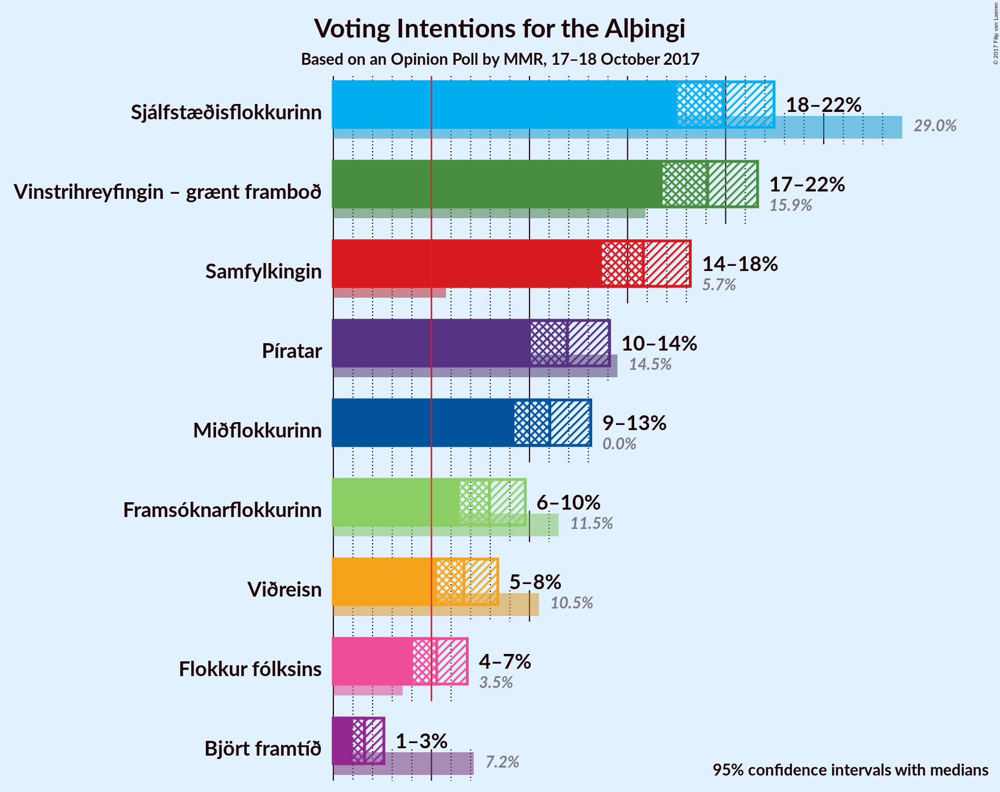
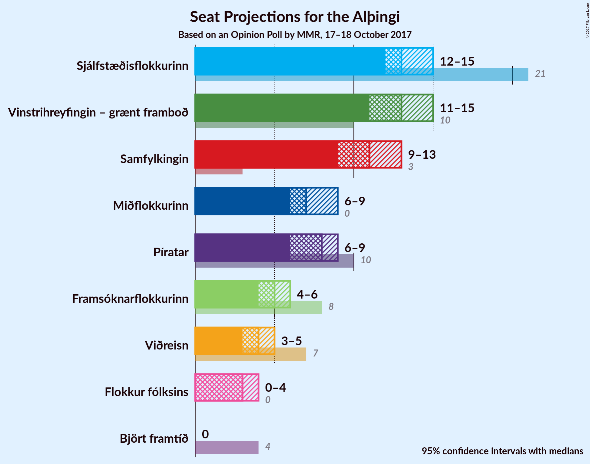
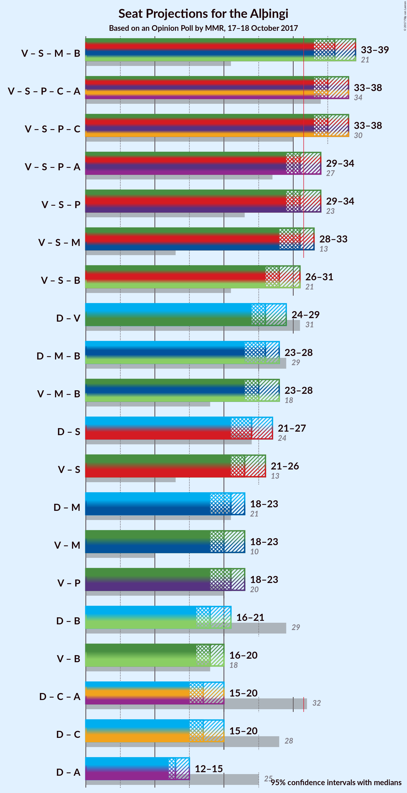

# Opinion Poll by MMR, 17–18 October 2017

<a href="#voting-intentions">Voting Intentions</a> | <a href="#seats">Seats</a> | <a href="#coalitions">Coalitions</a> | <a href="#technical-information">Technical Information</a>

## Voting Intentions

### Confidence Intervals

| Party | Last Result | Poll Result | 80% Confidence Interval | 90% Confidence Interval | 95% Confidence Interval | 99% Confidence Interval |
|:-----:|:-----------:|:-----------:|:-----------------------:|:-----------------------:|:-----------------------:|:-----------------------:|
| Sjálfstæðisflokkurinn | 29.0% | 19.9% | 18.3–21.6% |17.9–22.0% |17.5–22.5% |16.8–23.3% |
| Vinstrihreyfingin – grænt framboð | 15.9% | 19.1% | 17.6–20.7% |17.1–21.2% |16.8–21.6% |16.1–22.5% |
| Samfylkingin | 5.7% | 15.8% | 14.4–17.4% |14.0–17.8% |13.7–18.2% |13.0–19.0% |
| Píratar | 14.5% | 11.9% | 10.7–13.3% |10.4–13.7% |10.1–14.1% |9.5–14.8% |
| Miðflokkurinn | 0.0% | 11.0% | 9.9–12.4% |9.5–12.8% |9.2–13.1% |8.7–13.8% |
| Framsóknarflokkurinn | 11.5% | 8.0% | 7.0–9.2% |6.7–9.5% |6.4–9.8% |6.0–10.4% |
| Viðreisn | 10.5% | 6.7% | 5.7–7.8% |5.5–8.1% |5.3–8.4% |4.9–8.9% |
| Flokkur fólksins | 3.5% | 5.3% | 4.5–6.3% |4.2–6.6% |4.1–6.8% |3.7–7.3% |
| Björt framtíð | 7.2% | 1.6% | 1.2–2.2% |1.1–2.4% |1.0–2.6% |0.8–2.9% |

*Note:* The poll result column reflects the actual value used in the calculations. Published results may vary slightly, and in addition be rounded to fewer digits.

## Seats

### Confidence Intervals

| Party | Last Result | Median | 80% Confidence Interval | 90% Confidence Interval | 95% Confidence Interval | 99% Confidence Interval |
|:-----:|:-----------:|:------:|:-----------------------:|:-----------------------:|:-----------------------:|:-----------------------:|
| <a href="#sjálfstæðisflokkurinn">Sjálfstæðisflokkurinn</a> | 21 | 13 | 12–14 |12–15 |12–15 |11–16 |
| <a href="#vinstrihreyfingin-–-grænt-framboð">Vinstrihreyfingin – grænt framboð</a> | 10 | 13 | 12–14 |11–15 |11–15 |10–15 |
| <a href="#samfylkingin">Samfylkingin</a> | 3 | 11 | 9–12 |9–12 |9–13 |8–13 |
| <a href="#píratar">Píratar</a> | 10 | 8 | 7–9 |6–9 |6–9 |6–10 |
| <a href="#miðflokkurinn">Miðflokkurinn</a> | 0 | 7 | 6–8 |6–8 |6–9 |5–9 |
| <a href="#framsóknarflokkurinn">Framsóknarflokkurinn</a> | 8 | 5 | 4–6 |4–6 |4–6 |4–7 |
| <a href="#viðreisn">Viðreisn</a> | 7 | 4 | 3–5 |3–5 |3–5 |0–6 |
| <a href="#flokkur-fólksins">Flokkur fólksins</a> | 0 | 3 | 0–4 |0–4 |0–4 |0–4 |
| <a href="#björt-framtíð">Björt framtíð</a> | 4 | 0 | 0 |0 |0 |0 |

### Sjálfstæðisflokkurinn

*For a full overview of the results for this party, see the [Sjálfstæðisflokkurinn](party-sjlfstisflokkurinn.html) page.*

| Number of Seats | Probability | Accumulated | Special Marks |
|:---------------:|:-----------:|:-----------:|:-------------:|
| 10 | 0.2% | 100% |  |
| 11 | 2% | 99.8% |  |
| 12 | 11% | 98% |  |
| 13 | 49% | 87% | Median |
| 14 | 29% | 38% |  |
| 15 | 8% | 9% |  |
| 16 | 1.3% | 1.4% |  |
| 17 | 0.1% | 0.1% |  |
| 18 | 0% | 0% |  |
| 19 | 0% | 0% |  |
| 20 | 0% | 0% |  |
| 21 | 0% | 0% | Last Result |

### Vinstrihreyfingin – grænt framboð

*For a full overview of the results for this party, see the [Vinstrihreyfingin – grænt framboð](party-vinstrihreyfingingrntframbo.html) page.*

| Number of Seats | Probability | Accumulated | Special Marks |
|:---------------:|:-----------:|:-----------:|:-------------:|
| 10 | 0.6% | 100% | Last Result |
| 11 | 6% | 99.4% |  |
| 12 | 35% | 93% |  |
| 13 | 34% | 58% | Median |
| 14 | 18% | 24% |  |
| 15 | 6% | 6% |  |
| 16 | 0.4% | 0.4% |  |
| 17 | 0% | 0% |  |

### Samfylkingin

*For a full overview of the results for this party, see the [Samfylkingin](party-samfylkingin.html) page.*

| Number of Seats | Probability | Accumulated | Special Marks |
|:---------------:|:-----------:|:-----------:|:-------------:|
| 3 | 0% | 100% | Last Result |
| 4 | 0% | 100% |  |
| 5 | 0% | 100% |  |
| 6 | 0% | 100% |  |
| 7 | 0% | 100% |  |
| 8 | 0.8% | 100% |  |
| 9 | 14% | 99.2% |  |
| 10 | 25% | 86% |  |
| 11 | 39% | 61% | Median |
| 12 | 18% | 22% |  |
| 13 | 4% | 4% |  |
| 14 | 0.1% | 0.1% |  |
| 15 | 0% | 0% |  |

### Píratar

*For a full overview of the results for this party, see the [Píratar](party-pratar.html) page.*

| Number of Seats | Probability | Accumulated | Special Marks |
|:---------------:|:-----------:|:-----------:|:-------------:|
| 6 | 6% | 100% |  |
| 7 | 32% | 94% |  |
| 8 | 43% | 62% | Median |
| 9 | 17% | 19% |  |
| 10 | 1.4% | 1.5% | Last Result |
| 11 | 0% | 0% |  |

### Miðflokkurinn

*For a full overview of the results for this party, see the [Miðflokkurinn](party-miflokkurinn.html) page.*

| Number of Seats | Probability | Accumulated | Special Marks |
|:---------------:|:-----------:|:-----------:|:-------------:|
| 0 | 0% | 100% | Last Result |
| 1 | 0% | 100% |  |
| 2 | 0% | 100% |  |
| 3 | 0% | 100% |  |
| 4 | 0% | 100% |  |
| 5 | 0.9% | 100% |  |
| 6 | 13% | 99.1% |  |
| 7 | 45% | 86% | Median |
| 8 | 37% | 41% |  |
| 9 | 4% | 4% |  |
| 10 | 0.2% | 0.2% |  |
| 11 | 0% | 0% |  |

### Framsóknarflokkurinn

*For a full overview of the results for this party, see the [Framsóknarflokkurinn](party-framsknarflokkurinn.html) page.*

| Number of Seats | Probability | Accumulated | Special Marks |
|:---------------:|:-----------:|:-----------:|:-------------:|
| 3 | 0.3% | 100% |  |
| 4 | 19% | 99.7% |  |
| 5 | 62% | 81% | Median |
| 6 | 18% | 19% |  |
| 7 | 1.4% | 1.5% |  |
| 8 | 0.1% | 0.1% | Last Result |
| 9 | 0% | 0% |  |

### Viðreisn

*For a full overview of the results for this party, see the [Viðreisn](party-vireisn.html) page.*

| Number of Seats | Probability | Accumulated | Special Marks |
|:---------------:|:-----------:|:-----------:|:-------------:|
| 0 | 0.7% | 100% |  |
| 1 | 0% | 99.3% |  |
| 2 | 0% | 99.2% |  |
| 3 | 10% | 99.2% |  |
| 4 | 61% | 89% | Median |
| 5 | 27% | 28% |  |
| 6 | 1.0% | 1.0% |  |
| 7 | 0% | 0% | Last Result |

### Flokkur fólksins

*For a full overview of the results for this party, see the [Flokkur fólksins](party-flokkurflksins.html) page.*

| Number of Seats | Probability | Accumulated | Special Marks |
|:---------------:|:-----------:|:-----------:|:-------------:|
| 0 | 43% | 100% | Last Result |
| 1 | 0% | 57% |  |
| 2 | 0% | 57% |  |
| 3 | 39% | 57% | Median |
| 4 | 18% | 18% |  |
| 5 | 0.5% | 0.5% |  |
| 6 | 0% | 0% |  |

### Björt framtíð

*For a full overview of the results for this party, see the [Björt framtíð](party-bjrtframt.html) page.*

| Number of Seats | Probability | Accumulated | Special Marks |
|:---------------:|:-----------:|:-----------:|:-------------:|
| 0 | 100% | 100% | Median |
| 1 | 0% | 0% |  |
| 2 | 0% | 0% |  |
| 3 | 0% | 0% |  |
| 4 | 0% | 0% | Last Result |

## Coalitions

### Confidence Intervals

| Coalition | Last Result | Median | Majority? | 80% Confidence Interval | 90% Confidence Interval | 95% Confidence Interval | 99% Confidence Interval |
|:---------:|:-----------:|:------:|:---------:|:-----------------------:|:-----------------------:|:-----------------------:|:-----------------------:|
| Vinstrihreyfingin – grænt framboð – Samfylkingin – Miðflokkurinn – Framsóknarflokkurinn | 21 | 36 | 100% | 34–38 | 33–38 | 33–39 | 32–39 |
| Vinstrihreyfingin – grænt framboð – Samfylkingin – Píratar – Viðreisn – Björt framtíð | 34 | 35 | 99.7% | 33–37 | 33–38 | 33–38 | 32–39 |
| Vinstrihreyfingin – grænt framboð – Samfylkingin – Píratar – Viðreisn | 30 | 35 | 99.7% | 33–37 | 33–38 | 33–38 | 32–39 |
| Vinstrihreyfingin – grænt framboð – Samfylkingin – Píratar – Björt framtíð | 27 | 31 | 45% | 29–33 | 29–34 | 29–34 | 28–35 |
| Vinstrihreyfingin – grænt framboð – Samfylkingin – Píratar | 23 | 31 | 45% | 29–33 | 29–34 | 29–34 | 28–35 |
| Vinstrihreyfingin – grænt framboð – Samfylkingin – Miðflokkurinn | 13 | 31 | 35% | 29–33 | 28–33 | 28–34 | 27–34 |
| Vinstrihreyfingin – grænt framboð – Samfylkingin – Framsóknarflokkurinn | 21 | 28 | 1.2% | 27–31 | 26–31 | 26–31 | 25–32 |
| Sjálfstæðisflokkurinn – Vinstrihreyfingin – grænt framboð | 31 | 26 | 0% | 25–28 | 24–29 | 24–29 | 23–30 |
| Sjálfstæðisflokkurinn – Miðflokkurinn – Framsóknarflokkurinn | 29 | 26 | 0% | 24–27 | 24–28 | 23–28 | 22–29 |
| Vinstrihreyfingin – grænt framboð – Miðflokkurinn – Framsóknarflokkurinn | 18 | 25 | 0% | 23–27 | 23–28 | 23–28 | 22–28 |
| Sjálfstæðisflokkurinn – Samfylkingin | 24 | 24 | 0% | 22–26 | 22–26 | 21–26 | 21–27 |
| Vinstrihreyfingin – grænt framboð – Samfylkingin | 13 | 24 | 0% | 22–25 | 21–26 | 21–26 | 20–27 |
| Sjálfstæðisflokkurinn – Miðflokkurinn | 21 | 21 | 0% | 19–22 | 19–23 | 19–23 | 18–24 |
| Vinstrihreyfingin – grænt framboð – Miðflokkurinn | 10 | 20 | 0% | 18–22 | 18–22 | 18–23 | 17–23 |
| Vinstrihreyfingin – grænt framboð – Píratar | 20 | 21 | 0% | 19–22 | 18–23 | 18–23 | 17–24 |
| Sjálfstæðisflokkurinn – Framsóknarflokkurinn | 29 | 18 | 0% | 17–20 | 17–20 | 16–20 | 16–21 |
| Vinstrihreyfingin – grænt framboð – Framsóknarflokkurinn | 18 | 18 | 0% | 16–19 | 16–20 | 16–20 | 15–21 |
| Sjálfstæðisflokkurinn – Viðreisn – Björt framtíð | 32 | 18 | 0% | 16–19 | 16–19 | 15–20 | 14–20 |
| Sjálfstæðisflokkurinn – Viðreisn | 28 | 18 | 0% | 16–19 | 16–19 | 15–20 | 14–20 |
| Sjálfstæðisflokkurinn – Björt framtíð | 25 | 13 | 0% | 12–14 | 12–15 | 12–15 | 11–16 |

### Vinstrihreyfingin – grænt framboð – Samfylkingin – Miðflokkurinn – Framsóknarflokkurinn

| Number of Seats | Probability | Accumulated | Special Marks |
|:---------------:|:-----------:|:-----------:|:-------------:|
| 21 | 0% | 100% | Last Result |
| 22 | 0% | 100% |  |
| 23 | 0% | 100% |  |
| 24 | 0% | 100% |  |
| 25 | 0% | 100% |  |
| 26 | 0% | 100% |  |
| 27 | 0% | 100% |  |
| 28 | 0% | 100% |  |
| 29 | 0% | 100% |  |
| 30 | 0% | 100% |  |
| 31 | 0% | 100% |  |
| 32 | 1.0% | 100% | Majority |
| 33 | 5% | 99.0% |  |
| 34 | 13% | 94% |  |
| 35 | 25% | 81% |  |
| 36 | 19% | 56% | Median |
| 37 | 22% | 37% |  |
| 38 | 12% | 15% |  |
| 39 | 3% | 3% |  |
| 40 | 0.2% | 0.3% |  |
| 41 | 0% | 0% |  |

### Vinstrihreyfingin – grænt framboð – Samfylkingin – Píratar – Viðreisn – Björt framtíð

| Number of Seats | Probability | Accumulated | Special Marks |
|:---------------:|:-----------:|:-----------:|:-------------:|
| 31 | 0.2% | 100% |  |
| 32 | 2% | 99.7% | Majority |
| 33 | 9% | 98% |  |
| 34 | 15% | 89% | Last Result |
| 35 | 27% | 74% |  |
| 36 | 20% | 47% | Median |
| 37 | 18% | 27% |  |
| 38 | 7% | 9% |  |
| 39 | 1.0% | 1.2% |  |
| 40 | 0.2% | 0.2% |  |
| 41 | 0% | 0% |  |

### Vinstrihreyfingin – grænt framboð – Samfylkingin – Píratar – Viðreisn

| Number of Seats | Probability | Accumulated | Special Marks |
|:---------------:|:-----------:|:-----------:|:-------------:|
| 30 | 0% | 100% | Last Result |
| 31 | 0.2% | 100% |  |
| 32 | 2% | 99.7% | Majority |
| 33 | 9% | 98% |  |
| 34 | 15% | 89% |  |
| 35 | 27% | 74% |  |
| 36 | 20% | 47% | Median |
| 37 | 18% | 27% |  |
| 38 | 7% | 9% |  |
| 39 | 1.0% | 1.2% |  |
| 40 | 0.2% | 0.2% |  |
| 41 | 0% | 0% |  |

### Vinstrihreyfingin – grænt framboð – Samfylkingin – Píratar – Björt framtíð

| Number of Seats | Probability | Accumulated | Special Marks |
|:---------------:|:-----------:|:-----------:|:-------------:|
| 27 | 0.2% | 100% | Last Result |
| 28 | 2% | 99.8% |  |
| 29 | 9% | 98% |  |
| 30 | 21% | 89% |  |
| 31 | 23% | 68% |  |
| 32 | 24% | 45% | Median, Majority |
| 33 | 14% | 21% |  |
| 34 | 6% | 7% |  |
| 35 | 1.1% | 1.2% |  |
| 36 | 0.1% | 0.1% |  |
| 37 | 0% | 0% |  |

### Vinstrihreyfingin – grænt framboð – Samfylkingin – Píratar

| Number of Seats | Probability | Accumulated | Special Marks |
|:---------------:|:-----------:|:-----------:|:-------------:|
| 23 | 0% | 100% | Last Result |
| 24 | 0% | 100% |  |
| 25 | 0% | 100% |  |
| 26 | 0% | 100% |  |
| 27 | 0.2% | 100% |  |
| 28 | 2% | 99.8% |  |
| 29 | 9% | 98% |  |
| 30 | 21% | 89% |  |
| 31 | 23% | 68% |  |
| 32 | 24% | 45% | Median, Majority |
| 33 | 14% | 21% |  |
| 34 | 6% | 7% |  |
| 35 | 1.1% | 1.2% |  |
| 36 | 0.1% | 0.1% |  |
| 37 | 0% | 0% |  |

### Vinstrihreyfingin – grænt framboð – Samfylkingin – Miðflokkurinn

| Number of Seats | Probability | Accumulated | Special Marks |
|:---------------:|:-----------:|:-----------:|:-------------:|
| 13 | 0% | 100% | Last Result |
| 14 | 0% | 100% |  |
| 15 | 0% | 100% |  |
| 16 | 0% | 100% |  |
| 17 | 0% | 100% |  |
| 18 | 0% | 100% |  |
| 19 | 0% | 100% |  |
| 20 | 0% | 100% |  |
| 21 | 0% | 100% |  |
| 22 | 0% | 100% |  |
| 23 | 0% | 100% |  |
| 24 | 0% | 100% |  |
| 25 | 0% | 100% |  |
| 26 | 0% | 100% |  |
| 27 | 0.8% | 100% |  |
| 28 | 5% | 99.2% |  |
| 29 | 11% | 94% |  |
| 30 | 26% | 83% |  |
| 31 | 22% | 57% | Median |
| 32 | 23% | 35% | Majority |
| 33 | 9% | 12% |  |
| 34 | 3% | 3% |  |
| 35 | 0.2% | 0.2% |  |
| 36 | 0% | 0% |  |

### Vinstrihreyfingin – grænt framboð – Samfylkingin – Framsóknarflokkurinn

| Number of Seats | Probability | Accumulated | Special Marks |
|:---------------:|:-----------:|:-----------:|:-------------:|
| 21 | 0% | 100% | Last Result |
| 22 | 0% | 100% |  |
| 23 | 0% | 100% |  |
| 24 | 0.1% | 100% |  |
| 25 | 1.0% | 99.9% |  |
| 26 | 7% | 99.0% |  |
| 27 | 16% | 92% |  |
| 28 | 26% | 76% |  |
| 29 | 25% | 50% | Median |
| 30 | 15% | 25% |  |
| 31 | 9% | 10% |  |
| 32 | 1.2% | 1.2% | Majority |
| 33 | 0.1% | 0.1% |  |
| 34 | 0% | 0% |  |

### Sjálfstæðisflokkurinn – Vinstrihreyfingin – grænt framboð

| Number of Seats | Probability | Accumulated | Special Marks |
|:---------------:|:-----------:|:-----------:|:-------------:|
| 22 | 0.2% | 100% |  |
| 23 | 1.2% | 99.7% |  |
| 24 | 8% | 98.6% |  |
| 25 | 22% | 90% |  |
| 26 | 33% | 68% | Median |
| 27 | 19% | 36% |  |
| 28 | 12% | 17% |  |
| 29 | 5% | 6% |  |
| 30 | 0.6% | 0.6% |  |
| 31 | 0.1% | 0.1% | Last Result |
| 32 | 0% | 0% | Majority |

### Sjálfstæðisflokkurinn – Miðflokkurinn – Framsóknarflokkurinn

| Number of Seats | Probability | Accumulated | Special Marks |
|:---------------:|:-----------:|:-----------:|:-------------:|
| 21 | 0.1% | 100% |  |
| 22 | 0.5% | 99.9% |  |
| 23 | 3% | 99.3% |  |
| 24 | 13% | 97% |  |
| 25 | 30% | 84% | Median |
| 26 | 29% | 53% |  |
| 27 | 18% | 25% |  |
| 28 | 5% | 7% |  |
| 29 | 2% | 2% | Last Result |
| 30 | 0.1% | 0.1% |  |
| 31 | 0% | 0% |  |

### Vinstrihreyfingin – grænt framboð – Miðflokkurinn – Framsóknarflokkurinn

| Number of Seats | Probability | Accumulated | Special Marks |
|:---------------:|:-----------:|:-----------:|:-------------:|
| 18 | 0% | 100% | Last Result |
| 19 | 0% | 100% |  |
| 20 | 0% | 100% |  |
| 21 | 0.1% | 100% |  |
| 22 | 2% | 99.9% |  |
| 23 | 10% | 98% |  |
| 24 | 21% | 87% |  |
| 25 | 26% | 66% | Median |
| 26 | 25% | 41% |  |
| 27 | 9% | 16% |  |
| 28 | 6% | 6% |  |
| 29 | 0.3% | 0.3% |  |
| 30 | 0% | 0% |  |

### Sjálfstæðisflokkurinn – Samfylkingin

| Number of Seats | Probability | Accumulated | Special Marks |
|:---------------:|:-----------:|:-----------:|:-------------:|
| 20 | 0.2% | 100% |  |
| 21 | 3% | 99.8% |  |
| 22 | 10% | 97% |  |
| 23 | 15% | 87% |  |
| 24 | 37% | 72% | Last Result, Median |
| 25 | 22% | 35% |  |
| 26 | 11% | 13% |  |
| 27 | 2% | 2% |  |
| 28 | 0.2% | 0.2% |  |
| 29 | 0% | 0% |  |

### Vinstrihreyfingin – grænt framboð – Samfylkingin

| Number of Seats | Probability | Accumulated | Special Marks |
|:---------------:|:-----------:|:-----------:|:-------------:|
| 13 | 0% | 100% | Last Result |
| 14 | 0% | 100% |  |
| 15 | 0% | 100% |  |
| 16 | 0% | 100% |  |
| 17 | 0% | 100% |  |
| 18 | 0% | 100% |  |
| 19 | 0% | 100% |  |
| 20 | 0.5% | 100% |  |
| 21 | 6% | 99.5% |  |
| 22 | 15% | 93% |  |
| 23 | 27% | 78% |  |
| 24 | 29% | 51% | Median |
| 25 | 13% | 22% |  |
| 26 | 8% | 9% |  |
| 27 | 0.6% | 0.7% |  |
| 28 | 0.1% | 0.1% |  |
| 29 | 0% | 0% |  |

### Sjálfstæðisflokkurinn – Miðflokkurinn

| Number of Seats | Probability | Accumulated | Special Marks |
|:---------------:|:-----------:|:-----------:|:-------------:|
| 17 | 0.3% | 100% |  |
| 18 | 2% | 99.7% |  |
| 19 | 11% | 98% |  |
| 20 | 32% | 87% | Median |
| 21 | 34% | 54% | Last Result |
| 22 | 14% | 20% |  |
| 23 | 5% | 6% |  |
| 24 | 1.0% | 1.1% |  |
| 25 | 0.1% | 0.1% |  |
| 26 | 0% | 0% |  |

### Vinstrihreyfingin – grænt framboð – Miðflokkurinn

| Number of Seats | Probability | Accumulated | Special Marks |
|:---------------:|:-----------:|:-----------:|:-------------:|
| 10 | 0% | 100% | Last Result |
| 11 | 0% | 100% |  |
| 12 | 0% | 100% |  |
| 13 | 0% | 100% |  |
| 14 | 0% | 100% |  |
| 15 | 0% | 100% |  |
| 16 | 0.1% | 100% |  |
| 17 | 0.9% | 99.9% |  |
| 18 | 10% | 99.0% |  |
| 19 | 20% | 89% |  |
| 20 | 30% | 69% | Median |
| 21 | 28% | 39% |  |
| 22 | 7% | 11% |  |
| 23 | 4% | 5% |  |
| 24 | 0.4% | 0.4% |  |
| 25 | 0% | 0% |  |

### Vinstrihreyfingin – grænt framboð – Píratar

| Number of Seats | Probability | Accumulated | Special Marks |
|:---------------:|:-----------:|:-----------:|:-------------:|
| 17 | 0.6% | 100% |  |
| 18 | 5% | 99.4% |  |
| 19 | 17% | 95% |  |
| 20 | 22% | 77% | Last Result |
| 21 | 33% | 55% | Median |
| 22 | 16% | 23% |  |
| 23 | 6% | 7% |  |
| 24 | 0.8% | 0.8% |  |
| 25 | 0% | 0.1% |  |
| 26 | 0% | 0% |  |

### Sjálfstæðisflokkurinn – Framsóknarflokkurinn

| Number of Seats | Probability | Accumulated | Special Marks |
|:---------------:|:-----------:|:-----------:|:-------------:|
| 15 | 0.4% | 100% |  |
| 16 | 3% | 99.6% |  |
| 17 | 15% | 97% |  |
| 18 | 40% | 81% | Median |
| 19 | 27% | 41% |  |
| 20 | 12% | 14% |  |
| 21 | 2% | 2% |  |
| 22 | 0.3% | 0.3% |  |
| 23 | 0% | 0% |  |
| 24 | 0% | 0% |  |
| 25 | 0% | 0% |  |
| 26 | 0% | 0% |  |
| 27 | 0% | 0% |  |
| 28 | 0% | 0% |  |
| 29 | 0% | 0% | Last Result |

### Vinstrihreyfingin – grænt framboð – Framsóknarflokkurinn

| Number of Seats | Probability | Accumulated | Special Marks |
|:---------------:|:-----------:|:-----------:|:-------------:|
| 14 | 0.1% | 100% |  |
| 15 | 2% | 99.9% |  |
| 16 | 10% | 98% |  |
| 17 | 31% | 88% |  |
| 18 | 29% | 58% | Last Result, Median |
| 19 | 18% | 28% |  |
| 20 | 9% | 10% |  |
| 21 | 0.9% | 1.0% |  |
| 22 | 0.1% | 0.1% |  |
| 23 | 0% | 0% |  |

### Sjálfstæðisflokkurinn – Viðreisn – Björt framtíð

| Number of Seats | Probability | Accumulated | Special Marks |
|:---------------:|:-----------:|:-----------:|:-------------:|
| 13 | 0.2% | 100% |  |
| 14 | 0.7% | 99.7% |  |
| 15 | 3% | 99.1% |  |
| 16 | 12% | 96% |  |
| 17 | 32% | 84% | Median |
| 18 | 35% | 52% |  |
| 19 | 14% | 17% |  |
| 20 | 2% | 3% |  |
| 21 | 0.3% | 0.3% |  |
| 22 | 0% | 0% |  |
| 23 | 0% | 0% |  |
| 24 | 0% | 0% |  |
| 25 | 0% | 0% |  |
| 26 | 0% | 0% |  |
| 27 | 0% | 0% |  |
| 28 | 0% | 0% |  |
| 29 | 0% | 0% |  |
| 30 | 0% | 0% |  |
| 31 | 0% | 0% |  |
| 32 | 0% | 0% | Last Result, Majority |

### Sjálfstæðisflokkurinn – Viðreisn

| Number of Seats | Probability | Accumulated | Special Marks |
|:---------------:|:-----------:|:-----------:|:-------------:|
| 13 | 0.2% | 100% |  |
| 14 | 0.7% | 99.7% |  |
| 15 | 3% | 99.1% |  |
| 16 | 12% | 96% |  |
| 17 | 32% | 84% | Median |
| 18 | 35% | 52% |  |
| 19 | 14% | 17% |  |
| 20 | 2% | 3% |  |
| 21 | 0.3% | 0.3% |  |
| 22 | 0% | 0% |  |
| 23 | 0% | 0% |  |
| 24 | 0% | 0% |  |
| 25 | 0% | 0% |  |
| 26 | 0% | 0% |  |
| 27 | 0% | 0% |  |
| 28 | 0% | 0% | Last Result |

### Sjálfstæðisflokkurinn – Björt framtíð

| Number of Seats | Probability | Accumulated | Special Marks |
|:---------------:|:-----------:|:-----------:|:-------------:|
| 10 | 0.2% | 100% |  |
| 11 | 2% | 99.8% |  |
| 12 | 11% | 98% |  |
| 13 | 49% | 87% | Median |
| 14 | 29% | 38% |  |
| 15 | 8% | 9% |  |
| 16 | 1.3% | 1.4% |  |
| 17 | 0.1% | 0.1% |  |
| 18 | 0% | 0% |  |
| 19 | 0% | 0% |  |
| 20 | 0% | 0% |  |
| 21 | 0% | 0% |  |
| 22 | 0% | 0% |  |
| 23 | 0% | 0% |  |
| 24 | 0% | 0% |  |
| 25 | 0% | 0% | Last Result |

## Technical Information

### Opinion Poll

+ **Polling firm:** MMR
+ **Commissioner(s):** —
+ **Fieldwork period:** 17–18 October 2017

### Calculations

+ **Sample size:** 1006
+ **Simulations done:** 2,097,152
+ **Error estimate:** 1.43%

