# Opinion Poll by Félagsvísindastofnun for Morgunblaðið, 16–19 October 2017

<a href="#voting-intentions">Voting Intentions</a> | <a href="#seats">Seats</a> | <a href="#coalitions">Coalitions</a> | <a href="#technical-information">Technical Information</a>

## Voting Intentions

### Confidence Intervals

| Party | Last Result | Poll Result | 80% Confidence Interval | 90% Confidence Interval | 95% Confidence Interval | 99% Confidence Interval |
|:-----:|:-----------:|:-----------:|:-----------------------:|:-----------------------:|:-----------------------:|:-----------------------:|
| Sjálfstæðisflokkurinn | 29.0% | 25.1% | 23.9–26.4% |23.5–26.8% |23.2–27.1% |22.6–27.7% |
| Vinstrihreyfingin – grænt framboð | 15.9% | 23.2% | 22.0–24.5% |21.7–24.8% |21.4–25.1% |20.8–25.7% |
| Samfylkingin | 5.7% | 15.6% | 14.6–16.7% |14.3–17.0% |14.1–17.3% |13.6–17.8% |
| Miðflokkurinn | 0.0% | 9.8% | 9.0–10.7% |8.7–11.0% |8.6–11.2% |8.2–11.6% |
| Píratar | 14.5% | 8.2% | 7.4–9.1% |7.2–9.3% |7.1–9.5% |6.7–9.9% |
| Framsóknarflokkurinn | 11.5% | 7.1% | 6.4–7.9% |6.2–8.1% |6.1–8.4% |5.7–8.7% |
| Viðreisn | 10.5% | 5.7% | 5.1–6.5% |4.9–6.7% |4.8–6.8% |4.5–7.2% |
| Flokkur fólksins | 3.5% | 3.3% | 2.8–3.9% |2.7–4.1% |2.6–4.2% |2.4–4.5% |
| Björt framtíð | 7.2% | 1.5% | 1.2–1.9% |1.1–2.0% |1.0–2.1% |0.9–2.4% |
| Dögun | 1.7% | 0.2% | 0.1–0.4% |0.1–0.5% |0.1–0.5% |0.0–0.7% |
| Alþýðufylkingin | 0.3% | 0.1% | 0.0–0.3% |0.0–0.3% |0.0–0.4% |0.0–0.5% |

*Note:* The poll result column reflects the actual value used in the calculations. Published results may vary slightly, and in addition be rounded to fewer digits.

## Seats

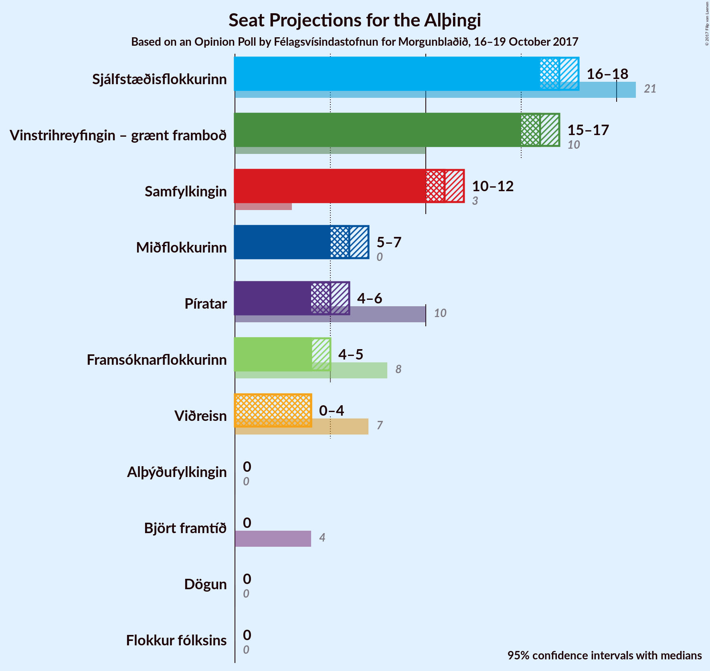

### Confidence Intervals

| Party | Last Result | Median | 80% Confidence Interval | 90% Confidence Interval | 95% Confidence Interval | 99% Confidence Interval |
|:-----:|:-----------:|:------:|:-----------------------:|:-----------------------:|:-----------------------:|:-----------------------:|
| <a href="#sjálfstæðisflokkurinn">Sjálfstæðisflokkurinn</a> | 21 | 17 | 16–18 |16–18 |16–18 |15–19 |
| <a href="#vinstrihreyfingin-–-grænt-framboð">Vinstrihreyfingin – grænt framboð</a> | 10 | 16 | 15–17 |15–17 |15–17 |14–19 |
| <a href="#samfylkingin">Samfylkingin</a> | 3 | 11 | 10–12 |10–12 |10–12 |9–12 |
| <a href="#miðflokkurinn">Miðflokkurinn</a> | 0 | 6 | 6–7 |6–7 |5–7 |5–8 |
| <a href="#píratar">Píratar</a> | 10 | 5 | 4–6 |4–6 |4–6 |4–6 |
| <a href="#framsóknarflokkurinn">Framsóknarflokkurinn</a> | 8 | 4 | 4–5 |4–5 |4–5 |3–5 |
| <a href="#viðreisn">Viðreisn</a> | 7 | 4 | 3–4 |3–4 |0–4 |0–5 |
| <a href="#flokkur-fólksins">Flokkur fólksins</a> | 0 | 0 | 0 |0 |0 |0 |
| <a href="#björt-framtíð">Björt framtíð</a> | 4 | 0 | 0 |0 |0 |0 |
| <a href="#dögun">Dögun</a> | 0 | 0 | 0 |0 |0 |0 |
| <a href="#alþýðufylkingin">Alþýðufylkingin</a> | 0 | 0 | 0 |0 |0 |0 |

### Sjálfstæðisflokkurinn

*For a full overview of the results for this party, see the [Sjálfstæðisflokkurinn](party-sjlfstisflokkurinn.html) page.*

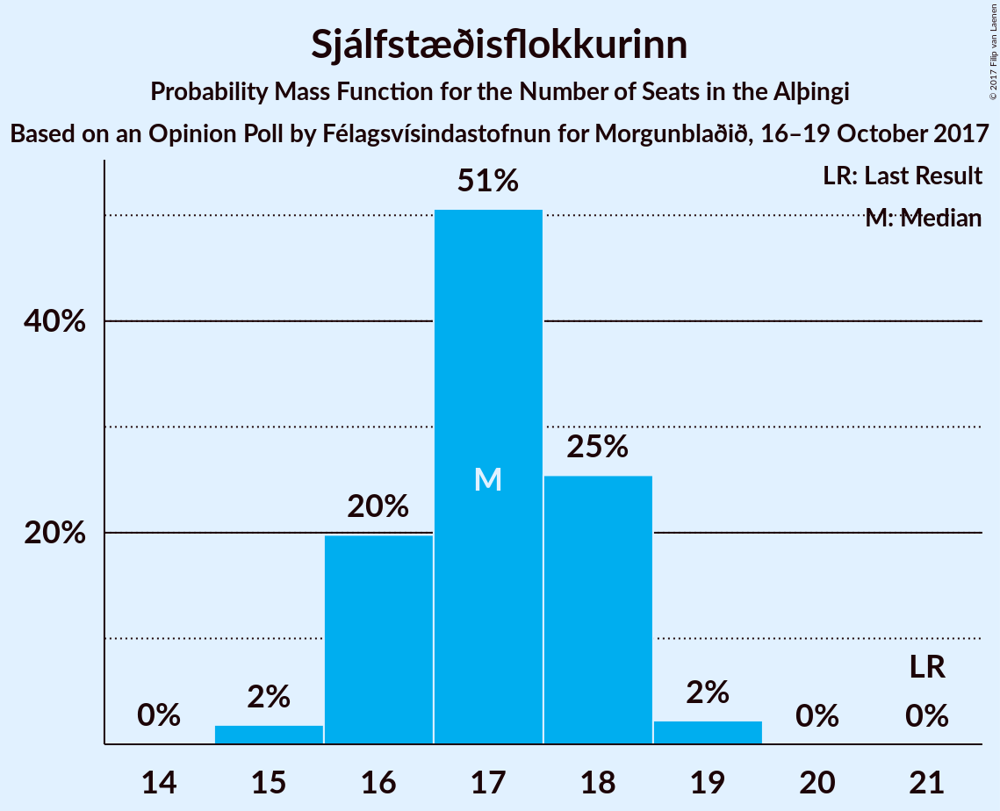

| Number of Seats | Probability | Accumulated | Special Marks |
|:---------------:|:-----------:|:-----------:|:-------------:|
| 15 | 2% | 100% |  |
| 16 | 20% | 98% |  |
| 17 | 51% | 78% | Median |
| 18 | 25% | 28% |  |
| 19 | 2% | 2% |  |
| 20 | 0% | 0% |  |
| 21 | 0% | 0% | Last Result |

### Vinstrihreyfingin – grænt framboð

*For a full overview of the results for this party, see the [Vinstrihreyfingin – grænt framboð](party-vinstrihreyfingingrntframbo.html) page.*

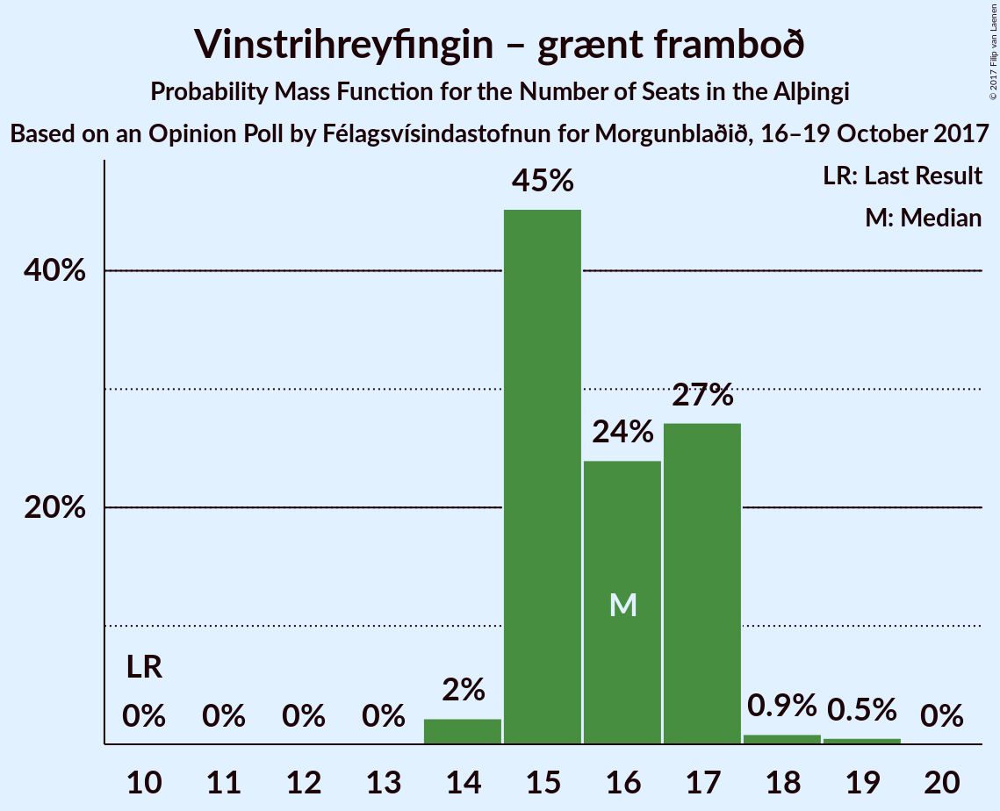

| Number of Seats | Probability | Accumulated | Special Marks |
|:---------------:|:-----------:|:-----------:|:-------------:|
| 10 | 0% | 100% | Last Result |
| 11 | 0% | 100% |  |
| 12 | 0% | 100% |  |
| 13 | 0% | 100% |  |
| 14 | 2% | 100% |  |
| 15 | 45% | 98% |  |
| 16 | 24% | 53% | Median |
| 17 | 27% | 29% |  |
| 18 | 0.9% | 1.4% |  |
| 19 | 0.5% | 0.5% |  |
| 20 | 0% | 0% |  |

### Samfylkingin

*For a full overview of the results for this party, see the [Samfylkingin](party-samfylkingin.html) page.*

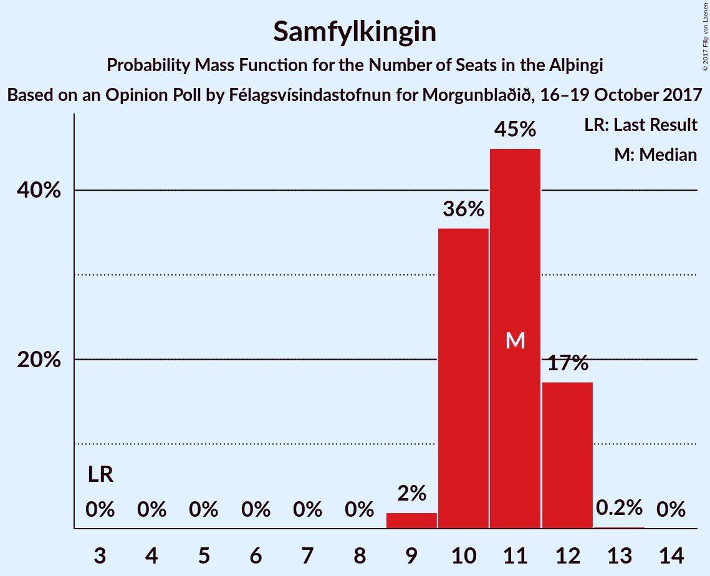

| Number of Seats | Probability | Accumulated | Special Marks |
|:---------------:|:-----------:|:-----------:|:-------------:|
| 3 | 0% | 100% | Last Result |
| 4 | 0% | 100% |  |
| 5 | 0% | 100% |  |
| 6 | 0% | 100% |  |
| 7 | 0% | 100% |  |
| 8 | 0% | 100% |  |
| 9 | 2% | 100% |  |
| 10 | 36% | 98% |  |
| 11 | 45% | 63% | Median |
| 12 | 17% | 18% |  |
| 13 | 0.2% | 0.2% |  |
| 14 | 0% | 0% |  |

### Miðflokkurinn

*For a full overview of the results for this party, see the [Miðflokkurinn](party-miflokkurinn.html) page.*

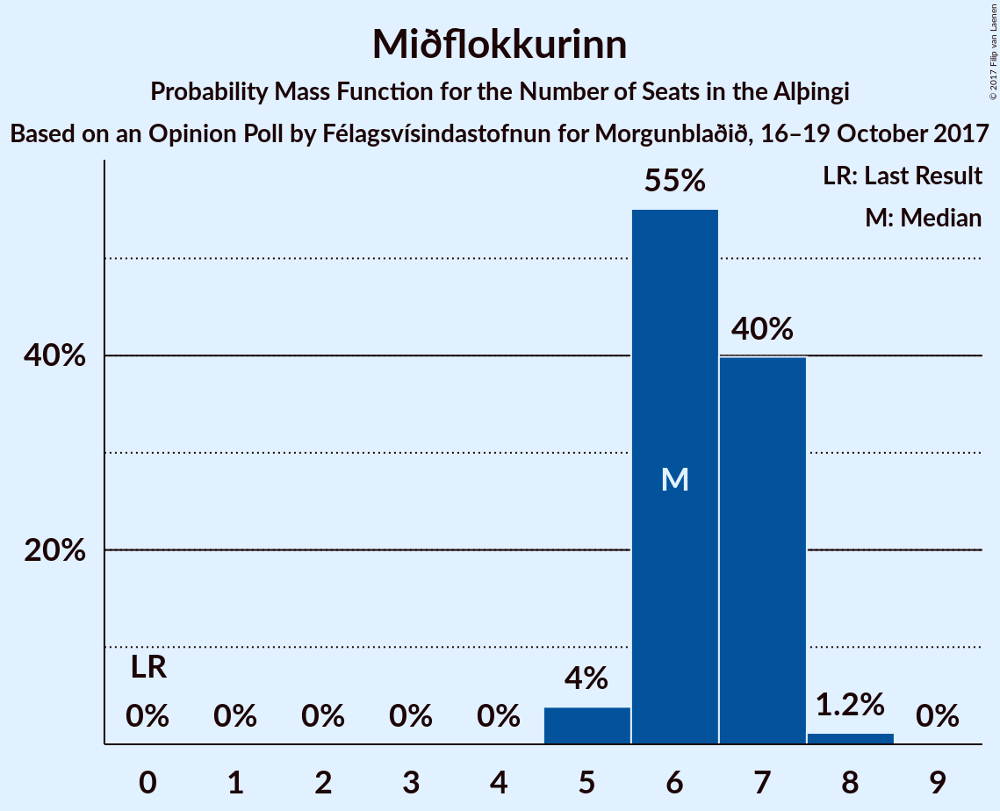

| Number of Seats | Probability | Accumulated | Special Marks |
|:---------------:|:-----------:|:-----------:|:-------------:|
| 0 | 0% | 100% | Last Result |
| 1 | 0% | 100% |  |
| 2 | 0% | 100% |  |
| 3 | 0% | 100% |  |
| 4 | 0% | 100% |  |
| 5 | 4% | 100% |  |
| 6 | 55% | 96% | Median |
| 7 | 40% | 41% |  |
| 8 | 1.2% | 1.2% |  |
| 9 | 0% | 0% |  |

### Píratar

*For a full overview of the results for this party, see the [Píratar](party-pratar.html) page.*

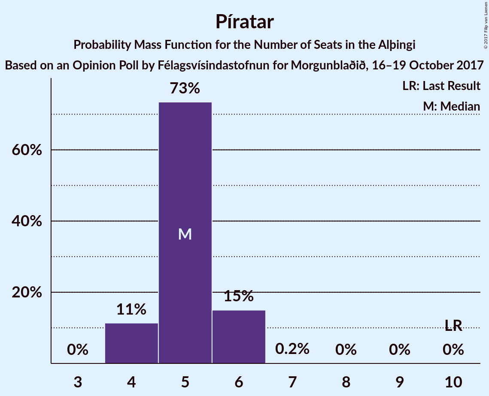

| Number of Seats | Probability | Accumulated | Special Marks |
|:---------------:|:-----------:|:-----------:|:-------------:|
| 4 | 11% | 100% |  |
| 5 | 73% | 89% | Median |
| 6 | 15% | 15% |  |
| 7 | 0.2% | 0.2% |  |
| 8 | 0% | 0% |  |
| 9 | 0% | 0% |  |
| 10 | 0% | 0% | Last Result |

### Framsóknarflokkurinn

*For a full overview of the results for this party, see the [Framsóknarflokkurinn](party-framsknarflokkurinn.html) page.*

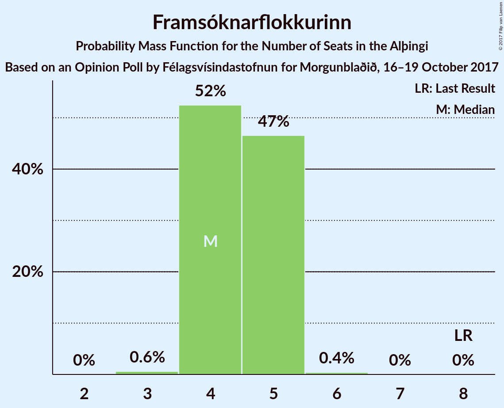

| Number of Seats | Probability | Accumulated | Special Marks |
|:---------------:|:-----------:|:-----------:|:-------------:|
| 3 | 0.6% | 100% |  |
| 4 | 52% | 99.4% | Median |
| 5 | 47% | 47% |  |
| 6 | 0.4% | 0.4% |  |
| 7 | 0% | 0% |  |
| 8 | 0% | 0% | Last Result |

### Viðreisn

*For a full overview of the results for this party, see the [Viðreisn](party-vireisn.html) page.*

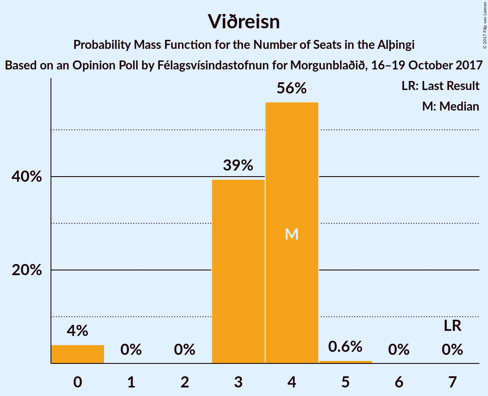

| Number of Seats | Probability | Accumulated | Special Marks |
|:---------------:|:-----------:|:-----------:|:-------------:|
| 0 | 4% | 100% |  |
| 1 | 0% | 96% |  |
| 2 | 0% | 96% |  |
| 3 | 39% | 96% |  |
| 4 | 56% | 57% | Median |
| 5 | 0.6% | 0.6% |  |
| 6 | 0% | 0% |  |
| 7 | 0% | 0% | Last Result |

### Flokkur fólksins

*For a full overview of the results for this party, see the [Flokkur fólksins](party-flokkurflksins.html) page.*

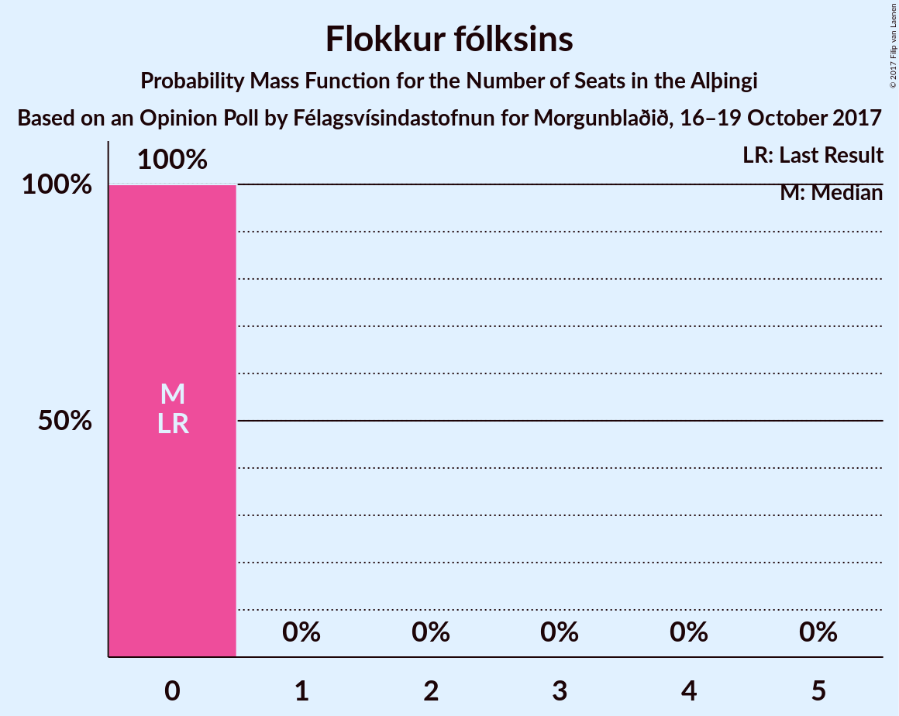

| Number of Seats | Probability | Accumulated | Special Marks |
|:---------------:|:-----------:|:-----------:|:-------------:|
| 0 | 100% | 100% | Last Result, Median |

### Björt framtíð

*For a full overview of the results for this party, see the [Björt framtíð](party-bjrtframt.html) page.*

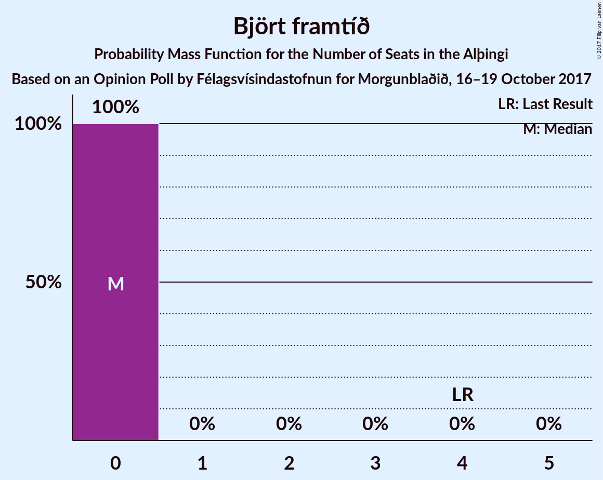

| Number of Seats | Probability | Accumulated | Special Marks |
|:---------------:|:-----------:|:-----------:|:-------------:|
| 0 | 100% | 100% | Median |
| 1 | 0% | 0% |  |
| 2 | 0% | 0% |  |
| 3 | 0% | 0% |  |
| 4 | 0% | 0% | Last Result |

### Dögun

*For a full overview of the results for this party, see the [Dögun](party-dgun.html) page.*

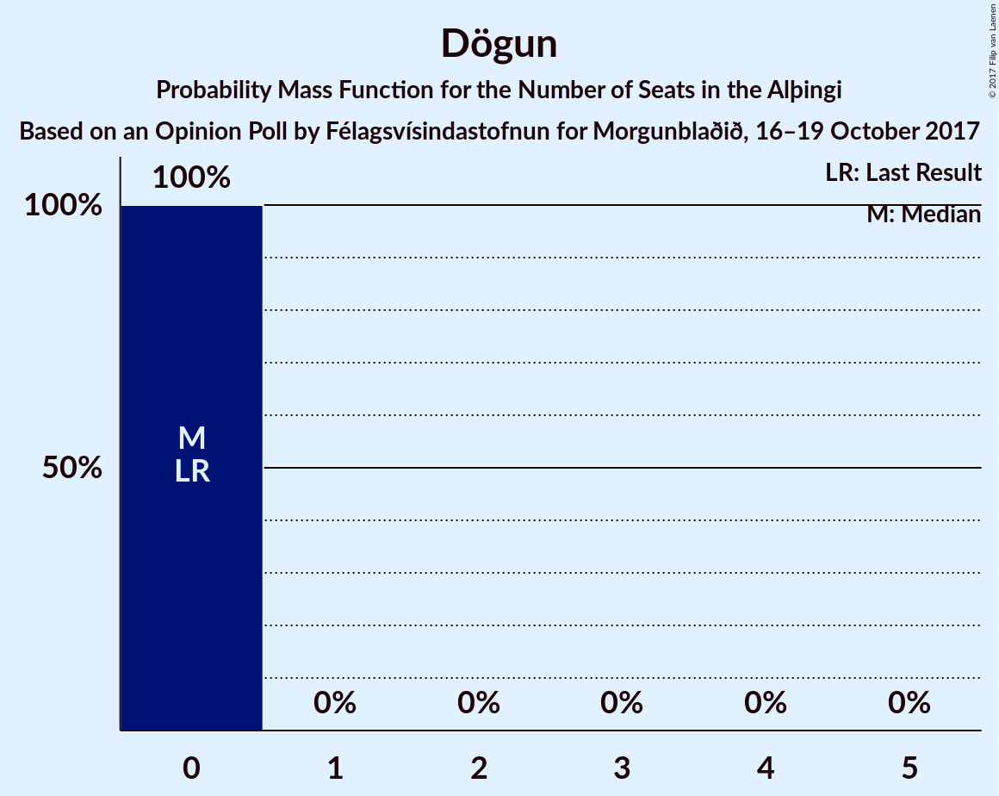

| Number of Seats | Probability | Accumulated | Special Marks |
|:---------------:|:-----------:|:-----------:|:-------------:|
| 0 | 100% | 100% | Last Result, Median |

### Alþýðufylkingin

*For a full overview of the results for this party, see the [Alþýðufylkingin](party-alufylkingin.html) page.*

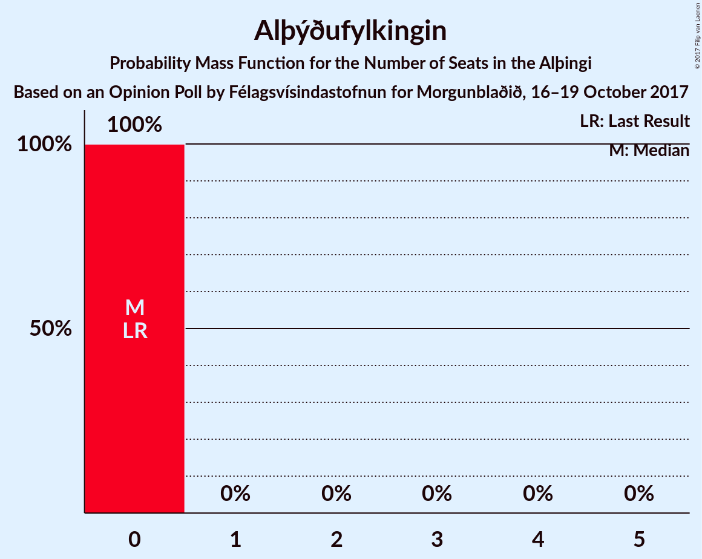

| Number of Seats | Probability | Accumulated | Special Marks |
|:---------------:|:-----------:|:-----------:|:-------------:|
| 0 | 100% | 100% | Last Result, Median |

## Coalitions

### Confidence Intervals

| Coalition | Last Result | Median | Majority? | 80% Confidence Interval | 90% Confidence Interval | 95% Confidence Interval | 99% Confidence Interval |
|:---------:|:-----------:|:------:|:---------:|:-----------------------:|:-----------------------:|:-----------------------:|:-----------------------:|
| Vinstrihreyfingin – grænt framboð – Samfylkingin – Miðflokkurinn – Framsóknarflokkurinn | 21 | 37 | 100% | 37–38 | 36–39 | 36–40 | 35–40 |
| Vinstrihreyfingin – grænt framboð – Samfylkingin – Píratar – Viðreisn – Björt framtíð | 34 | 35 | 100% | 34–36 | 34–36 | 33–37 | 33–38 |
| Vinstrihreyfingin – grænt framboð – Samfylkingin – Píratar – Viðreisn | 30 | 35 | 100% | 34–36 | 34–36 | 33–37 | 33–38 |
| Vinstrihreyfingin – grænt framboð – Samfylkingin – Miðflokkurinn | 13 | 33 | 97% | 32–34 | 32–34 | 31–35 | 31–36 |
| Sjálfstæðisflokkurinn – Vinstrihreyfingin – grænt framboð | 31 | 33 | 87% | 31–35 | 31–35 | 31–35 | 31–36 |
| Vinstrihreyfingin – grænt framboð – Samfylkingin – Píratar – Björt framtíð | 27 | 31 | 50% | 31–33 | 31–34 | 30–34 | 29–35 |
| Vinstrihreyfingin – grænt framboð – Samfylkingin – Píratar | 23 | 31 | 50% | 31–33 | 31–34 | 30–34 | 29–35 |
| Vinstrihreyfingin – grænt framboð – Samfylkingin – Framsóknarflokkurinn | 21 | 31 | 25% | 30–32 | 30–33 | 29–33 | 28–34 |
| Sjálfstæðisflokkurinn – Miðflokkurinn – Framsóknarflokkurinn | 29 | 28 | 0% | 27–29 | 27–29 | 26–30 | 25–30 |
| Sjálfstæðisflokkurinn – Samfylkingin | 24 | 28 | 0% | 27–29 | 26–29 | 26–30 | 25–30 |
| Vinstrihreyfingin – grænt framboð – Miðflokkurinn – Framsóknarflokkurinn | 18 | 27 | 0% | 26–28 | 26–28 | 25–29 | 25–29 |
| Vinstrihreyfingin – grænt framboð – Samfylkingin | 13 | 26 | 0% | 26–28 | 25–28 | 25–29 | 24–29 |
| Sjálfstæðisflokkurinn – Miðflokkurinn | 21 | 23 | 0% | 23–24 | 22–25 | 21–25 | 21–26 |
| Vinstrihreyfingin – grænt framboð – Miðflokkurinn | 10 | 22 | 0% | 21–24 | 21–24 | 21–24 | 21–25 |
| Sjálfstæðisflokkurinn – Framsóknarflokkurinn | 29 | 22 | 0% | 21–22 | 20–23 | 20–23 | 19–24 |
| Vinstrihreyfingin – grænt framboð – Píratar | 20 | 20 | 0% | 20–22 | 20–22 | 20–23 | 19–24 |
| Vinstrihreyfingin – grænt framboð – Framsóknarflokkurinn | 18 | 20 | 0% | 19–21 | 19–22 | 19–22 | 18–23 |
| Sjálfstæðisflokkurinn – Viðreisn – Björt framtíð | 32 | 21 | 0% | 19–21 | 19–22 | 18–22 | 17–23 |
| Sjálfstæðisflokkurinn – Viðreisn | 28 | 21 | 0% | 19–21 | 19–22 | 18–22 | 17–23 |
| Sjálfstæðisflokkurinn – Björt framtíð | 25 | 17 | 0% | 16–18 | 16–18 | 16–18 | 15–19 |

### Vinstrihreyfingin – grænt framboð – Samfylkingin – Miðflokkurinn – Framsóknarflokkurinn

| Number of Seats | Probability | Accumulated | Special Marks |
|:---------------:|:-----------:|:-----------:|:-------------:|
| 21 | 0% | 100% | Last Result |
| 22 | 0% | 100% |  |
| 23 | 0% | 100% |  |
| 24 | 0% | 100% |  |
| 25 | 0% | 100% |  |
| 26 | 0% | 100% |  |
| 27 | 0% | 100% |  |
| 28 | 0% | 100% |  |
| 29 | 0% | 100% |  |
| 30 | 0% | 100% |  |
| 31 | 0% | 100% |  |
| 32 | 0% | 100% | Majority |
| 33 | 0% | 100% |  |
| 34 | 0.1% | 100% |  |
| 35 | 2% | 99.9% |  |
| 36 | 8% | 98% |  |
| 37 | 46% | 90% | Median |
| 38 | 37% | 44% |  |
| 39 | 5% | 8% |  |
| 40 | 2% | 3% |  |
| 41 | 0.4% | 0.4% |  |
| 42 | 0% | 0% |  |

### Vinstrihreyfingin – grænt framboð – Samfylkingin – Píratar – Viðreisn – Björt framtíð

| Number of Seats | Probability | Accumulated | Special Marks |
|:---------------:|:-----------:|:-----------:|:-------------:|
| 32 | 0.3% | 100% | Majority |
| 33 | 3% | 99.7% |  |
| 34 | 8% | 97% | Last Result |
| 35 | 72% | 89% |  |
| 36 | 12% | 17% | Median |
| 37 | 3% | 5% |  |
| 38 | 2% | 2% |  |
| 39 | 0% | 0% |  |

### Vinstrihreyfingin – grænt framboð – Samfylkingin – Píratar – Viðreisn

| Number of Seats | Probability | Accumulated | Special Marks |
|:---------------:|:-----------:|:-----------:|:-------------:|
| 30 | 0% | 100% | Last Result |
| 31 | 0% | 100% |  |
| 32 | 0.3% | 100% | Majority |
| 33 | 3% | 99.7% |  |
| 34 | 8% | 97% |  |
| 35 | 72% | 89% |  |
| 36 | 12% | 17% | Median |
| 37 | 3% | 5% |  |
| 38 | 2% | 2% |  |
| 39 | 0% | 0% |  |

### Vinstrihreyfingin – grænt framboð – Samfylkingin – Miðflokkurinn

| Number of Seats | Probability | Accumulated | Special Marks |
|:---------------:|:-----------:|:-----------:|:-------------:|
| 13 | 0% | 100% | Last Result |
| 14 | 0% | 100% |  |
| 15 | 0% | 100% |  |
| 16 | 0% | 100% |  |
| 17 | 0% | 100% |  |
| 18 | 0% | 100% |  |
| 19 | 0% | 100% |  |
| 20 | 0% | 100% |  |
| 21 | 0% | 100% |  |
| 22 | 0% | 100% |  |
| 23 | 0% | 100% |  |
| 24 | 0% | 100% |  |
| 25 | 0% | 100% |  |
| 26 | 0% | 100% |  |
| 27 | 0% | 100% |  |
| 28 | 0% | 100% |  |
| 29 | 0% | 100% |  |
| 30 | 0.2% | 100% |  |
| 31 | 3% | 99.8% |  |
| 32 | 26% | 97% | Majority |
| 33 | 46% | 71% | Median |
| 34 | 21% | 25% |  |
| 35 | 4% | 5% |  |
| 36 | 0.8% | 0.8% |  |
| 37 | 0.1% | 0.1% |  |
| 38 | 0% | 0% |  |

### Sjálfstæðisflokkurinn – Vinstrihreyfingin – grænt framboð

| Number of Seats | Probability | Accumulated | Special Marks |
|:---------------:|:-----------:|:-----------:|:-------------:|
| 30 | 0.4% | 100% |  |
| 31 | 12% | 99.5% | Last Result |
| 32 | 37% | 87% | Majority |
| 33 | 18% | 50% | Median |
| 34 | 16% | 32% |  |
| 35 | 16% | 17% |  |
| 36 | 0.6% | 0.7% |  |
| 37 | 0.1% | 0.1% |  |
| 38 | 0% | 0% |  |

### Vinstrihreyfingin – grænt framboð – Samfylkingin – Píratar – Björt framtíð

| Number of Seats | Probability | Accumulated | Special Marks |
|:---------------:|:-----------:|:-----------:|:-------------:|
| 27 | 0% | 100% | Last Result |
| 28 | 0% | 100% |  |
| 29 | 1.2% | 100% |  |
| 30 | 3% | 98.8% |  |
| 31 | 46% | 96% |  |
| 32 | 38% | 50% | Median, Majority |
| 33 | 5% | 11% |  |
| 34 | 5% | 6% |  |
| 35 | 1.1% | 1.1% |  |
| 36 | 0% | 0% |  |

### Vinstrihreyfingin – grænt framboð – Samfylkingin – Píratar

| Number of Seats | Probability | Accumulated | Special Marks |
|:---------------:|:-----------:|:-----------:|:-------------:|
| 23 | 0% | 100% | Last Result |
| 24 | 0% | 100% |  |
| 25 | 0% | 100% |  |
| 26 | 0% | 100% |  |
| 27 | 0% | 100% |  |
| 28 | 0% | 100% |  |
| 29 | 1.2% | 100% |  |
| 30 | 3% | 98.8% |  |
| 31 | 46% | 96% |  |
| 32 | 38% | 50% | Median, Majority |
| 33 | 5% | 11% |  |
| 34 | 5% | 6% |  |
| 35 | 1.1% | 1.1% |  |
| 36 | 0% | 0% |  |

### Vinstrihreyfingin – grænt framboð – Samfylkingin – Framsóknarflokkurinn

| Number of Seats | Probability | Accumulated | Special Marks |
|:---------------:|:-----------:|:-----------:|:-------------:|
| 21 | 0% | 100% | Last Result |
| 22 | 0% | 100% |  |
| 23 | 0% | 100% |  |
| 24 | 0% | 100% |  |
| 25 | 0% | 100% |  |
| 26 | 0% | 100% |  |
| 27 | 0% | 100% |  |
| 28 | 1.2% | 100% |  |
| 29 | 3% | 98.8% |  |
| 30 | 19% | 96% |  |
| 31 | 52% | 77% | Median |
| 32 | 18% | 25% | Majority |
| 33 | 7% | 7% |  |
| 34 | 0.8% | 0.9% |  |
| 35 | 0% | 0% |  |

### Sjálfstæðisflokkurinn – Miðflokkurinn – Framsóknarflokkurinn

| Number of Seats | Probability | Accumulated | Special Marks |
|:---------------:|:-----------:|:-----------:|:-------------:|
| 25 | 2% | 100% |  |
| 26 | 3% | 98% |  |
| 27 | 12% | 95% | Median |
| 28 | 72% | 83% |  |
| 29 | 8% | 11% | Last Result |
| 30 | 3% | 3% |  |
| 31 | 0.3% | 0.3% |  |
| 32 | 0% | 0% | Majority |

### Sjálfstæðisflokkurinn – Samfylkingin

| Number of Seats | Probability | Accumulated | Special Marks |
|:---------------:|:-----------:|:-----------:|:-------------:|
| 24 | 0% | 100% | Last Result |
| 25 | 0.6% | 100% |  |
| 26 | 4% | 99.4% |  |
| 27 | 25% | 95% |  |
| 28 | 54% | 70% | Median |
| 29 | 12% | 16% |  |
| 30 | 3% | 4% |  |
| 31 | 0.4% | 0.4% |  |
| 32 | 0% | 0% | Majority |

### Vinstrihreyfingin – grænt framboð – Miðflokkurinn – Framsóknarflokkurinn

| Number of Seats | Probability | Accumulated | Special Marks |
|:---------------:|:-----------:|:-----------:|:-------------:|
| 18 | 0% | 100% | Last Result |
| 19 | 0% | 100% |  |
| 20 | 0% | 100% |  |
| 21 | 0% | 100% |  |
| 22 | 0% | 100% |  |
| 23 | 0% | 100% |  |
| 24 | 0.1% | 100% |  |
| 25 | 4% | 99.9% |  |
| 26 | 46% | 96% | Median |
| 27 | 34% | 50% |  |
| 28 | 13% | 16% |  |
| 29 | 3% | 3% |  |
| 30 | 0.3% | 0.3% |  |
| 31 | 0% | 0% |  |

### Vinstrihreyfingin – grænt framboð – Samfylkingin

| Number of Seats | Probability | Accumulated | Special Marks |
|:---------------:|:-----------:|:-----------:|:-------------:|
| 13 | 0% | 100% | Last Result |
| 14 | 0% | 100% |  |
| 15 | 0% | 100% |  |
| 16 | 0% | 100% |  |
| 17 | 0% | 100% |  |
| 18 | 0% | 100% |  |
| 19 | 0% | 100% |  |
| 20 | 0% | 100% |  |
| 21 | 0% | 100% |  |
| 22 | 0% | 100% |  |
| 23 | 0% | 100% |  |
| 24 | 2% | 100% |  |
| 25 | 5% | 98% |  |
| 26 | 46% | 94% |  |
| 27 | 31% | 48% | Median |
| 28 | 14% | 16% |  |
| 29 | 3% | 3% |  |
| 30 | 0.2% | 0.2% |  |
| 31 | 0% | 0% |  |

### Sjálfstæðisflokkurinn – Miðflokkurinn

| Number of Seats | Probability | Accumulated | Special Marks |
|:---------------:|:-----------:|:-----------:|:-------------:|
| 20 | 0.1% | 100% |  |
| 21 | 3% | 99.9% | Last Result |
| 22 | 6% | 97% |  |
| 23 | 43% | 92% | Median |
| 24 | 42% | 48% |  |
| 25 | 5% | 6% |  |
| 26 | 1.4% | 1.4% |  |
| 27 | 0% | 0% |  |

### Vinstrihreyfingin – grænt framboð – Miðflokkurinn

| Number of Seats | Probability | Accumulated | Special Marks |
|:---------------:|:-----------:|:-----------:|:-------------:|
| 10 | 0% | 100% | Last Result |
| 11 | 0% | 100% |  |
| 12 | 0% | 100% |  |
| 13 | 0% | 100% |  |
| 14 | 0% | 100% |  |
| 15 | 0% | 100% |  |
| 16 | 0% | 100% |  |
| 17 | 0% | 100% |  |
| 18 | 0% | 100% |  |
| 19 | 0% | 100% |  |
| 20 | 0.3% | 100% |  |
| 21 | 25% | 99.6% |  |
| 22 | 42% | 74% | Median |
| 23 | 22% | 33% |  |
| 24 | 10% | 11% |  |
| 25 | 1.0% | 1.0% |  |
| 26 | 0% | 0% |  |

### Sjálfstæðisflokkurinn – Framsóknarflokkurinn

| Number of Seats | Probability | Accumulated | Special Marks |
|:---------------:|:-----------:|:-----------:|:-------------:|
| 19 | 1.3% | 100% |  |
| 20 | 6% | 98.7% |  |
| 21 | 39% | 93% | Median |
| 22 | 47% | 54% |  |
| 23 | 6% | 7% |  |
| 24 | 0.6% | 0.6% |  |
| 25 | 0% | 0% |  |
| 26 | 0% | 0% |  |
| 27 | 0% | 0% |  |
| 28 | 0% | 0% |  |
| 29 | 0% | 0% | Last Result |

### Vinstrihreyfingin – grænt framboð – Píratar

| Number of Seats | Probability | Accumulated | Special Marks |
|:---------------:|:-----------:|:-----------:|:-------------:|
| 19 | 2% | 100% |  |
| 20 | 50% | 98% | Last Result |
| 21 | 16% | 48% | Median |
| 22 | 27% | 32% |  |
| 23 | 4% | 5% |  |
| 24 | 0.6% | 0.6% |  |
| 25 | 0% | 0% |  |

### Vinstrihreyfingin – grænt framboð – Framsóknarflokkurinn

| Number of Seats | Probability | Accumulated | Special Marks |
|:---------------:|:-----------:|:-----------:|:-------------:|
| 18 | 2% | 100% | Last Result |
| 19 | 14% | 98% |  |
| 20 | 46% | 84% | Median |
| 21 | 32% | 38% |  |
| 22 | 5% | 6% |  |
| 23 | 1.0% | 1.1% |  |
| 24 | 0% | 0% |  |

### Sjálfstæðisflokkurinn – Viðreisn – Björt framtíð

| Number of Seats | Probability | Accumulated | Special Marks |
|:---------------:|:-----------:|:-----------:|:-------------:|
| 17 | 2% | 100% |  |
| 18 | 1.4% | 98% |  |
| 19 | 7% | 96% |  |
| 20 | 27% | 89% |  |
| 21 | 56% | 62% | Median |
| 22 | 4% | 6% |  |
| 23 | 1.2% | 1.2% |  |
| 24 | 0% | 0% |  |
| 25 | 0% | 0% |  |
| 26 | 0% | 0% |  |
| 27 | 0% | 0% |  |
| 28 | 0% | 0% |  |
| 29 | 0% | 0% |  |
| 30 | 0% | 0% |  |
| 31 | 0% | 0% |  |
| 32 | 0% | 0% | Last Result, Majority |

### Sjálfstæðisflokkurinn – Viðreisn

| Number of Seats | Probability | Accumulated | Special Marks |
|:---------------:|:-----------:|:-----------:|:-------------:|
| 17 | 2% | 100% |  |
| 18 | 1.4% | 98% |  |
| 19 | 7% | 96% |  |
| 20 | 27% | 89% |  |
| 21 | 56% | 62% | Median |
| 22 | 4% | 6% |  |
| 23 | 1.2% | 1.2% |  |
| 24 | 0% | 0% |  |
| 25 | 0% | 0% |  |
| 26 | 0% | 0% |  |
| 27 | 0% | 0% |  |
| 28 | 0% | 0% | Last Result |

### Sjálfstæðisflokkurinn – Björt framtíð

| Number of Seats | Probability | Accumulated | Special Marks |
|:---------------:|:-----------:|:-----------:|:-------------:|
| 15 | 2% | 100% |  |
| 16 | 20% | 98% |  |
| 17 | 51% | 78% | Median |
| 18 | 25% | 28% |  |
| 19 | 2% | 2% |  |
| 20 | 0% | 0% |  |
| 21 | 0% | 0% |  |
| 22 | 0% | 0% |  |
| 23 | 0% | 0% |  |
| 24 | 0% | 0% |  |
| 25 | 0% | 0% | Last Result |

## Technical Information

### Opinion Poll

+ **Polling firm:** Félagsvísindastofnun
+ **Commissioner(s):** Morgunblaðið
+ **Fieldwork period:** 16–19 October 2017

### Calculations

+ **Sample size:** 1940
+ **Simulations done:** 4,194,304
+ **Error estimate:** 1.69%

