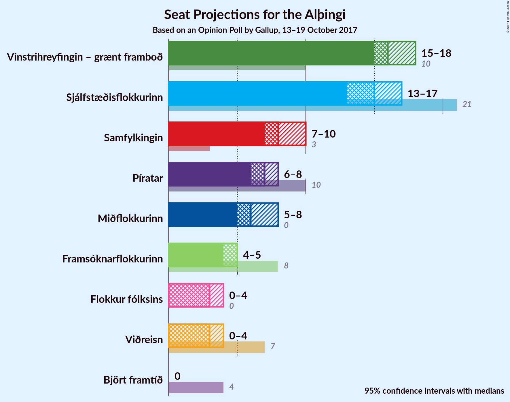
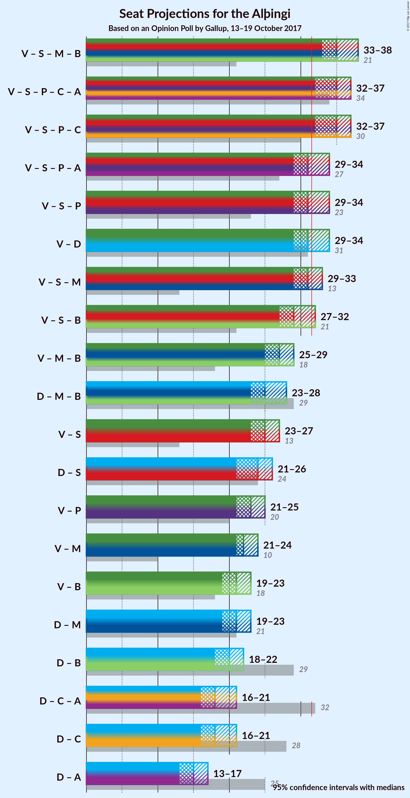

# Opinion Poll by Gallup, 13–19 October 2017

<a href="#voting-intentions">Voting Intentions</a> | <a href="#seats">Seats</a> | <a href="#coalitions">Coalitions</a> | <a href="#technical-information">Technical Information</a>

## Voting Intentions

### Confidence Intervals

| Party | Last Result | Poll Result | 80% Confidence Interval | 90% Confidence Interval | 95% Confidence Interval | 99% Confidence Interval |
|:-----:|:-----------:|:-----------:|:-----------------------:|:-----------------------:|:-----------------------:|:-----------------------:|
| Vinstrihreyfingin – grænt framboð | 15.9% | 23.3% | 22.0–24.7% |21.7–25.0% |21.4–25.4% |20.8–26.0% |
| Sjálfstæðisflokkurinn | 29.0% | 22.6% | 21.3–23.9% |21.0–24.3% |20.7–24.6% |20.1–25.3% |
| Samfylkingin | 5.7% | 13.3% | 12.3–14.4% |12.0–14.7% |11.8–15.0% |11.3–15.5% |
| Píratar | 14.5% | 10.7% | 9.8–11.7% |9.5–12.0% |9.3–12.3% |8.9–12.8% |
| Miðflokkurinn | 0.0% | 9.4% | 8.6–10.4% |8.3–10.7% |8.1–10.9% |7.7–11.4% |
| Framsóknarflokkurinn | 11.5% | 7.4% | 6.7–8.3% |6.4–8.6% |6.3–8.8% |5.9–9.2% |
| Viðreisn | 10.5% | 5.8% | 5.2–6.6% |5.0–6.8% |4.8–7.0% |4.5–7.4% |
| Flokkur fólksins | 3.5% | 5.7% | 5.0–6.5% |4.9–6.7% |4.7–6.9% |4.4–7.3% |
| Björt framtíð | 7.2% | 1.2% | 0.9–1.6% |0.8–1.7% |0.8–1.8% |0.6–2.0% |

*Note:* The poll result column reflects the actual value used in the calculations. Published results may vary slightly, and in addition be rounded to fewer digits.

## Seats

### Confidence Intervals

| Party | Last Result | Median | 80% Confidence Interval | 90% Confidence Interval | 95% Confidence Interval | 99% Confidence Interval |
|:-----:|:-----------:|:------:|:-----------------------:|:-----------------------:|:-----------------------:|:-----------------------:|
| <a href="#vinstrihreyfingin-–-grænt-framboð">Vinstrihreyfingin – grænt framboð</a> | 10 | 16 | 16–17 |15–18 |15–18 |14–19 |
| <a href="#sjálfstæðisflokkurinn">Sjálfstæðisflokkurinn</a> | 21 | 15 | 14–16 |14–17 |13–17 |13–18 |
| <a href="#samfylkingin">Samfylkingin</a> | 3 | 9 | 8–9 |7–10 |7–10 |7–11 |
| <a href="#píratar">Píratar</a> | 10 | 7 | 6–7 |6–8 |6–8 |5–8 |
| <a href="#miðflokkurinn">Miðflokkurinn</a> | 0 | 6 | 5–7 |5–7 |5–7 |4–8 |
| <a href="#framsóknarflokkurinn">Framsóknarflokkurinn</a> | 8 | 5 | 4–5 |4–5 |4–5 |3–6 |
| <a href="#viðreisn">Viðreisn</a> | 7 | 3 | 3–4 |0–4 |0–4 |0–4 |
| <a href="#flokkur-fólksins">Flokkur fólksins</a> | 0 | 3 | 0–4 |0–4 |0–4 |0–4 |
| <a href="#björt-framtíð">Björt framtíð</a> | 4 | 0 | 0 |0 |0 |0 |

### Vinstrihreyfingin – grænt framboð

*For a full overview of the results for this party, see the [Vinstrihreyfingin – grænt framboð](party-vinstrihreyfingingrntframbo.html) page.*

| Number of Seats | Probability | Accumulated | Special Marks |
|:---------------:|:-----------:|:-----------:|:-------------:|
| 10 | 0% | 100% | Last Result |
| 11 | 0% | 100% |  |
| 12 | 0% | 100% |  |
| 13 | 0.3% | 100% |  |
| 14 | 2% | 99.7% |  |
| 15 | 4% | 98% |  |
| 16 | 53% | 94% | Median |
| 17 | 35% | 41% |  |
| 18 | 4% | 6% |  |
| 19 | 2% | 2% |  |
| 20 | 0.2% | 0.2% |  |
| 21 | 0% | 0% |  |

### Sjálfstæðisflokkurinn

*For a full overview of the results for this party, see the [Sjálfstæðisflokkurinn](party-sjlfstisflokkurinn.html) page.*

| Number of Seats | Probability | Accumulated | Special Marks |
|:---------------:|:-----------:|:-----------:|:-------------:|
| 13 | 5% | 100% |  |
| 14 | 11% | 95% |  |
| 15 | 64% | 84% | Median |
| 16 | 14% | 20% |  |
| 17 | 5% | 7% |  |
| 18 | 2% | 2% |  |
| 19 | 0% | 0% |  |
| 20 | 0% | 0% |  |
| 21 | 0% | 0% | Last Result |

### Samfylkingin

*For a full overview of the results for this party, see the [Samfylkingin](party-samfylkingin.html) page.*

| Number of Seats | Probability | Accumulated | Special Marks |
|:---------------:|:-----------:|:-----------:|:-------------:|
| 3 | 0% | 100% | Last Result |
| 4 | 0% | 100% |  |
| 5 | 0% | 100% |  |
| 6 | 0% | 100% |  |
| 7 | 8% | 100% |  |
| 8 | 38% | 92% |  |
| 9 | 48% | 55% | Median |
| 10 | 5% | 6% |  |
| 11 | 0.6% | 0.8% |  |
| 12 | 0.3% | 0.3% |  |
| 13 | 0% | 0% |  |

### Píratar

*For a full overview of the results for this party, see the [Píratar](party-pratar.html) page.*

| Number of Seats | Probability | Accumulated | Special Marks |
|:---------------:|:-----------:|:-----------:|:-------------:|
| 5 | 1.0% | 100% |  |
| 6 | 47% | 99.0% |  |
| 7 | 46% | 52% | Median |
| 8 | 6% | 6% |  |
| 9 | 0.2% | 0.2% |  |
| 10 | 0% | 0% | Last Result |

### Miðflokkurinn

*For a full overview of the results for this party, see the [Miðflokkurinn](party-miflokkurinn.html) page.*

| Number of Seats | Probability | Accumulated | Special Marks |
|:---------------:|:-----------:|:-----------:|:-------------:|
| 0 | 0% | 100% | Last Result |
| 1 | 0% | 100% |  |
| 2 | 0% | 100% |  |
| 3 | 0% | 100% |  |
| 4 | 0.6% | 100% |  |
| 5 | 23% | 99.4% |  |
| 6 | 65% | 77% | Median |
| 7 | 10% | 12% |  |
| 8 | 2% | 2% |  |
| 9 | 0% | 0% |  |

### Framsóknarflokkurinn

*For a full overview of the results for this party, see the [Framsóknarflokkurinn](party-framsknarflokkurinn.html) page.*

| Number of Seats | Probability | Accumulated | Special Marks |
|:---------------:|:-----------:|:-----------:|:-------------:|
| 3 | 0.6% | 100% |  |
| 4 | 46% | 99.4% |  |
| 5 | 52% | 53% | Median |
| 6 | 1.4% | 1.4% |  |
| 7 | 0% | 0% |  |
| 8 | 0% | 0% | Last Result |

### Viðreisn

*For a full overview of the results for this party, see the [Viðreisn](party-vireisn.html) page.*

| Number of Seats | Probability | Accumulated | Special Marks |
|:---------------:|:-----------:|:-----------:|:-------------:|
| 0 | 7% | 100% |  |
| 1 | 0.1% | 93% |  |
| 2 | 0% | 93% |  |
| 3 | 62% | 93% | Median |
| 4 | 31% | 32% |  |
| 5 | 0.4% | 0.4% |  |
| 6 | 0% | 0% |  |
| 7 | 0% | 0% | Last Result |

### Flokkur fólksins

*For a full overview of the results for this party, see the [Flokkur fólksins](party-flokkurflksins.html) page.*

| Number of Seats | Probability | Accumulated | Special Marks |
|:---------------:|:-----------:|:-----------:|:-------------:|
| 0 | 10% | 100% | Last Result |
| 1 | 0% | 90% |  |
| 2 | 0% | 90% |  |
| 3 | 75% | 90% | Median |
| 4 | 15% | 15% |  |
| 5 | 0.3% | 0.3% |  |
| 6 | 0% | 0% |  |

### Björt framtíð

*For a full overview of the results for this party, see the [Björt framtíð](party-bjrtframt.html) page.*

| Number of Seats | Probability | Accumulated | Special Marks |
|:---------------:|:-----------:|:-----------:|:-------------:|
| 0 | 100% | 100% | Median |
| 1 | 0% | 0% |  |
| 2 | 0% | 0% |  |
| 3 | 0% | 0% |  |
| 4 | 0% | 0% | Last Result |

## Coalitions

### Confidence Intervals

| Coalition | Last Result | Median | Majority? | 80% Confidence Interval | 90% Confidence Interval | 95% Confidence Interval | 99% Confidence Interval |
|:---------:|:-----------:|:------:|:---------:|:-----------------------:|:-----------------------:|:-----------------------:|:-----------------------:|
| Vinstrihreyfingin – grænt framboð – Samfylkingin – Miðflokkurinn – Framsóknarflokkurinn | 21 | 35 | 99.9% | 34–37 | 34–37 | 33–38 | 32–38 |
| Vinstrihreyfingin – grænt framboð – Samfylkingin – Píratar – Viðreisn – Björt framtíð | 34 | 35 | 99.6% | 33–36 | 33–36 | 32–37 | 32–38 |
| Vinstrihreyfingin – grænt framboð – Samfylkingin – Píratar – Viðreisn | 30 | 35 | 99.6% | 33–36 | 33–36 | 32–37 | 32–38 |
| Vinstrihreyfingin – grænt framboð – Samfylkingin – Píratar – Björt framtíð | 27 | 31 | 45% | 30–33 | 30–34 | 30–34 | 29–35 |
| Vinstrihreyfingin – grænt framboð – Samfylkingin – Píratar | 23 | 31 | 45% | 30–33 | 30–34 | 30–34 | 29–35 |
| Vinstrihreyfingin – grænt framboð – Sjálfstæðisflokkurinn | 31 | 31 | 46% | 30–33 | 30–34 | 29–34 | 29–35 |
| Vinstrihreyfingin – grænt framboð – Samfylkingin – Miðflokkurinn | 13 | 31 | 18% | 30–32 | 29–33 | 29–33 | 28–34 |
| Vinstrihreyfingin – grænt framboð – Samfylkingin – Framsóknarflokkurinn | 21 | 30 | 3% | 28–31 | 28–31 | 27–32 | 26–32 |
| Vinstrihreyfingin – grænt framboð – Miðflokkurinn – Framsóknarflokkurinn | 18 | 27 | 0% | 26–28 | 25–29 | 25–29 | 24–30 |
| Sjálfstæðisflokkurinn – Miðflokkurinn – Framsóknarflokkurinn | 29 | 25 | 0% | 24–27 | 24–27 | 23–28 | 22–29 |
| Vinstrihreyfingin – grænt framboð – Samfylkingin | 13 | 25 | 0% | 24–26 | 23–27 | 23–27 | 22–28 |
| Sjálfstæðisflokkurinn – Samfylkingin | 24 | 24 | 0% | 23–25 | 22–25 | 22–26 | 21–27 |
| Vinstrihreyfingin – grænt framboð – Píratar | 20 | 23 | 0% | 22–24 | 22–25 | 22–25 | 21–26 |
| Vinstrihreyfingin – grænt framboð – Miðflokkurinn | 10 | 22 | 0% | 21–23 | 21–24 | 21–24 | 20–25 |
| Vinstrihreyfingin – grænt framboð – Framsóknarflokkurinn | 18 | 21 | 0% | 20–22 | 19–22 | 19–23 | 18–24 |
| Sjálfstæðisflokkurinn – Miðflokkurinn | 21 | 21 | 0% | 20–22 | 19–23 | 19–23 | 18–24 |
| Sjálfstæðisflokkurinn – Framsóknarflokkurinn | 29 | 20 | 0% | 18–21 | 18–22 | 18–22 | 17–23 |
| Sjálfstæðisflokkurinn – Viðreisn – Björt framtíð | 32 | 18 | 0% | 17–19 | 16–20 | 16–21 | 14–21 |
| Sjálfstæðisflokkurinn – Viðreisn | 28 | 18 | 0% | 17–19 | 16–20 | 16–21 | 14–21 |
| Sjálfstæðisflokkurinn – Björt framtíð | 25 | 15 | 0% | 14–16 | 14–17 | 13–17 | 13–18 |

### Vinstrihreyfingin – grænt framboð – Samfylkingin – Miðflokkurinn – Framsóknarflokkurinn

| Number of Seats | Probability | Accumulated | Special Marks |
|:---------------:|:-----------:|:-----------:|:-------------:|
| 21 | 0% | 100% | Last Result |
| 22 | 0% | 100% |  |
| 23 | 0% | 100% |  |
| 24 | 0% | 100% |  |
| 25 | 0% | 100% |  |
| 26 | 0% | 100% |  |
| 27 | 0% | 100% |  |
| 28 | 0% | 100% |  |
| 29 | 0% | 100% |  |
| 30 | 0% | 100% |  |
| 31 | 0.1% | 100% |  |
| 32 | 0.5% | 99.9% | Majority |
| 33 | 3% | 99.4% |  |
| 34 | 19% | 96% |  |
| 35 | 29% | 77% |  |
| 36 | 35% | 48% | Median |
| 37 | 9% | 13% |  |
| 38 | 3% | 4% |  |
| 39 | 0.4% | 0.5% |  |
| 40 | 0.1% | 0.1% |  |
| 41 | 0% | 0% |  |

### Vinstrihreyfingin – grænt framboð – Samfylkingin – Píratar – Viðreisn – Björt framtíð

| Number of Seats | Probability | Accumulated | Special Marks |
|:---------------:|:-----------:|:-----------:|:-------------:|
| 31 | 0.3% | 100% |  |
| 32 | 4% | 99.6% | Majority |
| 33 | 8% | 96% |  |
| 34 | 33% | 88% | Last Result |
| 35 | 35% | 54% | Median |
| 36 | 15% | 20% |  |
| 37 | 3% | 4% |  |
| 38 | 1.4% | 1.4% |  |
| 39 | 0% | 0% |  |

### Vinstrihreyfingin – grænt framboð – Samfylkingin – Píratar – Viðreisn

| Number of Seats | Probability | Accumulated | Special Marks |
|:---------------:|:-----------:|:-----------:|:-------------:|
| 30 | 0% | 100% | Last Result |
| 31 | 0.3% | 100% |  |
| 32 | 4% | 99.6% | Majority |
| 33 | 8% | 96% |  |
| 34 | 33% | 88% |  |
| 35 | 35% | 54% | Median |
| 36 | 15% | 20% |  |
| 37 | 3% | 4% |  |
| 38 | 1.4% | 1.4% |  |
| 39 | 0% | 0% |  |

### Vinstrihreyfingin – grænt framboð – Samfylkingin – Píratar – Björt framtíð

| Number of Seats | Probability | Accumulated | Special Marks |
|:---------------:|:-----------:|:-----------:|:-------------:|
| 27 | 0% | 100% | Last Result |
| 28 | 0.3% | 100% |  |
| 29 | 2% | 99.7% |  |
| 30 | 10% | 98% |  |
| 31 | 43% | 88% |  |
| 32 | 32% | 45% | Median, Majority |
| 33 | 8% | 13% |  |
| 34 | 3% | 5% |  |
| 35 | 2% | 2% |  |
| 36 | 0.3% | 0.3% |  |
| 37 | 0% | 0% |  |

### Vinstrihreyfingin – grænt framboð – Samfylkingin – Píratar

| Number of Seats | Probability | Accumulated | Special Marks |
|:---------------:|:-----------:|:-----------:|:-------------:|
| 23 | 0% | 100% | Last Result |
| 24 | 0% | 100% |  |
| 25 | 0% | 100% |  |
| 26 | 0% | 100% |  |
| 27 | 0% | 100% |  |
| 28 | 0.3% | 100% |  |
| 29 | 2% | 99.7% |  |
| 30 | 10% | 98% |  |
| 31 | 43% | 88% |  |
| 32 | 32% | 45% | Median, Majority |
| 33 | 8% | 13% |  |
| 34 | 3% | 5% |  |
| 35 | 2% | 2% |  |
| 36 | 0.3% | 0.3% |  |
| 37 | 0% | 0% |  |

### Vinstrihreyfingin – grænt framboð – Sjálfstæðisflokkurinn

| Number of Seats | Probability | Accumulated | Special Marks |
|:---------------:|:-----------:|:-----------:|:-------------:|
| 28 | 0.4% | 100% |  |
| 29 | 2% | 99.6% |  |
| 30 | 13% | 97% |  |
| 31 | 39% | 84% | Last Result, Median |
| 32 | 32% | 46% | Majority |
| 33 | 8% | 14% |  |
| 34 | 4% | 6% |  |
| 35 | 1.4% | 2% |  |
| 36 | 0.2% | 0.2% |  |
| 37 | 0% | 0% |  |

### Vinstrihreyfingin – grænt framboð – Samfylkingin – Miðflokkurinn

| Number of Seats | Probability | Accumulated | Special Marks |
|:---------------:|:-----------:|:-----------:|:-------------:|
| 13 | 0% | 100% | Last Result |
| 14 | 0% | 100% |  |
| 15 | 0% | 100% |  |
| 16 | 0% | 100% |  |
| 17 | 0% | 100% |  |
| 18 | 0% | 100% |  |
| 19 | 0% | 100% |  |
| 20 | 0% | 100% |  |
| 21 | 0% | 100% |  |
| 22 | 0% | 100% |  |
| 23 | 0% | 100% |  |
| 24 | 0% | 100% |  |
| 25 | 0% | 100% |  |
| 26 | 0% | 100% |  |
| 27 | 0.3% | 100% |  |
| 28 | 0.8% | 99.7% |  |
| 29 | 8% | 98.9% |  |
| 30 | 21% | 90% |  |
| 31 | 51% | 69% | Median |
| 32 | 13% | 18% | Majority |
| 33 | 3% | 5% |  |
| 34 | 2% | 2% |  |
| 35 | 0.1% | 0.1% |  |
| 36 | 0% | 0% |  |

### Vinstrihreyfingin – grænt framboð – Samfylkingin – Framsóknarflokkurinn

| Number of Seats | Probability | Accumulated | Special Marks |
|:---------------:|:-----------:|:-----------:|:-------------:|
| 21 | 0% | 100% | Last Result |
| 22 | 0% | 100% |  |
| 23 | 0% | 100% |  |
| 24 | 0% | 100% |  |
| 25 | 0.1% | 100% |  |
| 26 | 0.8% | 99.9% |  |
| 27 | 2% | 99.2% |  |
| 28 | 13% | 97% |  |
| 29 | 32% | 84% |  |
| 30 | 41% | 53% | Median |
| 31 | 9% | 11% |  |
| 32 | 3% | 3% | Majority |
| 33 | 0.4% | 0.4% |  |
| 34 | 0.1% | 0.1% |  |
| 35 | 0% | 0% |  |

### Vinstrihreyfingin – grænt framboð – Miðflokkurinn – Framsóknarflokkurinn

| Number of Seats | Probability | Accumulated | Special Marks |
|:---------------:|:-----------:|:-----------:|:-------------:|
| 18 | 0% | 100% | Last Result |
| 19 | 0% | 100% |  |
| 20 | 0% | 100% |  |
| 21 | 0% | 100% |  |
| 22 | 0% | 100% |  |
| 23 | 0.1% | 100% |  |
| 24 | 1.2% | 99.9% |  |
| 25 | 8% | 98.7% |  |
| 26 | 27% | 91% |  |
| 27 | 39% | 64% | Median |
| 28 | 20% | 25% |  |
| 29 | 4% | 5% |  |
| 30 | 0.7% | 0.7% |  |
| 31 | 0% | 0.1% |  |
| 32 | 0% | 0% | Majority |

### Sjálfstæðisflokkurinn – Miðflokkurinn – Framsóknarflokkurinn

| Number of Seats | Probability | Accumulated | Special Marks |
|:---------------:|:-----------:|:-----------:|:-------------:|
| 22 | 1.0% | 100% |  |
| 23 | 3% | 99.0% |  |
| 24 | 11% | 96% |  |
| 25 | 36% | 85% |  |
| 26 | 31% | 48% | Median |
| 27 | 14% | 18% |  |
| 28 | 3% | 4% |  |
| 29 | 1.4% | 2% | Last Result |
| 30 | 0.1% | 0.1% |  |
| 31 | 0% | 0% |  |

### Vinstrihreyfingin – grænt framboð – Samfylkingin

| Number of Seats | Probability | Accumulated | Special Marks |
|:---------------:|:-----------:|:-----------:|:-------------:|
| 13 | 0% | 100% | Last Result |
| 14 | 0% | 100% |  |
| 15 | 0% | 100% |  |
| 16 | 0% | 100% |  |
| 17 | 0% | 100% |  |
| 18 | 0% | 100% |  |
| 19 | 0% | 100% |  |
| 20 | 0% | 100% |  |
| 21 | 0.1% | 100% |  |
| 22 | 1.5% | 99.8% |  |
| 23 | 5% | 98% |  |
| 24 | 13% | 93% |  |
| 25 | 64% | 80% | Median |
| 26 | 10% | 16% |  |
| 27 | 5% | 6% |  |
| 28 | 1.2% | 1.4% |  |
| 29 | 0.2% | 0.2% |  |
| 30 | 0% | 0% |  |

### Sjálfstæðisflokkurinn – Samfylkingin

| Number of Seats | Probability | Accumulated | Special Marks |
|:---------------:|:-----------:|:-----------:|:-------------:|
| 20 | 0.4% | 100% |  |
| 21 | 2% | 99.6% |  |
| 22 | 7% | 98% |  |
| 23 | 38% | 91% |  |
| 24 | 38% | 53% | Last Result, Median |
| 25 | 10% | 15% |  |
| 26 | 3% | 5% |  |
| 27 | 1.1% | 1.2% |  |
| 28 | 0.2% | 0.2% |  |
| 29 | 0% | 0% |  |

### Vinstrihreyfingin – grænt framboð – Píratar

| Number of Seats | Probability | Accumulated | Special Marks |
|:---------------:|:-----------:|:-----------:|:-------------:|
| 19 | 0.1% | 100% |  |
| 20 | 0.4% | 99.9% | Last Result |
| 21 | 2% | 99.5% |  |
| 22 | 28% | 98% |  |
| 23 | 47% | 70% | Median |
| 24 | 16% | 22% |  |
| 25 | 5% | 7% |  |
| 26 | 2% | 2% |  |
| 27 | 0.1% | 0.2% |  |
| 28 | 0% | 0% |  |

### Vinstrihreyfingin – grænt framboð – Miðflokkurinn

| Number of Seats | Probability | Accumulated | Special Marks |
|:---------------:|:-----------:|:-----------:|:-------------:|
| 10 | 0% | 100% | Last Result |
| 11 | 0% | 100% |  |
| 12 | 0% | 100% |  |
| 13 | 0% | 100% |  |
| 14 | 0% | 100% |  |
| 15 | 0% | 100% |  |
| 16 | 0% | 100% |  |
| 17 | 0% | 100% |  |
| 18 | 0% | 100% |  |
| 19 | 0.3% | 100% |  |
| 20 | 2% | 99.7% |  |
| 21 | 14% | 98% |  |
| 22 | 47% | 84% | Median |
| 23 | 29% | 38% |  |
| 24 | 7% | 8% |  |
| 25 | 2% | 2% |  |
| 26 | 0.1% | 0.1% |  |
| 27 | 0% | 0% |  |

### Vinstrihreyfingin – grænt framboð – Framsóknarflokkurinn

| Number of Seats | Probability | Accumulated | Special Marks |
|:---------------:|:-----------:|:-----------:|:-------------:|
| 17 | 0.2% | 100% |  |
| 18 | 1.0% | 99.8% | Last Result |
| 19 | 4% | 98.8% |  |
| 20 | 21% | 94% |  |
| 21 | 50% | 73% | Median |
| 22 | 20% | 23% |  |
| 23 | 3% | 4% |  |
| 24 | 0.4% | 0.5% |  |
| 25 | 0.1% | 0.1% |  |
| 26 | 0% | 0% |  |

### Sjálfstæðisflokkurinn – Miðflokkurinn

| Number of Seats | Probability | Accumulated | Special Marks |
|:---------------:|:-----------:|:-----------:|:-------------:|
| 18 | 1.1% | 100% |  |
| 19 | 4% | 98.9% |  |
| 20 | 21% | 94% |  |
| 21 | 51% | 73% | Last Result, Median |
| 22 | 16% | 23% |  |
| 23 | 5% | 6% |  |
| 24 | 1.5% | 2% |  |
| 25 | 0.2% | 0.2% |  |
| 26 | 0% | 0% |  |

### Sjálfstæðisflokkurinn – Framsóknarflokkurinn

| Number of Seats | Probability | Accumulated | Special Marks |
|:---------------:|:-----------:|:-----------:|:-------------:|
| 17 | 2% | 100% |  |
| 18 | 9% | 98% |  |
| 19 | 38% | 89% |  |
| 20 | 35% | 52% | Median |
| 21 | 11% | 17% |  |
| 22 | 5% | 5% |  |
| 23 | 0.5% | 0.5% |  |
| 24 | 0% | 0% |  |
| 25 | 0% | 0% |  |
| 26 | 0% | 0% |  |
| 27 | 0% | 0% |  |
| 28 | 0% | 0% |  |
| 29 | 0% | 0% | Last Result |

### Sjálfstæðisflokkurinn – Viðreisn – Björt framtíð

| Number of Seats | Probability | Accumulated | Special Marks |
|:---------------:|:-----------:|:-----------:|:-------------:|
| 14 | 0.8% | 100% |  |
| 15 | 1.5% | 99.2% |  |
| 16 | 5% | 98% |  |
| 17 | 10% | 93% |  |
| 18 | 47% | 83% | Median |
| 19 | 26% | 35% |  |
| 20 | 7% | 9% |  |
| 21 | 2% | 3% |  |
| 22 | 0.2% | 0.2% |  |
| 23 | 0% | 0% |  |
| 24 | 0% | 0% |  |
| 25 | 0% | 0% |  |
| 26 | 0% | 0% |  |
| 27 | 0% | 0% |  |
| 28 | 0% | 0% |  |
| 29 | 0% | 0% |  |
| 30 | 0% | 0% |  |
| 31 | 0% | 0% |  |
| 32 | 0% | 0% | Last Result, Majority |

### Sjálfstæðisflokkurinn – Viðreisn

| Number of Seats | Probability | Accumulated | Special Marks |
|:---------------:|:-----------:|:-----------:|:-------------:|
| 14 | 0.8% | 100% |  |
| 15 | 1.5% | 99.2% |  |
| 16 | 5% | 98% |  |
| 17 | 10% | 93% |  |
| 18 | 47% | 83% | Median |
| 19 | 26% | 35% |  |
| 20 | 7% | 9% |  |
| 21 | 2% | 3% |  |
| 22 | 0.2% | 0.2% |  |
| 23 | 0% | 0% |  |
| 24 | 0% | 0% |  |
| 25 | 0% | 0% |  |
| 26 | 0% | 0% |  |
| 27 | 0% | 0% |  |
| 28 | 0% | 0% | Last Result |

### Sjálfstæðisflokkurinn – Björt framtíð

| Number of Seats | Probability | Accumulated | Special Marks |
|:---------------:|:-----------:|:-----------:|:-------------:|
| 13 | 5% | 100% |  |
| 14 | 11% | 95% |  |
| 15 | 64% | 84% | Median |
| 16 | 14% | 20% |  |
| 17 | 5% | 7% |  |
| 18 | 2% | 2% |  |
| 19 | 0% | 0% |  |
| 20 | 0% | 0% |  |
| 21 | 0% | 0% |  |
| 22 | 0% | 0% |  |
| 23 | 0% | 0% |  |
| 24 | 0% | 0% |  |
| 25 | 0% | 0% | Last Result |

## Technical Information

### Opinion Poll

+ **Polling firm:** Gallup
+ **Commissioner(s):** —
+ **Fieldwork period:** 13–19 October 2017

### Calculations

+ **Sample size:** 1699
+ **Simulations done:** 1,048,576
+ **Error estimate:** 1.05%

