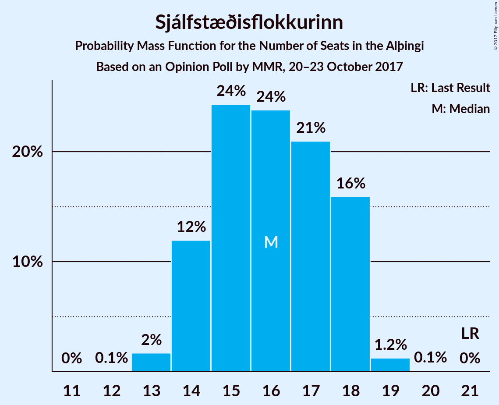
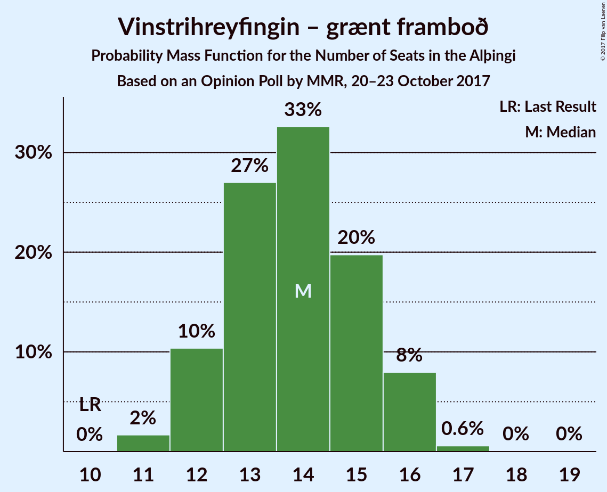
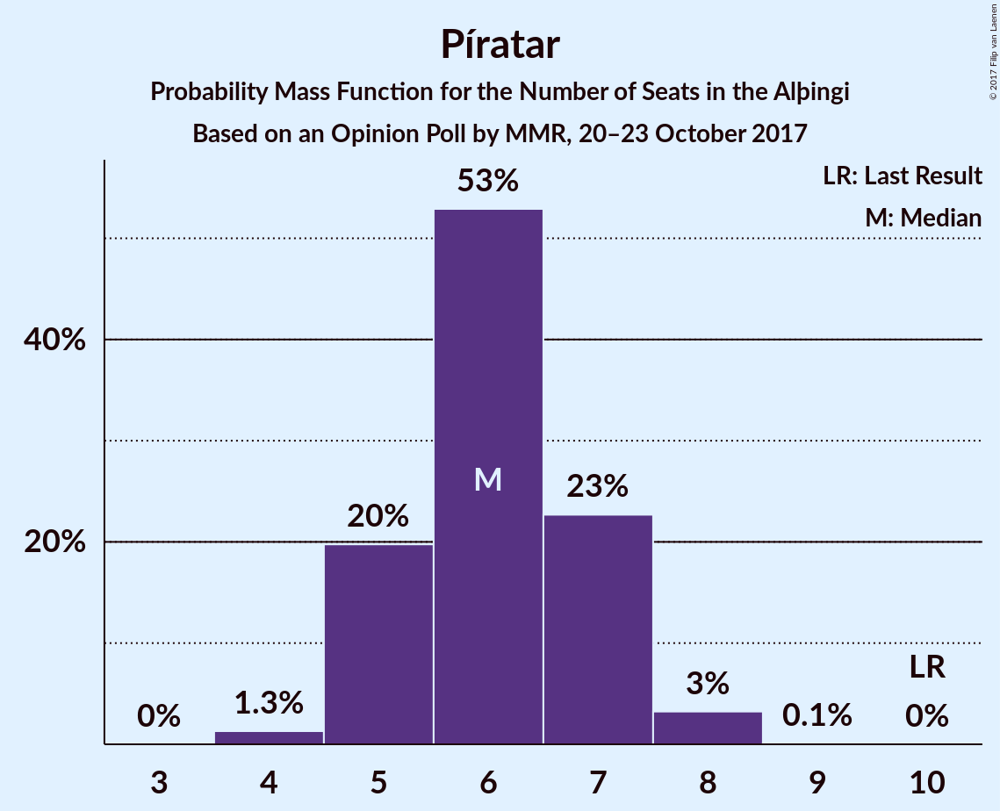
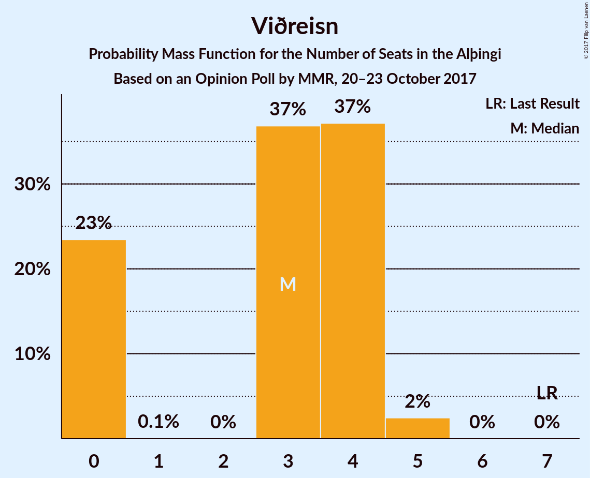
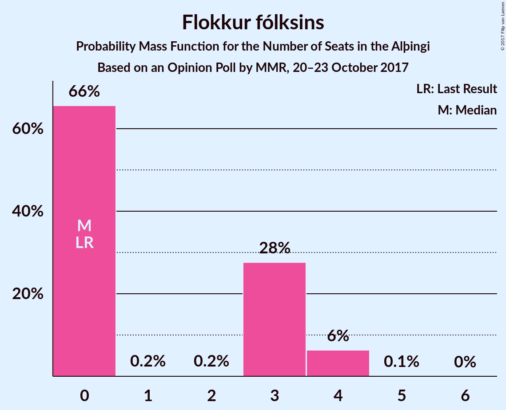

# Opinion Poll by , 20–23 October 2017

<a href="#voting-intentions">Voting Intentions</a> | <a href="#seats">Seats</a> | <a href="#coalitions">Coalitions</a> | <a href="#technical-information">Technical Information</a>

## Voting Intentions

### Confidence Intervals

| Party | Last Result | Poll Result | 80% Confidence Interval | 90% Confidence Interval | 95% Confidence Interval | 99% Confidence Interval |
|:-----:|:-----------:|:-----------:|:-----------------------:|:-----------------------:|:-----------------------:|:-----------------------:|
| Sjálfstæðisflokkurinn | 29.0% | 23.0% | 21.3–24.8% |20.9–25.3% |20.5–25.7% |19.7–26.6% |
| Vinstrihreyfingin – grænt framboð | 15.9% | 19.9% | 18.4–21.6% |17.9–22.1% |17.5–22.5% |16.8–23.4% |
| Samfylkingin | 5.7% | 13.5% | 12.2–15.0% |11.8–15.4% |11.5–15.8% |10.9–16.5% |
| Miðflokkurinn | 0.0% | 12.4% | 11.1–13.8% |10.7–14.2% |10.4–14.6% |9.9–15.3% |
| Píratar | 14.5% | 9.3% | 8.2–10.6% |7.9–11.0% |7.6–11.3% |7.1–11.9% |
| Framsóknarflokkurinn | 11.5% | 8.6% | 7.5–9.8% |7.2–10.2% |7.0–10.5% |6.5–11.1% |
| Viðreisn | 10.5% | 5.5% | 4.7–6.6% |4.5–6.9% |4.3–7.1% |3.9–7.7% |
| Flokkur fólksins | 3.5% | 4.7% | 3.9–5.7% |3.7–6.0% |3.5–6.2% |3.2–6.7% |
| Björt framtíð | 7.2% | 1.8% | 1.4–2.5% |1.3–2.7% |1.2–2.9% |1.0–3.3% |

*Note:* The poll result column reflects the actual value used in the calculations. Published results may vary slightly, and in addition be rounded to fewer digits.

## Seats

### Confidence Intervals

| Party | Last Result | Median | 80% Confidence Interval | 90% Confidence Interval | 95% Confidence Interval | 99% Confidence Interval |
|:-----:|:-----------:|:------:|:-----------------------:|:-----------------------:|:-----------------------:|:-----------------------:|
| <a href="#sjálfstæðisflokkurinn">Sjálfstæðisflokkurinn</a> | 21 | 16 | 14–18 |14–18 |14–18 |13–19 |
| <a href="#vinstrihreyfingin-–-grænt-framboð">Vinstrihreyfingin – grænt framboð</a> | 10 | 14 | 12–15 |12–16 |12–16 |11–17 |
| <a href="#samfylkingin">Samfylkingin</a> | 3 | 9 | 8–11 |8–11 |7–11 |7–12 |
| <a href="#miðflokkurinn">Miðflokkurinn</a> | 0 | 8 | 8–10 |7–10 |7–11 |6–12 |
| <a href="#píratar">Píratar</a> | 10 | 6 | 5–7 |5–7 |5–8 |4–8 |
| <a href="#framsóknarflokkurinn">Framsóknarflokkurinn</a> | 8 | 6 | 5–7 |4–7 |4–7 |4–8 |
| <a href="#viðreisn">Viðreisn</a> | 7 | 3 | 0–4 |0–4 |0–4 |0–5 |
| <a href="#flokkur-fólksins">Flokkur fólksins</a> | 0 | 0 | 0–3 |0–4 |0–4 |0–4 |
| <a href="#björt-framtíð">Björt framtíð</a> | 4 | 0 | 0 |0 |0 |0 |

### Sjálfstæðisflokkurinn

*For a full overview of the results for this party, see the [Sjálfstæðisflokkurinn](party-sjlfstisflokkurinn.html) page.*

| Number of Seats | Probability | Accumulated | Special Marks |
|:---------------:|:-----------:|:-----------:|:-------------:|
| 12 | 0.1% | 100% |  |
| 13 | 1.4% | 99.9% |  |
| 14 | 12% | 98.5% |  |
| 15 | 27% | 86% |  |
| 16 | 21% | 60% | Median |
| 17 | 21% | 39% |  |
| 18 | 17% | 18% |  |
| 19 | 1.0% | 1.1% |  |
| 20 | 0.1% | 0.1% |  |
| 21 | 0% | 0% | Last Result |

### Vinstrihreyfingin – grænt framboð

*For a full overview of the results for this party, see the [Vinstrihreyfingin – grænt framboð](party-vinstrihreyfingingrntframbo.html) page.*

| Number of Seats | Probability | Accumulated | Special Marks |
|:---------------:|:-----------:|:-----------:|:-------------:|
| 10 | 0% | 100% | Last Result |
| 11 | 1.3% | 100% |  |
| 12 | 11% | 98.7% |  |
| 13 | 27% | 88% |  |
| 14 | 36% | 61% | Median |
| 15 | 16% | 24% |  |
| 16 | 8% | 9% |  |
| 17 | 0.7% | 0.8% |  |
| 18 | 0% | 0.1% |  |
| 19 | 0% | 0% |  |

### Samfylkingin

*For a full overview of the results for this party, see the [Samfylkingin](party-samfylkingin.html) page.*

| Number of Seats | Probability | Accumulated | Special Marks |
|:---------------:|:-----------:|:-----------:|:-------------:|
| 3 | 0% | 100% | Last Result |
| 4 | 0% | 100% |  |
| 5 | 0% | 100% |  |
| 6 | 0.2% | 100% |  |
| 7 | 4% | 99.8% |  |
| 8 | 26% | 95% |  |
| 9 | 39% | 70% | Median |
| 10 | 19% | 30% |  |
| 11 | 9% | 11% |  |
| 12 | 2% | 2% |  |
| 13 | 0% | 0% |  |

### Miðflokkurinn

*For a full overview of the results for this party, see the [Miðflokkurinn](party-miflokkurinn.html) page.*

| Number of Seats | Probability | Accumulated | Special Marks |
|:---------------:|:-----------:|:-----------:|:-------------:|
| 0 | 0% | 100% | Last Result |
| 1 | 0% | 100% |  |
| 2 | 0% | 100% |  |
| 3 | 0% | 100% |  |
| 4 | 0% | 100% |  |
| 5 | 0% | 100% |  |
| 6 | 0.7% | 100% |  |
| 7 | 5% | 99.3% |  |
| 8 | 56% | 94% | Median |
| 9 | 21% | 38% |  |
| 10 | 12% | 17% |  |
| 11 | 4% | 4% |  |
| 12 | 0.7% | 0.7% |  |
| 13 | 0% | 0% |  |

### Píratar

*For a full overview of the results for this party, see the [Píratar](party-pratar.html) page.*

| Number of Seats | Probability | Accumulated | Special Marks |
|:---------------:|:-----------:|:-----------:|:-------------:|
| 4 | 1.0% | 100% |  |
| 5 | 23% | 99.0% |  |
| 6 | 47% | 76% | Median |
| 7 | 25% | 29% |  |
| 8 | 4% | 4% |  |
| 9 | 0.1% | 0.1% |  |
| 10 | 0% | 0% | Last Result |

### Framsóknarflokkurinn

*For a full overview of the results for this party, see the [Framsóknarflokkurinn](party-framsknarflokkurinn.html) page.*

| Number of Seats | Probability | Accumulated | Special Marks |
|:---------------:|:-----------:|:-----------:|:-------------:|
| 4 | 6% | 100% |  |
| 5 | 43% | 94% |  |
| 6 | 40% | 51% | Median |
| 7 | 9% | 10% |  |
| 8 | 2% | 2% | Last Result |
| 9 | 0% | 0% |  |

### Viðreisn

*For a full overview of the results for this party, see the [Viðreisn](party-vireisn.html) page.*

| Number of Seats | Probability | Accumulated | Special Marks |
|:---------------:|:-----------:|:-----------:|:-------------:|
| 0 | 22% | 100% |  |
| 1 | 0.1% | 78% |  |
| 2 | 0% | 78% |  |
| 3 | 41% | 78% | Median |
| 4 | 35% | 37% |  |
| 5 | 2% | 2% |  |
| 6 | 0% | 0% |  |
| 7 | 0% | 0% | Last Result |

### Flokkur fólksins

*For a full overview of the results for this party, see the [Flokkur fólksins](party-flokkurflksins.html) page.*

| Number of Seats | Probability | Accumulated | Special Marks |
|:---------------:|:-----------:|:-----------:|:-------------:|
| 0 | 63% | 100% | Last Result, Median |
| 1 | 0.2% | 37% |  |
| 2 | 0% | 37% |  |
| 3 | 30% | 37% |  |
| 4 | 6% | 7% |  |
| 5 | 0.1% | 0.1% |  |
| 6 | 0% | 0% |  |

### Björt framtíð

*For a full overview of the results for this party, see the [Björt framtíð](party-bjrtframt.html) page.*

| Number of Seats | Probability | Accumulated | Special Marks |
|:---------------:|:-----------:|:-----------:|:-------------:|
| 0 | 100% | 100% | Median |
| 1 | 0% | 0% |  |
| 2 | 0% | 0% |  |
| 3 | 0% | 0% |  |
| 4 | 0% | 0% | Last Result |

## Coalitions

### Confidence Intervals

| Coalition | Last Result | Median | Majority? | 80% Confidence Interval | 90% Confidence Interval | 95% Confidence Interval | 99% Confidence Interval |
|:---------:|:-----------:|:------:|:---------:|:-----------------------:|:-----------------------:|:-----------------------:|:-----------------------:|
| Vinstrihreyfingin – grænt framboð – Samfylkingin – Miðflokkurinn – Framsóknarflokkurinn | 21 | 37 | 99.9% | 35–39 | 34–40 | 34–41 | 32–42 |
| Vinstrihreyfingin – grænt framboð – Samfylkingin – Píratar – Viðreisn – Björt framtíð | 34 | 32 | 59% | 29–34 | 29–34 | 28–35 | 27–35 |
| Vinstrihreyfingin – grænt framboð – Samfylkingin – Miðflokkurinn | 13 | 31 | 46% | 29–33 | 29–34 | 28–35 | 27–36 |
| Vinstrihreyfingin – grænt framboð – Samfylkingin – Píratar – Viðreisn | 30 | 32 | 59% | 29–34 | 29–34 | 28–35 | 27–35 |
| Sjálfstæðisflokkurinn – Miðflokkurinn – Framsóknarflokkurinn | 29 | 30 | 20% | 28–32 | 27–33 | 27–33 | 26–34 |
| Sjálfstæðisflokkurinn – Vinstrihreyfingin – grænt framboð | 31 | 30 | 17% | 28–32 | 27–32 | 26–33 | 26–34 |
| Vinstrihreyfingin – grænt framboð – Samfylkingin – Píratar – Björt framtíð | 27 | 29 | 5% | 27–31 | 26–32 | 26–32 | 25–33 |
| Vinstrihreyfingin – grænt framboð – Samfylkingin – Píratar | 23 | 29 | 5% | 27–31 | 26–32 | 26–32 | 25–33 |
| Vinstrihreyfingin – grænt framboð – Samfylkingin – Framsóknarflokkurinn | 21 | 29 | 3% | 26–30 | 26–31 | 25–32 | 24–33 |
| Vinstrihreyfingin – grænt framboð – Miðflokkurinn – Framsóknarflokkurinn | 18 | 28 | 0.9% | 26–30 | 25–30 | 25–31 | 24–32 |
| Sjálfstæðisflokkurinn – Samfylkingin | 24 | 25 | 0% | 23–27 | 22–28 | 22–28 | 21–29 |
| Sjálfstæðisflokkurinn – Miðflokkurinn | 21 | 25 | 0% | 23–26 | 22–27 | 22–27 | 21–28 |
| Vinstrihreyfingin – grænt framboð – Samfylkingin | 13 | 23 | 0% | 21–25 | 21–25 | 20–26 | 19–27 |
| Vinstrihreyfingin – grænt framboð – Miðflokkurinn | 10 | 22 | 0% | 21–24 | 20–25 | 20–25 | 19–26 |
| Sjálfstæðisflokkurinn – Framsóknarflokkurinn | 29 | 22 | 0% | 19–23 | 19–24 | 19–24 | 18–25 |
| Vinstrihreyfingin – grænt framboð – Píratar | 20 | 20 | 0% | 18–22 | 18–22 | 17–23 | 17–23 |
| Vinstrihreyfingin – grænt framboð – Framsóknarflokkurinn | 18 | 19 | 0% | 18–21 | 17–21 | 17–22 | 16–23 |
| Sjálfstæðisflokkurinn – Viðreisn – Björt framtíð | 32 | 19 | 0% | 17–21 | 16–21 | 15–22 | 14–22 |
| Sjálfstæðisflokkurinn – Viðreisn | 28 | 19 | 0% | 17–21 | 16–21 | 15–22 | 14–22 |
| Sjálfstæðisflokkurinn – Björt framtíð | 25 | 16 | 0% | 14–18 | 14–18 | 14–18 | 13–19 |

### Vinstrihreyfingin – grænt framboð – Samfylkingin – Miðflokkurinn – Framsóknarflokkurinn

| Number of Seats | Probability | Accumulated | Special Marks |
|:---------------:|:-----------:|:-----------:|:-------------:|
| 21 | 0% | 100% | Last Result |
| 22 | 0% | 100% |  |
| 23 | 0% | 100% |  |
| 24 | 0% | 100% |  |
| 25 | 0% | 100% |  |
| 26 | 0% | 100% |  |
| 27 | 0% | 100% |  |
| 28 | 0% | 100% |  |
| 29 | 0% | 100% |  |
| 30 | 0% | 100% |  |
| 31 | 0.1% | 100% |  |
| 32 | 0.6% | 99.9% | Majority |
| 33 | 2% | 99.3% |  |
| 34 | 4% | 98% |  |
| 35 | 14% | 93% |  |
| 36 | 19% | 79% |  |
| 37 | 23% | 60% | Median |
| 38 | 16% | 38% |  |
| 39 | 15% | 22% |  |
| 40 | 5% | 7% |  |
| 41 | 2% | 3% |  |
| 42 | 0.6% | 0.7% |  |
| 43 | 0% | 0% |  |

### Vinstrihreyfingin – grænt framboð – Samfylkingin – Píratar – Viðreisn – Björt framtíð

| Number of Seats | Probability | Accumulated | Special Marks |
|:---------------:|:-----------:|:-----------:|:-------------:|
| 26 | 0.1% | 100% |  |
| 27 | 0.7% | 99.9% |  |
| 28 | 3% | 99.2% |  |
| 29 | 8% | 96% |  |
| 30 | 10% | 88% |  |
| 31 | 18% | 77% |  |
| 32 | 27% | 59% | Median, Majority |
| 33 | 18% | 32% |  |
| 34 | 10% | 14% | Last Result |
| 35 | 3% | 4% |  |
| 36 | 0.3% | 0.4% |  |
| 37 | 0.1% | 0.1% |  |
| 38 | 0% | 0% |  |

### Vinstrihreyfingin – grænt framboð – Samfylkingin – Miðflokkurinn

| Number of Seats | Probability | Accumulated | Special Marks |
|:---------------:|:-----------:|:-----------:|:-------------:|
| 13 | 0% | 100% | Last Result |
| 14 | 0% | 100% |  |
| 15 | 0% | 100% |  |
| 16 | 0% | 100% |  |
| 17 | 0% | 100% |  |
| 18 | 0% | 100% |  |
| 19 | 0% | 100% |  |
| 20 | 0% | 100% |  |
| 21 | 0% | 100% |  |
| 22 | 0% | 100% |  |
| 23 | 0% | 100% |  |
| 24 | 0% | 100% |  |
| 25 | 0% | 100% |  |
| 26 | 0% | 100% |  |
| 27 | 0.9% | 100% |  |
| 28 | 3% | 99.1% |  |
| 29 | 7% | 96% |  |
| 30 | 19% | 90% |  |
| 31 | 26% | 71% | Median |
| 32 | 18% | 46% | Majority |
| 33 | 20% | 28% |  |
| 34 | 5% | 8% |  |
| 35 | 2% | 3% |  |
| 36 | 0.9% | 1.0% |  |
| 37 | 0% | 0% |  |

### Vinstrihreyfingin – grænt framboð – Samfylkingin – Píratar – Viðreisn

| Number of Seats | Probability | Accumulated | Special Marks |
|:---------------:|:-----------:|:-----------:|:-------------:|
| 26 | 0.1% | 100% |  |
| 27 | 0.7% | 99.9% |  |
| 28 | 3% | 99.2% |  |
| 29 | 8% | 96% |  |
| 30 | 10% | 88% | Last Result |
| 31 | 18% | 77% |  |
| 32 | 27% | 59% | Median, Majority |
| 33 | 18% | 32% |  |
| 34 | 10% | 14% |  |
| 35 | 3% | 4% |  |
| 36 | 0.3% | 0.4% |  |
| 37 | 0.1% | 0.1% |  |
| 38 | 0% | 0% |  |

### Sjálfstæðisflokkurinn – Miðflokkurinn – Framsóknarflokkurinn

| Number of Seats | Probability | Accumulated | Special Marks |
|:---------------:|:-----------:|:-----------:|:-------------:|
| 25 | 0.1% | 100% |  |
| 26 | 0.9% | 99.9% |  |
| 27 | 8% | 99.0% |  |
| 28 | 8% | 91% |  |
| 29 | 18% | 83% | Last Result |
| 30 | 18% | 65% | Median |
| 31 | 28% | 47% |  |
| 32 | 14% | 20% | Majority |
| 33 | 4% | 6% |  |
| 34 | 2% | 2% |  |
| 35 | 0.2% | 0.2% |  |
| 36 | 0% | 0% |  |

### Sjálfstæðisflokkurinn – Vinstrihreyfingin – grænt framboð

| Number of Seats | Probability | Accumulated | Special Marks |
|:---------------:|:-----------:|:-----------:|:-------------:|
| 25 | 0.3% | 100% |  |
| 26 | 2% | 99.7% |  |
| 27 | 5% | 97% |  |
| 28 | 12% | 93% |  |
| 29 | 24% | 80% |  |
| 30 | 20% | 56% | Median |
| 31 | 19% | 36% | Last Result |
| 32 | 12% | 17% | Majority |
| 33 | 4% | 5% |  |
| 34 | 0.7% | 0.8% |  |
| 35 | 0.1% | 0.1% |  |
| 36 | 0% | 0% |  |

### Vinstrihreyfingin – grænt framboð – Samfylkingin – Píratar – Björt framtíð

| Number of Seats | Probability | Accumulated | Special Marks |
|:---------------:|:-----------:|:-----------:|:-------------:|
| 24 | 0.2% | 100% |  |
| 25 | 2% | 99.8% |  |
| 26 | 4% | 98% |  |
| 27 | 10% | 94% | Last Result |
| 28 | 20% | 84% |  |
| 29 | 28% | 63% | Median |
| 30 | 19% | 35% |  |
| 31 | 11% | 16% |  |
| 32 | 3% | 5% | Majority |
| 33 | 2% | 2% |  |
| 34 | 0.2% | 0.2% |  |
| 35 | 0% | 0% |  |

### Vinstrihreyfingin – grænt framboð – Samfylkingin – Píratar

| Number of Seats | Probability | Accumulated | Special Marks |
|:---------------:|:-----------:|:-----------:|:-------------:|
| 23 | 0% | 100% | Last Result |
| 24 | 0.2% | 100% |  |
| 25 | 2% | 99.8% |  |
| 26 | 4% | 98% |  |
| 27 | 10% | 94% |  |
| 28 | 20% | 84% |  |
| 29 | 28% | 63% | Median |
| 30 | 19% | 35% |  |
| 31 | 11% | 16% |  |
| 32 | 3% | 5% | Majority |
| 33 | 2% | 2% |  |
| 34 | 0.2% | 0.2% |  |
| 35 | 0% | 0% |  |

### Vinstrihreyfingin – grænt framboð – Samfylkingin – Framsóknarflokkurinn

| Number of Seats | Probability | Accumulated | Special Marks |
|:---------------:|:-----------:|:-----------:|:-------------:|
| 21 | 0% | 100% | Last Result |
| 22 | 0% | 100% |  |
| 23 | 0.1% | 100% |  |
| 24 | 0.9% | 99.9% |  |
| 25 | 2% | 99.0% |  |
| 26 | 8% | 97% |  |
| 27 | 16% | 89% |  |
| 28 | 20% | 72% |  |
| 29 | 28% | 52% | Median |
| 30 | 14% | 24% |  |
| 31 | 6% | 9% |  |
| 32 | 2% | 3% | Majority |
| 33 | 0.8% | 0.9% |  |
| 34 | 0.1% | 0.1% |  |
| 35 | 0% | 0% |  |

### Vinstrihreyfingin – grænt framboð – Miðflokkurinn – Framsóknarflokkurinn

| Number of Seats | Probability | Accumulated | Special Marks |
|:---------------:|:-----------:|:-----------:|:-------------:|
| 18 | 0% | 100% | Last Result |
| 19 | 0% | 100% |  |
| 20 | 0% | 100% |  |
| 21 | 0% | 100% |  |
| 22 | 0% | 100% |  |
| 23 | 0.1% | 100% |  |
| 24 | 0.9% | 99.9% |  |
| 25 | 5% | 99.0% |  |
| 26 | 14% | 94% |  |
| 27 | 24% | 80% |  |
| 28 | 18% | 56% | Median |
| 29 | 20% | 38% |  |
| 30 | 14% | 18% |  |
| 31 | 4% | 5% |  |
| 32 | 0.7% | 0.9% | Majority |
| 33 | 0.2% | 0.2% |  |
| 34 | 0% | 0% |  |

### Sjálfstæðisflokkurinn – Samfylkingin

| Number of Seats | Probability | Accumulated | Special Marks |
|:---------------:|:-----------:|:-----------:|:-------------:|
| 21 | 1.4% | 100% |  |
| 22 | 4% | 98.5% |  |
| 23 | 10% | 95% |  |
| 24 | 21% | 85% | Last Result |
| 25 | 23% | 64% | Median |
| 26 | 19% | 41% |  |
| 27 | 16% | 22% |  |
| 28 | 5% | 6% |  |
| 29 | 1.0% | 1.1% |  |
| 30 | 0.1% | 0.1% |  |
| 31 | 0% | 0% |  |

### Sjálfstæðisflokkurinn – Miðflokkurinn

| Number of Seats | Probability | Accumulated | Special Marks |
|:---------------:|:-----------:|:-----------:|:-------------:|
| 20 | 0.1% | 100% |  |
| 21 | 1.3% | 99.9% | Last Result |
| 22 | 7% | 98.5% |  |
| 23 | 17% | 91% |  |
| 24 | 20% | 74% | Median |
| 25 | 26% | 54% |  |
| 26 | 20% | 28% |  |
| 27 | 7% | 9% |  |
| 28 | 2% | 2% |  |
| 29 | 0.3% | 0.3% |  |
| 30 | 0% | 0% |  |

### Vinstrihreyfingin – grænt framboð – Samfylkingin

| Number of Seats | Probability | Accumulated | Special Marks |
|:---------------:|:-----------:|:-----------:|:-------------:|
| 13 | 0% | 100% | Last Result |
| 14 | 0% | 100% |  |
| 15 | 0% | 100% |  |
| 16 | 0% | 100% |  |
| 17 | 0% | 100% |  |
| 18 | 0% | 100% |  |
| 19 | 1.0% | 100% |  |
| 20 | 3% | 98.9% |  |
| 21 | 12% | 96% |  |
| 22 | 22% | 84% |  |
| 23 | 30% | 62% | Median |
| 24 | 19% | 31% |  |
| 25 | 9% | 13% |  |
| 26 | 3% | 4% |  |
| 27 | 0.9% | 1.0% |  |
| 28 | 0% | 0% |  |

### Vinstrihreyfingin – grænt framboð – Miðflokkurinn

| Number of Seats | Probability | Accumulated | Special Marks |
|:---------------:|:-----------:|:-----------:|:-------------:|
| 10 | 0% | 100% | Last Result |
| 11 | 0% | 100% |  |
| 12 | 0% | 100% |  |
| 13 | 0% | 100% |  |
| 14 | 0% | 100% |  |
| 15 | 0% | 100% |  |
| 16 | 0% | 100% |  |
| 17 | 0% | 100% |  |
| 18 | 0.2% | 100% |  |
| 19 | 1.0% | 99.8% |  |
| 20 | 7% | 98.9% |  |
| 21 | 19% | 91% |  |
| 22 | 32% | 73% | Median |
| 23 | 17% | 41% |  |
| 24 | 18% | 24% |  |
| 25 | 4% | 6% |  |
| 26 | 1.4% | 2% |  |
| 27 | 0.2% | 0.2% |  |
| 28 | 0% | 0% |  |

### Sjálfstæðisflokkurinn – Framsóknarflokkurinn

| Number of Seats | Probability | Accumulated | Special Marks |
|:---------------:|:-----------:|:-----------:|:-------------:|
| 17 | 0.1% | 100% |  |
| 18 | 1.1% | 99.9% |  |
| 19 | 10% | 98.8% |  |
| 20 | 13% | 89% |  |
| 21 | 25% | 76% |  |
| 22 | 17% | 51% | Median |
| 23 | 24% | 34% |  |
| 24 | 8% | 10% |  |
| 25 | 1.4% | 2% |  |
| 26 | 0.1% | 0.1% |  |
| 27 | 0% | 0% |  |
| 28 | 0% | 0% |  |
| 29 | 0% | 0% | Last Result |

### Vinstrihreyfingin – grænt framboð – Píratar

| Number of Seats | Probability | Accumulated | Special Marks |
|:---------------:|:-----------:|:-----------:|:-------------:|
| 16 | 0.3% | 100% |  |
| 17 | 3% | 99.7% |  |
| 18 | 10% | 96% |  |
| 19 | 25% | 87% |  |
| 20 | 31% | 61% | Last Result, Median |
| 21 | 19% | 30% |  |
| 22 | 8% | 11% |  |
| 23 | 3% | 3% |  |
| 24 | 0.2% | 0.2% |  |
| 25 | 0% | 0% |  |

### Vinstrihreyfingin – grænt framboð – Framsóknarflokkurinn

| Number of Seats | Probability | Accumulated | Special Marks |
|:---------------:|:-----------:|:-----------:|:-------------:|
| 15 | 0.1% | 100% |  |
| 16 | 1.1% | 99.9% |  |
| 17 | 7% | 98.8% |  |
| 18 | 20% | 92% | Last Result |
| 19 | 25% | 72% |  |
| 20 | 23% | 47% | Median |
| 21 | 18% | 23% |  |
| 22 | 4% | 5% |  |
| 23 | 0.8% | 0.9% |  |
| 24 | 0.1% | 0.1% |  |
| 25 | 0% | 0% |  |

### Sjálfstæðisflokkurinn – Viðreisn – Björt framtíð

| Number of Seats | Probability | Accumulated | Special Marks |
|:---------------:|:-----------:|:-----------:|:-------------:|
| 14 | 0.6% | 100% |  |
| 15 | 3% | 99.4% |  |
| 16 | 5% | 96% |  |
| 17 | 13% | 91% |  |
| 18 | 26% | 79% |  |
| 19 | 16% | 53% | Median |
| 20 | 21% | 37% |  |
| 21 | 12% | 16% |  |
| 22 | 4% | 4% |  |
| 23 | 0.4% | 0.4% |  |
| 24 | 0% | 0% |  |
| 25 | 0% | 0% |  |
| 26 | 0% | 0% |  |
| 27 | 0% | 0% |  |
| 28 | 0% | 0% |  |
| 29 | 0% | 0% |  |
| 30 | 0% | 0% |  |
| 31 | 0% | 0% |  |
| 32 | 0% | 0% | Last Result, Majority |

### Sjálfstæðisflokkurinn – Viðreisn

| Number of Seats | Probability | Accumulated | Special Marks |
|:---------------:|:-----------:|:-----------:|:-------------:|
| 14 | 0.6% | 100% |  |
| 15 | 3% | 99.4% |  |
| 16 | 5% | 96% |  |
| 17 | 13% | 91% |  |
| 18 | 26% | 79% |  |
| 19 | 16% | 53% | Median |
| 20 | 21% | 37% |  |
| 21 | 12% | 16% |  |
| 22 | 4% | 4% |  |
| 23 | 0.4% | 0.4% |  |
| 24 | 0% | 0% |  |
| 25 | 0% | 0% |  |
| 26 | 0% | 0% |  |
| 27 | 0% | 0% |  |
| 28 | 0% | 0% | Last Result |

### Sjálfstæðisflokkurinn – Björt framtíð

| Number of Seats | Probability | Accumulated | Special Marks |
|:---------------:|:-----------:|:-----------:|:-------------:|
| 12 | 0.1% | 100% |  |
| 13 | 1.4% | 99.9% |  |
| 14 | 12% | 98.5% |  |
| 15 | 27% | 86% |  |
| 16 | 21% | 60% | Median |
| 17 | 21% | 39% |  |
| 18 | 17% | 18% |  |
| 19 | 1.0% | 1.1% |  |
| 20 | 0.1% | 0.1% |  |
| 21 | 0% | 0% |  |
| 22 | 0% | 0% |  |
| 23 | 0% | 0% |  |
| 24 | 0% | 0% |  |
| 25 | 0% | 0% | Last Result |

## Technical Information

### Opinion Poll

+ **Polling firm:** 
+ **Commissioner(s):** —
+ **Fieldwork period:** 20–23 October 2017

### Calculations

+ **Sample size:** 979
+ **Simulations done:** 2,097,152
+ **Error estimate:** 1.92%

