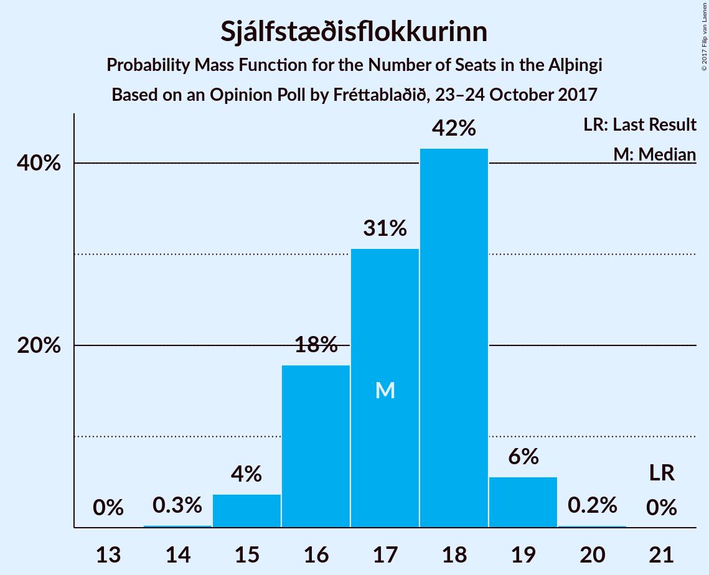
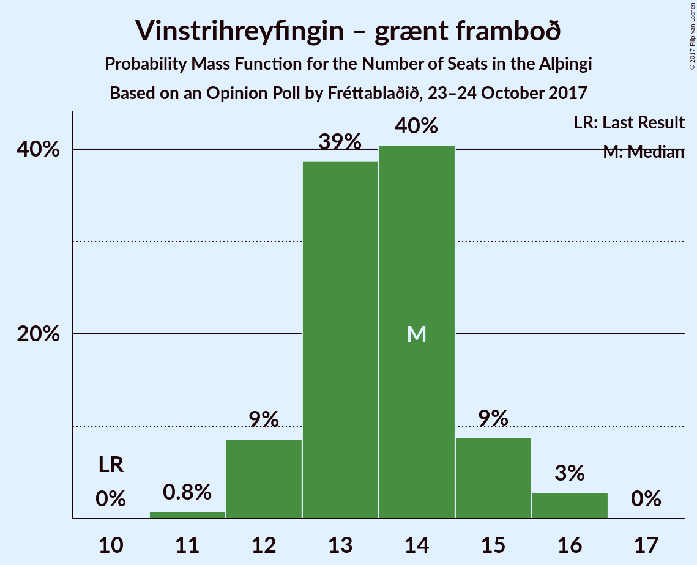
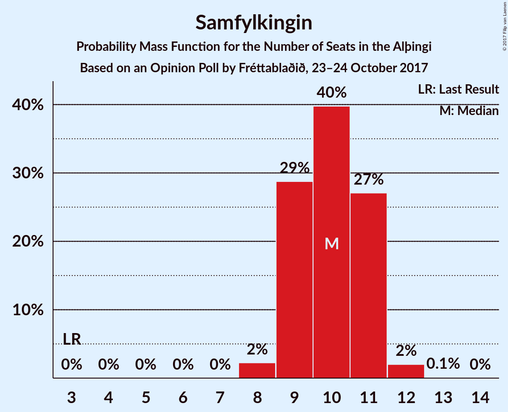
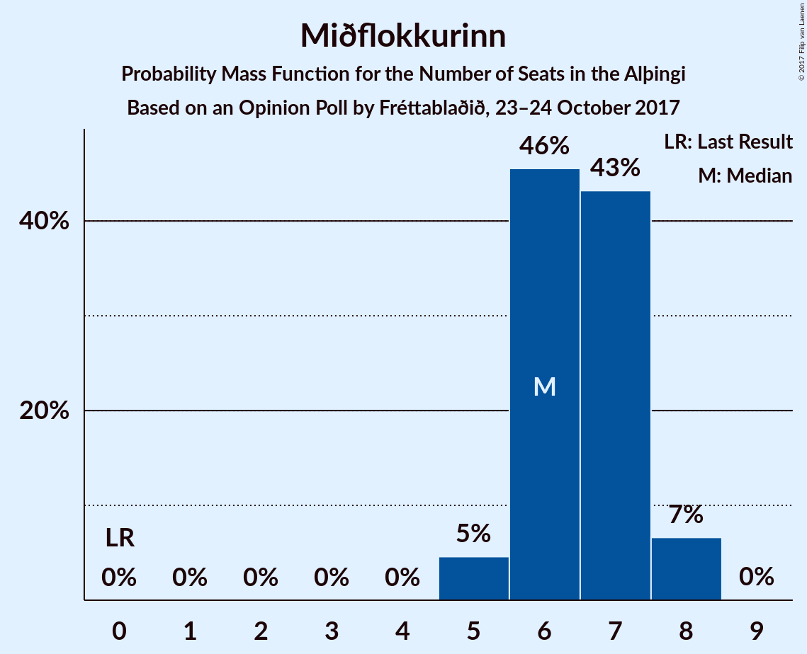
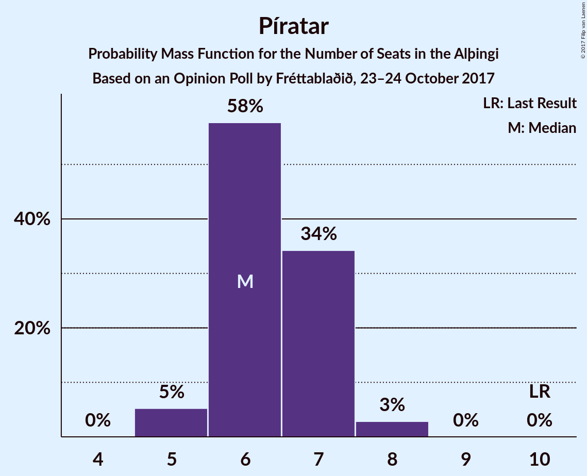
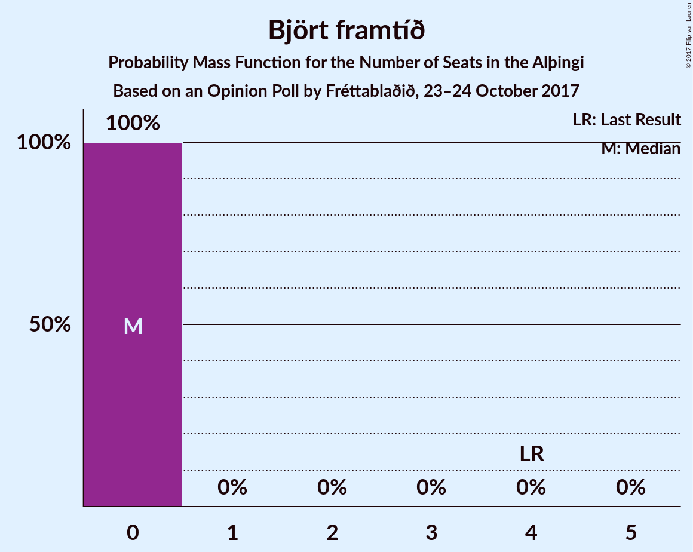

# Opinion Poll by Fréttablaðið, 23–24 October 2017

<a href="#voting-intentions">Voting Intentions</a> | <a href="#seats">Seats</a> | <a href="#coalitions">Coalitions</a> | <a href="#technical-information">Technical Information</a>

## Voting Intentions

### Confidence Intervals

| Party | Last Result | Poll Result | 80% Confidence Interval | 90% Confidence Interval | 95% Confidence Interval | 99% Confidence Interval |
|:-----:|:-----------:|:-----------:|:-----------------------:|:-----------------------:|:-----------------------:|:-----------------------:|
| Sjálfstæðisflokkurinn | 29.0% | 24.1% | 22.8–25.5% |22.4–25.9% |22.1–26.2% |21.4–26.9% |
| Vinstrihreyfingin – grænt framboð | 15.9% | 19.2% | 18.0–20.5% |17.7–20.9% |17.4–21.2% |16.8–21.9% |
| Samfylkingin | 5.7% | 14.3% | 13.2–15.5% |12.9–15.8% |12.7–16.1% |12.2–16.7% |
| Miðflokkurinn | 0.0% | 9.6% | 8.7–10.6% |8.5–10.9% |8.3–11.2% |7.9–11.7% |
| Píratar | 14.5% | 9.4% | 8.6–10.4% |8.3–10.7% |8.1–11.0% |7.7–11.4% |
| Viðreisn | 10.5% | 7.5% | 6.7–8.4% |6.5–8.7% |6.3–8.9% |5.9–9.3% |
| Framsóknarflokkurinn | 11.5% | 6.2% | 5.5–7.0% |5.3–7.3% |5.1–7.5% |4.8–7.9% |
| Flokkur fólksins | 3.5% | 4.4% | 3.8–5.1% |3.6–5.3% |3.5–5.5% |3.2–5.9% |
| Björt framtíð | 7.2% | 1.9% | 1.5–2.4% |1.4–2.5% |1.3–2.7% |1.2–2.9% |

*Note:* The poll result column reflects the actual value used in the calculations. Published results may vary slightly, and in addition be rounded to fewer digits.

## Seats

### Confidence Intervals

| Party | Last Result | Median | 80% Confidence Interval | 90% Confidence Interval | 95% Confidence Interval | 99% Confidence Interval |
|:-----:|:-----------:|:------:|:-----------------------:|:-----------------------:|:-----------------------:|:-----------------------:|
| <a href="#sjálfstæðisflokkurinn">Sjálfstæðisflokkurinn</a> | 21 | 18 | 16–18 |16–19 |15–19 |15–19 |
| <a href="#vinstrihreyfingin-–-grænt-framboð">Vinstrihreyfingin – grænt framboð</a> | 10 | 14 | 13–15 |12–15 |12–16 |12–16 |
| <a href="#samfylkingin">Samfylkingin</a> | 3 | 10 | 9–11 |9–11 |9–11 |8–12 |
| <a href="#miðflokkurinn">Miðflokkurinn</a> | 0 | 6 | 6–7 |5–8 |5–8 |5–8 |
| <a href="#píratar">Píratar</a> | 10 | 6 | 6–7 |6–7 |5–8 |5–8 |
| <a href="#viðreisn">Viðreisn</a> | 7 | 5 | 4–6 |4–6 |4–6 |4–6 |
| <a href="#framsóknarflokkurinn">Framsóknarflokkurinn</a> | 8 | 4 | 3–5 |3–5 |3–5 |3–5 |
| <a href="#flokkur-fólksins">Flokkur fólksins</a> | 0 | 0 | 0–3 |0–3 |0–3 |0–4 |
| <a href="#björt-framtíð">Björt framtíð</a> | 4 | 0 | 0 |0 |0 |0 |

### Sjálfstæðisflokkurinn

*For a full overview of the results for this party, see the [Sjálfstæðisflokkurinn](party-sjlfstisflokkurinn.html) page.*

| Number of Seats | Probability | Accumulated | Special Marks |
|:---------------:|:-----------:|:-----------:|:-------------:|
| 14 | 0.4% | 100% |  |
| 15 | 3% | 99.6% |  |
| 16 | 17% | 97% |  |
| 17 | 27% | 80% |  |
| 18 | 46% | 53% | Median |
| 19 | 6% | 6% |  |
| 20 | 0.2% | 0.2% |  |
| 21 | 0% | 0% | Last Result |

### Vinstrihreyfingin – grænt framboð

*For a full overview of the results for this party, see the [Vinstrihreyfingin – grænt framboð](party-vinstrihreyfingingrntframbo.html) page.*

| Number of Seats | Probability | Accumulated | Special Marks |
|:---------------:|:-----------:|:-----------:|:-------------:|
| 10 | 0% | 100% | Last Result |
| 11 | 0.4% | 100% |  |
| 12 | 9% | 99.6% |  |
| 13 | 39% | 90% |  |
| 14 | 38% | 52% | Median |
| 15 | 10% | 13% |  |
| 16 | 4% | 4% |  |
| 17 | 0% | 0% |  |

### Samfylkingin

*For a full overview of the results for this party, see the [Samfylkingin](party-samfylkingin.html) page.*

| Number of Seats | Probability | Accumulated | Special Marks |
|:---------------:|:-----------:|:-----------:|:-------------:|
| 3 | 0% | 100% | Last Result |
| 4 | 0% | 100% |  |
| 5 | 0% | 100% |  |
| 6 | 0% | 100% |  |
| 7 | 0% | 100% |  |
| 8 | 1.2% | 100% |  |
| 9 | 31% | 98.7% |  |
| 10 | 41% | 67% | Median |
| 11 | 24% | 26% |  |
| 12 | 2% | 2% |  |
| 13 | 0.2% | 0.2% |  |
| 14 | 0% | 0% |  |

### Miðflokkurinn

*For a full overview of the results for this party, see the [Miðflokkurinn](party-miflokkurinn.html) page.*

| Number of Seats | Probability | Accumulated | Special Marks |
|:---------------:|:-----------:|:-----------:|:-------------:|
| 0 | 0% | 100% | Last Result |
| 1 | 0% | 100% |  |
| 2 | 0% | 100% |  |
| 3 | 0% | 100% |  |
| 4 | 0% | 100% |  |
| 5 | 6% | 100% |  |
| 6 | 46% | 94% | Median |
| 7 | 41% | 48% |  |
| 8 | 7% | 7% |  |
| 9 | 0% | 0% |  |

### Píratar

*For a full overview of the results for this party, see the [Píratar](party-pratar.html) page.*

| Number of Seats | Probability | Accumulated | Special Marks |
|:---------------:|:-----------:|:-----------:|:-------------:|
| 5 | 5% | 100% |  |
| 6 | 58% | 95% | Median |
| 7 | 35% | 37% |  |
| 8 | 3% | 3% |  |
| 9 | 0% | 0% |  |
| 10 | 0% | 0% | Last Result |

### Viðreisn

*For a full overview of the results for this party, see the [Viðreisn](party-vireisn.html) page.*

| Number of Seats | Probability | Accumulated | Special Marks |
|:---------------:|:-----------:|:-----------:|:-------------:|
| 3 | 0.1% | 100% |  |
| 4 | 17% | 99.9% |  |
| 5 | 70% | 83% | Median |
| 6 | 12% | 12% |  |
| 7 | 0.1% | 0.1% | Last Result |
| 8 | 0% | 0% |  |

### Framsóknarflokkurinn

*For a full overview of the results for this party, see the [Framsóknarflokkurinn](party-framsknarflokkurinn.html) page.*

| Number of Seats | Probability | Accumulated | Special Marks |
|:---------------:|:-----------:|:-----------:|:-------------:|
| 1 | 0.2% | 100% |  |
| 2 | 0.3% | 99.8% |  |
| 3 | 14% | 99.5% |  |
| 4 | 75% | 86% | Median |
| 5 | 11% | 11% |  |
| 6 | 0% | 0% |  |
| 7 | 0% | 0% |  |
| 8 | 0% | 0% | Last Result |

### Flokkur fólksins

*For a full overview of the results for this party, see the [Flokkur fólksins](party-flokkurflksins.html) page.*

| Number of Seats | Probability | Accumulated | Special Marks |
|:---------------:|:-----------:|:-----------:|:-------------:|
| 0 | 88% | 100% | Last Result, Median |
| 1 | 0% | 12% |  |
| 2 | 0% | 12% |  |
| 3 | 11% | 12% |  |
| 4 | 0.6% | 0.6% |  |
| 5 | 0% | 0% |  |

### Björt framtíð

*For a full overview of the results for this party, see the [Björt framtíð](party-bjrtframt.html) page.*

| Number of Seats | Probability | Accumulated | Special Marks |
|:---------------:|:-----------:|:-----------:|:-------------:|
| 0 | 100% | 100% | Median |
| 1 | 0% | 0% |  |
| 2 | 0% | 0% |  |
| 3 | 0% | 0% |  |
| 4 | 0% | 0% | Last Result |

## Coalitions

### Confidence Intervals

| Coalition | Last Result | Median | Majority? | 80% Confidence Interval | 90% Confidence Interval | 95% Confidence Interval | 99% Confidence Interval |
|:---------:|:-----------:|:------:|:---------:|:-----------------------:|:-----------------------:|:-----------------------:|:-----------------------:|
| Vinstrihreyfingin – grænt framboð – Samfylkingin – Píratar – Viðreisn – Björt framtíð | 34 | 35 | 99.5% | 33–36 | 33–37 | 32–37 | 32–38 |
| Vinstrihreyfingin – grænt framboð – Samfylkingin – Píratar – Viðreisn | 30 | 35 | 99.5% | 33–36 | 33–37 | 32–37 | 32–38 |
| Vinstrihreyfingin – grænt framboð – Samfylkingin – Miðflokkurinn – Framsóknarflokkurinn | 21 | 34 | 95% | 32–36 | 32–36 | 31–36 | 31–37 |
| Sjálfstæðisflokkurinn – Vinstrihreyfingin – grænt framboð | 31 | 31 | 35% | 29–32 | 29–32 | 29–33 | 27–33 |
| Vinstrihreyfingin – grænt framboð – Samfylkingin – Píratar – Björt framtíð | 27 | 30 | 8% | 28–31 | 28–32 | 28–32 | 27–33 |
| Vinstrihreyfingin – grænt framboð – Samfylkingin – Miðflokkurinn | 13 | 30 | 15% | 28–32 | 28–32 | 28–32 | 27–33 |
| Vinstrihreyfingin – grænt framboð – Samfylkingin – Píratar | 23 | 30 | 8% | 28–31 | 28–32 | 28–32 | 27–33 |
| Sjálfstæðisflokkurinn – Miðflokkurinn – Framsóknarflokkurinn | 29 | 28 | 0% | 26–29 | 26–30 | 25–30 | 24–30 |
| Vinstrihreyfingin – grænt framboð – Samfylkingin – Framsóknarflokkurinn | 21 | 27 | 0% | 26–29 | 26–30 | 25–30 | 24–30 |
| Sjálfstæðisflokkurinn – Samfylkingin | 24 | 27 | 0% | 26–28 | 25–29 | 25–29 | 24–30 |
| Vinstrihreyfingin – grænt framboð – Miðflokkurinn – Framsóknarflokkurinn | 18 | 24 | 0% | 23–25 | 22–26 | 22–26 | 21–27 |
| Sjálfstæðisflokkurinn – Miðflokkurinn | 21 | 24 | 0% | 23–25 | 22–25 | 22–26 | 21–26 |
| Vinstrihreyfingin – grænt framboð – Samfylkingin | 13 | 23 | 0% | 22–25 | 22–25 | 21–26 | 21–26 |
| Sjálfstæðisflokkurinn – Viðreisn – Björt framtíð | 32 | 23 | 0% | 21–23 | 21–24 | 20–24 | 19–25 |
| Sjálfstæðisflokkurinn – Viðreisn | 28 | 23 | 0% | 21–23 | 21–24 | 20–24 | 19–25 |
| Sjálfstæðisflokkurinn – Framsóknarflokkurinn | 29 | 21 | 0% | 20–23 | 20–23 | 19–23 | 18–23 |
| Vinstrihreyfingin – grænt framboð – Miðflokkurinn | 10 | 20 | 0% | 19–21 | 19–22 | 18–22 | 18–23 |
| Vinstrihreyfingin – grænt framboð – Píratar | 20 | 20 | 0% | 19–21 | 18–22 | 18–22 | 17–23 |
| Vinstrihreyfingin – grænt framboð – Framsóknarflokkurinn | 18 | 17 | 0% | 16–19 | 16–19 | 16–20 | 15–20 |
| Sjálfstæðisflokkurinn – Björt framtíð | 25 | 18 | 0% | 16–18 | 16–19 | 15–19 | 15–19 |

### Vinstrihreyfingin – grænt framboð – Samfylkingin – Píratar – Viðreisn – Björt framtíð

| Number of Seats | Probability | Accumulated | Special Marks |
|:---------------:|:-----------:|:-----------:|:-------------:|
| 30 | 0.1% | 100% |  |
| 31 | 0.4% | 99.9% |  |
| 32 | 3% | 99.5% | Majority |
| 33 | 9% | 97% |  |
| 34 | 24% | 88% | Last Result |
| 35 | 36% | 64% | Median |
| 36 | 22% | 28% |  |
| 37 | 5% | 6% |  |
| 38 | 0.8% | 0.8% |  |
| 39 | 0% | 0% |  |

### Vinstrihreyfingin – grænt framboð – Samfylkingin – Píratar – Viðreisn

| Number of Seats | Probability | Accumulated | Special Marks |
|:---------------:|:-----------:|:-----------:|:-------------:|
| 30 | 0.1% | 100% | Last Result |
| 31 | 0.4% | 99.9% |  |
| 32 | 3% | 99.5% | Majority |
| 33 | 9% | 97% |  |
| 34 | 24% | 88% |  |
| 35 | 36% | 64% | Median |
| 36 | 22% | 28% |  |
| 37 | 5% | 6% |  |
| 38 | 0.8% | 0.8% |  |
| 39 | 0% | 0% |  |

### Vinstrihreyfingin – grænt framboð – Samfylkingin – Miðflokkurinn – Framsóknarflokkurinn

| Number of Seats | Probability | Accumulated | Special Marks |
|:---------------:|:-----------:|:-----------:|:-------------:|
| 21 | 0% | 100% | Last Result |
| 22 | 0% | 100% |  |
| 23 | 0% | 100% |  |
| 24 | 0% | 100% |  |
| 25 | 0% | 100% |  |
| 26 | 0% | 100% |  |
| 27 | 0% | 100% |  |
| 28 | 0% | 100% |  |
| 29 | 0% | 100% |  |
| 30 | 0.3% | 100% |  |
| 31 | 4% | 99.7% |  |
| 32 | 7% | 95% | Majority |
| 33 | 23% | 89% |  |
| 34 | 32% | 65% | Median |
| 35 | 19% | 33% |  |
| 36 | 14% | 15% |  |
| 37 | 0.9% | 0.9% |  |
| 38 | 0% | 0% |  |

### Sjálfstæðisflokkurinn – Vinstrihreyfingin – grænt framboð

| Number of Seats | Probability | Accumulated | Special Marks |
|:---------------:|:-----------:|:-----------:|:-------------:|
| 26 | 0.1% | 100% |  |
| 27 | 0.6% | 99.9% |  |
| 28 | 2% | 99.4% |  |
| 29 | 9% | 98% |  |
| 30 | 18% | 88% |  |
| 31 | 35% | 70% | Last Result |
| 32 | 31% | 35% | Median, Majority |
| 33 | 4% | 4% |  |
| 34 | 0.2% | 0.2% |  |
| 35 | 0% | 0% |  |

### Vinstrihreyfingin – grænt framboð – Samfylkingin – Píratar – Björt framtíð

| Number of Seats | Probability | Accumulated | Special Marks |
|:---------------:|:-----------:|:-----------:|:-------------:|
| 26 | 0.3% | 100% |  |
| 27 | 2% | 99.7% | Last Result |
| 28 | 10% | 98% |  |
| 29 | 25% | 88% |  |
| 30 | 33% | 64% | Median |
| 31 | 22% | 30% |  |
| 32 | 8% | 8% | Majority |
| 33 | 0.7% | 0.7% |  |
| 34 | 0% | 0% |  |

### Vinstrihreyfingin – grænt framboð – Samfylkingin – Miðflokkurinn

| Number of Seats | Probability | Accumulated | Special Marks |
|:---------------:|:-----------:|:-----------:|:-------------:|
| 13 | 0% | 100% | Last Result |
| 14 | 0% | 100% |  |
| 15 | 0% | 100% |  |
| 16 | 0% | 100% |  |
| 17 | 0% | 100% |  |
| 18 | 0% | 100% |  |
| 19 | 0% | 100% |  |
| 20 | 0% | 100% |  |
| 21 | 0% | 100% |  |
| 22 | 0% | 100% |  |
| 23 | 0% | 100% |  |
| 24 | 0% | 100% |  |
| 25 | 0% | 100% |  |
| 26 | 0.1% | 100% |  |
| 27 | 1.4% | 99.9% |  |
| 28 | 9% | 98% |  |
| 29 | 24% | 90% |  |
| 30 | 34% | 66% | Median |
| 31 | 17% | 32% |  |
| 32 | 14% | 15% | Majority |
| 33 | 1.1% | 1.1% |  |
| 34 | 0% | 0% |  |

### Vinstrihreyfingin – grænt framboð – Samfylkingin – Píratar

| Number of Seats | Probability | Accumulated | Special Marks |
|:---------------:|:-----------:|:-----------:|:-------------:|
| 23 | 0% | 100% | Last Result |
| 24 | 0% | 100% |  |
| 25 | 0% | 100% |  |
| 26 | 0.3% | 100% |  |
| 27 | 2% | 99.7% |  |
| 28 | 10% | 98% |  |
| 29 | 25% | 88% |  |
| 30 | 33% | 64% | Median |
| 31 | 22% | 30% |  |
| 32 | 8% | 8% | Majority |
| 33 | 0.7% | 0.7% |  |
| 34 | 0% | 0% |  |

### Sjálfstæðisflokkurinn – Miðflokkurinn – Framsóknarflokkurinn

| Number of Seats | Probability | Accumulated | Special Marks |
|:---------------:|:-----------:|:-----------:|:-------------:|
| 23 | 0.1% | 100% |  |
| 24 | 0.6% | 99.9% |  |
| 25 | 2% | 99.4% |  |
| 26 | 9% | 97% |  |
| 27 | 25% | 88% |  |
| 28 | 37% | 63% | Median |
| 29 | 21% | 26% | Last Result |
| 30 | 5% | 6% |  |
| 31 | 0.3% | 0.3% |  |
| 32 | 0% | 0% | Majority |

### Vinstrihreyfingin – grænt framboð – Samfylkingin – Framsóknarflokkurinn

| Number of Seats | Probability | Accumulated | Special Marks |
|:---------------:|:-----------:|:-----------:|:-------------:|
| 21 | 0% | 100% | Last Result |
| 22 | 0% | 100% |  |
| 23 | 0.1% | 100% |  |
| 24 | 0.5% | 99.9% |  |
| 25 | 4% | 99.4% |  |
| 26 | 14% | 95% |  |
| 27 | 32% | 81% |  |
| 28 | 28% | 48% | Median |
| 29 | 15% | 20% |  |
| 30 | 5% | 5% |  |
| 31 | 0.2% | 0.2% |  |
| 32 | 0% | 0% | Majority |

### Sjálfstæðisflokkurinn – Samfylkingin

| Number of Seats | Probability | Accumulated | Special Marks |
|:---------------:|:-----------:|:-----------:|:-------------:|
| 23 | 0.1% | 100% |  |
| 24 | 1.0% | 99.9% | Last Result |
| 25 | 5% | 98.9% |  |
| 26 | 13% | 94% |  |
| 27 | 31% | 80% |  |
| 28 | 42% | 50% | Median |
| 29 | 6% | 7% |  |
| 30 | 0.7% | 0.8% |  |
| 31 | 0% | 0% |  |

### Vinstrihreyfingin – grænt framboð – Miðflokkurinn – Framsóknarflokkurinn

| Number of Seats | Probability | Accumulated | Special Marks |
|:---------------:|:-----------:|:-----------:|:-------------:|
| 18 | 0% | 100% | Last Result |
| 19 | 0% | 100% |  |
| 20 | 0.1% | 100% |  |
| 21 | 0.8% | 99.9% |  |
| 22 | 7% | 99.2% |  |
| 23 | 23% | 92% |  |
| 24 | 35% | 69% | Median |
| 25 | 27% | 34% |  |
| 26 | 5% | 7% |  |
| 27 | 2% | 2% |  |
| 28 | 0.1% | 0.1% |  |
| 29 | 0% | 0% |  |

### Sjálfstæðisflokkurinn – Miðflokkurinn

| Number of Seats | Probability | Accumulated | Special Marks |
|:---------------:|:-----------:|:-----------:|:-------------:|
| 20 | 0.4% | 100% |  |
| 21 | 1.5% | 99.6% | Last Result |
| 22 | 8% | 98% |  |
| 23 | 23% | 90% |  |
| 24 | 41% | 67% | Median |
| 25 | 23% | 26% |  |
| 26 | 3% | 3% |  |
| 27 | 0.1% | 0.1% |  |
| 28 | 0% | 0% |  |

### Vinstrihreyfingin – grænt framboð – Samfylkingin

| Number of Seats | Probability | Accumulated | Special Marks |
|:---------------:|:-----------:|:-----------:|:-------------:|
| 13 | 0% | 100% | Last Result |
| 14 | 0% | 100% |  |
| 15 | 0% | 100% |  |
| 16 | 0% | 100% |  |
| 17 | 0% | 100% |  |
| 18 | 0% | 100% |  |
| 19 | 0% | 100% |  |
| 20 | 0.3% | 100% |  |
| 21 | 3% | 99.7% |  |
| 22 | 14% | 97% |  |
| 23 | 35% | 83% |  |
| 24 | 28% | 48% | Median |
| 25 | 15% | 20% |  |
| 26 | 5% | 5% |  |
| 27 | 0.1% | 0.1% |  |
| 28 | 0% | 0% |  |

### Sjálfstæðisflokkurinn – Viðreisn – Björt framtíð

| Number of Seats | Probability | Accumulated | Special Marks |
|:---------------:|:-----------:|:-----------:|:-------------:|
| 18 | 0.3% | 100% |  |
| 19 | 0.6% | 99.7% |  |
| 20 | 4% | 99.2% |  |
| 21 | 20% | 95% |  |
| 22 | 24% | 75% |  |
| 23 | 41% | 51% | Median |
| 24 | 9% | 10% |  |
| 25 | 0.8% | 0.8% |  |
| 26 | 0% | 0% |  |
| 27 | 0% | 0% |  |
| 28 | 0% | 0% |  |
| 29 | 0% | 0% |  |
| 30 | 0% | 0% |  |
| 31 | 0% | 0% |  |
| 32 | 0% | 0% | Last Result, Majority |

### Sjálfstæðisflokkurinn – Viðreisn

| Number of Seats | Probability | Accumulated | Special Marks |
|:---------------:|:-----------:|:-----------:|:-------------:|
| 18 | 0.3% | 100% |  |
| 19 | 0.6% | 99.7% |  |
| 20 | 4% | 99.2% |  |
| 21 | 20% | 95% |  |
| 22 | 24% | 75% |  |
| 23 | 41% | 51% | Median |
| 24 | 9% | 10% |  |
| 25 | 0.8% | 0.8% |  |
| 26 | 0% | 0% |  |
| 27 | 0% | 0% |  |
| 28 | 0% | 0% | Last Result |

### Sjálfstæðisflokkurinn – Framsóknarflokkurinn

| Number of Seats | Probability | Accumulated | Special Marks |
|:---------------:|:-----------:|:-----------:|:-------------:|
| 18 | 0.9% | 100% |  |
| 19 | 3% | 99.0% |  |
| 20 | 16% | 96% |  |
| 21 | 34% | 80% |  |
| 22 | 35% | 46% | Median |
| 23 | 11% | 11% |  |
| 24 | 0.4% | 0.5% |  |
| 25 | 0% | 0% |  |
| 26 | 0% | 0% |  |
| 27 | 0% | 0% |  |
| 28 | 0% | 0% |  |
| 29 | 0% | 0% | Last Result |

### Vinstrihreyfingin – grænt framboð – Miðflokkurinn

| Number of Seats | Probability | Accumulated | Special Marks |
|:---------------:|:-----------:|:-----------:|:-------------:|
| 10 | 0% | 100% | Last Result |
| 11 | 0% | 100% |  |
| 12 | 0% | 100% |  |
| 13 | 0% | 100% |  |
| 14 | 0% | 100% |  |
| 15 | 0% | 100% |  |
| 16 | 0% | 100% |  |
| 17 | 0.4% | 100% |  |
| 18 | 4% | 99.6% |  |
| 19 | 25% | 96% |  |
| 20 | 38% | 71% | Median |
| 21 | 27% | 33% |  |
| 22 | 4% | 6% |  |
| 23 | 2% | 2% |  |
| 24 | 0.1% | 0.1% |  |
| 25 | 0% | 0% |  |

### Vinstrihreyfingin – grænt framboð – Píratar

| Number of Seats | Probability | Accumulated | Special Marks |
|:---------------:|:-----------:|:-----------:|:-------------:|
| 17 | 1.0% | 100% |  |
| 18 | 5% | 99.0% |  |
| 19 | 28% | 94% |  |
| 20 | 38% | 66% | Last Result, Median |
| 21 | 21% | 28% |  |
| 22 | 6% | 7% |  |
| 23 | 1.1% | 1.1% |  |
| 24 | 0% | 0% |  |

### Vinstrihreyfingin – grænt framboð – Framsóknarflokkurinn

| Number of Seats | Probability | Accumulated | Special Marks |
|:---------------:|:-----------:|:-----------:|:-------------:|
| 14 | 0.1% | 100% |  |
| 15 | 1.0% | 99.9% |  |
| 16 | 11% | 98.9% |  |
| 17 | 40% | 88% |  |
| 18 | 31% | 47% | Last Result, Median |
| 19 | 13% | 17% |  |
| 20 | 3% | 4% |  |
| 21 | 0.3% | 0.3% |  |
| 22 | 0% | 0% |  |

### Sjálfstæðisflokkurinn – Björt framtíð

| Number of Seats | Probability | Accumulated | Special Marks |
|:---------------:|:-----------:|:-----------:|:-------------:|
| 14 | 0.4% | 100% |  |
| 15 | 3% | 99.6% |  |
| 16 | 17% | 97% |  |
| 17 | 27% | 80% |  |
| 18 | 46% | 53% | Median |
| 19 | 6% | 6% |  |
| 20 | 0.2% | 0.2% |  |
| 21 | 0% | 0% |  |
| 22 | 0% | 0% |  |
| 23 | 0% | 0% |  |
| 24 | 0% | 0% |  |
| 25 | 0% | 0% | Last Result |

## Technical Information

### Opinion Poll

+ **Polling firm:** Fréttablaðið
+ **Commissioner(s):** —
+ **Fieldwork period:** 23–24 October 2017

### Calculations

+ **Sample size:** 1602
+ **Simulations done:** 1,048,576
+ **Error estimate:** 0.81%

