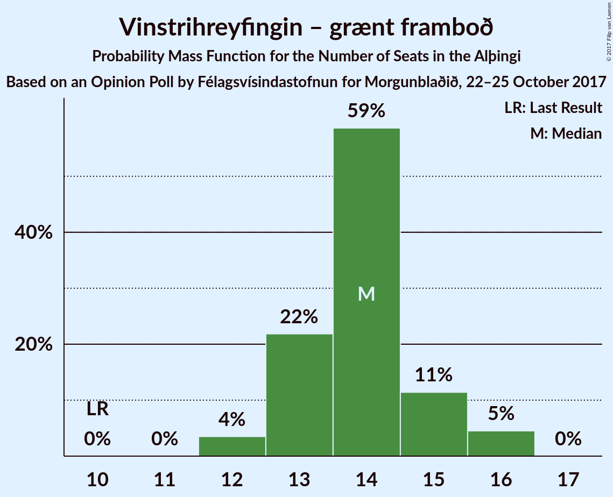

# Opinion Poll by Félagsvísindastofnun for Morgunblaðið, 22–25 October 2017

<a href="#voting-intentions">Voting Intentions</a> | <a href="#seats">Seats</a> | <a href="#coalitions">Coalitions</a> | <a href="#technical-information">Technical Information</a>

## Voting Intentions

### Confidence Intervals

| Party | Last Result | Poll Result | 80% Confidence Interval | 90% Confidence Interval | 95% Confidence Interval | 99% Confidence Interval |
|:-----:|:-----------:|:-----------:|:-----------------------:|:-----------------------:|:-----------------------:|:-----------------------:|
| Sjálfstæðisflokkurinn | 29.0% | 24.5% | 23.4–25.7% |23.0–26.0% |22.8–26.3% |22.2–26.9% |
| Vinstrihreyfingin – grænt framboð | 15.9% | 20.2% | 19.1–21.3% |18.9–21.6% |18.6–21.9% |18.1–22.4% |
| Samfylkingin | 5.7% | 15.3% | 14.4–16.3% |14.1–16.6% |13.9–16.8% |13.4–17.3% |
| Miðflokkurinn | 0.0% | 9.3% | 8.6–10.1% |8.3–10.3% |8.2–10.5% |7.8–11.0% |
| Píratar | 14.5% | 8.8% | 8.1–9.6% |7.9–9.8% |7.7–10.0% |7.4–10.4% |
| Viðreisn | 10.5% | 8.3% | 7.6–9.1% |7.4–9.3% |7.2–9.5% |6.9–9.9% |
| Framsóknarflokkurinn | 11.5% | 7.9% | 7.2–8.7% |7.0–8.9% |6.8–9.1% |6.5–9.5% |
| Flokkur fólksins | 3.5% | 4.2% | 3.7–4.8% |3.6–5.0% |3.5–5.1% |3.2–5.4% |
| Björt framtíð | 7.2% | 1.3% | 1.1–1.7% |1.0–1.8% |0.9–1.9% |0.8–2.1% |

*Note:* The poll result column reflects the actual value used in the calculations. Published results may vary slightly, and in addition be rounded to fewer digits.

## Seats

### Confidence Intervals

| Party | Last Result | Median | 80% Confidence Interval | 90% Confidence Interval | 95% Confidence Interval | 99% Confidence Interval |
|:-----:|:-----------:|:------:|:-----------------------:|:-----------------------:|:-----------------------:|:-----------------------:|
| <a href="#sjálfstæðisflokkurinn">Sjálfstæðisflokkurinn</a> | 21 | 17 | 15–18 |15–18 |15–18 |15–19 |
| <a href="#vinstrihreyfingin-–-grænt-framboð">Vinstrihreyfingin – grænt framboð</a> | 10 | 14 | 13–15 |13–15 |12–16 |12–16 |
| <a href="#samfylkingin">Samfylkingin</a> | 3 | 10 | 9–11 |9–11 |9–12 |9–12 |
| <a href="#miðflokkurinn">Miðflokkurinn</a> | 0 | 6 | 5–6 |5–7 |5–7 |5–7 |
| <a href="#píratar">Píratar</a> | 10 | 6 | 5–6 |5–6 |5–6 |5–7 |
| <a href="#viðreisn">Viðreisn</a> | 7 | 5 | 5–6 |5–6 |4–6 |4–6 |
| <a href="#framsóknarflokkurinn">Framsóknarflokkurinn</a> | 8 | 5 | 4–5 |4–6 |4–6 |4–6 |
| <a href="#flokkur-fólksins">Flokkur fólksins</a> | 0 | 0 | 0 |0 |0–3 |0–3 |
| <a href="#björt-framtíð">Björt framtíð</a> | 4 | 0 | 0 |0 |0 |0 |

### Sjálfstæðisflokkurinn

*For a full overview of the results for this party, see the [Sjálfstæðisflokkurinn](party-sjlfstisflokkurinn.html) page.*

| Number of Seats | Probability | Accumulated | Special Marks |
|:---------------:|:-----------:|:-----------:|:-------------:|
| 14 | 0.2% | 100% |  |
| 15 | 13% | 99.8% |  |
| 16 | 18% | 87% |  |
| 17 | 33% | 69% | Median |
| 18 | 36% | 37% |  |
| 19 | 1.0% | 1.1% |  |
| 20 | 0.1% | 0.1% |  |
| 21 | 0% | 0% | Last Result |

### Vinstrihreyfingin – grænt framboð

*For a full overview of the results for this party, see the [Vinstrihreyfingin – grænt framboð](party-vinstrihreyfingingrntframbo.html) page.*

| Number of Seats | Probability | Accumulated | Special Marks |
|:---------------:|:-----------:|:-----------:|:-------------:|
| 10 | 0% | 100% | Last Result |
| 11 | 0% | 100% |  |
| 12 | 5% | 100% |  |
| 13 | 24% | 95% |  |
| 14 | 54% | 71% | Median |
| 15 | 14% | 17% |  |
| 16 | 3% | 3% |  |
| 17 | 0.1% | 0.1% |  |
| 18 | 0% | 0% |  |

### Samfylkingin

*For a full overview of the results for this party, see the [Samfylkingin](party-samfylkingin.html) page.*

| Number of Seats | Probability | Accumulated | Special Marks |
|:---------------:|:-----------:|:-----------:|:-------------:|
| 3 | 0% | 100% | Last Result |
| 4 | 0% | 100% |  |
| 5 | 0% | 100% |  |
| 6 | 0% | 100% |  |
| 7 | 0% | 100% |  |
| 8 | 0.3% | 100% |  |
| 9 | 22% | 99.7% |  |
| 10 | 29% | 78% | Median |
| 11 | 45% | 49% |  |
| 12 | 3% | 3% |  |
| 13 | 0.1% | 0.1% |  |
| 14 | 0% | 0% |  |

### Miðflokkurinn

*For a full overview of the results for this party, see the [Miðflokkurinn](party-miflokkurinn.html) page.*

| Number of Seats | Probability | Accumulated | Special Marks |
|:---------------:|:-----------:|:-----------:|:-------------:|
| 0 | 0% | 100% | Last Result |
| 1 | 0% | 100% |  |
| 2 | 0% | 100% |  |
| 3 | 0% | 100% |  |
| 4 | 0.1% | 100% |  |
| 5 | 15% | 99.9% |  |
| 6 | 76% | 85% | Median |
| 7 | 8% | 8% |  |
| 8 | 0.2% | 0.2% |  |
| 9 | 0% | 0% |  |

### Píratar

*For a full overview of the results for this party, see the [Píratar](party-pratar.html) page.*

| Number of Seats | Probability | Accumulated | Special Marks |
|:---------------:|:-----------:|:-----------:|:-------------:|
| 4 | 0.4% | 100% |  |
| 5 | 39% | 99.6% |  |
| 6 | 59% | 61% | Median |
| 7 | 2% | 2% |  |
| 8 | 0% | 0% |  |
| 9 | 0% | 0% |  |
| 10 | 0% | 0% | Last Result |

### Viðreisn

*For a full overview of the results for this party, see the [Viðreisn](party-vireisn.html) page.*

| Number of Seats | Probability | Accumulated | Special Marks |
|:---------------:|:-----------:|:-----------:|:-------------:|
| 4 | 4% | 100% |  |
| 5 | 67% | 96% | Median |
| 6 | 29% | 29% |  |
| 7 | 0.1% | 0.1% | Last Result |
| 8 | 0% | 0% |  |

### Framsóknarflokkurinn

*For a full overview of the results for this party, see the [Framsóknarflokkurinn](party-framsknarflokkurinn.html) page.*

| Number of Seats | Probability | Accumulated | Special Marks |
|:---------------:|:-----------:|:-----------:|:-------------:|
| 4 | 11% | 100% |  |
| 5 | 81% | 89% | Median |
| 6 | 9% | 9% |  |
| 7 | 0% | 0% |  |
| 8 | 0% | 0% | Last Result |

### Flokkur fólksins

*For a full overview of the results for this party, see the [Flokkur fólksins](party-flokkurflksins.html) page.*

| Number of Seats | Probability | Accumulated | Special Marks |
|:---------------:|:-----------:|:-----------:|:-------------:|
| 0 | 96% | 100% | Last Result, Median |
| 1 | 0% | 4% |  |
| 2 | 0% | 4% |  |
| 3 | 4% | 4% |  |
| 4 | 0% | 0% |  |

### Björt framtíð

*For a full overview of the results for this party, see the [Björt framtíð](party-bjrtframt.html) page.*

| Number of Seats | Probability | Accumulated | Special Marks |
|:---------------:|:-----------:|:-----------:|:-------------:|
| 0 | 100% | 100% | Median |
| 1 | 0% | 0% |  |
| 2 | 0% | 0% |  |
| 3 | 0% | 0% |  |
| 4 | 0% | 0% | Last Result |

## Coalitions

### Confidence Intervals

| Coalition | Last Result | Median | Majority? | 80% Confidence Interval | 90% Confidence Interval | 95% Confidence Interval | 99% Confidence Interval |
|:---------:|:-----------:|:------:|:---------:|:-----------------------:|:-----------------------:|:-----------------------:|:-----------------------:|
| Vinstrihreyfingin – grænt framboð – Samfylkingin – Píratar – Viðreisn – Björt framtíð | 34 | 35 | 99.8% | 34–37 | 34–37 | 33–37 | 32–38 |
| Vinstrihreyfingin – grænt framboð – Samfylkingin – Miðflokkurinn – Framsóknarflokkurinn | 21 | 35 | 100% | 34–36 | 33–37 | 33–37 | 32–38 |
| Vinstrihreyfingin – grænt framboð – Samfylkingin – Píratar – Viðreisn | 30 | 35 | 99.8% | 34–37 | 34–37 | 33–37 | 32–38 |
| Sjálfstæðisflokkurinn – Vinstrihreyfingin – grænt framboð | 31 | 31 | 32% | 29–32 | 29–32 | 29–33 | 28–33 |
| Vinstrihreyfingin – grænt framboð – Samfylkingin – Píratar – Björt framtíð | 27 | 30 | 5% | 28–31 | 28–31 | 28–32 | 27–32 |
| Vinstrihreyfingin – grænt framboð – Samfylkingin – Miðflokkurinn | 13 | 30 | 7% | 29–31 | 28–32 | 28–32 | 28–33 |
| Vinstrihreyfingin – grænt framboð – Samfylkingin – Píratar | 23 | 30 | 5% | 28–31 | 28–31 | 28–32 | 27–32 |
| Vinstrihreyfingin – grænt framboð – Samfylkingin – Framsóknarflokkurinn | 21 | 29 | 0.6% | 28–31 | 27–31 | 27–31 | 27–32 |
| Sjálfstæðisflokkurinn – Miðflokkurinn – Framsóknarflokkurinn | 29 | 28 | 0% | 26–29 | 26–29 | 25–30 | 25–30 |
| Sjálfstæðisflokkurinn – Samfylkingin | 24 | 27 | 0% | 26–28 | 26–28 | 25–29 | 25–29 |
| Vinstrihreyfingin – grænt framboð – Miðflokkurinn – Framsóknarflokkurinn | 18 | 25 | 0% | 24–26 | 23–26 | 23–27 | 22–27 |
| Vinstrihreyfingin – grænt framboð – Samfylkingin | 13 | 24 | 0% | 23–25 | 23–26 | 22–26 | 22–27 |
| Sjálfstæðisflokkurinn – Miðflokkurinn | 21 | 23 | 0% | 21–24 | 21–24 | 21–25 | 20–25 |
| Sjálfstæðisflokkurinn – Viðreisn – Björt framtíð | 32 | 22 | 0% | 21–24 | 20–24 | 20–24 | 20–24 |
| Sjálfstæðisflokkurinn – Framsóknarflokkurinn | 29 | 22 | 0% | 20–23 | 20–23 | 20–24 | 19–24 |
| Sjálfstæðisflokkurinn – Viðreisn | 28 | 22 | 0% | 21–24 | 20–24 | 20–24 | 20–24 |
| Vinstrihreyfingin – grænt framboð – Miðflokkurinn | 10 | 20 | 0% | 19–21 | 18–21 | 18–21 | 18–22 |
| Vinstrihreyfingin – grænt framboð – Píratar | 20 | 19 | 0% | 18–21 | 18–21 | 18–21 | 17–22 |
| Vinstrihreyfingin – grænt framboð – Framsóknarflokkurinn | 18 | 19 | 0% | 18–20 | 17–20 | 17–21 | 17–21 |
| Sjálfstæðisflokkurinn – Björt framtíð | 25 | 17 | 0% | 15–18 | 15–18 | 15–18 | 15–19 |

### Vinstrihreyfingin – grænt framboð – Samfylkingin – Píratar – Viðreisn – Björt framtíð

| Number of Seats | Probability | Accumulated | Special Marks |
|:---------------:|:-----------:|:-----------:|:-------------:|
| 31 | 0.1% | 100% |  |
| 32 | 0.6% | 99.8% | Majority |
| 33 | 3% | 99.2% |  |
| 34 | 34% | 96% | Last Result |
| 35 | 28% | 62% | Median |
| 36 | 23% | 34% |  |
| 37 | 9% | 11% |  |
| 38 | 2% | 2% |  |
| 39 | 0% | 0% |  |

### Vinstrihreyfingin – grænt framboð – Samfylkingin – Miðflokkurinn – Framsóknarflokkurinn

| Number of Seats | Probability | Accumulated | Special Marks |
|:---------------:|:-----------:|:-----------:|:-------------:|
| 21 | 0% | 100% | Last Result |
| 22 | 0% | 100% |  |
| 23 | 0% | 100% |  |
| 24 | 0% | 100% |  |
| 25 | 0% | 100% |  |
| 26 | 0% | 100% |  |
| 27 | 0% | 100% |  |
| 28 | 0% | 100% |  |
| 29 | 0% | 100% |  |
| 30 | 0% | 100% |  |
| 31 | 0% | 100% |  |
| 32 | 0.7% | 100% | Majority |
| 33 | 6% | 99.3% |  |
| 34 | 27% | 93% |  |
| 35 | 27% | 66% | Median |
| 36 | 30% | 39% |  |
| 37 | 9% | 9% |  |
| 38 | 0.6% | 0.6% |  |
| 39 | 0% | 0% |  |

### Vinstrihreyfingin – grænt framboð – Samfylkingin – Píratar – Viðreisn

| Number of Seats | Probability | Accumulated | Special Marks |
|:---------------:|:-----------:|:-----------:|:-------------:|
| 30 | 0% | 100% | Last Result |
| 31 | 0.1% | 100% |  |
| 32 | 0.6% | 99.8% | Majority |
| 33 | 3% | 99.2% |  |
| 34 | 34% | 96% |  |
| 35 | 28% | 62% | Median |
| 36 | 23% | 34% |  |
| 37 | 9% | 11% |  |
| 38 | 2% | 2% |  |
| 39 | 0% | 0% |  |

### Sjálfstæðisflokkurinn – Vinstrihreyfingin – grænt framboð

| Number of Seats | Probability | Accumulated | Special Marks |
|:---------------:|:-----------:|:-----------:|:-------------:|
| 27 | 0.1% | 100% |  |
| 28 | 1.0% | 99.9% |  |
| 29 | 14% | 98.9% |  |
| 30 | 23% | 85% |  |
| 31 | 30% | 62% | Last Result, Median |
| 32 | 29% | 32% | Majority |
| 33 | 3% | 3% |  |
| 34 | 0.1% | 0.1% |  |
| 35 | 0% | 0% |  |

### Vinstrihreyfingin – grænt framboð – Samfylkingin – Píratar – Björt framtíð

| Number of Seats | Probability | Accumulated | Special Marks |
|:---------------:|:-----------:|:-----------:|:-------------:|
| 26 | 0.1% | 100% |  |
| 27 | 0.9% | 99.8% | Last Result |
| 28 | 11% | 99.0% |  |
| 29 | 29% | 88% |  |
| 30 | 31% | 59% | Median |
| 31 | 23% | 28% |  |
| 32 | 4% | 5% | Majority |
| 33 | 0.1% | 0.1% |  |
| 34 | 0% | 0% |  |

### Vinstrihreyfingin – grænt framboð – Samfylkingin – Miðflokkurinn

| Number of Seats | Probability | Accumulated | Special Marks |
|:---------------:|:-----------:|:-----------:|:-------------:|
| 13 | 0% | 100% | Last Result |
| 14 | 0% | 100% |  |
| 15 | 0% | 100% |  |
| 16 | 0% | 100% |  |
| 17 | 0% | 100% |  |
| 18 | 0% | 100% |  |
| 19 | 0% | 100% |  |
| 20 | 0% | 100% |  |
| 21 | 0% | 100% |  |
| 22 | 0% | 100% |  |
| 23 | 0% | 100% |  |
| 24 | 0% | 100% |  |
| 25 | 0% | 100% |  |
| 26 | 0% | 100% |  |
| 27 | 0.3% | 100% |  |
| 28 | 6% | 99.7% |  |
| 29 | 27% | 94% |  |
| 30 | 25% | 67% | Median |
| 31 | 35% | 42% |  |
| 32 | 6% | 7% | Majority |
| 33 | 0.6% | 0.6% |  |
| 34 | 0% | 0% |  |

### Vinstrihreyfingin – grænt framboð – Samfylkingin – Píratar

| Number of Seats | Probability | Accumulated | Special Marks |
|:---------------:|:-----------:|:-----------:|:-------------:|
| 23 | 0% | 100% | Last Result |
| 24 | 0% | 100% |  |
| 25 | 0% | 100% |  |
| 26 | 0.1% | 100% |  |
| 27 | 0.9% | 99.8% |  |
| 28 | 11% | 99.0% |  |
| 29 | 29% | 88% |  |
| 30 | 31% | 59% | Median |
| 31 | 23% | 28% |  |
| 32 | 4% | 5% | Majority |
| 33 | 0.1% | 0.1% |  |
| 34 | 0% | 0% |  |

### Vinstrihreyfingin – grænt framboð – Samfylkingin – Framsóknarflokkurinn

| Number of Seats | Probability | Accumulated | Special Marks |
|:---------------:|:-----------:|:-----------:|:-------------:|
| 21 | 0% | 100% | Last Result |
| 22 | 0% | 100% |  |
| 23 | 0% | 100% |  |
| 24 | 0% | 100% |  |
| 25 | 0% | 100% |  |
| 26 | 0.4% | 100% |  |
| 27 | 6% | 99.5% |  |
| 28 | 27% | 94% |  |
| 29 | 23% | 67% | Median |
| 30 | 33% | 44% |  |
| 31 | 10% | 11% |  |
| 32 | 0.6% | 0.6% | Majority |
| 33 | 0% | 0% |  |

### Sjálfstæðisflokkurinn – Miðflokkurinn – Framsóknarflokkurinn

| Number of Seats | Probability | Accumulated | Special Marks |
|:---------------:|:-----------:|:-----------:|:-------------:|
| 24 | 0.2% | 100% |  |
| 25 | 3% | 99.7% |  |
| 26 | 10% | 97% |  |
| 27 | 24% | 87% |  |
| 28 | 28% | 63% | Median |
| 29 | 33% | 35% | Last Result |
| 30 | 2% | 3% |  |
| 31 | 0.2% | 0.2% |  |
| 32 | 0% | 0% | Majority |

### Sjálfstæðisflokkurinn – Samfylkingin

| Number of Seats | Probability | Accumulated | Special Marks |
|:---------------:|:-----------:|:-----------:|:-------------:|
| 24 | 0.3% | 100% | Last Result |
| 25 | 3% | 99.7% |  |
| 26 | 15% | 97% |  |
| 27 | 41% | 83% | Median |
| 28 | 38% | 41% |  |
| 29 | 3% | 3% |  |
| 30 | 0.2% | 0.2% |  |
| 31 | 0% | 0% |  |

### Vinstrihreyfingin – grænt framboð – Miðflokkurinn – Framsóknarflokkurinn

| Number of Seats | Probability | Accumulated | Special Marks |
|:---------------:|:-----------:|:-----------:|:-------------:|
| 18 | 0% | 100% | Last Result |
| 19 | 0% | 100% |  |
| 20 | 0% | 100% |  |
| 21 | 0% | 100% |  |
| 22 | 0.5% | 100% |  |
| 23 | 6% | 99.4% |  |
| 24 | 26% | 93% |  |
| 25 | 53% | 67% | Median |
| 26 | 11% | 14% |  |
| 27 | 3% | 3% |  |
| 28 | 0.1% | 0.1% |  |
| 29 | 0% | 0% |  |

### Vinstrihreyfingin – grænt framboð – Samfylkingin

| Number of Seats | Probability | Accumulated | Special Marks |
|:---------------:|:-----------:|:-----------:|:-------------:|
| 13 | 0% | 100% | Last Result |
| 14 | 0% | 100% |  |
| 15 | 0% | 100% |  |
| 16 | 0% | 100% |  |
| 17 | 0% | 100% |  |
| 18 | 0% | 100% |  |
| 19 | 0% | 100% |  |
| 20 | 0% | 100% |  |
| 21 | 0.2% | 100% |  |
| 22 | 4% | 99.7% |  |
| 23 | 30% | 96% |  |
| 24 | 20% | 66% | Median |
| 25 | 39% | 47% |  |
| 26 | 7% | 8% |  |
| 27 | 0.6% | 0.6% |  |
| 28 | 0% | 0% |  |

### Sjálfstæðisflokkurinn – Miðflokkurinn

| Number of Seats | Probability | Accumulated | Special Marks |
|:---------------:|:-----------:|:-----------:|:-------------:|
| 19 | 0.1% | 100% |  |
| 20 | 2% | 99.9% |  |
| 21 | 12% | 98% | Last Result |
| 22 | 21% | 86% |  |
| 23 | 31% | 65% | Median |
| 24 | 32% | 34% |  |
| 25 | 3% | 3% |  |
| 26 | 0.1% | 0.1% |  |
| 27 | 0% | 0% |  |

### Sjálfstæðisflokkurinn – Viðreisn – Björt framtíð

| Number of Seats | Probability | Accumulated | Special Marks |
|:---------------:|:-----------:|:-----------:|:-------------:|
| 19 | 0.2% | 100% |  |
| 20 | 6% | 99.8% |  |
| 21 | 20% | 94% |  |
| 22 | 33% | 73% | Median |
| 23 | 30% | 41% |  |
| 24 | 11% | 11% |  |
| 25 | 0.1% | 0.1% |  |
| 26 | 0% | 0% |  |
| 27 | 0% | 0% |  |
| 28 | 0% | 0% |  |
| 29 | 0% | 0% |  |
| 30 | 0% | 0% |  |
| 31 | 0% | 0% |  |
| 32 | 0% | 0% | Last Result, Majority |

### Sjálfstæðisflokkurinn – Framsóknarflokkurinn

| Number of Seats | Probability | Accumulated | Special Marks |
|:---------------:|:-----------:|:-----------:|:-------------:|
| 19 | 1.1% | 100% |  |
| 20 | 11% | 98.8% |  |
| 21 | 21% | 88% |  |
| 22 | 32% | 67% | Median |
| 23 | 32% | 35% |  |
| 24 | 3% | 4% |  |
| 25 | 0.1% | 0.1% |  |
| 26 | 0% | 0% |  |
| 27 | 0% | 0% |  |
| 28 | 0% | 0% |  |
| 29 | 0% | 0% | Last Result |

### Sjálfstæðisflokkurinn – Viðreisn

| Number of Seats | Probability | Accumulated | Special Marks |
|:---------------:|:-----------:|:-----------:|:-------------:|
| 19 | 0.2% | 100% |  |
| 20 | 6% | 99.8% |  |
| 21 | 20% | 94% |  |
| 22 | 33% | 73% | Median |
| 23 | 30% | 41% |  |
| 24 | 11% | 11% |  |
| 25 | 0.1% | 0.1% |  |
| 26 | 0% | 0% |  |
| 27 | 0% | 0% |  |
| 28 | 0% | 0% | Last Result |

### Vinstrihreyfingin – grænt framboð – Miðflokkurinn

| Number of Seats | Probability | Accumulated | Special Marks |
|:---------------:|:-----------:|:-----------:|:-------------:|
| 10 | 0% | 100% | Last Result |
| 11 | 0% | 100% |  |
| 12 | 0% | 100% |  |
| 13 | 0% | 100% |  |
| 14 | 0% | 100% |  |
| 15 | 0% | 100% |  |
| 16 | 0% | 100% |  |
| 17 | 0.2% | 100% |  |
| 18 | 6% | 99.8% |  |
| 19 | 24% | 94% |  |
| 20 | 56% | 70% | Median |
| 21 | 12% | 14% |  |
| 22 | 2% | 2% |  |
| 23 | 0.1% | 0.1% |  |
| 24 | 0% | 0% |  |

### Vinstrihreyfingin – grænt framboð – Píratar

| Number of Seats | Probability | Accumulated | Special Marks |
|:---------------:|:-----------:|:-----------:|:-------------:|
| 17 | 0.6% | 100% |  |
| 18 | 13% | 99.3% |  |
| 19 | 36% | 86% |  |
| 20 | 37% | 50% | Last Result, Median |
| 21 | 11% | 12% |  |
| 22 | 2% | 2% |  |
| 23 | 0% | 0% |  |

### Vinstrihreyfingin – grænt framboð – Framsóknarflokkurinn

| Number of Seats | Probability | Accumulated | Special Marks |
|:---------------:|:-----------:|:-----------:|:-------------:|
| 16 | 0.4% | 100% |  |
| 17 | 6% | 99.6% |  |
| 18 | 25% | 94% | Last Result |
| 19 | 50% | 69% | Median |
| 20 | 14% | 19% |  |
| 21 | 4% | 4% |  |
| 22 | 0.1% | 0.1% |  |
| 23 | 0% | 0% |  |

### Sjálfstæðisflokkurinn – Björt framtíð

| Number of Seats | Probability | Accumulated | Special Marks |
|:---------------:|:-----------:|:-----------:|:-------------:|
| 14 | 0.2% | 100% |  |
| 15 | 13% | 99.8% |  |
| 16 | 18% | 87% |  |
| 17 | 33% | 69% | Median |
| 18 | 36% | 37% |  |
| 19 | 1.0% | 1.1% |  |
| 20 | 0.1% | 0.1% |  |
| 21 | 0% | 0% |  |
| 22 | 0% | 0% |  |
| 23 | 0% | 0% |  |
| 24 | 0% | 0% |  |
| 25 | 0% | 0% | Last Result |

## Technical Information

### Opinion Poll

+ **Polling firm:** Félagsvísindastofnun
+ **Commissioner(s):** Morgunblaðið
+ **Fieldwork period:** 22–25 October 2017

### Calculations

+ **Sample size:** 2283
+ **Simulations done:** 2,097,152
+ **Error estimate:** 1.22%

