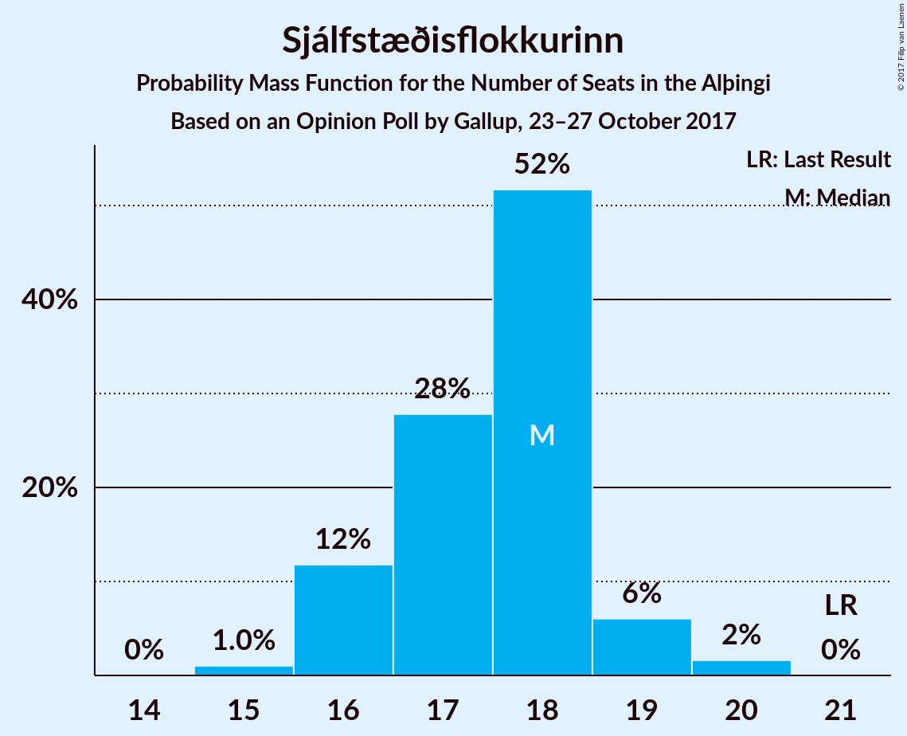
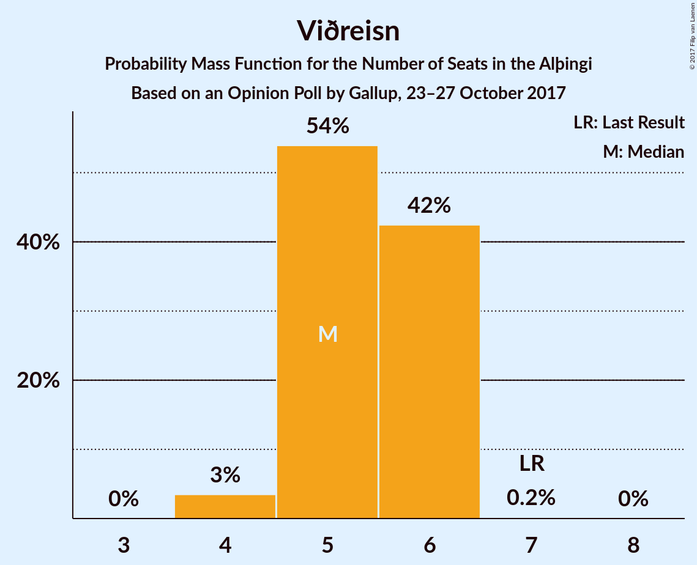
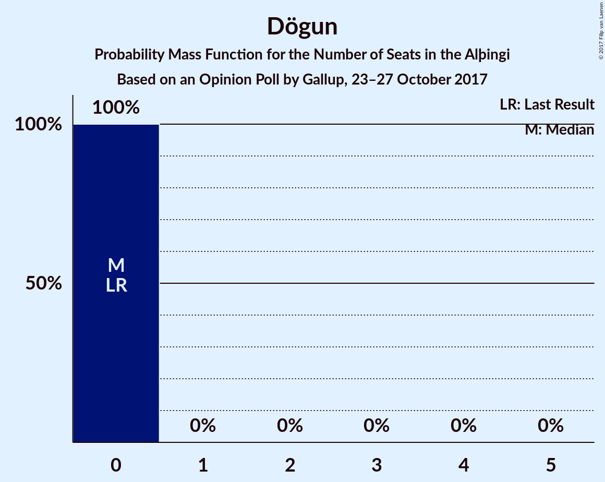

# Opinion Poll by Gallup, 23–27 October 2017

<a href="#voting-intentions">Voting Intentions</a> | <a href="#seats">Seats</a> | <a href="#coalitions">Coalitions</a> | <a href="#technical-information">Technical Information</a>

## Voting Intentions

### Confidence Intervals

| Party | Last Result | Poll Result | 80% Confidence Interval | 90% Confidence Interval | 95% Confidence Interval | 99% Confidence Interval |
|:-----:|:-----------:|:-----------:|:-----------------------:|:-----------------------:|:-----------------------:|:-----------------------:|
| Sjálfstæðisflokkurinn | 29.0% | 25.2% | 24.1–26.5% |23.7–26.8% |23.4–27.1% |22.9–27.7% |
| Vinstrihreyfingin – grænt framboð | 15.9% | 17.3% | 16.3–18.4% |16.0–18.7% |15.7–18.9% |15.3–19.5% |
| Samfylkingin | 5.7% | 15.5% | 14.5–16.5% |14.2–16.8% |14.0–17.1% |13.5–17.6% |
| Miðflokkurinn | 0.0% | 9.7% | 8.9–10.5% |8.7–10.8% |8.5–11.0% |8.1–11.4% |
| Píratar | 14.5% | 9.0% | 8.2–9.8% |8.0–10.0% |7.8–10.3% |7.5–10.7% |
| Framsóknarflokkurinn | 11.5% | 8.9% | 8.1–9.7% |7.9–10.0% |7.7–10.2% |7.4–10.6% |
| Viðreisn | 10.5% | 8.2% | 7.5–9.0% |7.3–9.3% |7.1–9.5% |6.8–9.9% |
| Flokkur fólksins | 3.5% | 4.0% | 3.5–4.6% |3.4–4.8% |3.2–4.9% |3.0–5.2% |
| Björt framtíð | 7.2% | 1.5% | 1.2–1.9% |1.1–2.0% |1.1–2.1% |0.9–2.3% |
| Alþýðufylkingin | 0.3% | 0.6% | 0.4–0.9% |0.4–1.0% |0.4–1.1% |0.3–1.2% |
| Dögun | 1.7% | 0.1% | 0.0–0.3% |0.0–0.3% |0.0–0.4% |0.0–0.4% |

*Note:* The poll result column reflects the actual value used in the calculations. Published results may vary slightly, and in addition be rounded to fewer digits.

## Seats

### Confidence Intervals

| Party | Last Result | Median | 80% Confidence Interval | 90% Confidence Interval | 95% Confidence Interval | 99% Confidence Interval |
|:-----:|:-----------:|:------:|:-----------------------:|:-----------------------:|:-----------------------:|:-----------------------:|
| <a href="#sjálfstæðisflokkurinn">Sjálfstæðisflokkurinn</a> | 21 | 18 | 17–19 |16–19 |16–19 |15–20 |
| <a href="#vinstrihreyfingin-–-grænt-framboð">Vinstrihreyfingin – grænt framboð</a> | 10 | 11 | 11–12 |11–13 |11–13 |10–14 |
| <a href="#samfylkingin">Samfylkingin</a> | 3 | 10 | 10–12 |9–12 |9–12 |9–12 |
| <a href="#miðflokkurinn">Miðflokkurinn</a> | 0 | 6 | 6–7 |6–7 |6–8 |5–8 |
| <a href="#píratar">Píratar</a> | 10 | 6 | 5–6 |5–6 |5–6 |5–7 |
| <a href="#framsóknarflokkurinn">Framsóknarflokkurinn</a> | 8 | 5 | 5–6 |5–6 |5–6 |5–7 |
| <a href="#viðreisn">Viðreisn</a> | 7 | 5 | 5–6 |5–6 |4–6 |4–6 |
| <a href="#flokkur-fólksins">Flokkur fólksins</a> | 0 | 0 | 0 |0 |0 |0–3 |
| <a href="#björt-framtíð">Björt framtíð</a> | 4 | 0 | 0 |0 |0 |0 |
| <a href="#alþýðufylkingin">Alþýðufylkingin</a> | 0 | 0 | 0 |0 |0 |0 |
| <a href="#dögun">Dögun</a> | 0 | 0 | 0 |0 |0 |0 |

### Sjálfstæðisflokkurinn

*For a full overview of the results for this party, see the [Sjálfstæðisflokkurinn](party-sjlfstisflokkurinn.html) page.*

| Number of Seats | Probability | Accumulated | Special Marks |
|:---------------:|:-----------:|:-----------:|:-------------:|
| 15 | 0.7% | 100% |  |
| 16 | 8% | 99.3% |  |
| 17 | 5% | 91% |  |
| 18 | 75% | 86% | Median |
| 19 | 9% | 11% |  |
| 20 | 2% | 2% |  |
| 21 | 0% | 0% | Last Result |

### Vinstrihreyfingin – grænt framboð

*For a full overview of the results for this party, see the [Vinstrihreyfingin – grænt framboð](party-vinstrihreyfingingrntframbo.html) page.*

| Number of Seats | Probability | Accumulated | Special Marks |
|:---------------:|:-----------:|:-----------:|:-------------:|
| 10 | 2% | 100% | Last Result |
| 11 | 48% | 98% | Median |
| 12 | 41% | 50% |  |
| 13 | 9% | 9% |  |
| 14 | 0.5% | 0.5% |  |
| 15 | 0% | 0% |  |

### Samfylkingin

*For a full overview of the results for this party, see the [Samfylkingin](party-samfylkingin.html) page.*

| Number of Seats | Probability | Accumulated | Special Marks |
|:---------------:|:-----------:|:-----------:|:-------------:|
| 3 | 0% | 100% | Last Result |
| 4 | 0% | 100% |  |
| 5 | 0% | 100% |  |
| 6 | 0% | 100% |  |
| 7 | 0% | 100% |  |
| 8 | 0.1% | 100% |  |
| 9 | 5% | 99.9% |  |
| 10 | 46% | 95% | Median |
| 11 | 4% | 48% |  |
| 12 | 44% | 44% |  |
| 13 | 0.2% | 0.2% |  |
| 14 | 0% | 0% |  |

### Miðflokkurinn

*For a full overview of the results for this party, see the [Miðflokkurinn](party-miflokkurinn.html) page.*

| Number of Seats | Probability | Accumulated | Special Marks |
|:---------------:|:-----------:|:-----------:|:-------------:|
| 0 | 0% | 100% | Last Result |
| 1 | 0% | 100% |  |
| 2 | 0% | 100% |  |
| 3 | 0% | 100% |  |
| 4 | 0% | 100% |  |
| 5 | 2% | 100% |  |
| 6 | 78% | 98% | Median |
| 7 | 17% | 20% |  |
| 8 | 3% | 3% |  |
| 9 | 0% | 0% |  |

### Píratar

*For a full overview of the results for this party, see the [Píratar](party-pratar.html) page.*

| Number of Seats | Probability | Accumulated | Special Marks |
|:---------------:|:-----------:|:-----------:|:-------------:|
| 4 | 0.2% | 100% |  |
| 5 | 26% | 99.8% |  |
| 6 | 72% | 74% | Median |
| 7 | 2% | 2% |  |
| 8 | 0% | 0% |  |
| 9 | 0% | 0% |  |
| 10 | 0% | 0% | Last Result |

### Framsóknarflokkurinn

*For a full overview of the results for this party, see the [Framsóknarflokkurinn](party-framsknarflokkurinn.html) page.*

| Number of Seats | Probability | Accumulated | Special Marks |
|:---------------:|:-----------:|:-----------:|:-------------:|
| 4 | 0.3% | 100% |  |
| 5 | 55% | 99.7% | Median |
| 6 | 44% | 45% |  |
| 7 | 1.0% | 1.0% |  |
| 8 | 0% | 0% | Last Result |

### Viðreisn

*For a full overview of the results for this party, see the [Viðreisn](party-vireisn.html) page.*

| Number of Seats | Probability | Accumulated | Special Marks |
|:---------------:|:-----------:|:-----------:|:-------------:|
| 4 | 3% | 100% |  |
| 5 | 77% | 97% | Median |
| 6 | 20% | 20% |  |
| 7 | 0.1% | 0.1% | Last Result |
| 8 | 0% | 0% |  |

### Flokkur fólksins

*For a full overview of the results for this party, see the [Flokkur fólksins](party-flokkurflksins.html) page.*

| Number of Seats | Probability | Accumulated | Special Marks |
|:---------------:|:-----------:|:-----------:|:-------------:|
| 0 | 98% | 100% | Last Result, Median |
| 1 | 0% | 2% |  |
| 2 | 0% | 2% |  |
| 3 | 2% | 2% |  |
| 4 | 0% | 0% |  |

### Björt framtíð

*For a full overview of the results for this party, see the [Björt framtíð](party-bjrtframt.html) page.*

| Number of Seats | Probability | Accumulated | Special Marks |
|:---------------:|:-----------:|:-----------:|:-------------:|
| 0 | 100% | 100% | Median |
| 1 | 0% | 0% |  |
| 2 | 0% | 0% |  |
| 3 | 0% | 0% |  |
| 4 | 0% | 0% | Last Result |

### Alþýðufylkingin

*For a full overview of the results for this party, see the [Alþýðufylkingin](party-alufylkingin.html) page.*

| Number of Seats | Probability | Accumulated | Special Marks |
|:---------------:|:-----------:|:-----------:|:-------------:|
| 0 | 100% | 100% | Last Result, Median |

### Dögun

*For a full overview of the results for this party, see the [Dögun](party-dgun.html) page.*

| Number of Seats | Probability | Accumulated | Special Marks |
|:---------------:|:-----------:|:-----------:|:-------------:|
| 0 | 100% | 100% | Last Result, Median |

## Coalitions

### Confidence Intervals

| Coalition | Last Result | Median | Majority? | 80% Confidence Interval | 90% Confidence Interval | 95% Confidence Interval | 99% Confidence Interval |
|:---------:|:-----------:|:------:|:---------:|:-----------------------:|:-----------------------:|:-----------------------:|:-----------------------:|
| Vinstrihreyfingin – grænt framboð – Samfylkingin – Miðflokkurinn – Framsóknarflokkurinn | 21 | 34 | 99.7% | 33–35 | 33–36 | 33–36 | 32–37 |
| Vinstrihreyfingin – grænt framboð – Samfylkingin – Píratar – Viðreisn – Björt framtíð | 34 | 34 | 96% | 32–34 | 32–35 | 31–35 | 31–36 |
| Vinstrihreyfingin – grænt framboð – Samfylkingin – Píratar – Viðreisn | 30 | 34 | 96% | 32–34 | 32–35 | 31–35 | 31–36 |
| Sjálfstæðisflokkurinn – Miðflokkurinn – Framsóknarflokkurinn | 29 | 29 | 2% | 29–31 | 28–31 | 28–31 | 27–32 |
| Sjálfstæðisflokkurinn – Vinstrihreyfingin – grænt framboð | 31 | 29 | 0.2% | 28–31 | 28–31 | 28–31 | 27–31 |
| Vinstrihreyfingin – grænt framboð – Samfylkingin – Miðflokkurinn | 13 | 29 | 0% | 28–30 | 27–30 | 27–30 | 27–31 |
| Sjálfstæðisflokkurinn – Samfylkingin | 24 | 28 | 0.1% | 28–30 | 27–30 | 27–30 | 26–30 |
| Vinstrihreyfingin – grænt framboð – Samfylkingin – Píratar – Björt framtíð | 27 | 28 | 0% | 27–29 | 26–30 | 26–30 | 26–31 |
| Vinstrihreyfingin – grænt framboð – Samfylkingin – Framsóknarflokkurinn | 21 | 28 | 0% | 27–29 | 26–30 | 26–30 | 25–31 |
| Vinstrihreyfingin – grænt framboð – Samfylkingin – Píratar | 23 | 28 | 0% | 27–29 | 26–30 | 26–30 | 26–31 |
| Sjálfstæðisflokkurinn – Miðflokkurinn | 21 | 24 | 0% | 23–25 | 22–25 | 22–26 | 22–27 |
| Vinstrihreyfingin – grænt framboð – Miðflokkurinn – Framsóknarflokkurinn | 18 | 23 | 0% | 22–25 | 22–25 | 22–25 | 21–26 |
| Sjálfstæðisflokkurinn – Framsóknarflokkurinn | 29 | 23 | 0% | 22–24 | 22–24 | 22–25 | 21–25 |
| Sjálfstæðisflokkurinn – Viðreisn – Björt framtíð | 32 | 23 | 0% | 22–24 | 21–24 | 21–25 | 20–25 |
| Sjálfstæðisflokkurinn – Viðreisn | 28 | 23 | 0% | 22–24 | 21–24 | 21–25 | 20–25 |
| Vinstrihreyfingin – grænt framboð – Samfylkingin | 13 | 23 | 0% | 21–23 | 21–24 | 20–24 | 20–25 |
| Vinstrihreyfingin – grænt framboð – Miðflokkurinn | 10 | 18 | 0% | 17–19 | 17–19 | 17–19 | 16–20 |
| Sjálfstæðisflokkurinn – Björt framtíð | 25 | 18 | 0% | 17–19 | 16–19 | 16–19 | 15–20 |
| Vinstrihreyfingin – grænt framboð – Framsóknarflokkurinn | 18 | 17 | 0% | 16–18 | 16–19 | 16–19 | 15–20 |
| Vinstrihreyfingin – grænt framboð – Píratar | 20 | 17 | 0% | 16–18 | 16–18 | 16–18 | 16–19 |

### Vinstrihreyfingin – grænt framboð – Samfylkingin – Miðflokkurinn – Framsóknarflokkurinn

| Number of Seats | Probability | Accumulated | Special Marks |
|:---------------:|:-----------:|:-----------:|:-------------:|
| 21 | 0% | 100% | Last Result |
| 22 | 0% | 100% |  |
| 23 | 0% | 100% |  |
| 24 | 0% | 100% |  |
| 25 | 0% | 100% |  |
| 26 | 0% | 100% |  |
| 27 | 0% | 100% |  |
| 28 | 0% | 100% |  |
| 29 | 0% | 100% |  |
| 30 | 0% | 100% |  |
| 31 | 0.3% | 100% |  |
| 32 | 2% | 99.7% | Median, Majority |
| 33 | 21% | 98% |  |
| 34 | 50% | 76% |  |
| 35 | 17% | 26% |  |
| 36 | 8% | 9% |  |
| 37 | 0.9% | 0.9% |  |
| 38 | 0% | 0% |  |

### Vinstrihreyfingin – grænt framboð – Samfylkingin – Píratar – Viðreisn – Björt framtíð

| Number of Seats | Probability | Accumulated | Special Marks |
|:---------------:|:-----------:|:-----------:|:-------------:|
| 30 | 0.4% | 100% |  |
| 31 | 4% | 99.6% |  |
| 32 | 12% | 96% | Median, Majority |
| 33 | 34% | 84% |  |
| 34 | 42% | 50% | Last Result |
| 35 | 8% | 8% |  |
| 36 | 0.6% | 0.6% |  |
| 37 | 0% | 0% |  |

### Vinstrihreyfingin – grænt framboð – Samfylkingin – Píratar – Viðreisn

| Number of Seats | Probability | Accumulated | Special Marks |
|:---------------:|:-----------:|:-----------:|:-------------:|
| 30 | 0.4% | 100% | Last Result |
| 31 | 4% | 99.6% |  |
| 32 | 12% | 96% | Median, Majority |
| 33 | 34% | 84% |  |
| 34 | 42% | 50% |  |
| 35 | 8% | 8% |  |
| 36 | 0.6% | 0.6% |  |
| 37 | 0% | 0% |  |

### Sjálfstæðisflokkurinn – Miðflokkurinn – Framsóknarflokkurinn

| Number of Seats | Probability | Accumulated | Special Marks |
|:---------------:|:-----------:|:-----------:|:-------------:|
| 27 | 0.7% | 100% |  |
| 28 | 8% | 99.3% |  |
| 29 | 44% | 91% | Last Result, Median |
| 30 | 34% | 48% |  |
| 31 | 12% | 14% |  |
| 32 | 2% | 2% | Majority |
| 33 | 0% | 0% |  |

### Sjálfstæðisflokkurinn – Vinstrihreyfingin – grænt framboð

| Number of Seats | Probability | Accumulated | Special Marks |
|:---------------:|:-----------:|:-----------:|:-------------:|
| 26 | 0.3% | 100% |  |
| 27 | 2% | 99.7% |  |
| 28 | 10% | 98% |  |
| 29 | 45% | 88% | Median |
| 30 | 24% | 42% |  |
| 31 | 18% | 18% | Last Result |
| 32 | 0.2% | 0.2% | Majority |
| 33 | 0% | 0% |  |

### Vinstrihreyfingin – grænt framboð – Samfylkingin – Miðflokkurinn

| Number of Seats | Probability | Accumulated | Special Marks |
|:---------------:|:-----------:|:-----------:|:-------------:|
| 13 | 0% | 100% | Last Result |
| 14 | 0% | 100% |  |
| 15 | 0% | 100% |  |
| 16 | 0% | 100% |  |
| 17 | 0% | 100% |  |
| 18 | 0% | 100% |  |
| 19 | 0% | 100% |  |
| 20 | 0% | 100% |  |
| 21 | 0% | 100% |  |
| 22 | 0% | 100% |  |
| 23 | 0% | 100% |  |
| 24 | 0% | 100% |  |
| 25 | 0% | 100% |  |
| 26 | 0.4% | 100% |  |
| 27 | 5% | 99.6% | Median |
| 28 | 36% | 95% |  |
| 29 | 48% | 59% |  |
| 30 | 9% | 10% |  |
| 31 | 0.8% | 0.8% |  |
| 32 | 0% | 0% | Majority |

### Sjálfstæðisflokkurinn – Samfylkingin

| Number of Seats | Probability | Accumulated | Special Marks |
|:---------------:|:-----------:|:-----------:|:-------------:|
| 24 | 0% | 100% | Last Result |
| 25 | 0.3% | 100% |  |
| 26 | 0.7% | 99.7% |  |
| 27 | 7% | 99.0% |  |
| 28 | 44% | 92% | Median |
| 29 | 12% | 48% |  |
| 30 | 36% | 36% |  |
| 31 | 0.1% | 0.2% |  |
| 32 | 0.1% | 0.1% | Majority |
| 33 | 0% | 0% |  |

### Vinstrihreyfingin – grænt framboð – Samfylkingin – Píratar – Björt framtíð

| Number of Seats | Probability | Accumulated | Special Marks |
|:---------------:|:-----------:|:-----------:|:-------------:|
| 26 | 8% | 100% |  |
| 27 | 11% | 92% | Last Result, Median |
| 28 | 39% | 80% |  |
| 29 | 35% | 41% |  |
| 30 | 6% | 7% |  |
| 31 | 0.5% | 0.5% |  |
| 32 | 0% | 0% | Majority |

### Vinstrihreyfingin – grænt framboð – Samfylkingin – Framsóknarflokkurinn

| Number of Seats | Probability | Accumulated | Special Marks |
|:---------------:|:-----------:|:-----------:|:-------------:|
| 21 | 0% | 100% | Last Result |
| 22 | 0% | 100% |  |
| 23 | 0% | 100% |  |
| 24 | 0.2% | 100% |  |
| 25 | 2% | 99.8% |  |
| 26 | 4% | 98% | Median |
| 27 | 24% | 94% |  |
| 28 | 48% | 70% |  |
| 29 | 14% | 21% |  |
| 30 | 7% | 7% |  |
| 31 | 0.6% | 0.6% |  |
| 32 | 0% | 0% | Majority |

### Vinstrihreyfingin – grænt framboð – Samfylkingin – Píratar

| Number of Seats | Probability | Accumulated | Special Marks |
|:---------------:|:-----------:|:-----------:|:-------------:|
| 23 | 0% | 100% | Last Result |
| 24 | 0% | 100% |  |
| 25 | 0% | 100% |  |
| 26 | 8% | 100% |  |
| 27 | 11% | 92% | Median |
| 28 | 39% | 80% |  |
| 29 | 35% | 41% |  |
| 30 | 6% | 7% |  |
| 31 | 0.5% | 0.5% |  |
| 32 | 0% | 0% | Majority |

### Sjálfstæðisflokkurinn – Miðflokkurinn

| Number of Seats | Probability | Accumulated | Special Marks |
|:---------------:|:-----------:|:-----------:|:-------------:|
| 21 | 0.4% | 100% | Last Result |
| 22 | 7% | 99.6% |  |
| 23 | 5% | 93% |  |
| 24 | 64% | 87% | Median |
| 25 | 19% | 23% |  |
| 26 | 2% | 4% |  |
| 27 | 2% | 2% |  |
| 28 | 0% | 0% |  |

### Vinstrihreyfingin – grænt framboð – Miðflokkurinn – Framsóknarflokkurinn

| Number of Seats | Probability | Accumulated | Special Marks |
|:---------------:|:-----------:|:-----------:|:-------------:|
| 18 | 0% | 100% | Last Result |
| 19 | 0% | 100% |  |
| 20 | 0% | 100% |  |
| 21 | 1.2% | 100% |  |
| 22 | 33% | 98.7% | Median |
| 23 | 23% | 66% |  |
| 24 | 29% | 43% |  |
| 25 | 13% | 14% |  |
| 26 | 0.8% | 1.1% |  |
| 27 | 0.3% | 0.3% |  |
| 28 | 0% | 0% |  |

### Sjálfstæðisflokkurinn – Framsóknarflokkurinn

| Number of Seats | Probability | Accumulated | Special Marks |
|:---------------:|:-----------:|:-----------:|:-------------:|
| 21 | 1.2% | 100% |  |
| 22 | 10% | 98.8% |  |
| 23 | 45% | 89% | Median |
| 24 | 41% | 44% |  |
| 25 | 3% | 3% |  |
| 26 | 0.1% | 0.1% |  |
| 27 | 0% | 0% |  |
| 28 | 0% | 0% |  |
| 29 | 0% | 0% | Last Result |

### Sjálfstæðisflokkurinn – Viðreisn – Björt framtíð

| Number of Seats | Probability | Accumulated | Special Marks |
|:---------------:|:-----------:|:-----------:|:-------------:|
| 20 | 0.6% | 100% |  |
| 21 | 9% | 99.4% |  |
| 22 | 3% | 90% |  |
| 23 | 60% | 87% | Median |
| 24 | 23% | 27% |  |
| 25 | 3% | 3% |  |
| 26 | 0% | 0% |  |
| 27 | 0% | 0% |  |
| 28 | 0% | 0% |  |
| 29 | 0% | 0% |  |
| 30 | 0% | 0% |  |
| 31 | 0% | 0% |  |
| 32 | 0% | 0% | Last Result, Majority |

### Sjálfstæðisflokkurinn – Viðreisn

| Number of Seats | Probability | Accumulated | Special Marks |
|:---------------:|:-----------:|:-----------:|:-------------:|
| 20 | 0.6% | 100% |  |
| 21 | 9% | 99.4% |  |
| 22 | 3% | 90% |  |
| 23 | 60% | 87% | Median |
| 24 | 23% | 27% |  |
| 25 | 3% | 3% |  |
| 26 | 0% | 0% |  |
| 27 | 0% | 0% |  |
| 28 | 0% | 0% | Last Result |

### Vinstrihreyfingin – grænt framboð – Samfylkingin

| Number of Seats | Probability | Accumulated | Special Marks |
|:---------------:|:-----------:|:-----------:|:-------------:|
| 13 | 0% | 100% | Last Result |
| 14 | 0% | 100% |  |
| 15 | 0% | 100% |  |
| 16 | 0% | 100% |  |
| 17 | 0% | 100% |  |
| 18 | 0% | 100% |  |
| 19 | 0% | 100% |  |
| 20 | 3% | 100% |  |
| 21 | 12% | 97% | Median |
| 22 | 33% | 86% |  |
| 23 | 45% | 53% |  |
| 24 | 7% | 8% |  |
| 25 | 0.6% | 0.6% |  |
| 26 | 0% | 0% |  |

### Vinstrihreyfingin – grænt framboð – Miðflokkurinn

| Number of Seats | Probability | Accumulated | Special Marks |
|:---------------:|:-----------:|:-----------:|:-------------:|
| 10 | 0% | 100% | Last Result |
| 11 | 0% | 100% |  |
| 12 | 0% | 100% |  |
| 13 | 0% | 100% |  |
| 14 | 0% | 100% |  |
| 15 | 0% | 100% |  |
| 16 | 2% | 99.9% |  |
| 17 | 37% | 98% | Median |
| 18 | 44% | 61% |  |
| 19 | 16% | 17% |  |
| 20 | 0.9% | 1.1% |  |
| 21 | 0.1% | 0.1% |  |
| 22 | 0% | 0% |  |

### Sjálfstæðisflokkurinn – Björt framtíð

| Number of Seats | Probability | Accumulated | Special Marks |
|:---------------:|:-----------:|:-----------:|:-------------:|
| 15 | 0.7% | 100% |  |
| 16 | 8% | 99.3% |  |
| 17 | 5% | 91% |  |
| 18 | 75% | 86% | Median |
| 19 | 9% | 11% |  |
| 20 | 2% | 2% |  |
| 21 | 0% | 0% |  |
| 22 | 0% | 0% |  |
| 23 | 0% | 0% |  |
| 24 | 0% | 0% |  |
| 25 | 0% | 0% | Last Result |

### Vinstrihreyfingin – grænt framboð – Framsóknarflokkurinn

| Number of Seats | Probability | Accumulated | Special Marks |
|:---------------:|:-----------:|:-----------:|:-------------:|
| 15 | 2% | 100% |  |
| 16 | 37% | 98% | Median |
| 17 | 28% | 61% |  |
| 18 | 24% | 33% | Last Result |
| 19 | 8% | 9% |  |
| 20 | 0.7% | 0.7% |  |
| 21 | 0% | 0% |  |

### Vinstrihreyfingin – grænt framboð – Píratar

| Number of Seats | Probability | Accumulated | Special Marks |
|:---------------:|:-----------:|:-----------:|:-------------:|
| 15 | 0.2% | 100% |  |
| 16 | 13% | 99.8% |  |
| 17 | 41% | 87% | Median |
| 18 | 45% | 46% |  |
| 19 | 0.8% | 1.2% |  |
| 20 | 0.3% | 0.4% | Last Result |
| 21 | 0% | 0% |  |

## Technical Information

### Opinion Poll

+ **Polling firm:** Gallup
+ **Commissioner(s):** —
+ **Fieldwork period:** 23–27 October 2017

### Calculations

+ **Sample size:** 2119
+ **Simulations done:** 1,048,576
+ **Error estimate:** 1.63%

