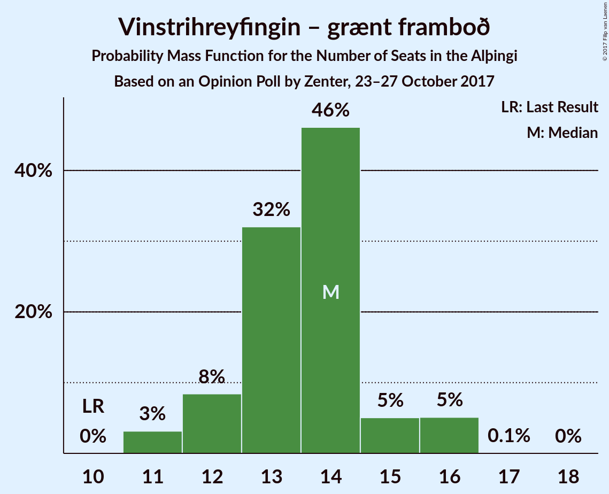
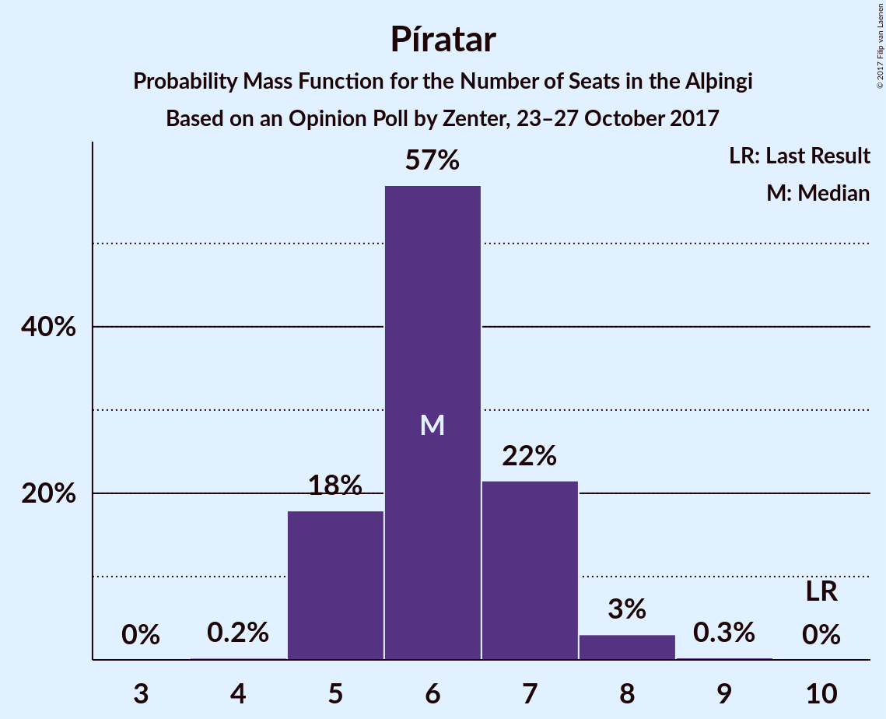
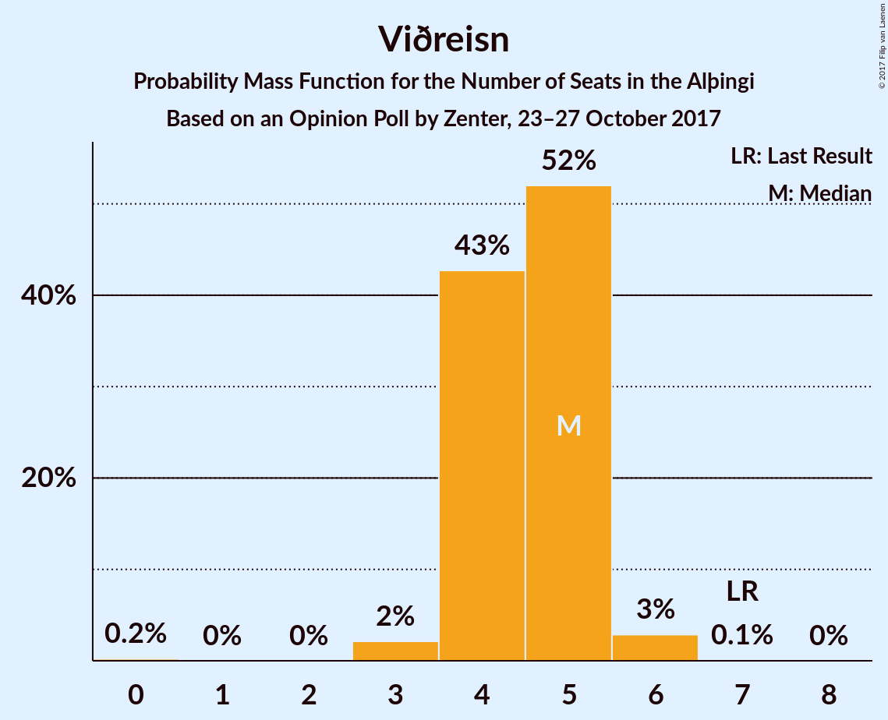

# Opinion Poll by Zenter, 23–27 October 2017

<a href="#voting-intentions">Voting Intentions</a> | <a href="#seats">Seats</a> | <a href="#coalitions">Coalitions</a> | <a href="#technical-information">Technical Information</a>

## Voting Intentions

### Confidence Intervals

| Party | Last Result | Poll Result | 80% Confidence Interval | 90% Confidence Interval | 95% Confidence Interval | 99% Confidence Interval |
|:-----:|:-----------:|:-----------:|:-----------------------:|:-----------------------:|:-----------------------:|:-----------------------:|
| Sjálfstæðisflokkurinn | 29.0% | 22.5% | 20.8–24.2% |20.3–24.8% |19.9–25.2% |19.2–26.1% |
| Vinstrihreyfingin – grænt framboð | 15.9% | 19.5% | 18.0–21.3% |17.5–21.8% |17.2–22.2% |16.4–23.0% |
| Samfylkingin | 5.7% | 14.7% | 13.3–16.2% |12.9–16.6% |12.6–17.0% |11.9–17.8% |
| Miðflokkurinn | 0.0% | 10.2% | 9.0–11.5% |8.7–11.9% |8.4–12.3% |7.9–12.9% |
| Píratar | 14.5% | 9.6% | 8.4–10.9% |8.1–11.3% |7.9–11.6% |7.4–12.3% |
| Framsóknarflokkurinn | 11.5% | 9.6% | 8.4–10.9% |8.1–11.3% |7.9–11.6% |7.4–12.3% |
| Viðreisn | 10.5% | 7.1% | 6.1–8.2% |5.8–8.6% |5.6–8.9% |5.2–9.5% |
| Flokkur fólksins | 3.5% | 4.3% | 3.5–5.2% |3.3–5.5% |3.2–5.7% |2.8–6.2% |
| Björt framtíð | 7.2% | 1.9% | 1.4–2.6% |1.3–2.8% |1.2–2.9% |1.0–3.3% |
| Alþýðufylkingin | 0.3% | 0.4% | 0.2–0.8% |0.2–1.0% |0.2–1.1% |0.1–1.3% |
| Dögun | 1.7% | 0.3% | 0.2–0.7% |0.1–0.8% |0.1–0.9% |0.1–1.1% |

*Note:* The poll result column reflects the actual value used in the calculations. Published results may vary slightly, and in addition be rounded to fewer digits.

## Seats

### Confidence Intervals

| Party | Last Result | Median | 80% Confidence Interval | 90% Confidence Interval | 95% Confidence Interval | 99% Confidence Interval |
|:-----:|:-----------:|:------:|:-----------------------:|:-----------------------:|:-----------------------:|:-----------------------:|
| <a href="#sjálfstæðisflokkurinn">Sjálfstæðisflokkurinn</a> | 21 | 16 | 15–16 |14–16 |14–17 |13–18 |
| <a href="#vinstrihreyfingin-–-grænt-framboð">Vinstrihreyfingin – grænt framboð</a> | 10 | 14 | 13–14 |12–14 |12–15 |11–16 |
| <a href="#samfylkingin">Samfylkingin</a> | 3 | 10 | 10–11 |9–11 |9–11 |8–12 |
| <a href="#miðflokkurinn">Miðflokkurinn</a> | 0 | 7 | 6–7 |6–8 |5–8 |5–8 |
| <a href="#píratar">Píratar</a> | 10 | 5 | 5–7 |5–7 |5–7 |5–8 |
| <a href="#framsóknarflokkurinn">Framsóknarflokkurinn</a> | 8 | 6 | 6–8 |6–8 |5–8 |5–8 |
| <a href="#viðreisn">Viðreisn</a> | 7 | 5 | 4–5 |4–5 |4–5 |3–6 |
| <a href="#flokkur-fólksins">Flokkur fólksins</a> | 0 | 0 | 0 |0–3 |0–3 |0–3 |
| <a href="#björt-framtíð">Björt framtíð</a> | 4 | 0 | 0 |0 |0 |0 |
| <a href="#alþýðufylkingin">Alþýðufylkingin</a> | 0 | 0 | 0 |0 |0 |0 |
| <a href="#dögun">Dögun</a> | 0 | 0 | 0 |0 |0 |0 |

### Sjálfstæðisflokkurinn

*For a full overview of the results for this party, see the [Sjálfstæðisflokkurinn](party-sjlfstisflokkurinn.html) page.*

| Number of Seats | Probability | Accumulated | Special Marks |
|:---------------:|:-----------:|:-----------:|:-------------:|
| 13 | 0.7% | 100% |  |
| 14 | 6% | 99.3% |  |
| 15 | 23% | 93% |  |
| 16 | 68% | 70% | Median |
| 17 | 1.1% | 3% |  |
| 18 | 1.5% | 2% |  |
| 19 | 0.4% | 0.4% |  |
| 20 | 0% | 0% |  |
| 21 | 0% | 0% | Last Result |

### Vinstrihreyfingin – grænt framboð

*For a full overview of the results for this party, see the [Vinstrihreyfingin – grænt framboð](party-vinstrihreyfingingrntframbo.html) page.*

| Number of Seats | Probability | Accumulated | Special Marks |
|:---------------:|:-----------:|:-----------:|:-------------:|
| 10 | 0% | 100% | Last Result |
| 11 | 2% | 100% |  |
| 12 | 6% | 98% |  |
| 13 | 31% | 92% |  |
| 14 | 58% | 61% | Median |
| 15 | 1.2% | 3% |  |
| 16 | 1.4% | 2% |  |
| 17 | 0.2% | 0.2% |  |
| 18 | 0% | 0% |  |

### Samfylkingin

*For a full overview of the results for this party, see the [Samfylkingin](party-samfylkingin.html) page.*

| Number of Seats | Probability | Accumulated | Special Marks |
|:---------------:|:-----------:|:-----------:|:-------------:|
| 3 | 0% | 100% | Last Result |
| 4 | 0% | 100% |  |
| 5 | 0% | 100% |  |
| 6 | 0% | 100% |  |
| 7 | 0.2% | 100% |  |
| 8 | 0.9% | 99.8% |  |
| 9 | 5% | 98.9% |  |
| 10 | 81% | 94% | Median |
| 11 | 12% | 13% |  |
| 12 | 1.1% | 1.2% |  |
| 13 | 0.2% | 0.2% |  |
| 14 | 0% | 0% |  |

### Miðflokkurinn

*For a full overview of the results for this party, see the [Miðflokkurinn](party-miflokkurinn.html) page.*

| Number of Seats | Probability | Accumulated | Special Marks |
|:---------------:|:-----------:|:-----------:|:-------------:|
| 0 | 0% | 100% | Last Result |
| 1 | 0% | 100% |  |
| 2 | 0% | 100% |  |
| 3 | 0% | 100% |  |
| 4 | 0.1% | 100% |  |
| 5 | 3% | 99.9% |  |
| 6 | 27% | 97% |  |
| 7 | 64% | 70% | Median |
| 8 | 6% | 6% |  |
| 9 | 0.1% | 0.3% |  |
| 10 | 0.1% | 0.1% |  |
| 11 | 0% | 0% |  |

### Píratar

*For a full overview of the results for this party, see the [Píratar](party-pratar.html) page.*

| Number of Seats | Probability | Accumulated | Special Marks |
|:---------------:|:-----------:|:-----------:|:-------------:|
| 4 | 0.1% | 100% |  |
| 5 | 55% | 99.9% | Median |
| 6 | 17% | 45% |  |
| 7 | 27% | 28% |  |
| 8 | 1.2% | 1.3% |  |
| 9 | 0.1% | 0.1% |  |
| 10 | 0% | 0% | Last Result |

### Framsóknarflokkurinn

*For a full overview of the results for this party, see the [Framsóknarflokkurinn](party-framsknarflokkurinn.html) page.*

| Number of Seats | Probability | Accumulated | Special Marks |
|:---------------:|:-----------:|:-----------:|:-------------:|
| 4 | 0.1% | 100% |  |
| 5 | 5% | 99.9% |  |
| 6 | 77% | 95% | Median |
| 7 | 6% | 19% |  |
| 8 | 12% | 13% | Last Result |
| 9 | 0.1% | 0.1% |  |
| 10 | 0% | 0% |  |

### Viðreisn

*For a full overview of the results for this party, see the [Viðreisn](party-vireisn.html) page.*

| Number of Seats | Probability | Accumulated | Special Marks |
|:---------------:|:-----------:|:-----------:|:-------------:|
| 0 | 0.1% | 100% |  |
| 1 | 0% | 99.9% |  |
| 2 | 0% | 99.9% |  |
| 3 | 2% | 99.9% |  |
| 4 | 20% | 98% |  |
| 5 | 76% | 78% | Median |
| 6 | 2% | 2% |  |
| 7 | 0% | 0% | Last Result |

### Flokkur fólksins

*For a full overview of the results for this party, see the [Flokkur fólksins](party-flokkurflksins.html) page.*

| Number of Seats | Probability | Accumulated | Special Marks |
|:---------------:|:-----------:|:-----------:|:-------------:|
| 0 | 95% | 100% | Last Result, Median |
| 1 | 0% | 5% |  |
| 2 | 0% | 5% |  |
| 3 | 5% | 5% |  |
| 4 | 0.3% | 0.3% |  |
| 5 | 0% | 0% |  |

### Björt framtíð

*For a full overview of the results for this party, see the [Björt framtíð](party-bjrtframt.html) page.*

| Number of Seats | Probability | Accumulated | Special Marks |
|:---------------:|:-----------:|:-----------:|:-------------:|
| 0 | 100% | 100% | Median |
| 1 | 0% | 0% |  |
| 2 | 0% | 0% |  |
| 3 | 0% | 0% |  |
| 4 | 0% | 0% | Last Result |

### Alþýðufylkingin

*For a full overview of the results for this party, see the [Alþýðufylkingin](party-alufylkingin.html) page.*

| Number of Seats | Probability | Accumulated | Special Marks |
|:---------------:|:-----------:|:-----------:|:-------------:|
| 0 | 100% | 100% | Last Result, Median |

### Dögun

*For a full overview of the results for this party, see the [Dögun](party-dgun.html) page.*

| Number of Seats | Probability | Accumulated | Special Marks |
|:---------------:|:-----------:|:-----------:|:-------------:|
| 0 | 100% | 100% | Last Result, Median |

## Coalitions

### Confidence Intervals

| Coalition | Last Result | Median | Majority? | 80% Confidence Interval | 90% Confidence Interval | 95% Confidence Interval | 99% Confidence Interval |
|:---------:|:-----------:|:------:|:---------:|:-----------------------:|:-----------------------:|:-----------------------:|:-----------------------:|
| Vinstrihreyfingin – grænt framboð – Samfylkingin – Miðflokkurinn – Framsóknarflokkurinn | 21 | 37 | 100% | 35–37 | 35–38 | 34–39 | 33–39 |
| Vinstrihreyfingin – grænt framboð – Samfylkingin – Píratar – Viðreisn – Björt framtíð | 34 | 34 | 98% | 33–35 | 33–35 | 32–36 | 29–37 |
| Vinstrihreyfingin – grænt framboð – Samfylkingin – Píratar – Viðreisn | 30 | 34 | 98% | 33–35 | 33–35 | 32–36 | 29–37 |
| Vinstrihreyfingin – grænt framboð – Samfylkingin – Miðflokkurinn | 13 | 31 | 5% | 29–31 | 29–31 | 27–33 | 27–33 |
| Vinstrihreyfingin – grænt framboð – Samfylkingin – Píratar – Björt framtíð | 27 | 29 | 3% | 29–31 | 29–31 | 28–32 | 25–32 |
| Vinstrihreyfingin – grænt framboð – Samfylkingin – Píratar | 23 | 29 | 3% | 29–31 | 29–31 | 28–32 | 25–32 |
| Vinstrihreyfingin – grænt framboð – Samfylkingin – Framsóknarflokkurinn | 21 | 30 | 1.5% | 29–31 | 29–31 | 28–31 | 26–32 |
| Sjálfstæðisflokkurinn – Miðflokkurinn – Framsóknarflokkurinn | 29 | 29 | 0.2% | 28–29 | 27–30 | 26–30 | 25–31 |
| Sjálfstæðisflokkurinn – Vinstrihreyfingin – grænt framboð | 31 | 30 | 0.7% | 28–30 | 27–30 | 26–30 | 26–32 |
| Vinstrihreyfingin – grænt framboð – Miðflokkurinn – Framsóknarflokkurinn | 18 | 27 | 0% | 25–27 | 25–28 | 24–28 | 24–29 |
| Sjálfstæðisflokkurinn – Samfylkingin | 24 | 26 | 0% | 25–26 | 24–26 | 24–27 | 23–28 |
| Vinstrihreyfingin – grænt framboð – Samfylkingin | 13 | 24 | 0% | 23–24 | 22–25 | 21–25 | 20–26 |
| Sjálfstæðisflokkurinn – Miðflokkurinn | 21 | 23 | 0% | 21–23 | 21–23 | 20–24 | 19–25 |
| Sjálfstæðisflokkurinn – Framsóknarflokkurinn | 29 | 22 | 0% | 21–23 | 20–23 | 20–23 | 19–25 |
| Vinstrihreyfingin – grænt framboð – Miðflokkurinn | 10 | 21 | 0% | 19–21 | 19–21 | 18–22 | 17–23 |
| Sjálfstæðisflokkurinn – Viðreisn – Björt framtíð | 32 | 21 | 0% | 19–21 | 18–21 | 18–21 | 17–23 |
| Vinstrihreyfingin – grænt framboð – Framsóknarflokkurinn | 18 | 20 | 0% | 19–21 | 19–21 | 18–21 | 17–22 |
| Vinstrihreyfingin – grænt framboð – Píratar | 20 | 19 | 0% | 19–20 | 19–20 | 18–21 | 16–23 |
| Sjálfstæðisflokkurinn – Viðreisn | 28 | 21 | 0% | 19–21 | 18–21 | 18–21 | 17–23 |
| Sjálfstæðisflokkurinn – Björt framtíð | 25 | 16 | 0% | 15–16 | 14–16 | 14–17 | 13–18 |

### Vinstrihreyfingin – grænt framboð – Samfylkingin – Miðflokkurinn – Framsóknarflokkurinn

| Number of Seats | Probability | Accumulated | Special Marks |
|:---------------:|:-----------:|:-----------:|:-------------:|
| 21 | 0% | 100% | Last Result |
| 22 | 0% | 100% |  |
| 23 | 0% | 100% |  |
| 24 | 0% | 100% |  |
| 25 | 0% | 100% |  |
| 26 | 0% | 100% |  |
| 27 | 0% | 100% |  |
| 28 | 0% | 100% |  |
| 29 | 0% | 100% |  |
| 30 | 0% | 100% |  |
| 31 | 0% | 100% |  |
| 32 | 0% | 100% | Majority |
| 33 | 1.3% | 99.9% |  |
| 34 | 1.4% | 98.7% |  |
| 35 | 18% | 97% |  |
| 36 | 2% | 79% |  |
| 37 | 72% | 78% | Median |
| 38 | 2% | 6% |  |
| 39 | 4% | 4% |  |
| 40 | 0.1% | 0.1% |  |
| 41 | 0% | 0% |  |

### Vinstrihreyfingin – grænt framboð – Samfylkingin – Píratar – Viðreisn – Björt framtíð

| Number of Seats | Probability | Accumulated | Special Marks |
|:---------------:|:-----------:|:-----------:|:-------------:|
| 29 | 0.9% | 100% |  |
| 30 | 0% | 99.1% |  |
| 31 | 0.6% | 99.1% |  |
| 32 | 2% | 98% | Majority |
| 33 | 7% | 97% |  |
| 34 | 61% | 90% | Last Result, Median |
| 35 | 25% | 28% |  |
| 36 | 2% | 3% |  |
| 37 | 2% | 2% |  |
| 38 | 0.2% | 0.2% |  |
| 39 | 0% | 0% |  |

### Vinstrihreyfingin – grænt framboð – Samfylkingin – Píratar – Viðreisn

| Number of Seats | Probability | Accumulated | Special Marks |
|:---------------:|:-----------:|:-----------:|:-------------:|
| 29 | 0.9% | 100% |  |
| 30 | 0% | 99.1% | Last Result |
| 31 | 0.6% | 99.1% |  |
| 32 | 2% | 98% | Majority |
| 33 | 7% | 97% |  |
| 34 | 61% | 90% | Median |
| 35 | 25% | 28% |  |
| 36 | 2% | 3% |  |
| 37 | 2% | 2% |  |
| 38 | 0.2% | 0.2% |  |
| 39 | 0% | 0% |  |

### Vinstrihreyfingin – grænt framboð – Samfylkingin – Miðflokkurinn

| Number of Seats | Probability | Accumulated | Special Marks |
|:---------------:|:-----------:|:-----------:|:-------------:|
| 13 | 0% | 100% | Last Result |
| 14 | 0% | 100% |  |
| 15 | 0% | 100% |  |
| 16 | 0% | 100% |  |
| 17 | 0% | 100% |  |
| 18 | 0% | 100% |  |
| 19 | 0% | 100% |  |
| 20 | 0% | 100% |  |
| 21 | 0% | 100% |  |
| 22 | 0% | 100% |  |
| 23 | 0% | 100% |  |
| 24 | 0% | 100% |  |
| 25 | 0% | 100% |  |
| 26 | 0.2% | 100% |  |
| 27 | 3% | 99.8% |  |
| 28 | 2% | 97% |  |
| 29 | 24% | 95% |  |
| 30 | 6% | 71% |  |
| 31 | 61% | 66% | Median |
| 32 | 2% | 5% | Majority |
| 33 | 3% | 3% |  |
| 34 | 0.1% | 0.1% |  |
| 35 | 0% | 0% |  |

### Vinstrihreyfingin – grænt framboð – Samfylkingin – Píratar – Björt framtíð

| Number of Seats | Probability | Accumulated | Special Marks |
|:---------------:|:-----------:|:-----------:|:-------------:|
| 25 | 0.8% | 100% |  |
| 26 | 0.3% | 99.2% |  |
| 27 | 1.2% | 98.9% | Last Result |
| 28 | 2% | 98% |  |
| 29 | 65% | 96% | Median |
| 30 | 18% | 31% |  |
| 31 | 10% | 13% |  |
| 32 | 2% | 3% | Majority |
| 33 | 0.3% | 0.4% |  |
| 34 | 0.1% | 0.1% |  |
| 35 | 0% | 0% |  |

### Vinstrihreyfingin – grænt framboð – Samfylkingin – Píratar

| Number of Seats | Probability | Accumulated | Special Marks |
|:---------------:|:-----------:|:-----------:|:-------------:|
| 23 | 0% | 100% | Last Result |
| 24 | 0% | 100% |  |
| 25 | 0.8% | 100% |  |
| 26 | 0.3% | 99.2% |  |
| 27 | 1.2% | 98.9% |  |
| 28 | 2% | 98% |  |
| 29 | 65% | 96% | Median |
| 30 | 18% | 31% |  |
| 31 | 10% | 13% |  |
| 32 | 2% | 3% | Majority |
| 33 | 0.3% | 0.4% |  |
| 34 | 0.1% | 0.1% |  |
| 35 | 0% | 0% |  |

### Vinstrihreyfingin – grænt framboð – Samfylkingin – Framsóknarflokkurinn

| Number of Seats | Probability | Accumulated | Special Marks |
|:---------------:|:-----------:|:-----------:|:-------------:|
| 21 | 0% | 100% | Last Result |
| 22 | 0% | 100% |  |
| 23 | 0% | 100% |  |
| 24 | 0% | 100% |  |
| 25 | 0.1% | 100% |  |
| 26 | 1.0% | 99.9% |  |
| 27 | 0.8% | 98.9% |  |
| 28 | 2% | 98% |  |
| 29 | 17% | 96% |  |
| 30 | 64% | 80% | Median |
| 31 | 14% | 15% |  |
| 32 | 1.2% | 1.5% | Majority |
| 33 | 0.3% | 0.3% |  |
| 34 | 0% | 0% |  |

### Sjálfstæðisflokkurinn – Miðflokkurinn – Framsóknarflokkurinn

| Number of Seats | Probability | Accumulated | Special Marks |
|:---------------:|:-----------:|:-----------:|:-------------:|
| 24 | 0% | 100% |  |
| 25 | 2% | 99.9% |  |
| 26 | 2% | 98% |  |
| 27 | 3% | 96% |  |
| 28 | 24% | 93% |  |
| 29 | 62% | 70% | Last Result, Median |
| 30 | 6% | 8% |  |
| 31 | 2% | 2% |  |
| 32 | 0.2% | 0.2% | Majority |
| 33 | 0% | 0% |  |

### Sjálfstæðisflokkurinn – Vinstrihreyfingin – grænt framboð

| Number of Seats | Probability | Accumulated | Special Marks |
|:---------------:|:-----------:|:-----------:|:-------------:|
| 25 | 0.3% | 100% |  |
| 26 | 2% | 99.7% |  |
| 27 | 5% | 97% |  |
| 28 | 18% | 93% |  |
| 29 | 20% | 75% |  |
| 30 | 53% | 56% | Median |
| 31 | 2% | 2% | Last Result |
| 32 | 0.6% | 0.7% | Majority |
| 33 | 0.1% | 0.1% |  |
| 34 | 0% | 0% |  |

### Vinstrihreyfingin – grænt framboð – Miðflokkurinn – Framsóknarflokkurinn

| Number of Seats | Probability | Accumulated | Special Marks |
|:---------------:|:-----------:|:-----------:|:-------------:|
| 18 | 0% | 100% | Last Result |
| 19 | 0% | 100% |  |
| 20 | 0% | 100% |  |
| 21 | 0% | 100% |  |
| 22 | 0% | 100% |  |
| 23 | 0.3% | 100% |  |
| 24 | 4% | 99.7% |  |
| 25 | 15% | 96% |  |
| 26 | 11% | 81% |  |
| 27 | 63% | 70% | Median |
| 28 | 4% | 6% |  |
| 29 | 2% | 2% |  |
| 30 | 0.2% | 0.2% |  |
| 31 | 0% | 0% |  |

### Sjálfstæðisflokkurinn – Samfylkingin

| Number of Seats | Probability | Accumulated | Special Marks |
|:---------------:|:-----------:|:-----------:|:-------------:|
| 22 | 0.3% | 100% |  |
| 23 | 1.1% | 99.7% |  |
| 24 | 5% | 98.5% | Last Result |
| 25 | 15% | 93% |  |
| 26 | 73% | 78% | Median |
| 27 | 4% | 5% |  |
| 28 | 0.7% | 0.9% |  |
| 29 | 0.1% | 0.1% |  |
| 30 | 0% | 0% |  |

### Vinstrihreyfingin – grænt framboð – Samfylkingin

| Number of Seats | Probability | Accumulated | Special Marks |
|:---------------:|:-----------:|:-----------:|:-------------:|
| 13 | 0% | 100% | Last Result |
| 14 | 0% | 100% |  |
| 15 | 0% | 100% |  |
| 16 | 0% | 100% |  |
| 17 | 0% | 100% |  |
| 18 | 0% | 100% |  |
| 19 | 0% | 100% |  |
| 20 | 1.1% | 100% |  |
| 21 | 2% | 98.9% |  |
| 22 | 6% | 97% |  |
| 23 | 23% | 91% |  |
| 24 | 61% | 68% | Median |
| 25 | 5% | 7% |  |
| 26 | 1.2% | 2% |  |
| 27 | 0.3% | 0.3% |  |
| 28 | 0% | 0% |  |

### Sjálfstæðisflokkurinn – Miðflokkurinn

| Number of Seats | Probability | Accumulated | Special Marks |
|:---------------:|:-----------:|:-----------:|:-------------:|
| 18 | 0% | 100% |  |
| 19 | 1.1% | 99.9% |  |
| 20 | 3% | 98.8% |  |
| 21 | 11% | 96% | Last Result |
| 22 | 28% | 85% |  |
| 23 | 54% | 57% | Median |
| 24 | 1.2% | 3% |  |
| 25 | 2% | 2% |  |
| 26 | 0.3% | 0.3% |  |
| 27 | 0% | 0% |  |

### Sjálfstæðisflokkurinn – Framsóknarflokkurinn

| Number of Seats | Probability | Accumulated | Special Marks |
|:---------------:|:-----------:|:-----------:|:-------------:|
| 18 | 0.3% | 100% |  |
| 19 | 0.3% | 99.7% |  |
| 20 | 7% | 99.3% |  |
| 21 | 8% | 93% |  |
| 22 | 70% | 85% | Median |
| 23 | 13% | 15% |  |
| 24 | 2% | 2% |  |
| 25 | 0.6% | 0.7% |  |
| 26 | 0% | 0% |  |
| 27 | 0% | 0% |  |
| 28 | 0% | 0% |  |
| 29 | 0% | 0% | Last Result |

### Vinstrihreyfingin – grænt framboð – Miðflokkurinn

| Number of Seats | Probability | Accumulated | Special Marks |
|:---------------:|:-----------:|:-----------:|:-------------:|
| 10 | 0% | 100% | Last Result |
| 11 | 0% | 100% |  |
| 12 | 0% | 100% |  |
| 13 | 0% | 100% |  |
| 14 | 0% | 100% |  |
| 15 | 0% | 100% |  |
| 16 | 0% | 100% |  |
| 17 | 2% | 100% |  |
| 18 | 2% | 98% |  |
| 19 | 28% | 97% |  |
| 20 | 8% | 68% |  |
| 21 | 55% | 60% | Median |
| 22 | 4% | 5% |  |
| 23 | 0.5% | 0.6% |  |
| 24 | 0.1% | 0.1% |  |
| 25 | 0% | 0% |  |

### Sjálfstæðisflokkurinn – Viðreisn – Björt framtíð

| Number of Seats | Probability | Accumulated | Special Marks |
|:---------------:|:-----------:|:-----------:|:-------------:|
| 16 | 0.1% | 100% |  |
| 17 | 2% | 99.9% |  |
| 18 | 4% | 98% |  |
| 19 | 13% | 95% |  |
| 20 | 13% | 82% |  |
| 21 | 67% | 69% | Median |
| 22 | 1.4% | 2% |  |
| 23 | 0.7% | 0.8% |  |
| 24 | 0.1% | 0.1% |  |
| 25 | 0% | 0% |  |
| 26 | 0% | 0% |  |
| 27 | 0% | 0% |  |
| 28 | 0% | 0% |  |
| 29 | 0% | 0% |  |
| 30 | 0% | 0% |  |
| 31 | 0% | 0% |  |
| 32 | 0% | 0% | Last Result, Majority |

### Vinstrihreyfingin – grænt framboð – Framsóknarflokkurinn

| Number of Seats | Probability | Accumulated | Special Marks |
|:---------------:|:-----------:|:-----------:|:-------------:|
| 16 | 0.1% | 100% |  |
| 17 | 1.2% | 99.9% |  |
| 18 | 2% | 98.7% | Last Result |
| 19 | 23% | 96% |  |
| 20 | 62% | 74% | Median |
| 21 | 10% | 11% |  |
| 22 | 1.3% | 2% |  |
| 23 | 0.2% | 0.2% |  |
| 24 | 0.1% | 0.1% |  |
| 25 | 0% | 0% |  |

### Vinstrihreyfingin – grænt framboð – Píratar

| Number of Seats | Probability | Accumulated | Special Marks |
|:---------------:|:-----------:|:-----------:|:-------------:|
| 16 | 0.9% | 100% |  |
| 17 | 1.2% | 99.1% |  |
| 18 | 2% | 98% |  |
| 19 | 66% | 96% | Median |
| 20 | 27% | 31% | Last Result |
| 21 | 2% | 4% |  |
| 22 | 2% | 2% |  |
| 23 | 0.5% | 0.6% |  |
| 24 | 0.1% | 0.1% |  |
| 25 | 0% | 0% |  |

### Sjálfstæðisflokkurinn – Viðreisn

| Number of Seats | Probability | Accumulated | Special Marks |
|:---------------:|:-----------:|:-----------:|:-------------:|
| 16 | 0.1% | 100% |  |
| 17 | 2% | 99.9% |  |
| 18 | 4% | 98% |  |
| 19 | 13% | 95% |  |
| 20 | 13% | 82% |  |
| 21 | 67% | 69% | Median |
| 22 | 1.4% | 2% |  |
| 23 | 0.7% | 0.8% |  |
| 24 | 0.1% | 0.1% |  |
| 25 | 0% | 0% |  |
| 26 | 0% | 0% |  |
| 27 | 0% | 0% |  |
| 28 | 0% | 0% | Last Result |

### Sjálfstæðisflokkurinn – Björt framtíð

| Number of Seats | Probability | Accumulated | Special Marks |
|:---------------:|:-----------:|:-----------:|:-------------:|
| 13 | 0.7% | 100% |  |
| 14 | 6% | 99.3% |  |
| 15 | 23% | 93% |  |
| 16 | 68% | 70% | Median |
| 17 | 1.1% | 3% |  |
| 18 | 1.5% | 2% |  |
| 19 | 0.4% | 0.4% |  |
| 20 | 0% | 0% |  |
| 21 | 0% | 0% |  |
| 22 | 0% | 0% |  |
| 23 | 0% | 0% |  |
| 24 | 0% | 0% |  |
| 25 | 0% | 0% | Last Result |

## Technical Information

### Opinion Poll

+ **Polling firm:** Zenter
+ **Commissioner(s):** —
+ **Fieldwork period:** 23–27 October 2017

### Calculations

+ **Sample size:** 962
+ **Simulations done:** 1,048,576
+ **Error estimate:** 2.07%

