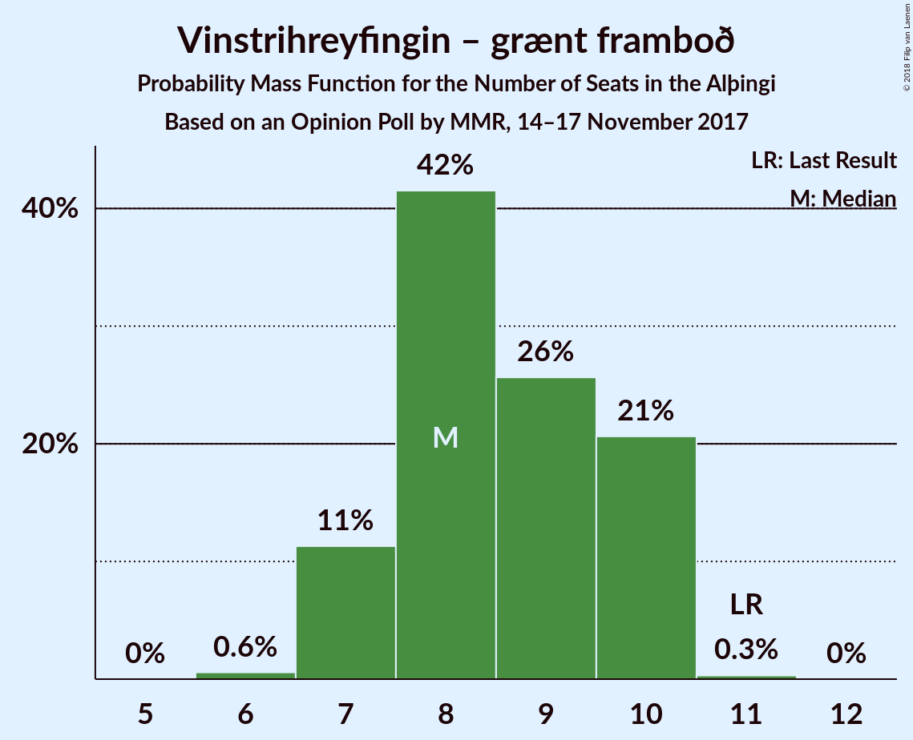

# Opinion Poll by MMR, 14–17 November 2017

<a href="#voting-intentions">Voting Intentions</a> | <a href="#seats">Seats</a> | <a href="#coalitions">Coalitions</a> | <a href="#technical-information">Technical Information</a>

## Voting Intentions

### Confidence Intervals

| Party | Last Result | Poll Result | 80% Confidence Interval | 90% Confidence Interval | 95% Confidence Interval | 99% Confidence Interval |
|:-----:|:-----------:|:-----------:|:-----------------------:|:-----------------------:|:-----------------------:|:-----------------------:|
| Sjálfstæðisflokkurinn | 25.2% | 24.4% | 22.6–26.2% |22.1–26.7% |21.7–27.2% |20.9–28.1% |
| Samfylkingin | 12.1% | 16.0% | 14.5–17.6% |14.1–18.1% |13.8–18.5% |13.1–19.3% |
| Vinstrihreyfingin – grænt framboð | 16.9% | 13.0% | 11.7–14.5% |11.3–15.0% |11.0–15.4% |10.4–16.1% |
| Miðflokkurinn | 10.9% | 10.5% | 9.3–11.9% |9.0–12.3% |8.7–12.6% |8.1–13.3% |
| Píratar | 9.2% | 9.9% | 8.7–11.2% |8.4–11.6% |8.1–11.9% |7.6–12.6% |
| Framsóknarflokkurinn | 10.7% | 9.5% | 8.4–10.9% |8.1–11.2% |7.8–11.6% |7.3–12.3% |
| Flokkur fólksins | 6.9% | 8.4% | 7.3–9.6% |7.0–10.0% |6.8–10.3% |6.3–11.0% |
| Viðreisn | 6.7% | 6.5% | 5.5–7.6% |5.3–8.0% |5.0–8.2% |4.6–8.8% |

*Note:* The poll result column reflects the actual value used in the calculations. Published results may vary slightly, and in addition be rounded to fewer digits.

## Seats

### Confidence Intervals

| Party | Last Result | Median | 80% Confidence Interval | 90% Confidence Interval | 95% Confidence Interval | 99% Confidence Interval |
|:-----:|:-----------:|:------:|:-----------------------:|:-----------------------:|:-----------------------:|:-----------------------:|
| <a href="#sjálfstæðisflokkurinn">Sjálfstæðisflokkurinn</a> | 16 | 18 | 18 |18 |18 |18 |
| <a href="#samfylkingin">Samfylkingin</a> | 7 | N/A | 12 |12 |12 |12 |
| <a href="#vinstrihreyfingin-–-grænt-framboð">Vinstrihreyfingin – grænt framboð</a> | 11 | 10 | 10 |10 |10 |10 |
| <a href="#miðflokkurinn">Miðflokkurinn</a> | 7 | N/A | 7 |7 |7 |7 |
| <a href="#píratar">Píratar</a> | 6 | N/A | 7 |7 |7 |7 |
| <a href="#framsóknarflokkurinn">Framsóknarflokkurinn</a> | 8 | N/A | 5 |5 |5 |5 |
| <a href="#flokkur-fólksins">Flokkur fólksins</a> | 4 | N/A | 4 |4 |4 |4 |
| <a href="#viðreisn">Viðreisn</a> | 4 | N/A | 0 |0 |0 |0 |

### Sjálfstæðisflokkurinn

*For a full overview of the results for this party, see the [Sjálfstæðisflokkurinn](party-sjálfstæðisflokkurinn.html) page.*

| Number of Seats | Probability | Accumulated | Special Marks |
|:---------------:|:-----------:|:-----------:|:-------------:|
| 16 | 0% | 100% | Last Result |
| 17 | 0% | 100% |  |
| 18 | 100% | 100% | Median |

### Vinstrihreyfingin – grænt framboð

*For a full overview of the results for this party, see the [Vinstrihreyfingin – grænt framboð](party-vinstrihreyfingin–græntframboð.html) page.*

| Number of Seats | Probability | Accumulated | Special Marks |
|:---------------:|:-----------:|:-----------:|:-------------:|
| 10 | 100% | 100% | Median |
| 11 | 0% | 0% | Last Result |

## Coalitions

### Confidence Intervals

| Coalition | Last Result | Median | Majority? | 80% Confidence Interval | 90% Confidence Interval | 95% Confidence Interval | 99% Confidence Interval |
|:---------:|:-----------:|:------:|:---------:|:-----------------------:|:-----------------------:|:-----------------------:|:-----------------------:|
| Samfylkingin – Vinstrihreyfingin – grænt framboð – Miðflokkurinn – Framsóknarflokkurinn | 33 | 28 | 0% | 28 | 28 | 28 | 28 |
| Sjálfstæðisflokkurinn – Samfylkingin | 23 | 28 | 0% | 28 | 28 | 28 | 28 |
| Sjálfstæðisflokkurinn – Vinstrihreyfingin – grænt framboð | 27 | 28 | 0% | 28 | 28 | 28 | 28 |
| Sjálfstæðisflokkurinn – Miðflokkurinn – Framsóknarflokkurinn | 31 | 26 | 0% | 26 | 26 | 26 | 26 |
| Samfylkingin – Vinstrihreyfingin – grænt framboð – Píratar | 24 | 26 | 0% | 26 | 26 | 26 | 26 |
| Samfylkingin – Vinstrihreyfingin – grænt framboð – Píratar – Viðreisn | 28 | 26 | 0% | 26 | 26 | 26 | 26 |
| Samfylkingin – Vinstrihreyfingin – grænt framboð – Miðflokkurinn | 25 | 25 | 0% | 25 | 25 | 25 | 25 |
| Samfylkingin – Vinstrihreyfingin – grænt framboð – Framsóknarflokkurinn | 26 | 23 | 0% | 23 | 23 | 23 | 23 |
| Sjálfstæðisflokkurinn – Miðflokkurinn | 23 | 23 | 0% | 23 | 23 | 23 | 23 |
| Sjálfstæðisflokkurinn – Framsóknarflokkurinn | 24 | 21 | 0% | 21 | 21 | 21 | 21 |
| Samfylkingin – Vinstrihreyfingin – grænt framboð | 18 | 20 | 0% | 20 | 20 | 20 | 20 |
| Vinstrihreyfingin – grænt framboð – Miðflokkurinn – Framsóknarflokkurinn | 26 | 18 | 0% | 18 | 18 | 18 | 18 |
| Sjálfstæðisflokkurinn – Viðreisn | 20 | 18 | 0% | 18 | 18 | 18 | 18 |
| Vinstrihreyfingin – grænt framboð – Píratar | 17 | 16 | 0% | 16 | 16 | 16 | 16 |
| Vinstrihreyfingin – grænt framboð – Miðflokkurinn | 18 | 15 | 0% | 15 | 15 | 15 | 15 |
| Vinstrihreyfingin – grænt framboð – Framsóknarflokkurinn | 19 | 13 | 0% | 13 | 13 | 13 | 13 |

### Samfylkingin – Vinstrihreyfingin – grænt framboð – Miðflokkurinn – Framsóknarflokkurinn

| Number of Seats | Probability | Accumulated | Special Marks |
|:---------------:|:-----------:|:-----------:|:-------------:|
| 28 | 100% | 100% |  |
| 29 | 0% | 0% |  |
| 30 | 0% | 0% |  |
| 31 | 0% | 0% |  |
| 32 | 0% | 0% | Majority |
| 33 | 0% | 0% | Last Result |

### Sjálfstæðisflokkurinn – Samfylkingin

| Number of Seats | Probability | Accumulated | Special Marks |
|:---------------:|:-----------:|:-----------:|:-------------:|
| 23 | 0% | 100% | Last Result |
| 24 | 0% | 100% |  |
| 25 | 0% | 100% |  |
| 26 | 0% | 100% |  |
| 27 | 0% | 100% |  |
| 28 | 100% | 100% |  |

### Sjálfstæðisflokkurinn – Vinstrihreyfingin – grænt framboð

| Number of Seats | Probability | Accumulated | Special Marks |
|:---------------:|:-----------:|:-----------:|:-------------:|
| 27 | 0% | 100% | Last Result |
| 28 | 100% | 100% | Median |

### Sjálfstæðisflokkurinn – Miðflokkurinn – Framsóknarflokkurinn

| Number of Seats | Probability | Accumulated | Special Marks |
|:---------------:|:-----------:|:-----------:|:-------------:|
| 26 | 100% | 100% |  |
| 27 | 0% | 0% |  |
| 28 | 0% | 0% |  |
| 29 | 0% | 0% |  |
| 30 | 0% | 0% |  |
| 31 | 0% | 0% | Last Result |

### Samfylkingin – Vinstrihreyfingin – grænt framboð – Píratar

| Number of Seats | Probability | Accumulated | Special Marks |
|:---------------:|:-----------:|:-----------:|:-------------:|
| 24 | 0% | 100% | Last Result |
| 25 | 0% | 100% |  |
| 26 | 100% | 100% |  |

### Samfylkingin – Vinstrihreyfingin – grænt framboð – Píratar – Viðreisn

| Number of Seats | Probability | Accumulated | Special Marks |
|:---------------:|:-----------:|:-----------:|:-------------:|
| 26 | 100% | 100% |  |
| 27 | 0% | 0% |  |
| 28 | 0% | 0% | Last Result |

### Samfylkingin – Vinstrihreyfingin – grænt framboð – Miðflokkurinn

| Number of Seats | Probability | Accumulated | Special Marks |
|:---------------:|:-----------:|:-----------:|:-------------:|
| 25 | 100% | 100% | Last Result |

### Samfylkingin – Vinstrihreyfingin – grænt framboð – Framsóknarflokkurinn

| Number of Seats | Probability | Accumulated | Special Marks |
|:---------------:|:-----------:|:-----------:|:-------------:|
| 23 | 100% | 100% |  |
| 24 | 0% | 0% |  |
| 25 | 0% | 0% |  |
| 26 | 0% | 0% | Last Result |

### Sjálfstæðisflokkurinn – Miðflokkurinn

| Number of Seats | Probability | Accumulated | Special Marks |
|:---------------:|:-----------:|:-----------:|:-------------:|
| 23 | 100% | 100% | Last Result |

### Sjálfstæðisflokkurinn – Framsóknarflokkurinn

| Number of Seats | Probability | Accumulated | Special Marks |
|:---------------:|:-----------:|:-----------:|:-------------:|
| 21 | 100% | 100% |  |
| 22 | 0% | 0% |  |
| 23 | 0% | 0% |  |
| 24 | 0% | 0% | Last Result |

### Samfylkingin – Vinstrihreyfingin – grænt framboð

| Number of Seats | Probability | Accumulated | Special Marks |
|:---------------:|:-----------:|:-----------:|:-------------:|
| 18 | 0% | 100% | Last Result |
| 19 | 0% | 100% |  |
| 20 | 100% | 100% |  |

### Vinstrihreyfingin – grænt framboð – Miðflokkurinn – Framsóknarflokkurinn

| Number of Seats | Probability | Accumulated | Special Marks |
|:---------------:|:-----------:|:-----------:|:-------------:|
| 18 | 100% | 100% |  |
| 19 | 0% | 0% |  |
| 20 | 0% | 0% |  |
| 21 | 0% | 0% |  |
| 22 | 0% | 0% |  |
| 23 | 0% | 0% |  |
| 24 | 0% | 0% |  |
| 25 | 0% | 0% |  |
| 26 | 0% | 0% | Last Result |

### Sjálfstæðisflokkurinn – Viðreisn

| Number of Seats | Probability | Accumulated | Special Marks |
|:---------------:|:-----------:|:-----------:|:-------------:|
| 18 | 100% | 100% | Median |
| 19 | 0% | 0% |  |
| 20 | 0% | 0% | Last Result |

### Vinstrihreyfingin – grænt framboð – Píratar

| Number of Seats | Probability | Accumulated | Special Marks |
|:---------------:|:-----------:|:-----------:|:-------------:|
| 16 | 100% | 100% |  |
| 17 | 0% | 0% | Last Result |

### Vinstrihreyfingin – grænt framboð – Miðflokkurinn

| Number of Seats | Probability | Accumulated | Special Marks |
|:---------------:|:-----------:|:-----------:|:-------------:|
| 15 | 100% | 100% |  |
| 16 | 0% | 0% |  |
| 17 | 0% | 0% |  |
| 18 | 0% | 0% | Last Result |

### Vinstrihreyfingin – grænt framboð – Framsóknarflokkurinn

| Number of Seats | Probability | Accumulated | Special Marks |
|:---------------:|:-----------:|:-----------:|:-------------:|
| 13 | 100% | 100% |  |
| 14 | 0% | 0% |  |
| 15 | 0% | 0% |  |
| 16 | 0% | 0% |  |
| 17 | 0% | 0% |  |
| 18 | 0% | 0% |  |
| 19 | 0% | 0% | Last Result |

## Technical Information

### Opinion Poll

+ **Polling firm:** MMR
+ **Commissioner(s):** —
+ **Fieldwork period:** 14–17 November 2017

### Calculations

+ **Sample size:** 944
+ **Simulations done:** 0
+ **Error estimate:** 100.00%

