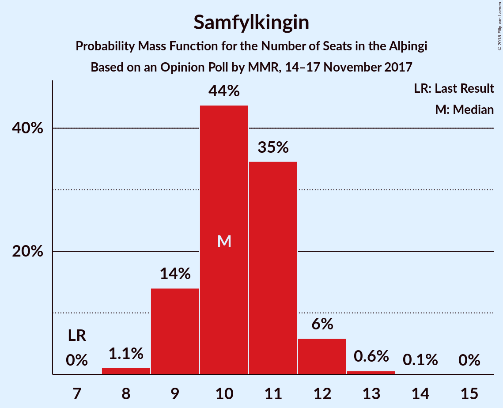
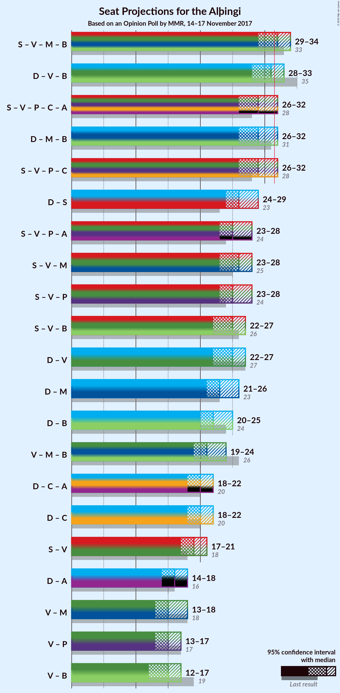

# Opinion Poll by MMR, 14–17 November 2017

<a href="#voting-intentions">Voting Intentions</a> | <a href="#seats">Seats</a> | <a href="#coalitions">Coalitions</a> | <a href="#technical-information">Technical Information</a>

## Voting Intentions

### Confidence Intervals

| Party | Last Result | Poll Result | 80% Confidence Interval | 90% Confidence Interval | 95% Confidence Interval | 99% Confidence Interval |
|:-----:|:-----------:|:-----------:|:-----------------------:|:-----------------------:|:-----------------------:|:-----------------------:|
| Sjálfstæðisflokkurinn | 25.2% | 24.4% | 22.6–26.2% |22.1–26.7% |21.7–27.2% |20.9–28.1% |
| Samfylkingin | 12.1% | 16.0% | 14.6–17.6% |14.1–18.1% |13.8–18.5% |13.1–19.3% |
| Vinstrihreyfingin – grænt framboð | 16.9% | 13.0% | 11.7–14.5% |11.3–15.0% |11.0–15.3% |10.4–16.1% |
| Miðflokkurinn | 10.9% | 10.5% | 9.3–11.9% |9.0–12.3% |8.7–12.6% |8.2–13.3% |
| Píratar | 9.2% | 9.9% | 8.7–11.2% |8.4–11.6% |8.1–11.9% |7.6–12.6% |
| Framsóknarflokkurinn | 10.7% | 9.5% | 8.4–10.9% |8.1–11.2% |7.8–11.6% |7.3–12.2% |
| Flokkur fólksins | 6.9% | 8.4% | 7.3–9.6% |7.0–10.0% |6.8–10.3% |6.3–10.9% |
| Viðreisn | 6.7% | 6.5% | 5.5–7.6% |5.3–7.9% |5.1–8.2% |4.6–8.8% |

*Note:* The poll result column reflects the actual value used in the calculations. Published results may vary slightly, and in addition be rounded to fewer digits.

## Seats

### Confidence Intervals

| Party | Last Result | Median | 80% Confidence Interval | 90% Confidence Interval | 95% Confidence Interval | 99% Confidence Interval |
|:-----:|:-----------:|:------:|:-----------------------:|:-----------------------:|:-----------------------:|:-----------------------:|
| <a href="#sjálfstæðisflokkurinn">Sjálfstæðisflokkurinn</a> | 16 | 16 | 15–17 |14–18 |14–18 |14–19 |
| <a href="#samfylkingin">Samfylkingin</a> | 7 | 10 | 9–11 |9–12 |9–12 |8–13 |
| <a href="#vinstrihreyfingin-–-grænt-framboð">Vinstrihreyfingin – grænt framboð</a> | 11 | 8 | 7–10 |7–10 |7–10 |6–10 |
| <a href="#miðflokkurinn">Miðflokkurinn</a> | 7 | 7 | 6–8 |6–9 |5–9 |5–10 |
| <a href="#píratar">Píratar</a> | 6 | 6 | 5–7 |5–7 |5–8 |5–8 |
| <a href="#framsóknarflokkurinn">Framsóknarflokkurinn</a> | 8 | 6 | 5–7 |5–7 |5–8 |4–8 |
| <a href="#flokkur-fólksins">Flokkur fólksins</a> | 4 | 5 | 4–6 |4–6 |4–6 |4–7 |
| <a href="#viðreisn">Viðreisn</a> | 4 | 4 | 3–5 |3–5 |3–5 |0–5 |

### Sjálfstæðisflokkurinn

*For a full overview of the results for this party, see the [Sjálfstæðisflokkurinn](party-sjálfstæðisflokkurinn.html) page.*

| Number of Seats | Probability | Accumulated | Special Marks |
|:---------------:|:-----------:|:-----------:|:-------------:|
| 13 | 0.3% | 100% |  |
| 14 | 6% | 99.7% |  |
| 15 | 21% | 94% |  |
| 16 | 42% | 73% | Last Result, Median |
| 17 | 22% | 31% |  |
| 18 | 8% | 10% |  |
| 19 | 2% | 2% |  |
| 20 | 0.1% | 0.1% |  |
| 21 | 0% | 0% |  |

### Samfylkingin

*For a full overview of the results for this party, see the [Samfylkingin](party-samfylkingin.html) page.*

| Number of Seats | Probability | Accumulated | Special Marks |
|:---------------:|:-----------:|:-----------:|:-------------:|
| 7 | 0% | 100% | Last Result |
| 8 | 0.9% | 100% |  |
| 9 | 14% | 99.1% |  |
| 10 | 44% | 86% | Median |
| 11 | 35% | 42% |  |
| 12 | 6% | 6% |  |
| 13 | 0.6% | 0.6% |  |
| 14 | 0% | 0.1% |  |
| 15 | 0% | 0% |  |

### Vinstrihreyfingin – grænt framboð

*For a full overview of the results for this party, see the [Vinstrihreyfingin – grænt framboð](party-vinstrihreyfingin–græntframboð.html) page.*

| Number of Seats | Probability | Accumulated | Special Marks |
|:---------------:|:-----------:|:-----------:|:-------------:|
| 6 | 0.6% | 100% |  |
| 7 | 11% | 99.4% |  |
| 8 | 42% | 89% | Median |
| 9 | 25% | 46% |  |
| 10 | 21% | 21% |  |
| 11 | 0.3% | 0.3% | Last Result |
| 12 | 0% | 0% |  |

### Miðflokkurinn

*For a full overview of the results for this party, see the [Miðflokkurinn](party-miðflokkurinn.html) page.*

| Number of Seats | Probability | Accumulated | Special Marks |
|:---------------:|:-----------:|:-----------:|:-------------:|
| 4 | 0.1% | 100% |  |
| 5 | 3% | 99.9% |  |
| 6 | 40% | 97% |  |
| 7 | 45% | 57% | Last Result, Median |
| 8 | 5% | 11% |  |
| 9 | 5% | 6% |  |
| 10 | 2% | 2% |  |
| 11 | 0% | 0% |  |

### Píratar

*For a full overview of the results for this party, see the [Píratar](party-píratar.html) page.*

| Number of Seats | Probability | Accumulated | Special Marks |
|:---------------:|:-----------:|:-----------:|:-------------:|
| 4 | 0.3% | 100% |  |
| 5 | 13% | 99.7% |  |
| 6 | 56% | 86% | Last Result, Median |
| 7 | 27% | 30% |  |
| 8 | 3% | 3% |  |
| 9 | 0.1% | 0.1% |  |
| 10 | 0% | 0% |  |

### Framsóknarflokkurinn

*For a full overview of the results for this party, see the [Framsóknarflokkurinn](party-framsóknarflokkurinn.html) page.*

| Number of Seats | Probability | Accumulated | Special Marks |
|:---------------:|:-----------:|:-----------:|:-------------:|
| 4 | 0.7% | 100% |  |
| 5 | 21% | 99.3% |  |
| 6 | 59% | 79% | Median |
| 7 | 15% | 20% |  |
| 8 | 4% | 4% | Last Result |
| 9 | 0.3% | 0.3% |  |
| 10 | 0% | 0% |  |

### Flokkur fólksins

*For a full overview of the results for this party, see the [Flokkur fólksins](party-flokkurfólksins.html) page.*

| Number of Seats | Probability | Accumulated | Special Marks |
|:---------------:|:-----------:|:-----------:|:-------------:|
| 3 | 0.1% | 100% |  |
| 4 | 12% | 99.9% | Last Result |
| 5 | 58% | 88% | Median |
| 6 | 28% | 30% |  |
| 7 | 2% | 2% |  |
| 8 | 0% | 0% |  |

### Viðreisn

*For a full overview of the results for this party, see the [Viðreisn](party-viðreisn.html) page.*

| Number of Seats | Probability | Accumulated | Special Marks |
|:---------------:|:-----------:|:-----------:|:-------------:|
| 0 | 2% | 100% |  |
| 1 | 0% | 98% |  |
| 2 | 0% | 98% |  |
| 3 | 18% | 98% |  |
| 4 | 68% | 80% | Last Result, Median |
| 5 | 12% | 12% |  |
| 6 | 0.2% | 0.2% |  |
| 7 | 0% | 0% |  |

## Coalitions

### Confidence Intervals

| Coalition | Last Result | Median | Majority? | 80% Confidence Interval | 90% Confidence Interval | 95% Confidence Interval | 99% Confidence Interval |
|:---------:|:-----------:|:------:|:---------:|:-----------------------:|:-----------------------:|:-----------------------:|:-----------------------:|
| Samfylkingin – Vinstrihreyfingin – grænt framboð – Miðflokkurinn – Framsóknarflokkurinn | 33 | 32 | 55% | 30–33 | 30–34 | 29–34 | 28–35 |
| Samfylkingin – Vinstrihreyfingin – grænt framboð – Píratar – Viðreisn | 28 | 29 | 3% | 27–30 | 27–31 | 26–32 | 25–32 |
| Sjálfstæðisflokkurinn – Miðflokkurinn – Framsóknarflokkurinn | 31 | 29 | 2% | 27–30 | 27–31 | 26–31 | 26–32 |
| Sjálfstæðisflokkurinn – Samfylkingin | 23 | 27 | 0% | 25–28 | 25–28 | 24–29 | 23–30 |
| Samfylkingin – Vinstrihreyfingin – grænt framboð – Miðflokkurinn | 25 | 26 | 0% | 24–27 | 24–28 | 23–28 | 22–29 |
| Samfylkingin – Vinstrihreyfingin – grænt framboð – Píratar | 24 | 25 | 0% | 24–26 | 23–27 | 23–28 | 22–28 |
| Samfylkingin – Vinstrihreyfingin – grænt framboð – Framsóknarflokkurinn | 26 | 25 | 0% | 23–27 | 23–27 | 22–27 | 22–28 |
| Sjálfstæðisflokkurinn – Vinstrihreyfingin – grænt framboð | 27 | 25 | 0% | 23–26 | 23–27 | 22–27 | 21–28 |
| Sjálfstæðisflokkurinn – Miðflokkurinn | 23 | 23 | 0% | 21–25 | 21–25 | 21–25 | 20–26 |
| Sjálfstæðisflokkurinn – Framsóknarflokkurinn | 24 | 22 | 0% | 21–24 | 20–24 | 20–25 | 19–25 |
| Vinstrihreyfingin – grænt framboð – Miðflokkurinn – Framsóknarflokkurinn | 26 | 21 | 0% | 20–23 | 19–23 | 19–24 | 18–25 |
| Sjálfstæðisflokkurinn – Viðreisn | 20 | 20 | 0% | 18–21 | 18–22 | 18–22 | 16–23 |
| Samfylkingin – Vinstrihreyfingin – grænt framboð | 18 | 19 | 0% | 18–20 | 17–21 | 17–21 | 16–22 |
| Vinstrihreyfingin – grænt framboð – Miðflokkurinn | 18 | 15 | 0% | 14–17 | 13–17 | 13–18 | 12–19 |
| Vinstrihreyfingin – grænt framboð – Píratar | 17 | 15 | 0% | 13–16 | 13–16 | 13–17 | 12–17 |
| Vinstrihreyfingin – grænt framboð – Framsóknarflokkurinn | 19 | 14 | 0% | 13–16 | 13–16 | 12–17 | 12–17 |

### Samfylkingin – Vinstrihreyfingin – grænt framboð – Miðflokkurinn – Framsóknarflokkurinn

| Number of Seats | Probability | Accumulated | Special Marks |
|:---------------:|:-----------:|:-----------:|:-------------:|
| 28 | 0.6% | 100% |  |
| 29 | 4% | 99.4% |  |
| 30 | 12% | 96% |  |
| 31 | 29% | 84% | Median |
| 32 | 33% | 55% | Majority |
| 33 | 16% | 22% | Last Result |
| 34 | 5% | 6% |  |
| 35 | 1.2% | 1.4% |  |
| 36 | 0.2% | 0.2% |  |
| 37 | 0% | 0% |  |

### Samfylkingin – Vinstrihreyfingin – grænt framboð – Píratar – Viðreisn

| Number of Seats | Probability | Accumulated | Special Marks |
|:---------------:|:-----------:|:-----------:|:-------------:|
| 24 | 0.2% | 100% |  |
| 25 | 0.5% | 99.8% |  |
| 26 | 3% | 99.3% |  |
| 27 | 7% | 96% |  |
| 28 | 17% | 89% | Last Result, Median |
| 29 | 47% | 72% |  |
| 30 | 17% | 26% |  |
| 31 | 6% | 9% |  |
| 32 | 3% | 3% | Majority |
| 33 | 0.2% | 0.2% |  |
| 34 | 0% | 0% |  |

### Sjálfstæðisflokkurinn – Miðflokkurinn – Framsóknarflokkurinn

| Number of Seats | Probability | Accumulated | Special Marks |
|:---------------:|:-----------:|:-----------:|:-------------:|
| 25 | 0.3% | 100% |  |
| 26 | 2% | 99.7% |  |
| 27 | 9% | 97% |  |
| 28 | 27% | 88% |  |
| 29 | 34% | 61% | Median |
| 30 | 17% | 27% |  |
| 31 | 7% | 10% | Last Result |
| 32 | 2% | 2% | Majority |
| 33 | 0.4% | 0.5% |  |
| 34 | 0.1% | 0.1% |  |
| 35 | 0% | 0% |  |

### Sjálfstæðisflokkurinn – Samfylkingin

| Number of Seats | Probability | Accumulated | Special Marks |
|:---------------:|:-----------:|:-----------:|:-------------:|
| 22 | 0.1% | 100% |  |
| 23 | 0.6% | 99.9% | Last Result |
| 24 | 4% | 99.4% |  |
| 25 | 19% | 95% |  |
| 26 | 26% | 76% | Median |
| 27 | 32% | 50% |  |
| 28 | 14% | 18% |  |
| 29 | 3% | 4% |  |
| 30 | 1.0% | 1.1% |  |
| 31 | 0.1% | 0.1% |  |
| 32 | 0% | 0% | Majority |

### Samfylkingin – Vinstrihreyfingin – grænt framboð – Miðflokkurinn

| Number of Seats | Probability | Accumulated | Special Marks |
|:---------------:|:-----------:|:-----------:|:-------------:|
| 22 | 0.6% | 100% |  |
| 23 | 3% | 99.4% |  |
| 24 | 11% | 96% |  |
| 25 | 31% | 85% | Last Result, Median |
| 26 | 35% | 54% |  |
| 27 | 13% | 19% |  |
| 28 | 5% | 6% |  |
| 29 | 1.2% | 1.4% |  |
| 30 | 0.2% | 0.2% |  |
| 31 | 0% | 0% |  |

### Samfylkingin – Vinstrihreyfingin – grænt framboð – Píratar

| Number of Seats | Probability | Accumulated | Special Marks |
|:---------------:|:-----------:|:-----------:|:-------------:|
| 21 | 0.3% | 100% |  |
| 22 | 2% | 99.7% |  |
| 23 | 5% | 98% |  |
| 24 | 18% | 93% | Last Result, Median |
| 25 | 46% | 75% |  |
| 26 | 19% | 29% |  |
| 27 | 7% | 10% |  |
| 28 | 3% | 3% |  |
| 29 | 0.3% | 0.4% |  |
| 30 | 0% | 0% |  |

### Samfylkingin – Vinstrihreyfingin – grænt framboð – Framsóknarflokkurinn

| Number of Seats | Probability | Accumulated | Special Marks |
|:---------------:|:-----------:|:-----------:|:-------------:|
| 21 | 0.3% | 100% |  |
| 22 | 3% | 99.7% |  |
| 23 | 10% | 97% |  |
| 24 | 22% | 88% | Median |
| 25 | 36% | 66% |  |
| 26 | 19% | 29% | Last Result |
| 27 | 9% | 10% |  |
| 28 | 1.4% | 2% |  |
| 29 | 0.1% | 0.2% |  |
| 30 | 0% | 0% |  |

### Sjálfstæðisflokkurinn – Vinstrihreyfingin – grænt framboð

| Number of Seats | Probability | Accumulated | Special Marks |
|:---------------:|:-----------:|:-----------:|:-------------:|
| 21 | 0.5% | 100% |  |
| 22 | 3% | 99.5% |  |
| 23 | 11% | 96% |  |
| 24 | 34% | 85% | Median |
| 25 | 28% | 52% |  |
| 26 | 17% | 24% |  |
| 27 | 4% | 7% | Last Result |
| 28 | 2% | 2% |  |
| 29 | 0.1% | 0.1% |  |
| 30 | 0% | 0% |  |

### Sjálfstæðisflokkurinn – Miðflokkurinn

| Number of Seats | Probability | Accumulated | Special Marks |
|:---------------:|:-----------:|:-----------:|:-------------:|
| 19 | 0.2% | 100% |  |
| 20 | 2% | 99.8% |  |
| 21 | 11% | 98% |  |
| 22 | 26% | 87% |  |
| 23 | 36% | 61% | Last Result, Median |
| 24 | 15% | 25% |  |
| 25 | 8% | 10% |  |
| 26 | 2% | 2% |  |
| 27 | 0.3% | 0.4% |  |
| 28 | 0.1% | 0.1% |  |
| 29 | 0% | 0% |  |

### Sjálfstæðisflokkurinn – Framsóknarflokkurinn

| Number of Seats | Probability | Accumulated | Special Marks |
|:---------------:|:-----------:|:-----------:|:-------------:|
| 19 | 1.0% | 100% |  |
| 20 | 7% | 99.0% |  |
| 21 | 20% | 92% |  |
| 22 | 38% | 72% | Median |
| 23 | 23% | 34% |  |
| 24 | 8% | 11% | Last Result |
| 25 | 3% | 3% |  |
| 26 | 0.4% | 0.5% |  |
| 27 | 0.1% | 0.1% |  |
| 28 | 0% | 0% |  |

### Vinstrihreyfingin – grænt framboð – Miðflokkurinn – Framsóknarflokkurinn

| Number of Seats | Probability | Accumulated | Special Marks |
|:---------------:|:-----------:|:-----------:|:-------------:|
| 18 | 1.1% | 100% |  |
| 19 | 5% | 98.8% |  |
| 20 | 18% | 94% |  |
| 21 | 35% | 76% | Median |
| 22 | 26% | 42% |  |
| 23 | 13% | 16% |  |
| 24 | 3% | 3% |  |
| 25 | 0.6% | 0.7% |  |
| 26 | 0.1% | 0.1% | Last Result |
| 27 | 0% | 0% |  |

### Sjálfstæðisflokkurinn – Viðreisn

| Number of Seats | Probability | Accumulated | Special Marks |
|:---------------:|:-----------:|:-----------:|:-------------:|
| 15 | 0.1% | 100% |  |
| 16 | 0.5% | 99.9% |  |
| 17 | 2% | 99.4% |  |
| 18 | 8% | 98% |  |
| 19 | 20% | 90% |  |
| 20 | 39% | 70% | Last Result, Median |
| 21 | 23% | 31% |  |
| 22 | 6% | 8% |  |
| 23 | 1.3% | 2% |  |
| 24 | 0.3% | 0.3% |  |
| 25 | 0% | 0% |  |

### Samfylkingin – Vinstrihreyfingin – grænt framboð

| Number of Seats | Probability | Accumulated | Special Marks |
|:---------------:|:-----------:|:-----------:|:-------------:|
| 15 | 0.2% | 100% |  |
| 16 | 2% | 99.8% |  |
| 17 | 8% | 98% |  |
| 18 | 25% | 91% | Last Result, Median |
| 19 | 41% | 66% |  |
| 20 | 17% | 25% |  |
| 21 | 7% | 8% |  |
| 22 | 1.1% | 1.1% |  |
| 23 | 0.1% | 0.1% |  |
| 24 | 0% | 0% |  |

### Vinstrihreyfingin – grænt framboð – Miðflokkurinn

| Number of Seats | Probability | Accumulated | Special Marks |
|:---------------:|:-----------:|:-----------:|:-------------:|
| 12 | 0.5% | 100% |  |
| 13 | 4% | 99.4% |  |
| 14 | 18% | 95% |  |
| 15 | 38% | 77% | Median |
| 16 | 25% | 39% |  |
| 17 | 12% | 14% |  |
| 18 | 2% | 3% | Last Result |
| 19 | 0.6% | 0.6% |  |
| 20 | 0% | 0% |  |

### Vinstrihreyfingin – grænt framboð – Píratar

| Number of Seats | Probability | Accumulated | Special Marks |
|:---------------:|:-----------:|:-----------:|:-------------:|
| 11 | 0.1% | 100% |  |
| 12 | 1.5% | 99.9% |  |
| 13 | 10% | 98% |  |
| 14 | 33% | 88% | Median |
| 15 | 28% | 56% |  |
| 16 | 24% | 28% |  |
| 17 | 3% | 4% | Last Result |
| 18 | 0.4% | 0.4% |  |
| 19 | 0% | 0% |  |

### Vinstrihreyfingin – grænt framboð – Framsóknarflokkurinn

| Number of Seats | Probability | Accumulated | Special Marks |
|:---------------:|:-----------:|:-----------:|:-------------:|
| 11 | 0.2% | 100% |  |
| 12 | 3% | 99.8% |  |
| 13 | 13% | 97% |  |
| 14 | 35% | 84% | Median |
| 15 | 24% | 49% |  |
| 16 | 21% | 25% |  |
| 17 | 3% | 3% |  |
| 18 | 0.3% | 0.3% |  |
| 19 | 0% | 0% | Last Result |

## Technical Information

### Opinion Poll

+ **Polling firm:** MMR
+ **Commissioner(s):** —
+ **Fieldwork period:** 14–17 November 2017

### Calculations

+ **Sample size:** 944
+ **Simulations done:** 1,048,576
+ **Error estimate:** 0.81%

