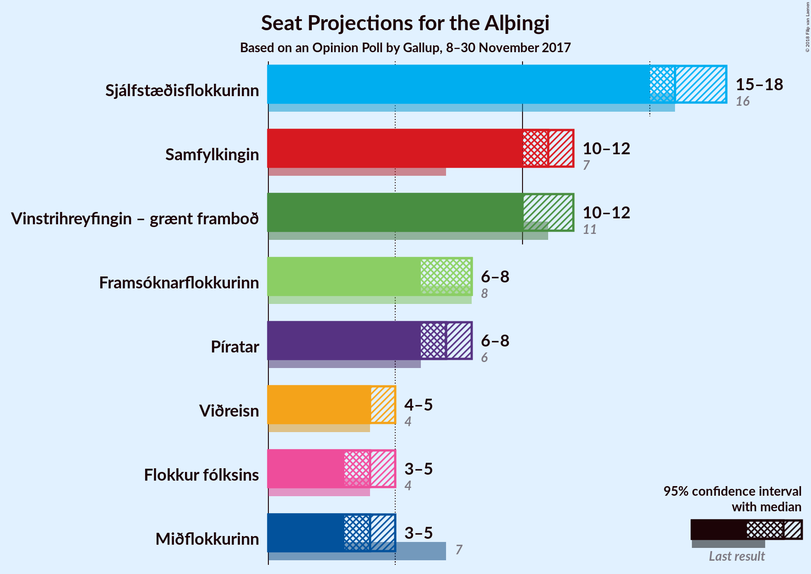
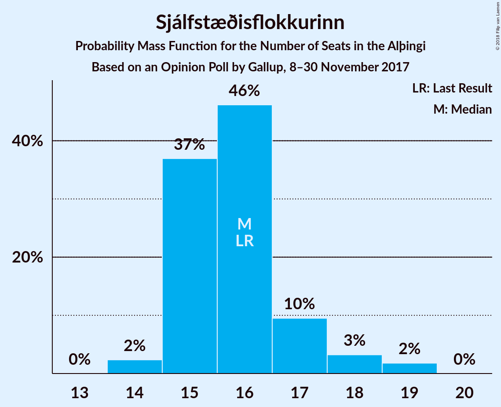

# Opinion Poll by Gallup, 8–30 November 2017

<a href="#voting-intentions">Voting Intentions</a> | <a href="#seats">Seats</a> | <a href="#coalitions">Coalitions</a> | <a href="#technical-information">Technical Information</a>

## Voting Intentions

### Confidence Intervals

| Party | Last Result | Poll Result | 80% Confidence Interval | 90% Confidence Interval | 95% Confidence Interval | 99% Confidence Interval |
|:-----:|:-----------:|:-----------:|:-----------------------:|:-----------------------:|:-----------------------:|:-----------------------:|
| Sjálfstæðisflokkurinn | 25.2% | 24.0% | 22.9–25.2% |22.6–25.5% |22.3–25.8% |21.8–26.4% |
| Samfylkingin | 12.1% | 16.7% | 15.7–17.7% |15.5–18.0% |15.2–18.3% |14.8–18.8% |
| Vinstrihreyfingin – grænt framboð | 16.9% | 16.1% | 15.1–17.1% |14.9–17.4% |14.6–17.6% |14.2–18.1% |
| Framsóknarflokkurinn | 10.7% | 10.4% | 9.6–11.3% |9.4–11.5% |9.2–11.7% |8.9–12.1% |
| Píratar | 9.2% | 10.4% | 9.6–11.3% |9.4–11.5% |9.2–11.7% |8.9–12.1% |
| Viðreisn | 6.7% | 7.1% | 6.5–7.8% |6.3–8.0% |6.1–8.2% |5.8–8.6% |
| Miðflokkurinn | 10.9% | 6.8% | 6.2–7.5% |6.0–7.7% |5.9–7.9% |5.6–8.3% |
| Flokkur fólksins | 6.9% | 6.4% | 5.8–7.1% |5.6–7.3% |5.5–7.5% |5.2–7.8% |

*Note:* The poll result column reflects the actual value used in the calculations. Published results may vary slightly, and in addition be rounded to fewer digits.

## Seats

### Confidence Intervals

| Party | Last Result | Median | 80% Confidence Interval | 90% Confidence Interval | 95% Confidence Interval | 99% Confidence Interval |
|:-----:|:-----------:|:------:|:-----------------------:|:-----------------------:|:-----------------------:|:-----------------------:|
| <a href="#sjálfstæðisflokkurinn">Sjálfstæðisflokkurinn</a> | 16 | 16 | 15–17 |15–17 |15–18 |14–19 |
| <a href="#samfylkingin">Samfylkingin</a> | 7 | 11 | 10–11 |10–12 |10–12 |10–12 |
| <a href="#vinstrihreyfingin-–-grænt-framboð">Vinstrihreyfingin – grænt framboð</a> | 11 | 10 | 10–11 |10–11 |9–12 |9–12 |
| <a href="#framsóknarflokkurinn">Framsóknarflokkurinn</a> | 8 | 7 | 6–8 |6–8 |6–8 |5–8 |
| <a href="#píratar">Píratar</a> | 6 | 6 | 6–7 |6–7 |6–8 |5–8 |
| <a href="#viðreisn">Viðreisn</a> | 4 | 4 | 4–5 |4–5 |4–5 |3–5 |
| <a href="#miðflokkurinn">Miðflokkurinn</a> | 7 | 4 | 4–5 |4–5 |3–5 |3–5 |
| <a href="#flokkur-fólksins">Flokkur fólksins</a> | 4 | 4 | 3–4 |3–4 |3–5 |3–5 |

### Sjálfstæðisflokkurinn

*For a full overview of the results for this party, see the [Sjálfstæðisflokkurinn](party-sjálfstæðisflokkurinn.html) page.*

| Number of Seats | Probability | Accumulated | Special Marks |
|:---------------:|:-----------:|:-----------:|:-------------:|
| 14 | 2% | 100% |  |
| 15 | 37% | 98% |  |
| 16 | 46% | 60% | Last Result, Median |
| 17 | 9% | 14% |  |
| 18 | 3% | 5% |  |
| 19 | 2% | 2% |  |
| 20 | 0% | 0% |  |

### Samfylkingin

*For a full overview of the results for this party, see the [Samfylkingin](party-samfylkingin.html) page.*

| Number of Seats | Probability | Accumulated | Special Marks |
|:---------------:|:-----------:|:-----------:|:-------------:|
| 7 | 0% | 100% | Last Result |
| 8 | 0% | 100% |  |
| 9 | 0.5% | 100% |  |
| 10 | 30% | 99.5% |  |
| 11 | 60% | 69% | Median |
| 12 | 9% | 9% |  |
| 13 | 0.2% | 0.2% |  |
| 14 | 0% | 0% |  |

### Vinstrihreyfingin – grænt framboð

*For a full overview of the results for this party, see the [Vinstrihreyfingin – grænt framboð](party-vinstrihreyfingin–græntframboð.html) page.*

| Number of Seats | Probability | Accumulated | Special Marks |
|:---------------:|:-----------:|:-----------:|:-------------:|
| 9 | 3% | 100% |  |
| 10 | 56% | 97% | Median |
| 11 | 39% | 42% | Last Result |
| 12 | 2% | 3% |  |
| 13 | 0.2% | 0.2% |  |
| 14 | 0% | 0% |  |

### Framsóknarflokkurinn

*For a full overview of the results for this party, see the [Framsóknarflokkurinn](party-framsóknarflokkurinn.html) page.*

| Number of Seats | Probability | Accumulated | Special Marks |
|:---------------:|:-----------:|:-----------:|:-------------:|
| 5 | 0.7% | 100% |  |
| 6 | 23% | 99.3% |  |
| 7 | 27% | 76% | Median |
| 8 | 50% | 50% | Last Result |
| 9 | 0% | 0% |  |

### Píratar

*For a full overview of the results for this party, see the [Píratar](party-píratar.html) page.*

| Number of Seats | Probability | Accumulated | Special Marks |
|:---------------:|:-----------:|:-----------:|:-------------:|
| 5 | 0.7% | 100% |  |
| 6 | 52% | 99.3% | Last Result, Median |
| 7 | 44% | 47% |  |
| 8 | 3% | 3% |  |
| 9 | 0% | 0% |  |

### Viðreisn

*For a full overview of the results for this party, see the [Viðreisn](party-viðreisn.html) page.*

| Number of Seats | Probability | Accumulated | Special Marks |
|:---------------:|:-----------:|:-----------:|:-------------:|
| 3 | 1.1% | 100% |  |
| 4 | 67% | 98.9% | Last Result, Median |
| 5 | 32% | 32% |  |
| 6 | 0.1% | 0.1% |  |
| 7 | 0% | 0% |  |

### Miðflokkurinn

*For a full overview of the results for this party, see the [Miðflokkurinn](party-miðflokkurinn.html) page.*

| Number of Seats | Probability | Accumulated | Special Marks |
|:---------------:|:-----------:|:-----------:|:-------------:|
| 3 | 3% | 100% |  |
| 4 | 83% | 97% | Median |
| 5 | 13% | 14% |  |
| 6 | 0% | 0% |  |
| 7 | 0% | 0% | Last Result |

### Flokkur fólksins

*For a full overview of the results for this party, see the [Flokkur fólksins](party-flokkurfólksins.html) page.*

| Number of Seats | Probability | Accumulated | Special Marks |
|:---------------:|:-----------:|:-----------:|:-------------:|
| 0 | 0.1% | 100% |  |
| 1 | 0% | 99.9% |  |
| 2 | 0% | 99.9% |  |
| 3 | 18% | 99.9% |  |
| 4 | 78% | 81% | Last Result, Median |
| 5 | 4% | 4% |  |
| 6 | 0% | 0% |  |

## Coalitions

### Confidence Intervals

| Coalition | Last Result | Median | Majority? | 80% Confidence Interval | 90% Confidence Interval | 95% Confidence Interval | 99% Confidence Interval |
|:---------:|:-----------:|:------:|:---------:|:-----------------------:|:-----------------------:|:-----------------------:|:-----------------------:|
| Samfylkingin – Vinstrihreyfingin – grænt framboð – Framsóknarflokkurinn – Miðflokkurinn | 33 | 33 | 84% | 31–34 | 31–34 | 30–34 | 30–35 |
| Samfylkingin – Vinstrihreyfingin – grænt framboð – Píratar – Viðreisn | 28 | 32 | 75% | 31–33 | 31–33 | 30–34 | 30–34 |
| Samfylkingin – Vinstrihreyfingin – grænt framboð – Framsóknarflokkurinn | 26 | 29 | 0% | 27–30 | 27–30 | 26–30 | 26–30 |
| Samfylkingin – Vinstrihreyfingin – grænt framboð – Píratar | 24 | 28 | 0% | 27–29 | 26–29 | 26–29 | 26–30 |
| Sjálfstæðisflokkurinn – Framsóknarflokkurinn – Miðflokkurinn | 31 | 27 | 0% | 26–28 | 26–29 | 25–29 | 25–29 |
| Sjálfstæðisflokkurinn – Samfylkingin | 23 | 27 | 0% | 25–28 | 25–28 | 25–29 | 25–30 |
| Sjálfstæðisflokkurinn – Vinstrihreyfingin – grænt framboð | 27 | 26 | 0% | 25–27 | 25–28 | 25–28 | 24–29 |
| Samfylkingin – Vinstrihreyfingin – grænt framboð – Miðflokkurinn | 25 | 25 | 0% | 24–26 | 24–27 | 24–27 | 23–27 |
| Sjálfstæðisflokkurinn – Framsóknarflokkurinn | 24 | 23 | 0% | 22–24 | 22–24 | 21–25 | 21–25 |
| Vinstrihreyfingin – grænt framboð – Framsóknarflokkurinn – Miðflokkurinn | 26 | 22 | 0% | 20–23 | 20–23 | 20–23 | 19–24 |
| Samfylkingin – Vinstrihreyfingin – grænt framboð | 18 | 21 | 0% | 20–22 | 20–22 | 20–23 | 20–23 |
| Sjálfstæðisflokkurinn – Viðreisn | 20 | 20 | 0% | 19–21 | 19–22 | 19–22 | 18–23 |
| Sjálfstæðisflokkurinn – Miðflokkurinn | 23 | 20 | 0% | 19–21 | 19–22 | 18–22 | 18–23 |
| Vinstrihreyfingin – grænt framboð – Framsóknarflokkurinn | 19 | 18 | 0% | 16–19 | 16–19 | 16–19 | 15–19 |
| Vinstrihreyfingin – grænt framboð – Píratar | 17 | 17 | 0% | 16–18 | 16–18 | 16–18 | 15–19 |
| Vinstrihreyfingin – grænt framboð – Miðflokkurinn | 18 | 14 | 0% | 14–15 | 14–16 | 13–16 | 13–16 |

### Samfylkingin – Vinstrihreyfingin – grænt framboð – Framsóknarflokkurinn – Miðflokkurinn

| Number of Seats | Probability | Accumulated | Special Marks |
|:---------------:|:-----------:|:-----------:|:-------------:|
| 29 | 0.2% | 100% |  |
| 30 | 3% | 99.8% |  |
| 31 | 12% | 96% |  |
| 32 | 27% | 84% | Median, Majority |
| 33 | 40% | 57% | Last Result |
| 34 | 16% | 17% |  |
| 35 | 0.7% | 0.7% |  |
| 36 | 0% | 0% |  |

### Samfylkingin – Vinstrihreyfingin – grænt framboð – Píratar – Viðreisn

| Number of Seats | Probability | Accumulated | Special Marks |
|:---------------:|:-----------:|:-----------:|:-------------:|
| 28 | 0% | 100% | Last Result |
| 29 | 0.1% | 100% |  |
| 30 | 3% | 99.9% |  |
| 31 | 23% | 97% | Median |
| 32 | 50% | 75% | Majority |
| 33 | 20% | 24% |  |
| 34 | 4% | 4% |  |
| 35 | 0.2% | 0.2% |  |
| 36 | 0% | 0% |  |

### Samfylkingin – Vinstrihreyfingin – grænt framboð – Framsóknarflokkurinn

| Number of Seats | Probability | Accumulated | Special Marks |
|:---------------:|:-----------:|:-----------:|:-------------:|
| 25 | 0.2% | 100% |  |
| 26 | 4% | 99.8% | Last Result |
| 27 | 15% | 96% |  |
| 28 | 28% | 81% | Median |
| 29 | 39% | 53% |  |
| 30 | 14% | 14% |  |
| 31 | 0.4% | 0.4% |  |
| 32 | 0% | 0% | Majority |

### Samfylkingin – Vinstrihreyfingin – grænt framboð – Píratar

| Number of Seats | Probability | Accumulated | Special Marks |
|:---------------:|:-----------:|:-----------:|:-------------:|
| 24 | 0% | 100% | Last Result |
| 25 | 0.2% | 100% |  |
| 26 | 7% | 99.8% |  |
| 27 | 32% | 93% | Median |
| 28 | 48% | 61% |  |
| 29 | 12% | 14% |  |
| 30 | 2% | 2% |  |
| 31 | 0% | 0% |  |

### Sjálfstæðisflokkurinn – Framsóknarflokkurinn – Miðflokkurinn

| Number of Seats | Probability | Accumulated | Special Marks |
|:---------------:|:-----------:|:-----------:|:-------------:|
| 24 | 0.1% | 100% |  |
| 25 | 3% | 99.9% |  |
| 26 | 18% | 97% |  |
| 27 | 45% | 79% | Median |
| 28 | 28% | 34% |  |
| 29 | 5% | 6% |  |
| 30 | 0.1% | 0.2% |  |
| 31 | 0% | 0% | Last Result |

### Sjálfstæðisflokkurinn – Samfylkingin

| Number of Seats | Probability | Accumulated | Special Marks |
|:---------------:|:-----------:|:-----------:|:-------------:|
| 23 | 0% | 100% | Last Result |
| 24 | 0.2% | 100% |  |
| 25 | 12% | 99.8% |  |
| 26 | 37% | 88% |  |
| 27 | 38% | 51% | Median |
| 28 | 9% | 13% |  |
| 29 | 3% | 4% |  |
| 30 | 1.0% | 1.0% |  |
| 31 | 0% | 0% |  |

### Sjálfstæðisflokkurinn – Vinstrihreyfingin – grænt framboð

| Number of Seats | Probability | Accumulated | Special Marks |
|:---------------:|:-----------:|:-----------:|:-------------:|
| 24 | 2% | 100% |  |
| 25 | 19% | 98% |  |
| 26 | 48% | 80% | Median |
| 27 | 24% | 32% | Last Result |
| 28 | 6% | 8% |  |
| 29 | 2% | 2% |  |
| 30 | 0.4% | 0.4% |  |
| 31 | 0% | 0% |  |

### Samfylkingin – Vinstrihreyfingin – grænt framboð – Miðflokkurinn

| Number of Seats | Probability | Accumulated | Special Marks |
|:---------------:|:-----------:|:-----------:|:-------------:|
| 23 | 0.7% | 100% |  |
| 24 | 17% | 99.2% |  |
| 25 | 40% | 82% | Last Result, Median |
| 26 | 36% | 42% |  |
| 27 | 6% | 6% |  |
| 28 | 0.4% | 0.5% |  |
| 29 | 0% | 0% |  |

### Sjálfstæðisflokkurinn – Framsóknarflokkurinn

| Number of Seats | Probability | Accumulated | Special Marks |
|:---------------:|:-----------:|:-----------:|:-------------:|
| 20 | 0.2% | 100% |  |
| 21 | 4% | 99.8% |  |
| 22 | 21% | 96% |  |
| 23 | 45% | 75% | Median |
| 24 | 27% | 30% | Last Result |
| 25 | 3% | 3% |  |
| 26 | 0% | 0% |  |

### Vinstrihreyfingin – grænt framboð – Framsóknarflokkurinn – Miðflokkurinn

| Number of Seats | Probability | Accumulated | Special Marks |
|:---------------:|:-----------:|:-----------:|:-------------:|
| 19 | 1.0% | 100% |  |
| 20 | 11% | 99.0% |  |
| 21 | 23% | 88% | Median |
| 22 | 42% | 66% |  |
| 23 | 22% | 24% |  |
| 24 | 1.4% | 1.4% |  |
| 25 | 0% | 0% |  |
| 26 | 0% | 0% | Last Result |

### Samfylkingin – Vinstrihreyfingin – grænt framboð

| Number of Seats | Probability | Accumulated | Special Marks |
|:---------------:|:-----------:|:-----------:|:-------------:|
| 18 | 0% | 100% | Last Result |
| 19 | 0.5% | 100% |  |
| 20 | 19% | 99.5% |  |
| 21 | 44% | 80% | Median |
| 22 | 32% | 36% |  |
| 23 | 4% | 4% |  |
| 24 | 0.2% | 0.2% |  |
| 25 | 0% | 0% |  |

### Sjálfstæðisflokkurinn – Viðreisn

| Number of Seats | Probability | Accumulated | Special Marks |
|:---------------:|:-----------:|:-----------:|:-------------:|
| 18 | 1.1% | 100% |  |
| 19 | 26% | 98.9% |  |
| 20 | 46% | 73% | Last Result, Median |
| 21 | 19% | 27% |  |
| 22 | 6% | 8% |  |
| 23 | 2% | 2% |  |
| 24 | 0.2% | 0.2% |  |
| 25 | 0% | 0% |  |

### Sjálfstæðisflokkurinn – Miðflokkurinn

| Number of Seats | Probability | Accumulated | Special Marks |
|:---------------:|:-----------:|:-----------:|:-------------:|
| 18 | 3% | 100% |  |
| 19 | 34% | 97% |  |
| 20 | 44% | 64% | Median |
| 21 | 14% | 20% |  |
| 22 | 4% | 6% |  |
| 23 | 2% | 2% | Last Result |
| 24 | 0.1% | 0.1% |  |
| 25 | 0% | 0% |  |

### Vinstrihreyfingin – grænt framboð – Framsóknarflokkurinn

| Number of Seats | Probability | Accumulated | Special Marks |
|:---------------:|:-----------:|:-----------:|:-------------:|
| 15 | 0.7% | 100% |  |
| 16 | 13% | 99.3% |  |
| 17 | 23% | 86% | Median |
| 18 | 43% | 63% |  |
| 19 | 19% | 19% | Last Result |
| 20 | 0.2% | 0.2% |  |
| 21 | 0% | 0% |  |

### Vinstrihreyfingin – grænt framboð – Píratar

| Number of Seats | Probability | Accumulated | Special Marks |
|:---------------:|:-----------:|:-----------:|:-------------:|
| 15 | 0.6% | 100% |  |
| 16 | 27% | 99.4% | Median |
| 17 | 53% | 72% | Last Result |
| 18 | 17% | 19% |  |
| 19 | 2% | 2% |  |
| 20 | 0% | 0% |  |

### Vinstrihreyfingin – grænt framboð – Miðflokkurinn

| Number of Seats | Probability | Accumulated | Special Marks |
|:---------------:|:-----------:|:-----------:|:-------------:|
| 13 | 4% | 100% |  |
| 14 | 47% | 96% | Median |
| 15 | 43% | 49% |  |
| 16 | 6% | 7% |  |
| 17 | 0.4% | 0.4% |  |
| 18 | 0% | 0% | Last Result |

## Technical Information

### Opinion Poll

+ **Polling firm:** Gallup
+ **Commissioner(s):** —
+ **Fieldwork period:** 8–30 November 2017

### Calculations

+ **Sample size:** 2307
+ **Simulations done:** 1,048,576
+ **Error estimate:** 0.52%

