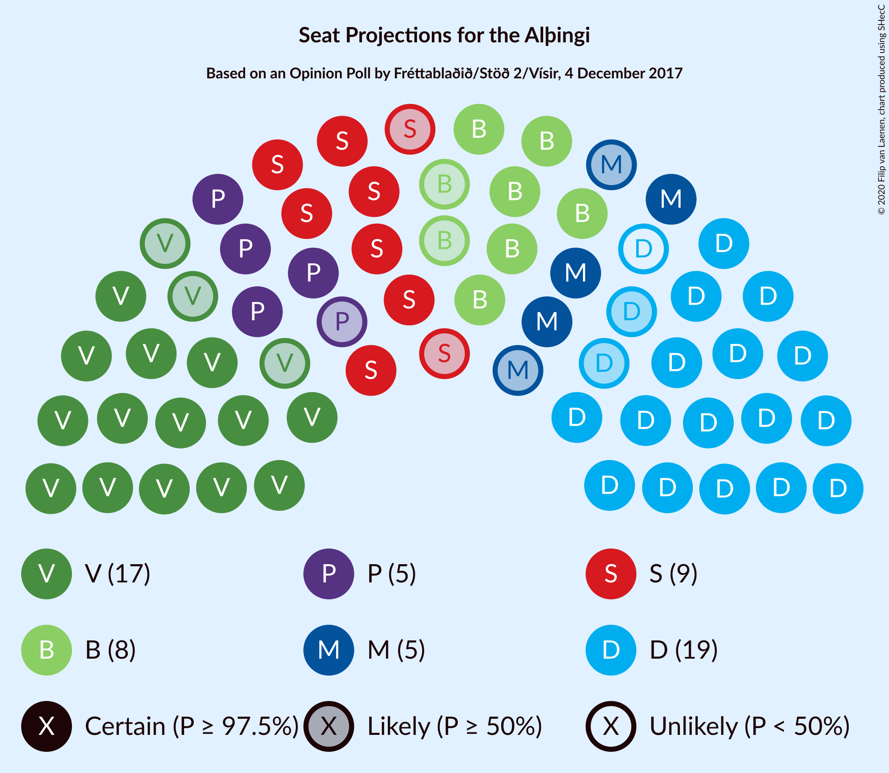
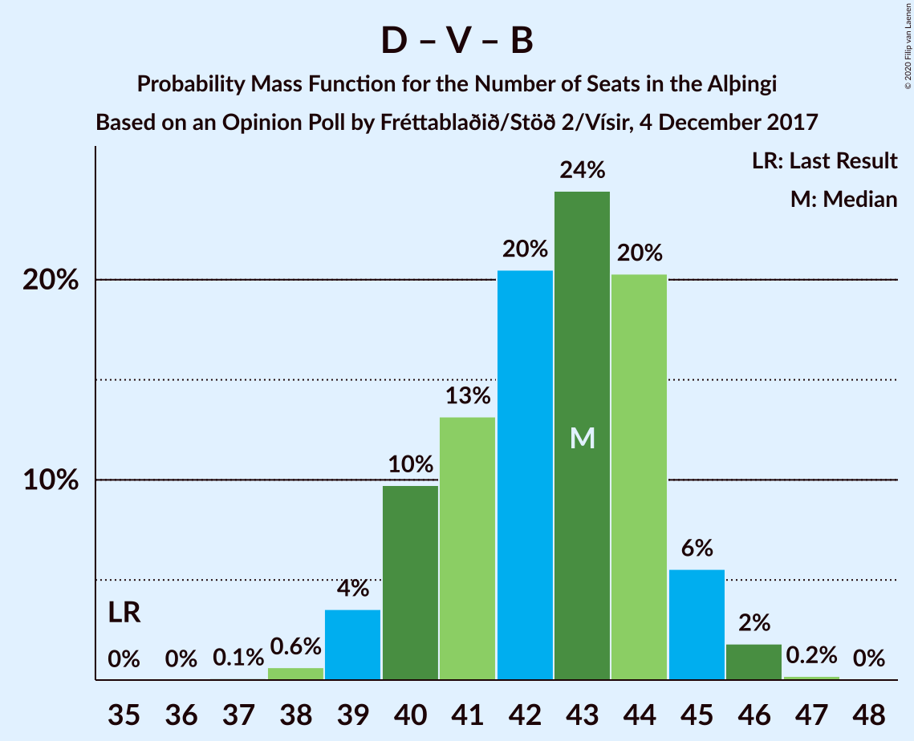
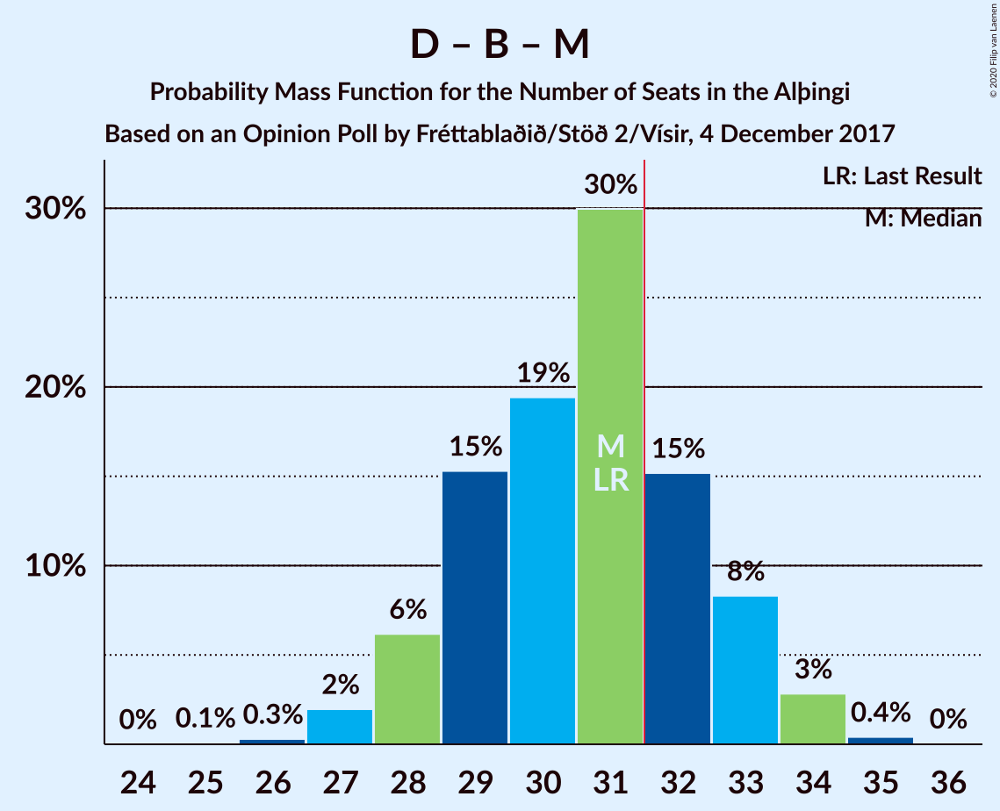
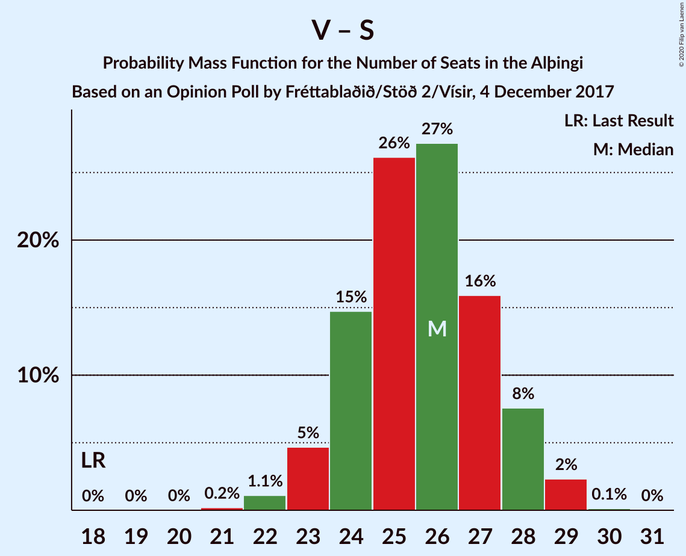
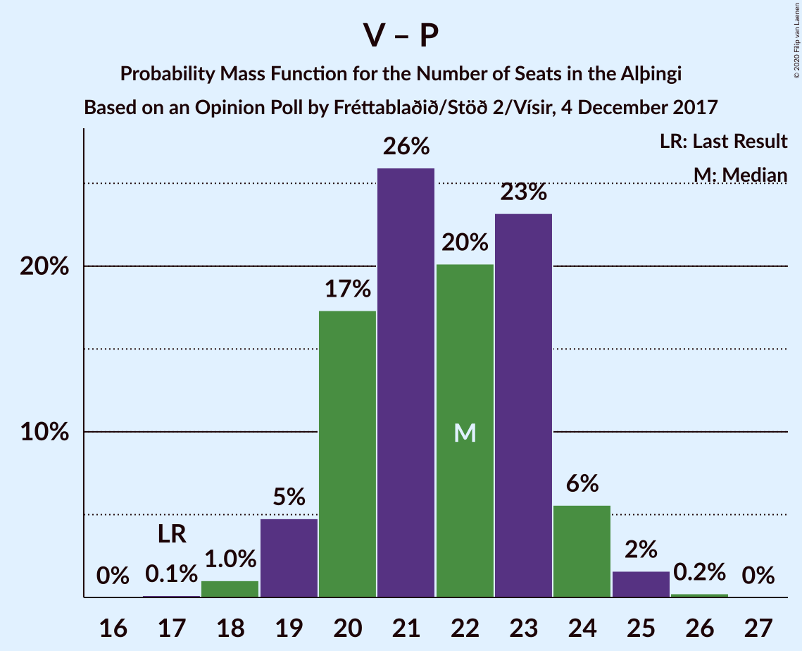
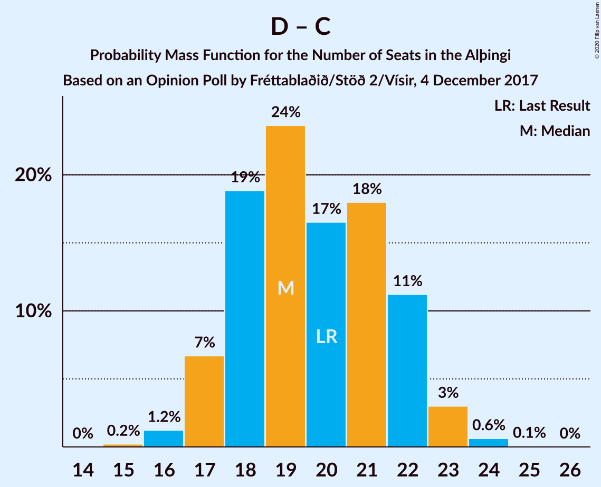

# Opinion Poll by Fréttablaðið/Stöð 2/Vísir, 4 December 2017

<a href="#voting-intentions">Voting Intentions</a> | <a href="#seats">Seats</a> | <a href="#coalitions">Coalitions</a> | <a href="#technical-information">Technical Information</a>

## Voting Intentions

### Confidence Intervals

| Party | Last Result | Poll Result | 80% Confidence Interval | 90% Confidence Interval | 95% Confidence Interval | 99% Confidence Interval |
|:-----:|:-----------:|:-----------:|:-----------------------:|:-----------------------:|:-----------------------:|:-----------------------:|
| Sjálfstæðisflokkurinn | 25.2% | 26.4% | 24.4–28.4% |23.9–29.0% |23.4–29.5% |22.5–30.5% |
| Vinstrihreyfingin – grænt framboð | 16.9% | 23.5% | 21.7–25.5% |21.2–26.1% |20.7–26.6% |19.8–27.5% |
| Samfylkingin | 12.1% | 13.4% | 12.0–15.1% |11.6–15.6% |11.2–16.0% |10.6–16.8% |
| Framsóknarflokkurinn | 10.7% | 11.3% | 10.0–12.9% |9.6–13.3% |9.3–13.7% |8.7–14.5% |
| Píratar | 9.2% | 7.7% | 6.6–9.1% |6.3–9.4% |6.1–9.8% |5.6–10.4% |
| Miðflokkurinn | 10.9% | 7.3% | 6.3–8.7% |6.0–9.0% |5.7–9.4% |5.3–10.0% |
| Viðreisn | 6.7% | 4.9% | 4.0–6.0% |3.8–6.3% |3.6–6.6% |3.2–7.1% |
| Flokkur fólksins | 6.9% | 4.0% | 3.2–5.0% |3.0–5.3% |2.8–5.6% |2.5–6.1% |

*Note:* The poll result column reflects the actual value used in the calculations. Published results may vary slightly, and in addition be rounded to fewer digits.

## Seats

### Confidence Intervals

| Party | Last Result | Median | 80% Confidence Interval | 90% Confidence Interval | 95% Confidence Interval | 99% Confidence Interval |
|:-----:|:-----------:|:------:|:-----------------------:|:-----------------------:|:-----------------------:|:-----------------------:|
| <a href="#sjálfstæðisflokkurinn">Sjálfstæðisflokkurinn</a> | 16 | 18 | 17–20 |16–20 |16–21 |15–21 |
| <a href="#vinstrihreyfingin-–-grænt-framboð">Vinstrihreyfingin – grænt framboð</a> | 11 | 17 | 15–18 |15–18 |14–19 |14–20 |
| <a href="#samfylkingin">Samfylkingin</a> | 7 | 9 | 8–10 |8–11 |7–11 |7–11 |
| <a href="#framsóknarflokkurinn">Framsóknarflokkurinn</a> | 8 | 8 | 7–9 |6–9 |6–10 |6–10 |
| <a href="#píratar">Píratar</a> | 6 | 5 | 4–6 |4–6 |4–6 |3–7 |
| <a href="#miðflokkurinn">Miðflokkurinn</a> | 7 | 5 | 4–6 |4–6 |3–6 |3–7 |
| <a href="#viðreisn">Viðreisn</a> | 4 | 0 | 0–4 |0–4 |0–4 |0–4 |
| <a href="#flokkur-fólksins">Flokkur fólksins</a> | 4 | 0 | 0 |0–3 |0–3 |0–4 |

### Sjálfstæðisflokkurinn

*For a full overview of the results for this party, see the [Sjálfstæðisflokkurinn](party-sjálfstæðisflokkurinn.html) page.*

| Number of Seats | Probability | Accumulated | Special Marks |
|:---------------:|:-----------:|:-----------:|:-------------:|
| 14 | 0.2% | 100% |  |
| 15 | 1.4% | 99.8% |  |
| 16 | 6% | 98% | Last Result |
| 17 | 14% | 92% |  |
| 18 | 36% | 78% | Median |
| 19 | 27% | 42% |  |
| 20 | 12% | 15% |  |
| 21 | 2% | 3% |  |
| 22 | 0.3% | 0.4% |  |
| 23 | 0% | 0% |  |

### Vinstrihreyfingin – grænt framboð

*For a full overview of the results for this party, see the [Vinstrihreyfingin – grænt framboð](party-vinstrihreyfingin–græntframboð.html) page.*

| Number of Seats | Probability | Accumulated | Special Marks |
|:---------------:|:-----------:|:-----------:|:-------------:|
| 11 | 0% | 100% | Last Result |
| 12 | 0% | 100% |  |
| 13 | 0.3% | 100% |  |
| 14 | 3% | 99.7% |  |
| 15 | 20% | 97% |  |
| 16 | 22% | 77% |  |
| 17 | 36% | 55% | Median |
| 18 | 16% | 19% |  |
| 19 | 2% | 3% |  |
| 20 | 1.0% | 1.3% |  |
| 21 | 0.2% | 0.2% |  |
| 22 | 0% | 0% |  |

### Samfylkingin

*For a full overview of the results for this party, see the [Samfylkingin](party-samfylkingin.html) page.*

| Number of Seats | Probability | Accumulated | Special Marks |
|:---------------:|:-----------:|:-----------:|:-------------:|
| 6 | 0.1% | 100% |  |
| 7 | 4% | 99.9% | Last Result |
| 8 | 24% | 96% |  |
| 9 | 43% | 72% | Median |
| 10 | 23% | 30% |  |
| 11 | 6% | 6% |  |
| 12 | 0.4% | 0.5% |  |
| 13 | 0% | 0% |  |

### Framsóknarflokkurinn

*For a full overview of the results for this party, see the [Framsóknarflokkurinn](party-framsóknarflokkurinn.html) page.*

| Number of Seats | Probability | Accumulated | Special Marks |
|:---------------:|:-----------:|:-----------:|:-------------:|
| 5 | 0.5% | 100% |  |
| 6 | 8% | 99.5% |  |
| 7 | 34% | 92% |  |
| 8 | 45% | 58% | Last Result, Median |
| 9 | 10% | 13% |  |
| 10 | 2% | 3% |  |
| 11 | 0.3% | 0.3% |  |
| 12 | 0% | 0% |  |

### Píratar

*For a full overview of the results for this party, see the [Píratar](party-píratar.html) page.*

| Number of Seats | Probability | Accumulated | Special Marks |
|:---------------:|:-----------:|:-----------:|:-------------:|
| 1 | 0% | 100% |  |
| 2 | 0% | 99.9% |  |
| 3 | 1.1% | 99.9% |  |
| 4 | 19% | 98.9% |  |
| 5 | 48% | 80% | Median |
| 6 | 29% | 31% | Last Result |
| 7 | 2% | 2% |  |
| 8 | 0.1% | 0.1% |  |
| 9 | 0% | 0% |  |

### Miðflokkurinn

*For a full overview of the results for this party, see the [Miðflokkurinn](party-miðflokkurinn.html) page.*

| Number of Seats | Probability | Accumulated | Special Marks |
|:---------------:|:-----------:|:-----------:|:-------------:|
| 1 | 0.2% | 100% |  |
| 2 | 0% | 99.8% |  |
| 3 | 3% | 99.8% |  |
| 4 | 36% | 97% |  |
| 5 | 48% | 61% | Median |
| 6 | 12% | 13% |  |
| 7 | 1.1% | 1.1% | Last Result |
| 8 | 0% | 0% |  |

### Viðreisn

*For a full overview of the results for this party, see the [Viðreisn](party-viðreisn.html) page.*

| Number of Seats | Probability | Accumulated | Special Marks |
|:---------------:|:-----------:|:-----------:|:-------------:|
| 0 | 58% | 100% | Median |
| 1 | 0.7% | 42% |  |
| 2 | 0% | 41% |  |
| 3 | 26% | 41% |  |
| 4 | 15% | 15% | Last Result |
| 5 | 0.3% | 0.3% |  |
| 6 | 0% | 0% |  |

### Flokkur fólksins

*For a full overview of the results for this party, see the [Flokkur fólksins](party-flokkurfólksins.html) page.*

| Number of Seats | Probability | Accumulated | Special Marks |
|:---------------:|:-----------:|:-----------:|:-------------:|
| 0 | 91% | 100% | Median |
| 1 | 0% | 9% |  |
| 2 | 0% | 9% |  |
| 3 | 8% | 9% |  |
| 4 | 0.8% | 0.8% | Last Result |
| 5 | 0% | 0% |  |

## Coalitions

### Confidence Intervals

| Coalition | Last Result | Median | Majority? | 80% Confidence Interval | 90% Confidence Interval | 95% Confidence Interval | 99% Confidence Interval |
|:---------:|:-----------:|:------:|:---------:|:-----------------------:|:-----------------------:|:-----------------------:|:-----------------------:|
| Sjálfstæðisflokkurinn – Vinstrihreyfingin – grænt framboð – Framsóknarflokkurinn | 35 | 43 | 100% | 40–44 | 40–45 | 39–45 | 38–46 |
| Vinstrihreyfingin – grænt framboð – Samfylkingin – Framsóknarflokkurinn – Miðflokkurinn | 33 | 38 | 100% | 36–40 | 35–40 | 35–41 | 34–42 |
| Sjálfstæðisflokkurinn – Vinstrihreyfingin – grænt framboð | 27 | 35 | 98.8% | 33–37 | 32–37 | 32–38 | 31–39 |
| Vinstrihreyfingin – grænt framboð – Samfylkingin – Framsóknarflokkurinn | 26 | 33 | 89% | 31–35 | 31–36 | 30–36 | 29–37 |
| Vinstrihreyfingin – grænt framboð – Samfylkingin – Píratar – Viðreisn | 28 | 32 | 67% | 30–34 | 29–35 | 29–35 | 28–36 |
| Sjálfstæðisflokkurinn – Framsóknarflokkurinn – Miðflokkurinn | 31 | 31 | 28% | 29–33 | 28–33 | 27–34 | 27–34 |
| Vinstrihreyfingin – grænt framboð – Samfylkingin – Píratar | 24 | 31 | 33% | 29–33 | 28–33 | 28–33 | 27–34 |
| Vinstrihreyfingin – grænt framboð – Samfylkingin – Miðflokkurinn | 25 | 30 | 23% | 28–32 | 28–33 | 27–33 | 26–34 |
| Vinstrihreyfingin – grænt framboð – Framsóknarflokkurinn – Miðflokkurinn | 26 | 29 | 4% | 27–31 | 26–31 | 26–32 | 25–32 |
| Sjálfstæðisflokkurinn – Samfylkingin | 23 | 27 | 0.3% | 25–29 | 25–30 | 24–30 | 23–31 |
| Sjálfstæðisflokkurinn – Framsóknarflokkurinn | 24 | 26 | 0% | 24–28 | 23–28 | 23–29 | 22–30 |
| Vinstrihreyfingin – grænt framboð – Samfylkingin | 18 | 26 | 0% | 24–27 | 23–28 | 23–28 | 22–29 |
| Vinstrihreyfingin – grænt framboð – Framsóknarflokkurinn | 19 | 24 | 0% | 22–26 | 22–26 | 22–27 | 21–27 |
| Sjálfstæðisflokkurinn – Miðflokkurinn | 23 | 23 | 0% | 21–25 | 21–25 | 20–26 | 19–26 |
| Vinstrihreyfingin – grænt framboð – Miðflokkurinn | 18 | 21 | 0% | 20–23 | 19–23 | 19–24 | 18–25 |
| Vinstrihreyfingin – grænt framboð – Píratar | 17 | 22 | 0% | 20–23 | 19–24 | 19–24 | 18–25 |
| Sjálfstæðisflokkurinn – Viðreisn | 20 | 19 | 0% | 18–22 | 17–22 | 17–23 | 16–24 |

### Sjálfstæðisflokkurinn – Vinstrihreyfingin – grænt framboð – Framsóknarflokkurinn

| Number of Seats | Probability | Accumulated | Special Marks |
|:---------------:|:-----------:|:-----------:|:-------------:|
| 35 | 0% | 100% | Last Result |
| 36 | 0% | 100% |  |
| 37 | 0.1% | 100% |  |
| 38 | 0.5% | 99.9% |  |
| 39 | 3% | 99.4% |  |
| 40 | 10% | 96% |  |
| 41 | 13% | 86% |  |
| 42 | 23% | 73% |  |
| 43 | 19% | 50% | Median |
| 44 | 23% | 31% |  |
| 45 | 6% | 8% |  |
| 46 | 2% | 2% |  |
| 47 | 0.2% | 0.3% |  |
| 48 | 0% | 0% |  |

### Vinstrihreyfingin – grænt framboð – Samfylkingin – Framsóknarflokkurinn – Miðflokkurinn

| Number of Seats | Probability | Accumulated | Special Marks |
|:---------------:|:-----------:|:-----------:|:-------------:|
| 33 | 0.3% | 100% | Last Result |
| 34 | 2% | 99.6% |  |
| 35 | 3% | 98% |  |
| 36 | 13% | 95% |  |
| 37 | 21% | 81% |  |
| 38 | 23% | 60% |  |
| 39 | 18% | 37% | Median |
| 40 | 14% | 18% |  |
| 41 | 3% | 4% |  |
| 42 | 1.2% | 1.3% |  |
| 43 | 0.1% | 0.1% |  |
| 44 | 0% | 0% |  |

### Sjálfstæðisflokkurinn – Vinstrihreyfingin – grænt framboð

| Number of Seats | Probability | Accumulated | Special Marks |
|:---------------:|:-----------:|:-----------:|:-------------:|
| 27 | 0% | 100% | Last Result |
| 28 | 0% | 100% |  |
| 29 | 0% | 100% |  |
| 30 | 0.2% | 100% |  |
| 31 | 0.9% | 99.7% |  |
| 32 | 7% | 98.8% | Majority |
| 33 | 12% | 92% |  |
| 34 | 22% | 80% |  |
| 35 | 25% | 58% | Median |
| 36 | 19% | 33% |  |
| 37 | 10% | 14% |  |
| 38 | 3% | 4% |  |
| 39 | 0.5% | 0.6% |  |
| 40 | 0% | 0% |  |

### Vinstrihreyfingin – grænt framboð – Samfylkingin – Framsóknarflokkurinn

| Number of Seats | Probability | Accumulated | Special Marks |
|:---------------:|:-----------:|:-----------:|:-------------:|
| 26 | 0% | 100% | Last Result |
| 27 | 0% | 100% |  |
| 28 | 0.1% | 100% |  |
| 29 | 0.5% | 99.9% |  |
| 30 | 2% | 99.4% |  |
| 31 | 8% | 97% |  |
| 32 | 21% | 89% | Majority |
| 33 | 24% | 68% |  |
| 34 | 24% | 43% | Median |
| 35 | 14% | 19% |  |
| 36 | 5% | 5% |  |
| 37 | 0.7% | 0.9% |  |
| 38 | 0.1% | 0.2% |  |
| 39 | 0% | 0% |  |

### Vinstrihreyfingin – grænt framboð – Samfylkingin – Píratar – Viðreisn

| Number of Seats | Probability | Accumulated | Special Marks |
|:---------------:|:-----------:|:-----------:|:-------------:|
| 27 | 0.1% | 100% |  |
| 28 | 0.9% | 99.9% | Last Result |
| 29 | 4% | 99.0% |  |
| 30 | 11% | 95% |  |
| 31 | 17% | 84% | Median |
| 32 | 30% | 67% | Majority |
| 33 | 16% | 37% |  |
| 34 | 15% | 21% |  |
| 35 | 4% | 5% |  |
| 36 | 0.8% | 1.0% |  |
| 37 | 0.1% | 0.1% |  |
| 38 | 0% | 0% |  |

### Sjálfstæðisflokkurinn – Framsóknarflokkurinn – Miðflokkurinn

| Number of Seats | Probability | Accumulated | Special Marks |
|:---------------:|:-----------:|:-----------:|:-------------:|
| 25 | 0.1% | 100% |  |
| 26 | 0.3% | 99.9% |  |
| 27 | 2% | 99.5% |  |
| 28 | 5% | 97% |  |
| 29 | 17% | 92% |  |
| 30 | 17% | 76% |  |
| 31 | 31% | 58% | Last Result, Median |
| 32 | 16% | 28% | Majority |
| 33 | 9% | 12% |  |
| 34 | 2% | 3% |  |
| 35 | 0.3% | 0.4% |  |
| 36 | 0% | 0% |  |

### Vinstrihreyfingin – grænt framboð – Samfylkingin – Píratar

| Number of Seats | Probability | Accumulated | Special Marks |
|:---------------:|:-----------:|:-----------:|:-------------:|
| 24 | 0% | 100% | Last Result |
| 25 | 0% | 100% |  |
| 26 | 0.3% | 100% |  |
| 27 | 2% | 99.6% |  |
| 28 | 6% | 98% |  |
| 29 | 15% | 92% |  |
| 30 | 22% | 77% |  |
| 31 | 22% | 55% | Median |
| 32 | 22% | 33% | Majority |
| 33 | 10% | 12% |  |
| 34 | 2% | 2% |  |
| 35 | 0.2% | 0.2% |  |
| 36 | 0% | 0% |  |

### Vinstrihreyfingin – grænt framboð – Samfylkingin – Miðflokkurinn

| Number of Seats | Probability | Accumulated | Special Marks |
|:---------------:|:-----------:|:-----------:|:-------------:|
| 25 | 0.2% | 100% | Last Result |
| 26 | 0.4% | 99.8% |  |
| 27 | 2% | 99.4% |  |
| 28 | 9% | 97% |  |
| 29 | 20% | 88% |  |
| 30 | 22% | 68% |  |
| 31 | 22% | 46% | Median |
| 32 | 17% | 23% | Majority |
| 33 | 5% | 6% |  |
| 34 | 1.2% | 1.3% |  |
| 35 | 0.2% | 0.2% |  |
| 36 | 0% | 0% |  |

### Vinstrihreyfingin – grænt framboð – Framsóknarflokkurinn – Miðflokkurinn

| Number of Seats | Probability | Accumulated | Special Marks |
|:---------------:|:-----------:|:-----------:|:-------------:|
| 24 | 0.1% | 100% |  |
| 25 | 0.7% | 99.9% |  |
| 26 | 5% | 99.2% | Last Result |
| 27 | 12% | 94% |  |
| 28 | 23% | 82% |  |
| 29 | 24% | 59% |  |
| 30 | 22% | 35% | Median |
| 31 | 10% | 14% |  |
| 32 | 3% | 4% | Majority |
| 33 | 0.2% | 0.5% |  |
| 34 | 0.3% | 0.3% |  |
| 35 | 0% | 0% |  |

### Sjálfstæðisflokkurinn – Samfylkingin

| Number of Seats | Probability | Accumulated | Special Marks |
|:---------------:|:-----------:|:-----------:|:-------------:|
| 22 | 0.1% | 100% |  |
| 23 | 0.7% | 99.9% | Last Result |
| 24 | 2% | 99.2% |  |
| 25 | 8% | 97% |  |
| 26 | 16% | 89% |  |
| 27 | 30% | 73% | Median |
| 28 | 22% | 43% |  |
| 29 | 13% | 21% |  |
| 30 | 7% | 9% |  |
| 31 | 1.0% | 1.4% |  |
| 32 | 0.3% | 0.3% | Majority |
| 33 | 0% | 0% |  |

### Sjálfstæðisflokkurinn – Framsóknarflokkurinn

| Number of Seats | Probability | Accumulated | Special Marks |
|:---------------:|:-----------:|:-----------:|:-------------:|
| 21 | 0.2% | 100% |  |
| 22 | 0.9% | 99.8% |  |
| 23 | 5% | 98.9% |  |
| 24 | 9% | 94% | Last Result |
| 25 | 20% | 86% |  |
| 26 | 33% | 66% | Median |
| 27 | 20% | 33% |  |
| 28 | 9% | 13% |  |
| 29 | 3% | 4% |  |
| 30 | 0.5% | 0.5% |  |
| 31 | 0% | 0.1% |  |
| 32 | 0% | 0% | Majority |

### Vinstrihreyfingin – grænt framboð – Samfylkingin

| Number of Seats | Probability | Accumulated | Special Marks |
|:---------------:|:-----------:|:-----------:|:-------------:|
| 18 | 0% | 100% | Last Result |
| 19 | 0% | 100% |  |
| 20 | 0% | 100% |  |
| 21 | 0.2% | 100% |  |
| 22 | 1.1% | 99.8% |  |
| 23 | 4% | 98.6% |  |
| 24 | 15% | 95% |  |
| 25 | 29% | 79% |  |
| 26 | 24% | 51% | Median |
| 27 | 20% | 26% |  |
| 28 | 5% | 6% |  |
| 29 | 1.2% | 1.4% |  |
| 30 | 0.1% | 0.2% |  |
| 31 | 0% | 0% |  |

### Vinstrihreyfingin – grænt framboð – Framsóknarflokkurinn

| Number of Seats | Probability | Accumulated | Special Marks |
|:---------------:|:-----------:|:-----------:|:-------------:|
| 19 | 0% | 100% | Last Result |
| 20 | 0.3% | 100% |  |
| 21 | 2% | 99.7% |  |
| 22 | 11% | 98% |  |
| 23 | 18% | 87% |  |
| 24 | 24% | 69% |  |
| 25 | 29% | 44% | Median |
| 26 | 12% | 16% |  |
| 27 | 3% | 3% |  |
| 28 | 0.2% | 0.4% |  |
| 29 | 0.3% | 0.3% |  |
| 30 | 0% | 0% |  |

### Sjálfstæðisflokkurinn – Miðflokkurinn

| Number of Seats | Probability | Accumulated | Special Marks |
|:---------------:|:-----------:|:-----------:|:-------------:|
| 18 | 0.2% | 100% |  |
| 19 | 0.6% | 99.8% |  |
| 20 | 3% | 99.2% |  |
| 21 | 11% | 97% |  |
| 22 | 17% | 86% |  |
| 23 | 38% | 69% | Last Result, Median |
| 24 | 18% | 31% |  |
| 25 | 10% | 14% |  |
| 26 | 3% | 4% |  |
| 27 | 0.4% | 0.5% |  |
| 28 | 0% | 0% |  |

### Vinstrihreyfingin – grænt framboð – Miðflokkurinn

| Number of Seats | Probability | Accumulated | Special Marks |
|:---------------:|:-----------:|:-----------:|:-------------:|
| 17 | 0.1% | 100% |  |
| 18 | 1.3% | 99.8% | Last Result |
| 19 | 7% | 98.5% |  |
| 20 | 24% | 91% |  |
| 21 | 24% | 67% |  |
| 22 | 26% | 44% | Median |
| 23 | 14% | 17% |  |
| 24 | 3% | 4% |  |
| 25 | 0.9% | 1.2% |  |
| 26 | 0.3% | 0.3% |  |
| 27 | 0% | 0% |  |

### Vinstrihreyfingin – grænt framboð – Píratar

| Number of Seats | Probability | Accumulated | Special Marks |
|:---------------:|:-----------:|:-----------:|:-------------:|
| 17 | 0.1% | 100% | Last Result |
| 18 | 1.2% | 99.9% |  |
| 19 | 5% | 98.6% |  |
| 20 | 15% | 94% |  |
| 21 | 27% | 79% |  |
| 22 | 22% | 52% | Median |
| 23 | 22% | 30% |  |
| 24 | 6% | 8% |  |
| 25 | 1.4% | 2% |  |
| 26 | 0.3% | 0.3% |  |
| 27 | 0% | 0% |  |

### Sjálfstæðisflokkurinn – Viðreisn

| Number of Seats | Probability | Accumulated | Special Marks |
|:---------------:|:-----------:|:-----------:|:-------------:|
| 15 | 0.3% | 100% |  |
| 16 | 2% | 99.7% |  |
| 17 | 5% | 98% |  |
| 18 | 19% | 94% | Median |
| 19 | 25% | 75% |  |
| 20 | 17% | 50% | Last Result |
| 21 | 18% | 33% |  |
| 22 | 11% | 15% |  |
| 23 | 3% | 4% |  |
| 24 | 0.7% | 0.8% |  |
| 25 | 0.1% | 0.1% |  |
| 26 | 0% | 0% |  |

## Technical Information

### Opinion Poll

+ **Polling firm:** Fréttablaðið/Stöð 2/Vísir
+ **Commissioner(s):** —
+ **Fieldwork period:** 4 December 2017

### Calculations

+ **Sample size:** 804
+ **Simulations done:** 524,288
+ **Error estimate:** 1.33%

