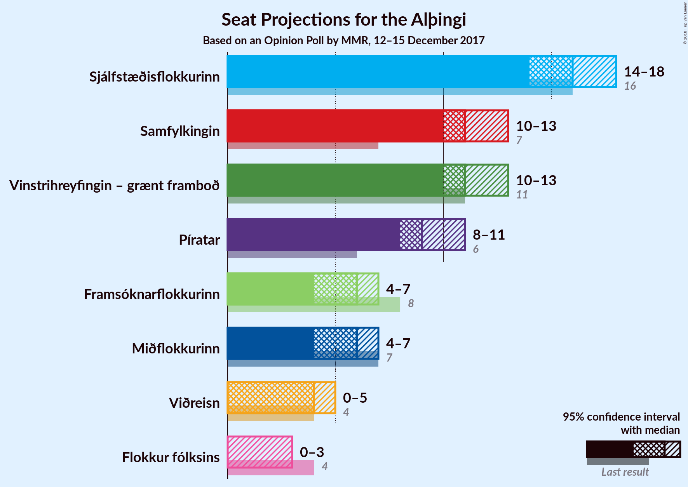

# Opinion Poll by MMR, 12–15 December 2017

<a href="#voting-intentions">Voting Intentions</a> | <a href="#seats">Seats</a> | <a href="#coalitions">Coalitions</a> | <a href="#technical-information">Technical Information</a>

## Voting Intentions

### Confidence Intervals

| Party | Last Result | Poll Result | 80% Confidence Interval | 90% Confidence Interval | 95% Confidence Interval | 99% Confidence Interval |
|:-----:|:-----------:|:-----------:|:-----------------------:|:-----------------------:|:-----------------------:|:-----------------------:|
| Sjálfstæðisflokkurinn | 25.2% | 23.2% | N/A |N/A |N/A |N/A |
| Samfylkingin | 12.1% | 16.8% | N/A |N/A |N/A |N/A |
| Vinstrihreyfingin – grænt framboð | 16.9% | 16.7% | N/A |N/A |N/A |N/A |
| Píratar | 9.2% | 14.1% | N/A |N/A |N/A |N/A |
| Miðflokkurinn | 10.9% | 8.7% | N/A |N/A |N/A |N/A |
| Framsóknarflokkurinn | 10.7% | 8.6% | N/A |N/A |N/A |N/A |
| Viðreisn | 6.7% | 5.7% | N/A |N/A |N/A |N/A |
| Flokkur fólksins | 6.9% | 3.7% | N/A |N/A |N/A |N/A |

*Note:* The poll result column reflects the actual value used in the calculations. Published results may vary slightly, and in addition be rounded to fewer digits.

## Seats

### Confidence Intervals

| Party | Last Result | Median | 80% Confidence Interval | 90% Confidence Interval | 95% Confidence Interval | 99% Confidence Interval |
|:-----:|:-----------:|:------:|:-----------------------:|:-----------------------:|:-----------------------:|:-----------------------:|
| <a href="#sjálfstæðisflokkurinn">Sjálfstæðisflokkurinn</a> | 16 | N/A | N/A |N/A |N/A |N/A |
| <a href="#samfylkingin">Samfylkingin</a> | 7 | N/A | N/A |N/A |N/A |N/A |
| <a href="#vinstrihreyfingin-–-grænt-framboð">Vinstrihreyfingin – grænt framboð</a> | 11 | N/A | N/A |N/A |N/A |N/A |
| <a href="#píratar">Píratar</a> | 6 | N/A | N/A |N/A |N/A |N/A |
| <a href="#miðflokkurinn">Miðflokkurinn</a> | 7 | N/A | N/A |N/A |N/A |N/A |
| <a href="#framsóknarflokkurinn">Framsóknarflokkurinn</a> | 8 | N/A | N/A |N/A |N/A |N/A |
| <a href="#viðreisn">Viðreisn</a> | 4 | N/A | N/A |N/A |N/A |N/A |
| <a href="#flokkur-fólksins">Flokkur fólksins</a> | 4 | N/A | N/A |N/A |N/A |N/A |

## Coalitions

## Technical Information

### Opinion Poll

+ **Polling firm:** MMR
+ **Commissioner(s):** —
+ **Fieldwork period:** 12–15 December 2017

### Calculations

+ **Sample size:** 923
+ **Simulations done:** 0
+ **Error estimate:** 100.00%

