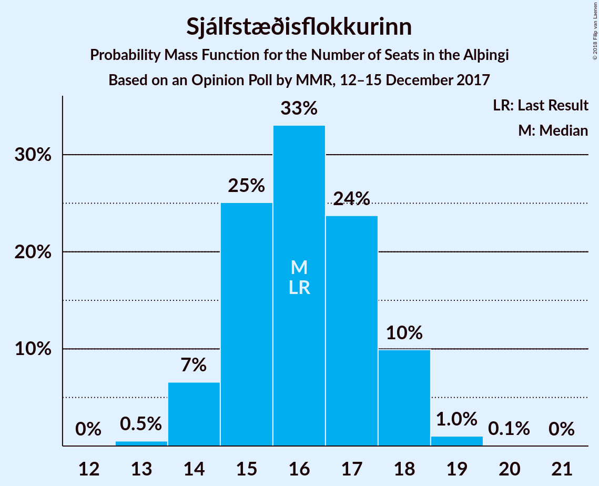
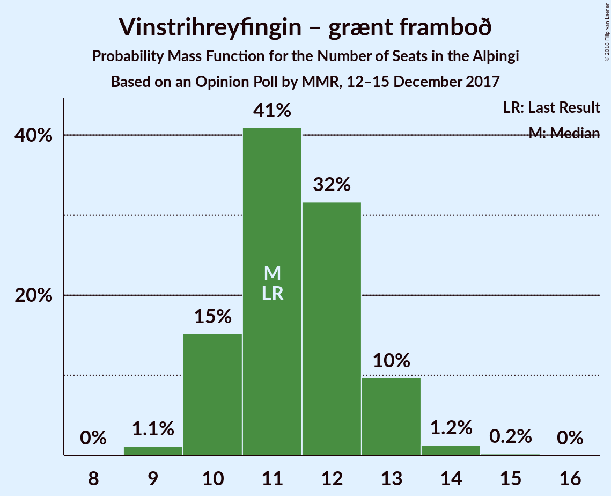
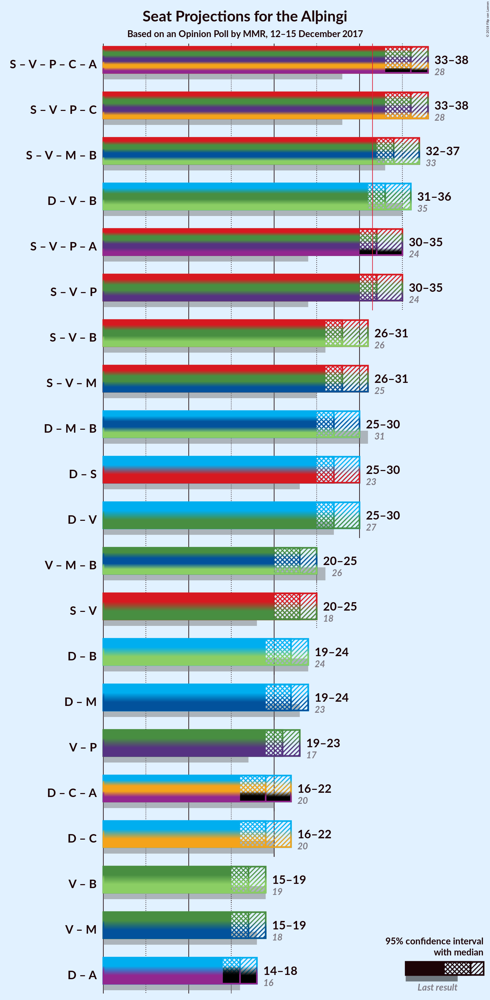

# Opinion Poll by MMR, 12–15 December 2017

<a href="#voting-intentions">Voting Intentions</a> | <a href="#seats">Seats</a> | <a href="#coalitions">Coalitions</a> | <a href="#technical-information">Technical Information</a>

## Voting Intentions

### Confidence Intervals

| Party | Last Result | Poll Result | 80% Confidence Interval | 90% Confidence Interval | 95% Confidence Interval | 99% Confidence Interval |
|:-----:|:-----------:|:-----------:|:-----------------------:|:-----------------------:|:-----------------------:|:-----------------------:|
| Sjálfstæðisflokkurinn | 25.2% | 23.2% | 21.5–25.0% |21.0–25.6% |20.6–26.0% |19.8–26.9% |
| Samfylkingin | 12.1% | 16.8% | 15.3–18.5% |14.9–18.9% |14.5–19.3% |13.8–20.2% |
| Vinstrihreyfingin – grænt framboð | 16.9% | 16.7% | 15.2–18.4% |14.8–18.8% |14.4–19.2% |13.7–20.0% |
| Píratar | 9.2% | 14.1% | 12.7–15.7% |12.3–16.1% |12.0–16.5% |11.4–17.3% |
| Miðflokkurinn | 10.9% | 8.7% | 7.6–10.0% |7.3–10.3% |7.0–10.7% |6.5–11.3% |
| Framsóknarflokkurinn | 10.7% | 8.6% | 7.5–9.9% |7.2–10.2% |6.9–10.5% |6.4–11.2% |
| Viðreisn | 6.7% | 5.7% | 4.9–6.8% |4.6–7.2% |4.4–7.4% |4.0–8.0% |
| Flokkur fólksins | 6.9% | 3.7% | 3.0–4.6% |2.8–4.9% |2.7–5.1% |2.3–5.6% |

*Note:* The poll result column reflects the actual value used in the calculations. Published results may vary slightly, and in addition be rounded to fewer digits.

## Seats

### Confidence Intervals

| Party | Last Result | Median | 80% Confidence Interval | 90% Confidence Interval | 95% Confidence Interval | 99% Confidence Interval |
|:-----:|:-----------:|:------:|:-----------------------:|:-----------------------:|:-----------------------:|:-----------------------:|
| <a href="#sjálfstæðisflokkurinn">Sjálfstæðisflokkurinn</a> | 16 | 16 | 15–18 |14–18 |14–18 |13–19 |
| <a href="#samfylkingin">Samfylkingin</a> | 7 | 11 | 10–12 |10–13 |10–13 |9–14 |
| <a href="#vinstrihreyfingin-–-grænt-framboð">Vinstrihreyfingin – grænt framboð</a> | 11 | 11 | 10–13 |10–13 |10–13 |9–14 |
| <a href="#píratar">Píratar</a> | 6 | 9 | 8–11 |8–11 |8–11 |7–12 |
| <a href="#miðflokkurinn">Miðflokkurinn</a> | 7 | 6 | 5–7 |5–7 |4–7 |4–8 |
| <a href="#framsóknarflokkurinn">Framsóknarflokkurinn</a> | 8 | 6 | 5–7 |5–7 |4–7 |4–8 |
| <a href="#viðreisn">Viðreisn</a> | 4 | 4 | 0–4 |0–5 |0–5 |0–5 |
| <a href="#flokkur-fólksins">Flokkur fólksins</a> | 4 | 0 | 0 |0 |0–3 |0–3 |

### Sjálfstæðisflokkurinn

*For a full overview of the results for this party, see the [Sjálfstæðisflokkurinn](party-sjálfstæðisflokkurinn.html) page.*

| Number of Seats | Probability | Accumulated | Special Marks |
|:---------------:|:-----------:|:-----------:|:-------------:|
| 13 | 0.5% | 100% |  |
| 14 | 7% | 99.5% |  |
| 15 | 25% | 93% |  |
| 16 | 33% | 68% | Last Result, Median |
| 17 | 24% | 35% |  |
| 18 | 10% | 11% |  |
| 19 | 1.0% | 1.1% |  |
| 20 | 0.1% | 0.1% |  |
| 21 | 0% | 0% |  |

### Samfylkingin

*For a full overview of the results for this party, see the [Samfylkingin](party-samfylkingin.html) page.*

| Number of Seats | Probability | Accumulated | Special Marks |
|:---------------:|:-----------:|:-----------:|:-------------:|
| 7 | 0% | 100% | Last Result |
| 8 | 0% | 100% |  |
| 9 | 1.2% | 100% |  |
| 10 | 13% | 98.8% |  |
| 11 | 37% | 86% | Median |
| 12 | 38% | 48% |  |
| 13 | 9% | 10% |  |
| 14 | 1.1% | 1.3% |  |
| 15 | 0.1% | 0.1% |  |
| 16 | 0% | 0% |  |

### Vinstrihreyfingin – grænt framboð

*For a full overview of the results for this party, see the [Vinstrihreyfingin – grænt framboð](party-vinstrihreyfingin–græntframboð.html) page.*

| Number of Seats | Probability | Accumulated | Special Marks |
|:---------------:|:-----------:|:-----------:|:-------------:|
| 9 | 1.1% | 100% |  |
| 10 | 15% | 98.8% |  |
| 11 | 41% | 84% | Last Result, Median |
| 12 | 32% | 43% |  |
| 13 | 10% | 11% |  |
| 14 | 1.2% | 1.4% |  |
| 15 | 0.2% | 0.2% |  |
| 16 | 0% | 0% |  |

### Píratar

*For a full overview of the results for this party, see the [Píratar](party-píratar.html) page.*

| Number of Seats | Probability | Accumulated | Special Marks |
|:---------------:|:-----------:|:-----------:|:-------------:|
| 6 | 0% | 100% | Last Result |
| 7 | 0.7% | 100% |  |
| 8 | 12% | 99.3% |  |
| 9 | 39% | 88% | Median |
| 10 | 36% | 49% |  |
| 11 | 11% | 13% |  |
| 12 | 1.2% | 1.3% |  |
| 13 | 0.1% | 0.1% |  |
| 14 | 0% | 0% |  |

### Miðflokkurinn

*For a full overview of the results for this party, see the [Miðflokkurinn](party-miðflokkurinn.html) page.*

| Number of Seats | Probability | Accumulated | Special Marks |
|:---------------:|:-----------:|:-----------:|:-------------:|
| 4 | 3% | 100% |  |
| 5 | 37% | 97% |  |
| 6 | 49% | 61% | Median |
| 7 | 11% | 12% | Last Result |
| 8 | 0.7% | 0.8% |  |
| 9 | 0.1% | 0.1% |  |
| 10 | 0% | 0% |  |

### Framsóknarflokkurinn

*For a full overview of the results for this party, see the [Framsóknarflokkurinn](party-framsóknarflokkurinn.html) page.*

| Number of Seats | Probability | Accumulated | Special Marks |
|:---------------:|:-----------:|:-----------:|:-------------:|
| 4 | 4% | 100% |  |
| 5 | 41% | 96% |  |
| 6 | 44% | 55% | Median |
| 7 | 10% | 11% |  |
| 8 | 0.5% | 0.5% | Last Result |
| 9 | 0% | 0% |  |

### Viðreisn

*For a full overview of the results for this party, see the [Viðreisn](party-viðreisn.html) page.*

| Number of Seats | Probability | Accumulated | Special Marks |
|:---------------:|:-----------:|:-----------:|:-------------:|
| 0 | 13% | 100% |  |
| 1 | 0.9% | 87% |  |
| 2 | 0% | 86% |  |
| 3 | 32% | 86% |  |
| 4 | 49% | 54% | Last Result, Median |
| 5 | 6% | 6% |  |
| 6 | 0.1% | 0.1% |  |
| 7 | 0% | 0% |  |

### Flokkur fólksins

*For a full overview of the results for this party, see the [Flokkur fólksins](party-flokkurfólksins.html) page.*

| Number of Seats | Probability | Accumulated | Special Marks |
|:---------------:|:-----------:|:-----------:|:-------------:|
| 0 | 97% | 100% | Median |
| 1 | 0% | 3% |  |
| 2 | 0% | 3% |  |
| 3 | 3% | 3% |  |
| 4 | 0.2% | 0.2% | Last Result |
| 5 | 0% | 0% |  |

## Coalitions

### Confidence Intervals

| Coalition | Last Result | Median | Majority? | 80% Confidence Interval | 90% Confidence Interval | 95% Confidence Interval | 99% Confidence Interval |
|:---------:|:-----------:|:------:|:---------:|:-----------------------:|:-----------------------:|:-----------------------:|:-----------------------:|
| Samfylkingin – Vinstrihreyfingin – grænt framboð – Píratar – Viðreisn | 28 | 36 | 99.7% | 34–37 | 33–38 | 33–38 | 32–39 |
| Samfylkingin – Vinstrihreyfingin – grænt framboð – Miðflokkurinn – Framsóknarflokkurinn | 33 | 34 | 98% | 32–36 | 32–37 | 32–37 | 31–38 |
| Sjálfstæðisflokkurinn – Vinstrihreyfingin – grænt framboð – Framsóknarflokkurinn | 35 | 33 | 87% | 31–35 | 31–35 | 31–36 | 30–37 |
| Samfylkingin – Vinstrihreyfingin – grænt framboð – Píratar | 24 | 32 | 72% | 31–34 | 30–35 | 30–35 | 29–36 |
| Samfylkingin – Vinstrihreyfingin – grænt framboð – Framsóknarflokkurinn | 26 | 28 | 2% | 27–30 | 26–31 | 26–31 | 25–32 |
| Samfylkingin – Vinstrihreyfingin – grænt framboð – Miðflokkurinn | 25 | 28 | 2% | 27–30 | 26–31 | 26–31 | 25–32 |
| Sjálfstæðisflokkurinn – Miðflokkurinn – Framsóknarflokkurinn | 31 | 27 | 0.2% | 26–29 | 25–30 | 25–30 | 24–31 |
| Sjálfstæðisflokkurinn – Samfylkingin | 23 | 27 | 0.2% | 26–29 | 25–30 | 25–30 | 24–31 |
| Sjálfstæðisflokkurinn – Vinstrihreyfingin – grænt framboð | 27 | 27 | 0.2% | 26–29 | 25–30 | 25–30 | 24–31 |
| Vinstrihreyfingin – grænt framboð – Miðflokkurinn – Framsóknarflokkurinn | 26 | 23 | 0% | 21–24 | 21–25 | 20–25 | 20–26 |
| Samfylkingin – Vinstrihreyfingin – grænt framboð | 18 | 23 | 0% | 21–24 | 21–25 | 20–25 | 20–26 |
| Sjálfstæðisflokkurinn – Framsóknarflokkurinn | 24 | 22 | 0% | 20–23 | 20–24 | 19–24 | 19–25 |
| Sjálfstæðisflokkurinn – Miðflokkurinn | 23 | 22 | 0% | 20–23 | 20–24 | 19–24 | 19–25 |
| Vinstrihreyfingin – grænt framboð – Píratar | 17 | 21 | 0% | 19–22 | 19–23 | 19–23 | 18–24 |
| Sjálfstæðisflokkurinn – Viðreisn | 20 | 19 | 0% | 17–21 | 16–21 | 16–22 | 15–22 |
| Vinstrihreyfingin – grænt framboð – Framsóknarflokkurinn | 19 | 17 | 0% | 16–18 | 15–19 | 15–19 | 14–20 |
| Vinstrihreyfingin – grænt framboð – Miðflokkurinn | 18 | 17 | 0% | 16–19 | 15–19 | 15–19 | 14–20 |

### Samfylkingin – Vinstrihreyfingin – grænt framboð – Píratar – Viðreisn

| Number of Seats | Probability | Accumulated | Special Marks |
|:---------------:|:-----------:|:-----------:|:-------------:|
| 28 | 0% | 100% | Last Result |
| 29 | 0% | 100% |  |
| 30 | 0% | 100% |  |
| 31 | 0.3% | 99.9% |  |
| 32 | 1.5% | 99.7% | Majority |
| 33 | 6% | 98% |  |
| 34 | 15% | 92% |  |
| 35 | 26% | 78% | Median |
| 36 | 29% | 52% |  |
| 37 | 17% | 23% |  |
| 38 | 5% | 6% |  |
| 39 | 0.9% | 1.0% |  |
| 40 | 0.1% | 0.1% |  |
| 41 | 0% | 0% |  |

### Samfylkingin – Vinstrihreyfingin – grænt framboð – Miðflokkurinn – Framsóknarflokkurinn

| Number of Seats | Probability | Accumulated | Special Marks |
|:---------------:|:-----------:|:-----------:|:-------------:|
| 30 | 0.3% | 100% |  |
| 31 | 2% | 99.6% |  |
| 32 | 9% | 98% | Majority |
| 33 | 22% | 89% | Last Result |
| 34 | 30% | 68% | Median |
| 35 | 22% | 38% |  |
| 36 | 10% | 16% |  |
| 37 | 4% | 6% |  |
| 38 | 2% | 2% |  |
| 39 | 0.3% | 0.3% |  |
| 40 | 0% | 0% |  |

### Sjálfstæðisflokkurinn – Vinstrihreyfingin – grænt framboð – Framsóknarflokkurinn

| Number of Seats | Probability | Accumulated | Special Marks |
|:---------------:|:-----------:|:-----------:|:-------------:|
| 29 | 0.3% | 100% |  |
| 30 | 2% | 99.7% |  |
| 31 | 10% | 98% |  |
| 32 | 19% | 87% | Majority |
| 33 | 35% | 69% | Median |
| 34 | 19% | 34% |  |
| 35 | 11% | 15% | Last Result |
| 36 | 3% | 4% |  |
| 37 | 1.0% | 1.1% |  |
| 38 | 0.1% | 0.1% |  |
| 39 | 0% | 0% |  |

### Samfylkingin – Vinstrihreyfingin – grænt framboð – Píratar

| Number of Seats | Probability | Accumulated | Special Marks |
|:---------------:|:-----------:|:-----------:|:-------------:|
| 24 | 0% | 100% | Last Result |
| 25 | 0% | 100% |  |
| 26 | 0% | 100% |  |
| 27 | 0% | 100% |  |
| 28 | 0.2% | 100% |  |
| 29 | 1.4% | 99.8% |  |
| 30 | 8% | 98% |  |
| 31 | 19% | 90% | Median |
| 32 | 29% | 72% | Majority |
| 33 | 24% | 43% |  |
| 34 | 12% | 19% |  |
| 35 | 5% | 7% |  |
| 36 | 1.4% | 2% |  |
| 37 | 0.3% | 0.4% |  |
| 38 | 0% | 0% |  |

### Samfylkingin – Vinstrihreyfingin – grænt framboð – Framsóknarflokkurinn

| Number of Seats | Probability | Accumulated | Special Marks |
|:---------------:|:-----------:|:-----------:|:-------------:|
| 24 | 0.1% | 100% |  |
| 25 | 1.1% | 99.9% |  |
| 26 | 6% | 98.8% | Last Result |
| 27 | 17% | 93% |  |
| 28 | 29% | 76% | Median |
| 29 | 25% | 47% |  |
| 30 | 15% | 22% |  |
| 31 | 5% | 7% |  |
| 32 | 1.3% | 2% | Majority |
| 33 | 0.3% | 0.3% |  |
| 34 | 0% | 0% |  |

### Samfylkingin – Vinstrihreyfingin – grænt framboð – Miðflokkurinn

| Number of Seats | Probability | Accumulated | Special Marks |
|:---------------:|:-----------:|:-----------:|:-------------:|
| 24 | 0.1% | 100% |  |
| 25 | 0.8% | 99.9% | Last Result |
| 26 | 5% | 99.1% |  |
| 27 | 17% | 94% |  |
| 28 | 28% | 77% | Median |
| 29 | 27% | 49% |  |
| 30 | 14% | 22% |  |
| 31 | 6% | 8% |  |
| 32 | 2% | 2% | Majority |
| 33 | 0.3% | 0.3% |  |
| 34 | 0% | 0% |  |

### Sjálfstæðisflokkurinn – Miðflokkurinn – Framsóknarflokkurinn

| Number of Seats | Probability | Accumulated | Special Marks |
|:---------------:|:-----------:|:-----------:|:-------------:|
| 23 | 0.1% | 100% |  |
| 24 | 1.1% | 99.9% |  |
| 25 | 6% | 98.8% |  |
| 26 | 18% | 93% |  |
| 27 | 29% | 75% |  |
| 28 | 26% | 46% | Median |
| 29 | 14% | 20% |  |
| 30 | 5% | 6% |  |
| 31 | 1.1% | 1.2% | Last Result |
| 32 | 0.1% | 0.2% | Majority |
| 33 | 0% | 0% |  |

### Sjálfstæðisflokkurinn – Samfylkingin

| Number of Seats | Probability | Accumulated | Special Marks |
|:---------------:|:-----------:|:-----------:|:-------------:|
| 23 | 0.1% | 100% | Last Result |
| 24 | 0.8% | 99.9% |  |
| 25 | 5% | 99.1% |  |
| 26 | 15% | 94% |  |
| 27 | 30% | 79% | Median |
| 28 | 26% | 49% |  |
| 29 | 16% | 22% |  |
| 30 | 5% | 7% |  |
| 31 | 1.2% | 1.3% |  |
| 32 | 0.2% | 0.2% | Majority |
| 33 | 0% | 0% |  |

### Sjálfstæðisflokkurinn – Vinstrihreyfingin – grænt framboð

| Number of Seats | Probability | Accumulated | Special Marks |
|:---------------:|:-----------:|:-----------:|:-------------:|
| 23 | 0.1% | 100% |  |
| 24 | 0.8% | 99.9% |  |
| 25 | 6% | 99.1% |  |
| 26 | 17% | 94% |  |
| 27 | 29% | 77% | Last Result, Median |
| 28 | 27% | 48% |  |
| 29 | 15% | 21% |  |
| 30 | 5% | 6% |  |
| 31 | 1.0% | 1.2% |  |
| 32 | 0.2% | 0.2% | Majority |
| 33 | 0% | 0% |  |

### Vinstrihreyfingin – grænt framboð – Miðflokkurinn – Framsóknarflokkurinn

| Number of Seats | Probability | Accumulated | Special Marks |
|:---------------:|:-----------:|:-----------:|:-------------:|
| 19 | 0.3% | 100% |  |
| 20 | 4% | 99.7% |  |
| 21 | 12% | 96% |  |
| 22 | 29% | 84% |  |
| 23 | 30% | 55% | Median |
| 24 | 16% | 25% |  |
| 25 | 7% | 9% |  |
| 26 | 2% | 2% | Last Result |
| 27 | 0.2% | 0.2% |  |
| 28 | 0% | 0% |  |

### Samfylkingin – Vinstrihreyfingin – grænt framboð

| Number of Seats | Probability | Accumulated | Special Marks |
|:---------------:|:-----------:|:-----------:|:-------------:|
| 18 | 0% | 100% | Last Result |
| 19 | 0.2% | 100% |  |
| 20 | 3% | 99.8% |  |
| 21 | 12% | 97% |  |
| 22 | 25% | 86% | Median |
| 23 | 32% | 61% |  |
| 24 | 19% | 28% |  |
| 25 | 7% | 9% |  |
| 26 | 2% | 2% |  |
| 27 | 0.3% | 0.3% |  |
| 28 | 0% | 0% |  |

### Sjálfstæðisflokkurinn – Framsóknarflokkurinn

| Number of Seats | Probability | Accumulated | Special Marks |
|:---------------:|:-----------:|:-----------:|:-------------:|
| 18 | 0.3% | 100% |  |
| 19 | 3% | 99.7% |  |
| 20 | 14% | 97% |  |
| 21 | 26% | 82% |  |
| 22 | 31% | 57% | Median |
| 23 | 18% | 25% |  |
| 24 | 7% | 8% | Last Result |
| 25 | 1.1% | 1.2% |  |
| 26 | 0.1% | 0.1% |  |
| 27 | 0% | 0% |  |

### Sjálfstæðisflokkurinn – Miðflokkurinn

| Number of Seats | Probability | Accumulated | Special Marks |
|:---------------:|:-----------:|:-----------:|:-------------:|
| 18 | 0.3% | 100% |  |
| 19 | 3% | 99.7% |  |
| 20 | 13% | 97% |  |
| 21 | 26% | 84% |  |
| 22 | 30% | 58% | Median |
| 23 | 20% | 29% | Last Result |
| 24 | 7% | 8% |  |
| 25 | 1.4% | 2% |  |
| 26 | 0.2% | 0.2% |  |
| 27 | 0% | 0% |  |

### Vinstrihreyfingin – grænt framboð – Píratar

| Number of Seats | Probability | Accumulated | Special Marks |
|:---------------:|:-----------:|:-----------:|:-------------:|
| 17 | 0.1% | 100% | Last Result |
| 18 | 2% | 99.9% |  |
| 19 | 11% | 98% |  |
| 20 | 24% | 87% | Median |
| 21 | 35% | 63% |  |
| 22 | 18% | 28% |  |
| 23 | 7% | 9% |  |
| 24 | 2% | 2% |  |
| 25 | 0.4% | 0.4% |  |
| 26 | 0% | 0% |  |

### Sjálfstæðisflokkurinn – Viðreisn

| Number of Seats | Probability | Accumulated | Special Marks |
|:---------------:|:-----------:|:-----------:|:-------------:|
| 14 | 0.2% | 100% |  |
| 15 | 1.2% | 99.8% |  |
| 16 | 4% | 98.6% |  |
| 17 | 7% | 95% |  |
| 18 | 13% | 87% |  |
| 19 | 27% | 74% |  |
| 20 | 27% | 48% | Last Result, Median |
| 21 | 17% | 20% |  |
| 22 | 3% | 3% |  |
| 23 | 0.3% | 0.3% |  |
| 24 | 0% | 0% |  |

### Vinstrihreyfingin – grænt framboð – Framsóknarflokkurinn

| Number of Seats | Probability | Accumulated | Special Marks |
|:---------------:|:-----------:|:-----------:|:-------------:|
| 14 | 0.6% | 100% |  |
| 15 | 7% | 99.3% |  |
| 16 | 26% | 92% |  |
| 17 | 34% | 66% | Median |
| 18 | 23% | 32% |  |
| 19 | 8% | 10% | Last Result |
| 20 | 1.3% | 2% |  |
| 21 | 0.2% | 0.2% |  |
| 22 | 0% | 0% |  |

### Vinstrihreyfingin – grænt framboð – Miðflokkurinn

| Number of Seats | Probability | Accumulated | Special Marks |
|:---------------:|:-----------:|:-----------:|:-------------:|
| 14 | 0.8% | 100% |  |
| 15 | 6% | 99.2% |  |
| 16 | 25% | 93% |  |
| 17 | 33% | 68% | Median |
| 18 | 25% | 35% | Last Result |
| 19 | 8% | 10% |  |
| 20 | 2% | 2% |  |
| 21 | 0.3% | 0.3% |  |
| 22 | 0% | 0% |  |

## Technical Information

### Opinion Poll

+ **Polling firm:** MMR
+ **Commissioner(s):** —
+ **Fieldwork period:** 12–15 December 2017

### Calculations

+ **Sample size:** 923
+ **Simulations done:** 2,097,152
+ **Error estimate:** 1.31%

