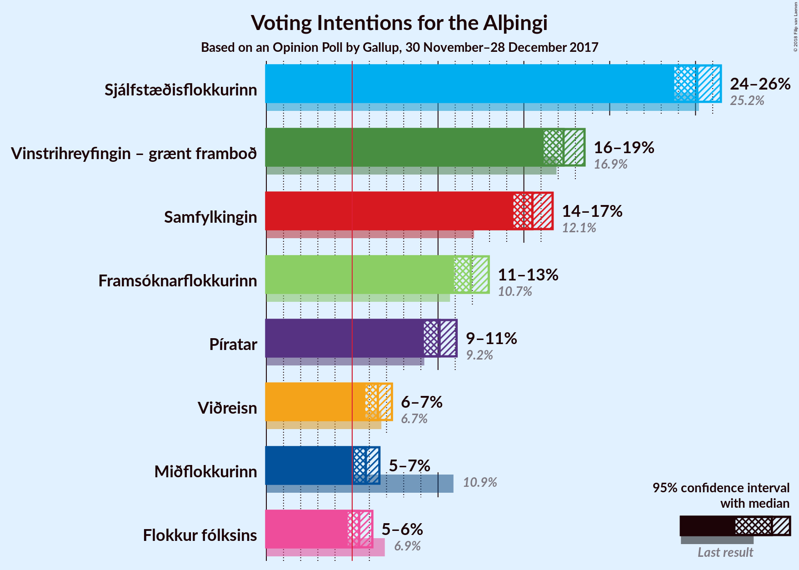
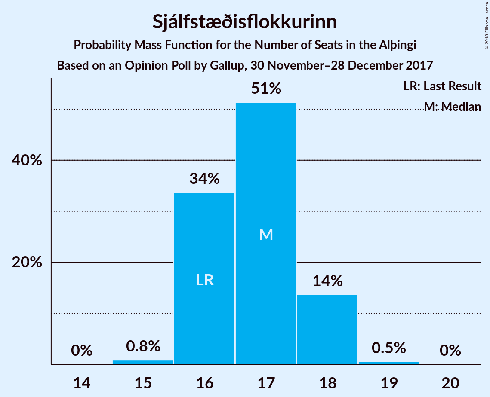
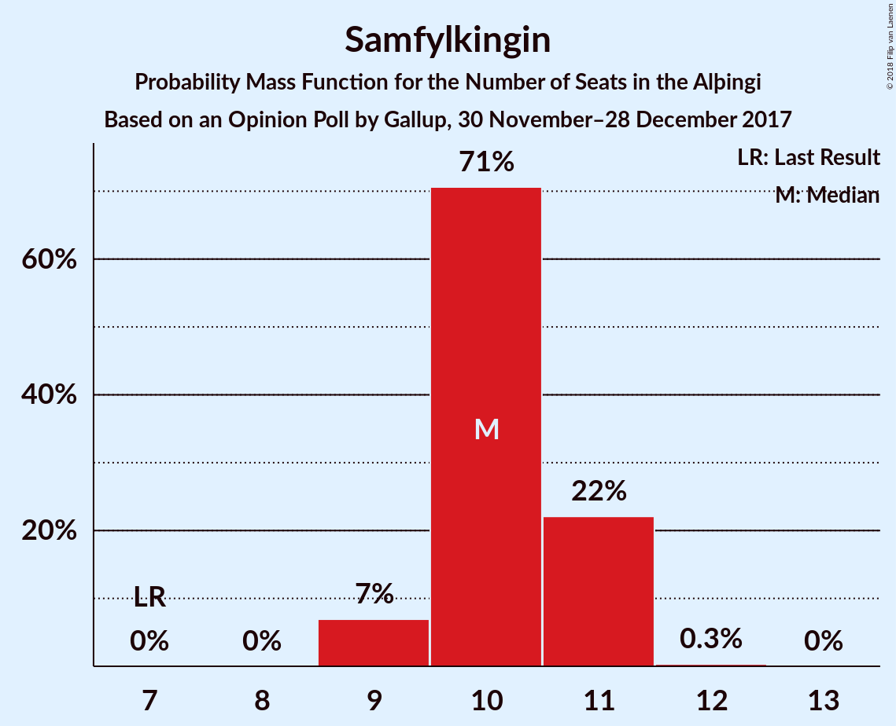
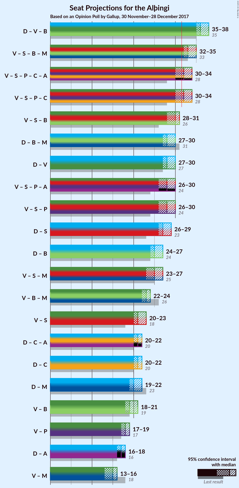

# Opinion Poll by Gallup, 30 November–28 December 2017

<a href="#voting-intentions">Voting Intentions</a> | <a href="#seats">Seats</a> | <a href="#coalitions">Coalitions</a> | <a href="#technical-information">Technical Information</a>

## Voting Intentions

### Confidence Intervals

| Party | Last Result | Poll Result | 80% Confidence Interval | 90% Confidence Interval | 95% Confidence Interval | 99% Confidence Interval |
|:-----:|:-----------:|:-----------:|:-----------------------:|:-----------------------:|:-----------------------:|:-----------------------:|
| Sjálfstæðisflokkurinn | 25.2% | 25.1% | 24.2–26.0% |24.0–26.3% |23.8–26.5% |23.4–26.9% |
| Vinstrihreyfingin – grænt framboð | 16.9% | 17.3% | 16.6–18.1% |16.3–18.3% |16.2–18.5% |15.8–18.9% |
| Samfylkingin | 12.1% | 15.5% | 14.8–16.3% |14.6–16.5% |14.4–16.7% |14.1–17.0% |
| Framsóknarflokkurinn | 10.7% | 11.9% | 11.3–12.6% |11.1–12.8% |10.9–13.0% |10.6–13.3% |
| Píratar | 9.2% | 10.1% | 9.5–10.7% |9.3–10.9% |9.2–11.1% |8.9–11.4% |
| Viðreisn | 6.7% | 6.5% | 6.0–7.0% |5.9–7.2% |5.8–7.3% |5.5–7.6% |
| Miðflokkurinn | 10.9% | 5.8% | 5.3–6.3% |5.2–6.4% |5.1–6.6% |4.9–6.8% |
| Flokkur fólksins | 6.9% | 5.4% | 5.0–5.9% |4.8–6.1% |4.7–6.2% |4.5–6.4% |

*Note:* The poll result column reflects the actual value used in the calculations. Published results may vary slightly, and in addition be rounded to fewer digits.

## Seats

### Confidence Intervals

| Party | Last Result | Median | 80% Confidence Interval | 90% Confidence Interval | 95% Confidence Interval | 99% Confidence Interval |
|:-----:|:-----------:|:------:|:-----------------------:|:-----------------------:|:-----------------------:|:-----------------------:|
| <a href="#sjálfstæðisflokkurinn">Sjálfstæðisflokkurinn</a> | 16 | 17 | 16–18 |16–18 |16–18 |15–19 |
| <a href="#vinstrihreyfingin-–-grænt-framboð">Vinstrihreyfingin – grænt framboð</a> | 11 | 11 | 11–12 |11–12 |10–12 |10–13 |
| <a href="#samfylkingin">Samfylkingin</a> | 7 | 10 | 10–11 |9–11 |9–11 |9–12 |
| <a href="#framsóknarflokkurinn">Framsóknarflokkurinn</a> | 8 | 8 | 8–9 |8–9 |8–9 |7–10 |
| <a href="#píratar">Píratar</a> | 6 | 6 | 6–7 |6–7 |6–7 |6–7 |
| <a href="#viðreisn">Viðreisn</a> | 4 | 4 | 4 |3–4 |3–5 |3–5 |
| <a href="#miðflokkurinn">Miðflokkurinn</a> | 7 | 3 | 3–4 |3–4 |3–4 |1–4 |
| <a href="#flokkur-fólksins">Flokkur fólksins</a> | 4 | 3 | 0–3 |0–4 |0–4 |0–4 |

### Sjálfstæðisflokkurinn

*For a full overview of the results for this party, see the [Sjálfstæðisflokkurinn](party-sjálfstæðisflokkurinn.html) page.*

| Number of Seats | Probability | Accumulated | Special Marks |
|:---------------:|:-----------:|:-----------:|:-------------:|
| 15 | 0.8% | 100% |  |
| 16 | 33% | 99.2% | Last Result |
| 17 | 51% | 66% | Median |
| 18 | 14% | 15% |  |
| 19 | 0.7% | 0.7% |  |
| 20 | 0% | 0% |  |

### Vinstrihreyfingin – grænt framboð

*For a full overview of the results for this party, see the [Vinstrihreyfingin – grænt framboð](party-vinstrihreyfingin–græntframboð.html) page.*

| Number of Seats | Probability | Accumulated | Special Marks |
|:---------------:|:-----------:|:-----------:|:-------------:|
| 10 | 3% | 100% |  |
| 11 | 56% | 97% | Last Result, Median |
| 12 | 39% | 41% |  |
| 13 | 2% | 2% |  |
| 14 | 0% | 0% |  |

### Samfylkingin

*For a full overview of the results for this party, see the [Samfylkingin](party-samfylkingin.html) page.*

| Number of Seats | Probability | Accumulated | Special Marks |
|:---------------:|:-----------:|:-----------:|:-------------:|
| 7 | 0% | 100% | Last Result |
| 8 | 0% | 100% |  |
| 9 | 7% | 100% |  |
| 10 | 69% | 93% | Median |
| 11 | 23% | 24% |  |
| 12 | 0.5% | 0.5% |  |
| 13 | 0% | 0% |  |

### Framsóknarflokkurinn

*For a full overview of the results for this party, see the [Framsóknarflokkurinn](party-framsóknarflokkurinn.html) page.*

| Number of Seats | Probability | Accumulated | Special Marks |
|:---------------:|:-----------:|:-----------:|:-------------:|
| 6 | 0.1% | 100% |  |
| 7 | 0.8% | 99.9% |  |
| 8 | 87% | 99.1% | Last Result, Median |
| 9 | 11% | 12% |  |
| 10 | 2% | 2% |  |
| 11 | 0% | 0% |  |

### Píratar

*For a full overview of the results for this party, see the [Píratar](party-píratar.html) page.*

| Number of Seats | Probability | Accumulated | Special Marks |
|:---------------:|:-----------:|:-----------:|:-------------:|
| 5 | 0.3% | 100% |  |
| 6 | 62% | 99.7% | Last Result, Median |
| 7 | 37% | 38% |  |
| 8 | 0.4% | 0.4% |  |
| 9 | 0% | 0% |  |

### Viðreisn

*For a full overview of the results for this party, see the [Viðreisn](party-viðreisn.html) page.*

| Number of Seats | Probability | Accumulated | Special Marks |
|:---------------:|:-----------:|:-----------:|:-------------:|
| 3 | 5% | 100% |  |
| 4 | 91% | 95% | Last Result, Median |
| 5 | 4% | 4% |  |
| 6 | 0% | 0% |  |

### Miðflokkurinn

*For a full overview of the results for this party, see the [Miðflokkurinn](party-miðflokkurinn.html) page.*

| Number of Seats | Probability | Accumulated | Special Marks |
|:---------------:|:-----------:|:-----------:|:-------------:|
| 1 | 1.4% | 100% |  |
| 2 | 0% | 98.6% |  |
| 3 | 53% | 98.6% | Median |
| 4 | 45% | 45% |  |
| 5 | 0% | 0% |  |
| 6 | 0% | 0% |  |
| 7 | 0% | 0% | Last Result |

### Flokkur fólksins

*For a full overview of the results for this party, see the [Flokkur fólksins](party-flokkurfólksins.html) page.*

| Number of Seats | Probability | Accumulated | Special Marks |
|:---------------:|:-----------:|:-----------:|:-------------:|
| 0 | 13% | 100% |  |
| 1 | 0% | 87% |  |
| 2 | 0% | 87% |  |
| 3 | 78% | 87% | Median |
| 4 | 9% | 9% | Last Result |
| 5 | 0% | 0% |  |

## Coalitions

### Confidence Intervals

| Coalition | Last Result | Median | Majority? | 80% Confidence Interval | 90% Confidence Interval | 95% Confidence Interval | 99% Confidence Interval |
|:---------:|:-----------:|:------:|:---------:|:-----------------------:|:-----------------------:|:-----------------------:|:-----------------------:|
| Sjálfstæðisflokkurinn – Vinstrihreyfingin – grænt framboð – Framsóknarflokkurinn | 35 | 36 | 100% | 35–37 | 35–38 | 35–38 | 35–39 |
| Vinstrihreyfingin – grænt framboð – Samfylkingin – Framsóknarflokkurinn – Miðflokkurinn | 33 | 33 | 97% | 32–34 | 32–35 | 31–35 | 31–36 |
| Vinstrihreyfingin – grænt framboð – Samfylkingin – Píratar – Viðreisn | 28 | 32 | 68% | 31–33 | 31–34 | 30–34 | 30–35 |
| Vinstrihreyfingin – grænt framboð – Samfylkingin – Framsóknarflokkurinn | 26 | 30 | 3% | 29–31 | 28–31 | 28–32 | 28–32 |
| Sjálfstæðisflokkurinn – Framsóknarflokkurinn – Miðflokkurinn | 31 | 28 | 0% | 27–30 | 27–30 | 27–30 | 26–31 |
| Sjálfstæðisflokkurinn – Vinstrihreyfingin – grænt framboð | 27 | 28 | 0% | 27–29 | 27–30 | 27–30 | 26–31 |
| Vinstrihreyfingin – grænt framboð – Samfylkingin – Píratar | 24 | 28 | 0% | 27–29 | 27–30 | 26–30 | 26–31 |
| Sjálfstæðisflokkurinn – Samfylkingin | 23 | 27 | 0% | 26–28 | 26–28 | 26–29 | 25–29 |
| Sjálfstæðisflokkurinn – Framsóknarflokkurinn | 24 | 25 | 0% | 24–26 | 24–26 | 24–27 | 23–27 |
| Vinstrihreyfingin – grænt framboð – Samfylkingin – Miðflokkurinn | 25 | 25 | 0% | 24–26 | 24–27 | 23–27 | 23–27 |
| Vinstrihreyfingin – grænt framboð – Framsóknarflokkurinn – Miðflokkurinn | 26 | 23 | 0% | 22–24 | 22–24 | 22–24 | 21–25 |
| Vinstrihreyfingin – grænt framboð – Samfylkingin | 18 | 22 | 0% | 21–23 | 20–23 | 20–23 | 20–24 |
| Sjálfstæðisflokkurinn – Viðreisn | 20 | 21 | 0% | 20–22 | 20–22 | 20–22 | 19–23 |
| Sjálfstæðisflokkurinn – Miðflokkurinn | 23 | 20 | 0% | 19–21 | 19–22 | 19–22 | 18–22 |
| Vinstrihreyfingin – grænt framboð – Framsóknarflokkurinn | 19 | 19 | 0% | 19–20 | 19–21 | 18–21 | 18–22 |
| Vinstrihreyfingin – grænt framboð – Píratar | 17 | 18 | 0% | 17–19 | 17–19 | 17–19 | 16–20 |
| Vinstrihreyfingin – grænt framboð – Miðflokkurinn | 18 | 15 | 0% | 14–16 | 14–16 | 14–16 | 13–17 |

### Sjálfstæðisflokkurinn – Vinstrihreyfingin – grænt framboð – Framsóknarflokkurinn

| Number of Seats | Probability | Accumulated | Special Marks |
|:---------------:|:-----------:|:-----------:|:-------------:|
| 34 | 0.4% | 100% |  |
| 35 | 15% | 99.6% | Last Result |
| 36 | 46% | 84% | Median |
| 37 | 28% | 38% |  |
| 38 | 8% | 10% |  |
| 39 | 1.5% | 2% |  |
| 40 | 0.2% | 0.2% |  |
| 41 | 0% | 0% |  |

### Vinstrihreyfingin – grænt framboð – Samfylkingin – Framsóknarflokkurinn – Miðflokkurinn

| Number of Seats | Probability | Accumulated | Special Marks |
|:---------------:|:-----------:|:-----------:|:-------------:|
| 30 | 0.1% | 100% |  |
| 31 | 2% | 99.9% |  |
| 32 | 19% | 97% | Median, Majority |
| 33 | 50% | 78% | Last Result |
| 34 | 21% | 29% |  |
| 35 | 7% | 8% |  |
| 36 | 0.8% | 0.8% |  |
| 37 | 0% | 0% |  |

### Vinstrihreyfingin – grænt framboð – Samfylkingin – Píratar – Viðreisn

| Number of Seats | Probability | Accumulated | Special Marks |
|:---------------:|:-----------:|:-----------:|:-------------:|
| 28 | 0% | 100% | Last Result |
| 29 | 0.2% | 100% |  |
| 30 | 4% | 99.8% |  |
| 31 | 28% | 96% | Median |
| 32 | 45% | 68% | Majority |
| 33 | 17% | 23% |  |
| 34 | 5% | 6% |  |
| 35 | 0.8% | 0.8% |  |
| 36 | 0% | 0% |  |

### Vinstrihreyfingin – grænt framboð – Samfylkingin – Framsóknarflokkurinn

| Number of Seats | Probability | Accumulated | Special Marks |
|:---------------:|:-----------:|:-----------:|:-------------:|
| 26 | 0% | 100% | Last Result |
| 27 | 0.1% | 100% |  |
| 28 | 6% | 99.9% |  |
| 29 | 35% | 94% | Median |
| 30 | 45% | 59% |  |
| 31 | 12% | 15% |  |
| 32 | 2% | 3% | Majority |
| 33 | 0.2% | 0.2% |  |
| 34 | 0% | 0% |  |

### Sjálfstæðisflokkurinn – Framsóknarflokkurinn – Miðflokkurinn

| Number of Seats | Probability | Accumulated | Special Marks |
|:---------------:|:-----------:|:-----------:|:-------------:|
| 26 | 0.7% | 100% |  |
| 27 | 13% | 99.3% |  |
| 28 | 46% | 86% | Median |
| 29 | 30% | 40% |  |
| 30 | 10% | 10% |  |
| 31 | 0.7% | 0.7% | Last Result |
| 32 | 0% | 0% | Majority |

### Sjálfstæðisflokkurinn – Vinstrihreyfingin – grænt framboð

| Number of Seats | Probability | Accumulated | Special Marks |
|:---------------:|:-----------:|:-----------:|:-------------:|
| 26 | 0.6% | 100% |  |
| 27 | 19% | 99.4% | Last Result |
| 28 | 48% | 81% | Median |
| 29 | 26% | 33% |  |
| 30 | 6% | 7% |  |
| 31 | 0.6% | 0.6% |  |
| 32 | 0% | 0% | Majority |

### Vinstrihreyfingin – grænt framboð – Samfylkingin – Píratar

| Number of Seats | Probability | Accumulated | Special Marks |
|:---------------:|:-----------:|:-----------:|:-------------:|
| 24 | 0% | 100% | Last Result |
| 25 | 0.1% | 100% |  |
| 26 | 3% | 99.9% |  |
| 27 | 28% | 97% | Median |
| 28 | 45% | 69% |  |
| 29 | 18% | 24% |  |
| 30 | 5% | 5% |  |
| 31 | 0.7% | 0.7% |  |
| 32 | 0% | 0% | Majority |

### Sjálfstæðisflokkurinn – Samfylkingin

| Number of Seats | Probability | Accumulated | Special Marks |
|:---------------:|:-----------:|:-----------:|:-------------:|
| 23 | 0% | 100% | Last Result |
| 24 | 0% | 100% |  |
| 25 | 2% | 100% |  |
| 26 | 26% | 98% |  |
| 27 | 49% | 73% | Median |
| 28 | 19% | 23% |  |
| 29 | 4% | 4% |  |
| 30 | 0.2% | 0.2% |  |
| 31 | 0% | 0% |  |

### Sjálfstæðisflokkurinn – Framsóknarflokkurinn

| Number of Seats | Probability | Accumulated | Special Marks |
|:---------------:|:-----------:|:-----------:|:-------------:|
| 23 | 0.7% | 100% |  |
| 24 | 29% | 99.3% | Last Result |
| 25 | 50% | 71% | Median |
| 26 | 19% | 21% |  |
| 27 | 2% | 3% |  |
| 28 | 0.3% | 0.3% |  |
| 29 | 0% | 0% |  |

### Vinstrihreyfingin – grænt framboð – Samfylkingin – Miðflokkurinn

| Number of Seats | Probability | Accumulated | Special Marks |
|:---------------:|:-----------:|:-----------:|:-------------:|
| 22 | 0.2% | 100% |  |
| 23 | 3% | 99.8% |  |
| 24 | 24% | 96% | Median |
| 25 | 47% | 72% | Last Result |
| 26 | 20% | 25% |  |
| 27 | 5% | 6% |  |
| 28 | 0.5% | 0.5% |  |
| 29 | 0% | 0% |  |

### Vinstrihreyfingin – grænt framboð – Framsóknarflokkurinn – Miðflokkurinn

| Number of Seats | Probability | Accumulated | Special Marks |
|:---------------:|:-----------:|:-----------:|:-------------:|
| 20 | 0.2% | 100% |  |
| 21 | 2% | 99.8% |  |
| 22 | 25% | 98% | Median |
| 23 | 51% | 73% |  |
| 24 | 19% | 22% |  |
| 25 | 2% | 2% |  |
| 26 | 0% | 0% | Last Result |

### Vinstrihreyfingin – grænt framboð – Samfylkingin

| Number of Seats | Probability | Accumulated | Special Marks |
|:---------------:|:-----------:|:-----------:|:-------------:|
| 18 | 0% | 100% | Last Result |
| 19 | 0.1% | 100% |  |
| 20 | 6% | 99.9% |  |
| 21 | 41% | 94% | Median |
| 22 | 42% | 53% |  |
| 23 | 9% | 10% |  |
| 24 | 1.1% | 1.1% |  |
| 25 | 0% | 0% |  |

### Sjálfstæðisflokkurinn – Viðreisn

| Number of Seats | Probability | Accumulated | Special Marks |
|:---------------:|:-----------:|:-----------:|:-------------:|
| 19 | 1.4% | 100% |  |
| 20 | 35% | 98.6% | Last Result |
| 21 | 48% | 64% | Median |
| 22 | 14% | 15% |  |
| 23 | 2% | 2% |  |
| 24 | 0% | 0% |  |

### Sjálfstæðisflokkurinn – Miðflokkurinn

| Number of Seats | Probability | Accumulated | Special Marks |
|:---------------:|:-----------:|:-----------:|:-------------:|
| 17 | 0.1% | 100% |  |
| 18 | 1.2% | 99.9% |  |
| 19 | 17% | 98.7% |  |
| 20 | 46% | 82% | Median |
| 21 | 27% | 35% |  |
| 22 | 8% | 8% |  |
| 23 | 0.2% | 0.2% | Last Result |
| 24 | 0% | 0% |  |

### Vinstrihreyfingin – grænt framboð – Framsóknarflokkurinn

| Number of Seats | Probability | Accumulated | Special Marks |
|:---------------:|:-----------:|:-----------:|:-------------:|
| 18 | 3% | 100% |  |
| 19 | 49% | 97% | Last Result, Median |
| 20 | 41% | 48% |  |
| 21 | 6% | 7% |  |
| 22 | 0.7% | 0.7% |  |
| 23 | 0% | 0% |  |

### Vinstrihreyfingin – grænt framboð – Píratar

| Number of Seats | Probability | Accumulated | Special Marks |
|:---------------:|:-----------:|:-----------:|:-------------:|
| 16 | 1.4% | 100% |  |
| 17 | 36% | 98.6% | Last Result, Median |
| 18 | 47% | 63% |  |
| 19 | 14% | 15% |  |
| 20 | 0.9% | 0.9% |  |
| 21 | 0% | 0% |  |

### Vinstrihreyfingin – grænt framboð – Miðflokkurinn

| Number of Seats | Probability | Accumulated | Special Marks |
|:---------------:|:-----------:|:-----------:|:-------------:|
| 12 | 0.4% | 100% |  |
| 13 | 2% | 99.6% |  |
| 14 | 31% | 98% | Median |
| 15 | 50% | 67% |  |
| 16 | 16% | 17% |  |
| 17 | 0.8% | 0.8% |  |
| 18 | 0% | 0% | Last Result |

## Technical Information

### Opinion Poll

+ **Polling firm:** Gallup
+ **Commissioner(s):** —
+ **Fieldwork period:** 30 November–28 December 2017

### Calculations

+ **Sample size:** 3865
+ **Simulations done:** 1,048,576
+ **Error estimate:** 0.55%

