# Opinion Poll by Félagsvísindastofnun for Morgunblaðið, 2–6 October 2017

<a href="#voting-intentions">Voting Intentions</a> | <a href="#seats">Seats</a> | <a href="#coalitions">Coalitions</a> | <a href="#technical-information">Technical Information</a>

## Voting Intentions

### Confidence Intervals

| Party | Last Result | Poll Result | 80% Confidence Interval | 90% Confidence Interval | 95% Confidence Interval | 99% Confidence Interval |
|:-----:|:-----------:|:-----------:|:-----------------------:|:-----------------------:|:-----------------------:|:-----------------------:|
| Vinstrihreyfingin – grænt framboð | 15.9% | 28.1% | 26.3–30.0% |25.8–30.6% |25.3–31.1% |24.5–32.0% |
| Sjálfstæðisflokkurinn | 29.0% | 20.7% | 19.1–22.5% |18.6–22.9% |18.2–23.4% |17.5–24.2% |
| Samfylkingin | 5.7% | 10.8% | 9.6–12.2% |9.3–12.6% |9.0–13.0% |8.4–13.7% |
| Miðflokkurinn | 0.0% | 9.4% | 8.3–10.8% |8.0–11.1% |7.7–11.5% |7.2–12.1% |
| Píratar | 14.5% | 9.1% | 8.0–10.4% |7.7–10.8% |7.4–11.1% |7.0–11.8% |
| Flokkur fólksins | 3.5% | 9.0% | 7.9–10.3% |7.6–10.7% |7.3–11.0% |6.9–11.7% |
| Framsóknarflokkurinn | 11.5% | 5.5% | 4.7–6.6% |4.4–6.9% |4.2–7.2% |3.9–7.7% |
| Viðreisn | 10.5% | 3.1% | 2.5–3.9% |2.3–4.2% |2.1–4.4% |1.9–4.8% |
| Björt framtíð | 7.2% | 2.7% | 2.1–3.5% |1.9–3.7% |1.8–3.9% |1.6–4.3% |
| Íslenska þjóðfylkingin | 0.2% | 0.4% | 0.2–0.9% |0.2–1.0% |0.2–1.1% |0.1–1.3% |
| Alþýðufylkingin | 0.3% | 0.3% | 0.2–0.7% |0.1–0.8% |0.1–0.9% |0.1–1.2% |
| Dögun | 1.7% | 0.0% | 0.0–0.2% |0.0–0.3% |0.0–0.4% |0.0–0.6% |

*Note:* The poll result column reflects the actual value used in the calculations. Published results may vary slightly, and in addition be rounded to fewer digits.

## Seats

### Confidence Intervals

| Party | Last Result | Median | 80% Confidence Interval | 90% Confidence Interval | 95% Confidence Interval | 99% Confidence Interval |
|:-----:|:-----------:|:------:|:-----------------------:|:-----------------------:|:-----------------------:|:-----------------------:|
| <a href="#vinstrihreyfingin-–-grænt-framboð">Vinstrihreyfingin – grænt framboð</a> | 10 | 20 | 19–21 |18–22 |18–22 |17–23 |
| <a href="#sjálfstæðisflokkurinn">Sjálfstæðisflokkurinn</a> | 21 | 14 | 13–15 |13–16 |12–16 |12–17 |
| <a href="#samfylkingin">Samfylkingin</a> | 3 | 8 | 7–8 |6–8 |6–8 |6–9 |
| <a href="#miðflokkurinn">Miðflokkurinn</a> | 0 | 6 | 5–7 |5–7 |5–8 |5–8 |
| <a href="#píratar">Píratar</a> | 10 | 6 | 5–7 |5–7 |5–7 |4–8 |
| <a href="#flokkur-fólksins">Flokkur fólksins</a> | 0 | 6 | 5–7 |5–7 |5–7 |5–8 |
| <a href="#framsóknarflokkurinn">Framsóknarflokkurinn</a> | 8 | 4 | 1–4 |1–4 |0–5 |0–5 |
| <a href="#viðreisn">Viðreisn</a> | 7 | 0 | 0 |0 |0 |0 |
| <a href="#björt-framtíð">Björt framtíð</a> | 4 | 0 | 0 |0 |0 |0 |
| <a href="#Íslenska-þjóðfylkingin">Íslenska þjóðfylkingin</a> | 0 | 0 | 0 |0 |0 |0 |
| <a href="#alþýðufylkingin">Alþýðufylkingin</a> | 0 | 0 | 0 |0 |0 |0 |
| <a href="#dögun">Dögun</a> | 0 | 0 | 0 |0 |0 |0 |

### Vinstrihreyfingin – grænt framboð

*For a full overview of the results for this party, see the [Vinstrihreyfingin – grænt framboð](party-vinstrihreyfingingrntframbo.html) page.*

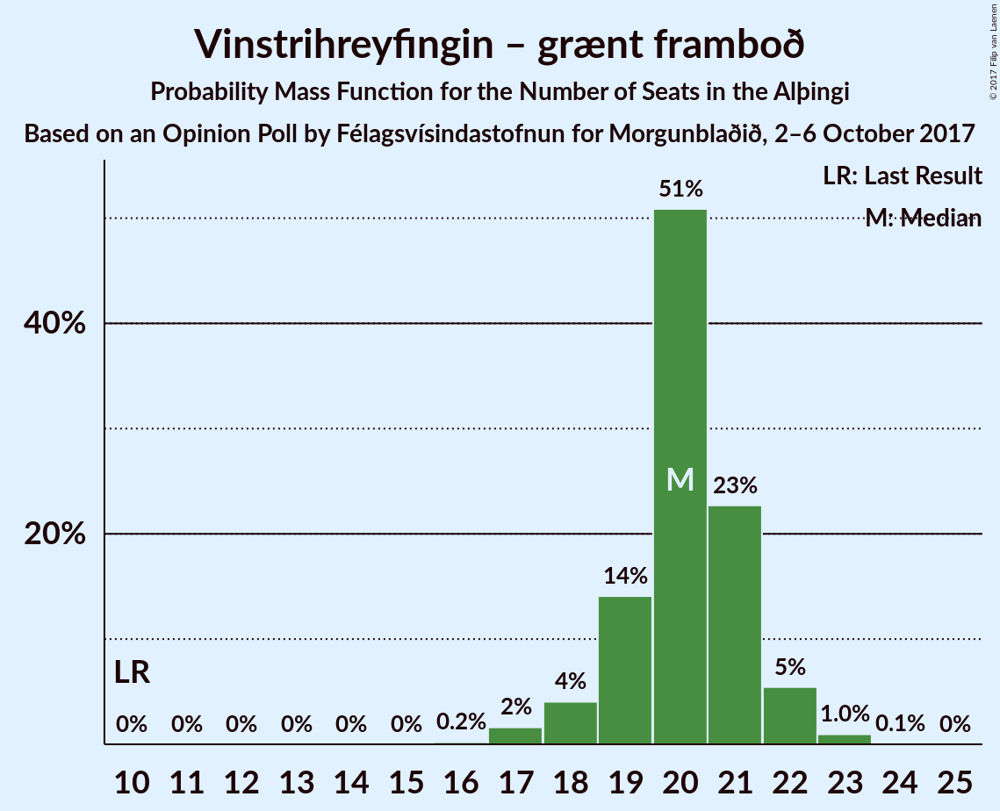

| Number of Seats | Probability | Accumulated | Special Marks |
|:---------------:|:-----------:|:-----------:|:-------------:|
| 10 | 0% | 100% | Last Result |
| 11 | 0% | 100% |  |
| 12 | 0% | 100% |  |
| 13 | 0% | 100% |  |
| 14 | 0% | 100% |  |
| 15 | 0% | 100% |  |
| 16 | 0.2% | 100% |  |
| 17 | 2% | 99.8% |  |
| 18 | 4% | 98% |  |
| 19 | 14% | 94% |  |
| 20 | 51% | 80% | Median |
| 21 | 23% | 29% |  |
| 22 | 5% | 6% |  |
| 23 | 1.0% | 1.0% |  |
| 24 | 0.1% | 0.1% |  |
| 25 | 0% | 0% |  |

### Sjálfstæðisflokkurinn

*For a full overview of the results for this party, see the [Sjálfstæðisflokkurinn](party-sjlfstisflokkurinn.html) page.*

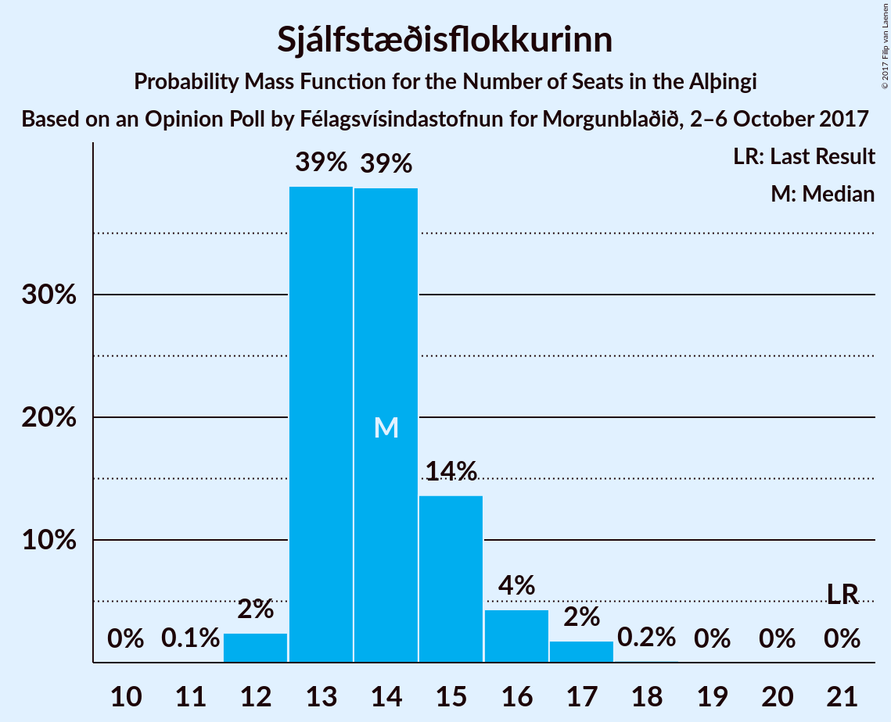

| Number of Seats | Probability | Accumulated | Special Marks |
|:---------------:|:-----------:|:-----------:|:-------------:|
| 11 | 0.1% | 100% |  |
| 12 | 2% | 99.9% |  |
| 13 | 39% | 97% |  |
| 14 | 39% | 59% | Median |
| 15 | 14% | 20% |  |
| 16 | 4% | 6% |  |
| 17 | 2% | 2% |  |
| 18 | 0.2% | 0.2% |  |
| 19 | 0% | 0% |  |
| 20 | 0% | 0% |  |
| 21 | 0% | 0% | Last Result |

### Samfylkingin

*For a full overview of the results for this party, see the [Samfylkingin](party-samfylkingin.html) page.*

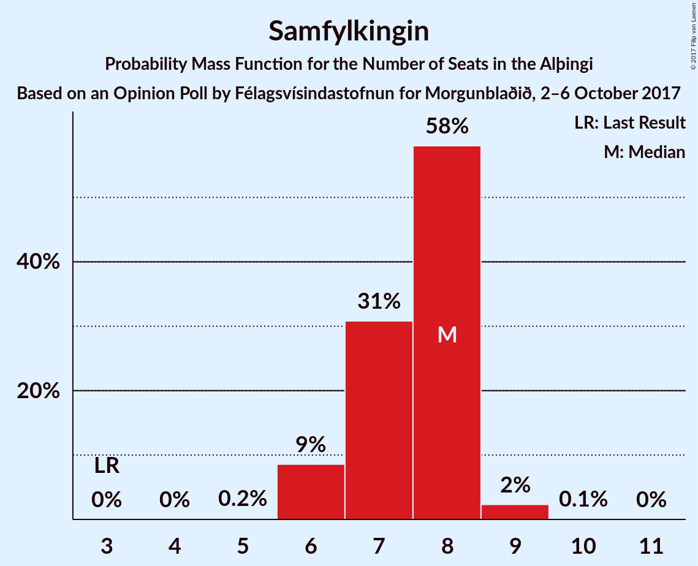

| Number of Seats | Probability | Accumulated | Special Marks |
|:---------------:|:-----------:|:-----------:|:-------------:|
| 3 | 0% | 100% | Last Result |
| 4 | 0% | 100% |  |
| 5 | 0.2% | 100% |  |
| 6 | 9% | 99.8% |  |
| 7 | 31% | 91% |  |
| 8 | 58% | 60% | Median |
| 9 | 2% | 2% |  |
| 10 | 0.1% | 0.1% |  |
| 11 | 0% | 0% |  |

### Miðflokkurinn

*For a full overview of the results for this party, see the [Miðflokkurinn](party-miflokkurinn.html) page.*

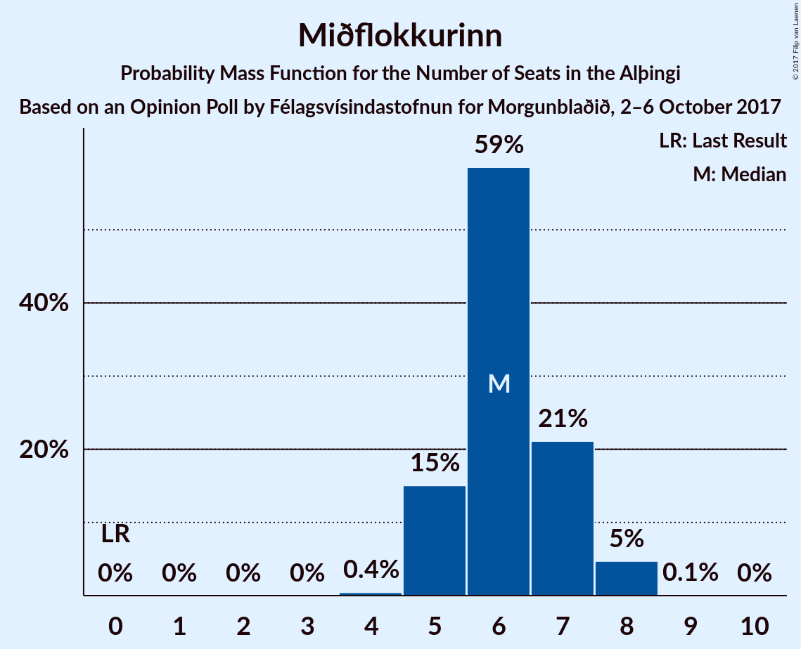

| Number of Seats | Probability | Accumulated | Special Marks |
|:---------------:|:-----------:|:-----------:|:-------------:|
| 0 | 0% | 100% | Last Result |
| 1 | 0% | 100% |  |
| 2 | 0% | 100% |  |
| 3 | 0% | 100% |  |
| 4 | 0.4% | 100% |  |
| 5 | 15% | 99.6% |  |
| 6 | 59% | 85% | Median |
| 7 | 21% | 26% |  |
| 8 | 5% | 5% |  |
| 9 | 0.1% | 0.1% |  |
| 10 | 0% | 0% |  |

### Píratar

*For a full overview of the results for this party, see the [Píratar](party-pratar.html) page.*

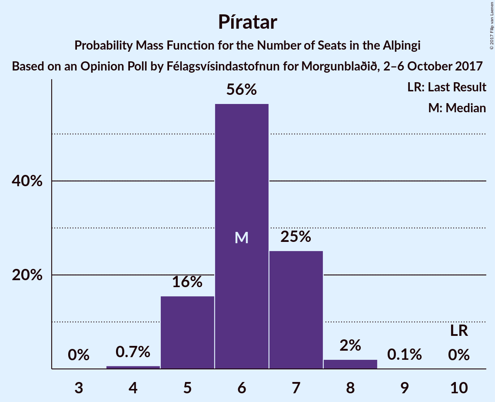

| Number of Seats | Probability | Accumulated | Special Marks |
|:---------------:|:-----------:|:-----------:|:-------------:|
| 4 | 0.7% | 100% |  |
| 5 | 16% | 99.3% |  |
| 6 | 56% | 84% | Median |
| 7 | 25% | 27% |  |
| 8 | 2% | 2% |  |
| 9 | 0.1% | 0.1% |  |
| 10 | 0% | 0% | Last Result |

### Flokkur fólksins

*For a full overview of the results for this party, see the [Flokkur fólksins](party-flokkurflksins.html) page.*

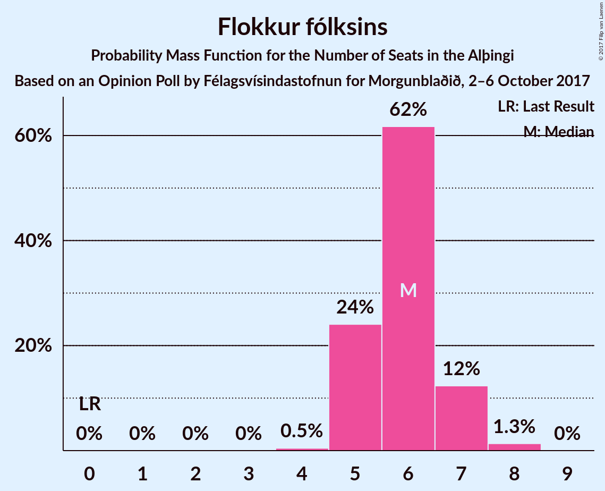

| Number of Seats | Probability | Accumulated | Special Marks |
|:---------------:|:-----------:|:-----------:|:-------------:|
| 0 | 0% | 100% | Last Result |
| 1 | 0% | 100% |  |
| 2 | 0% | 100% |  |
| 3 | 0% | 100% |  |
| 4 | 0.5% | 100% |  |
| 5 | 24% | 99.5% |  |
| 6 | 62% | 75% | Median |
| 7 | 12% | 14% |  |
| 8 | 1.3% | 1.4% |  |
| 9 | 0% | 0% |  |

### Framsóknarflokkurinn

*For a full overview of the results for this party, see the [Framsóknarflokkurinn](party-framsknarflokkurinn.html) page.*

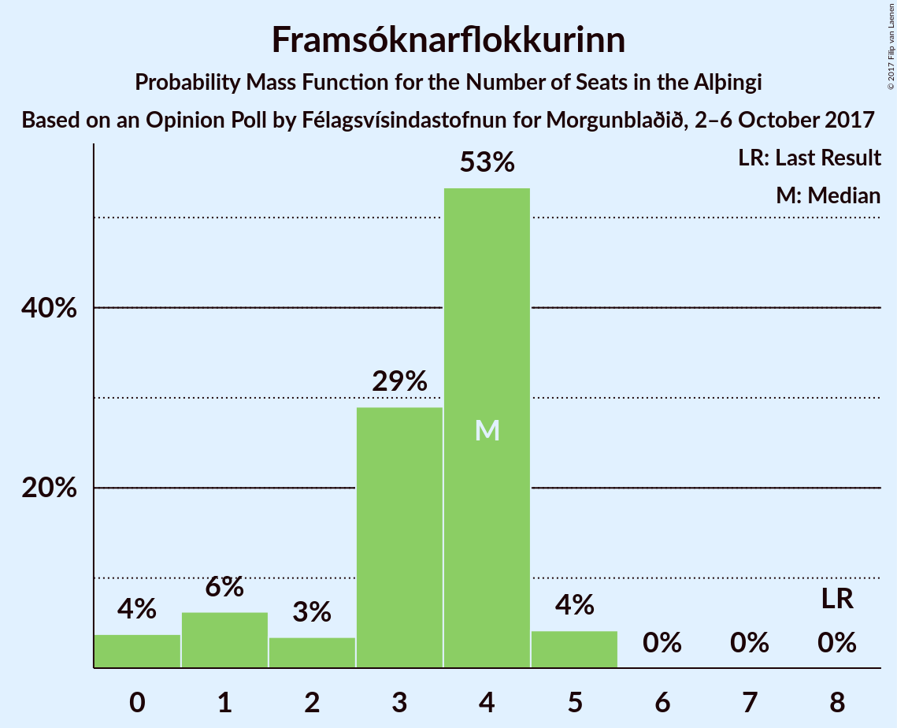

| Number of Seats | Probability | Accumulated | Special Marks |
|:---------------:|:-----------:|:-----------:|:-------------:|
| 0 | 4% | 100% |  |
| 1 | 6% | 96% |  |
| 2 | 3% | 90% |  |
| 3 | 29% | 87% |  |
| 4 | 53% | 58% | Median |
| 5 | 4% | 4% |  |
| 6 | 0% | 0% |  |
| 7 | 0% | 0% |  |
| 8 | 0% | 0% | Last Result |

### Viðreisn

*For a full overview of the results for this party, see the [Viðreisn](party-vireisn.html) page.*

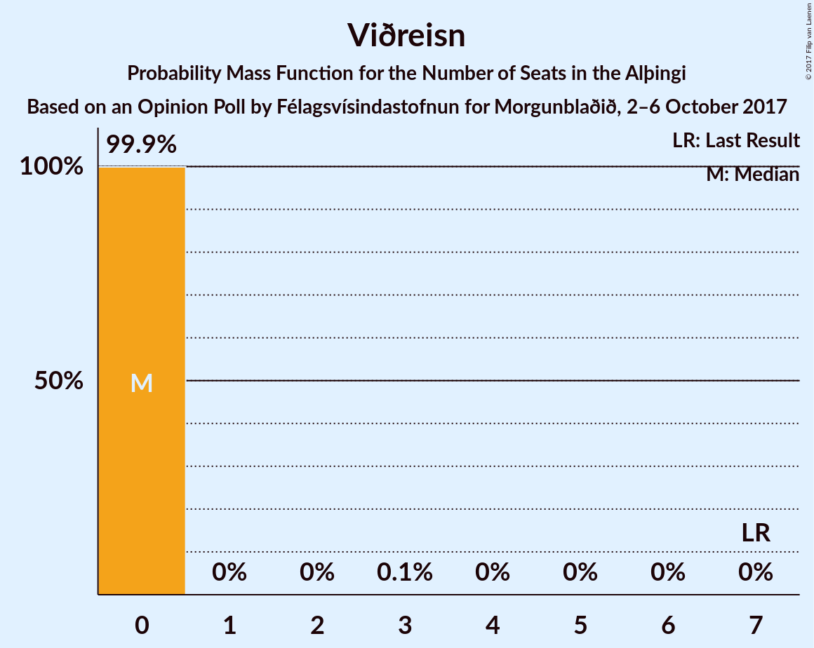

| Number of Seats | Probability | Accumulated | Special Marks |
|:---------------:|:-----------:|:-----------:|:-------------:|
| 0 | 99.9% | 100% | Median |
| 1 | 0% | 0.1% |  |
| 2 | 0% | 0.1% |  |
| 3 | 0.1% | 0.1% |  |
| 4 | 0% | 0% |  |
| 5 | 0% | 0% |  |
| 6 | 0% | 0% |  |
| 7 | 0% | 0% | Last Result |

### Björt framtíð

*For a full overview of the results for this party, see the [Björt framtíð](party-bjrtframt.html) page.*

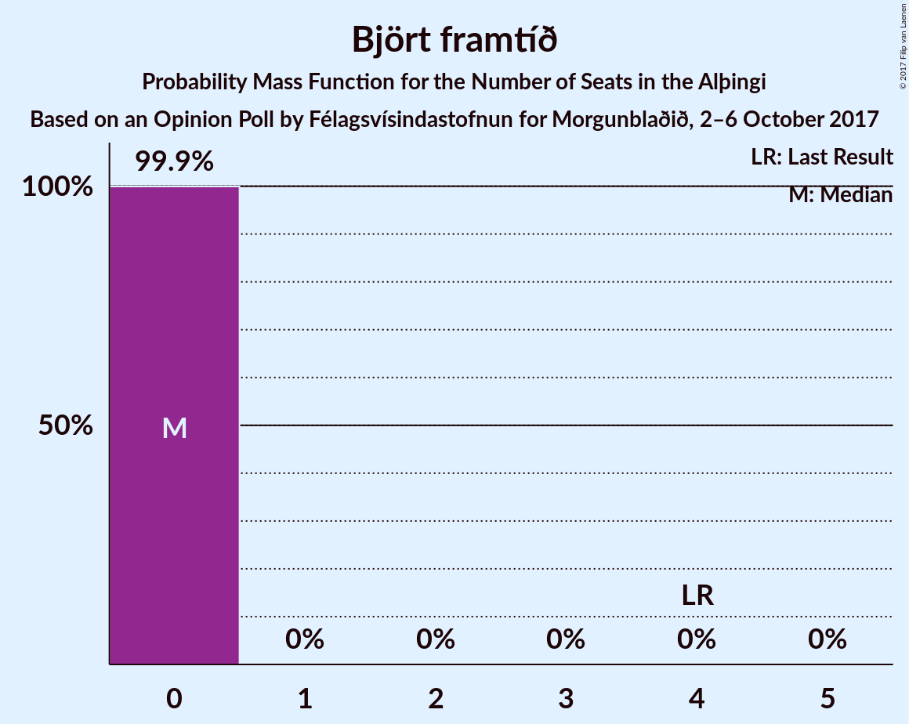

| Number of Seats | Probability | Accumulated | Special Marks |
|:---------------:|:-----------:|:-----------:|:-------------:|
| 0 | 99.9% | 100% | Median |
| 1 | 0% | 0.1% |  |
| 2 | 0% | 0% |  |
| 3 | 0% | 0% |  |
| 4 | 0% | 0% | Last Result |

### Íslenska þjóðfylkingin

*For a full overview of the results for this party, see the [Íslenska þjóðfylkingin](party-slenskajfylkingin.html) page.*

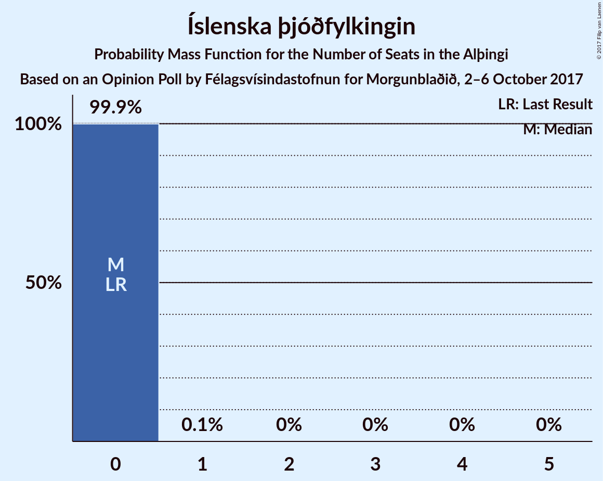

| Number of Seats | Probability | Accumulated | Special Marks |
|:---------------:|:-----------:|:-----------:|:-------------:|
| 0 | 99.9% | 100% | Last Result, Median |
| 1 | 0.1% | 0.1% |  |
| 2 | 0% | 0% |  |

### Alþýðufylkingin

*For a full overview of the results for this party, see the [Alþýðufylkingin](party-alufylkingin.html) page.*

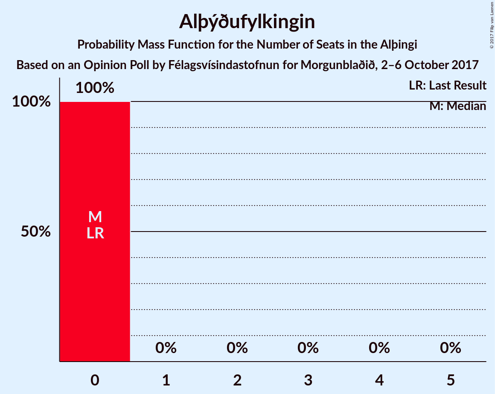

| Number of Seats | Probability | Accumulated | Special Marks |
|:---------------:|:-----------:|:-----------:|:-------------:|
| 0 | 100% | 100% | Last Result, Median |

### Dögun

*For a full overview of the results for this party, see the [Dögun](party-dgun.html) page.*

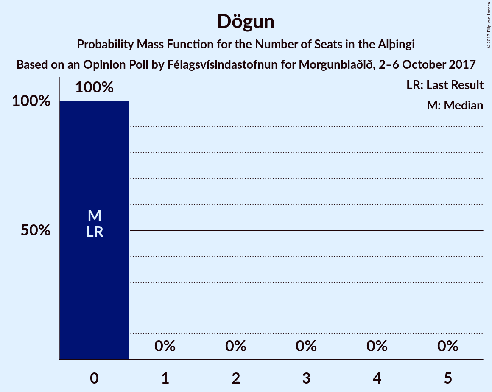

| Number of Seats | Probability | Accumulated | Special Marks |
|:---------------:|:-----------:|:-----------:|:-------------:|
| 0 | 100% | 100% | Last Result, Median |

## Coalitions

### Confidence Intervals

| Coalition | Last Result | Median | Majority? | 80% Confidence Interval | 90% Confidence Interval | 95% Confidence Interval | 99% Confidence Interval |
|:---------:|:-----------:|:------:|:---------:|:-----------------------:|:-----------------------:|:-----------------------:|:-----------------------:|
| Vinstrihreyfingin – grænt framboð – Samfylkingin – Miðflokkurinn – Framsóknarflokkurinn | 21 | 37 | 100% | 35–38 | 35–39 | 34–39 | 33–40 |
| Vinstrihreyfingin – grænt framboð – Samfylkingin – Miðflokkurinn | 13 | 34 | 98% | 33–35 | 32–35 | 32–36 | 30–37 |
| Vinstrihreyfingin – grænt framboð – Sjálfstæðisflokkurinn | 31 | 34 | 98% | 33–36 | 32–36 | 32–36 | 31–38 |
| Vinstrihreyfingin – grænt framboð – Samfylkingin – Píratar – Björt framtíð | 27 | 34 | 94% | 32–35 | 31–35 | 31–36 | 30–37 |
| Vinstrihreyfingin – grænt framboð – Samfylkingin – Píratar – Viðreisn – Björt framtíð | 34 | 34 | 94% | 32–35 | 31–35 | 31–36 | 30–37 |
| Vinstrihreyfingin – grænt framboð – Samfylkingin – Píratar | 23 | 34 | 94% | 32–35 | 31–35 | 31–36 | 30–37 |
| Vinstrihreyfingin – grænt framboð – Samfylkingin – Píratar – Viðreisn | 30 | 34 | 94% | 32–35 | 31–35 | 31–36 | 30–37 |
| Vinstrihreyfingin – grænt framboð – Samfylkingin – Framsóknarflokkurinn | 21 | 31 | 49% | 29–32 | 28–33 | 27–33 | 26–34 |
| Vinstrihreyfingin – grænt framboð – Miðflokkurinn – Framsóknarflokkurinn | 18 | 30 | 3% | 28–31 | 27–31 | 27–32 | 25–32 |
| Vinstrihreyfingin – grænt framboð – Samfylkingin | 13 | 28 | 0% | 26–29 | 25–29 | 25–29 | 24–31 |
| Vinstrihreyfingin – grænt framboð – Miðflokkurinn | 10 | 26 | 0% | 25–28 | 25–28 | 24–28 | 23–29 |
| Vinstrihreyfingin – grænt framboð – Píratar | 20 | 26 | 0% | 25–28 | 24–28 | 24–28 | 23–30 |
| Sjálfstæðisflokkurinn – Miðflokkurinn – Framsóknarflokkurinn | 29 | 23 | 0% | 22–25 | 22–26 | 21–27 | 19–28 |
| Vinstrihreyfingin – grænt framboð – Framsóknarflokkurinn | 18 | 24 | 0% | 21–25 | 21–25 | 20–26 | 19–26 |
| Sjálfstæðisflokkurinn – Samfylkingin | 24 | 21 | 0% | 20–23 | 20–23 | 19–24 | 19–25 |
| Sjálfstæðisflokkurinn – Miðflokkurinn | 21 | 20 | 0% | 19–22 | 19–23 | 18–23 | 18–24 |
| Sjálfstæðisflokkurinn – Framsóknarflokkurinn | 29 | 17 | 0% | 16–18 | 16–19 | 15–19 | 13–20 |
| Sjálfstæðisflokkurinn – Björt framtíð | 25 | 14 | 0% | 13–15 | 13–16 | 12–16 | 12–17 |
| Sjálfstæðisflokkurinn – Viðreisn – Björt framtíð | 32 | 14 | 0% | 13–15 | 13–16 | 12–16 | 12–17 |
| Sjálfstæðisflokkurinn – Viðreisn | 28 | 14 | 0% | 13–15 | 13–16 | 12–16 | 12–17 |

### Vinstrihreyfingin – grænt framboð – Samfylkingin – Miðflokkurinn – Framsóknarflokkurinn

| Number of Seats | Probability | Accumulated | Special Marks |
|:---------------:|:-----------:|:-----------:|:-------------:|
| 21 | 0% | 100% | Last Result |
| 22 | 0% | 100% |  |
| 23 | 0% | 100% |  |
| 24 | 0% | 100% |  |
| 25 | 0% | 100% |  |
| 26 | 0% | 100% |  |
| 27 | 0% | 100% |  |
| 28 | 0% | 100% |  |
| 29 | 0% | 100% |  |
| 30 | 0% | 100% |  |
| 31 | 0% | 100% |  |
| 32 | 0.2% | 100% | Majority |
| 33 | 2% | 99.8% |  |
| 34 | 1.4% | 98% |  |
| 35 | 7% | 97% |  |
| 36 | 13% | 90% |  |
| 37 | 32% | 77% |  |
| 38 | 39% | 45% | Median |
| 39 | 5% | 5% |  |
| 40 | 0.5% | 0.5% |  |
| 41 | 0% | 0% |  |

### Vinstrihreyfingin – grænt framboð – Samfylkingin – Miðflokkurinn

| Number of Seats | Probability | Accumulated | Special Marks |
|:---------------:|:-----------:|:-----------:|:-------------:|
| 13 | 0% | 100% | Last Result |
| 14 | 0% | 100% |  |
| 15 | 0% | 100% |  |
| 16 | 0% | 100% |  |
| 17 | 0% | 100% |  |
| 18 | 0% | 100% |  |
| 19 | 0% | 100% |  |
| 20 | 0% | 100% |  |
| 21 | 0% | 100% |  |
| 22 | 0% | 100% |  |
| 23 | 0% | 100% |  |
| 24 | 0% | 100% |  |
| 25 | 0% | 100% |  |
| 26 | 0% | 100% |  |
| 27 | 0% | 100% |  |
| 28 | 0% | 100% |  |
| 29 | 0% | 100% |  |
| 30 | 1.1% | 100% |  |
| 31 | 1.0% | 98.9% |  |
| 32 | 6% | 98% | Majority |
| 33 | 23% | 92% |  |
| 34 | 52% | 68% | Median |
| 35 | 13% | 17% |  |
| 36 | 2% | 3% |  |
| 37 | 0.8% | 0.9% |  |
| 38 | 0.1% | 0.1% |  |
| 39 | 0% | 0% |  |

### Vinstrihreyfingin – grænt framboð – Sjálfstæðisflokkurinn

| Number of Seats | Probability | Accumulated | Special Marks |
|:---------------:|:-----------:|:-----------:|:-------------:|
| 30 | 0.1% | 100% |  |
| 31 | 2% | 99.9% | Last Result |
| 32 | 4% | 98% | Majority |
| 33 | 37% | 93% |  |
| 34 | 24% | 56% | Median |
| 35 | 21% | 32% |  |
| 36 | 10% | 12% |  |
| 37 | 1.0% | 2% |  |
| 38 | 0.5% | 0.6% |  |
| 39 | 0% | 0% |  |

### Vinstrihreyfingin – grænt framboð – Samfylkingin – Píratar – Björt framtíð

| Number of Seats | Probability | Accumulated | Special Marks |
|:---------------:|:-----------:|:-----------:|:-------------:|
| 27 | 0% | 100% | Last Result |
| 28 | 0% | 100% |  |
| 29 | 0.2% | 100% |  |
| 30 | 1.0% | 99.8% |  |
| 31 | 4% | 98.8% |  |
| 32 | 11% | 94% | Majority |
| 33 | 12% | 83% |  |
| 34 | 47% | 71% | Median |
| 35 | 20% | 24% |  |
| 36 | 2% | 3% |  |
| 37 | 0.3% | 0.8% |  |
| 38 | 0.5% | 0.5% |  |
| 39 | 0% | 0% |  |

### Vinstrihreyfingin – grænt framboð – Samfylkingin – Píratar – Viðreisn – Björt framtíð

| Number of Seats | Probability | Accumulated | Special Marks |
|:---------------:|:-----------:|:-----------:|:-------------:|
| 29 | 0.2% | 100% |  |
| 30 | 1.0% | 99.8% |  |
| 31 | 4% | 98.8% |  |
| 32 | 11% | 94% | Majority |
| 33 | 12% | 83% |  |
| 34 | 47% | 71% | Last Result, Median |
| 35 | 20% | 24% |  |
| 36 | 2% | 3% |  |
| 37 | 0.4% | 0.8% |  |
| 38 | 0.5% | 0.5% |  |
| 39 | 0% | 0% |  |

### Vinstrihreyfingin – grænt framboð – Samfylkingin – Píratar

| Number of Seats | Probability | Accumulated | Special Marks |
|:---------------:|:-----------:|:-----------:|:-------------:|
| 23 | 0% | 100% | Last Result |
| 24 | 0% | 100% |  |
| 25 | 0% | 100% |  |
| 26 | 0% | 100% |  |
| 27 | 0% | 100% |  |
| 28 | 0% | 100% |  |
| 29 | 0.2% | 100% |  |
| 30 | 1.0% | 99.8% |  |
| 31 | 4% | 98.8% |  |
| 32 | 11% | 94% | Majority |
| 33 | 12% | 83% |  |
| 34 | 47% | 71% | Median |
| 35 | 20% | 24% |  |
| 36 | 2% | 3% |  |
| 37 | 0.3% | 0.8% |  |
| 38 | 0.5% | 0.5% |  |
| 39 | 0% | 0% |  |

### Vinstrihreyfingin – grænt framboð – Samfylkingin – Píratar – Viðreisn

| Number of Seats | Probability | Accumulated | Special Marks |
|:---------------:|:-----------:|:-----------:|:-------------:|
| 29 | 0.2% | 100% |  |
| 30 | 1.0% | 99.8% | Last Result |
| 31 | 4% | 98.8% |  |
| 32 | 11% | 94% | Majority |
| 33 | 12% | 83% |  |
| 34 | 47% | 71% | Median |
| 35 | 20% | 24% |  |
| 36 | 2% | 3% |  |
| 37 | 0.3% | 0.8% |  |
| 38 | 0.5% | 0.5% |  |
| 39 | 0% | 0% |  |

### Vinstrihreyfingin – grænt framboð – Samfylkingin – Framsóknarflokkurinn

| Number of Seats | Probability | Accumulated | Special Marks |
|:---------------:|:-----------:|:-----------:|:-------------:|
| 21 | 0% | 100% | Last Result |
| 22 | 0% | 100% |  |
| 23 | 0% | 100% |  |
| 24 | 0% | 100% |  |
| 25 | 0.1% | 100% |  |
| 26 | 0.7% | 99.9% |  |
| 27 | 3% | 99.2% |  |
| 28 | 4% | 97% |  |
| 29 | 10% | 93% |  |
| 30 | 13% | 83% |  |
| 31 | 21% | 70% |  |
| 32 | 43% | 49% | Median, Majority |
| 33 | 5% | 6% |  |
| 34 | 0.7% | 0.7% |  |
| 35 | 0% | 0% |  |

### Vinstrihreyfingin – grænt framboð – Miðflokkurinn – Framsóknarflokkurinn

| Number of Seats | Probability | Accumulated | Special Marks |
|:---------------:|:-----------:|:-----------:|:-------------:|
| 18 | 0% | 100% | Last Result |
| 19 | 0% | 100% |  |
| 20 | 0% | 100% |  |
| 21 | 0% | 100% |  |
| 22 | 0% | 100% |  |
| 23 | 0% | 100% |  |
| 24 | 0% | 100% |  |
| 25 | 0.6% | 100% |  |
| 26 | 1.3% | 99.3% |  |
| 27 | 3% | 98% |  |
| 28 | 10% | 95% |  |
| 29 | 25% | 85% |  |
| 30 | 43% | 60% | Median |
| 31 | 14% | 17% |  |
| 32 | 3% | 3% | Majority |
| 33 | 0.2% | 0.3% |  |
| 34 | 0% | 0% |  |

### Vinstrihreyfingin – grænt framboð – Samfylkingin

| Number of Seats | Probability | Accumulated | Special Marks |
|:---------------:|:-----------:|:-----------:|:-------------:|
| 13 | 0% | 100% | Last Result |
| 14 | 0% | 100% |  |
| 15 | 0% | 100% |  |
| 16 | 0% | 100% |  |
| 17 | 0% | 100% |  |
| 18 | 0% | 100% |  |
| 19 | 0% | 100% |  |
| 20 | 0% | 100% |  |
| 21 | 0% | 100% |  |
| 22 | 0.1% | 100% |  |
| 23 | 0.1% | 99.9% |  |
| 24 | 2% | 99.9% |  |
| 25 | 4% | 98% |  |
| 26 | 7% | 94% |  |
| 27 | 25% | 87% |  |
| 28 | 42% | 61% | Median |
| 29 | 17% | 20% |  |
| 30 | 2% | 2% |  |
| 31 | 0.7% | 0.7% |  |
| 32 | 0% | 0% | Majority |

### Vinstrihreyfingin – grænt framboð – Miðflokkurinn

| Number of Seats | Probability | Accumulated | Special Marks |
|:---------------:|:-----------:|:-----------:|:-------------:|
| 10 | 0% | 100% | Last Result |
| 11 | 0% | 100% |  |
| 12 | 0% | 100% |  |
| 13 | 0% | 100% |  |
| 14 | 0% | 100% |  |
| 15 | 0% | 100% |  |
| 16 | 0% | 100% |  |
| 17 | 0% | 100% |  |
| 18 | 0% | 100% |  |
| 19 | 0% | 100% |  |
| 20 | 0% | 100% |  |
| 21 | 0% | 100% |  |
| 22 | 0% | 100% |  |
| 23 | 0.8% | 99.9% |  |
| 24 | 2% | 99.1% |  |
| 25 | 12% | 97% |  |
| 26 | 56% | 85% | Median |
| 27 | 18% | 29% |  |
| 28 | 9% | 11% |  |
| 29 | 2% | 2% |  |
| 30 | 0.2% | 0.2% |  |
| 31 | 0% | 0% |  |

### Vinstrihreyfingin – grænt framboð – Píratar

| Number of Seats | Probability | Accumulated | Special Marks |
|:---------------:|:-----------:|:-----------:|:-------------:|
| 20 | 0% | 100% | Last Result |
| 21 | 0% | 100% |  |
| 22 | 0.2% | 100% |  |
| 23 | 2% | 99.8% |  |
| 24 | 6% | 98% |  |
| 25 | 10% | 92% |  |
| 26 | 46% | 82% | Median |
| 27 | 24% | 36% |  |
| 28 | 10% | 12% |  |
| 29 | 1.2% | 2% |  |
| 30 | 0.5% | 0.5% |  |
| 31 | 0% | 0% |  |

### Sjálfstæðisflokkurinn – Miðflokkurinn – Framsóknarflokkurinn

| Number of Seats | Probability | Accumulated | Special Marks |
|:---------------:|:-----------:|:-----------:|:-------------:|
| 19 | 0.5% | 100% |  |
| 20 | 0.3% | 99.5% |  |
| 21 | 3% | 99.1% |  |
| 22 | 13% | 97% |  |
| 23 | 49% | 84% |  |
| 24 | 24% | 35% | Median |
| 25 | 5% | 11% |  |
| 26 | 3% | 6% |  |
| 27 | 2% | 3% |  |
| 28 | 0.6% | 0.6% |  |
| 29 | 0% | 0% | Last Result |

### Vinstrihreyfingin – grænt framboð – Framsóknarflokkurinn

| Number of Seats | Probability | Accumulated | Special Marks |
|:---------------:|:-----------:|:-----------:|:-------------:|
| 18 | 0.1% | 100% | Last Result |
| 19 | 1.1% | 99.9% |  |
| 20 | 2% | 98.8% |  |
| 21 | 9% | 97% |  |
| 22 | 6% | 88% |  |
| 23 | 20% | 81% |  |
| 24 | 48% | 62% | Median |
| 25 | 10% | 13% |  |
| 26 | 4% | 4% |  |
| 27 | 0.1% | 0.1% |  |
| 28 | 0% | 0% |  |

### Sjálfstæðisflokkurinn – Samfylkingin

| Number of Seats | Probability | Accumulated | Special Marks |
|:---------------:|:-----------:|:-----------:|:-------------:|
| 18 | 0.2% | 100% |  |
| 19 | 3% | 99.7% |  |
| 20 | 9% | 97% |  |
| 21 | 53% | 88% |  |
| 22 | 22% | 35% | Median |
| 23 | 10% | 13% |  |
| 24 | 3% | 4% | Last Result |
| 25 | 0.8% | 0.8% |  |
| 26 | 0.1% | 0.1% |  |
| 27 | 0% | 0% |  |

### Sjálfstæðisflokkurinn – Miðflokkurinn

| Number of Seats | Probability | Accumulated | Special Marks |
|:---------------:|:-----------:|:-----------:|:-------------:|
| 17 | 0.2% | 100% |  |
| 18 | 3% | 99.7% |  |
| 19 | 45% | 97% |  |
| 20 | 24% | 52% | Median |
| 21 | 13% | 28% | Last Result |
| 22 | 9% | 15% |  |
| 23 | 4% | 6% |  |
| 24 | 2% | 2% |  |
| 25 | 0.1% | 0.1% |  |
| 26 | 0% | 0% |  |

### Sjálfstæðisflokkurinn – Framsóknarflokkurinn

| Number of Seats | Probability | Accumulated | Special Marks |
|:---------------:|:-----------:|:-----------:|:-------------:|
| 12 | 0.1% | 100% |  |
| 13 | 0.5% | 99.9% |  |
| 14 | 0.5% | 99.4% |  |
| 15 | 3% | 98.9% |  |
| 16 | 12% | 96% |  |
| 17 | 54% | 83% |  |
| 18 | 20% | 29% | Median |
| 19 | 7% | 9% |  |
| 20 | 2% | 2% |  |
| 21 | 0.2% | 0.2% |  |
| 22 | 0% | 0% |  |
| 23 | 0% | 0% |  |
| 24 | 0% | 0% |  |
| 25 | 0% | 0% |  |
| 26 | 0% | 0% |  |
| 27 | 0% | 0% |  |
| 28 | 0% | 0% |  |
| 29 | 0% | 0% | Last Result |

### Sjálfstæðisflokkurinn – Björt framtíð

| Number of Seats | Probability | Accumulated | Special Marks |
|:---------------:|:-----------:|:-----------:|:-------------:|
| 11 | 0.1% | 100% |  |
| 12 | 2% | 99.9% |  |
| 13 | 39% | 97% |  |
| 14 | 39% | 59% | Median |
| 15 | 14% | 20% |  |
| 16 | 4% | 6% |  |
| 17 | 2% | 2% |  |
| 18 | 0.2% | 0.2% |  |
| 19 | 0% | 0% |  |
| 20 | 0% | 0% |  |
| 21 | 0% | 0% |  |
| 22 | 0% | 0% |  |
| 23 | 0% | 0% |  |
| 24 | 0% | 0% |  |
| 25 | 0% | 0% | Last Result |

### Sjálfstæðisflokkurinn – Viðreisn – Björt framtíð

| Number of Seats | Probability | Accumulated | Special Marks |
|:---------------:|:-----------:|:-----------:|:-------------:|
| 11 | 0.1% | 100% |  |
| 12 | 2% | 99.9% |  |
| 13 | 39% | 97% |  |
| 14 | 39% | 59% | Median |
| 15 | 14% | 20% |  |
| 16 | 4% | 6% |  |
| 17 | 2% | 2% |  |
| 18 | 0.2% | 0.2% |  |
| 19 | 0% | 0% |  |
| 20 | 0% | 0% |  |
| 21 | 0% | 0% |  |
| 22 | 0% | 0% |  |
| 23 | 0% | 0% |  |
| 24 | 0% | 0% |  |
| 25 | 0% | 0% |  |
| 26 | 0% | 0% |  |
| 27 | 0% | 0% |  |
| 28 | 0% | 0% |  |
| 29 | 0% | 0% |  |
| 30 | 0% | 0% |  |
| 31 | 0% | 0% |  |
| 32 | 0% | 0% | Last Result, Majority |

### Sjálfstæðisflokkurinn – Viðreisn

| Number of Seats | Probability | Accumulated | Special Marks |
|:---------------:|:-----------:|:-----------:|:-------------:|
| 11 | 0.1% | 100% |  |
| 12 | 2% | 99.9% |  |
| 13 | 39% | 97% |  |
| 14 | 39% | 59% | Median |
| 15 | 14% | 20% |  |
| 16 | 4% | 6% |  |
| 17 | 2% | 2% |  |
| 18 | 0.2% | 0.2% |  |
| 19 | 0% | 0% |  |
| 20 | 0% | 0% |  |
| 21 | 0% | 0% |  |
| 22 | 0% | 0% |  |
| 23 | 0% | 0% |  |
| 24 | 0% | 0% |  |
| 25 | 0% | 0% |  |
| 26 | 0% | 0% |  |
| 27 | 0% | 0% |  |
| 28 | 0% | 0% | Last Result |

## Technical Information

### Opinion Poll

+ **Polling firm:** Félagsvísindastofnun
+ **Commissioner(s):** Morgunblaðið
+ **Fieldwork period:** 2–6 October 2017

### Calculations

+ **Sample size:** 943
+ **Simulations done:** 8,388,608
+ **Error estimate:** 2.00%

