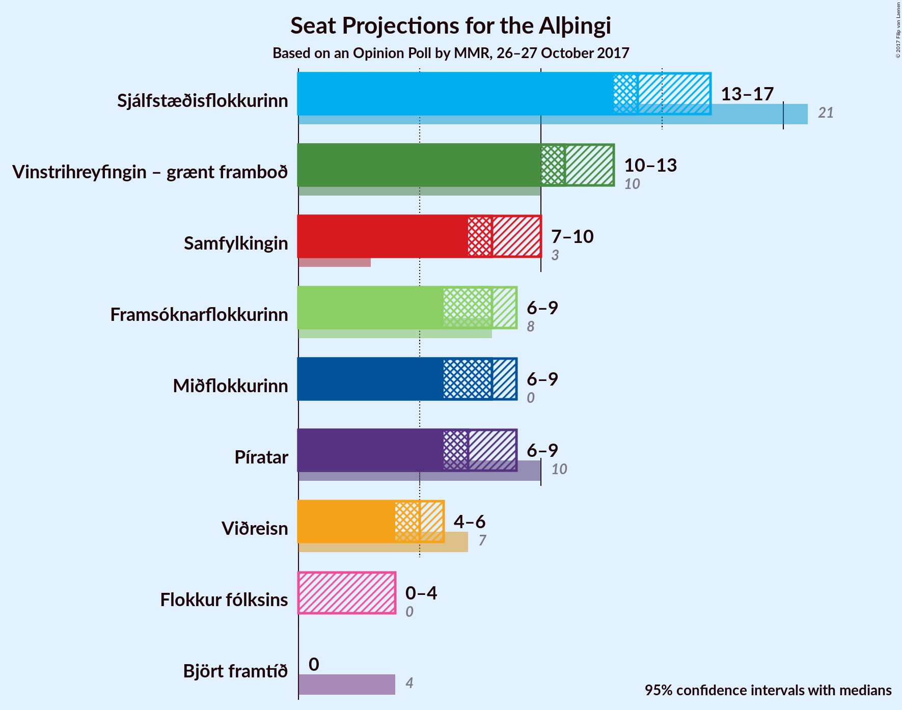
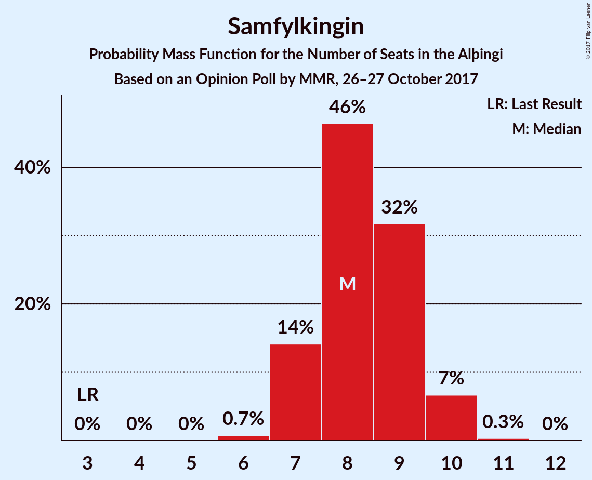
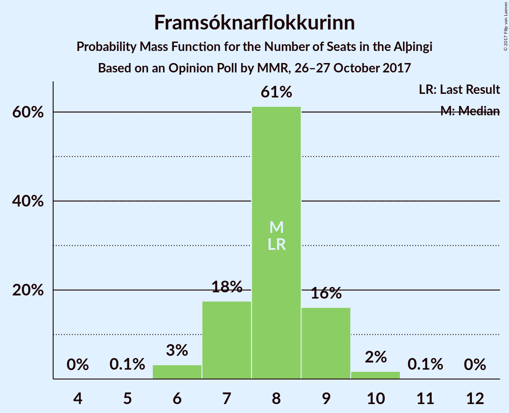
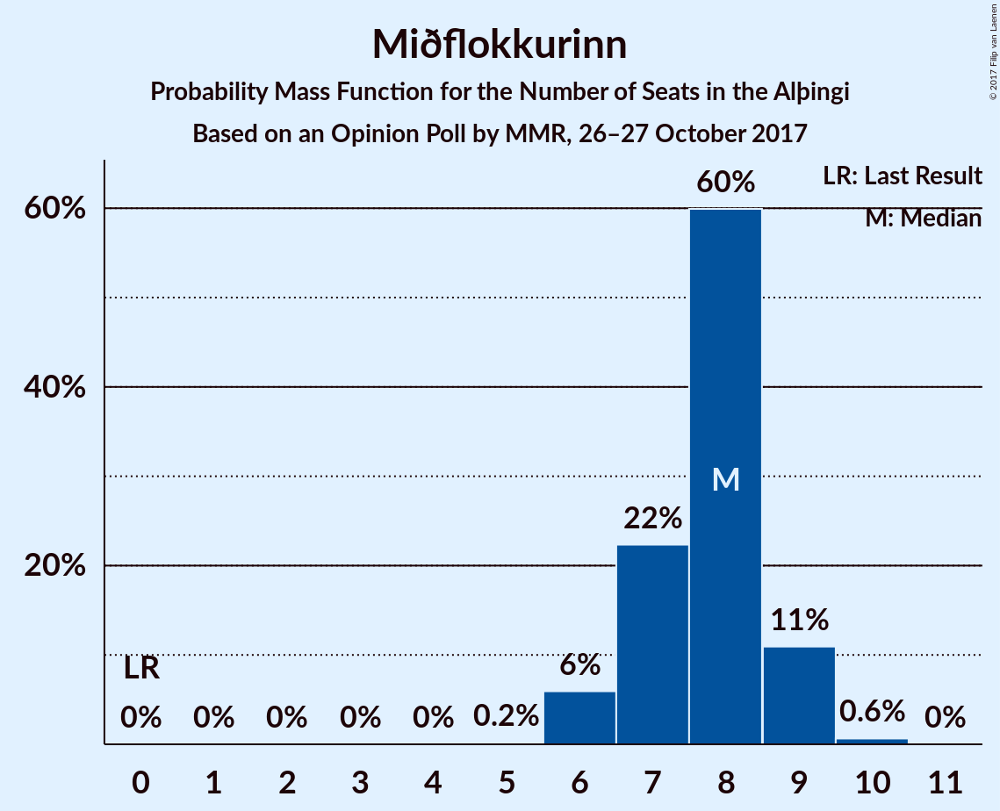
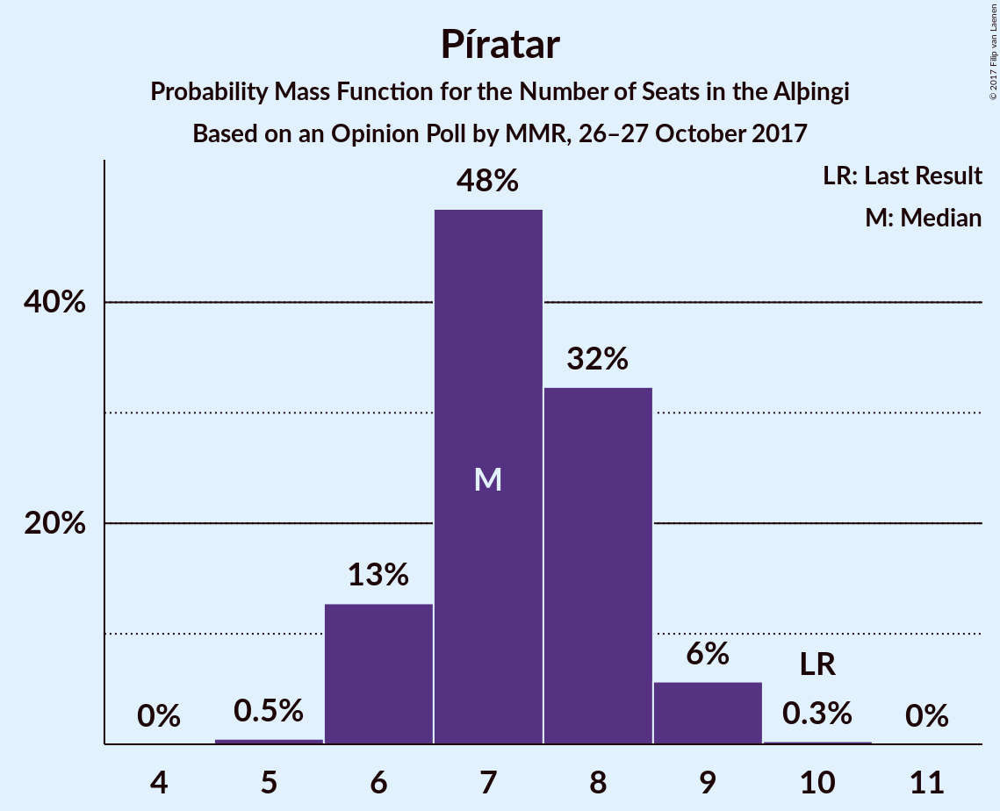

# Opinion Poll by MMR, 26–27 October 2017

<a href="#voting-intentions">Voting Intentions</a> | <a href="#seats">Seats</a> | <a href="#coalitions">Coalitions</a> | <a href="#technical-information">Technical Information</a>

## Voting Intentions

### Confidence Intervals

| Party | Last Result | Poll Result | 80% Confidence Interval | 90% Confidence Interval | 95% Confidence Interval | 99% Confidence Interval |
|:-----:|:-----------:|:-----------:|:-----------------------:|:-----------------------:|:-----------------------:|:-----------------------:|
| Sjálfstæðisflokkurinn | 29.0% | 21.3% | 19.7–23.1% |19.3–23.6% |18.9–24.0% |18.1–24.9% |
| Vinstrihreyfingin – grænt framboð | 15.9% | 16.6% | 15.2–18.2% |14.8–18.7% |14.4–19.1% |13.8–19.9% |
| Samfylkingin | 5.7% | 12.4% | 11.2–13.9% |10.8–14.3% |10.5–14.7% |10.0–15.4% |
| Framsóknarflokkurinn | 11.5% | 11.7% | 10.5–13.2% |10.2–13.5% |9.9–13.9% |9.3–14.6% |
| Miðflokkurinn | 0.0% | 11.4% | 10.2–12.8% |9.9–13.2% |9.6–13.6% |9.0–14.3% |
| Píratar | 14.5% | 11.0% | 9.8–12.4% |9.5–12.8% |9.2–13.1% |8.7–13.8% |
| Viðreisn | 10.5% | 8.1% | 7.0–9.3% |6.8–9.6% |6.5–9.9% |6.1–10.5% |
| Flokkur fólksins | 3.5% | 4.4% | 3.7–5.3% |3.4–5.6% |3.3–5.9% |3.0–6.4% |
| Björt framtíð | 7.2% | 2.2% | 1.7–3.0% |1.6–3.2% |1.5–3.4% |1.3–3.8% |

*Note:* The poll result column reflects the actual value used in the calculations. Published results may vary slightly, and in addition be rounded to fewer digits.

## Seats

### Confidence Intervals

| Party | Last Result | Median | 80% Confidence Interval | 90% Confidence Interval | 95% Confidence Interval | 99% Confidence Interval |
|:-----:|:-----------:|:------:|:-----------------------:|:-----------------------:|:-----------------------:|:-----------------------:|
| <a href="#sjálfstæðisflokkurinn">Sjálfstæðisflokkurinn</a> | 21 | 14 | 13–16 |13–16 |13–17 |12–17 |
| <a href="#vinstrihreyfingin-–-grænt-framboð">Vinstrihreyfingin – grænt framboð</a> | 10 | 11 | 10–12 |10–13 |10–13 |9–14 |
| <a href="#samfylkingin">Samfylkingin</a> | 3 | 8 | 7–9 |7–10 |7–10 |6–10 |
| <a href="#framsóknarflokkurinn">Framsóknarflokkurinn</a> | 8 | 8 | 7–9 |7–9 |6–9 |6–10 |
| <a href="#miðflokkurinn">Miðflokkurinn</a> | 0 | 8 | 7–9 |6–9 |6–9 |6–10 |
| <a href="#píratar">Píratar</a> | 10 | 7 | 6–8 |6–9 |6–9 |6–9 |
| <a href="#viðreisn">Viðreisn</a> | 7 | 5 | 4–6 |4–6 |4–6 |4–7 |
| <a href="#flokkur-fólksins">Flokkur fólksins</a> | 0 | 0 | 0–3 |0–3 |0–4 |0–4 |
| <a href="#björt-framtíð">Björt framtíð</a> | 4 | 0 | 0 |0 |0 |0 |

### Sjálfstæðisflokkurinn

*For a full overview of the results for this party, see the [Sjálfstæðisflokkurinn](party-sjlfstisflokkurinn.html) page.*

| Number of Seats | Probability | Accumulated | Special Marks |
|:---------------:|:-----------:|:-----------:|:-------------:|
| 12 | 2% | 100% |  |
| 13 | 13% | 98% |  |
| 14 | 35% | 85% | Median |
| 15 | 37% | 50% |  |
| 16 | 10% | 13% |  |
| 17 | 3% | 3% |  |
| 18 | 0.3% | 0.3% |  |
| 19 | 0% | 0% |  |
| 20 | 0% | 0% |  |
| 21 | 0% | 0% | Last Result |

### Vinstrihreyfingin – grænt framboð

*For a full overview of the results for this party, see the [Vinstrihreyfingin – grænt framboð](party-vinstrihreyfingingrntframbo.html) page.*

| Number of Seats | Probability | Accumulated | Special Marks |
|:---------------:|:-----------:|:-----------:|:-------------:|
| 9 | 1.4% | 100% |  |
| 10 | 10% | 98.5% | Last Result |
| 11 | 55% | 88% | Median |
| 12 | 25% | 33% |  |
| 13 | 8% | 9% |  |
| 14 | 0.9% | 1.0% |  |
| 15 | 0% | 0% |  |

### Samfylkingin

*For a full overview of the results for this party, see the [Samfylkingin](party-samfylkingin.html) page.*

| Number of Seats | Probability | Accumulated | Special Marks |
|:---------------:|:-----------:|:-----------:|:-------------:|
| 3 | 0% | 100% | Last Result |
| 4 | 0% | 100% |  |
| 5 | 0% | 100% |  |
| 6 | 0.7% | 100% |  |
| 7 | 14% | 99.3% |  |
| 8 | 46% | 85% | Median |
| 9 | 32% | 39% |  |
| 10 | 7% | 7% |  |
| 11 | 0.3% | 0.4% |  |
| 12 | 0% | 0% |  |

### Framsóknarflokkurinn

*For a full overview of the results for this party, see the [Framsóknarflokkurinn](party-framsknarflokkurinn.html) page.*

| Number of Seats | Probability | Accumulated | Special Marks |
|:---------------:|:-----------:|:-----------:|:-------------:|
| 5 | 0.1% | 100% |  |
| 6 | 3% | 99.9% |  |
| 7 | 18% | 97% |  |
| 8 | 61% | 79% | Last Result, Median |
| 9 | 16% | 18% |  |
| 10 | 2% | 2% |  |
| 11 | 0.1% | 0.1% |  |
| 12 | 0% | 0% |  |

### Miðflokkurinn

*For a full overview of the results for this party, see the [Miðflokkurinn](party-miflokkurinn.html) page.*

| Number of Seats | Probability | Accumulated | Special Marks |
|:---------------:|:-----------:|:-----------:|:-------------:|
| 0 | 0% | 100% | Last Result |
| 1 | 0% | 100% |  |
| 2 | 0% | 100% |  |
| 3 | 0% | 100% |  |
| 4 | 0% | 100% |  |
| 5 | 0.2% | 100% |  |
| 6 | 6% | 99.8% |  |
| 7 | 22% | 94% |  |
| 8 | 60% | 72% | Median |
| 9 | 11% | 12% |  |
| 10 | 0.6% | 0.7% |  |
| 11 | 0% | 0% |  |

### Píratar

*For a full overview of the results for this party, see the [Píratar](party-pratar.html) page.*

| Number of Seats | Probability | Accumulated | Special Marks |
|:---------------:|:-----------:|:-----------:|:-------------:|
| 5 | 0.5% | 100% |  |
| 6 | 13% | 99.5% |  |
| 7 | 48% | 87% | Median |
| 8 | 32% | 38% |  |
| 9 | 6% | 6% |  |
| 10 | 0.3% | 0.3% | Last Result |
| 11 | 0% | 0% |  |

### Viðreisn

*For a full overview of the results for this party, see the [Viðreisn](party-vireisn.html) page.*

| Number of Seats | Probability | Accumulated | Special Marks |
|:---------------:|:-----------:|:-----------:|:-------------:|
| 3 | 0.1% | 100% |  |
| 4 | 13% | 99.9% |  |
| 5 | 56% | 87% | Median |
| 6 | 29% | 31% |  |
| 7 | 2% | 2% | Last Result |
| 8 | 0% | 0% |  |

### Flokkur fólksins

*For a full overview of the results for this party, see the [Flokkur fólksins](party-flokkurflksins.html) page.*

| Number of Seats | Probability | Accumulated | Special Marks |
|:---------------:|:-----------:|:-----------:|:-------------:|
| 0 | 79% | 100% | Last Result, Median |
| 1 | 0% | 21% |  |
| 2 | 0% | 21% |  |
| 3 | 19% | 21% |  |
| 4 | 3% | 3% |  |
| 5 | 0% | 0% |  |

### Björt framtíð

*For a full overview of the results for this party, see the [Björt framtíð](party-bjrtframt.html) page.*

| Number of Seats | Probability | Accumulated | Special Marks |
|:---------------:|:-----------:|:-----------:|:-------------:|
| 0 | 100% | 100% | Median |
| 1 | 0% | 0% |  |
| 2 | 0% | 0% |  |
| 3 | 0% | 0% |  |
| 4 | 0% | 0% | Last Result |

## Coalitions

### Confidence Intervals

| Coalition | Last Result | Median | Majority? | 80% Confidence Interval | 90% Confidence Interval | 95% Confidence Interval | 99% Confidence Interval |
|:---------:|:-----------:|:------:|:---------:|:-----------------------:|:-----------------------:|:-----------------------:|:-----------------------:|
| Vinstrihreyfingin – grænt framboð – Samfylkingin – Framsóknarflokkurinn – Miðflokkurinn | 21 | 35 | 99.8% | 34–37 | 33–37 | 33–38 | 32–38 |
| Vinstrihreyfingin – grænt framboð – Samfylkingin – Píratar – Viðreisn – Björt framtíð | 34 | 32 | 70% | 30–34 | 30–34 | 29–35 | 29–35 |
| Vinstrihreyfingin – grænt framboð – Samfylkingin – Píratar – Viðreisn | 30 | 32 | 70% | 30–34 | 30–34 | 29–35 | 29–35 |
| Sjálfstæðisflokkurinn – Framsóknarflokkurinn – Miðflokkurinn | 29 | 30 | 13% | 29–32 | 28–32 | 28–33 | 27–33 |
| Vinstrihreyfingin – grænt framboð – Samfylkingin – Framsóknarflokkurinn | 21 | 28 | 0.1% | 26–29 | 26–30 | 25–30 | 24–31 |
| Vinstrihreyfingin – grænt framboð – Samfylkingin – Miðflokkurinn | 13 | 27 | 0% | 26–29 | 25–29 | 25–30 | 24–30 |
| Vinstrihreyfingin – grænt framboð – Samfylkingin – Píratar – Björt framtíð | 27 | 27 | 0% | 25–28 | 25–29 | 25–29 | 24–30 |
| Vinstrihreyfingin – grænt framboð – Framsóknarflokkurinn – Miðflokkurinn | 18 | 27 | 0% | 26–29 | 25–29 | 25–29 | 24–30 |
| Vinstrihreyfingin – grænt framboð – Samfylkingin – Píratar | 23 | 27 | 0% | 25–28 | 25–29 | 25–29 | 24–30 |
| Sjálfstæðisflokkurinn – Vinstrihreyfingin – grænt framboð | 31 | 26 | 0% | 24–27 | 24–28 | 23–28 | 23–29 |
| Sjálfstæðisflokkurinn – Framsóknarflokkurinn | 29 | 23 | 0% | 21–24 | 21–24 | 20–25 | 20–26 |
| Sjálfstæðisflokkurinn – Miðflokkurinn | 21 | 22 | 0% | 21–24 | 20–24 | 20–25 | 19–25 |
| Sjálfstæðisflokkurinn – Samfylkingin | 24 | 23 | 0% | 21–24 | 21–25 | 20–25 | 20–26 |
| Sjálfstæðisflokkurinn – Viðreisn – Björt framtíð | 32 | 20 | 0% | 18–21 | 18–22 | 18–22 | 17–23 |
| Vinstrihreyfingin – grænt framboð – Samfylkingin | 13 | 20 | 0% | 18–21 | 18–21 | 18–22 | 17–22 |
| Sjálfstæðisflokkurinn – Viðreisn | 28 | 20 | 0% | 18–21 | 18–22 | 18–22 | 17–23 |
| Vinstrihreyfingin – grænt framboð – Framsóknarflokkurinn | 18 | 19 | 0% | 18–21 | 18–21 | 17–21 | 17–22 |
| Vinstrihreyfingin – grænt framboð – Miðflokkurinn | 10 | 19 | 0% | 18–20 | 17–21 | 17–21 | 16–22 |
| Vinstrihreyfingin – grænt framboð – Píratar | 20 | 19 | 0% | 17–20 | 17–20 | 17–21 | 16–21 |
| Sjálfstæðisflokkurinn – Björt framtíð | 25 | 14 | 0% | 13–16 | 13–16 | 13–17 | 12–17 |

### Vinstrihreyfingin – grænt framboð – Samfylkingin – Framsóknarflokkurinn – Miðflokkurinn

| Number of Seats | Probability | Accumulated | Special Marks |
|:---------------:|:-----------:|:-----------:|:-------------:|
| 21 | 0% | 100% | Last Result |
| 22 | 0% | 100% |  |
| 23 | 0% | 100% |  |
| 24 | 0% | 100% |  |
| 25 | 0% | 100% |  |
| 26 | 0% | 100% |  |
| 27 | 0% | 100% |  |
| 28 | 0% | 100% |  |
| 29 | 0% | 100% |  |
| 30 | 0% | 100% |  |
| 31 | 0.2% | 100% |  |
| 32 | 1.0% | 99.8% | Majority |
| 33 | 7% | 98.8% |  |
| 34 | 15% | 91% |  |
| 35 | 33% | 76% | Median |
| 36 | 24% | 44% |  |
| 37 | 15% | 19% |  |
| 38 | 4% | 4% |  |
| 39 | 0.4% | 0.4% |  |
| 40 | 0% | 0% |  |

### Vinstrihreyfingin – grænt framboð – Samfylkingin – Píratar – Viðreisn – Björt framtíð

| Number of Seats | Probability | Accumulated | Special Marks |
|:---------------:|:-----------:|:-----------:|:-------------:|
| 28 | 0.3% | 100% |  |
| 29 | 2% | 99.7% |  |
| 30 | 8% | 97% |  |
| 31 | 19% | 89% | Median |
| 32 | 32% | 70% | Majority |
| 33 | 25% | 39% |  |
| 34 | 10% | 13% | Last Result |
| 35 | 3% | 3% |  |
| 36 | 0.3% | 0.3% |  |
| 37 | 0% | 0% |  |

### Vinstrihreyfingin – grænt framboð – Samfylkingin – Píratar – Viðreisn

| Number of Seats | Probability | Accumulated | Special Marks |
|:---------------:|:-----------:|:-----------:|:-------------:|
| 28 | 0.3% | 100% |  |
| 29 | 2% | 99.7% |  |
| 30 | 8% | 97% | Last Result |
| 31 | 19% | 89% | Median |
| 32 | 32% | 70% | Majority |
| 33 | 25% | 39% |  |
| 34 | 10% | 13% |  |
| 35 | 3% | 3% |  |
| 36 | 0.3% | 0.3% |  |
| 37 | 0% | 0% |  |

### Sjálfstæðisflokkurinn – Framsóknarflokkurinn – Miðflokkurinn

| Number of Seats | Probability | Accumulated | Special Marks |
|:---------------:|:-----------:|:-----------:|:-------------:|
| 26 | 0.2% | 100% |  |
| 27 | 1.3% | 99.8% |  |
| 28 | 7% | 98.5% |  |
| 29 | 18% | 92% | Last Result |
| 30 | 30% | 73% | Median |
| 31 | 30% | 43% |  |
| 32 | 11% | 13% | Majority |
| 33 | 2% | 3% |  |
| 34 | 0.3% | 0.3% |  |
| 35 | 0% | 0% |  |

### Vinstrihreyfingin – grænt framboð – Samfylkingin – Framsóknarflokkurinn

| Number of Seats | Probability | Accumulated | Special Marks |
|:---------------:|:-----------:|:-----------:|:-------------:|
| 21 | 0% | 100% | Last Result |
| 22 | 0% | 100% |  |
| 23 | 0.1% | 100% |  |
| 24 | 0.5% | 99.9% |  |
| 25 | 4% | 99.4% |  |
| 26 | 14% | 96% |  |
| 27 | 32% | 82% | Median |
| 28 | 27% | 50% |  |
| 29 | 18% | 23% |  |
| 30 | 4% | 5% |  |
| 31 | 0.7% | 0.8% |  |
| 32 | 0.1% | 0.1% | Majority |
| 33 | 0% | 0% |  |

### Vinstrihreyfingin – grænt framboð – Samfylkingin – Miðflokkurinn

| Number of Seats | Probability | Accumulated | Special Marks |
|:---------------:|:-----------:|:-----------:|:-------------:|
| 13 | 0% | 100% | Last Result |
| 14 | 0% | 100% |  |
| 15 | 0% | 100% |  |
| 16 | 0% | 100% |  |
| 17 | 0% | 100% |  |
| 18 | 0% | 100% |  |
| 19 | 0% | 100% |  |
| 20 | 0% | 100% |  |
| 21 | 0% | 100% |  |
| 22 | 0% | 100% |  |
| 23 | 0.1% | 100% |  |
| 24 | 0.9% | 99.9% |  |
| 25 | 6% | 99.0% |  |
| 26 | 15% | 93% |  |
| 27 | 31% | 78% | Median |
| 28 | 29% | 46% |  |
| 29 | 13% | 17% |  |
| 30 | 3% | 4% |  |
| 31 | 0.5% | 0.5% |  |
| 32 | 0% | 0% | Majority |

### Vinstrihreyfingin – grænt framboð – Samfylkingin – Píratar – Björt framtíð

| Number of Seats | Probability | Accumulated | Special Marks |
|:---------------:|:-----------:|:-----------:|:-------------:|
| 23 | 0.3% | 100% |  |
| 24 | 2% | 99.7% |  |
| 25 | 9% | 98% |  |
| 26 | 26% | 88% | Median |
| 27 | 30% | 62% | Last Result |
| 28 | 23% | 32% |  |
| 29 | 7% | 9% |  |
| 30 | 2% | 2% |  |
| 31 | 0.1% | 0.1% |  |
| 32 | 0% | 0% | Majority |

### Vinstrihreyfingin – grænt framboð – Framsóknarflokkurinn – Miðflokkurinn

| Number of Seats | Probability | Accumulated | Special Marks |
|:---------------:|:-----------:|:-----------:|:-------------:|
| 18 | 0% | 100% | Last Result |
| 19 | 0% | 100% |  |
| 20 | 0% | 100% |  |
| 21 | 0% | 100% |  |
| 22 | 0% | 100% |  |
| 23 | 0.2% | 100% |  |
| 24 | 0.9% | 99.8% |  |
| 25 | 8% | 98.9% |  |
| 26 | 26% | 91% |  |
| 27 | 32% | 65% | Median |
| 28 | 20% | 33% |  |
| 29 | 11% | 13% |  |
| 30 | 1.5% | 2% |  |
| 31 | 0.1% | 0.1% |  |
| 32 | 0% | 0% | Majority |

### Vinstrihreyfingin – grænt framboð – Samfylkingin – Píratar

| Number of Seats | Probability | Accumulated | Special Marks |
|:---------------:|:-----------:|:-----------:|:-------------:|
| 23 | 0.3% | 100% | Last Result |
| 24 | 2% | 99.7% |  |
| 25 | 9% | 98% |  |
| 26 | 26% | 88% | Median |
| 27 | 30% | 62% |  |
| 28 | 23% | 32% |  |
| 29 | 7% | 9% |  |
| 30 | 2% | 2% |  |
| 31 | 0.1% | 0.1% |  |
| 32 | 0% | 0% | Majority |

### Sjálfstæðisflokkurinn – Vinstrihreyfingin – grænt framboð

| Number of Seats | Probability | Accumulated | Special Marks |
|:---------------:|:-----------:|:-----------:|:-------------:|
| 22 | 0.2% | 100% |  |
| 23 | 3% | 99.8% |  |
| 24 | 10% | 97% |  |
| 25 | 25% | 87% | Median |
| 26 | 37% | 62% |  |
| 27 | 17% | 25% |  |
| 28 | 6% | 7% |  |
| 29 | 1.3% | 1.4% |  |
| 30 | 0.1% | 0.1% |  |
| 31 | 0% | 0% | Last Result |

### Sjálfstæðisflokkurinn – Framsóknarflokkurinn

| Number of Seats | Probability | Accumulated | Special Marks |
|:---------------:|:-----------:|:-----------:|:-------------:|
| 19 | 0.5% | 100% |  |
| 20 | 4% | 99.5% |  |
| 21 | 15% | 95% |  |
| 22 | 29% | 80% | Median |
| 23 | 37% | 51% |  |
| 24 | 10% | 14% |  |
| 25 | 3% | 4% |  |
| 26 | 0.4% | 0.5% |  |
| 27 | 0.1% | 0.1% |  |
| 28 | 0% | 0% |  |
| 29 | 0% | 0% | Last Result |

### Sjálfstæðisflokkurinn – Miðflokkurinn

| Number of Seats | Probability | Accumulated | Special Marks |
|:---------------:|:-----------:|:-----------:|:-------------:|
| 18 | 0.1% | 100% |  |
| 19 | 1.0% | 99.9% |  |
| 20 | 6% | 98.9% |  |
| 21 | 18% | 93% | Last Result |
| 22 | 32% | 76% | Median |
| 23 | 31% | 44% |  |
| 24 | 10% | 13% |  |
| 25 | 2% | 3% |  |
| 26 | 0.3% | 0.3% |  |
| 27 | 0% | 0% |  |

### Sjálfstæðisflokkurinn – Samfylkingin

| Number of Seats | Probability | Accumulated | Special Marks |
|:---------------:|:-----------:|:-----------:|:-------------:|
| 19 | 0.1% | 100% |  |
| 20 | 3% | 99.9% |  |
| 21 | 11% | 97% |  |
| 22 | 26% | 86% | Median |
| 23 | 31% | 60% |  |
| 24 | 20% | 28% | Last Result |
| 25 | 7% | 8% |  |
| 26 | 1.2% | 1.3% |  |
| 27 | 0.1% | 0.1% |  |
| 28 | 0% | 0% |  |

### Sjálfstæðisflokkurinn – Viðreisn – Björt framtíð

| Number of Seats | Probability | Accumulated | Special Marks |
|:---------------:|:-----------:|:-----------:|:-------------:|
| 16 | 0.1% | 100% |  |
| 17 | 2% | 99.9% |  |
| 18 | 13% | 98% |  |
| 19 | 28% | 84% | Median |
| 20 | 32% | 56% |  |
| 21 | 18% | 24% |  |
| 22 | 5% | 6% |  |
| 23 | 1.1% | 1.2% |  |
| 24 | 0.1% | 0.1% |  |
| 25 | 0% | 0% |  |
| 26 | 0% | 0% |  |
| 27 | 0% | 0% |  |
| 28 | 0% | 0% |  |
| 29 | 0% | 0% |  |
| 30 | 0% | 0% |  |
| 31 | 0% | 0% |  |
| 32 | 0% | 0% | Last Result, Majority |

### Vinstrihreyfingin – grænt framboð – Samfylkingin

| Number of Seats | Probability | Accumulated | Special Marks |
|:---------------:|:-----------:|:-----------:|:-------------:|
| 13 | 0% | 100% | Last Result |
| 14 | 0% | 100% |  |
| 15 | 0% | 100% |  |
| 16 | 0.2% | 100% |  |
| 17 | 2% | 99.8% |  |
| 18 | 13% | 98% |  |
| 19 | 32% | 85% | Median |
| 20 | 33% | 53% |  |
| 21 | 15% | 20% |  |
| 22 | 4% | 4% |  |
| 23 | 0.4% | 0.5% |  |
| 24 | 0% | 0% |  |

### Sjálfstæðisflokkurinn – Viðreisn

| Number of Seats | Probability | Accumulated | Special Marks |
|:---------------:|:-----------:|:-----------:|:-------------:|
| 16 | 0.1% | 100% |  |
| 17 | 2% | 99.9% |  |
| 18 | 13% | 98% |  |
| 19 | 28% | 84% | Median |
| 20 | 32% | 56% |  |
| 21 | 18% | 24% |  |
| 22 | 5% | 6% |  |
| 23 | 1.1% | 1.2% |  |
| 24 | 0.1% | 0.1% |  |
| 25 | 0% | 0% |  |
| 26 | 0% | 0% |  |
| 27 | 0% | 0% |  |
| 28 | 0% | 0% | Last Result |

### Vinstrihreyfingin – grænt framboð – Framsóknarflokkurinn

| Number of Seats | Probability | Accumulated | Special Marks |
|:---------------:|:-----------:|:-----------:|:-------------:|
| 16 | 0.4% | 100% |  |
| 17 | 3% | 99.5% |  |
| 18 | 19% | 97% | Last Result |
| 19 | 42% | 78% | Median |
| 20 | 22% | 36% |  |
| 21 | 12% | 14% |  |
| 22 | 2% | 2% |  |
| 23 | 0.1% | 0.1% |  |
| 24 | 0% | 0% |  |

### Vinstrihreyfingin – grænt framboð – Miðflokkurinn

| Number of Seats | Probability | Accumulated | Special Marks |
|:---------------:|:-----------:|:-----------:|:-------------:|
| 10 | 0% | 100% | Last Result |
| 11 | 0% | 100% |  |
| 12 | 0% | 100% |  |
| 13 | 0% | 100% |  |
| 14 | 0% | 100% |  |
| 15 | 0.1% | 100% |  |
| 16 | 0.7% | 99.9% |  |
| 17 | 7% | 99.2% |  |
| 18 | 19% | 93% |  |
| 19 | 40% | 73% | Median |
| 20 | 24% | 33% |  |
| 21 | 7% | 9% |  |
| 22 | 1.1% | 1.2% |  |
| 23 | 0.1% | 0.1% |  |
| 24 | 0% | 0% |  |

### Vinstrihreyfingin – grænt framboð – Píratar

| Number of Seats | Probability | Accumulated | Special Marks |
|:---------------:|:-----------:|:-----------:|:-------------:|
| 15 | 0.2% | 100% |  |
| 16 | 1.3% | 99.8% |  |
| 17 | 11% | 98.5% |  |
| 18 | 37% | 88% | Median |
| 19 | 32% | 51% |  |
| 20 | 15% | 19% | Last Result |
| 21 | 3% | 4% |  |
| 22 | 0.4% | 0.4% |  |
| 23 | 0% | 0% |  |

### Sjálfstæðisflokkurinn – Björt framtíð

| Number of Seats | Probability | Accumulated | Special Marks |
|:---------------:|:-----------:|:-----------:|:-------------:|
| 12 | 2% | 100% |  |
| 13 | 13% | 98% |  |
| 14 | 35% | 85% | Median |
| 15 | 37% | 50% |  |
| 16 | 10% | 13% |  |
| 17 | 3% | 3% |  |
| 18 | 0.3% | 0.3% |  |
| 19 | 0% | 0% |  |
| 20 | 0% | 0% |  |
| 21 | 0% | 0% |  |
| 22 | 0% | 0% |  |
| 23 | 0% | 0% |  |
| 24 | 0% | 0% |  |
| 25 | 0% | 0% | Last Result |

## Technical Information

### Opinion Poll

+ **Polling firm:** MMR
+ **Commissioner(s):** —
+ **Fieldwork period:** 26–27 October 2017

### Calculations

+ **Sample size:** 980
+ **Simulations done:** 8,388,608
+ **Error estimate:** 1.87%

