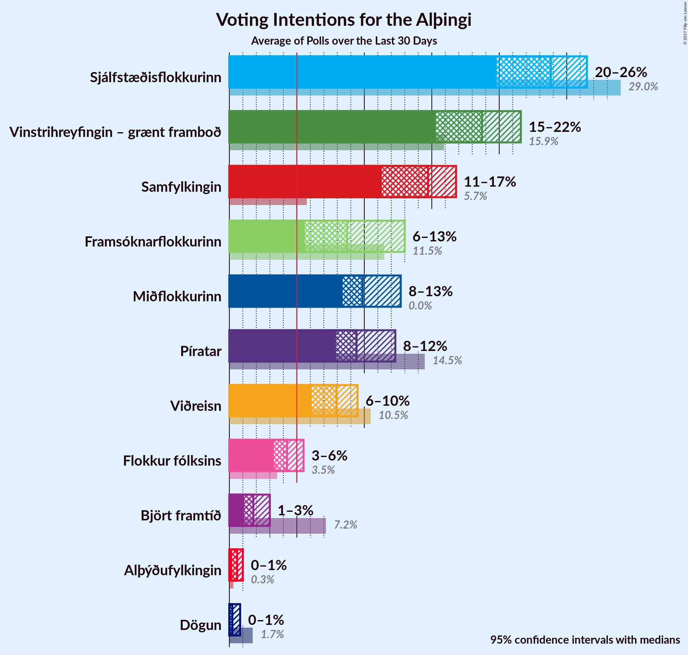
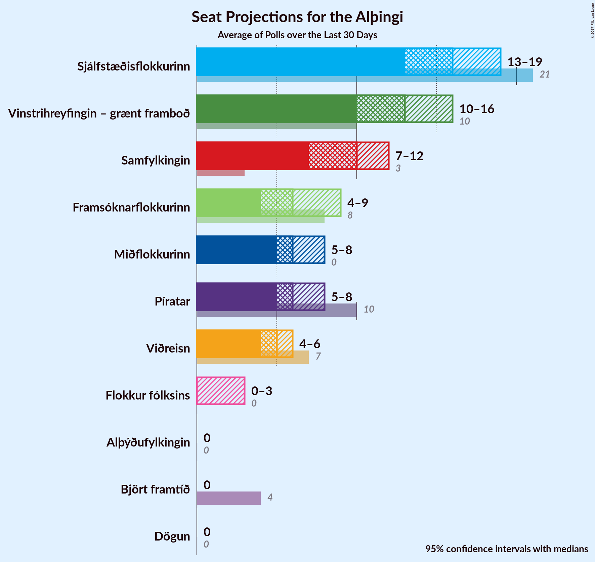
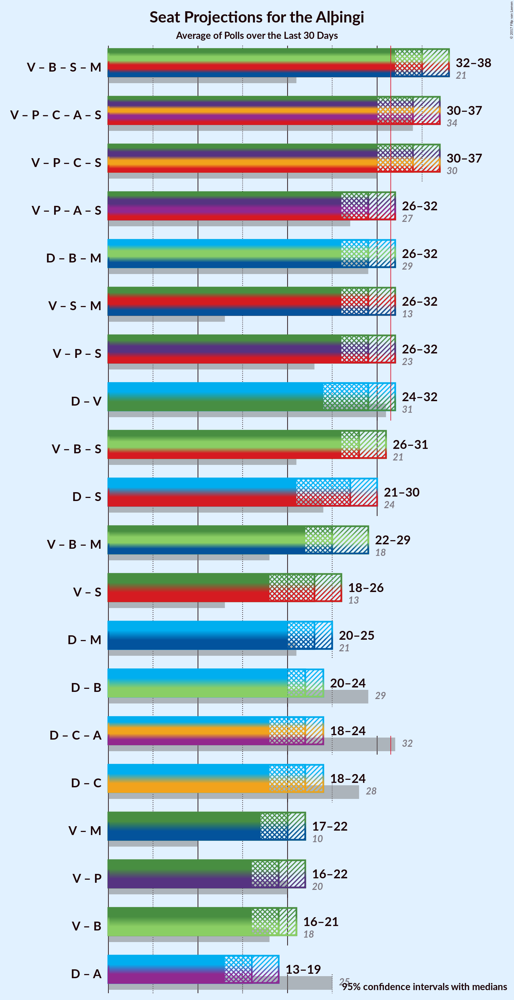

# Overview

The table below lists the last polls (less than 30 days old) before the 28 October 2017 election. The full list can be reviewed [here](all.html).

| Period                                                     | Polling firm/Commissioner(s)           | D                                  | V                                                   | P              | B                                                | C              | A           | S                                                  | F                                               | T            | R            | E            | M               | PERF             |
|:----------------------------------------------------------:|:--------------------------------------:|:----------------------------------:|:---------------------------------------------------:|:--------------:|:------------------------------------------------:|:--------------:|:-----------:|:--------------------------------------------------:|:-----------------------------------------------:|:------------:|:------------:|:------------:|:---------------:|:----------------:|
| 28 October 2017                                            | General Election                       | 25.2%   16                      | 16.9%   11                                       | 9.2%   6    | 10.7%   8                                     | 6.7%   4    | 1.2%   0 | 12.1%   7                                       | 6.9%   4                                     | 0.1%   0  | 0.2%   0  | N/A   N/A | 10.9%   7    | N/A              |
| N/A                                                        | [Poll Average](average.html)           | 20–26%   13–19                  | 15–22%   10–16                                   | 8–12%   5–8 | 6–13%   4–9                                   | 6–10%   4–6 | 1–3%   0 | 11–17%   7–12                                   | <strike>3–6%</strike>   <strike>0–3</strike> | 0–1%   0  | 0–1%   0  | N/A   N/A | 8–13%   5–8  | 10/11   10/11 |
| [23–27 October 2017](2017-10-27-Zenter.html)               | Zenter                                 | 20–25%   13–18                  | 17–22%   11–16                                   | 8–12%   5–8 | 8–12%   5–8                                   | 6–9%   4–6  | 1–3%   0 | <strike>13–17%</strike>   <strike>8–12</strike> | <strike>3–6%</strike>   <strike>0–3</strike> | 0–1%   0  | 0–1%   0  | N/A   N/A | 8–12%   5–8  | 9/11   9/11   |
| [26–27 October 2017](2017-10-27-MMR.html)                  | MMR                                    | <strike>19–24%</strike>   13–17 | 14–19%   10–13                                   | 9–13%   6–9 | 10–14%   6–9                                  | 7–10%   4–6 | 1–3%   0 | 11–15%   7–10                                   | <strike>3–6%</strike>   0–4                  | N/A   N/A | N/A   N/A | N/A   N/A | 10–14%   6–9 | 7/9   9/9     |
| [23–27 October 2017](2017-10-27-Gallup.html)               | Gallup                                 | 23–27%   16–19                  | 16–19%   11–13                                   | 8–10%   5–7 | <strike>8–10%</strike>   <strike>5–6</strike> | 7–9%   4–6  | 1–2%   0 | <strike>14–17%</strike>   <strike>9–12</strike> | <strike>3–5%</strike>   <strike>0</strike>   | 0%   0    | 0–1%   0  | N/A   N/A | 8–11%   5–8  | 8/11   9/11   |
| [22–25 October 2017](2017-10-25-Felagsvisindastofnun.html) | Félagsvísindastofnun   Morgunblaðið | 23–26%   15–18                  | <strike>19–22%</strike>   <strike>12–16</strike> | 8–10%   5–6 | <strike>7–9%</strike>   <strike>4–6</strike>  | 7–9%   4–6  | 1–2%   0 | <strike>14–17%</strike>   <strike>9–12</strike> | <strike>3–5%</strike>   <strike>0–3</strike> | N/A   N/A | N/A   N/A | N/A   N/A | 8–11%   5–7  | 5/9   5/9     |
| [23–24 October 2017](2017-10-24-Frettabladid.html)         | Fréttablaðið                           | 22–26%   15–19                  | 17–21%   <strike>12–16</strike>                  | 8–11%   5–8 | <strike>5–7%</strike>   <strike>3–5</strike>  | 6–9%   4–6  | 1–3%   0 | <strike>13–16%</strike>   <strike>9–11</strike> | <strike>3–5%</strike>   <strike>0–3</strike> | N/A   N/A | N/A   N/A | N/A   N/A | 8–11%   5–8  | 6/9   5/9     |
| 29 October 2016                                            | General Election                       | 29.0%   21                      | 15.9%   10                                       | 14.5%   10  | 11.5%   8                                     | 10.5%   7   | 7.2%   4 | 5.7%   3                                        | 3.5%   0                                     | 1.7%   0  | 0.3%   0  | 0.2%   0  | 0.0%   0     | N/A              |

Only polls for which at least the sample size has been published are included in the table above.

**Legend:**
+ **Top half of each row:** Voting intentions (95% confidence interval)
+ **Bottom half of each row:** Seat projections for the Alþingi (95% confidence interval)
+ **D:** Sjálfstæðisflokkurinn
+ **V:** Vinstrihreyfingin – grænt framboð
+ **P:** Píratar
+ **B:** Framsóknarflokkurinn
+ **C:** Viðreisn
+ **A:** Björt framtíð
+ **S:** Samfylkingin
+ **F:** Flokkur fólksins
+ **T:** Dögun
+ **R:** Alþýðufylkingin
+ **E:** Íslenska þjóðfylkingin
+ **M:** Miðflokkurinn
+ **PERF:** How well the pollster did in terms of number of results within the 95% confidence interval
+ **N/A (single party):** Party not included the published results
+ **N/A (entire row):** Calculation for this opinion poll not started yet

