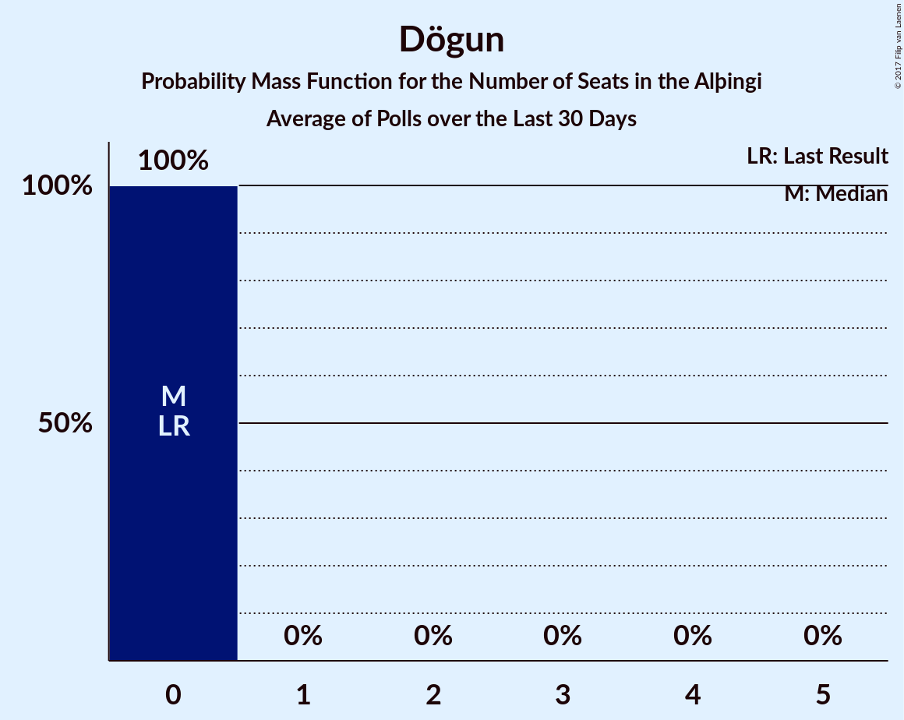

# Dögun

<a href="#voting-intentions">Voting Intentions</a> | <a href="#seats">Seats</a>

## Voting Intentions

Last result: **1.7%** (General Election of 29 October 2016)

### Confidence Intervals

| Period     | Polling firm/Commissioner(s) | Median | 80% Confidence Interval | 90% Confidence Interval | 95% Confidence Interval | 99% Confidence Interval |
|:----------:|:----------------:|:-----------:|:-----------------------:|:-----------------------:|:-----------------------:|:-----------------------:|
| N/A | [Poll Average](average.html) | 0.2% | 0.1–0.6% | 0.1–0.7% | 0.0–0.8% | 0.0–1.0% |
| [23–27 October 2017](2017-10-27-Zenter.html) | Zenter | 0.3% | 0.2–0.7% | 0.1–0.8% | 0.1–0.9% | 0.1–1.1% |
| [26–27 October 2017](2017-10-27-MMR.html) | MMR | 0.0% | N/A | N/A | N/A | N/A |
| [23–27 October 2017](2017-10-27-Gallup.html) | Gallup | 0.1% | 0.0–0.3% | 0.0–0.3% | 0.0–0.4% | 0.0–0.4% |
| [22–25 October 2017](2017-10-25-Felagsvisindastofnun.html) | Félagsvísindastofnun   Morgunblaðið | 0.0% | N/A | N/A | N/A | N/A |
| [23–24 October 2017](2017-10-24-Frettabladid.html) | Fréttablaðið | 0.0% | N/A | N/A | N/A | N/A |
| [20–23 October 2017](2017-10-23-MMR.html) | MMR | 0.0% | N/A | N/A | N/A | N/A |
| [13–19 October 2017](2017-10-19-Gallup.html) | Gallup | 0.0% | N/A | N/A | N/A | N/A |
| [16–19 October 2017](2017-10-19-Felagsvisindastofnun.html) | Félagsvísindastofnun   Morgunblaðið | 0.2% | 0.1–0.4% | 0.1–0.5% | 0.1–0.5% | 0.0–0.7% |
| [17–18 October 2017](2017-10-18-MMR.html) | MMR | 0.0% | N/A | N/A | N/A | N/A |
| [16 October 2017](2017-10-16-Frettabladid.html) | Fréttablaðið | 0.0% | N/A | N/A | N/A | N/A |
| [29 September–12 October 2017](2017-10-12-Gallup.html) | Gallup | 0.5% | 0.3–0.7% | 0.3–0.8% | 0.3–0.9% | 0.2–1.0% |
| [9–12 October 2017](2017-10-12-Felagsvisindastofnun.html) | Félagsvísindastofnun   Morgunblaðið | 0.0% | N/A | N/A | N/A | N/A |
| [6–11 October 2017](2017-10-11-MMR.html) | MMR | 0.0% | N/A | N/A | N/A | N/A |
| [10 October 2017](2017-10-10-Frettabladid.html) | Fréttablaðið | 0.0% | N/A | N/A | N/A | N/A |
| [2–6 October 2017](2017-10-06-Felagsvisindastofnun.html) | Félagsvísindastofnun   Morgunblaðið | 0.0% | 0.0–0.2% | 0.0–0.3% | 0.0–0.4% | 0.0–0.6% |
| [2–3 October 2017](2017-10-03-Frettabladid.html) | Fréttablaðið | 0.0% | N/A | N/A | N/A | N/A |
| [26–28 September 2017](2017-09-28-MMR.html) | MMR | 0.6% | 0.4–1.1% | 0.3–1.2% | 0.3–1.3% | 0.2–1.5% |
| [15–28 September 2017](2017-09-28-Gallup.html) | Gallup | 0.0% | N/A | N/A | N/A | N/A |
| [25–28 September 2017](2017-09-28-Felagsvisindastofnun.html) | Félagsvísindastofnun   Morgunblaðið | 0.0% | N/A | N/A | N/A | N/A |
| [19–21 September 2017](2017-09-21-Felagsvisindastofnun.html) | Félagsvísindastofnun   Morgunblaðið | 0.0% | N/A | N/A | N/A | N/A |
| [15–18 September 2017](2017-09-18-Zenter.html) | Zenter | 0.0% | N/A | N/A | N/A | N/A |
| [18 September 2017](2017-09-18-Frettabladid.html) | Fréttablaðið | 0.0% | N/A | N/A | N/A | N/A |
| [10–30 August 2017](2017-08-30-Gallup.html) | Gallup | 0.0% | N/A | N/A | N/A | N/A |
| [15–18 August 2017](2017-08-18-MMR.html) | MMR | 0.0% | N/A | N/A | N/A | N/A |

### Probability Mass Function

The following table shows the probability mass function per percentage block of voting intentions for the [poll average](average.html) for Dögun.

| Voting Intentions | Probability | Accumulated | Special Marks |
|:-----------------:|:-----------:|:-----------:|:-------------:|
| 0.0–0.5% | 89% | 100% | Median |
| 0.5–1.5% | 11% | 11% |  |
| 1.5–2.5% | 0% | 0% | Last Result |

## Seats

Last result: **0** seats (General Election of 29 October 2016)

### Confidence Intervals

| Period     | Polling firm/Commissioner(s) | Median | 80% Confidence Interval | 90% Confidence Interval | 95% Confidence Interval | 99% Confidence Interval |
|:----------:|:----------------:|:------:|:-----------------------:|:-----------------------:|:-----------------------:|:-----------------------:|
| N/A | [Poll Average](average.html) | 0 | 0 | 0 | 0 | 0 |
| [23–27 October 2017](2017-10-27-Zenter.html) | Zenter | 0 | 0 | 0 | 0 | 0 |
| [26–27 October 2017](2017-10-27-MMR.html) | MMR |  |  |  |  |  |
| [23–27 October 2017](2017-10-27-Gallup.html) | Gallup | 0 | 0 | 0 | 0 | 0 |
| [22–25 October 2017](2017-10-25-Felagsvisindastofnun.html) | Félagsvísindastofnun   Morgunblaðið |  |  |  |  |  |
| [23–24 October 2017](2017-10-24-Frettabladid.html) | Fréttablaðið |  |  |  |  |  |
| [20–23 October 2017](2017-10-23-MMR.html) | MMR |  |  |  |  |  |
| [13–19 October 2017](2017-10-19-Gallup.html) | Gallup |  |  |  |  |  |
| [16–19 October 2017](2017-10-19-Felagsvisindastofnun.html) | Félagsvísindastofnun   Morgunblaðið | 0 | 0 | 0 | 0 | 0 |
| [17–18 October 2017](2017-10-18-MMR.html) | MMR |  |  |  |  |  |
| [16 October 2017](2017-10-16-Frettabladid.html) | Fréttablaðið |  |  |  |  |  |
| [29 September–12 October 2017](2017-10-12-Gallup.html) | Gallup | 0 | 0 | 0 | 0 | 0 |
| [9–12 October 2017](2017-10-12-Felagsvisindastofnun.html) | Félagsvísindastofnun   Morgunblaðið |  |  |  |  |  |
| [6–11 October 2017](2017-10-11-MMR.html) | MMR |  |  |  |  |  |
| [10 October 2017](2017-10-10-Frettabladid.html) | Fréttablaðið |  |  |  |  |  |
| [2–6 October 2017](2017-10-06-Felagsvisindastofnun.html) | Félagsvísindastofnun   Morgunblaðið | 0 | 0 | 0 | 0 | 0 |
| [2–3 October 2017](2017-10-03-Frettabladid.html) | Fréttablaðið |  |  |  |  |  |
| [26–28 September 2017](2017-09-28-MMR.html) | MMR | 0 | 0 | 0 | 0 | 0 |
| [15–28 September 2017](2017-09-28-Gallup.html) | Gallup |  |  |  |  |  |
| [25–28 September 2017](2017-09-28-Felagsvisindastofnun.html) | Félagsvísindastofnun   Morgunblaðið |  |  |  |  |  |
| [19–21 September 2017](2017-09-21-Felagsvisindastofnun.html) | Félagsvísindastofnun   Morgunblaðið |  |  |  |  |  |
| [15–18 September 2017](2017-09-18-Zenter.html) | Zenter |  |  |  |  |  |
| [18 September 2017](2017-09-18-Frettabladid.html) | Fréttablaðið |  |  |  |  |  |
| [10–30 August 2017](2017-08-30-Gallup.html) | Gallup |  |  |  |  |  |
| [15–18 August 2017](2017-08-18-MMR.html) | MMR |  |  |  |  |  |

### Probability Mass Function

The following table shows the probability mass function per seat for the [poll average](average.html) for Dögun.

| Number of Seats | Probability | Accumulated | Special Marks |
|:---------------:|:-----------:|:-----------:|:-------------:|
| 0 | 100% | 100% | Last Result, Median |

