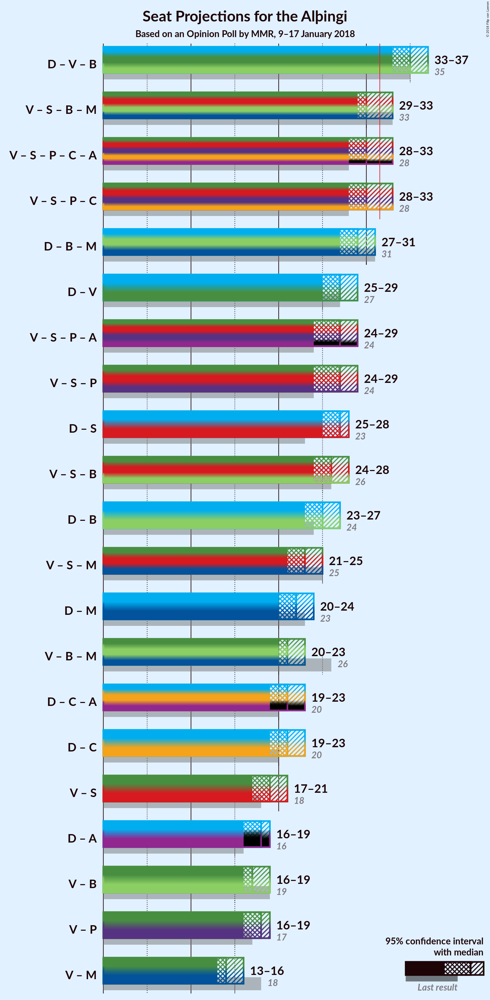

# Opinion Poll by MMR, 9–17 January 2018

<a href="#voting-intentions">Voting Intentions</a> | <a href="#seats">Seats</a> | <a href="#coalitions">Coalitions</a> | <a href="#technical-information">Technical Information</a>

## Voting Intentions

### Confidence Intervals

| Party | Last Result | Poll Result | 80% Confidence Interval | 90% Confidence Interval | 95% Confidence Interval | 99% Confidence Interval |
|:-----:|:-----------:|:-----------:|:-----------------------:|:-----------------------:|:-----------------------:|:-----------------------:|
| Sjálfstæðisflokkurinn | 25.2% | 25.8% | 24.5–27.3% |24.1–27.7% |23.8–28.0% |23.1–28.7% |
| Vinstrihreyfingin – grænt framboð | 16.9% | 15.0% | 13.9–16.2% |13.6–16.5% |13.3–16.8% |12.8–17.4% |
| Samfylkingin | 12.1% | 13.9% | 12.9–15.1% |12.6–15.4% |12.3–15.7% |11.8–16.3% |
| Píratar | 9.2% | 12.2% | 11.2–13.4% |11.0–13.7% |10.7–13.9% |10.3–14.5% |
| Framsóknarflokkurinn | 10.7% | 11.2% | 10.3–12.3% |10.0–12.6% |9.8–12.9% |9.3–13.4% |
| Miðflokkurinn | 10.9% | 6.9% | 6.1–7.8% |5.9–8.0% |5.8–8.3% |5.4–8.7% |
| Viðreisn | 6.7% | 6.2% | 5.5–7.1% |5.3–7.3% |5.1–7.5% |4.8–7.9% |
| Flokkur fólksins | 6.9% | 6.1% | 5.4–6.9% |5.2–7.2% |5.0–7.4% |4.7–7.8% |

*Note:* The poll result column reflects the actual value used in the calculations. Published results may vary slightly, and in addition be rounded to fewer digits.

## Seats

### Confidence Intervals

| Party | Last Result | Median | 80% Confidence Interval | 90% Confidence Interval | 95% Confidence Interval | 99% Confidence Interval |
|:-----:|:-----------:|:------:|:-----------------------:|:-----------------------:|:-----------------------:|:-----------------------:|
| <a href="#sjálfstæðisflokkurinn">Sjálfstæðisflokkurinn</a> | 16 | 18 | 16–19 |16–19 |16–19 |15–19 |
| <a href="#vinstrihreyfingin-–-grænt-framboð">Vinstrihreyfingin – grænt framboð</a> | 11 | 10 | 9–11 |9–11 |9–11 |8–11 |
| <a href="#samfylkingin">Samfylkingin</a> | 7 | 9 | 8–10 |8–10 |8–10 |7–11 |
| <a href="#píratar">Píratar</a> | 6 | 8 | 7–9 |7–9 |7–9 |6–9 |
| <a href="#framsóknarflokkurinn">Framsóknarflokkurinn</a> | 8 | 8 | 7–8 |6–8 |6–8 |6–9 |
| <a href="#miðflokkurinn">Miðflokkurinn</a> | 7 | 4 | 4–5 |4–5 |3–5 |3–5 |
| <a href="#viðreisn">Viðreisn</a> | 4 | 4 | 3–4 |3–4 |3–5 |0–5 |
| <a href="#flokkur-fólksins">Flokkur fólksins</a> | 4 | 4 | 3–4 |3–4 |0–4 |0–5 |

### Sjálfstæðisflokkurinn

*For a full overview of the results for this party, see the [Sjálfstæðisflokkurinn](party-sjálfstæðisflokkurinn.html) page.*

| Number of Seats | Probability | Accumulated | Special Marks |
|:---------------:|:-----------:|:-----------:|:-------------:|
| 15 | 1.5% | 100% |  |
| 16 | 17% | 98% | Last Result |
| 17 | 28% | 81% |  |
| 18 | 41% | 54% | Median |
| 19 | 12% | 13% |  |
| 20 | 0.4% | 0.4% |  |
| 21 | 0% | 0% |  |

### Vinstrihreyfingin – grænt framboð

*For a full overview of the results for this party, see the [Vinstrihreyfingin – grænt framboð](party-vinstrihreyfingin–græntframboð.html) page.*

| Number of Seats | Probability | Accumulated | Special Marks |
|:---------------:|:-----------:|:-----------:|:-------------:|
| 8 | 2% | 100% |  |
| 9 | 37% | 98% |  |
| 10 | 51% | 62% | Median |
| 11 | 10% | 10% | Last Result |
| 12 | 0.4% | 0.4% |  |
| 13 | 0% | 0% |  |

### Samfylkingin

*For a full overview of the results for this party, see the [Samfylkingin](party-samfylkingin.html) page.*

| Number of Seats | Probability | Accumulated | Special Marks |
|:---------------:|:-----------:|:-----------:|:-------------:|
| 7 | 0.8% | 100% | Last Result |
| 8 | 18% | 99.2% |  |
| 9 | 58% | 81% | Median |
| 10 | 23% | 23% |  |
| 11 | 0.8% | 0.8% |  |
| 12 | 0% | 0% |  |

### Píratar

*For a full overview of the results for this party, see the [Píratar](party-píratar.html) page.*

| Number of Seats | Probability | Accumulated | Special Marks |
|:---------------:|:-----------:|:-----------:|:-------------:|
| 6 | 1.1% | 100% | Last Result |
| 7 | 32% | 98.9% |  |
| 8 | 50% | 67% | Median |
| 9 | 16% | 17% |  |
| 10 | 0.3% | 0.3% |  |
| 11 | 0% | 0% |  |

### Framsóknarflokkurinn

*For a full overview of the results for this party, see the [Framsóknarflokkurinn](party-framsóknarflokkurinn.html) page.*

| Number of Seats | Probability | Accumulated | Special Marks |
|:---------------:|:-----------:|:-----------:|:-------------:|
| 6 | 7% | 100% |  |
| 7 | 33% | 93% |  |
| 8 | 59% | 60% | Last Result, Median |
| 9 | 1.3% | 1.3% |  |
| 10 | 0% | 0.1% |  |
| 11 | 0% | 0% |  |

### Miðflokkurinn

*For a full overview of the results for this party, see the [Miðflokkurinn](party-miðflokkurinn.html) page.*

| Number of Seats | Probability | Accumulated | Special Marks |
|:---------------:|:-----------:|:-----------:|:-------------:|
| 3 | 4% | 100% |  |
| 4 | 72% | 96% | Median |
| 5 | 24% | 24% |  |
| 6 | 0.4% | 0.4% |  |
| 7 | 0% | 0% | Last Result |

### Viðreisn

*For a full overview of the results for this party, see the [Viðreisn](party-viðreisn.html) page.*

| Number of Seats | Probability | Accumulated | Special Marks |
|:---------------:|:-----------:|:-----------:|:-------------:|
| 0 | 2% | 100% |  |
| 1 | 0.4% | 98% |  |
| 2 | 0% | 98% |  |
| 3 | 26% | 98% |  |
| 4 | 68% | 71% | Last Result, Median |
| 5 | 4% | 4% |  |
| 6 | 0% | 0% |  |

### Flokkur fólksins

*For a full overview of the results for this party, see the [Flokkur fólksins](party-flokkurfólksins.html) page.*

| Number of Seats | Probability | Accumulated | Special Marks |
|:---------------:|:-----------:|:-----------:|:-------------:|
| 0 | 3% | 100% |  |
| 1 | 0% | 97% |  |
| 2 | 0% | 97% |  |
| 3 | 40% | 97% |  |
| 4 | 55% | 57% | Last Result, Median |
| 5 | 2% | 2% |  |
| 6 | 0% | 0% |  |

## Coalitions

### Confidence Intervals

| Coalition | Last Result | Median | Majority? | 80% Confidence Interval | 90% Confidence Interval | 95% Confidence Interval | 99% Confidence Interval |
|:---------:|:-----------:|:------:|:---------:|:-----------------------:|:-----------------------:|:-----------------------:|:-----------------------:|
| Sjálfstæðisflokkurinn – Vinstrihreyfingin – grænt framboð – Framsóknarflokkurinn | 35 | 35 | 99.9% | 33–36 | 33–36 | 33–37 | 32–38 |
| Vinstrihreyfingin – grænt framboð – Samfylkingin – Framsóknarflokkurinn – Miðflokkurinn | 33 | 30 | 16% | 29–32 | 29–32 | 29–33 | 28–33 |
| Vinstrihreyfingin – grænt framboð – Samfylkingin – Píratar – Viðreisn | 28 | 30 | 14% | 29–32 | 28–32 | 28–33 | 28–33 |
| Sjálfstæðisflokkurinn – Framsóknarflokkurinn – Miðflokkurinn | 31 | 29 | 0.9% | 28–31 | 27–31 | 27–31 | 26–32 |
| Sjálfstæðisflokkurinn – Vinstrihreyfingin – grænt framboð | 27 | 27 | 0% | 26–29 | 26–29 | 25–29 | 25–30 |
| Vinstrihreyfingin – grænt framboð – Samfylkingin – Píratar | 24 | 27 | 0% | 25–28 | 25–29 | 24–29 | 24–29 |
| Sjálfstæðisflokkurinn – Samfylkingin | 23 | 27 | 0% | 25–28 | 25–28 | 25–28 | 24–29 |
| Vinstrihreyfingin – grænt framboð – Samfylkingin – Framsóknarflokkurinn | 26 | 26 | 0% | 25–28 | 25–28 | 24–28 | 24–29 |
| Sjálfstæðisflokkurinn – Framsóknarflokkurinn | 24 | 25 | 0% | 24–26 | 23–26 | 23–27 | 22–27 |
| Vinstrihreyfingin – grænt framboð – Samfylkingin – Miðflokkurinn | 25 | 23 | 0% | 22–24 | 21–25 | 21–25 | 21–26 |
| Sjálfstæðisflokkurinn – Miðflokkurinn | 23 | 22 | 0% | 20–23 | 20–23 | 20–24 | 19–24 |
| Vinstrihreyfingin – grænt framboð – Framsóknarflokkurinn – Miðflokkurinn | 26 | 21 | 0% | 20–23 | 20–23 | 20–23 | 19–24 |
| Sjálfstæðisflokkurinn – Viðreisn | 20 | 21 | 0% | 20–22 | 19–23 | 19–23 | 18–24 |
| Vinstrihreyfingin – grænt framboð – Samfylkingin | 18 | 19 | 0% | 18–20 | 17–20 | 17–21 | 17–21 |
| Vinstrihreyfingin – grænt framboð – Framsóknarflokkurinn | 19 | 17 | 0% | 16–18 | 16–19 | 16–19 | 15–19 |
| Vinstrihreyfingin – grænt framboð – Píratar | 17 | 18 | 0% | 16–19 | 16–19 | 16–19 | 15–20 |
| Vinstrihreyfingin – grænt framboð – Miðflokkurinn | 18 | 14 | 0% | 13–15 | 13–15 | 13–16 | 12–16 |

### Sjálfstæðisflokkurinn – Vinstrihreyfingin – grænt framboð – Framsóknarflokkurinn

| Number of Seats | Probability | Accumulated | Special Marks |
|:---------------:|:-----------:|:-----------:|:-------------:|
| 31 | 0.1% | 100% |  |
| 32 | 1.4% | 99.9% | Majority |
| 33 | 13% | 98.5% |  |
| 34 | 27% | 86% |  |
| 35 | 33% | 58% | Last Result |
| 36 | 22% | 26% | Median |
| 37 | 3% | 4% |  |
| 38 | 0.5% | 0.5% |  |
| 39 | 0% | 0% |  |

### Vinstrihreyfingin – grænt framboð – Samfylkingin – Framsóknarflokkurinn – Miðflokkurinn

| Number of Seats | Probability | Accumulated | Special Marks |
|:---------------:|:-----------:|:-----------:|:-------------:|
| 27 | 0.1% | 100% |  |
| 28 | 2% | 99.9% |  |
| 29 | 14% | 98% |  |
| 30 | 34% | 84% |  |
| 31 | 33% | 49% | Median |
| 32 | 12% | 16% | Majority |
| 33 | 3% | 4% | Last Result |
| 34 | 0.4% | 0.5% |  |
| 35 | 0% | 0% |  |

### Vinstrihreyfingin – grænt framboð – Samfylkingin – Píratar – Viðreisn

| Number of Seats | Probability | Accumulated | Special Marks |
|:---------------:|:-----------:|:-----------:|:-------------:|
| 27 | 0.2% | 100% |  |
| 28 | 6% | 99.8% | Last Result |
| 29 | 19% | 94% |  |
| 30 | 35% | 75% |  |
| 31 | 27% | 40% | Median |
| 32 | 9% | 14% | Majority |
| 33 | 4% | 4% |  |
| 34 | 0.4% | 0.5% |  |
| 35 | 0% | 0% |  |

### Sjálfstæðisflokkurinn – Framsóknarflokkurinn – Miðflokkurinn

| Number of Seats | Probability | Accumulated | Special Marks |
|:---------------:|:-----------:|:-----------:|:-------------:|
| 26 | 0.6% | 100% |  |
| 27 | 6% | 99.4% |  |
| 28 | 18% | 93% |  |
| 29 | 32% | 75% |  |
| 30 | 32% | 43% | Median |
| 31 | 10% | 11% | Last Result |
| 32 | 0.8% | 0.9% | Majority |
| 33 | 0.1% | 0.1% |  |
| 34 | 0% | 0% |  |

### Sjálfstæðisflokkurinn – Vinstrihreyfingin – grænt framboð

| Number of Seats | Probability | Accumulated | Special Marks |
|:---------------:|:-----------:|:-----------:|:-------------:|
| 24 | 0.2% | 100% |  |
| 25 | 4% | 99.8% |  |
| 26 | 23% | 96% |  |
| 27 | 37% | 73% | Last Result |
| 28 | 24% | 36% | Median |
| 29 | 10% | 12% |  |
| 30 | 1.2% | 1.3% |  |
| 31 | 0.1% | 0.1% |  |
| 32 | 0% | 0% | Majority |

### Vinstrihreyfingin – grænt framboð – Samfylkingin – Píratar

| Number of Seats | Probability | Accumulated | Special Marks |
|:---------------:|:-----------:|:-----------:|:-------------:|
| 24 | 3% | 100% | Last Result |
| 25 | 16% | 97% |  |
| 26 | 27% | 81% |  |
| 27 | 34% | 54% | Median |
| 28 | 15% | 20% |  |
| 29 | 5% | 5% |  |
| 30 | 0.4% | 0.5% |  |
| 31 | 0.1% | 0.1% |  |
| 32 | 0% | 0% | Majority |

### Sjálfstæðisflokkurinn – Samfylkingin

| Number of Seats | Probability | Accumulated | Special Marks |
|:---------------:|:-----------:|:-----------:|:-------------:|
| 23 | 0.2% | 100% | Last Result |
| 24 | 2% | 99.8% |  |
| 25 | 13% | 98% |  |
| 26 | 34% | 85% |  |
| 27 | 35% | 51% | Median |
| 28 | 13% | 16% |  |
| 29 | 2% | 2% |  |
| 30 | 0.1% | 0.1% |  |
| 31 | 0% | 0% |  |

### Vinstrihreyfingin – grænt framboð – Samfylkingin – Framsóknarflokkurinn

| Number of Seats | Probability | Accumulated | Special Marks |
|:---------------:|:-----------:|:-----------:|:-------------:|
| 23 | 0.2% | 100% |  |
| 24 | 3% | 99.8% |  |
| 25 | 20% | 96% |  |
| 26 | 32% | 76% | Last Result |
| 27 | 33% | 44% | Median |
| 28 | 10% | 11% |  |
| 29 | 1.3% | 1.5% |  |
| 30 | 0.1% | 0.1% |  |
| 31 | 0% | 0% |  |

### Sjálfstæðisflokkurinn – Framsóknarflokkurinn

| Number of Seats | Probability | Accumulated | Special Marks |
|:---------------:|:-----------:|:-----------:|:-------------:|
| 22 | 0.9% | 100% |  |
| 23 | 9% | 99.1% |  |
| 24 | 19% | 90% | Last Result |
| 25 | 33% | 71% |  |
| 26 | 35% | 38% | Median |
| 27 | 3% | 3% |  |
| 28 | 0.2% | 0.2% |  |
| 29 | 0% | 0% |  |

### Vinstrihreyfingin – grænt framboð – Samfylkingin – Miðflokkurinn

| Number of Seats | Probability | Accumulated | Special Marks |
|:---------------:|:-----------:|:-----------:|:-------------:|
| 20 | 0.3% | 100% |  |
| 21 | 5% | 99.7% |  |
| 22 | 26% | 95% |  |
| 23 | 42% | 68% | Median |
| 24 | 20% | 26% |  |
| 25 | 5% | 6% | Last Result |
| 26 | 1.0% | 1.0% |  |
| 27 | 0.1% | 0.1% |  |
| 28 | 0% | 0% |  |

### Sjálfstæðisflokkurinn – Miðflokkurinn

| Number of Seats | Probability | Accumulated | Special Marks |
|:---------------:|:-----------:|:-----------:|:-------------:|
| 19 | 0.9% | 100% |  |
| 20 | 15% | 99.1% |  |
| 21 | 26% | 84% |  |
| 22 | 36% | 58% | Median |
| 23 | 20% | 22% | Last Result |
| 24 | 3% | 3% |  |
| 25 | 0.2% | 0.2% |  |
| 26 | 0% | 0% |  |

### Vinstrihreyfingin – grænt framboð – Framsóknarflokkurinn – Miðflokkurinn

| Number of Seats | Probability | Accumulated | Special Marks |
|:---------------:|:-----------:|:-----------:|:-------------:|
| 18 | 0.1% | 100% |  |
| 19 | 2% | 99.9% |  |
| 20 | 14% | 98% |  |
| 21 | 37% | 84% |  |
| 22 | 33% | 47% | Median |
| 23 | 12% | 14% |  |
| 24 | 2% | 2% |  |
| 25 | 0.1% | 0.1% |  |
| 26 | 0% | 0% | Last Result |

### Sjálfstæðisflokkurinn – Viðreisn

| Number of Seats | Probability | Accumulated | Special Marks |
|:---------------:|:-----------:|:-----------:|:-------------:|
| 17 | 0.3% | 100% |  |
| 18 | 1.2% | 99.7% |  |
| 19 | 5% | 98.5% |  |
| 20 | 21% | 94% | Last Result |
| 21 | 30% | 73% |  |
| 22 | 36% | 43% | Median |
| 23 | 7% | 7% |  |
| 24 | 0.6% | 0.6% |  |
| 25 | 0% | 0% |  |

### Vinstrihreyfingin – grænt framboð – Samfylkingin

| Number of Seats | Probability | Accumulated | Special Marks |
|:---------------:|:-----------:|:-----------:|:-------------:|
| 16 | 0.4% | 100% |  |
| 17 | 9% | 99.5% |  |
| 18 | 29% | 91% | Last Result |
| 19 | 42% | 62% | Median |
| 20 | 17% | 20% |  |
| 21 | 2% | 3% |  |
| 22 | 0.1% | 0.1% |  |
| 23 | 0% | 0% |  |

### Vinstrihreyfingin – grænt framboð – Framsóknarflokkurinn

| Number of Seats | Probability | Accumulated | Special Marks |
|:---------------:|:-----------:|:-----------:|:-------------:|
| 14 | 0.1% | 100% |  |
| 15 | 2% | 99.9% |  |
| 16 | 18% | 98% |  |
| 17 | 40% | 80% |  |
| 18 | 33% | 40% | Median |
| 19 | 7% | 7% | Last Result |
| 20 | 0.3% | 0.3% |  |
| 21 | 0% | 0% |  |

### Vinstrihreyfingin – grænt framboð – Píratar

| Number of Seats | Probability | Accumulated | Special Marks |
|:---------------:|:-----------:|:-----------:|:-------------:|
| 15 | 0.6% | 100% |  |
| 16 | 14% | 99.4% |  |
| 17 | 35% | 86% | Last Result |
| 18 | 36% | 51% | Median |
| 19 | 13% | 15% |  |
| 20 | 2% | 2% |  |
| 21 | 0.1% | 0.1% |  |
| 22 | 0% | 0% |  |

### Vinstrihreyfingin – grænt framboð – Miðflokkurinn

| Number of Seats | Probability | Accumulated | Special Marks |
|:---------------:|:-----------:|:-----------:|:-------------:|
| 11 | 0.1% | 100% |  |
| 12 | 2% | 99.9% |  |
| 13 | 30% | 98% |  |
| 14 | 48% | 68% | Median |
| 15 | 17% | 21% |  |
| 16 | 3% | 3% |  |
| 17 | 0.1% | 0.1% |  |
| 18 | 0% | 0% | Last Result |

## Technical Information

### Opinion Poll

+ **Polling firm:** MMR
+ **Commissioner(s):** —
+ **Fieldwork period:** 9–17 January 2018

### Calculations

+ **Sample size:** 1594
+ **Simulations done:** 1,048,576
+ **Error estimate:** 0.96%

