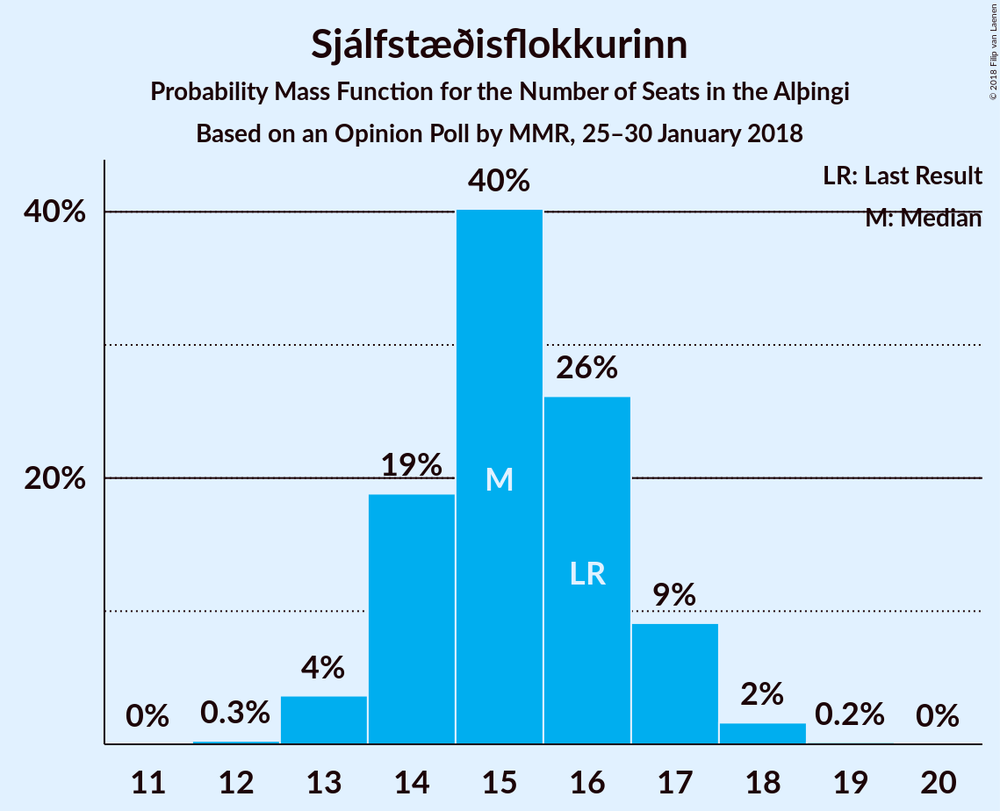
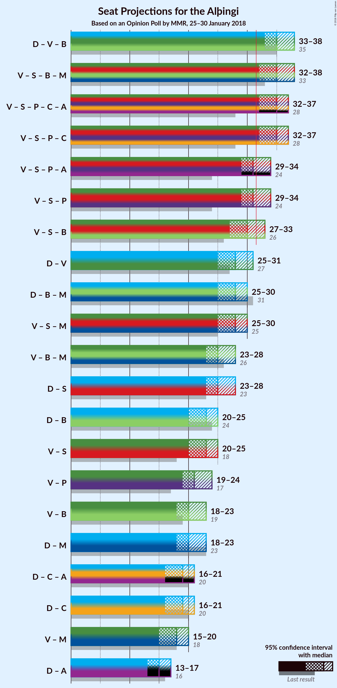

# Opinion Poll by MMR, 25–30 January 2018

<a href="#voting-intentions">Voting Intentions</a> | <a href="#seats">Seats</a> | <a href="#coalitions">Coalitions</a> | <a href="#technical-information">Technical Information</a>

## Voting Intentions

### Confidence Intervals

| Party | Last Result | Poll Result | 80% Confidence Interval | 90% Confidence Interval | 95% Confidence Interval | 99% Confidence Interval |
|:-----:|:-----------:|:-----------:|:-----------------------:|:-----------------------:|:-----------------------:|:-----------------------:|
| Sjálfstæðisflokkurinn | 25.2% | 22.3% | 20.6–24.1% |20.1–24.6% |19.7–25.1% |19.0–26.0% |
| Vinstrihreyfingin – grænt framboð | 16.9% | 18.4% | 16.9–20.1% |16.4–20.6% |16.1–21.0% |15.3–21.9% |
| Samfylkingin | 12.1% | 14.9% | 13.5–16.5% |13.1–16.9% |12.7–17.3% |12.1–18.1% |
| Píratar | 9.2% | 12.9% | 11.6–14.4% |11.2–14.9% |10.9–15.2% |10.3–16.0% |
| Framsóknarflokkurinn | 10.7% | 11.2% | 10.0–12.6% |9.6–13.0% |9.3–13.4% |8.8–14.1% |
| Miðflokkurinn | 10.9% | 7.7% | 6.6–8.9% |6.4–9.2% |6.1–9.5% |5.7–10.2% |
| Viðreisn | 6.7% | 6.0% | 5.1–7.2% |4.9–7.5% |4.7–7.8% |4.3–8.3% |
| Flokkur fólksins | 6.9% | 4.2% | 3.5–5.2% |3.3–5.5% |3.1–5.7% |2.8–6.2% |

*Note:* The poll result column reflects the actual value used in the calculations. Published results may vary slightly, and in addition be rounded to fewer digits.

## Seats

### Confidence Intervals

| Party | Last Result | Median | 80% Confidence Interval | 90% Confidence Interval | 95% Confidence Interval | 99% Confidence Interval |
|:-----:|:-----------:|:------:|:-----------------------:|:-----------------------:|:-----------------------:|:-----------------------:|
| <a href="#sjálfstæðisflokkurinn">Sjálfstæðisflokkurinn</a> | 16 | 15 | 14–16 |14–17 |13–17 |13–18 |
| <a href="#vinstrihreyfingin-–-grænt-framboð">Vinstrihreyfingin – grænt framboð</a> | 11 | 12 | 11–14 |11–14 |11–14 |10–15 |
| <a href="#samfylkingin">Samfylkingin</a> | 7 | 10 | 9–11 |9–12 |8–12 |8–12 |
| <a href="#píratar">Píratar</a> | 6 | 8 | 8–9 |7–10 |7–10 |7–11 |
| <a href="#framsóknarflokkurinn">Framsóknarflokkurinn</a> | 8 | 7 | 7–8 |6–9 |6–9 |6–10 |
| <a href="#miðflokkurinn">Miðflokkurinn</a> | 7 | 5 | 4–6 |4–6 |4–6 |4–7 |
| <a href="#viðreisn">Viðreisn</a> | 4 | 4 | 3–5 |3–5 |0–5 |0–5 |
| <a href="#flokkur-fólksins">Flokkur fólksins</a> | 4 | 0 | 0–3 |0–3 |0–3 |0–4 |

### Sjálfstæðisflokkurinn

*For a full overview of the results for this party, see the [Sjálfstæðisflokkurinn](party-sjálfstæðisflokkurinn.html) page.*

| Number of Seats | Probability | Accumulated | Special Marks |
|:---------------:|:-----------:|:-----------:|:-------------:|
| 12 | 0.1% | 100% |  |
| 13 | 4% | 99.8% |  |
| 14 | 16% | 96% |  |
| 15 | 32% | 80% | Median |
| 16 | 41% | 48% | Last Result |
| 17 | 5% | 7% |  |
| 18 | 2% | 2% |  |
| 19 | 0.1% | 0.1% |  |
| 20 | 0% | 0% |  |

### Vinstrihreyfingin – grænt framboð

*For a full overview of the results for this party, see the [Vinstrihreyfingin – grænt framboð](party-vinstrihreyfingin–græntframboð.html) page.*

| Number of Seats | Probability | Accumulated | Special Marks |
|:---------------:|:-----------:|:-----------:|:-------------:|
| 10 | 2% | 100% |  |
| 11 | 12% | 98% | Last Result |
| 12 | 46% | 86% | Median |
| 13 | 27% | 40% |  |
| 14 | 11% | 13% |  |
| 15 | 2% | 2% |  |
| 16 | 0.1% | 0.1% |  |
| 17 | 0% | 0% |  |

### Samfylkingin

*For a full overview of the results for this party, see the [Samfylkingin](party-samfylkingin.html) page.*

| Number of Seats | Probability | Accumulated | Special Marks |
|:---------------:|:-----------:|:-----------:|:-------------:|
| 7 | 0% | 100% | Last Result |
| 8 | 3% | 100% |  |
| 9 | 11% | 97% |  |
| 10 | 48% | 86% | Median |
| 11 | 31% | 38% |  |
| 12 | 6% | 7% |  |
| 13 | 0.3% | 0.3% |  |
| 14 | 0% | 0% |  |

### Píratar

*For a full overview of the results for this party, see the [Píratar](party-píratar.html) page.*

| Number of Seats | Probability | Accumulated | Special Marks |
|:---------------:|:-----------:|:-----------:|:-------------:|
| 6 | 0.1% | 100% | Last Result |
| 7 | 6% | 99.9% |  |
| 8 | 61% | 94% | Median |
| 9 | 27% | 32% |  |
| 10 | 4% | 5% |  |
| 11 | 1.3% | 1.4% |  |
| 12 | 0% | 0% |  |

### Framsóknarflokkurinn

*For a full overview of the results for this party, see the [Framsóknarflokkurinn](party-framsóknarflokkurinn.html) page.*

| Number of Seats | Probability | Accumulated | Special Marks |
|:---------------:|:-----------:|:-----------:|:-------------:|
| 5 | 0.3% | 100% |  |
| 6 | 9% | 99.7% |  |
| 7 | 42% | 91% | Median |
| 8 | 39% | 48% | Last Result |
| 9 | 9% | 9% |  |
| 10 | 0.6% | 0.6% |  |
| 11 | 0% | 0% |  |

### Miðflokkurinn

*For a full overview of the results for this party, see the [Miðflokkurinn](party-miðflokkurinn.html) page.*

| Number of Seats | Probability | Accumulated | Special Marks |
|:---------------:|:-----------:|:-----------:|:-------------:|
| 3 | 0.3% | 100% |  |
| 4 | 12% | 99.7% |  |
| 5 | 65% | 87% | Median |
| 6 | 22% | 22% |  |
| 7 | 0.6% | 0.7% | Last Result |
| 8 | 0% | 0% |  |

### Viðreisn

*For a full overview of the results for this party, see the [Viðreisn](party-viðreisn.html) page.*

| Number of Seats | Probability | Accumulated | Special Marks |
|:---------------:|:-----------:|:-----------:|:-------------:|
| 0 | 4% | 100% |  |
| 1 | 0% | 96% |  |
| 2 | 0% | 96% |  |
| 3 | 19% | 96% |  |
| 4 | 66% | 77% | Last Result, Median |
| 5 | 11% | 11% |  |
| 6 | 0.1% | 0.1% |  |
| 7 | 0% | 0% |  |

### Flokkur fólksins

*For a full overview of the results for this party, see the [Flokkur fólksins](party-flokkurfólksins.html) page.*

| Number of Seats | Probability | Accumulated | Special Marks |
|:---------------:|:-----------:|:-----------:|:-------------:|
| 0 | 89% | 100% | Median |
| 1 | 0% | 11% |  |
| 2 | 0% | 11% |  |
| 3 | 10% | 11% |  |
| 4 | 0.5% | 0.5% | Last Result |
| 5 | 0% | 0% |  |

## Coalitions

### Confidence Intervals

| Coalition | Last Result | Median | Majority? | 80% Confidence Interval | 90% Confidence Interval | 95% Confidence Interval | 99% Confidence Interval |
|:---------:|:-----------:|:------:|:---------:|:-----------------------:|:-----------------------:|:-----------------------:|:-----------------------:|
| Vinstrihreyfingin – grænt framboð – Samfylkingin – Framsóknarflokkurinn – Miðflokkurinn | 33 | 35 | 99.0% | 33–37 | 33–37 | 32–38 | 31–39 |
| Sjálfstæðisflokkurinn – Vinstrihreyfingin – grænt framboð – Framsóknarflokkurinn | 35 | 35 | 99.9% | 34–36 | 33–37 | 32–38 | 32–39 |
| Vinstrihreyfingin – grænt framboð – Samfylkingin – Píratar – Viðreisn | 28 | 35 | 98% | 33–36 | 33–37 | 32–37 | 31–38 |
| Vinstrihreyfingin – grænt framboð – Samfylkingin – Píratar | 24 | 31 | 30% | 29–33 | 29–33 | 29–34 | 28–35 |
| Vinstrihreyfingin – grænt framboð – Samfylkingin – Framsóknarflokkurinn | 26 | 30 | 11% | 29–32 | 27–32 | 27–33 | 26–34 |
| Sjálfstæðisflokkurinn – Framsóknarflokkurinn – Miðflokkurinn | 31 | 28 | 0.4% | 26–29 | 26–30 | 25–30 | 25–31 |
| Vinstrihreyfingin – grænt framboð – Samfylkingin – Miðflokkurinn | 25 | 28 | 0.3% | 26–29 | 25–30 | 25–30 | 24–31 |
| Sjálfstæðisflokkurinn – Vinstrihreyfingin – grænt framboð | 27 | 28 | 0.3% | 26–29 | 25–30 | 25–30 | 25–31 |
| Sjálfstæðisflokkurinn – Samfylkingin | 23 | 26 | 0% | 24–27 | 23–27 | 23–28 | 22–29 |
| Vinstrihreyfingin – grænt framboð – Framsóknarflokkurinn – Miðflokkurinn | 26 | 25 | 0% | 24–27 | 23–27 | 22–28 | 22–28 |
| Sjálfstæðisflokkurinn – Framsóknarflokkurinn | 24 | 23 | 0% | 21–24 | 21–25 | 20–25 | 20–26 |
| Vinstrihreyfingin – grænt framboð – Samfylkingin | 18 | 23 | 0% | 21–24 | 20–25 | 20–25 | 19–26 |
| Vinstrihreyfingin – grænt framboð – Píratar | 17 | 21 | 0% | 20–22 | 19–23 | 19–23 | 18–24 |
| Sjálfstæðisflokkurinn – Miðflokkurinn | 23 | 21 | 0% | 19–21 | 18–22 | 18–23 | 17–24 |
| Vinstrihreyfingin – grænt framboð – Framsóknarflokkurinn | 19 | 20 | 0% | 19–21 | 18–22 | 18–22 | 17–23 |
| Sjálfstæðisflokkurinn – Viðreisn | 20 | 20 | 0% | 18–20 | 17–21 | 16–21 | 15–22 |
| Vinstrihreyfingin – grænt framboð – Miðflokkurinn | 18 | 17 | 0% | 16–19 | 15–19 | 15–20 | 15–20 |

### Vinstrihreyfingin – grænt framboð – Samfylkingin – Framsóknarflokkurinn – Miðflokkurinn

| Number of Seats | Probability | Accumulated | Special Marks |
|:---------------:|:-----------:|:-----------:|:-------------:|
| 31 | 1.0% | 100% |  |
| 32 | 2% | 99.0% | Majority |
| 33 | 9% | 97% | Last Result |
| 34 | 7% | 88% | Median |
| 35 | 47% | 81% |  |
| 36 | 15% | 34% |  |
| 37 | 15% | 19% |  |
| 38 | 3% | 4% |  |
| 39 | 1.3% | 1.5% |  |
| 40 | 0.1% | 0.2% |  |
| 41 | 0% | 0% |  |

### Sjálfstæðisflokkurinn – Vinstrihreyfingin – grænt framboð – Framsóknarflokkurinn

| Number of Seats | Probability | Accumulated | Special Marks |
|:---------------:|:-----------:|:-----------:|:-------------:|
| 31 | 0.1% | 100% |  |
| 32 | 3% | 99.9% | Majority |
| 33 | 4% | 97% |  |
| 34 | 17% | 92% | Median |
| 35 | 33% | 75% | Last Result |
| 36 | 32% | 42% |  |
| 37 | 6% | 10% |  |
| 38 | 3% | 4% |  |
| 39 | 0.5% | 0.7% |  |
| 40 | 0.2% | 0.3% |  |
| 41 | 0.1% | 0.1% |  |
| 42 | 0% | 0% |  |

### Vinstrihreyfingin – grænt framboð – Samfylkingin – Píratar – Viðreisn

| Number of Seats | Probability | Accumulated | Special Marks |
|:---------------:|:-----------:|:-----------:|:-------------:|
| 28 | 0% | 100% | Last Result |
| 29 | 0% | 100% |  |
| 30 | 0.2% | 100% |  |
| 31 | 1.4% | 99.8% |  |
| 32 | 3% | 98% | Majority |
| 33 | 8% | 95% |  |
| 34 | 27% | 87% | Median |
| 35 | 36% | 61% |  |
| 36 | 15% | 25% |  |
| 37 | 8% | 9% |  |
| 38 | 1.2% | 1.3% |  |
| 39 | 0.1% | 0.1% |  |
| 40 | 0% | 0% |  |

### Vinstrihreyfingin – grænt framboð – Samfylkingin – Píratar

| Number of Seats | Probability | Accumulated | Special Marks |
|:---------------:|:-----------:|:-----------:|:-------------:|
| 24 | 0% | 100% | Last Result |
| 25 | 0% | 100% |  |
| 26 | 0% | 100% |  |
| 27 | 0.3% | 100% |  |
| 28 | 2% | 99.6% |  |
| 29 | 9% | 98% |  |
| 30 | 22% | 89% | Median |
| 31 | 37% | 67% |  |
| 32 | 18% | 30% | Majority |
| 33 | 7% | 12% |  |
| 34 | 4% | 5% |  |
| 35 | 0.4% | 0.5% |  |
| 36 | 0.1% | 0.1% |  |
| 37 | 0% | 0% |  |

### Vinstrihreyfingin – grænt framboð – Samfylkingin – Framsóknarflokkurinn

| Number of Seats | Probability | Accumulated | Special Marks |
|:---------------:|:-----------:|:-----------:|:-------------:|
| 26 | 0.8% | 100% | Last Result |
| 27 | 4% | 99.2% |  |
| 28 | 4% | 95% |  |
| 29 | 9% | 91% | Median |
| 30 | 51% | 82% |  |
| 31 | 20% | 31% |  |
| 32 | 7% | 11% | Majority |
| 33 | 3% | 4% |  |
| 34 | 1.3% | 1.4% |  |
| 35 | 0.1% | 0.1% |  |
| 36 | 0% | 0% |  |

### Sjálfstæðisflokkurinn – Framsóknarflokkurinn – Miðflokkurinn

| Number of Seats | Probability | Accumulated | Special Marks |
|:---------------:|:-----------:|:-----------:|:-------------:|
| 24 | 0.2% | 100% |  |
| 25 | 3% | 99.8% |  |
| 26 | 9% | 97% |  |
| 27 | 20% | 87% | Median |
| 28 | 36% | 67% |  |
| 29 | 26% | 32% |  |
| 30 | 3% | 5% |  |
| 31 | 1.5% | 2% | Last Result |
| 32 | 0.3% | 0.4% | Majority |
| 33 | 0.1% | 0.1% |  |
| 34 | 0% | 0% |  |

### Vinstrihreyfingin – grænt framboð – Samfylkingin – Miðflokkurinn

| Number of Seats | Probability | Accumulated | Special Marks |
|:---------------:|:-----------:|:-----------:|:-------------:|
| 23 | 0.2% | 100% |  |
| 24 | 1.3% | 99.8% |  |
| 25 | 6% | 98% | Last Result |
| 26 | 9% | 93% |  |
| 27 | 22% | 84% | Median |
| 28 | 33% | 62% |  |
| 29 | 20% | 29% |  |
| 30 | 8% | 9% |  |
| 31 | 0.6% | 0.9% |  |
| 32 | 0.3% | 0.3% | Majority |
| 33 | 0% | 0% |  |

### Sjálfstæðisflokkurinn – Vinstrihreyfingin – grænt framboð

| Number of Seats | Probability | Accumulated | Special Marks |
|:---------------:|:-----------:|:-----------:|:-------------:|
| 24 | 0.4% | 100% |  |
| 25 | 6% | 99.6% |  |
| 26 | 9% | 93% |  |
| 27 | 19% | 84% | Last Result, Median |
| 28 | 44% | 66% |  |
| 29 | 16% | 22% |  |
| 30 | 5% | 6% |  |
| 31 | 0.6% | 0.9% |  |
| 32 | 0.3% | 0.3% | Majority |
| 33 | 0% | 0% |  |

### Sjálfstæðisflokkurinn – Samfylkingin

| Number of Seats | Probability | Accumulated | Special Marks |
|:---------------:|:-----------:|:-----------:|:-------------:|
| 21 | 0% | 100% |  |
| 22 | 2% | 99.9% |  |
| 23 | 5% | 98% | Last Result |
| 24 | 11% | 93% |  |
| 25 | 27% | 83% | Median |
| 26 | 29% | 56% |  |
| 27 | 23% | 26% |  |
| 28 | 2% | 3% |  |
| 29 | 0.9% | 0.9% |  |
| 30 | 0.1% | 0.1% |  |
| 31 | 0% | 0% |  |

### Vinstrihreyfingin – grænt framboð – Framsóknarflokkurinn – Miðflokkurinn

| Number of Seats | Probability | Accumulated | Special Marks |
|:---------------:|:-----------:|:-----------:|:-------------:|
| 21 | 0.4% | 100% |  |
| 22 | 2% | 99.6% |  |
| 23 | 7% | 97% |  |
| 24 | 26% | 90% | Median |
| 25 | 35% | 64% |  |
| 26 | 15% | 29% | Last Result |
| 27 | 11% | 14% |  |
| 28 | 2% | 3% |  |
| 29 | 0.3% | 0.4% |  |
| 30 | 0.1% | 0.1% |  |
| 31 | 0% | 0% |  |

### Sjálfstæðisflokkurinn – Framsóknarflokkurinn

| Number of Seats | Probability | Accumulated | Special Marks |
|:---------------:|:-----------:|:-----------:|:-------------:|
| 19 | 0.1% | 100% |  |
| 20 | 3% | 99.9% |  |
| 21 | 10% | 97% |  |
| 22 | 23% | 87% | Median |
| 23 | 37% | 64% |  |
| 24 | 22% | 27% | Last Result |
| 25 | 3% | 5% |  |
| 26 | 1.3% | 2% |  |
| 27 | 0.3% | 0.3% |  |
| 28 | 0% | 0% |  |

### Vinstrihreyfingin – grænt framboð – Samfylkingin

| Number of Seats | Probability | Accumulated | Special Marks |
|:---------------:|:-----------:|:-----------:|:-------------:|
| 18 | 0% | 100% | Last Result |
| 19 | 2% | 100% |  |
| 20 | 4% | 98% |  |
| 21 | 7% | 94% |  |
| 22 | 25% | 86% | Median |
| 23 | 43% | 61% |  |
| 24 | 12% | 19% |  |
| 25 | 6% | 7% |  |
| 26 | 0.8% | 0.8% |  |
| 27 | 0.1% | 0.1% |  |
| 28 | 0% | 0% |  |

### Vinstrihreyfingin – grænt framboð – Píratar

| Number of Seats | Probability | Accumulated | Special Marks |
|:---------------:|:-----------:|:-----------:|:-------------:|
| 17 | 0% | 100% | Last Result |
| 18 | 0.5% | 100% |  |
| 19 | 8% | 99.4% |  |
| 20 | 40% | 92% | Median |
| 21 | 32% | 51% |  |
| 22 | 12% | 20% |  |
| 23 | 7% | 8% |  |
| 24 | 1.0% | 1.5% |  |
| 25 | 0.5% | 0.5% |  |
| 26 | 0% | 0% |  |

### Sjálfstæðisflokkurinn – Miðflokkurinn

| Number of Seats | Probability | Accumulated | Special Marks |
|:---------------:|:-----------:|:-----------:|:-------------:|
| 17 | 1.3% | 100% |  |
| 18 | 6% | 98.6% |  |
| 19 | 9% | 93% |  |
| 20 | 28% | 84% | Median |
| 21 | 49% | 56% |  |
| 22 | 4% | 7% |  |
| 23 | 2% | 3% | Last Result |
| 24 | 0.7% | 0.7% |  |
| 25 | 0% | 0% |  |

### Vinstrihreyfingin – grænt framboð – Framsóknarflokkurinn

| Number of Seats | Probability | Accumulated | Special Marks |
|:---------------:|:-----------:|:-----------:|:-------------:|
| 16 | 0.1% | 100% |  |
| 17 | 2% | 99.9% |  |
| 18 | 6% | 98% |  |
| 19 | 28% | 92% | Last Result, Median |
| 20 | 39% | 63% |  |
| 21 | 16% | 24% |  |
| 22 | 6% | 8% |  |
| 23 | 2% | 2% |  |
| 24 | 0.2% | 0.3% |  |
| 25 | 0% | 0% |  |

### Sjálfstæðisflokkurinn – Viðreisn

| Number of Seats | Probability | Accumulated | Special Marks |
|:---------------:|:-----------:|:-----------:|:-------------:|
| 13 | 0.1% | 100% |  |
| 14 | 0.2% | 99.9% |  |
| 15 | 1.2% | 99.7% |  |
| 16 | 3% | 98.6% |  |
| 17 | 4% | 96% |  |
| 18 | 28% | 92% |  |
| 19 | 13% | 64% | Median |
| 20 | 45% | 51% | Last Result |
| 21 | 5% | 6% |  |
| 22 | 2% | 2% |  |
| 23 | 0.1% | 0.1% |  |
| 24 | 0% | 0% |  |

### Vinstrihreyfingin – grænt framboð – Miðflokkurinn

| Number of Seats | Probability | Accumulated | Special Marks |
|:---------------:|:-----------:|:-----------:|:-------------:|
| 14 | 0.1% | 100% |  |
| 15 | 6% | 99.8% |  |
| 16 | 8% | 94% |  |
| 17 | 42% | 86% | Median |
| 18 | 21% | 44% | Last Result |
| 19 | 19% | 22% |  |
| 20 | 2% | 3% |  |
| 21 | 0.4% | 0.5% |  |
| 22 | 0.1% | 0.1% |  |
| 23 | 0% | 0% |  |

## Technical Information

### Opinion Poll

+ **Polling firm:** MMR
+ **Commissioner(s):** —
+ **Fieldwork period:** 25–30 January 2018

### Calculations

+ **Sample size:** 928
+ **Simulations done:** 131,072
+ **Error estimate:** 1.46%

