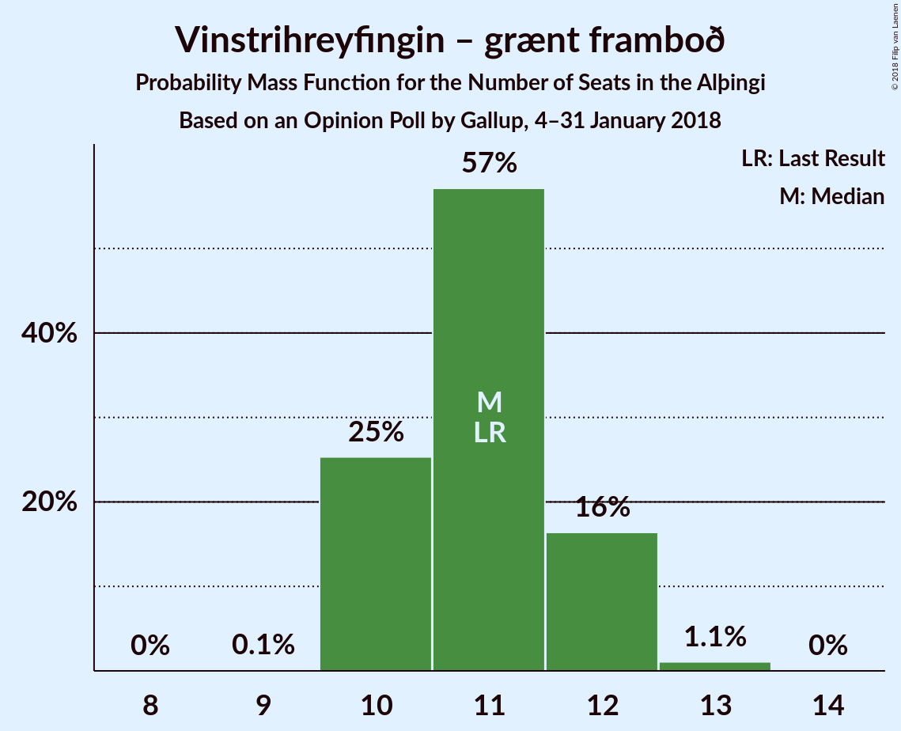

# Opinion Poll by Gallup, 4–31 January 2018

<a href="#voting-intentions">Voting Intentions</a> | <a href="#seats">Seats</a> | <a href="#coalitions">Coalitions</a> | <a href="#technical-information">Technical Information</a>

## Voting Intentions

### Confidence Intervals

| Party | Last Result | Poll Result | 80% Confidence Interval | 90% Confidence Interval | 95% Confidence Interval | 99% Confidence Interval |
|:-----:|:-----------:|:-----------:|:-----------------------:|:-----------------------:|:-----------------------:|:-----------------------:|
| Sjálfstæðisflokkurinn | 25.2% | 25.5% | 24.5–26.5% |24.2–26.8% |24.0–27.1% |23.5–27.6% |
| Vinstrihreyfingin – grænt framboð | 16.9% | 16.9% | 16.1–17.8% |15.8–18.1% |15.6–18.3% |15.2–18.7% |
| Samfylkingin | 12.1% | 16.1% | 15.3–17.0% |15.0–17.3% |14.8–17.5% |14.5–17.9% |
| Píratar | 9.2% | 10.7% | 10.0–11.5% |9.8–11.7% |9.7–11.9% |9.3–12.2% |
| Framsóknarflokkurinn | 10.7% | 9.5% | 8.9–10.2% |8.7–10.4% |8.5–10.6% |8.2–11.0% |
| Viðreisn | 6.7% | 7.3% | 6.7–7.9% |6.6–8.1% |6.4–8.3% |6.2–8.6% |
| Miðflokkurinn | 10.9% | 6.8% | 6.2–7.4% |6.1–7.6% |6.0–7.8% |5.7–8.1% |
| Flokkur fólksins | 6.9% | 5.5% | 5.0–6.1% |4.9–6.2% |4.7–6.4% |4.5–6.7% |

*Note:* The poll result column reflects the actual value used in the calculations. Published results may vary slightly, and in addition be rounded to fewer digits.

## Seats

### Confidence Intervals

| Party | Last Result | Median | 80% Confidence Interval | 90% Confidence Interval | 95% Confidence Interval | 99% Confidence Interval |
|:-----:|:-----------:|:------:|:-----------------------:|:-----------------------:|:-----------------------:|:-----------------------:|
| <a href="#sjálfstæðisflokkurinn">Sjálfstæðisflokkurinn</a> | 16 | 17 | 16–19 |16–19 |16–19 |15–19 |
| <a href="#vinstrihreyfingin-–-grænt-framboð">Vinstrihreyfingin – grænt framboð</a> | 11 | 11 | 10–12 |10–12 |10–12 |10–13 |
| <a href="#samfylkingin">Samfylkingin</a> | 7 | 10 | 10–11 |10–11 |10–11 |9–12 |
| <a href="#píratar">Píratar</a> | 6 | 7 | 6–7 |6–8 |6–8 |6–8 |
| <a href="#framsóknarflokkurinn">Framsóknarflokkurinn</a> | 8 | 6 | 5–7 |5–8 |5–8 |5–8 |
| <a href="#viðreisn">Viðreisn</a> | 4 | 4 | 4–5 |4–5 |4–5 |4–5 |
| <a href="#miðflokkurinn">Miðflokkurinn</a> | 7 | 4 | 4 |4–5 |3–5 |3–5 |
| <a href="#flokkur-fólksins">Flokkur fólksins</a> | 4 | 3 | 3–4 |0–4 |0–4 |0–4 |

### Sjálfstæðisflokkurinn

*For a full overview of the results for this party, see the [Sjálfstæðisflokkurinn](party-sjálfstæðisflokkurinn.html) page.*

| Number of Seats | Probability | Accumulated | Special Marks |
|:---------------:|:-----------:|:-----------:|:-------------:|
| 15 | 1.2% | 100% |  |
| 16 | 15% | 98.8% | Last Result |
| 17 | 37% | 84% | Median |
| 18 | 27% | 47% |  |
| 19 | 20% | 20% |  |
| 20 | 0% | 0% |  |

### Vinstrihreyfingin – grænt framboð

*For a full overview of the results for this party, see the [Vinstrihreyfingin – grænt framboð](party-vinstrihreyfingin–græntframboð.html) page.*

| Number of Seats | Probability | Accumulated | Special Marks |
|:---------------:|:-----------:|:-----------:|:-------------:|
| 9 | 0.1% | 100% |  |
| 10 | 25% | 99.9% |  |
| 11 | 57% | 75% | Last Result, Median |
| 12 | 16% | 17% |  |
| 13 | 1.1% | 1.1% |  |
| 14 | 0% | 0% |  |

### Samfylkingin

*For a full overview of the results for this party, see the [Samfylkingin](party-samfylkingin.html) page.*

| Number of Seats | Probability | Accumulated | Special Marks |
|:---------------:|:-----------:|:-----------:|:-------------:|
| 7 | 0% | 100% | Last Result |
| 8 | 0% | 100% |  |
| 9 | 2% | 100% |  |
| 10 | 59% | 98% | Median |
| 11 | 37% | 39% |  |
| 12 | 2% | 2% |  |
| 13 | 0% | 0% |  |

### Píratar

*For a full overview of the results for this party, see the [Píratar](party-píratar.html) page.*

| Number of Seats | Probability | Accumulated | Special Marks |
|:---------------:|:-----------:|:-----------:|:-------------:|
| 5 | 0.1% | 100% |  |
| 6 | 40% | 99.9% | Last Result |
| 7 | 54% | 60% | Median |
| 8 | 6% | 6% |  |
| 9 | 0% | 0% |  |

### Framsóknarflokkurinn

*For a full overview of the results for this party, see the [Framsóknarflokkurinn](party-framsóknarflokkurinn.html) page.*

| Number of Seats | Probability | Accumulated | Special Marks |
|:---------------:|:-----------:|:-----------:|:-------------:|
| 5 | 16% | 100% |  |
| 6 | 67% | 84% | Median |
| 7 | 11% | 17% |  |
| 8 | 6% | 6% | Last Result |
| 9 | 0% | 0% |  |

### Viðreisn

*For a full overview of the results for this party, see the [Viðreisn](party-viðreisn.html) page.*

| Number of Seats | Probability | Accumulated | Special Marks |
|:---------------:|:-----------:|:-----------:|:-------------:|
| 3 | 0.3% | 100% |  |
| 4 | 50% | 99.7% | Last Result, Median |
| 5 | 49% | 49% |  |
| 6 | 0.1% | 0.1% |  |
| 7 | 0% | 0% |  |

### Miðflokkurinn

*For a full overview of the results for this party, see the [Miðflokkurinn](party-miðflokkurinn.html) page.*

| Number of Seats | Probability | Accumulated | Special Marks |
|:---------------:|:-----------:|:-----------:|:-------------:|
| 3 | 3% | 100% |  |
| 4 | 87% | 97% | Median |
| 5 | 10% | 10% |  |
| 6 | 0% | 0% |  |
| 7 | 0% | 0% | Last Result |

### Flokkur fólksins

*For a full overview of the results for this party, see the [Flokkur fólksins](party-flokkurfólksins.html) page.*

| Number of Seats | Probability | Accumulated | Special Marks |
|:---------------:|:-----------:|:-----------:|:-------------:|
| 0 | 9% | 100% |  |
| 1 | 0% | 91% |  |
| 2 | 0% | 91% |  |
| 3 | 77% | 91% | Median |
| 4 | 14% | 14% | Last Result |
| 5 | 0% | 0% |  |

## Coalitions

### Confidence Intervals

| Coalition | Last Result | Median | Majority? | 80% Confidence Interval | 90% Confidence Interval | 95% Confidence Interval | 99% Confidence Interval |
|:---------:|:-----------:|:------:|:---------:|:-----------------------:|:-----------------------:|:-----------------------:|:-----------------------:|
| Sjálfstæðisflokkurinn – Vinstrihreyfingin – grænt framboð – Framsóknarflokkurinn | 35 | 34 | 100% | 33–36 | 33–36 | 33–36 | 32–37 |
| Vinstrihreyfingin – grænt framboð – Samfylkingin – Píratar – Viðreisn | 28 | 32 | 79% | 31–34 | 31–34 | 31–35 | 30–36 |
| Vinstrihreyfingin – grænt framboð – Samfylkingin – Framsóknarflokkurinn – Miðflokkurinn | 33 | 31 | 46% | 30–33 | 30–34 | 30–34 | 29–35 |
| Vinstrihreyfingin – grænt framboð – Samfylkingin – Framsóknarflokkurinn | 26 | 27 | 0% | 26–29 | 26–29 | 26–30 | 25–30 |
| Vinstrihreyfingin – grænt framboð – Samfylkingin – Píratar | 24 | 28 | 0.2% | 27–29 | 26–30 | 26–30 | 26–31 |
| Sjálfstæðisflokkurinn – Samfylkingin | 23 | 28 | 0% | 26–29 | 26–29 | 26–30 | 25–30 |
| Sjálfstæðisflokkurinn – Vinstrihreyfingin – grænt framboð | 27 | 28 | 0% | 27–30 | 27–30 | 26–30 | 26–31 |
| Sjálfstæðisflokkurinn – Framsóknarflokkurinn – Miðflokkurinn | 31 | 28 | 0% | 26–29 | 26–29 | 26–29 | 26–30 |
| Vinstrihreyfingin – grænt framboð – Samfylkingin – Miðflokkurinn | 25 | 25 | 0% | 24–27 | 24–27 | 24–28 | 24–28 |
| Sjálfstæðisflokkurinn – Framsóknarflokkurinn | 24 | 24 | 0% | 22–25 | 22–25 | 22–25 | 21–25 |
| Sjálfstæðisflokkurinn – Viðreisn | 20 | 22 | 0% | 21–23 | 20–24 | 20–24 | 19–24 |
| Vinstrihreyfingin – grænt framboð – Framsóknarflokkurinn – Miðflokkurinn | 26 | 21 | 0% | 20–22 | 20–23 | 20–23 | 19–24 |
| Sjálfstæðisflokkurinn – Miðflokkurinn | 23 | 21 | 0% | 20–23 | 20–23 | 20–23 | 19–24 |
| Vinstrihreyfingin – grænt framboð – Samfylkingin | 18 | 21 | 0% | 20–22 | 20–23 | 20–23 | 20–24 |
| Vinstrihreyfingin – grænt framboð – Framsóknarflokkurinn | 19 | 17 | 0% | 16–18 | 16–19 | 16–19 | 15–19 |
| Vinstrihreyfingin – grænt framboð – Píratar | 17 | 18 | 0% | 16–19 | 16–19 | 16–19 | 16–20 |
| Vinstrihreyfingin – grænt framboð – Miðflokkurinn | 18 | 15 | 0% | 14–16 | 14–16 | 14–17 | 14–17 |

### Sjálfstæðisflokkurinn – Vinstrihreyfingin – grænt framboð – Framsóknarflokkurinn

| Number of Seats | Probability | Accumulated | Special Marks |
|:---------------:|:-----------:|:-----------:|:-------------:|
| 32 | 0.8% | 100% | Majority |
| 33 | 13% | 99.2% |  |
| 34 | 36% | 86% | Median |
| 35 | 35% | 50% | Last Result |
| 36 | 13% | 14% |  |
| 37 | 2% | 2% |  |
| 38 | 0.1% | 0.1% |  |
| 39 | 0% | 0% |  |

### Vinstrihreyfingin – grænt framboð – Samfylkingin – Píratar – Viðreisn

| Number of Seats | Probability | Accumulated | Special Marks |
|:---------------:|:-----------:|:-----------:|:-------------:|
| 28 | 0% | 100% | Last Result |
| 29 | 0% | 100% |  |
| 30 | 2% | 100% |  |
| 31 | 19% | 98% |  |
| 32 | 30% | 79% | Median, Majority |
| 33 | 34% | 50% |  |
| 34 | 11% | 16% |  |
| 35 | 4% | 5% |  |
| 36 | 1.0% | 1.0% |  |
| 37 | 0% | 0% |  |

### Vinstrihreyfingin – grænt framboð – Samfylkingin – Framsóknarflokkurinn – Miðflokkurinn

| Number of Seats | Probability | Accumulated | Special Marks |
|:---------------:|:-----------:|:-----------:|:-------------:|
| 29 | 1.0% | 100% |  |
| 30 | 21% | 99.0% |  |
| 31 | 32% | 78% | Median |
| 32 | 28% | 46% | Majority |
| 33 | 13% | 18% | Last Result |
| 34 | 5% | 5% |  |
| 35 | 0.5% | 0.5% |  |
| 36 | 0.1% | 0.1% |  |
| 37 | 0% | 0% |  |

### Vinstrihreyfingin – grænt framboð – Samfylkingin – Framsóknarflokkurinn

| Number of Seats | Probability | Accumulated | Special Marks |
|:---------------:|:-----------:|:-----------:|:-------------:|
| 25 | 1.3% | 100% |  |
| 26 | 20% | 98.7% | Last Result |
| 27 | 34% | 78% | Median |
| 28 | 28% | 44% |  |
| 29 | 12% | 16% |  |
| 30 | 3% | 4% |  |
| 31 | 0.4% | 0.4% |  |
| 32 | 0% | 0% | Majority |

### Vinstrihreyfingin – grænt framboð – Samfylkingin – Píratar

| Number of Seats | Probability | Accumulated | Special Marks |
|:---------------:|:-----------:|:-----------:|:-------------:|
| 24 | 0% | 100% | Last Result |
| 25 | 0.1% | 100% |  |
| 26 | 8% | 99.9% |  |
| 27 | 25% | 92% |  |
| 28 | 37% | 67% | Median |
| 29 | 23% | 30% |  |
| 30 | 5% | 7% |  |
| 31 | 2% | 2% |  |
| 32 | 0.2% | 0.2% | Majority |
| 33 | 0% | 0% |  |

### Sjálfstæðisflokkurinn – Samfylkingin

| Number of Seats | Probability | Accumulated | Special Marks |
|:---------------:|:-----------:|:-----------:|:-------------:|
| 23 | 0% | 100% | Last Result |
| 24 | 0% | 100% |  |
| 25 | 0.8% | 100% |  |
| 26 | 10% | 99.2% |  |
| 27 | 25% | 90% | Median |
| 28 | 33% | 65% |  |
| 29 | 28% | 32% |  |
| 30 | 4% | 4% |  |
| 31 | 0.3% | 0.3% |  |
| 32 | 0% | 0% | Majority |

### Sjálfstæðisflokkurinn – Vinstrihreyfingin – grænt framboð

| Number of Seats | Probability | Accumulated | Special Marks |
|:---------------:|:-----------:|:-----------:|:-------------:|
| 25 | 0.2% | 100% |  |
| 26 | 3% | 99.8% |  |
| 27 | 15% | 97% | Last Result |
| 28 | 34% | 82% | Median |
| 29 | 32% | 48% |  |
| 30 | 15% | 16% |  |
| 31 | 0.8% | 0.8% |  |
| 32 | 0% | 0% | Majority |

### Sjálfstæðisflokkurinn – Framsóknarflokkurinn – Miðflokkurinn

| Number of Seats | Probability | Accumulated | Special Marks |
|:---------------:|:-----------:|:-----------:|:-------------:|
| 25 | 0.4% | 100% |  |
| 26 | 11% | 99.5% |  |
| 27 | 34% | 88% | Median |
| 28 | 34% | 54% |  |
| 29 | 19% | 21% |  |
| 30 | 1.4% | 1.4% |  |
| 31 | 0% | 0% | Last Result |

### Vinstrihreyfingin – grænt framboð – Samfylkingin – Miðflokkurinn

| Number of Seats | Probability | Accumulated | Special Marks |
|:---------------:|:-----------:|:-----------:|:-------------:|
| 23 | 0.4% | 100% |  |
| 24 | 16% | 99.6% |  |
| 25 | 40% | 83% | Last Result, Median |
| 26 | 33% | 44% |  |
| 27 | 8% | 11% |  |
| 28 | 2% | 3% |  |
| 29 | 0.1% | 0.1% |  |
| 30 | 0% | 0% |  |

### Sjálfstæðisflokkurinn – Framsóknarflokkurinn

| Number of Seats | Probability | Accumulated | Special Marks |
|:---------------:|:-----------:|:-----------:|:-------------:|
| 21 | 0.5% | 100% |  |
| 22 | 13% | 99.4% |  |
| 23 | 34% | 87% | Median |
| 24 | 34% | 53% | Last Result |
| 25 | 18% | 19% |  |
| 26 | 0.4% | 0.4% |  |
| 27 | 0% | 0% |  |

### Sjálfstæðisflokkurinn – Viðreisn

| Number of Seats | Probability | Accumulated | Special Marks |
|:---------------:|:-----------:|:-----------:|:-------------:|
| 19 | 0.7% | 100% |  |
| 20 | 7% | 99.3% | Last Result |
| 21 | 27% | 92% | Median |
| 22 | 30% | 65% |  |
| 23 | 26% | 34% |  |
| 24 | 8% | 8% |  |
| 25 | 0% | 0% |  |

### Vinstrihreyfingin – grænt framboð – Framsóknarflokkurinn – Miðflokkurinn

| Number of Seats | Probability | Accumulated | Special Marks |
|:---------------:|:-----------:|:-----------:|:-------------:|
| 19 | 2% | 100% |  |
| 20 | 30% | 98% |  |
| 21 | 35% | 68% | Median |
| 22 | 24% | 33% |  |
| 23 | 8% | 9% |  |
| 24 | 0.8% | 0.9% |  |
| 25 | 0.1% | 0.1% |  |
| 26 | 0% | 0% | Last Result |

### Sjálfstæðisflokkurinn – Miðflokkurinn

| Number of Seats | Probability | Accumulated | Special Marks |
|:---------------:|:-----------:|:-----------:|:-------------:|
| 19 | 1.1% | 100% |  |
| 20 | 14% | 98.9% |  |
| 21 | 36% | 85% | Median |
| 22 | 27% | 49% |  |
| 23 | 21% | 22% | Last Result |
| 24 | 0.9% | 0.9% |  |
| 25 | 0% | 0% |  |

### Vinstrihreyfingin – grænt framboð – Samfylkingin

| Number of Seats | Probability | Accumulated | Special Marks |
|:---------------:|:-----------:|:-----------:|:-------------:|
| 18 | 0% | 100% | Last Result |
| 19 | 0.4% | 100% |  |
| 20 | 17% | 99.6% |  |
| 21 | 42% | 83% | Median |
| 22 | 33% | 41% |  |
| 23 | 7% | 8% |  |
| 24 | 1.4% | 1.4% |  |
| 25 | 0% | 0% |  |

### Vinstrihreyfingin – grænt framboð – Framsóknarflokkurinn

| Number of Seats | Probability | Accumulated | Special Marks |
|:---------------:|:-----------:|:-----------:|:-------------:|
| 15 | 2% | 100% |  |
| 16 | 30% | 98% |  |
| 17 | 39% | 68% | Median |
| 18 | 22% | 29% |  |
| 19 | 6% | 6% | Last Result |
| 20 | 0.5% | 0.5% |  |
| 21 | 0% | 0% |  |

### Vinstrihreyfingin – grænt framboð – Píratar

| Number of Seats | Probability | Accumulated | Special Marks |
|:---------------:|:-----------:|:-----------:|:-------------:|
| 16 | 11% | 100% |  |
| 17 | 36% | 89% | Last Result |
| 18 | 36% | 52% | Median |
| 19 | 14% | 17% |  |
| 20 | 2% | 2% |  |
| 21 | 0% | 0% |  |

### Vinstrihreyfingin – grænt framboð – Miðflokkurinn

| Number of Seats | Probability | Accumulated | Special Marks |
|:---------------:|:-----------:|:-----------:|:-------------:|
| 13 | 0.3% | 100% |  |
| 14 | 25% | 99.7% |  |
| 15 | 52% | 75% | Median |
| 16 | 20% | 23% |  |
| 17 | 3% | 3% |  |
| 18 | 0.1% | 0.1% | Last Result |
| 19 | 0% | 0% |  |

## Technical Information

### Opinion Poll

+ **Polling firm:** Gallup
+ **Commissioner(s):** —
+ **Fieldwork period:** 4–31 January 2018

### Calculations

+ **Sample size:** 3016
+ **Simulations done:** 1,048,576
+ **Error estimate:** 0.85%

