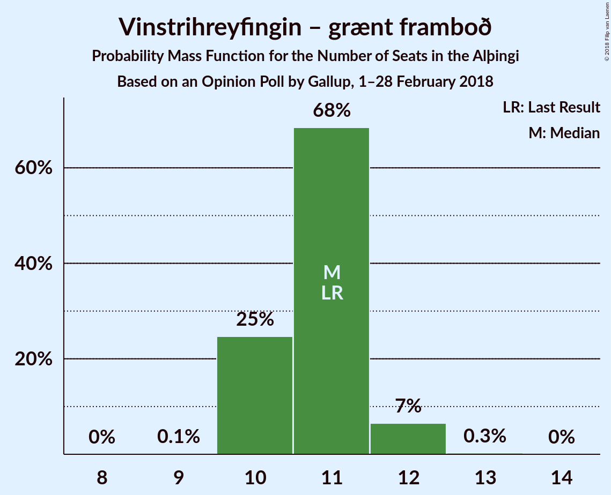
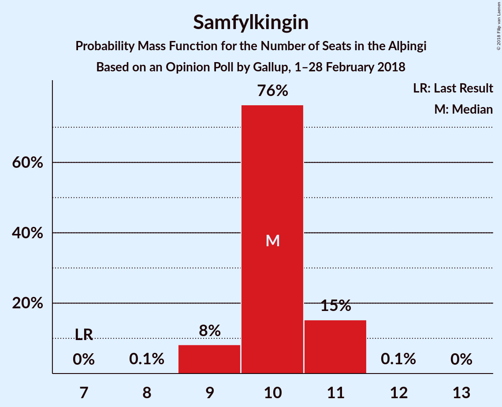
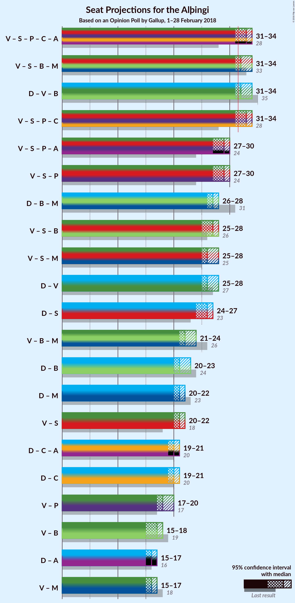

# Opinion Poll by Gallup, 1–28 February 2018

<a href="#voting-intentions">Voting Intentions</a> | <a href="#seats">Seats</a> | <a href="#coalitions">Coalitions</a> | <a href="#technical-information">Technical Information</a>

## Voting Intentions

### Confidence Intervals

| Party | Last Result | Poll Result | 80% Confidence Interval | 90% Confidence Interval | 95% Confidence Interval | 99% Confidence Interval |
|:-----:|:-----------:|:-----------:|:-----------------------:|:-----------------------:|:-----------------------:|:-----------------------:|
| Sjálfstæðisflokkurinn | 25.2% | 23.5% | 22.5–24.5% |22.2–24.8% |22.0–25.0% |21.6–25.5% |
| Vinstrihreyfingin – grænt framboð | 16.9% | 16.6% | 15.7–17.5% |15.5–17.7% |15.3–17.9% |14.9–18.4% |
| Samfylkingin | 12.1% | 15.3% | 14.5–16.1% |14.2–16.4% |14.1–16.6% |13.7–17.0% |
| Píratar | 9.2% | 11.9% | 11.2–12.7% |11.0–12.9% |10.8–13.1% |10.5–13.5% |
| Framsóknarflokkurinn | 10.7% | 9.3% | 8.7–10.0% |8.5–10.2% |8.3–10.4% |8.0–10.7% |
| Miðflokkurinn | 10.9% | 8.6% | 8.0–9.3% |7.8–9.4% |7.6–9.6% |7.4–10.0% |
| Viðreisn | 6.7% | 6.8% | 6.2–7.4% |6.1–7.6% |6.0–7.7% |5.7–8.0% |
| Flokkur fólksins | 6.9% | 5.9% | 5.4–6.5% |5.2–6.6% |5.1–6.8% |4.9–7.1% |

*Note:* The poll result column reflects the actual value used in the calculations. Published results may vary slightly, and in addition be rounded to fewer digits.

## Seats

### Confidence Intervals

| Party | Last Result | Median | 80% Confidence Interval | 90% Confidence Interval | 95% Confidence Interval | 99% Confidence Interval |
|:-----:|:-----------:|:------:|:-----------------------:|:-----------------------:|:-----------------------:|:-----------------------:|
| <a href="#sjálfstæðisflokkurinn">Sjálfstæðisflokkurinn</a> | 16 | 16 | 15–16 |15–16 |15–17 |14–17 |
| <a href="#vinstrihreyfingin-–-grænt-framboð">Vinstrihreyfingin – grænt framboð</a> | 11 | 11 | 10–11 |10–11 |10–12 |10–12 |
| <a href="#samfylkingin">Samfylkingin</a> | 7 | 10 | 10 |9–11 |9–11 |9–11 |
| <a href="#píratar">Píratar</a> | 6 | 8 | 7–8 |7–8 |7–9 |7–9 |
| <a href="#framsóknarflokkurinn">Framsóknarflokkurinn</a> | 8 | 6 | 5–6 |5–6 |5–7 |5–7 |
| <a href="#miðflokkurinn">Miðflokkurinn</a> | 7 | 5 | 5–6 |5–6 |5–6 |5–6 |
| <a href="#viðreisn">Viðreisn</a> | 4 | 4 | 4–5 |4–5 |4–5 |3–5 |
| <a href="#flokkur-fólksins">Flokkur fólksins</a> | 4 | 3 | 3–4 |3–4 |3–4 |0–4 |

### Sjálfstæðisflokkurinn

*For a full overview of the results for this party, see the [Sjálfstæðisflokkurinn](party-sjálfstæðisflokkurinn.html) page.*

| Number of Seats | Probability | Accumulated | Special Marks |
|:---------------:|:-----------:|:-----------:|:-------------:|
| 14 | 2% | 100% |  |
| 15 | 47% | 98% |  |
| 16 | 48% | 52% | Last Result, Median |
| 17 | 3% | 4% |  |
| 18 | 0.5% | 0.5% |  |
| 19 | 0% | 0% |  |

### Vinstrihreyfingin – grænt framboð

*For a full overview of the results for this party, see the [Vinstrihreyfingin – grænt framboð](party-vinstrihreyfingin–græntframboð.html) page.*

| Number of Seats | Probability | Accumulated | Special Marks |
|:---------------:|:-----------:|:-----------:|:-------------:|
| 9 | 0.1% | 100% |  |
| 10 | 32% | 99.9% |  |
| 11 | 65% | 68% | Last Result, Median |
| 12 | 4% | 4% |  |
| 13 | 0.2% | 0.2% |  |
| 14 | 0% | 0% |  |

### Samfylkingin

*For a full overview of the results for this party, see the [Samfylkingin](party-samfylkingin.html) page.*

| Number of Seats | Probability | Accumulated | Special Marks |
|:---------------:|:-----------:|:-----------:|:-------------:|
| 7 | 0% | 100% | Last Result |
| 8 | 0.1% | 100% |  |
| 9 | 7% | 99.9% |  |
| 10 | 86% | 93% | Median |
| 11 | 7% | 7% |  |
| 12 | 0.1% | 0.1% |  |
| 13 | 0% | 0% |  |

### Píratar

*For a full overview of the results for this party, see the [Píratar](party-píratar.html) page.*

| Number of Seats | Probability | Accumulated | Special Marks |
|:---------------:|:-----------:|:-----------:|:-------------:|
| 6 | 0.1% | 100% | Last Result |
| 7 | 20% | 99.9% |  |
| 8 | 77% | 80% | Median |
| 9 | 3% | 3% |  |
| 10 | 0% | 0% |  |

### Framsóknarflokkurinn

*For a full overview of the results for this party, see the [Framsóknarflokkurinn](party-framsóknarflokkurinn.html) page.*

| Number of Seats | Probability | Accumulated | Special Marks |
|:---------------:|:-----------:|:-----------:|:-------------:|
| 5 | 14% | 100% |  |
| 6 | 82% | 86% | Median |
| 7 | 4% | 4% |  |
| 8 | 0.4% | 0.4% | Last Result |
| 9 | 0% | 0% |  |

### Miðflokkurinn

*For a full overview of the results for this party, see the [Miðflokkurinn](party-miðflokkurinn.html) page.*

| Number of Seats | Probability | Accumulated | Special Marks |
|:---------------:|:-----------:|:-----------:|:-------------:|
| 4 | 0.4% | 100% |  |
| 5 | 66% | 99.6% | Median |
| 6 | 33% | 33% |  |
| 7 | 0.1% | 0.1% | Last Result |
| 8 | 0% | 0% |  |

### Viðreisn

*For a full overview of the results for this party, see the [Viðreisn](party-viðreisn.html) page.*

| Number of Seats | Probability | Accumulated | Special Marks |
|:---------------:|:-----------:|:-----------:|:-------------:|
| 3 | 1.4% | 100% |  |
| 4 | 73% | 98.6% | Last Result, Median |
| 5 | 26% | 26% |  |
| 6 | 0% | 0% |  |

### Flokkur fólksins

*For a full overview of the results for this party, see the [Flokkur fólksins](party-flokkurfólksins.html) page.*

| Number of Seats | Probability | Accumulated | Special Marks |
|:---------------:|:-----------:|:-----------:|:-------------:|
| 0 | 1.0% | 100% |  |
| 1 | 0% | 99.0% |  |
| 2 | 0% | 99.0% |  |
| 3 | 53% | 99.0% | Median |
| 4 | 46% | 46% | Last Result |
| 5 | 0.1% | 0.1% |  |
| 6 | 0% | 0% |  |

## Coalitions

### Confidence Intervals

| Coalition | Last Result | Median | Majority? | 80% Confidence Interval | 90% Confidence Interval | 95% Confidence Interval | 99% Confidence Interval |
|:---------:|:-----------:|:------:|:---------:|:-----------------------:|:-----------------------:|:-----------------------:|:-----------------------:|
| Sjálfstæðisflokkurinn – Vinstrihreyfingin – grænt framboð – Framsóknarflokkurinn | 35 | 32 | 80% | 31–33 | 31–33 | 31–34 | 30–35 |
| Vinstrihreyfingin – grænt framboð – Samfylkingin – Píratar – Viðreisn | 28 | 33 | 97% | 32–34 | 32–34 | 31–34 | 30–35 |
| Vinstrihreyfingin – grænt framboð – Samfylkingin – Framsóknarflokkurinn – Miðflokkurinn | 33 | 32 | 75% | 31–33 | 31–33 | 30–34 | 30–34 |
| Vinstrihreyfingin – grænt framboð – Samfylkingin – Píratar | 24 | 29 | 0.1% | 28–29 | 27–29 | 27–30 | 26–31 |
| Sjálfstæðisflokkurinn – Framsóknarflokkurinn – Miðflokkurinn | 31 | 27 | 0% | 26–28 | 26–28 | 26–28 | 25–29 |
| Vinstrihreyfingin – grænt framboð – Samfylkingin – Framsóknarflokkurinn | 26 | 27 | 0% | 26–27 | 25–28 | 25–28 | 25–29 |
| Sjálfstæðisflokkurinn – Vinstrihreyfingin – grænt framboð | 27 | 26 | 0% | 25–27 | 25–27 | 25–28 | 25–29 |
| Vinstrihreyfingin – grænt framboð – Samfylkingin – Miðflokkurinn | 25 | 26 | 0% | 25–27 | 25–27 | 24–28 | 24–28 |
| Sjálfstæðisflokkurinn – Samfylkingin | 23 | 26 | 0% | 25–26 | 25–26 | 25–27 | 24–28 |
| Vinstrihreyfingin – grænt framboð – Framsóknarflokkurinn – Miðflokkurinn | 26 | 22 | 0% | 21–23 | 21–23 | 21–24 | 20–24 |
| Sjálfstæðisflokkurinn – Framsóknarflokkurinn | 24 | 21 | 0% | 21–22 | 21–22 | 20–23 | 20–24 |
| Sjálfstæðisflokkurinn – Miðflokkurinn | 23 | 21 | 0% | 20–22 | 20–22 | 20–22 | 20–23 |
| Vinstrihreyfingin – grænt framboð – Samfylkingin | 18 | 21 | 0% | 20–21 | 20–22 | 19–22 | 19–23 |
| Sjálfstæðisflokkurinn – Viðreisn | 20 | 20 | 0% | 19–20 | 19–21 | 19–21 | 18–22 |
| Vinstrihreyfingin – grænt framboð – Píratar | 17 | 19 | 0% | 18–19 | 18–19 | 17–19 | 17–20 |
| Vinstrihreyfingin – grænt framboð – Framsóknarflokkurinn | 19 | 17 | 0% | 16–17 | 16–18 | 15–18 | 15–18 |
| Vinstrihreyfingin – grænt framboð – Miðflokkurinn | 18 | 16 | 0% | 15–17 | 15–17 | 15–17 | 15–18 |

### Sjálfstæðisflokkurinn – Vinstrihreyfingin – grænt framboð – Framsóknarflokkurinn

| Number of Seats | Probability | Accumulated | Special Marks |
|:---------------:|:-----------:|:-----------:|:-------------:|
| 30 | 2% | 100% |  |
| 31 | 18% | 98% |  |
| 32 | 45% | 80% | Majority |
| 33 | 31% | 35% | Median |
| 34 | 3% | 4% |  |
| 35 | 0.5% | 0.5% | Last Result |
| 36 | 0% | 0% |  |

### Vinstrihreyfingin – grænt framboð – Samfylkingin – Píratar – Viðreisn

| Number of Seats | Probability | Accumulated | Special Marks |
|:---------------:|:-----------:|:-----------:|:-------------:|
| 28 | 0% | 100% | Last Result |
| 29 | 0% | 100% |  |
| 30 | 0.7% | 100% |  |
| 31 | 2% | 99.3% |  |
| 32 | 26% | 97% | Majority |
| 33 | 61% | 71% | Median |
| 34 | 9% | 10% |  |
| 35 | 0.8% | 0.9% |  |
| 36 | 0.2% | 0.2% |  |
| 37 | 0% | 0% |  |

### Vinstrihreyfingin – grænt framboð – Samfylkingin – Framsóknarflokkurinn – Miðflokkurinn

| Number of Seats | Probability | Accumulated | Special Marks |
|:---------------:|:-----------:|:-----------:|:-------------:|
| 30 | 4% | 100% |  |
| 31 | 20% | 96% |  |
| 32 | 54% | 75% | Median, Majority |
| 33 | 17% | 21% | Last Result |
| 34 | 4% | 4% |  |
| 35 | 0.2% | 0.2% |  |
| 36 | 0% | 0% |  |

### Vinstrihreyfingin – grænt framboð – Samfylkingin – Píratar

| Number of Seats | Probability | Accumulated | Special Marks |
|:---------------:|:-----------:|:-----------:|:-------------:|
| 24 | 0% | 100% | Last Result |
| 25 | 0% | 100% |  |
| 26 | 0.7% | 100% |  |
| 27 | 5% | 99.3% |  |
| 28 | 36% | 94% |  |
| 29 | 55% | 58% | Median |
| 30 | 2% | 3% |  |
| 31 | 0.6% | 0.7% |  |
| 32 | 0.1% | 0.1% | Majority |
| 33 | 0% | 0% |  |

### Sjálfstæðisflokkurinn – Framsóknarflokkurinn – Miðflokkurinn

| Number of Seats | Probability | Accumulated | Special Marks |
|:---------------:|:-----------:|:-----------:|:-------------:|
| 25 | 0.8% | 100% |  |
| 26 | 35% | 99.2% |  |
| 27 | 53% | 65% | Median |
| 28 | 10% | 12% |  |
| 29 | 2% | 2% |  |
| 30 | 0.2% | 0.2% |  |
| 31 | 0% | 0% | Last Result |

### Vinstrihreyfingin – grænt framboð – Samfylkingin – Framsóknarflokkurinn

| Number of Seats | Probability | Accumulated | Special Marks |
|:---------------:|:-----------:|:-----------:|:-------------:|
| 24 | 0.1% | 100% |  |
| 25 | 7% | 99.9% |  |
| 26 | 31% | 93% | Last Result |
| 27 | 56% | 62% | Median |
| 28 | 5% | 6% |  |
| 29 | 0.8% | 0.8% |  |
| 30 | 0.1% | 0.1% |  |
| 31 | 0% | 0% |  |

### Sjálfstæðisflokkurinn – Vinstrihreyfingin – grænt framboð

| Number of Seats | Probability | Accumulated | Special Marks |
|:---------------:|:-----------:|:-----------:|:-------------:|
| 25 | 19% | 100% |  |
| 26 | 41% | 81% |  |
| 27 | 35% | 40% | Last Result, Median |
| 28 | 4% | 5% |  |
| 29 | 0.6% | 0.6% |  |
| 30 | 0% | 0% |  |

### Vinstrihreyfingin – grænt framboð – Samfylkingin – Miðflokkurinn

| Number of Seats | Probability | Accumulated | Special Marks |
|:---------------:|:-----------:|:-----------:|:-------------:|
| 24 | 3% | 100% |  |
| 25 | 17% | 97% | Last Result |
| 26 | 54% | 79% | Median |
| 27 | 22% | 25% |  |
| 28 | 3% | 3% |  |
| 29 | 0.2% | 0.2% |  |
| 30 | 0% | 0% |  |

### Sjálfstæðisflokkurinn – Samfylkingin

| Number of Seats | Probability | Accumulated | Special Marks |
|:---------------:|:-----------:|:-----------:|:-------------:|
| 23 | 0% | 100% | Last Result |
| 24 | 1.4% | 100% |  |
| 25 | 48% | 98.6% |  |
| 26 | 47% | 51% | Median |
| 27 | 3% | 4% |  |
| 28 | 0.8% | 0.8% |  |
| 29 | 0% | 0% |  |

### Vinstrihreyfingin – grænt framboð – Framsóknarflokkurinn – Miðflokkurinn

| Number of Seats | Probability | Accumulated | Special Marks |
|:---------------:|:-----------:|:-----------:|:-------------:|
| 20 | 0.7% | 100% |  |
| 21 | 24% | 99.3% |  |
| 22 | 56% | 75% | Median |
| 23 | 16% | 19% |  |
| 24 | 3% | 3% |  |
| 25 | 0.1% | 0.1% |  |
| 26 | 0% | 0% | Last Result |

### Sjálfstæðisflokkurinn – Framsóknarflokkurinn

| Number of Seats | Probability | Accumulated | Special Marks |
|:---------------:|:-----------:|:-----------:|:-------------:|
| 19 | 0.1% | 100% |  |
| 20 | 5% | 99.9% |  |
| 21 | 51% | 95% |  |
| 22 | 40% | 45% | Median |
| 23 | 4% | 4% |  |
| 24 | 0.5% | 0.6% | Last Result |
| 25 | 0% | 0% |  |

### Sjálfstæðisflokkurinn – Miðflokkurinn

| Number of Seats | Probability | Accumulated | Special Marks |
|:---------------:|:-----------:|:-----------:|:-------------:|
| 19 | 0.5% | 100% |  |
| 20 | 30% | 99.5% |  |
| 21 | 53% | 70% | Median |
| 22 | 16% | 17% |  |
| 23 | 0.7% | 0.9% | Last Result |
| 24 | 0.2% | 0.2% |  |
| 25 | 0% | 0% |  |

### Vinstrihreyfingin – grænt framboð – Samfylkingin

| Number of Seats | Probability | Accumulated | Special Marks |
|:---------------:|:-----------:|:-----------:|:-------------:|
| 18 | 0% | 100% | Last Result |
| 19 | 4% | 100% |  |
| 20 | 27% | 96% |  |
| 21 | 63% | 69% | Median |
| 22 | 6% | 6% |  |
| 23 | 0.5% | 0.6% |  |
| 24 | 0.1% | 0.1% |  |
| 25 | 0% | 0% |  |

### Sjálfstæðisflokkurinn – Viðreisn

| Number of Seats | Probability | Accumulated | Special Marks |
|:---------------:|:-----------:|:-----------:|:-------------:|
| 18 | 2% | 100% |  |
| 19 | 29% | 98% |  |
| 20 | 60% | 69% | Last Result, Median |
| 21 | 8% | 10% |  |
| 22 | 1.2% | 1.3% |  |
| 23 | 0% | 0% |  |

### Vinstrihreyfingin – grænt framboð – Píratar

| Number of Seats | Probability | Accumulated | Special Marks |
|:---------------:|:-----------:|:-----------:|:-------------:|
| 17 | 5% | 100% | Last Result |
| 18 | 38% | 95% |  |
| 19 | 55% | 57% | Median |
| 20 | 2% | 2% |  |
| 21 | 0.4% | 0.4% |  |
| 22 | 0% | 0% |  |

### Vinstrihreyfingin – grænt framboð – Framsóknarflokkurinn

| Number of Seats | Probability | Accumulated | Special Marks |
|:---------------:|:-----------:|:-----------:|:-------------:|
| 15 | 3% | 100% |  |
| 16 | 37% | 97% |  |
| 17 | 54% | 60% | Median |
| 18 | 5% | 6% |  |
| 19 | 0.3% | 0.3% | Last Result |
| 20 | 0% | 0% |  |

### Vinstrihreyfingin – grænt framboð – Miðflokkurinn

| Number of Seats | Probability | Accumulated | Special Marks |
|:---------------:|:-----------:|:-----------:|:-------------:|
| 14 | 0.2% | 100% |  |
| 15 | 19% | 99.8% |  |
| 16 | 57% | 81% | Median |
| 17 | 22% | 23% |  |
| 18 | 1.3% | 1.3% | Last Result |
| 19 | 0% | 0% |  |

## Technical Information

### Opinion Poll

+ **Polling firm:** Gallup
+ **Commissioner(s):** —
+ **Fieldwork period:** 1–28 February 2018

### Calculations

+ **Sample size:** 3077
+ **Simulations done:** 131,072
+ **Error estimate:** 0.81%

