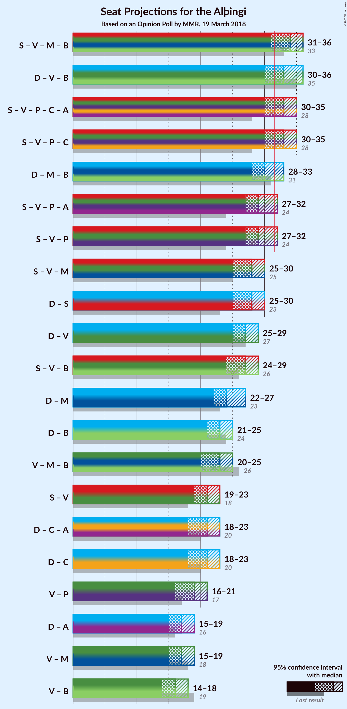
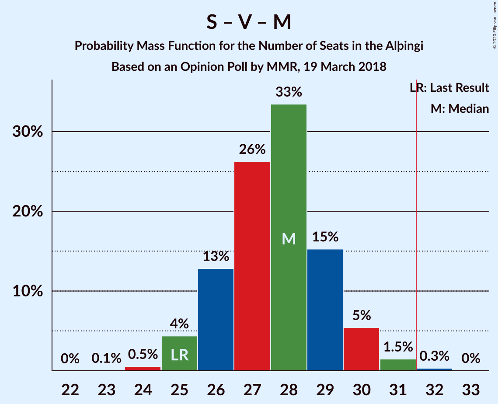

# Opinion Poll by MMR, 19 March 2018

<a href="#voting-intentions">Voting Intentions</a> | <a href="#seats">Seats</a> | <a href="#coalitions">Coalitions</a> | <a href="#technical-information">Technical Information</a>

## Voting Intentions

### Confidence Intervals

| Party | Last Result | Poll Result | 80% Confidence Interval | 90% Confidence Interval | 95% Confidence Interval | 99% Confidence Interval |
|:-----:|:-----------:|:-----------:|:-----------------------:|:-----------------------:|:-----------------------:|:-----------------------:|
| Sjálfstæðisflokkurinn | 25.2% | 25.3% | 23.5–27.2% |23.0–27.7% |22.6–28.2% |21.7–29.1% |
| Samfylkingin | 12.1% | 16.0% | 14.6–17.7% |14.2–18.2% |13.8–18.6% |13.1–19.4% |
| Vinstrihreyfingin – grænt framboð | 16.9% | 14.8% | 13.4–16.4% |13.0–16.9% |12.7–17.3% |12.0–18.1% |
| Píratar | 9.2% | 13.2% | 11.8–14.7% |11.5–15.2% |11.1–15.5% |10.5–16.3% |
| Miðflokkurinn | 10.9% | 10.7% | 9.4–12.1% |9.1–12.5% |8.8–12.8% |8.3–13.6% |
| Framsóknarflokkurinn | 10.7% | 9.0% | 7.9–10.3% |7.6–10.7% |7.3–11.1% |6.8–11.7% |
| Viðreisn | 6.7% | 6.0% | 5.1–7.2% |4.9–7.5% |4.7–7.8% |4.3–8.4% |
| Flokkur fólksins | 6.9% | 3.6% | 2.9–4.6% |2.8–4.8% |2.6–5.1% |2.3–5.5% |

*Note:* The poll result column reflects the actual value used in the calculations. Published results may vary slightly, and in addition be rounded to fewer digits.

## Seats

### Confidence Intervals

| Party | Last Result | Median | 80% Confidence Interval | 90% Confidence Interval | 95% Confidence Interval | 99% Confidence Interval |
|:-----:|:-----------:|:------:|:-----------------------:|:-----------------------:|:-----------------------:|:-----------------------:|
| <a href="#sjálfstæðisflokkurinn">Sjálfstæðisflokkurinn</a> | 16 | 17 | 16–18 |16–19 |15–19 |15–20 |
| <a href="#samfylkingin">Samfylkingin</a> | 7 | 11 | 10–12 |9–12 |9–12 |9–13 |
| <a href="#vinstrihreyfingin-–-grænt-framboð">Vinstrihreyfingin – grænt framboð</a> | 11 | 10 | 9–11 |8–11 |8–12 |8–12 |
| <a href="#píratar">Píratar</a> | 6 | 9 | 8–10 |8–10 |7–11 |7–11 |
| <a href="#miðflokkurinn">Miðflokkurinn</a> | 7 | 7 | 6–8 |6–9 |6–9 |5–9 |
| <a href="#framsóknarflokkurinn">Framsóknarflokkurinn</a> | 8 | 6 | 5–7 |5–7 |5–7 |4–8 |
| <a href="#viðreisn">Viðreisn</a> | 4 | 4 | 3–4 |0–5 |0–5 |0–5 |
| <a href="#flokkur-fólksins">Flokkur fólksins</a> | 4 | 0 | 0 |0 |0–3 |0–3 |

### Sjálfstæðisflokkurinn

*For a full overview of the results for this party, see the [Sjálfstæðisflokkurinn](party-sjálfstæðisflokkurinn.html) page.*

| Number of Seats | Probability | Accumulated | Special Marks |
|:---------------:|:-----------:|:-----------:|:-------------:|
| 14 | 0.5% | 100% |  |
| 15 | 3% | 99.5% |  |
| 16 | 19% | 96% | Last Result |
| 17 | 37% | 77% | Median |
| 18 | 33% | 40% |  |
| 19 | 6% | 7% |  |
| 20 | 1.3% | 2% |  |
| 21 | 0.2% | 0.2% |  |
| 22 | 0% | 0% |  |

### Samfylkingin

*For a full overview of the results for this party, see the [Samfylkingin](party-samfylkingin.html) page.*

| Number of Seats | Probability | Accumulated | Special Marks |
|:---------------:|:-----------:|:-----------:|:-------------:|
| 7 | 0% | 100% | Last Result |
| 8 | 0.3% | 100% |  |
| 9 | 6% | 99.7% |  |
| 10 | 31% | 93% |  |
| 11 | 35% | 63% | Median |
| 12 | 26% | 28% |  |
| 13 | 1.4% | 2% |  |
| 14 | 0.2% | 0.2% |  |
| 15 | 0% | 0% |  |

### Vinstrihreyfingin – grænt framboð

*For a full overview of the results for this party, see the [Vinstrihreyfingin – grænt framboð](party-vinstrihreyfingin–græntframboð.html) page.*

| Number of Seats | Probability | Accumulated | Special Marks |
|:---------------:|:-----------:|:-----------:|:-------------:|
| 7 | 0.1% | 100% |  |
| 8 | 7% | 99.9% |  |
| 9 | 28% | 93% |  |
| 10 | 39% | 65% | Median |
| 11 | 22% | 26% | Last Result |
| 12 | 3% | 3% |  |
| 13 | 0.4% | 0.4% |  |
| 14 | 0% | 0% |  |

### Píratar

*For a full overview of the results for this party, see the [Píratar](party-píratar.html) page.*

| Number of Seats | Probability | Accumulated | Special Marks |
|:---------------:|:-----------:|:-----------:|:-------------:|
| 6 | 0.1% | 100% | Last Result |
| 7 | 3% | 99.9% |  |
| 8 | 33% | 97% |  |
| 9 | 36% | 64% | Median |
| 10 | 24% | 28% |  |
| 11 | 4% | 4% |  |
| 12 | 0.2% | 0.2% |  |
| 13 | 0% | 0% |  |

### Miðflokkurinn

*For a full overview of the results for this party, see the [Miðflokkurinn](party-miðflokkurinn.html) page.*

| Number of Seats | Probability | Accumulated | Special Marks |
|:---------------:|:-----------:|:-----------:|:-------------:|
| 5 | 2% | 100% |  |
| 6 | 29% | 98% |  |
| 7 | 53% | 69% | Last Result, Median |
| 8 | 9% | 16% |  |
| 9 | 7% | 7% |  |
| 10 | 0.3% | 0.3% |  |
| 11 | 0% | 0% |  |

### Framsóknarflokkurinn

*For a full overview of the results for this party, see the [Framsóknarflokkurinn](party-framsóknarflokkurinn.html) page.*

| Number of Seats | Probability | Accumulated | Special Marks |
|:---------------:|:-----------:|:-----------:|:-------------:|
| 4 | 2% | 100% |  |
| 5 | 45% | 98% |  |
| 6 | 40% | 53% | Median |
| 7 | 11% | 13% |  |
| 8 | 2% | 2% | Last Result |
| 9 | 0% | 0% |  |

### Viðreisn

*For a full overview of the results for this party, see the [Viðreisn](party-viðreisn.html) page.*

| Number of Seats | Probability | Accumulated | Special Marks |
|:---------------:|:-----------:|:-----------:|:-------------:|
| 0 | 7% | 100% |  |
| 1 | 0.1% | 93% |  |
| 2 | 0% | 93% |  |
| 3 | 34% | 93% |  |
| 4 | 50% | 59% | Last Result, Median |
| 5 | 8% | 9% |  |
| 6 | 0.3% | 0.3% |  |
| 7 | 0% | 0% |  |

### Flokkur fólksins

*For a full overview of the results for this party, see the [Flokkur fólksins](party-flokkurfólksins.html) page.*

| Number of Seats | Probability | Accumulated | Special Marks |
|:---------------:|:-----------:|:-----------:|:-------------:|
| 0 | 97% | 100% | Median |
| 1 | 0% | 3% |  |
| 2 | 0% | 3% |  |
| 3 | 3% | 3% |  |
| 4 | 0.1% | 0.1% | Last Result |
| 5 | 0% | 0% |  |

## Coalitions

### Confidence Intervals

| Coalition | Last Result | Median | Majority? | 80% Confidence Interval | 90% Confidence Interval | 95% Confidence Interval | 99% Confidence Interval |
|:---------:|:-----------:|:------:|:---------:|:-----------------------:|:-----------------------:|:-----------------------:|:-----------------------:|
| Samfylkingin – Vinstrihreyfingin – grænt framboð – Miðflokkurinn – Framsóknarflokkurinn | 33 | 33 | 92% | 32–35 | 31–36 | 31–36 | 30–37 |
| Sjálfstæðisflokkurinn – Vinstrihreyfingin – grænt framboð – Framsóknarflokkurinn | 35 | 33 | 86% | 31–34 | 31–35 | 30–36 | 29–37 |
| Samfylkingin – Vinstrihreyfingin – grænt framboð – Píratar – Viðreisn | 28 | 33 | 89% | 31–34 | 30–35 | 30–35 | 29–36 |
| Sjálfstæðisflokkurinn – Miðflokkurinn – Framsóknarflokkurinn | 31 | 30 | 10% | 29–31 | 28–33 | 28–33 | 27–34 |
| Samfylkingin – Vinstrihreyfingin – grænt framboð – Píratar | 24 | 30 | 5% | 28–31 | 27–32 | 27–32 | 26–33 |
| Sjálfstæðisflokkurinn – Samfylkingin | 23 | 28 | 0.3% | 26–30 | 26–30 | 26–30 | 25–31 |
| Samfylkingin – Vinstrihreyfingin – grænt framboð – Miðflokkurinn | 25 | 27 | 0.5% | 26–29 | 26–30 | 25–30 | 24–31 |
| Sjálfstæðisflokkurinn – Vinstrihreyfingin – grænt framboð | 27 | 27 | 0% | 25–29 | 25–29 | 25–30 | 24–30 |
| Samfylkingin – Vinstrihreyfingin – grænt framboð – Framsóknarflokkurinn | 26 | 26 | 0% | 25–28 | 24–28 | 24–29 | 24–30 |
| Sjálfstæðisflokkurinn – Miðflokkurinn | 23 | 24 | 0% | 23–26 | 23–27 | 22–27 | 21–28 |
| Sjálfstæðisflokkurinn – Framsóknarflokkurinn | 24 | 23 | 0% | 21–24 | 21–25 | 21–25 | 20–26 |
| Vinstrihreyfingin – grænt framboð – Miðflokkurinn – Framsóknarflokkurinn | 26 | 22 | 0% | 21–24 | 21–25 | 20–25 | 20–26 |
| Samfylkingin – Vinstrihreyfingin – grænt framboð | 18 | 21 | 0% | 19–22 | 19–23 | 18–23 | 18–24 |
| Sjálfstæðisflokkurinn – Viðreisn | 20 | 21 | 0% | 19–22 | 18–23 | 18–23 | 16–24 |
| Vinstrihreyfingin – grænt framboð – Píratar | 17 | 19 | 0% | 17–20 | 17–21 | 17–21 | 16–22 |
| Vinstrihreyfingin – grænt framboð – Miðflokkurinn | 18 | 17 | 0% | 16–19 | 15–19 | 15–19 | 14–20 |
| Vinstrihreyfingin – grænt framboð – Framsóknarflokkurinn | 19 | 15 | 0% | 14–17 | 14–17 | 13–18 | 13–19 |

### Samfylkingin – Vinstrihreyfingin – grænt framboð – Miðflokkurinn – Framsóknarflokkurinn

| Number of Seats | Probability | Accumulated | Special Marks |
|:---------------:|:-----------:|:-----------:|:-------------:|
| 29 | 0.1% | 100% |  |
| 30 | 1.3% | 99.9% |  |
| 31 | 7% | 98.7% |  |
| 32 | 22% | 92% | Majority |
| 33 | 28% | 70% | Last Result |
| 34 | 25% | 43% | Median |
| 35 | 12% | 18% |  |
| 36 | 5% | 6% |  |
| 37 | 1.1% | 2% |  |
| 38 | 0.4% | 0.4% |  |
| 39 | 0% | 0% |  |

### Sjálfstæðisflokkurinn – Vinstrihreyfingin – grænt framboð – Framsóknarflokkurinn

| Number of Seats | Probability | Accumulated | Special Marks |
|:---------------:|:-----------:|:-----------:|:-------------:|
| 29 | 0.7% | 100% |  |
| 30 | 2% | 99.3% |  |
| 31 | 11% | 97% |  |
| 32 | 36% | 86% | Majority |
| 33 | 20% | 51% | Median |
| 34 | 23% | 30% |  |
| 35 | 4% | 7% | Last Result |
| 36 | 2% | 3% |  |
| 37 | 0.4% | 0.5% |  |
| 38 | 0.1% | 0.1% |  |
| 39 | 0% | 0% |  |

### Samfylkingin – Vinstrihreyfingin – grænt framboð – Píratar – Viðreisn

| Number of Seats | Probability | Accumulated | Special Marks |
|:---------------:|:-----------:|:-----------:|:-------------:|
| 28 | 0.2% | 100% | Last Result |
| 29 | 0.9% | 99.7% |  |
| 30 | 5% | 98.8% |  |
| 31 | 5% | 94% |  |
| 32 | 11% | 89% | Majority |
| 33 | 34% | 78% |  |
| 34 | 37% | 44% | Median |
| 35 | 6% | 7% |  |
| 36 | 0.8% | 0.9% |  |
| 37 | 0.1% | 0.1% |  |
| 38 | 0% | 0% |  |

### Sjálfstæðisflokkurinn – Miðflokkurinn – Framsóknarflokkurinn

| Number of Seats | Probability | Accumulated | Special Marks |
|:---------------:|:-----------:|:-----------:|:-------------:|
| 26 | 0.1% | 100% |  |
| 27 | 0.9% | 99.8% |  |
| 28 | 8% | 99.0% |  |
| 29 | 38% | 91% |  |
| 30 | 34% | 53% | Median |
| 31 | 9% | 19% | Last Result |
| 32 | 4% | 10% | Majority |
| 33 | 5% | 6% |  |
| 34 | 0.8% | 1.1% |  |
| 35 | 0.2% | 0.2% |  |
| 36 | 0% | 0% |  |

### Samfylkingin – Vinstrihreyfingin – grænt framboð – Píratar

| Number of Seats | Probability | Accumulated | Special Marks |
|:---------------:|:-----------:|:-----------:|:-------------:|
| 24 | 0% | 100% | Last Result |
| 25 | 0.1% | 100% |  |
| 26 | 0.9% | 99.9% |  |
| 27 | 6% | 99.0% |  |
| 28 | 11% | 93% |  |
| 29 | 17% | 82% |  |
| 30 | 43% | 65% | Median |
| 31 | 16% | 21% |  |
| 32 | 4% | 5% | Majority |
| 33 | 0.8% | 1.3% |  |
| 34 | 0.5% | 0.5% |  |
| 35 | 0% | 0% |  |

### Sjálfstæðisflokkurinn – Samfylkingin

| Number of Seats | Probability | Accumulated | Special Marks |
|:---------------:|:-----------:|:-----------:|:-------------:|
| 23 | 0% | 100% | Last Result |
| 24 | 0.2% | 100% |  |
| 25 | 2% | 99.8% |  |
| 26 | 10% | 98% |  |
| 27 | 18% | 88% |  |
| 28 | 34% | 70% | Median |
| 29 | 21% | 36% |  |
| 30 | 14% | 15% |  |
| 31 | 0.8% | 1.1% |  |
| 32 | 0.3% | 0.3% | Majority |
| 33 | 0% | 0% |  |

### Samfylkingin – Vinstrihreyfingin – grænt framboð – Miðflokkurinn

| Number of Seats | Probability | Accumulated | Special Marks |
|:---------------:|:-----------:|:-----------:|:-------------:|
| 24 | 0.9% | 100% |  |
| 25 | 4% | 99.1% | Last Result |
| 26 | 12% | 95% |  |
| 27 | 34% | 83% |  |
| 28 | 23% | 50% | Median |
| 29 | 19% | 27% |  |
| 30 | 6% | 8% |  |
| 31 | 2% | 2% |  |
| 32 | 0.4% | 0.5% | Majority |
| 33 | 0.1% | 0.1% |  |
| 34 | 0% | 0% |  |

### Sjálfstæðisflokkurinn – Vinstrihreyfingin – grænt framboð

| Number of Seats | Probability | Accumulated | Special Marks |
|:---------------:|:-----------:|:-----------:|:-------------:|
| 23 | 0.3% | 100% |  |
| 24 | 1.3% | 99.7% |  |
| 25 | 9% | 98% |  |
| 26 | 25% | 90% |  |
| 27 | 28% | 64% | Last Result, Median |
| 28 | 20% | 37% |  |
| 29 | 14% | 17% |  |
| 30 | 2% | 3% |  |
| 31 | 0.4% | 0.4% |  |
| 32 | 0% | 0% | Majority |

### Samfylkingin – Vinstrihreyfingin – grænt framboð – Framsóknarflokkurinn

| Number of Seats | Probability | Accumulated | Special Marks |
|:---------------:|:-----------:|:-----------:|:-------------:|
| 22 | 0.1% | 100% |  |
| 23 | 0.3% | 99.9% |  |
| 24 | 7% | 99.6% |  |
| 25 | 18% | 93% |  |
| 26 | 32% | 75% | Last Result |
| 27 | 21% | 43% | Median |
| 28 | 18% | 22% |  |
| 29 | 3% | 4% |  |
| 30 | 1.0% | 1.1% |  |
| 31 | 0.1% | 0.1% |  |
| 32 | 0% | 0% | Majority |

### Sjálfstæðisflokkurinn – Miðflokkurinn

| Number of Seats | Probability | Accumulated | Special Marks |
|:---------------:|:-----------:|:-----------:|:-------------:|
| 20 | 0.1% | 100% |  |
| 21 | 0.6% | 99.9% |  |
| 22 | 4% | 99.4% |  |
| 23 | 21% | 95% | Last Result |
| 24 | 47% | 74% | Median |
| 25 | 15% | 27% |  |
| 26 | 5% | 11% |  |
| 27 | 6% | 6% |  |
| 28 | 0.5% | 0.6% |  |
| 29 | 0.1% | 0.1% |  |
| 30 | 0% | 0% |  |

### Sjálfstæðisflokkurinn – Framsóknarflokkurinn

| Number of Seats | Probability | Accumulated | Special Marks |
|:---------------:|:-----------:|:-----------:|:-------------:|
| 19 | 0.1% | 100% |  |
| 20 | 2% | 99.9% |  |
| 21 | 9% | 98% |  |
| 22 | 19% | 88% |  |
| 23 | 48% | 70% | Median |
| 24 | 14% | 21% | Last Result |
| 25 | 5% | 7% |  |
| 26 | 2% | 2% |  |
| 27 | 0% | 0.1% |  |
| 28 | 0.1% | 0.1% |  |
| 29 | 0% | 0% |  |

### Vinstrihreyfingin – grænt framboð – Miðflokkurinn – Framsóknarflokkurinn

| Number of Seats | Probability | Accumulated | Special Marks |
|:---------------:|:-----------:|:-----------:|:-------------:|
| 19 | 0.1% | 100% |  |
| 20 | 4% | 99.8% |  |
| 21 | 15% | 96% |  |
| 22 | 40% | 81% |  |
| 23 | 24% | 41% | Median |
| 24 | 9% | 16% |  |
| 25 | 5% | 7% |  |
| 26 | 2% | 2% | Last Result |
| 27 | 0.2% | 0.2% |  |
| 28 | 0% | 0% |  |

### Samfylkingin – Vinstrihreyfingin – grænt framboð

| Number of Seats | Probability | Accumulated | Special Marks |
|:---------------:|:-----------:|:-----------:|:-------------:|
| 17 | 0.2% | 100% |  |
| 18 | 3% | 99.8% | Last Result |
| 19 | 13% | 97% |  |
| 20 | 29% | 84% |  |
| 21 | 28% | 55% | Median |
| 22 | 21% | 28% |  |
| 23 | 6% | 7% |  |
| 24 | 1.0% | 1.1% |  |
| 25 | 0.1% | 0.1% |  |
| 26 | 0% | 0% |  |

### Sjálfstæðisflokkurinn – Viðreisn

| Number of Seats | Probability | Accumulated | Special Marks |
|:---------------:|:-----------:|:-----------:|:-------------:|
| 16 | 0.6% | 100% |  |
| 17 | 1.0% | 99.4% |  |
| 18 | 5% | 98% |  |
| 19 | 7% | 94% |  |
| 20 | 32% | 87% | Last Result |
| 21 | 28% | 55% | Median |
| 22 | 19% | 26% |  |
| 23 | 6% | 7% |  |
| 24 | 1.1% | 1.2% |  |
| 25 | 0.1% | 0.1% |  |
| 26 | 0% | 0% |  |

### Vinstrihreyfingin – grænt framboð – Píratar

| Number of Seats | Probability | Accumulated | Special Marks |
|:---------------:|:-----------:|:-----------:|:-------------:|
| 15 | 0.2% | 100% |  |
| 16 | 2% | 99.8% |  |
| 17 | 10% | 98% | Last Result |
| 18 | 29% | 88% |  |
| 19 | 31% | 59% | Median |
| 20 | 21% | 28% |  |
| 21 | 5% | 7% |  |
| 22 | 0.9% | 1.4% |  |
| 23 | 0.4% | 0.4% |  |
| 24 | 0% | 0% |  |

### Vinstrihreyfingin – grænt framboð – Miðflokkurinn

| Number of Seats | Probability | Accumulated | Special Marks |
|:---------------:|:-----------:|:-----------:|:-------------:|
| 14 | 2% | 100% |  |
| 15 | 8% | 98% |  |
| 16 | 32% | 90% |  |
| 17 | 40% | 59% | Median |
| 18 | 8% | 19% | Last Result |
| 19 | 8% | 10% |  |
| 20 | 2% | 2% |  |
| 21 | 0.1% | 0.1% |  |
| 22 | 0% | 0% |  |

### Vinstrihreyfingin – grænt framboð – Framsóknarflokkurinn

| Number of Seats | Probability | Accumulated | Special Marks |
|:---------------:|:-----------:|:-----------:|:-------------:|
| 13 | 4% | 100% |  |
| 14 | 10% | 96% |  |
| 15 | 38% | 87% |  |
| 16 | 33% | 49% | Median |
| 17 | 12% | 16% |  |
| 18 | 3% | 4% |  |
| 19 | 0.6% | 0.6% | Last Result |
| 20 | 0% | 0% |  |

## Technical Information

### Opinion Poll

+ **Polling firm:** MMR
+ **Commissioner(s):** —
+ **Fieldwork period:** 19 March 2018

### Calculations

+ **Sample size:** 910
+ **Simulations done:** 131,072
+ **Error estimate:** 2.32%

