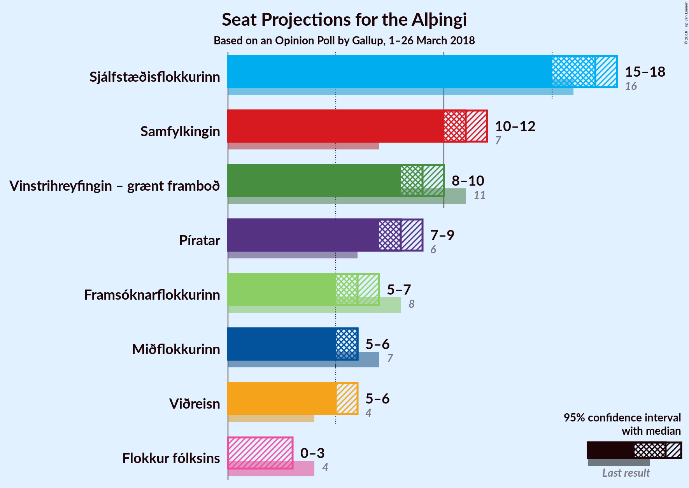

# Opinion Poll by Gallup, 1–26 March 2018

<a href="#voting-intentions">Voting Intentions</a> | <a href="#seats">Seats</a> | <a href="#coalitions">Coalitions</a> | <a href="#technical-information">Technical Information</a>

## Voting Intentions

### Confidence Intervals

| Party | Last Result | Poll Result | 80% Confidence Interval | 90% Confidence Interval | 95% Confidence Interval | 99% Confidence Interval |
|:-----:|:-----------:|:-----------:|:-----------------------:|:-----------------------:|:-----------------------:|:-----------------------:|
| Sjálfstæðisflokkurinn | 25.2% | 24.5% | 23.5–25.5% |23.2–25.8% |23.0–26.0% |22.6–26.5% |
| Samfylkingin | 12.1% | 16.5% | 15.7–17.4% |15.4–17.6% |15.2–17.8% |14.8–18.3% |
| Vinstrihreyfingin – grænt framboð | 16.9% | 13.9% | 13.1–14.7% |12.9–15.0% |12.7–15.2% |12.4–15.6% |
| Píratar | 9.2% | 12.5% | 11.8–13.3% |11.6–13.5% |11.4–13.7% |11.0–14.1% |
| Framsóknarflokkurinn | 10.7% | 9.2% | 8.6–9.9% |8.4–10.1% |8.2–10.3% |7.9–10.6% |
| Miðflokkurinn | 10.9% | 8.7% | 8.1–9.4% |7.9–9.6% |7.8–9.8% |7.5–10.1% |
| Viðreisn | 6.7% | 8.4% | 7.8–9.1% |7.6–9.3% |7.5–9.4% |7.2–9.8% |
| Flokkur fólksins | 6.9% | 4.9% | 4.4–5.4% |4.3–5.6% |4.2–5.7% |4.0–6.0% |

*Note:* The poll result column reflects the actual value used in the calculations. Published results may vary slightly, and in addition be rounded to fewer digits.

## Seats

### Confidence Intervals

| Party | Last Result | Median | 80% Confidence Interval | 90% Confidence Interval | 95% Confidence Interval | 99% Confidence Interval |
|:-----:|:-----------:|:------:|:-----------------------:|:-----------------------:|:-----------------------:|:-----------------------:|
| <a href="#sjálfstæðisflokkurinn">Sjálfstæðisflokkurinn</a> | 16 | 16 | 16–17 |15–17 |15–18 |15–18 |
| <a href="#samfylkingin">Samfylkingin</a> | 7 | 11 | 10–11 |10–12 |10–12 |10–12 |
| <a href="#vinstrihreyfingin-–-grænt-framboð">Vinstrihreyfingin – grænt framboð</a> | 11 | 9 | 8–10 |8–10 |8–10 |8–10 |
| <a href="#píratar">Píratar</a> | 6 | 8 | 8–9 |7–9 |7–9 |7–9 |
| <a href="#framsóknarflokkurinn">Framsóknarflokkurinn</a> | 8 | 6 | 5–6 |5–7 |5–7 |5–7 |
| <a href="#miðflokkurinn">Miðflokkurinn</a> | 7 | 5 | 5–6 |5–6 |5–6 |5–7 |
| <a href="#viðreisn">Viðreisn</a> | 4 | 6 | 5–6 |5–6 |5–6 |4–6 |
| <a href="#flokkur-fólksins">Flokkur fólksins</a> | 4 | 3 | 0–3 |0–3 |0–3 |0–4 |

### Sjálfstæðisflokkurinn

*For a full overview of the results for this party, see the [Sjálfstæðisflokkurinn](party-sjálfstæðisflokkurinn.html) page.*

| Number of Seats | Probability | Accumulated | Special Marks |
|:---------------:|:-----------:|:-----------:|:-------------:|
| 14 | 0.1% | 100% |  |
| 15 | 6% | 99.9% |  |
| 16 | 47% | 94% | Last Result, Median |
| 17 | 42% | 46% |  |
| 18 | 4% | 4% |  |
| 19 | 0.4% | 0.4% |  |
| 20 | 0% | 0% |  |

### Samfylkingin

*For a full overview of the results for this party, see the [Samfylkingin](party-samfylkingin.html) page.*

| Number of Seats | Probability | Accumulated | Special Marks |
|:---------------:|:-----------:|:-----------:|:-------------:|
| 7 | 0% | 100% | Last Result |
| 8 | 0% | 100% |  |
| 9 | 0.1% | 100% |  |
| 10 | 14% | 99.9% |  |
| 11 | 77% | 86% | Median |
| 12 | 9% | 9% |  |
| 13 | 0.4% | 0.4% |  |
| 14 | 0% | 0% |  |

### Vinstrihreyfingin – grænt framboð

*For a full overview of the results for this party, see the [Vinstrihreyfingin – grænt framboð](party-vinstrihreyfingin–græntframboð.html) page.*

| Number of Seats | Probability | Accumulated | Special Marks |
|:---------------:|:-----------:|:-----------:|:-------------:|
| 8 | 22% | 100% |  |
| 9 | 51% | 78% | Median |
| 10 | 26% | 26% |  |
| 11 | 0.3% | 0.3% | Last Result |
| 12 | 0% | 0% |  |

### Píratar

*For a full overview of the results for this party, see the [Píratar](party-píratar.html) page.*

| Number of Seats | Probability | Accumulated | Special Marks |
|:---------------:|:-----------:|:-----------:|:-------------:|
| 6 | 0% | 100% | Last Result |
| 7 | 6% | 100% |  |
| 8 | 70% | 94% | Median |
| 9 | 24% | 24% |  |
| 10 | 0.2% | 0.2% |  |
| 11 | 0% | 0% |  |

### Framsóknarflokkurinn

*For a full overview of the results for this party, see the [Framsóknarflokkurinn](party-framsóknarflokkurinn.html) page.*

| Number of Seats | Probability | Accumulated | Special Marks |
|:---------------:|:-----------:|:-----------:|:-------------:|
| 5 | 36% | 100% |  |
| 6 | 56% | 64% | Median |
| 7 | 8% | 8% |  |
| 8 | 0% | 0% | Last Result |

### Miðflokkurinn

*For a full overview of the results for this party, see the [Miðflokkurinn](party-miðflokkurinn.html) page.*

| Number of Seats | Probability | Accumulated | Special Marks |
|:---------------:|:-----------:|:-----------:|:-------------:|
| 4 | 0.2% | 100% |  |
| 5 | 57% | 99.8% | Median |
| 6 | 42% | 43% |  |
| 7 | 0.8% | 0.8% | Last Result |
| 8 | 0% | 0% |  |

### Viðreisn

*For a full overview of the results for this party, see the [Viðreisn](party-viðreisn.html) page.*

| Number of Seats | Probability | Accumulated | Special Marks |
|:---------------:|:-----------:|:-----------:|:-------------:|
| 4 | 0.5% | 100% | Last Result |
| 5 | 47% | 99.5% |  |
| 6 | 52% | 52% | Median |
| 7 | 0% | 0% |  |

### Flokkur fólksins

*For a full overview of the results for this party, see the [Flokkur fólksins](party-flokkurfólksins.html) page.*

| Number of Seats | Probability | Accumulated | Special Marks |
|:---------------:|:-----------:|:-----------:|:-------------:|
| 0 | 44% | 100% |  |
| 1 | 0% | 56% |  |
| 2 | 0% | 56% |  |
| 3 | 56% | 56% | Median |
| 4 | 0.7% | 0.7% | Last Result |
| 5 | 0% | 0% |  |

## Coalitions

### Confidence Intervals

| Coalition | Last Result | Median | Majority? | 80% Confidence Interval | 90% Confidence Interval | 95% Confidence Interval | 99% Confidence Interval |
|:---------:|:-----------:|:------:|:---------:|:-----------------------:|:-----------------------:|:-----------------------:|:-----------------------:|
| Samfylkingin – Vinstrihreyfingin – grænt framboð – Píratar – Viðreisn | 28 | 34 | 99.6% | 32–35 | 32–35 | 32–35 | 32–36 |
| Samfylkingin – Vinstrihreyfingin – grænt framboð – Framsóknarflokkurinn – Miðflokkurinn | 33 | 31 | 40% | 30–33 | 30–33 | 30–33 | 30–34 |
| Sjálfstæðisflokkurinn – Vinstrihreyfingin – grænt framboð – Framsóknarflokkurinn | 35 | 31 | 36% | 30–33 | 30–33 | 30–33 | 30–34 |
| Samfylkingin – Vinstrihreyfingin – grænt framboð – Píratar | 24 | 28 | 0% | 27–29 | 27–30 | 27–30 | 26–31 |
| Sjálfstæðisflokkurinn – Framsóknarflokkurinn – Miðflokkurinn | 31 | 28 | 0% | 26–29 | 26–29 | 26–29 | 26–30 |
| Sjálfstæðisflokkurinn – Samfylkingin | 23 | 27 | 0% | 26–28 | 26–29 | 26–29 | 25–30 |
| Samfylkingin – Vinstrihreyfingin – grænt framboð – Framsóknarflokkurinn | 26 | 25 | 0% | 25–27 | 25–27 | 24–27 | 24–28 |
| Samfylkingin – Vinstrihreyfingin – grænt framboð – Miðflokkurinn | 25 | 25 | 0% | 24–27 | 24–27 | 24–27 | 24–28 |
| Sjálfstæðisflokkurinn – Vinstrihreyfingin – grænt framboð | 27 | 25 | 0% | 25–27 | 25–27 | 24–27 | 24–28 |
| Sjálfstæðisflokkurinn – Framsóknarflokkurinn | 24 | 22 | 0% | 21–23 | 21–23 | 21–24 | 21–25 |
| Sjálfstæðisflokkurinn – Miðflokkurinn | 23 | 22 | 0% | 21–23 | 21–23 | 20–23 | 20–24 |
| Sjálfstæðisflokkurinn – Viðreisn | 20 | 22 | 0% | 21–23 | 21–23 | 20–23 | 20–24 |
| Vinstrihreyfingin – grænt framboð – Framsóknarflokkurinn – Miðflokkurinn | 26 | 20 | 0% | 19–22 | 19–22 | 19–22 | 19–23 |
| Samfylkingin – Vinstrihreyfingin – grænt framboð | 18 | 20 | 0% | 19–21 | 19–21 | 19–21 | 19–22 |
| Vinstrihreyfingin – grænt framboð – Píratar | 17 | 17 | 0% | 16–18 | 16–18 | 16–19 | 16–19 |
| Vinstrihreyfingin – grænt framboð – Framsóknarflokkurinn | 19 | 15 | 0% | 14–16 | 14–16 | 14–16 | 13–17 |
| Vinstrihreyfingin – grænt framboð – Miðflokkurinn | 18 | 14 | 0% | 13–16 | 13–16 | 13–16 | 13–16 |

### Samfylkingin – Vinstrihreyfingin – grænt framboð – Píratar – Viðreisn

| Number of Seats | Probability | Accumulated | Special Marks |
|:---------------:|:-----------:|:-----------:|:-------------:|
| 28 | 0% | 100% | Last Result |
| 29 | 0% | 100% |  |
| 30 | 0% | 100% |  |
| 31 | 0.4% | 100% |  |
| 32 | 18% | 99.6% | Majority |
| 33 | 15% | 82% |  |
| 34 | 48% | 67% | Median |
| 35 | 18% | 20% |  |
| 36 | 1.2% | 1.3% |  |
| 37 | 0.1% | 0.1% |  |
| 38 | 0% | 0% |  |

### Samfylkingin – Vinstrihreyfingin – grænt framboð – Framsóknarflokkurinn – Miðflokkurinn

| Number of Seats | Probability | Accumulated | Special Marks |
|:---------------:|:-----------:|:-----------:|:-------------:|
| 28 | 0.1% | 100% |  |
| 29 | 0.3% | 99.9% |  |
| 30 | 42% | 99.6% |  |
| 31 | 18% | 58% | Median |
| 32 | 22% | 40% | Majority |
| 33 | 16% | 17% | Last Result |
| 34 | 2% | 2% |  |
| 35 | 0% | 0% |  |

### Sjálfstæðisflokkurinn – Vinstrihreyfingin – grænt framboð – Framsóknarflokkurinn

| Number of Seats | Probability | Accumulated | Special Marks |
|:---------------:|:-----------:|:-----------:|:-------------:|
| 29 | 0.4% | 100% |  |
| 30 | 26% | 99.6% |  |
| 31 | 37% | 73% | Median |
| 32 | 26% | 36% | Majority |
| 33 | 10% | 11% |  |
| 34 | 1.2% | 1.2% |  |
| 35 | 0% | 0% | Last Result |

### Samfylkingin – Vinstrihreyfingin – grænt framboð – Píratar

| Number of Seats | Probability | Accumulated | Special Marks |
|:---------------:|:-----------:|:-----------:|:-------------:|
| 24 | 0% | 100% | Last Result |
| 25 | 0% | 100% |  |
| 26 | 0.8% | 100% |  |
| 27 | 18% | 99.2% |  |
| 28 | 50% | 81% | Median |
| 29 | 25% | 31% |  |
| 30 | 5% | 6% |  |
| 31 | 0.7% | 0.7% |  |
| 32 | 0% | 0% | Majority |

### Sjálfstæðisflokkurinn – Framsóknarflokkurinn – Miðflokkurinn

| Number of Seats | Probability | Accumulated | Special Marks |
|:---------------:|:-----------:|:-----------:|:-------------:|
| 25 | 0.2% | 100% |  |
| 26 | 25% | 99.8% |  |
| 27 | 15% | 75% | Median |
| 28 | 35% | 59% |  |
| 29 | 23% | 24% |  |
| 30 | 1.4% | 2% |  |
| 31 | 0.2% | 0.2% | Last Result |
| 32 | 0% | 0% | Majority |

### Sjálfstæðisflokkurinn – Samfylkingin

| Number of Seats | Probability | Accumulated | Special Marks |
|:---------------:|:-----------:|:-----------:|:-------------:|
| 23 | 0% | 100% | Last Result |
| 24 | 0% | 100% |  |
| 25 | 1.0% | 100% |  |
| 26 | 13% | 99.0% |  |
| 27 | 42% | 86% | Median |
| 28 | 35% | 44% |  |
| 29 | 8% | 9% |  |
| 30 | 0.9% | 0.9% |  |
| 31 | 0% | 0% |  |

### Samfylkingin – Vinstrihreyfingin – grænt framboð – Framsóknarflokkurinn

| Number of Seats | Probability | Accumulated | Special Marks |
|:---------------:|:-----------:|:-----------:|:-------------:|
| 23 | 0.1% | 100% |  |
| 24 | 4% | 99.9% |  |
| 25 | 49% | 96% |  |
| 26 | 20% | 47% | Last Result, Median |
| 27 | 25% | 27% |  |
| 28 | 2% | 2% |  |
| 29 | 0.2% | 0.2% |  |
| 30 | 0% | 0% |  |

### Samfylkingin – Vinstrihreyfingin – grænt framboð – Miðflokkurinn

| Number of Seats | Probability | Accumulated | Special Marks |
|:---------------:|:-----------:|:-----------:|:-------------:|
| 23 | 0.2% | 100% |  |
| 24 | 17% | 99.8% |  |
| 25 | 38% | 83% | Last Result, Median |
| 26 | 31% | 45% |  |
| 27 | 12% | 13% |  |
| 28 | 2% | 2% |  |
| 29 | 0% | 0% |  |

### Sjálfstæðisflokkurinn – Vinstrihreyfingin – grænt framboð

| Number of Seats | Probability | Accumulated | Special Marks |
|:---------------:|:-----------:|:-----------:|:-------------:|
| 23 | 0.1% | 100% |  |
| 24 | 3% | 99.9% |  |
| 25 | 61% | 97% | Median |
| 26 | 22% | 36% |  |
| 27 | 13% | 14% | Last Result |
| 28 | 1.4% | 1.4% |  |
| 29 | 0% | 0% |  |

### Sjálfstæðisflokkurinn – Framsóknarflokkurinn

| Number of Seats | Probability | Accumulated | Special Marks |
|:---------------:|:-----------:|:-----------:|:-------------:|
| 20 | 0.3% | 100% |  |
| 21 | 34% | 99.7% |  |
| 22 | 19% | 66% | Median |
| 23 | 42% | 46% |  |
| 24 | 4% | 4% | Last Result |
| 25 | 0.6% | 0.6% |  |
| 26 | 0% | 0% |  |

### Sjálfstæðisflokkurinn – Miðflokkurinn

| Number of Seats | Probability | Accumulated | Special Marks |
|:---------------:|:-----------:|:-----------:|:-------------:|
| 19 | 0.1% | 100% |  |
| 20 | 4% | 99.9% |  |
| 21 | 26% | 96% | Median |
| 22 | 50% | 70% |  |
| 23 | 19% | 20% | Last Result |
| 24 | 2% | 2% |  |
| 25 | 0.1% | 0.1% |  |
| 26 | 0% | 0% |  |

### Sjálfstæðisflokkurinn – Viðreisn

| Number of Seats | Probability | Accumulated | Special Marks |
|:---------------:|:-----------:|:-----------:|:-------------:|
| 19 | 0.1% | 100% |  |
| 20 | 5% | 99.9% | Last Result |
| 21 | 14% | 95% |  |
| 22 | 64% | 81% | Median |
| 23 | 15% | 18% |  |
| 24 | 2% | 2% |  |
| 25 | 0% | 0% |  |

### Vinstrihreyfingin – grænt framboð – Framsóknarflokkurinn – Miðflokkurinn

| Number of Seats | Probability | Accumulated | Special Marks |
|:---------------:|:-----------:|:-----------:|:-------------:|
| 18 | 0.1% | 100% |  |
| 19 | 36% | 99.9% |  |
| 20 | 25% | 64% | Median |
| 21 | 22% | 39% |  |
| 22 | 16% | 17% |  |
| 23 | 0.8% | 0.8% |  |
| 24 | 0% | 0% |  |
| 25 | 0% | 0% |  |
| 26 | 0% | 0% | Last Result |

### Samfylkingin – Vinstrihreyfingin – grænt framboð

| Number of Seats | Probability | Accumulated | Special Marks |
|:---------------:|:-----------:|:-----------:|:-------------:|
| 18 | 0.3% | 100% | Last Result |
| 19 | 27% | 99.7% |  |
| 20 | 47% | 73% | Median |
| 21 | 23% | 25% |  |
| 22 | 2% | 2% |  |
| 23 | 0.1% | 0.1% |  |
| 24 | 0% | 0% |  |

### Vinstrihreyfingin – grænt framboð – Píratar

| Number of Seats | Probability | Accumulated | Special Marks |
|:---------------:|:-----------:|:-----------:|:-------------:|
| 15 | 0.1% | 100% |  |
| 16 | 17% | 99.9% |  |
| 17 | 47% | 83% | Last Result, Median |
| 18 | 33% | 36% |  |
| 19 | 3% | 3% |  |
| 20 | 0.1% | 0.1% |  |
| 21 | 0% | 0% |  |

### Vinstrihreyfingin – grænt framboð – Framsóknarflokkurinn

| Number of Seats | Probability | Accumulated | Special Marks |
|:---------------:|:-----------:|:-----------:|:-------------:|
| 13 | 0.5% | 100% |  |
| 14 | 47% | 99.5% |  |
| 15 | 29% | 52% | Median |
| 16 | 23% | 24% |  |
| 17 | 1.1% | 1.2% |  |
| 18 | 0% | 0% |  |
| 19 | 0% | 0% | Last Result |

### Vinstrihreyfingin – grænt framboð – Miðflokkurinn

| Number of Seats | Probability | Accumulated | Special Marks |
|:---------------:|:-----------:|:-----------:|:-------------:|
| 13 | 15% | 100% |  |
| 14 | 37% | 85% | Median |
| 15 | 33% | 48% |  |
| 16 | 15% | 15% |  |
| 17 | 0.3% | 0.3% |  |
| 18 | 0% | 0% | Last Result |

## Technical Information

### Opinion Poll

+ **Polling firm:** Gallup
+ **Commissioner(s):** —
+ **Fieldwork period:** 1–26 March 2018

### Calculations

+ **Sample size:** 3091
+ **Simulations done:** 131,072
+ **Error estimate:** 1.01%

