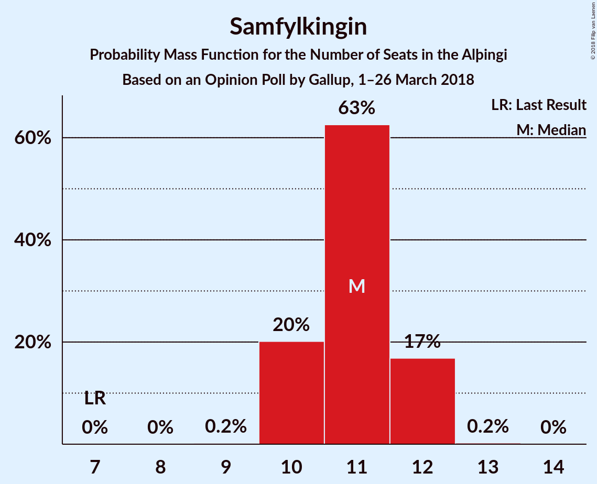
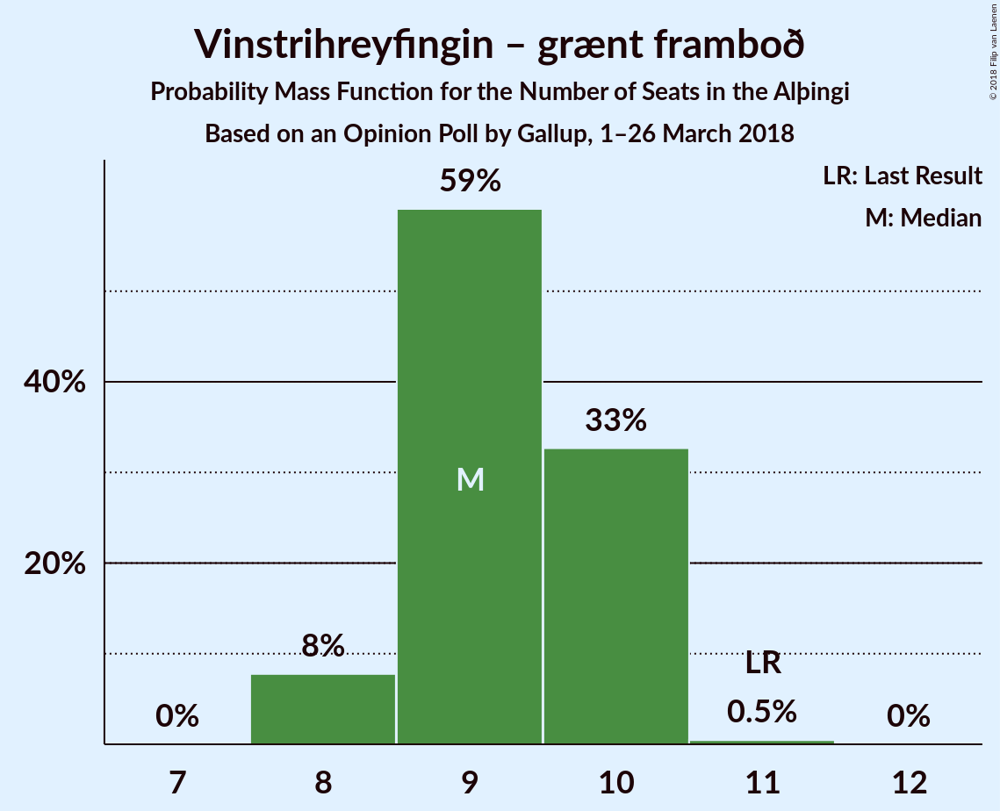

# Opinion Poll by Gallup, 1–26 March 2018

<a href="#voting-intentions">Voting Intentions</a> | <a href="#seats">Seats</a> | <a href="#coalitions">Coalitions</a> | <a href="#technical-information">Technical Information</a>

## Voting Intentions

### Confidence Intervals

| Party | Last Result | Poll Result | 80% Confidence Interval | 90% Confidence Interval | 95% Confidence Interval | 99% Confidence Interval |
|:-----:|:-----------:|:-----------:|:-----------------------:|:-----------------------:|:-----------------------:|:-----------------------:|
| Sjálfstæðisflokkurinn | 25.2% | 24.5% | 23.5–25.5% |23.2–25.8% |23.0–26.0% |22.6–26.5% |
| Samfylkingin | 12.1% | 16.5% | 15.7–17.4% |15.4–17.6% |15.2–17.8% |14.8–18.3% |
| Vinstrihreyfingin – grænt framboð | 16.9% | 13.9% | 13.1–14.7% |12.9–15.0% |12.7–15.2% |12.4–15.6% |
| Píratar | 9.2% | 12.5% | 11.8–13.3% |11.6–13.5% |11.4–13.7% |11.0–14.1% |
| Framsóknarflokkurinn | 10.7% | 9.2% | 8.6–9.9% |8.4–10.1% |8.2–10.3% |7.9–10.6% |
| Miðflokkurinn | 10.9% | 8.7% | 8.1–9.4% |7.9–9.6% |7.8–9.8% |7.5–10.1% |
| Viðreisn | 6.7% | 8.4% | 7.8–9.1% |7.6–9.3% |7.5–9.4% |7.2–9.8% |
| Flokkur fólksins | 6.9% | 4.9% | 4.4–5.4% |4.3–5.6% |4.2–5.7% |4.0–6.0% |

*Note:* The poll result column reflects the actual value used in the calculations. Published results may vary slightly, and in addition be rounded to fewer digits.

## Seats

### Confidence Intervals

| Party | Last Result | Median | 80% Confidence Interval | 90% Confidence Interval | 95% Confidence Interval | 99% Confidence Interval |
|:-----:|:-----------:|:------:|:-----------------------:|:-----------------------:|:-----------------------:|:-----------------------:|
| <a href="#sjálfstæðisflokkurinn">Sjálfstæðisflokkurinn</a> | 16 | 17 | 16–17 |15–18 |15–18 |15–18 |
| <a href="#samfylkingin">Samfylkingin</a> | 7 | 11 | 10–12 |10–12 |10–12 |10–12 |
| <a href="#vinstrihreyfingin-–-grænt-framboð">Vinstrihreyfingin – grænt framboð</a> | 11 | 9 | 9–10 |8–10 |8–10 |8–10 |
| <a href="#píratar">Píratar</a> | 6 | 8 | 8–9 |7–9 |7–9 |7–9 |
| <a href="#framsóknarflokkurinn">Framsóknarflokkurinn</a> | 8 | 6 | 5–6 |5–7 |5–7 |5–7 |
| <a href="#miðflokkurinn">Miðflokkurinn</a> | 7 | 6 | 5–6 |5–6 |5–6 |5–7 |
| <a href="#viðreisn">Viðreisn</a> | 4 | 5 | 5–6 |5–6 |5–6 |4–6 |
| <a href="#flokkur-fólksins">Flokkur fólksins</a> | 4 | 0 | 0–3 |0–3 |0–3 |0–4 |

### Sjálfstæðisflokkurinn

*For a full overview of the results for this party, see the [Sjálfstæðisflokkurinn](party-sjálfstæðisflokkurinn.html) page.*

| Number of Seats | Probability | Accumulated | Special Marks |
|:---------------:|:-----------:|:-----------:|:-------------:|
| 14 | 0.1% | 100% |  |
| 15 | 8% | 99.9% |  |
| 16 | 39% | 92% | Last Result |
| 17 | 46% | 53% | Median |
| 18 | 6% | 6% |  |
| 19 | 0.2% | 0.2% |  |
| 20 | 0% | 0% |  |

### Samfylkingin

*For a full overview of the results for this party, see the [Samfylkingin](party-samfylkingin.html) page.*

| Number of Seats | Probability | Accumulated | Special Marks |
|:---------------:|:-----------:|:-----------:|:-------------:|
| 7 | 0% | 100% | Last Result |
| 8 | 0% | 100% |  |
| 9 | 0.2% | 100% |  |
| 10 | 20% | 99.8% |  |
| 11 | 63% | 80% | Median |
| 12 | 17% | 17% |  |
| 13 | 0.2% | 0.2% |  |
| 14 | 0% | 0% |  |

### Vinstrihreyfingin – grænt framboð

*For a full overview of the results for this party, see the [Vinstrihreyfingin – grænt framboð](party-vinstrihreyfingin–græntframboð.html) page.*

| Number of Seats | Probability | Accumulated | Special Marks |
|:---------------:|:-----------:|:-----------:|:-------------:|
| 8 | 8% | 100% |  |
| 9 | 59% | 92% | Median |
| 10 | 33% | 33% |  |
| 11 | 0.5% | 0.5% | Last Result |
| 12 | 0% | 0% |  |

### Píratar

*For a full overview of the results for this party, see the [Píratar](party-píratar.html) page.*

| Number of Seats | Probability | Accumulated | Special Marks |
|:---------------:|:-----------:|:-----------:|:-------------:|
| 6 | 0% | 100% | Last Result |
| 7 | 7% | 100% |  |
| 8 | 64% | 93% | Median |
| 9 | 29% | 29% |  |
| 10 | 0.2% | 0.2% |  |
| 11 | 0% | 0% |  |

### Framsóknarflokkurinn

*For a full overview of the results for this party, see the [Framsóknarflokkurinn](party-framsóknarflokkurinn.html) page.*

| Number of Seats | Probability | Accumulated | Special Marks |
|:---------------:|:-----------:|:-----------:|:-------------:|
| 5 | 17% | 100% |  |
| 6 | 75% | 83% | Median |
| 7 | 8% | 8% |  |
| 8 | 0.1% | 0.1% | Last Result |
| 9 | 0% | 0% |  |

### Miðflokkurinn

*For a full overview of the results for this party, see the [Miðflokkurinn](party-miðflokkurinn.html) page.*

| Number of Seats | Probability | Accumulated | Special Marks |
|:---------------:|:-----------:|:-----------:|:-------------:|
| 4 | 0.2% | 100% |  |
| 5 | 48% | 99.8% |  |
| 6 | 50% | 52% | Median |
| 7 | 1.4% | 1.4% | Last Result |
| 8 | 0% | 0% |  |

### Viðreisn

*For a full overview of the results for this party, see the [Viðreisn](party-viðreisn.html) page.*

| Number of Seats | Probability | Accumulated | Special Marks |
|:---------------:|:-----------:|:-----------:|:-------------:|
| 4 | 0.6% | 100% | Last Result |
| 5 | 62% | 99.4% | Median |
| 6 | 37% | 38% |  |
| 7 | 0.2% | 0.2% |  |
| 8 | 0% | 0% |  |

### Flokkur fólksins

*For a full overview of the results for this party, see the [Flokkur fólksins](party-flokkurfólksins.html) page.*

| Number of Seats | Probability | Accumulated | Special Marks |
|:---------------:|:-----------:|:-----------:|:-------------:|
| 0 | 60% | 100% | Median |
| 1 | 0% | 40% |  |
| 2 | 0% | 40% |  |
| 3 | 40% | 40% |  |
| 4 | 0.7% | 0.7% | Last Result |
| 5 | 0% | 0% |  |

## Coalitions

### Confidence Intervals

| Coalition | Last Result | Median | Majority? | 80% Confidence Interval | 90% Confidence Interval | 95% Confidence Interval | 99% Confidence Interval |
|:---------:|:-----------:|:------:|:---------:|:-----------------------:|:-----------------------:|:-----------------------:|:-----------------------:|
| Samfylkingin – Vinstrihreyfingin – grænt framboð – Píratar – Viðreisn | 28 | 34 | 99.1% | 32–35 | 32–36 | 32–36 | 31–36 |
| Samfylkingin – Vinstrihreyfingin – grænt framboð – Framsóknarflokkurinn – Miðflokkurinn | 33 | 32 | 57% | 30–33 | 30–33 | 30–34 | 29–34 |
| Sjálfstæðisflokkurinn – Vinstrihreyfingin – grænt framboð – Framsóknarflokkurinn | 35 | 32 | 58% | 30–33 | 30–33 | 30–34 | 29–34 |
| Samfylkingin – Vinstrihreyfingin – grænt framboð – Píratar | 24 | 28 | 0% | 27–30 | 27–30 | 27–30 | 26–31 |
| Sjálfstæðisflokkurinn – Framsóknarflokkurinn – Miðflokkurinn | 31 | 28 | 0% | 27–29 | 26–29 | 26–30 | 25–30 |
| Sjálfstæðisflokkurinn – Samfylkingin | 23 | 28 | 0% | 26–29 | 26–29 | 26–29 | 25–30 |
| Samfylkingin – Vinstrihreyfingin – grænt framboð – Framsóknarflokkurinn | 26 | 26 | 0% | 25–27 | 25–28 | 24–28 | 24–28 |
| Samfylkingin – Vinstrihreyfingin – grænt framboð – Miðflokkurinn | 25 | 26 | 0% | 24–27 | 24–27 | 24–27 | 23–28 |
| Sjálfstæðisflokkurinn – Vinstrihreyfingin – grænt framboð | 27 | 26 | 0% | 25–27 | 24–27 | 24–27 | 24–28 |
| Sjálfstæðisflokkurinn – Framsóknarflokkurinn | 24 | 23 | 0% | 21–23 | 21–24 | 21–24 | 20–24 |
| Sjálfstæðisflokkurinn – Miðflokkurinn | 23 | 22 | 0% | 21–23 | 21–23 | 20–24 | 20–24 |
| Sjálfstæðisflokkurinn – Viðreisn | 20 | 22 | 0% | 21–23 | 21–23 | 20–23 | 20–24 |
| Vinstrihreyfingin – grænt framboð – Framsóknarflokkurinn – Miðflokkurinn | 26 | 21 | 0% | 20–22 | 19–22 | 19–22 | 19–23 |
| Samfylkingin – Vinstrihreyfingin – grænt framboð | 18 | 20 | 0% | 19–21 | 19–22 | 19–22 | 18–22 |
| Vinstrihreyfingin – grænt framboð – Píratar | 17 | 17 | 0% | 16–19 | 16–19 | 16–19 | 16–19 |
| Vinstrihreyfingin – grænt framboð – Framsóknarflokkurinn | 19 | 15 | 0% | 14–16 | 14–16 | 14–17 | 13–17 |
| Vinstrihreyfingin – grænt framboð – Miðflokkurinn | 18 | 15 | 0% | 14–16 | 14–16 | 13–16 | 13–17 |

### Samfylkingin – Vinstrihreyfingin – grænt framboð – Píratar – Viðreisn

| Number of Seats | Probability | Accumulated | Special Marks |
|:---------------:|:-----------:|:-----------:|:-------------:|
| 28 | 0% | 100% | Last Result |
| 29 | 0% | 100% |  |
| 30 | 0% | 100% |  |
| 31 | 0.8% | 100% |  |
| 32 | 15% | 99.1% | Majority |
| 33 | 20% | 84% | Median |
| 34 | 35% | 64% |  |
| 35 | 22% | 29% |  |
| 36 | 6% | 6% |  |
| 37 | 0.1% | 0.1% |  |
| 38 | 0% | 0% |  |

### Samfylkingin – Vinstrihreyfingin – grænt framboð – Framsóknarflokkurinn – Miðflokkurinn

| Number of Seats | Probability | Accumulated | Special Marks |
|:---------------:|:-----------:|:-----------:|:-------------:|
| 29 | 0.8% | 100% |  |
| 30 | 15% | 99.2% |  |
| 31 | 27% | 84% |  |
| 32 | 33% | 57% | Median, Majority |
| 33 | 21% | 24% | Last Result |
| 34 | 3% | 3% |  |
| 35 | 0% | 0% |  |

### Sjálfstæðisflokkurinn – Vinstrihreyfingin – grænt framboð – Framsóknarflokkurinn

| Number of Seats | Probability | Accumulated | Special Marks |
|:---------------:|:-----------:|:-----------:|:-------------:|
| 29 | 0.6% | 100% |  |
| 30 | 11% | 99.4% |  |
| 31 | 30% | 88% |  |
| 32 | 38% | 58% | Median, Majority |
| 33 | 18% | 20% |  |
| 34 | 2% | 3% |  |
| 35 | 0% | 0% | Last Result |

### Samfylkingin – Vinstrihreyfingin – grænt framboð – Píratar

| Number of Seats | Probability | Accumulated | Special Marks |
|:---------------:|:-----------:|:-----------:|:-------------:|
| 24 | 0% | 100% | Last Result |
| 25 | 0% | 100% |  |
| 26 | 2% | 100% |  |
| 27 | 18% | 98% |  |
| 28 | 32% | 80% | Median |
| 29 | 30% | 48% |  |
| 30 | 17% | 18% |  |
| 31 | 0.9% | 0.9% |  |
| 32 | 0% | 0% | Majority |

### Sjálfstæðisflokkurinn – Framsóknarflokkurinn – Miðflokkurinn

| Number of Seats | Probability | Accumulated | Special Marks |
|:---------------:|:-----------:|:-----------:|:-------------:|
| 25 | 1.0% | 100% |  |
| 26 | 8% | 99.0% |  |
| 27 | 22% | 91% |  |
| 28 | 36% | 69% |  |
| 29 | 28% | 33% | Median |
| 30 | 4% | 5% |  |
| 31 | 0.2% | 0.2% | Last Result |
| 32 | 0% | 0% | Majority |

### Sjálfstæðisflokkurinn – Samfylkingin

| Number of Seats | Probability | Accumulated | Special Marks |
|:---------------:|:-----------:|:-----------:|:-------------:|
| 23 | 0% | 100% | Last Result |
| 24 | 0% | 100% |  |
| 25 | 1.4% | 100% |  |
| 26 | 17% | 98.6% |  |
| 27 | 28% | 82% |  |
| 28 | 40% | 54% | Median |
| 29 | 12% | 13% |  |
| 30 | 1.3% | 1.3% |  |
| 31 | 0% | 0% |  |

### Samfylkingin – Vinstrihreyfingin – grænt framboð – Framsóknarflokkurinn

| Number of Seats | Probability | Accumulated | Special Marks |
|:---------------:|:-----------:|:-----------:|:-------------:|
| 23 | 0.1% | 100% |  |
| 24 | 2% | 99.9% |  |
| 25 | 24% | 97% |  |
| 26 | 39% | 73% | Last Result, Median |
| 27 | 26% | 34% |  |
| 28 | 8% | 8% |  |
| 29 | 0.2% | 0.2% |  |
| 30 | 0% | 0% |  |

### Samfylkingin – Vinstrihreyfingin – grænt framboð – Miðflokkurinn

| Number of Seats | Probability | Accumulated | Special Marks |
|:---------------:|:-----------:|:-----------:|:-------------:|
| 23 | 0.5% | 100% |  |
| 24 | 10% | 99.5% |  |
| 25 | 28% | 89% | Last Result |
| 26 | 38% | 61% | Median |
| 27 | 21% | 23% |  |
| 28 | 2% | 2% |  |
| 29 | 0% | 0% |  |

### Sjálfstæðisflokkurinn – Vinstrihreyfingin – grænt framboð

| Number of Seats | Probability | Accumulated | Special Marks |
|:---------------:|:-----------:|:-----------:|:-------------:|
| 23 | 0.2% | 100% |  |
| 24 | 6% | 99.8% |  |
| 25 | 33% | 94% |  |
| 26 | 40% | 61% | Median |
| 27 | 19% | 21% | Last Result |
| 28 | 2% | 2% |  |
| 29 | 0% | 0% |  |

### Sjálfstæðisflokkurinn – Framsóknarflokkurinn

| Number of Seats | Probability | Accumulated | Special Marks |
|:---------------:|:-----------:|:-----------:|:-------------:|
| 20 | 2% | 100% |  |
| 21 | 15% | 98% |  |
| 22 | 30% | 83% |  |
| 23 | 44% | 53% | Median |
| 24 | 8% | 9% | Last Result |
| 25 | 0.5% | 0.5% |  |
| 26 | 0% | 0% |  |

### Sjálfstæðisflokkurinn – Miðflokkurinn

| Number of Seats | Probability | Accumulated | Special Marks |
|:---------------:|:-----------:|:-----------:|:-------------:|
| 19 | 0.1% | 100% |  |
| 20 | 3% | 99.9% |  |
| 21 | 25% | 97% |  |
| 22 | 41% | 72% |  |
| 23 | 27% | 31% | Last Result, Median |
| 24 | 4% | 4% |  |
| 25 | 0.1% | 0.1% |  |
| 26 | 0% | 0% |  |

### Sjálfstæðisflokkurinn – Viðreisn

| Number of Seats | Probability | Accumulated | Special Marks |
|:---------------:|:-----------:|:-----------:|:-------------:|
| 19 | 0.2% | 100% |  |
| 20 | 5% | 99.8% | Last Result |
| 21 | 27% | 95% |  |
| 22 | 45% | 68% | Median |
| 23 | 22% | 24% |  |
| 24 | 2% | 2% |  |
| 25 | 0% | 0% |  |

### Vinstrihreyfingin – grænt framboð – Framsóknarflokkurinn – Miðflokkurinn

| Number of Seats | Probability | Accumulated | Special Marks |
|:---------------:|:-----------:|:-----------:|:-------------:|
| 18 | 0.3% | 100% |  |
| 19 | 8% | 99.7% |  |
| 20 | 31% | 92% |  |
| 21 | 43% | 60% | Median |
| 22 | 16% | 17% |  |
| 23 | 1.2% | 1.2% |  |
| 24 | 0% | 0% |  |
| 25 | 0% | 0% |  |
| 26 | 0% | 0% | Last Result |

### Samfylkingin – Vinstrihreyfingin – grænt framboð

| Number of Seats | Probability | Accumulated | Special Marks |
|:---------------:|:-----------:|:-----------:|:-------------:|
| 18 | 1.3% | 100% | Last Result |
| 19 | 18% | 98.6% |  |
| 20 | 43% | 80% | Median |
| 21 | 30% | 37% |  |
| 22 | 7% | 7% |  |
| 23 | 0.1% | 0.1% |  |
| 24 | 0% | 0% |  |

### Vinstrihreyfingin – grænt framboð – Píratar

| Number of Seats | Probability | Accumulated | Special Marks |
|:---------------:|:-----------:|:-----------:|:-------------:|
| 15 | 0.2% | 100% |  |
| 16 | 10% | 99.8% |  |
| 17 | 43% | 90% | Last Result, Median |
| 18 | 36% | 47% |  |
| 19 | 11% | 11% |  |
| 20 | 0.2% | 0.2% |  |
| 21 | 0% | 0% |  |

### Vinstrihreyfingin – grænt framboð – Framsóknarflokkurinn

| Number of Seats | Probability | Accumulated | Special Marks |
|:---------------:|:-----------:|:-----------:|:-------------:|
| 13 | 0.7% | 100% |  |
| 14 | 13% | 99.3% |  |
| 15 | 58% | 86% | Median |
| 16 | 26% | 29% |  |
| 17 | 3% | 3% |  |
| 18 | 0% | 0% |  |
| 19 | 0% | 0% | Last Result |

### Vinstrihreyfingin – grænt framboð – Miðflokkurinn

| Number of Seats | Probability | Accumulated | Special Marks |
|:---------------:|:-----------:|:-----------:|:-------------:|
| 13 | 4% | 100% |  |
| 14 | 30% | 96% |  |
| 15 | 48% | 65% | Median |
| 16 | 17% | 17% |  |
| 17 | 0.6% | 0.6% |  |
| 18 | 0% | 0% | Last Result |

## Technical Information

### Opinion Poll

+ **Polling firm:** Gallup
+ **Commissioner(s):** —
+ **Fieldwork period:** 1–26 March 2018

### Calculations

+ **Sample size:** 3091
+ **Simulations done:** 1,048,576
+ **Error estimate:** 1.08%

