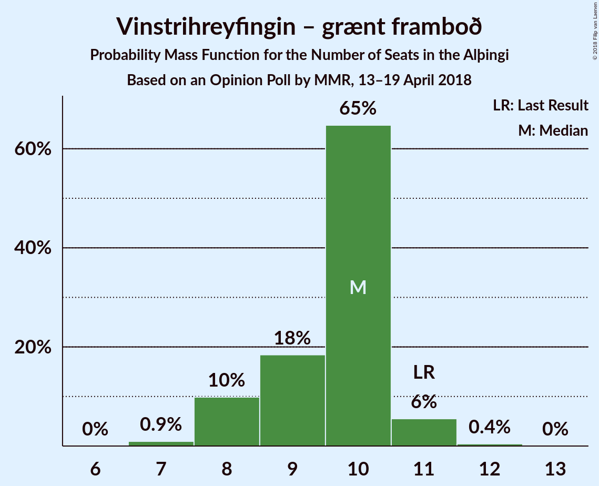
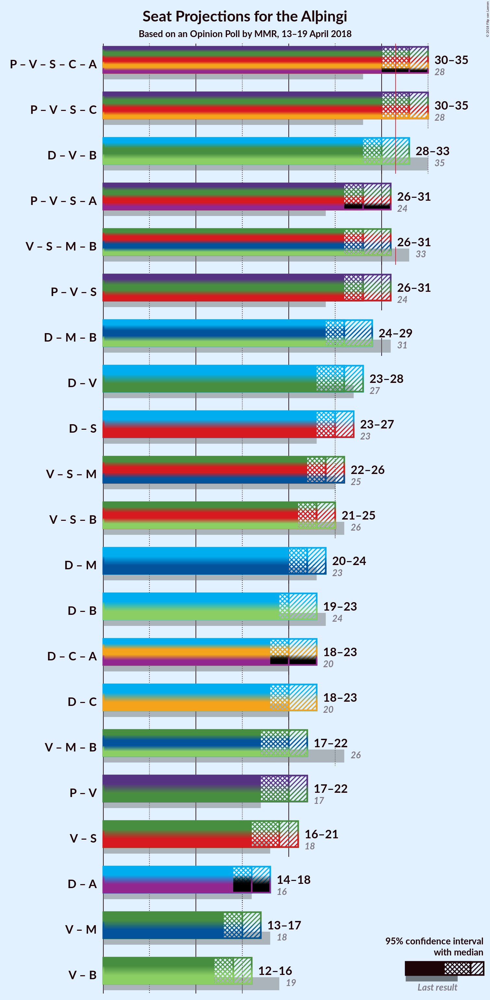

# Opinion Poll by MMR, 13–19 April 2018

<a href="#voting-intentions">Voting Intentions</a> | <a href="#seats">Seats</a> | <a href="#coalitions">Coalitions</a> | <a href="#technical-information">Technical Information</a>

## Voting Intentions

### Confidence Intervals

| Party | Last Result | Poll Result | 80% Confidence Interval | 90% Confidence Interval | 95% Confidence Interval | 99% Confidence Interval |
|:-----:|:-----------:|:-----------:|:-----------------------:|:-----------------------:|:-----------------------:|:-----------------------:|
| Sjálfstæðisflokkurinn | 25.2% | 24.0% | 22.2–25.8% |21.7–26.4% |21.3–26.8% |20.5–27.8% |
| Píratar | 9.2% | 15.3% | 13.8–16.9% |13.4–17.4% |13.1–17.8% |12.4–18.6% |
| Vinstrihreyfingin – grænt framboð | 16.9% | 14.3% | 12.9–15.9% |12.5–16.3% |12.2–16.7% |11.5–17.5% |
| Samfylkingin | 12.1% | 13.6% | 12.3–15.2% |11.9–15.6% |11.6–16.0% |10.9–16.8% |
| Miðflokkurinn | 10.9% | 8.8% | 7.7–10.1% |7.4–10.5% |7.1–10.8% |6.6–11.5% |
| Framsóknarflokkurinn | 10.7% | 7.3% | 6.2–8.5% |6.0–8.8% |5.7–9.1% |5.3–9.7% |
| Viðreisn | 6.7% | 7.0% | 6.1–8.2% |5.8–8.6% |5.5–8.9% |5.1–9.5% |
| Flokkur fólksins | 6.9% | 6.9% | 5.9–8.1% |5.7–8.5% |5.4–8.8% |5.0–9.4% |

*Note:* The poll result column reflects the actual value used in the calculations. Published results may vary slightly, and in addition be rounded to fewer digits.

## Seats

### Confidence Intervals

| Party | Last Result | Median | 80% Confidence Interval | 90% Confidence Interval | 95% Confidence Interval | 99% Confidence Interval |
|:-----:|:-----------:|:------:|:-----------------------:|:-----------------------:|:-----------------------:|:-----------------------:|
| <a href="#sjálfstæðisflokkurinn">Sjálfstæðisflokkurinn</a> | 16 | 16 | 15–18 |15–18 |14–18 |14–19 |
| <a href="#píratar">Píratar</a> | 6 | 10 | 9–11 |9–11 |8–12 |8–12 |
| <a href="#vinstrihreyfingin-–-grænt-framboð">Vinstrihreyfingin – grænt framboð</a> | 11 | 10 | 8–10 |8–11 |8–11 |7–11 |
| <a href="#samfylkingin">Samfylkingin</a> | 7 | 9 | 8–10 |7–10 |7–10 |7–11 |
| <a href="#miðflokkurinn">Miðflokkurinn</a> | 7 | 6 | 5–6 |5–7 |4–7 |4–8 |
| <a href="#framsóknarflokkurinn">Framsóknarflokkurinn</a> | 8 | 4 | 4–5 |4–6 |3–6 |3–6 |
| <a href="#viðreisn">Viðreisn</a> | 4 | 4 | 4–5 |3–5 |3–6 |3–6 |
| <a href="#flokkur-fólksins">Flokkur fólksins</a> | 4 | 4 | 3–5 |3–5 |3–5 |1–6 |

### Sjálfstæðisflokkurinn

*For a full overview of the results for this party, see the [Sjálfstæðisflokkurinn](party-sjálfstæðisflokkurinn.html) page.*

| Number of Seats | Probability | Accumulated | Special Marks |
|:---------------:|:-----------:|:-----------:|:-------------:|
| 13 | 0.4% | 100% |  |
| 14 | 3% | 99.6% |  |
| 15 | 27% | 97% |  |
| 16 | 39% | 70% | Last Result, Median |
| 17 | 18% | 31% |  |
| 18 | 12% | 13% |  |
| 19 | 0.9% | 1.1% |  |
| 20 | 0.2% | 0.2% |  |
| 21 | 0% | 0% |  |

### Píratar

*For a full overview of the results for this party, see the [Píratar](party-píratar.html) page.*

| Number of Seats | Probability | Accumulated | Special Marks |
|:---------------:|:-----------:|:-----------:|:-------------:|
| 6 | 0% | 100% | Last Result |
| 7 | 0.1% | 100% |  |
| 8 | 3% | 99.9% |  |
| 9 | 34% | 97% |  |
| 10 | 40% | 63% | Median |
| 11 | 20% | 23% |  |
| 12 | 3% | 3% |  |
| 13 | 0.1% | 0.1% |  |
| 14 | 0% | 0% |  |

### Vinstrihreyfingin – grænt framboð

*For a full overview of the results for this party, see the [Vinstrihreyfingin – grænt framboð](party-vinstrihreyfingin–græntframboð.html) page.*

| Number of Seats | Probability | Accumulated | Special Marks |
|:---------------:|:-----------:|:-----------:|:-------------:|
| 7 | 0.9% | 100% |  |
| 8 | 10% | 99.0% |  |
| 9 | 18% | 89% |  |
| 10 | 65% | 71% | Median |
| 11 | 6% | 6% | Last Result |
| 12 | 0.4% | 0.5% |  |
| 13 | 0% | 0% |  |

### Samfylkingin

*For a full overview of the results for this party, see the [Samfylkingin](party-samfylkingin.html) page.*

| Number of Seats | Probability | Accumulated | Special Marks |
|:---------------:|:-----------:|:-----------:|:-------------:|
| 6 | 0.1% | 100% |  |
| 7 | 5% | 99.9% | Last Result |
| 8 | 32% | 95% |  |
| 9 | 40% | 63% | Median |
| 10 | 20% | 22% |  |
| 11 | 2% | 2% |  |
| 12 | 0.1% | 0.1% |  |
| 13 | 0% | 0% |  |

### Miðflokkurinn

*For a full overview of the results for this party, see the [Miðflokkurinn](party-miðflokkurinn.html) page.*

| Number of Seats | Probability | Accumulated | Special Marks |
|:---------------:|:-----------:|:-----------:|:-------------:|
| 4 | 5% | 100% |  |
| 5 | 45% | 95% |  |
| 6 | 42% | 50% | Median |
| 7 | 8% | 8% | Last Result |
| 8 | 0.5% | 0.6% |  |
| 9 | 0.1% | 0.1% |  |
| 10 | 0% | 0% |  |

### Framsóknarflokkurinn

*For a full overview of the results for this party, see the [Framsóknarflokkurinn](party-framsóknarflokkurinn.html) page.*

| Number of Seats | Probability | Accumulated | Special Marks |
|:---------------:|:-----------:|:-----------:|:-------------:|
| 2 | 0.2% | 100% |  |
| 3 | 3% | 99.8% |  |
| 4 | 53% | 96% | Median |
| 5 | 38% | 44% |  |
| 6 | 6% | 6% |  |
| 7 | 0.3% | 0.3% |  |
| 8 | 0% | 0% | Last Result |

### Viðreisn

*For a full overview of the results for this party, see the [Viðreisn](party-viðreisn.html) page.*

| Number of Seats | Probability | Accumulated | Special Marks |
|:---------------:|:-----------:|:-----------:|:-------------:|
| 0 | 0.4% | 100% |  |
| 1 | 0% | 99.6% |  |
| 2 | 0% | 99.6% |  |
| 3 | 7% | 99.6% |  |
| 4 | 57% | 93% | Last Result, Median |
| 5 | 32% | 35% |  |
| 6 | 3% | 3% |  |
| 7 | 0% | 0% |  |

### Flokkur fólksins

*For a full overview of the results for this party, see the [Flokkur fólksins](party-flokkurfólksins.html) page.*

| Number of Seats | Probability | Accumulated | Special Marks |
|:---------------:|:-----------:|:-----------:|:-------------:|
| 0 | 0.5% | 100% |  |
| 1 | 0.1% | 99.5% |  |
| 2 | 0% | 99.5% |  |
| 3 | 10% | 99.5% |  |
| 4 | 56% | 90% | Last Result, Median |
| 5 | 31% | 33% |  |
| 6 | 2% | 2% |  |
| 7 | 0% | 0% |  |

## Coalitions

### Confidence Intervals

| Coalition | Last Result | Median | Majority? | 80% Confidence Interval | 90% Confidence Interval | 95% Confidence Interval | 99% Confidence Interval |
|:---------:|:-----------:|:------:|:---------:|:-----------------------:|:-----------------------:|:-----------------------:|:-----------------------:|
| Píratar – Vinstrihreyfingin – grænt framboð – Samfylkingin – Viðreisn | 28 | 33 | 82% | 31–34 | 31–35 | 30–35 | 29–36 |
| Sjálfstæðisflokkurinn – Vinstrihreyfingin – grænt framboð – Framsóknarflokkurinn | 35 | 30 | 16% | 29–32 | 28–32 | 28–33 | 27–33 |
| Vinstrihreyfingin – grænt framboð – Samfylkingin – Miðflokkurinn – Framsóknarflokkurinn | 33 | 28 | 0.6% | 27–30 | 27–30 | 26–31 | 25–32 |
| Píratar – Vinstrihreyfingin – grænt framboð – Samfylkingin | 24 | 28 | 0.5% | 27–30 | 26–30 | 26–31 | 25–31 |
| Sjálfstæðisflokkurinn – Miðflokkurinn – Framsóknarflokkurinn | 31 | 26 | 0% | 25–28 | 24–28 | 24–29 | 23–30 |
| Sjálfstæðisflokkurinn – Vinstrihreyfingin – grænt framboð | 27 | 26 | 0% | 24–27 | 24–28 | 23–28 | 23–29 |
| Sjálfstæðisflokkurinn – Samfylkingin | 23 | 25 | 0% | 23–27 | 23–27 | 23–27 | 22–28 |
| Vinstrihreyfingin – grænt framboð – Samfylkingin – Miðflokkurinn | 25 | 24 | 0% | 23–25 | 22–26 | 22–26 | 21–27 |
| Vinstrihreyfingin – grænt framboð – Samfylkingin – Framsóknarflokkurinn | 26 | 23 | 0% | 22–24 | 21–25 | 21–25 | 20–26 |
| Sjálfstæðisflokkurinn – Miðflokkurinn | 23 | 22 | 0% | 20–23 | 20–24 | 20–24 | 19–25 |
| Sjálfstæðisflokkurinn – Framsóknarflokkurinn | 24 | 20 | 0% | 19–22 | 19–23 | 19–23 | 18–24 |
| Sjálfstæðisflokkurinn – Viðreisn | 20 | 20 | 0% | 19–22 | 19–22 | 18–23 | 18–24 |
| Vinstrihreyfingin – grænt framboð – Miðflokkurinn – Framsóknarflokkurinn | 26 | 20 | 0% | 18–21 | 18–21 | 17–22 | 17–22 |
| Píratar – Vinstrihreyfingin – grænt framboð | 17 | 20 | 0% | 18–21 | 18–21 | 17–22 | 17–22 |
| Vinstrihreyfingin – grænt framboð – Samfylkingin | 18 | 19 | 0% | 17–20 | 17–20 | 16–21 | 16–21 |
| Vinstrihreyfingin – grænt framboð – Miðflokkurinn | 18 | 15 | 0% | 14–16 | 14–17 | 13–17 | 12–18 |
| Vinstrihreyfingin – grænt framboð – Framsóknarflokkurinn | 19 | 14 | 0% | 13–15 | 12–15 | 12–16 | 11–16 |

### Píratar – Vinstrihreyfingin – grænt framboð – Samfylkingin – Viðreisn

| Number of Seats | Probability | Accumulated | Special Marks |
|:---------------:|:-----------:|:-----------:|:-------------:|
| 28 | 0% | 100% | Last Result |
| 29 | 0.7% | 100% |  |
| 30 | 4% | 99.2% |  |
| 31 | 13% | 95% |  |
| 32 | 27% | 82% | Majority |
| 33 | 31% | 55% | Median |
| 34 | 18% | 24% |  |
| 35 | 6% | 6% |  |
| 36 | 0.7% | 0.7% |  |
| 37 | 0.1% | 0.1% |  |
| 38 | 0% | 0% |  |

### Sjálfstæðisflokkurinn – Vinstrihreyfingin – grænt framboð – Framsóknarflokkurinn

| Number of Seats | Probability | Accumulated | Special Marks |
|:---------------:|:-----------:|:-----------:|:-------------:|
| 26 | 0.2% | 100% |  |
| 27 | 1.5% | 99.8% |  |
| 28 | 5% | 98% |  |
| 29 | 19% | 93% |  |
| 30 | 36% | 75% | Median |
| 31 | 23% | 38% |  |
| 32 | 12% | 16% | Majority |
| 33 | 3% | 3% |  |
| 34 | 0.3% | 0.4% |  |
| 35 | 0.1% | 0.1% | Last Result |
| 36 | 0% | 0% |  |

### Vinstrihreyfingin – grænt framboð – Samfylkingin – Miðflokkurinn – Framsóknarflokkurinn

| Number of Seats | Probability | Accumulated | Special Marks |
|:---------------:|:-----------:|:-----------:|:-------------:|
| 24 | 0.1% | 100% |  |
| 25 | 0.6% | 99.9% |  |
| 26 | 4% | 99.3% |  |
| 27 | 13% | 96% |  |
| 28 | 35% | 83% |  |
| 29 | 31% | 48% | Median |
| 30 | 13% | 17% |  |
| 31 | 3% | 4% |  |
| 32 | 0.6% | 0.6% | Majority |
| 33 | 0.1% | 0.1% | Last Result |
| 34 | 0% | 0% |  |

### Píratar – Vinstrihreyfingin – grænt framboð – Samfylkingin

| Number of Seats | Probability | Accumulated | Special Marks |
|:---------------:|:-----------:|:-----------:|:-------------:|
| 24 | 0.1% | 100% | Last Result |
| 25 | 1.1% | 99.9% |  |
| 26 | 6% | 98.8% |  |
| 27 | 17% | 93% |  |
| 28 | 30% | 76% |  |
| 29 | 30% | 46% | Median |
| 30 | 13% | 16% |  |
| 31 | 3% | 4% |  |
| 32 | 0.4% | 0.5% | Majority |
| 33 | 0% | 0% |  |

### Sjálfstæðisflokkurinn – Miðflokkurinn – Framsóknarflokkurinn

| Number of Seats | Probability | Accumulated | Special Marks |
|:---------------:|:-----------:|:-----------:|:-------------:|
| 23 | 0.7% | 100% |  |
| 24 | 8% | 99.2% |  |
| 25 | 24% | 91% |  |
| 26 | 29% | 67% | Median |
| 27 | 24% | 38% |  |
| 28 | 10% | 13% |  |
| 29 | 3% | 4% |  |
| 30 | 0.5% | 0.5% |  |
| 31 | 0% | 0% | Last Result |

### Sjálfstæðisflokkurinn – Vinstrihreyfingin – grænt framboð

| Number of Seats | Probability | Accumulated | Special Marks |
|:---------------:|:-----------:|:-----------:|:-------------:|
| 22 | 0.3% | 100% |  |
| 23 | 3% | 99.6% |  |
| 24 | 10% | 97% |  |
| 25 | 25% | 86% |  |
| 26 | 37% | 61% | Median |
| 27 | 16% | 24% | Last Result |
| 28 | 8% | 8% |  |
| 29 | 0.6% | 0.7% |  |
| 30 | 0.1% | 0.1% |  |
| 31 | 0% | 0% |  |

### Sjálfstæðisflokkurinn – Samfylkingin

| Number of Seats | Probability | Accumulated | Special Marks |
|:---------------:|:-----------:|:-----------:|:-------------:|
| 21 | 0.1% | 100% |  |
| 22 | 2% | 99.9% |  |
| 23 | 9% | 98% | Last Result |
| 24 | 23% | 89% |  |
| 25 | 42% | 67% | Median |
| 26 | 11% | 25% |  |
| 27 | 13% | 14% |  |
| 28 | 0.8% | 1.0% |  |
| 29 | 0.1% | 0.2% |  |
| 30 | 0% | 0% |  |

### Vinstrihreyfingin – grænt framboð – Samfylkingin – Miðflokkurinn

| Number of Seats | Probability | Accumulated | Special Marks |
|:---------------:|:-----------:|:-----------:|:-------------:|
| 20 | 0.2% | 100% |  |
| 21 | 1.3% | 99.7% |  |
| 22 | 8% | 98% |  |
| 23 | 20% | 90% |  |
| 24 | 38% | 70% |  |
| 25 | 24% | 32% | Last Result, Median |
| 26 | 8% | 9% |  |
| 27 | 1.2% | 1.3% |  |
| 28 | 0.1% | 0.1% |  |
| 29 | 0% | 0% |  |

### Vinstrihreyfingin – grænt framboð – Samfylkingin – Framsóknarflokkurinn

| Number of Seats | Probability | Accumulated | Special Marks |
|:---------------:|:-----------:|:-----------:|:-------------:|
| 19 | 0.2% | 100% |  |
| 20 | 2% | 99.8% |  |
| 21 | 7% | 98% |  |
| 22 | 24% | 91% |  |
| 23 | 39% | 67% | Median |
| 24 | 20% | 28% |  |
| 25 | 7% | 8% |  |
| 26 | 1.1% | 1.1% | Last Result |
| 27 | 0.1% | 0.1% |  |
| 28 | 0% | 0% |  |

### Sjálfstæðisflokkurinn – Miðflokkurinn

| Number of Seats | Probability | Accumulated | Special Marks |
|:---------------:|:-----------:|:-----------:|:-------------:|
| 18 | 0.2% | 100% |  |
| 19 | 2% | 99.8% |  |
| 20 | 13% | 98% |  |
| 21 | 34% | 85% |  |
| 22 | 26% | 51% | Median |
| 23 | 18% | 25% | Last Result |
| 24 | 6% | 7% |  |
| 25 | 0.8% | 0.8% |  |
| 26 | 0.1% | 0.1% |  |
| 27 | 0% | 0% |  |

### Sjálfstæðisflokkurinn – Framsóknarflokkurinn

| Number of Seats | Probability | Accumulated | Special Marks |
|:---------------:|:-----------:|:-----------:|:-------------:|
| 17 | 0.1% | 100% |  |
| 18 | 2% | 99.9% |  |
| 19 | 15% | 98% |  |
| 20 | 37% | 83% | Median |
| 21 | 23% | 47% |  |
| 22 | 18% | 24% |  |
| 23 | 5% | 6% |  |
| 24 | 0.8% | 0.9% | Last Result |
| 25 | 0.1% | 0.1% |  |
| 26 | 0% | 0% |  |

### Sjálfstæðisflokkurinn – Viðreisn

| Number of Seats | Probability | Accumulated | Special Marks |
|:---------------:|:-----------:|:-----------:|:-------------:|
| 16 | 0.1% | 100% |  |
| 17 | 0.4% | 99.9% |  |
| 18 | 4% | 99.5% |  |
| 19 | 15% | 96% |  |
| 20 | 37% | 81% | Last Result, Median |
| 21 | 28% | 44% |  |
| 22 | 12% | 16% |  |
| 23 | 4% | 4% |  |
| 24 | 0.4% | 0.5% |  |
| 25 | 0.1% | 0.1% |  |
| 26 | 0% | 0% |  |

### Vinstrihreyfingin – grænt framboð – Miðflokkurinn – Framsóknarflokkurinn

| Number of Seats | Probability | Accumulated | Special Marks |
|:---------------:|:-----------:|:-----------:|:-------------:|
| 16 | 0.2% | 100% |  |
| 17 | 2% | 99.7% |  |
| 18 | 10% | 97% |  |
| 19 | 30% | 87% |  |
| 20 | 36% | 57% | Median |
| 21 | 18% | 21% |  |
| 22 | 3% | 3% |  |
| 23 | 0.3% | 0.4% |  |
| 24 | 0% | 0% |  |
| 25 | 0% | 0% |  |
| 26 | 0% | 0% | Last Result |

### Píratar – Vinstrihreyfingin – grænt framboð

| Number of Seats | Probability | Accumulated | Special Marks |
|:---------------:|:-----------:|:-----------:|:-------------:|
| 16 | 0.4% | 100% |  |
| 17 | 3% | 99.6% | Last Result |
| 18 | 13% | 96% |  |
| 19 | 32% | 83% |  |
| 20 | 31% | 51% | Median |
| 21 | 17% | 19% |  |
| 22 | 3% | 3% |  |
| 23 | 0.2% | 0.2% |  |
| 24 | 0% | 0% |  |

### Vinstrihreyfingin – grænt framboð – Samfylkingin

| Number of Seats | Probability | Accumulated | Special Marks |
|:---------------:|:-----------:|:-----------:|:-------------:|
| 15 | 0.4% | 100% |  |
| 16 | 3% | 99.6% |  |
| 17 | 13% | 96% |  |
| 18 | 31% | 83% | Last Result |
| 19 | 38% | 52% | Median |
| 20 | 11% | 13% |  |
| 21 | 3% | 3% |  |
| 22 | 0.1% | 0.1% |  |
| 23 | 0% | 0% |  |

### Vinstrihreyfingin – grænt framboð – Miðflokkurinn

| Number of Seats | Probability | Accumulated | Special Marks |
|:---------------:|:-----------:|:-----------:|:-------------:|
| 12 | 0.6% | 100% |  |
| 13 | 4% | 99.4% |  |
| 14 | 16% | 95% |  |
| 15 | 40% | 79% |  |
| 16 | 31% | 38% | Median |
| 17 | 7% | 8% |  |
| 18 | 0.5% | 0.6% | Last Result |
| 19 | 0.1% | 0.1% |  |
| 20 | 0% | 0% |  |

### Vinstrihreyfingin – grænt framboð – Framsóknarflokkurinn

| Number of Seats | Probability | Accumulated | Special Marks |
|:---------------:|:-----------:|:-----------:|:-------------:|
| 11 | 0.7% | 100% |  |
| 12 | 5% | 99.3% |  |
| 13 | 16% | 95% |  |
| 14 | 46% | 79% | Median |
| 15 | 29% | 33% |  |
| 16 | 4% | 5% |  |
| 17 | 0.4% | 0.5% |  |
| 18 | 0% | 0% |  |
| 19 | 0% | 0% | Last Result |

## Technical Information

### Opinion Poll

+ **Polling firm:** MMR
+ **Commissioner(s):** —
+ **Fieldwork period:** 13–19 April 2018

### Calculations

+ **Sample size:** 910
+ **Simulations done:** 1,048,576
+ **Error estimate:** 1.07%

