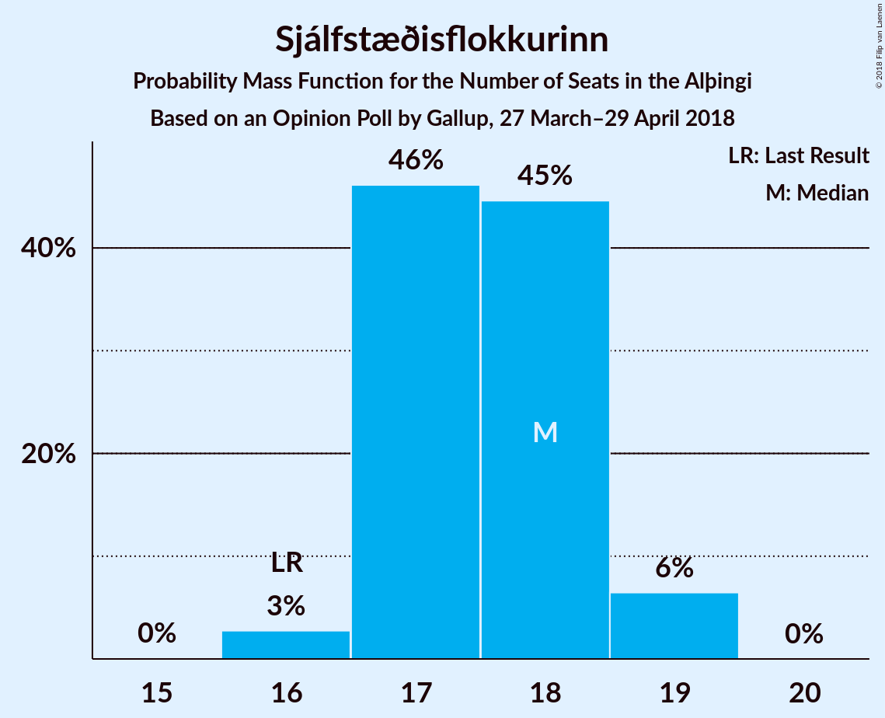

# Opinion Poll by Gallup, 27 March–29 April 2018

<a href="#voting-intentions">Voting Intentions</a> | <a href="#seats">Seats</a> | <a href="#coalitions">Coalitions</a> | <a href="#technical-information">Technical Information</a>

## Voting Intentions

### Confidence Intervals

| Party | Last Result | Poll Result | 80% Confidence Interval | 90% Confidence Interval | 95% Confidence Interval | 99% Confidence Interval |
|:-----:|:-----------:|:-----------:|:-----------------------:|:-----------------------:|:-----------------------:|:-----------------------:|
| Sjálfstæðisflokkurinn | 25.2% | 25.3% | 24.4–26.2% |24.2–26.5% |24.0–26.7% |23.5–27.1% |
| Samfylkingin | 12.1% | 17.7% | 16.9–18.5% |16.7–18.7% |16.5–18.9% |16.2–19.3% |
| Vinstrihreyfingin – grænt framboð | 16.9% | 14.1% | 13.4–14.8% |13.2–15.1% |13.0–15.2% |12.7–15.6% |
| Píratar | 9.2% | 11.0% | 10.4–11.7% |10.2–11.9% |10.0–12.0% |9.8–12.4% |
| Framsóknarflokkurinn | 10.7% | 9.6% | 9.0–10.2% |8.9–10.4% |8.7–10.6% |8.4–10.9% |
| Miðflokkurinn | 10.9% | 7.9% | 7.4–8.5% |7.2–8.7% |7.1–8.8% |6.8–9.1% |
| Viðreisn | 6.7% | 7.7% | 7.2–8.3% |7.0–8.4% |6.9–8.6% |6.6–8.9% |
| Flokkur fólksins | 6.9% | 4.2% | 3.8–4.6% |3.7–4.8% |3.6–4.9% |3.4–5.1% |

*Note:* The poll result column reflects the actual value used in the calculations. Published results may vary slightly, and in addition be rounded to fewer digits.

## Seats

### Confidence Intervals

| Party | Last Result | Median | 80% Confidence Interval | 90% Confidence Interval | 95% Confidence Interval | 99% Confidence Interval |
|:-----:|:-----------:|:------:|:-----------------------:|:-----------------------:|:-----------------------:|:-----------------------:|
| <a href="#sjálfstæðisflokkurinn">Sjálfstæðisflokkurinn</a> | 16 | 18 | 17–18 |17–19 |16–19 |16–19 |
| <a href="#samfylkingin">Samfylkingin</a> | 7 | 12 | 11–13 |11–13 |11–13 |11–13 |
| <a href="#vinstrihreyfingin-–-grænt-framboð">Vinstrihreyfingin – grænt framboð</a> | 11 | 10 | 9–10 |9–10 |9–10 |9–11 |
| <a href="#píratar">Píratar</a> | 6 | 7 | 7–8 |7–8 |7–8 |6–8 |
| <a href="#framsóknarflokkurinn">Framsóknarflokkurinn</a> | 8 | 6 | 6–7 |6–7 |6–8 |5–8 |
| <a href="#miðflokkurinn">Miðflokkurinn</a> | 7 | 5 | 5–6 |5–6 |5–6 |4–6 |
| <a href="#viðreisn">Viðreisn</a> | 4 | 5 | 5 |4–5 |4–6 |4–6 |
| <a href="#flokkur-fólksins">Flokkur fólksins</a> | 4 | 0 | 0 |0 |0 |0–3 |

### Sjálfstæðisflokkurinn

*For a full overview of the results for this party, see the [Sjálfstæðisflokkurinn](party-sjálfstæðisflokkurinn.html) page.*

| Number of Seats | Probability | Accumulated | Special Marks |
|:---------------:|:-----------:|:-----------:|:-------------:|
| 16 | 3% | 100% | Last Result |
| 17 | 46% | 97% |  |
| 18 | 45% | 51% | Median |
| 19 | 6% | 6% |  |
| 20 | 0% | 0% |  |

### Samfylkingin

*For a full overview of the results for this party, see the [Samfylkingin](party-samfylkingin.html) page.*

| Number of Seats | Probability | Accumulated | Special Marks |
|:---------------:|:-----------:|:-----------:|:-------------:|
| 7 | 0% | 100% | Last Result |
| 8 | 0% | 100% |  |
| 9 | 0% | 100% |  |
| 10 | 0% | 100% |  |
| 11 | 11% | 100% |  |
| 12 | 74% | 89% | Median |
| 13 | 15% | 15% |  |
| 14 | 0.2% | 0.2% |  |
| 15 | 0% | 0% |  |

### Vinstrihreyfingin – grænt framboð

*For a full overview of the results for this party, see the [Vinstrihreyfingin – grænt framboð](party-vinstrihreyfingin–græntframboð.html) page.*

| Number of Seats | Probability | Accumulated | Special Marks |
|:---------------:|:-----------:|:-----------:|:-------------:|
| 8 | 0.4% | 100% |  |
| 9 | 34% | 99.6% |  |
| 10 | 64% | 65% | Median |
| 11 | 0.8% | 0.8% | Last Result |
| 12 | 0% | 0% |  |

### Píratar

*For a full overview of the results for this party, see the [Píratar](party-píratar.html) page.*

| Number of Seats | Probability | Accumulated | Special Marks |
|:---------------:|:-----------:|:-----------:|:-------------:|
| 6 | 2% | 100% | Last Result |
| 7 | 65% | 98% | Median |
| 8 | 33% | 33% |  |
| 9 | 0.1% | 0.1% |  |
| 10 | 0% | 0% |  |

### Framsóknarflokkurinn

*For a full overview of the results for this party, see the [Framsóknarflokkurinn](party-framsóknarflokkurinn.html) page.*

| Number of Seats | Probability | Accumulated | Special Marks |
|:---------------:|:-----------:|:-----------:|:-------------:|
| 5 | 0.7% | 100% |  |
| 6 | 70% | 99.3% | Median |
| 7 | 26% | 29% |  |
| 8 | 3% | 3% | Last Result |
| 9 | 0% | 0% |  |

### Miðflokkurinn

*For a full overview of the results for this party, see the [Miðflokkurinn](party-miðflokkurinn.html) page.*

| Number of Seats | Probability | Accumulated | Special Marks |
|:---------------:|:-----------:|:-----------:|:-------------:|
| 4 | 2% | 100% |  |
| 5 | 84% | 98% | Median |
| 6 | 14% | 14% |  |
| 7 | 0% | 0% | Last Result |

### Viðreisn

*For a full overview of the results for this party, see the [Viðreisn](party-viðreisn.html) page.*

| Number of Seats | Probability | Accumulated | Special Marks |
|:---------------:|:-----------:|:-----------:|:-------------:|
| 4 | 7% | 100% | Last Result |
| 5 | 89% | 93% | Median |
| 6 | 4% | 4% |  |
| 7 | 0% | 0% |  |

### Flokkur fólksins

*For a full overview of the results for this party, see the [Flokkur fólksins](party-flokkurfólksins.html) page.*

| Number of Seats | Probability | Accumulated | Special Marks |
|:---------------:|:-----------:|:-----------:|:-------------:|
| 0 | 98.9% | 100% | Median |
| 1 | 0% | 1.1% |  |
| 2 | 0% | 1.1% |  |
| 3 | 1.1% | 1.1% |  |
| 4 | 0% | 0% | Last Result |

## Coalitions

### Confidence Intervals

| Coalition | Last Result | Median | Majority? | 80% Confidence Interval | 90% Confidence Interval | 95% Confidence Interval | 99% Confidence Interval |
|:---------:|:-----------:|:------:|:---------:|:-----------------------:|:-----------------------:|:-----------------------:|:-----------------------:|
| Samfylkingin – Vinstrihreyfingin – grænt framboð – Píratar – Viðreisn | 28 | 34 | 99.8% | 33–35 | 33–35 | 33–35 | 32–35 |
| Samfylkingin – Vinstrihreyfingin – grænt framboð – Framsóknarflokkurinn – Miðflokkurinn | 33 | 33 | 98.9% | 32–34 | 32–34 | 32–35 | 31–35 |
| Sjálfstæðisflokkurinn – Vinstrihreyfingin – grænt framboð – Framsóknarflokkurinn | 35 | 34 | 99.7% | 33–34 | 32–35 | 32–35 | 32–35 |
| Sjálfstæðisflokkurinn – Samfylkingin | 23 | 30 | 0.1% | 29–30 | 28–31 | 28–31 | 28–31 |
| Sjálfstæðisflokkurinn – Framsóknarflokkurinn – Miðflokkurinn | 31 | 29 | 0% | 28–30 | 28–30 | 28–30 | 27–31 |
| Samfylkingin – Vinstrihreyfingin – grænt framboð – Píratar | 24 | 29 | 0% | 28–30 | 28–30 | 28–30 | 27–31 |
| Samfylkingin – Vinstrihreyfingin – grænt framboð – Framsóknarflokkurinn | 26 | 28 | 0% | 27–29 | 27–29 | 27–29 | 26–30 |
| Sjálfstæðisflokkurinn – Vinstrihreyfingin – grænt framboð | 27 | 27 | 0% | 26–28 | 26–28 | 26–28 | 25–29 |
| Samfylkingin – Vinstrihreyfingin – grænt framboð – Miðflokkurinn | 25 | 27 | 0% | 26–28 | 26–28 | 25–28 | 25–28 |
| Sjálfstæðisflokkurinn – Framsóknarflokkurinn | 24 | 24 | 0% | 23–25 | 23–25 | 23–25 | 22–26 |
| Sjálfstæðisflokkurinn – Miðflokkurinn | 23 | 23 | 0% | 22–23 | 22–24 | 21–24 | 21–24 |
| Sjálfstæðisflokkurinn – Viðreisn | 20 | 22 | 0% | 22–23 | 22–24 | 21–24 | 21–24 |
| Samfylkingin – Vinstrihreyfingin – grænt framboð | 18 | 22 | 0% | 21–22 | 21–23 | 20–23 | 20–23 |
| Vinstrihreyfingin – grænt framboð – Framsóknarflokkurinn – Miðflokkurinn | 26 | 21 | 0% | 20–22 | 20–22 | 20–22 | 20–23 |
| Vinstrihreyfingin – grænt framboð – Píratar | 17 | 17 | 0% | 16–18 | 16–18 | 16–18 | 15–18 |
| Vinstrihreyfingin – grænt framboð – Framsóknarflokkurinn | 19 | 16 | 0% | 15–17 | 15–17 | 15–17 | 15–18 |
| Vinstrihreyfingin – grænt framboð – Miðflokkurinn | 18 | 15 | 0% | 14–15 | 14–16 | 14–16 | 13–16 |

### Samfylkingin – Vinstrihreyfingin – grænt framboð – Píratar – Viðreisn

| Number of Seats | Probability | Accumulated | Special Marks |
|:---------------:|:-----------:|:-----------:|:-------------:|
| 28 | 0% | 100% | Last Result |
| 29 | 0% | 100% |  |
| 30 | 0% | 100% |  |
| 31 | 0.2% | 100% |  |
| 32 | 2% | 99.8% | Majority |
| 33 | 23% | 98% |  |
| 34 | 51% | 75% | Median |
| 35 | 24% | 24% |  |
| 36 | 0.4% | 0.4% |  |
| 37 | 0% | 0% |  |

### Samfylkingin – Vinstrihreyfingin – grænt framboð – Framsóknarflokkurinn – Miðflokkurinn

| Number of Seats | Probability | Accumulated | Special Marks |
|:---------------:|:-----------:|:-----------:|:-------------:|
| 30 | 0.2% | 100% |  |
| 31 | 0.9% | 99.8% |  |
| 32 | 15% | 98.9% | Majority |
| 33 | 56% | 84% | Last Result, Median |
| 34 | 26% | 28% |  |
| 35 | 3% | 3% |  |
| 36 | 0% | 0% |  |

### Sjálfstæðisflokkurinn – Vinstrihreyfingin – grænt framboð – Framsóknarflokkurinn

| Number of Seats | Probability | Accumulated | Special Marks |
|:---------------:|:-----------:|:-----------:|:-------------:|
| 31 | 0.3% | 100% |  |
| 32 | 7% | 99.7% | Majority |
| 33 | 40% | 93% |  |
| 34 | 46% | 53% | Median |
| 35 | 7% | 7% | Last Result |
| 36 | 0.1% | 0.1% |  |
| 37 | 0% | 0% |  |

### Sjálfstæðisflokkurinn – Samfylkingin

| Number of Seats | Probability | Accumulated | Special Marks |
|:---------------:|:-----------:|:-----------:|:-------------:|
| 23 | 0% | 100% | Last Result |
| 24 | 0% | 100% |  |
| 25 | 0% | 100% |  |
| 26 | 0% | 100% |  |
| 27 | 0.2% | 100% |  |
| 28 | 5% | 99.8% |  |
| 29 | 39% | 94% |  |
| 30 | 46% | 56% | Median |
| 31 | 9% | 9% |  |
| 32 | 0.1% | 0.1% | Majority |
| 33 | 0% | 0% |  |

### Sjálfstæðisflokkurinn – Framsóknarflokkurinn – Miðflokkurinn

| Number of Seats | Probability | Accumulated | Special Marks |
|:---------------:|:-----------:|:-----------:|:-------------:|
| 27 | 0.7% | 100% |  |
| 28 | 25% | 99.3% |  |
| 29 | 51% | 75% | Median |
| 30 | 22% | 24% |  |
| 31 | 1.3% | 1.3% | Last Result |
| 32 | 0% | 0% | Majority |

### Samfylkingin – Vinstrihreyfingin – grænt framboð – Píratar

| Number of Seats | Probability | Accumulated | Special Marks |
|:---------------:|:-----------:|:-----------:|:-------------:|
| 24 | 0% | 100% | Last Result |
| 25 | 0% | 100% |  |
| 26 | 0.1% | 100% |  |
| 27 | 2% | 99.9% |  |
| 28 | 21% | 98% |  |
| 29 | 51% | 77% | Median |
| 30 | 25% | 25% |  |
| 31 | 0.5% | 0.5% |  |
| 32 | 0% | 0% | Majority |

### Samfylkingin – Vinstrihreyfingin – grænt framboð – Framsóknarflokkurinn

| Number of Seats | Probability | Accumulated | Special Marks |
|:---------------:|:-----------:|:-----------:|:-------------:|
| 25 | 0.1% | 100% |  |
| 26 | 1.2% | 99.9% | Last Result |
| 27 | 19% | 98.8% |  |
| 28 | 59% | 80% | Median |
| 29 | 20% | 21% |  |
| 30 | 2% | 2% |  |
| 31 | 0% | 0% |  |

### Sjálfstæðisflokkurinn – Vinstrihreyfingin – grænt framboð

| Number of Seats | Probability | Accumulated | Special Marks |
|:---------------:|:-----------:|:-----------:|:-------------:|
| 25 | 0.7% | 100% |  |
| 26 | 13% | 99.2% |  |
| 27 | 53% | 86% | Last Result |
| 28 | 30% | 33% | Median |
| 29 | 2% | 2% |  |
| 30 | 0% | 0% |  |

### Samfylkingin – Vinstrihreyfingin – grænt framboð – Miðflokkurinn

| Number of Seats | Probability | Accumulated | Special Marks |
|:---------------:|:-----------:|:-----------:|:-------------:|
| 24 | 0.2% | 100% |  |
| 25 | 3% | 99.8% | Last Result |
| 26 | 25% | 97% |  |
| 27 | 57% | 71% | Median |
| 28 | 14% | 14% |  |
| 29 | 0.4% | 0.4% |  |
| 30 | 0% | 0% |  |

### Sjálfstæðisflokkurinn – Framsóknarflokkurinn

| Number of Seats | Probability | Accumulated | Special Marks |
|:---------------:|:-----------:|:-----------:|:-------------:|
| 22 | 0.8% | 100% |  |
| 23 | 33% | 99.2% |  |
| 24 | 46% | 66% | Last Result, Median |
| 25 | 19% | 20% |  |
| 26 | 1.0% | 1.0% |  |
| 27 | 0% | 0% |  |

### Sjálfstæðisflokkurinn – Miðflokkurinn

| Number of Seats | Probability | Accumulated | Special Marks |
|:---------------:|:-----------:|:-----------:|:-------------:|
| 20 | 0.1% | 100% |  |
| 21 | 3% | 99.9% |  |
| 22 | 37% | 97% |  |
| 23 | 50% | 60% | Last Result, Median |
| 24 | 10% | 10% |  |
| 25 | 0.1% | 0.1% |  |
| 26 | 0% | 0% |  |

### Sjálfstæðisflokkurinn – Viðreisn

| Number of Seats | Probability | Accumulated | Special Marks |
|:---------------:|:-----------:|:-----------:|:-------------:|
| 20 | 0.1% | 100% | Last Result |
| 21 | 4% | 99.9% |  |
| 22 | 46% | 96% |  |
| 23 | 43% | 49% | Median |
| 24 | 7% | 7% |  |
| 25 | 0.2% | 0.2% |  |
| 26 | 0% | 0% |  |

### Samfylkingin – Vinstrihreyfingin – grænt framboð

| Number of Seats | Probability | Accumulated | Special Marks |
|:---------------:|:-----------:|:-----------:|:-------------:|
| 18 | 0% | 100% | Last Result |
| 19 | 0% | 100% |  |
| 20 | 3% | 100% |  |
| 21 | 30% | 97% |  |
| 22 | 60% | 67% | Median |
| 23 | 7% | 7% |  |
| 24 | 0.1% | 0.1% |  |
| 25 | 0% | 0% |  |

### Vinstrihreyfingin – grænt framboð – Framsóknarflokkurinn – Miðflokkurinn

| Number of Seats | Probability | Accumulated | Special Marks |
|:---------------:|:-----------:|:-----------:|:-------------:|
| 19 | 0.5% | 100% |  |
| 20 | 17% | 99.5% |  |
| 21 | 58% | 83% | Median |
| 22 | 22% | 25% |  |
| 23 | 2% | 2% |  |
| 24 | 0% | 0% |  |
| 25 | 0% | 0% |  |
| 26 | 0% | 0% | Last Result |

### Vinstrihreyfingin – grænt framboð – Píratar

| Number of Seats | Probability | Accumulated | Special Marks |
|:---------------:|:-----------:|:-----------:|:-------------:|
| 15 | 0.6% | 100% |  |
| 16 | 24% | 99.4% |  |
| 17 | 54% | 75% | Last Result, Median |
| 18 | 21% | 21% |  |
| 19 | 0.1% | 0.1% |  |
| 20 | 0% | 0% |  |

### Vinstrihreyfingin – grænt framboð – Framsóknarflokkurinn

| Number of Seats | Probability | Accumulated | Special Marks |
|:---------------:|:-----------:|:-----------:|:-------------:|
| 14 | 0.3% | 100% |  |
| 15 | 21% | 99.7% |  |
| 16 | 61% | 79% | Median |
| 17 | 16% | 17% |  |
| 18 | 1.5% | 2% |  |
| 19 | 0% | 0% | Last Result |

### Vinstrihreyfingin – grænt framboð – Miðflokkurinn

| Number of Seats | Probability | Accumulated | Special Marks |
|:---------------:|:-----------:|:-----------:|:-------------:|
| 13 | 0.9% | 100% |  |
| 14 | 29% | 99.1% |  |
| 15 | 61% | 70% | Median |
| 16 | 9% | 9% |  |
| 17 | 0% | 0% |  |
| 18 | 0% | 0% | Last Result |

## Technical Information

### Opinion Poll

+ **Polling firm:** Gallup
+ **Commissioner(s):** —
+ **Fieldwork period:** 27 March–29 April 2018

### Calculations

+ **Sample size:** 3809
+ **Simulations done:** 1,048,576
+ **Error estimate:** 0.58%

