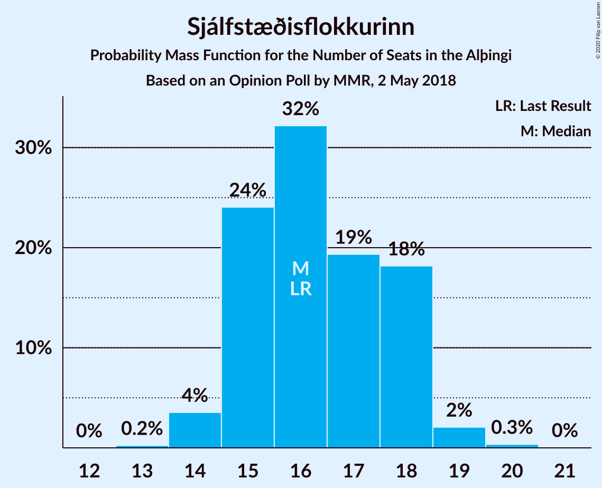
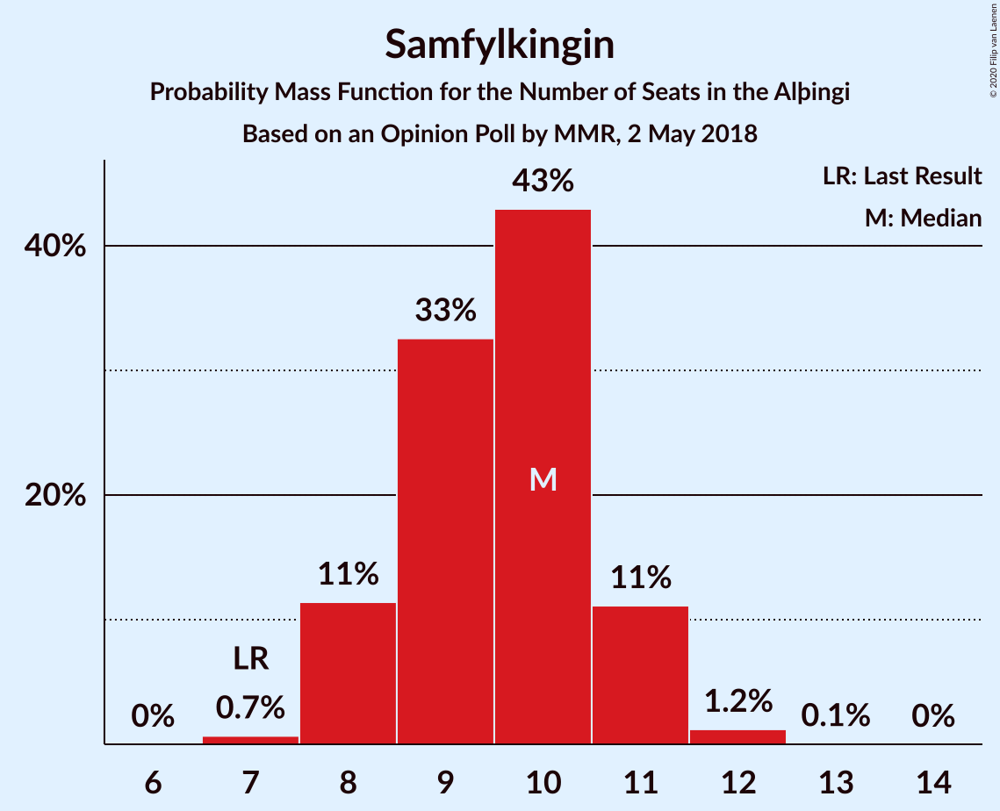
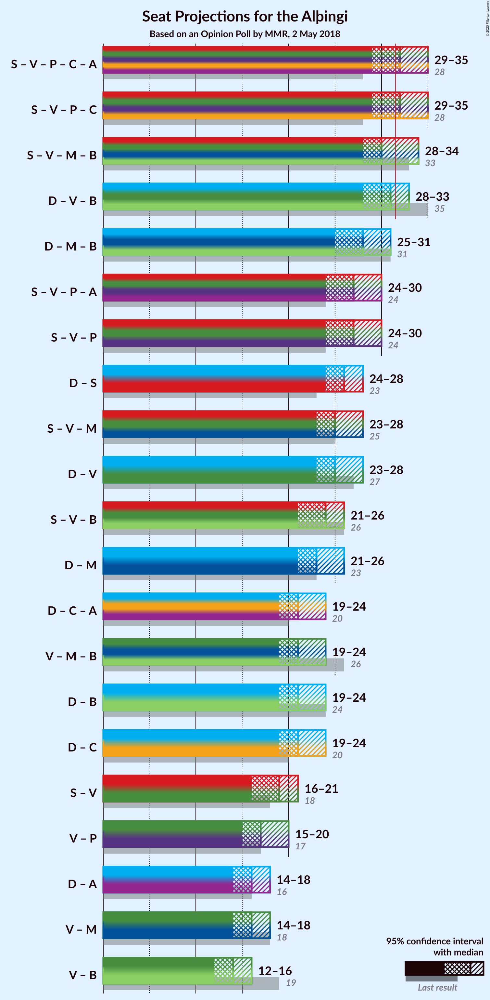
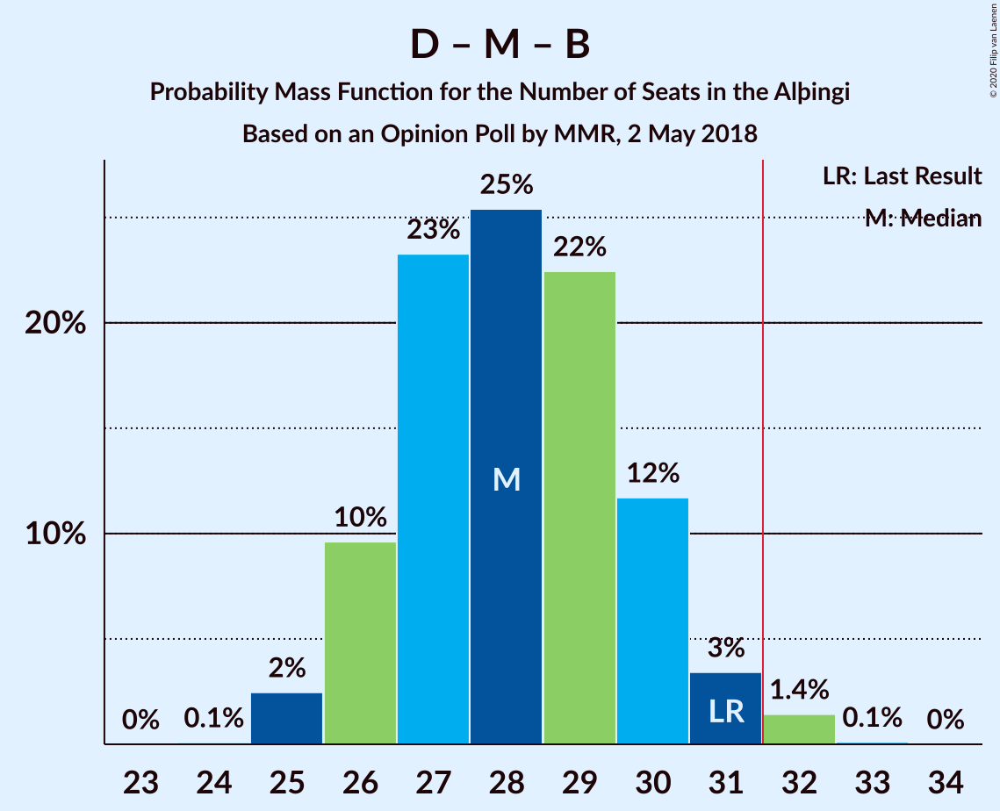

# Opinion Poll by MMR, 2 May 2018

<a href="#voting-intentions">Voting Intentions</a> | <a href="#seats">Seats</a> | <a href="#coalitions">Coalitions</a> | <a href="#technical-information">Technical Information</a>

## Voting Intentions

### Confidence Intervals

| Party | Last Result | Poll Result | 80% Confidence Interval | 90% Confidence Interval | 95% Confidence Interval | 99% Confidence Interval |
|:-----:|:-----------:|:-----------:|:-----------------------:|:-----------------------:|:-----------------------:|:-----------------------:|
| Sjálfstæðisflokkurinn | 25.2% | 24.5% | 22.7–26.4% |22.3–26.9% |21.8–27.4% |21.0–28.3% |
| Samfylkingin | 12.1% | 14.7% | 13.3–16.3% |12.9–16.8% |12.6–17.2% |11.9–18.0% |
| Vinstrihreyfingin – grænt framboð | 16.9% | 13.7% | 12.4–15.3% |12.0–15.7% |11.6–16.1% |11.0–16.9% |
| Píratar | 9.2% | 13.0% | 11.6–14.5% |11.3–14.9% |10.9–15.3% |10.3–16.1% |
| Miðflokkurinn | 10.9% | 10.3% | 9.1–11.7% |8.8–12.1% |8.5–12.5% |8.0–13.2% |
| Framsóknarflokkurinn | 10.7% | 8.2% | 7.2–9.5% |6.9–9.9% |6.6–10.2% |6.1–10.9% |
| Viðreisn | 6.7% | 7.6% | 6.6–8.8% |6.3–9.2% |6.0–9.5% |5.6–10.1% |
| Flokkur fólksins | 6.9% | 5.8% | 4.9–7.0% |4.7–7.3% |4.5–7.5% |4.1–8.1% |

*Note:* The poll result column reflects the actual value used in the calculations. Published results may vary slightly, and in addition be rounded to fewer digits.

## Seats

### Confidence Intervals

| Party | Last Result | Median | 80% Confidence Interval | 90% Confidence Interval | 95% Confidence Interval | 99% Confidence Interval |
|:-----:|:-----------:|:------:|:-----------------------:|:-----------------------:|:-----------------------:|:-----------------------:|
| <a href="#sjálfstæðisflokkurinn">Sjálfstæðisflokkurinn</a> | 16 | 16 | 15–18 |15–18 |14–18 |14–19 |
| <a href="#samfylkingin">Samfylkingin</a> | 7 | 10 | 8–11 |8–11 |8–11 |7–12 |
| <a href="#vinstrihreyfingin-–-grænt-framboð">Vinstrihreyfingin – grænt framboð</a> | 11 | 9 | 8–10 |8–10 |7–10 |7–11 |
| <a href="#píratar">Píratar</a> | 6 | 8 | 7–9 |7–10 |7–10 |6–10 |
| <a href="#miðflokkurinn">Miðflokkurinn</a> | 7 | 6 | 6–8 |5–9 |5–9 |5–9 |
| <a href="#framsóknarflokkurinn">Framsóknarflokkurinn</a> | 8 | 5 | 4–6 |4–6 |4–7 |4–7 |
| <a href="#viðreisn">Viðreisn</a> | 4 | 5 | 4–5 |4–6 |4–6 |3–6 |
| <a href="#flokkur-fólksins">Flokkur fólksins</a> | 4 | 4 | 0–4 |0–4 |0–5 |0–5 |

### Sjálfstæðisflokkurinn

*For a full overview of the results for this party, see the [Sjálfstæðisflokkurinn](party-sjálfstæðisflokkurinn.html) page.*

| Number of Seats | Probability | Accumulated | Special Marks |
|:---------------:|:-----------:|:-----------:|:-------------:|
| 13 | 0.2% | 100% |  |
| 14 | 4% | 99.8% |  |
| 15 | 24% | 96% |  |
| 16 | 32% | 72% | Last Result, Median |
| 17 | 19% | 40% |  |
| 18 | 18% | 21% |  |
| 19 | 2% | 2% |  |
| 20 | 0.3% | 0.4% |  |
| 21 | 0% | 0% |  |

### Samfylkingin

*For a full overview of the results for this party, see the [Samfylkingin](party-samfylkingin.html) page.*

| Number of Seats | Probability | Accumulated | Special Marks |
|:---------------:|:-----------:|:-----------:|:-------------:|
| 7 | 0.7% | 100% | Last Result |
| 8 | 11% | 99.3% |  |
| 9 | 33% | 88% |  |
| 10 | 43% | 55% | Median |
| 11 | 11% | 12% |  |
| 12 | 1.2% | 1.3% |  |
| 13 | 0.1% | 0.1% |  |
| 14 | 0% | 0% |  |

### Vinstrihreyfingin – grænt framboð

*For a full overview of the results for this party, see the [Vinstrihreyfingin – grænt framboð](party-vinstrihreyfingin–græntframboð.html) page.*

| Number of Seats | Probability | Accumulated | Special Marks |
|:---------------:|:-----------:|:-----------:|:-------------:|
| 6 | 0.1% | 100% |  |
| 7 | 3% | 99.9% |  |
| 8 | 24% | 96% |  |
| 9 | 34% | 73% | Median |
| 10 | 36% | 39% |  |
| 11 | 2% | 2% | Last Result |
| 12 | 0.1% | 0.1% |  |
| 13 | 0% | 0% |  |

### Píratar

*For a full overview of the results for this party, see the [Píratar](party-píratar.html) page.*

| Number of Seats | Probability | Accumulated | Special Marks |
|:---------------:|:-----------:|:-----------:|:-------------:|
| 6 | 0.6% | 100% | Last Result |
| 7 | 15% | 99.4% |  |
| 8 | 45% | 85% | Median |
| 9 | 32% | 40% |  |
| 10 | 8% | 8% |  |
| 11 | 0.5% | 0.5% |  |
| 12 | 0% | 0% |  |

### Miðflokkurinn

*For a full overview of the results for this party, see the [Miðflokkurinn](party-miðflokkurinn.html) page.*

| Number of Seats | Probability | Accumulated | Special Marks |
|:---------------:|:-----------:|:-----------:|:-------------:|
| 4 | 0.1% | 100% |  |
| 5 | 6% | 99.9% |  |
| 6 | 45% | 94% | Median |
| 7 | 35% | 49% | Last Result |
| 8 | 8% | 14% |  |
| 9 | 6% | 6% |  |
| 10 | 0.3% | 0.3% |  |
| 11 | 0% | 0% |  |

### Framsóknarflokkurinn

*For a full overview of the results for this party, see the [Framsóknarflokkurinn](party-framsóknarflokkurinn.html) page.*

| Number of Seats | Probability | Accumulated | Special Marks |
|:---------------:|:-----------:|:-----------:|:-------------:|
| 3 | 0.2% | 100% |  |
| 4 | 15% | 99.8% |  |
| 5 | 54% | 85% | Median |
| 6 | 27% | 30% |  |
| 7 | 2% | 3% |  |
| 8 | 0.2% | 0.2% | Last Result |
| 9 | 0% | 0% |  |

### Viðreisn

*For a full overview of the results for this party, see the [Viðreisn](party-viðreisn.html) page.*

| Number of Seats | Probability | Accumulated | Special Marks |
|:---------------:|:-----------:|:-----------:|:-------------:|
| 3 | 2% | 100% |  |
| 4 | 38% | 98% | Last Result |
| 5 | 51% | 61% | Median |
| 6 | 9% | 10% |  |
| 7 | 0.3% | 0.3% |  |
| 8 | 0% | 0% |  |

### Flokkur fólksins

*For a full overview of the results for this party, see the [Flokkur fólksins](party-flokkurfólksins.html) page.*

| Number of Seats | Probability | Accumulated | Special Marks |
|:---------------:|:-----------:|:-----------:|:-------------:|
| 0 | 13% | 100% |  |
| 1 | 0% | 87% |  |
| 2 | 0% | 87% |  |
| 3 | 35% | 87% |  |
| 4 | 49% | 53% | Last Result, Median |
| 5 | 4% | 4% |  |
| 6 | 0% | 0% |  |

## Coalitions

### Confidence Intervals

| Coalition | Last Result | Median | Majority? | 80% Confidence Interval | 90% Confidence Interval | 95% Confidence Interval | 99% Confidence Interval |
|:---------:|:-----------:|:------:|:---------:|:-----------------------:|:-----------------------:|:-----------------------:|:-----------------------:|
| Samfylkingin – Vinstrihreyfingin – grænt framboð – Píratar – Viðreisn | 28 | 32 | 55% | 30–34 | 29–34 | 29–35 | 28–36 |
| Samfylkingin – Vinstrihreyfingin – grænt framboð – Miðflokkurinn – Framsóknarflokkurinn | 33 | 30 | 23% | 29–32 | 28–33 | 28–34 | 27–34 |
| Sjálfstæðisflokkurinn – Vinstrihreyfingin – grænt framboð – Framsóknarflokkurinn | 35 | 31 | 25% | 29–33 | 28–33 | 28–33 | 27–34 |
| Sjálfstæðisflokkurinn – Miðflokkurinn – Framsóknarflokkurinn | 31 | 28 | 2% | 26–30 | 26–30 | 25–31 | 25–32 |
| Samfylkingin – Vinstrihreyfingin – grænt framboð – Píratar | 24 | 27 | 0.1% | 25–29 | 25–29 | 24–30 | 24–30 |
| Sjálfstæðisflokkurinn – Samfylkingin | 23 | 26 | 0% | 24–27 | 24–28 | 24–28 | 23–29 |
| Samfylkingin – Vinstrihreyfingin – grænt framboð – Miðflokkurinn | 25 | 25 | 0% | 24–27 | 23–28 | 23–28 | 22–29 |
| Sjálfstæðisflokkurinn – Vinstrihreyfingin – grænt framboð | 27 | 25 | 0% | 24–27 | 23–28 | 23–28 | 22–29 |
| Samfylkingin – Vinstrihreyfingin – grænt framboð – Framsóknarflokkurinn | 26 | 24 | 0% | 22–26 | 22–26 | 21–26 | 21–27 |
| Sjálfstæðisflokkurinn – Miðflokkurinn | 23 | 23 | 0% | 21–25 | 21–25 | 21–26 | 20–27 |
| Vinstrihreyfingin – grænt framboð – Miðflokkurinn – Framsóknarflokkurinn | 26 | 21 | 0% | 19–22 | 19–23 | 19–24 | 18–24 |
| Sjálfstæðisflokkurinn – Framsóknarflokkurinn | 24 | 21 | 0% | 20–23 | 19–24 | 19–24 | 19–25 |
| Sjálfstæðisflokkurinn – Viðreisn | 20 | 21 | 0% | 19–23 | 19–23 | 19–24 | 18–24 |
| Samfylkingin – Vinstrihreyfingin – grænt framboð | 18 | 19 | 0% | 17–20 | 17–21 | 16–21 | 15–22 |
| Vinstrihreyfingin – grænt framboð – Píratar | 17 | 17 | 0% | 16–19 | 16–19 | 15–20 | 15–20 |
| Vinstrihreyfingin – grænt framboð – Miðflokkurinn | 18 | 16 | 0% | 14–17 | 14–18 | 14–18 | 13–19 |
| Vinstrihreyfingin – grænt framboð – Framsóknarflokkurinn | 19 | 14 | 0% | 13–15 | 13–16 | 12–16 | 11–17 |

### Samfylkingin – Vinstrihreyfingin – grænt framboð – Píratar – Viðreisn

| Number of Seats | Probability | Accumulated | Special Marks |
|:---------------:|:-----------:|:-----------:|:-------------:|
| 27 | 0.1% | 100% |  |
| 28 | 0.8% | 99.9% | Last Result |
| 29 | 5% | 99.1% |  |
| 30 | 16% | 94% |  |
| 31 | 24% | 79% |  |
| 32 | 27% | 55% | Median, Majority |
| 33 | 17% | 28% |  |
| 34 | 8% | 11% |  |
| 35 | 2% | 3% |  |
| 36 | 0.5% | 0.5% |  |
| 37 | 0% | 0.1% |  |
| 38 | 0% | 0% |  |

### Samfylkingin – Vinstrihreyfingin – grænt framboð – Miðflokkurinn – Framsóknarflokkurinn

| Number of Seats | Probability | Accumulated | Special Marks |
|:---------------:|:-----------:|:-----------:|:-------------:|
| 26 | 0.1% | 100% |  |
| 27 | 2% | 99.9% |  |
| 28 | 7% | 98% |  |
| 29 | 14% | 91% |  |
| 30 | 31% | 78% | Median |
| 31 | 24% | 47% |  |
| 32 | 15% | 23% | Majority |
| 33 | 5% | 8% | Last Result |
| 34 | 3% | 3% |  |
| 35 | 0.2% | 0.2% |  |
| 36 | 0% | 0% |  |

### Sjálfstæðisflokkurinn – Vinstrihreyfingin – grænt framboð – Framsóknarflokkurinn

| Number of Seats | Probability | Accumulated | Special Marks |
|:---------------:|:-----------:|:-----------:|:-------------:|
| 26 | 0.1% | 100% |  |
| 27 | 0.8% | 99.9% |  |
| 28 | 8% | 99.1% |  |
| 29 | 14% | 92% |  |
| 30 | 25% | 78% | Median |
| 31 | 27% | 53% |  |
| 32 | 15% | 25% | Majority |
| 33 | 9% | 10% |  |
| 34 | 2% | 2% |  |
| 35 | 0.3% | 0.3% | Last Result |
| 36 | 0% | 0% |  |

### Sjálfstæðisflokkurinn – Miðflokkurinn – Framsóknarflokkurinn

| Number of Seats | Probability | Accumulated | Special Marks |
|:---------------:|:-----------:|:-----------:|:-------------:|
| 24 | 0.1% | 100% |  |
| 25 | 2% | 99.9% |  |
| 26 | 10% | 97% |  |
| 27 | 23% | 88% | Median |
| 28 | 25% | 65% |  |
| 29 | 22% | 39% |  |
| 30 | 12% | 17% |  |
| 31 | 3% | 5% | Last Result |
| 32 | 1.4% | 2% | Majority |
| 33 | 0.1% | 0.1% |  |
| 34 | 0% | 0% |  |

### Samfylkingin – Vinstrihreyfingin – grænt framboð – Píratar

| Number of Seats | Probability | Accumulated | Special Marks |
|:---------------:|:-----------:|:-----------:|:-------------:|
| 23 | 0.3% | 100% |  |
| 24 | 3% | 99.7% | Last Result |
| 25 | 10% | 97% |  |
| 26 | 24% | 87% |  |
| 27 | 27% | 63% | Median |
| 28 | 22% | 36% |  |
| 29 | 11% | 14% |  |
| 30 | 3% | 4% |  |
| 31 | 0.4% | 0.5% |  |
| 32 | 0% | 0.1% | Majority |
| 33 | 0% | 0% |  |

### Sjálfstæðisflokkurinn – Samfylkingin

| Number of Seats | Probability | Accumulated | Special Marks |
|:---------------:|:-----------:|:-----------:|:-------------:|
| 22 | 0.4% | 100% |  |
| 23 | 2% | 99.6% | Last Result |
| 24 | 8% | 98% |  |
| 25 | 32% | 90% |  |
| 26 | 25% | 58% | Median |
| 27 | 25% | 32% |  |
| 28 | 6% | 8% |  |
| 29 | 2% | 2% |  |
| 30 | 0.3% | 0.4% |  |
| 31 | 0.1% | 0.1% |  |
| 32 | 0% | 0% | Majority |

### Samfylkingin – Vinstrihreyfingin – grænt framboð – Miðflokkurinn

| Number of Seats | Probability | Accumulated | Special Marks |
|:---------------:|:-----------:|:-----------:|:-------------:|
| 21 | 0.2% | 100% |  |
| 22 | 2% | 99.8% |  |
| 23 | 7% | 98% |  |
| 24 | 19% | 91% |  |
| 25 | 26% | 71% | Last Result, Median |
| 26 | 27% | 45% |  |
| 27 | 12% | 18% |  |
| 28 | 6% | 7% |  |
| 29 | 0.8% | 0.9% |  |
| 30 | 0.1% | 0.1% |  |
| 31 | 0% | 0% |  |

### Sjálfstæðisflokkurinn – Vinstrihreyfingin – grænt framboð

| Number of Seats | Probability | Accumulated | Special Marks |
|:---------------:|:-----------:|:-----------:|:-------------:|
| 21 | 0.1% | 100% |  |
| 22 | 0.8% | 99.9% |  |
| 23 | 8% | 99.1% |  |
| 24 | 15% | 91% |  |
| 25 | 32% | 76% | Median |
| 26 | 22% | 44% |  |
| 27 | 12% | 22% | Last Result |
| 28 | 9% | 10% |  |
| 29 | 0.7% | 0.9% |  |
| 30 | 0.1% | 0.1% |  |
| 31 | 0% | 0% |  |

### Samfylkingin – Vinstrihreyfingin – grænt framboð – Framsóknarflokkurinn

| Number of Seats | Probability | Accumulated | Special Marks |
|:---------------:|:-----------:|:-----------:|:-------------:|
| 19 | 0.1% | 100% |  |
| 20 | 0.4% | 99.9% |  |
| 21 | 4% | 99.5% |  |
| 22 | 11% | 95% |  |
| 23 | 23% | 84% |  |
| 24 | 30% | 61% | Median |
| 25 | 21% | 31% |  |
| 26 | 8% | 10% | Last Result |
| 27 | 2% | 2% |  |
| 28 | 0.3% | 0.3% |  |
| 29 | 0% | 0% |  |

### Sjálfstæðisflokkurinn – Miðflokkurinn

| Number of Seats | Probability | Accumulated | Special Marks |
|:---------------:|:-----------:|:-----------:|:-------------:|
| 19 | 0.1% | 100% |  |
| 20 | 2% | 99.9% |  |
| 21 | 12% | 98% |  |
| 22 | 29% | 86% | Median |
| 23 | 20% | 58% | Last Result |
| 24 | 26% | 37% |  |
| 25 | 7% | 11% |  |
| 26 | 3% | 4% |  |
| 27 | 0.7% | 0.8% |  |
| 28 | 0% | 0.1% |  |
| 29 | 0% | 0% |  |

### Vinstrihreyfingin – grænt framboð – Miðflokkurinn – Framsóknarflokkurinn

| Number of Seats | Probability | Accumulated | Special Marks |
|:---------------:|:-----------:|:-----------:|:-------------:|
| 17 | 0.2% | 100% |  |
| 18 | 2% | 99.8% |  |
| 19 | 9% | 98% |  |
| 20 | 25% | 89% | Median |
| 21 | 35% | 64% |  |
| 22 | 19% | 29% |  |
| 23 | 6% | 9% |  |
| 24 | 3% | 3% |  |
| 25 | 0.2% | 0.3% |  |
| 26 | 0% | 0% | Last Result |

### Sjálfstæðisflokkurinn – Framsóknarflokkurinn

| Number of Seats | Probability | Accumulated | Special Marks |
|:---------------:|:-----------:|:-----------:|:-------------:|
| 18 | 0.4% | 100% |  |
| 19 | 5% | 99.6% |  |
| 20 | 20% | 95% |  |
| 21 | 27% | 75% | Median |
| 22 | 25% | 49% |  |
| 23 | 17% | 24% |  |
| 24 | 5% | 6% | Last Result |
| 25 | 1.0% | 1.0% |  |
| 26 | 0.1% | 0.1% |  |
| 27 | 0% | 0% |  |

### Sjálfstæðisflokkurinn – Viðreisn

| Number of Seats | Probability | Accumulated | Special Marks |
|:---------------:|:-----------:|:-----------:|:-------------:|
| 17 | 0.1% | 100% |  |
| 18 | 2% | 99.9% |  |
| 19 | 10% | 98% |  |
| 20 | 26% | 88% | Last Result |
| 21 | 28% | 63% | Median |
| 22 | 22% | 35% |  |
| 23 | 10% | 13% |  |
| 24 | 3% | 3% |  |
| 25 | 0.4% | 0.4% |  |
| 26 | 0.1% | 0.1% |  |
| 27 | 0% | 0% |  |

### Samfylkingin – Vinstrihreyfingin – grænt framboð

| Number of Seats | Probability | Accumulated | Special Marks |
|:---------------:|:-----------:|:-----------:|:-------------:|
| 15 | 0.5% | 100% |  |
| 16 | 4% | 99.4% |  |
| 17 | 12% | 96% |  |
| 18 | 28% | 84% | Last Result |
| 19 | 30% | 56% | Median |
| 20 | 21% | 26% |  |
| 21 | 5% | 5% |  |
| 22 | 0.7% | 0.7% |  |
| 23 | 0.1% | 0.1% |  |
| 24 | 0% | 0% |  |

### Vinstrihreyfingin – grænt framboð – Píratar

| Number of Seats | Probability | Accumulated | Special Marks |
|:---------------:|:-----------:|:-----------:|:-------------:|
| 14 | 0.5% | 100% |  |
| 15 | 4% | 99.5% |  |
| 16 | 16% | 96% |  |
| 17 | 32% | 80% | Last Result, Median |
| 18 | 31% | 48% |  |
| 19 | 14% | 17% |  |
| 20 | 3% | 3% |  |
| 21 | 0.2% | 0.3% |  |
| 22 | 0% | 0% |  |

### Vinstrihreyfingin – grænt framboð – Miðflokkurinn

| Number of Seats | Probability | Accumulated | Special Marks |
|:---------------:|:-----------:|:-----------:|:-------------:|
| 12 | 0.1% | 100% |  |
| 13 | 2% | 99.9% |  |
| 14 | 11% | 98% |  |
| 15 | 29% | 87% | Median |
| 16 | 35% | 58% |  |
| 17 | 16% | 23% |  |
| 18 | 6% | 7% | Last Result |
| 19 | 1.1% | 1.2% |  |
| 20 | 0.1% | 0.1% |  |
| 21 | 0% | 0% |  |

### Vinstrihreyfingin – grænt framboð – Framsóknarflokkurinn

| Number of Seats | Probability | Accumulated | Special Marks |
|:---------------:|:-----------:|:-----------:|:-------------:|
| 11 | 0.5% | 100% |  |
| 12 | 4% | 99.4% |  |
| 13 | 20% | 95% |  |
| 14 | 28% | 75% | Median |
| 15 | 37% | 47% |  |
| 16 | 8% | 10% |  |
| 17 | 1.3% | 1.4% |  |
| 18 | 0.1% | 0.1% |  |
| 19 | 0% | 0% | Last Result |

## Technical Information

### Opinion Poll

+ **Polling firm:** MMR
+ **Commissioner(s):** —
+ **Fieldwork period:** 2 May 2018

### Calculations

+ **Sample size:** 910
+ **Simulations done:** 1,048,576
+ **Error estimate:** 0.88%

