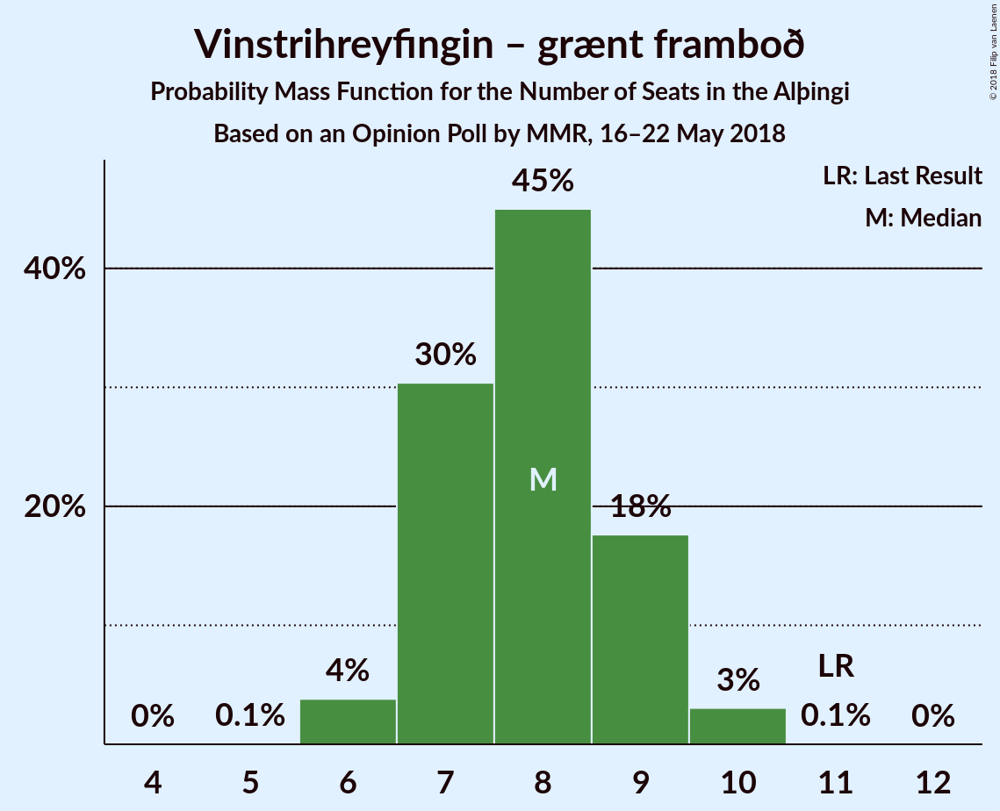

# Opinion Poll by MMR, 16–22 May 2018

<a href="#voting-intentions">Voting Intentions</a> | <a href="#seats">Seats</a> | <a href="#coalitions">Coalitions</a> | <a href="#technical-information">Technical Information</a>

## Voting Intentions

### Confidence Intervals

| Party | Last Result | Poll Result | 80% Confidence Interval | 90% Confidence Interval | 95% Confidence Interval | 99% Confidence Interval |
|:-----:|:-----------:|:-----------:|:-----------------------:|:-----------------------:|:-----------------------:|:-----------------------:|
| Sjálfstæðisflokkurinn | 25.2% | 23.7% | 22.0–25.5% |21.5–26.1% |21.1–26.5% |20.3–27.4% |
| Samfylkingin | 12.1% | 14.6% | 13.2–16.2% |12.8–16.7% |12.5–17.1% |11.9–17.8% |
| Píratar | 9.2% | 14.1% | 12.7–15.7% |12.3–16.1% |12.0–16.5% |11.4–17.3% |
| Vinstrihreyfingin – grænt framboð | 16.9% | 11.9% | 10.7–13.4% |10.3–13.8% |10.0–14.2% |9.4–14.9% |
| Framsóknarflokkurinn | 10.7% | 10.1% | 8.9–11.5% |8.6–11.9% |8.3–12.2% |7.8–12.9% |
| Miðflokkurinn | 10.9% | 9.8% | 8.6–11.2% |8.3–11.5% |8.0–11.9% |7.5–12.6% |
| Viðreisn | 6.7% | 7.1% | 6.1–8.3% |5.9–8.6% |5.6–8.9% |5.2–9.5% |
| Flokkur fólksins | 6.9% | 5.6% | 4.7–6.7% |4.5–7.0% |4.3–7.3% |3.9–7.8% |

*Note:* The poll result column reflects the actual value used in the calculations. Published results may vary slightly, and in addition be rounded to fewer digits.

## Seats

### Confidence Intervals

| Party | Last Result | Median | 80% Confidence Interval | 90% Confidence Interval | 95% Confidence Interval | 99% Confidence Interval |
|:-----:|:-----------:|:------:|:-----------------------:|:-----------------------:|:-----------------------:|:-----------------------:|
| <a href="#sjálfstæðisflokkurinn">Sjálfstæðisflokkurinn</a> | 16 | 16 | 15–18 |14–18 |14–18 |13–19 |
| <a href="#samfylkingin">Samfylkingin</a> | 7 | 10 | 8–11 |8–11 |8–11 |7–12 |
| <a href="#píratar">Píratar</a> | 6 | 9 | 8–10 |8–11 |8–11 |7–12 |
| <a href="#vinstrihreyfingin-–-grænt-framboð">Vinstrihreyfingin – grænt framboð</a> | 11 | 8 | 7–9 |7–9 |6–10 |6–10 |
| <a href="#framsóknarflokkurinn">Framsóknarflokkurinn</a> | 8 | 7 | 6–8 |5–8 |5–8 |5–9 |
| <a href="#miðflokkurinn">Miðflokkurinn</a> | 7 | 6 | 5–7 |5–8 |5–8 |5–9 |
| <a href="#viðreisn">Viðreisn</a> | 4 | 4 | 4–5 |3–5 |3–6 |3–6 |
| <a href="#flokkur-fólksins">Flokkur fólksins</a> | 4 | 3 | 0–4 |0–4 |0–4 |0–5 |

### Sjálfstæðisflokkurinn

*For a full overview of the results for this party, see the [Sjálfstæðisflokkurinn](party-sjálfstæðisflokkurinn.html) page.*

| Number of Seats | Probability | Accumulated | Special Marks |
|:---------------:|:-----------:|:-----------:|:-------------:|
| 13 | 0.9% | 100% |  |
| 14 | 8% | 99.1% |  |
| 15 | 25% | 91% |  |
| 16 | 38% | 66% | Last Result, Median |
| 17 | 16% | 28% |  |
| 18 | 10% | 12% |  |
| 19 | 1.1% | 1.2% |  |
| 20 | 0.1% | 0.1% |  |
| 21 | 0% | 0% |  |

### Samfylkingin

*For a full overview of the results for this party, see the [Samfylkingin](party-samfylkingin.html) page.*

| Number of Seats | Probability | Accumulated | Special Marks |
|:---------------:|:-----------:|:-----------:|:-------------:|
| 7 | 0.5% | 100% | Last Result |
| 8 | 10% | 99.5% |  |
| 9 | 30% | 90% |  |
| 10 | 45% | 60% | Median |
| 11 | 14% | 15% |  |
| 12 | 1.1% | 1.3% |  |
| 13 | 0.1% | 0.1% |  |
| 14 | 0% | 0% |  |

### Píratar

*For a full overview of the results for this party, see the [Píratar](party-píratar.html) page.*

| Number of Seats | Probability | Accumulated | Special Marks |
|:---------------:|:-----------:|:-----------:|:-------------:|
| 6 | 0% | 100% | Last Result |
| 7 | 1.1% | 100% |  |
| 8 | 15% | 98.9% |  |
| 9 | 48% | 84% | Median |
| 10 | 28% | 36% |  |
| 11 | 8% | 8% |  |
| 12 | 0.5% | 0.5% |  |
| 13 | 0% | 0% |  |

### Vinstrihreyfingin – grænt framboð

*For a full overview of the results for this party, see the [Vinstrihreyfingin – grænt framboð](party-vinstrihreyfingin–græntframboð.html) page.*

| Number of Seats | Probability | Accumulated | Special Marks |
|:---------------:|:-----------:|:-----------:|:-------------:|
| 5 | 0.1% | 100% |  |
| 6 | 4% | 99.9% |  |
| 7 | 30% | 96% |  |
| 8 | 45% | 66% | Median |
| 9 | 18% | 21% |  |
| 10 | 3% | 3% |  |
| 11 | 0.1% | 0.1% | Last Result |
| 12 | 0% | 0% |  |

### Framsóknarflokkurinn

*For a full overview of the results for this party, see the [Framsóknarflokkurinn](party-framsóknarflokkurinn.html) page.*

| Number of Seats | Probability | Accumulated | Special Marks |
|:---------------:|:-----------:|:-----------:|:-------------:|
| 4 | 0.1% | 100% |  |
| 5 | 7% | 99.9% |  |
| 6 | 38% | 93% |  |
| 7 | 41% | 55% | Median |
| 8 | 13% | 14% | Last Result |
| 9 | 0.6% | 0.9% |  |
| 10 | 0.4% | 0.4% |  |
| 11 | 0% | 0% |  |

### Miðflokkurinn

*For a full overview of the results for this party, see the [Miðflokkurinn](party-miðflokkurinn.html) page.*

| Number of Seats | Probability | Accumulated | Special Marks |
|:---------------:|:-----------:|:-----------:|:-------------:|
| 4 | 0.3% | 100% |  |
| 5 | 12% | 99.7% |  |
| 6 | 53% | 88% | Median |
| 7 | 29% | 35% | Last Result |
| 8 | 4% | 7% |  |
| 9 | 2% | 2% |  |
| 10 | 0.1% | 0.1% |  |
| 11 | 0% | 0% |  |

### Viðreisn

*For a full overview of the results for this party, see the [Viðreisn](party-viðreisn.html) page.*

| Number of Seats | Probability | Accumulated | Special Marks |
|:---------------:|:-----------:|:-----------:|:-------------:|
| 0 | 0.3% | 100% |  |
| 1 | 0% | 99.7% |  |
| 2 | 0% | 99.7% |  |
| 3 | 5% | 99.7% |  |
| 4 | 47% | 94% | Last Result, Median |
| 5 | 43% | 48% |  |
| 6 | 4% | 4% |  |
| 7 | 0.1% | 0.1% |  |
| 8 | 0% | 0% |  |

### Flokkur fólksins

*For a full overview of the results for this party, see the [Flokkur fólksins](party-flokkurfólksins.html) page.*

| Number of Seats | Probability | Accumulated | Special Marks |
|:---------------:|:-----------:|:-----------:|:-------------:|
| 0 | 20% | 100% |  |
| 1 | 0% | 80% |  |
| 2 | 0% | 80% |  |
| 3 | 42% | 80% | Median |
| 4 | 36% | 38% | Last Result |
| 5 | 2% | 2% |  |
| 6 | 0% | 0% |  |

## Coalitions

### Confidence Intervals

| Coalition | Last Result | Median | Majority? | 80% Confidence Interval | 90% Confidence Interval | 95% Confidence Interval | 99% Confidence Interval |
|:---------:|:-----------:|:------:|:---------:|:-----------------------:|:-----------------------:|:-----------------------:|:-----------------------:|
| Samfylkingin – Píratar – Vinstrihreyfingin – grænt framboð – Viðreisn | 28 | 31 | 43% | 29–33 | 29–34 | 28–34 | 28–35 |
| Samfylkingin – Vinstrihreyfingin – grænt framboð – Framsóknarflokkurinn – Miðflokkurinn | 33 | 30 | 21% | 29–32 | 28–33 | 28–33 | 27–35 |
| Sjálfstæðisflokkurinn – Vinstrihreyfingin – grænt framboð – Framsóknarflokkurinn | 35 | 30 | 23% | 29–32 | 28–33 | 28–33 | 27–34 |
| Sjálfstæðisflokkurinn – Framsóknarflokkurinn – Miðflokkurinn | 31 | 29 | 3% | 27–31 | 27–31 | 26–32 | 26–33 |
| Samfylkingin – Píratar – Vinstrihreyfingin – grænt framboð | 24 | 27 | 0.1% | 25–29 | 25–29 | 24–30 | 23–30 |
| Sjálfstæðisflokkurinn – Samfylkingin | 23 | 26 | 0% | 24–27 | 23–28 | 23–28 | 22–29 |
| Samfylkingin – Vinstrihreyfingin – grænt framboð – Framsóknarflokkurinn | 26 | 24 | 0% | 22–26 | 22–26 | 21–27 | 21–28 |
| Samfylkingin – Vinstrihreyfingin – grænt framboð – Miðflokkurinn | 25 | 24 | 0% | 22–26 | 22–26 | 21–27 | 20–28 |
| Sjálfstæðisflokkurinn – Vinstrihreyfingin – grænt framboð | 27 | 24 | 0% | 22–26 | 22–26 | 21–27 | 21–27 |
| Sjálfstæðisflokkurinn – Framsóknarflokkurinn | 24 | 23 | 0% | 21–24 | 20–25 | 20–25 | 20–26 |
| Sjálfstæðisflokkurinn – Miðflokkurinn | 23 | 22 | 0% | 21–24 | 20–25 | 20–25 | 19–26 |
| Vinstrihreyfingin – grænt framboð – Framsóknarflokkurinn – Miðflokkurinn | 26 | 21 | 0% | 19–22 | 19–23 | 18–23 | 18–24 |
| Sjálfstæðisflokkurinn – Viðreisn | 20 | 20 | 0% | 19–22 | 18–23 | 18–23 | 17–24 |
| Samfylkingin – Vinstrihreyfingin – grænt framboð | 18 | 18 | 0% | 16–19 | 16–19 | 15–20 | 15–21 |
| Píratar – Vinstrihreyfingin – grænt framboð | 17 | 17 | 0% | 16–19 | 15–19 | 15–19 | 14–20 |
| Vinstrihreyfingin – grænt framboð – Framsóknarflokkurinn | 19 | 14 | 0% | 13–16 | 13–16 | 12–17 | 12–18 |
| Vinstrihreyfingin – grænt framboð – Miðflokkurinn | 18 | 14 | 0% | 13–16 | 12–16 | 12–16 | 12–17 |

### Samfylkingin – Píratar – Vinstrihreyfingin – grænt framboð – Viðreisn

| Number of Seats | Probability | Accumulated | Special Marks |
|:---------------:|:-----------:|:-----------:|:-------------:|
| 27 | 0.3% | 100% |  |
| 28 | 2% | 99.7% | Last Result |
| 29 | 9% | 97% |  |
| 30 | 19% | 88% |  |
| 31 | 26% | 69% | Median |
| 32 | 23% | 43% | Majority |
| 33 | 14% | 20% |  |
| 34 | 5% | 6% |  |
| 35 | 1.0% | 1.2% |  |
| 36 | 0.2% | 0.2% |  |
| 37 | 0.1% | 0.1% |  |
| 38 | 0% | 0% |  |

### Samfylkingin – Vinstrihreyfingin – grænt framboð – Framsóknarflokkurinn – Miðflokkurinn

| Number of Seats | Probability | Accumulated | Special Marks |
|:---------------:|:-----------:|:-----------:|:-------------:|
| 26 | 0.3% | 100% |  |
| 27 | 1.3% | 99.7% |  |
| 28 | 5% | 98% |  |
| 29 | 16% | 93% |  |
| 30 | 30% | 77% |  |
| 31 | 26% | 47% | Median |
| 32 | 13% | 21% | Majority |
| 33 | 6% | 8% | Last Result |
| 34 | 1.4% | 2% |  |
| 35 | 0.6% | 0.6% |  |
| 36 | 0% | 0% |  |

### Sjálfstæðisflokkurinn – Vinstrihreyfingin – grænt framboð – Framsóknarflokkurinn

| Number of Seats | Probability | Accumulated | Special Marks |
|:---------------:|:-----------:|:-----------:|:-------------:|
| 26 | 0.1% | 100% |  |
| 27 | 1.3% | 99.9% |  |
| 28 | 8% | 98.6% |  |
| 29 | 15% | 91% |  |
| 30 | 26% | 75% |  |
| 31 | 26% | 49% | Median |
| 32 | 16% | 23% | Majority |
| 33 | 6% | 8% |  |
| 34 | 2% | 2% |  |
| 35 | 0.1% | 0.2% | Last Result |
| 36 | 0% | 0% |  |

### Sjálfstæðisflokkurinn – Framsóknarflokkurinn – Miðflokkurinn

| Number of Seats | Probability | Accumulated | Special Marks |
|:---------------:|:-----------:|:-----------:|:-------------:|
| 25 | 0.3% | 100% |  |
| 26 | 3% | 99.6% |  |
| 27 | 12% | 97% |  |
| 28 | 25% | 85% |  |
| 29 | 25% | 60% | Median |
| 30 | 23% | 35% |  |
| 31 | 9% | 12% | Last Result |
| 32 | 2% | 3% | Majority |
| 33 | 0.6% | 0.7% |  |
| 34 | 0.1% | 0.1% |  |
| 35 | 0% | 0% |  |

### Samfylkingin – Píratar – Vinstrihreyfingin – grænt framboð

| Number of Seats | Probability | Accumulated | Special Marks |
|:---------------:|:-----------:|:-----------:|:-------------:|
| 23 | 0.7% | 100% |  |
| 24 | 4% | 99.3% | Last Result |
| 25 | 14% | 96% |  |
| 26 | 22% | 81% |  |
| 27 | 29% | 59% | Median |
| 28 | 20% | 30% |  |
| 29 | 8% | 10% |  |
| 30 | 2% | 3% |  |
| 31 | 0.2% | 0.3% |  |
| 32 | 0.1% | 0.1% | Majority |
| 33 | 0% | 0% |  |

### Sjálfstæðisflokkurinn – Samfylkingin

| Number of Seats | Probability | Accumulated | Special Marks |
|:---------------:|:-----------:|:-----------:|:-------------:|
| 22 | 0.6% | 100% |  |
| 23 | 5% | 99.4% | Last Result |
| 24 | 15% | 95% |  |
| 25 | 23% | 79% |  |
| 26 | 31% | 56% | Median |
| 27 | 18% | 25% |  |
| 28 | 6% | 7% |  |
| 29 | 1.1% | 1.4% |  |
| 30 | 0.2% | 0.3% |  |
| 31 | 0% | 0% |  |

### Samfylkingin – Vinstrihreyfingin – grænt framboð – Framsóknarflokkurinn

| Number of Seats | Probability | Accumulated | Special Marks |
|:---------------:|:-----------:|:-----------:|:-------------:|
| 20 | 0.3% | 100% |  |
| 21 | 3% | 99.6% |  |
| 22 | 7% | 97% |  |
| 23 | 20% | 90% |  |
| 24 | 31% | 70% |  |
| 25 | 24% | 39% | Median |
| 26 | 11% | 15% | Last Result |
| 27 | 3% | 4% |  |
| 28 | 0.7% | 0.9% |  |
| 29 | 0.1% | 0.1% |  |
| 30 | 0% | 0% |  |

### Samfylkingin – Vinstrihreyfingin – grænt framboð – Miðflokkurinn

| Number of Seats | Probability | Accumulated | Special Marks |
|:---------------:|:-----------:|:-----------:|:-------------:|
| 20 | 0.6% | 100% |  |
| 21 | 3% | 99.4% |  |
| 22 | 12% | 96% |  |
| 23 | 22% | 84% |  |
| 24 | 35% | 62% | Median |
| 25 | 16% | 27% | Last Result |
| 26 | 8% | 11% |  |
| 27 | 2% | 3% |  |
| 28 | 0.6% | 0.6% |  |
| 29 | 0% | 0% |  |

### Sjálfstæðisflokkurinn – Vinstrihreyfingin – grænt framboð

| Number of Seats | Probability | Accumulated | Special Marks |
|:---------------:|:-----------:|:-----------:|:-------------:|
| 20 | 0.3% | 100% |  |
| 21 | 3% | 99.7% |  |
| 22 | 14% | 97% |  |
| 23 | 21% | 82% |  |
| 24 | 31% | 61% | Median |
| 25 | 20% | 30% |  |
| 26 | 7% | 10% |  |
| 27 | 3% | 3% | Last Result |
| 28 | 0.3% | 0.3% |  |
| 29 | 0% | 0% |  |

### Sjálfstæðisflokkurinn – Framsóknarflokkurinn

| Number of Seats | Probability | Accumulated | Special Marks |
|:---------------:|:-----------:|:-----------:|:-------------:|
| 19 | 0.4% | 100% |  |
| 20 | 5% | 99.6% |  |
| 21 | 15% | 95% |  |
| 22 | 26% | 80% |  |
| 23 | 31% | 55% | Median |
| 24 | 17% | 23% | Last Result |
| 25 | 5% | 7% |  |
| 26 | 1.5% | 2% |  |
| 27 | 0.1% | 0.1% |  |
| 28 | 0% | 0% |  |

### Sjálfstæðisflokkurinn – Miðflokkurinn

| Number of Seats | Probability | Accumulated | Special Marks |
|:---------------:|:-----------:|:-----------:|:-------------:|
| 18 | 0.1% | 100% |  |
| 19 | 1.1% | 99.9% |  |
| 20 | 6% | 98.8% |  |
| 21 | 21% | 93% |  |
| 22 | 31% | 72% | Median |
| 23 | 24% | 41% | Last Result |
| 24 | 11% | 18% |  |
| 25 | 5% | 6% |  |
| 26 | 0.8% | 0.9% |  |
| 27 | 0.1% | 0.1% |  |
| 28 | 0% | 0% |  |

### Vinstrihreyfingin – grænt framboð – Framsóknarflokkurinn – Miðflokkurinn

| Number of Seats | Probability | Accumulated | Special Marks |
|:---------------:|:-----------:|:-----------:|:-------------:|
| 17 | 0.4% | 100% |  |
| 18 | 3% | 99.6% |  |
| 19 | 11% | 97% |  |
| 20 | 25% | 86% |  |
| 21 | 34% | 61% | Median |
| 22 | 18% | 27% |  |
| 23 | 7% | 9% |  |
| 24 | 2% | 2% |  |
| 25 | 0.5% | 0.5% |  |
| 26 | 0% | 0% | Last Result |

### Sjálfstæðisflokkurinn – Viðreisn

| Number of Seats | Probability | Accumulated | Special Marks |
|:---------------:|:-----------:|:-----------:|:-------------:|
| 16 | 0.1% | 100% |  |
| 17 | 0.7% | 99.9% |  |
| 18 | 4% | 99.2% |  |
| 19 | 16% | 95% |  |
| 20 | 35% | 79% | Last Result, Median |
| 21 | 26% | 44% |  |
| 22 | 13% | 19% |  |
| 23 | 5% | 6% |  |
| 24 | 1.0% | 1.0% |  |
| 25 | 0.1% | 0.1% |  |
| 26 | 0% | 0% |  |

### Samfylkingin – Vinstrihreyfingin – grænt framboð

| Number of Seats | Probability | Accumulated | Special Marks |
|:---------------:|:-----------:|:-----------:|:-------------:|
| 14 | 0.3% | 100% |  |
| 15 | 4% | 99.6% |  |
| 16 | 16% | 96% |  |
| 17 | 26% | 79% |  |
| 18 | 35% | 54% | Last Result, Median |
| 19 | 15% | 18% |  |
| 20 | 3% | 4% |  |
| 21 | 0.6% | 0.7% |  |
| 22 | 0.1% | 0.1% |  |
| 23 | 0% | 0% |  |

### Píratar – Vinstrihreyfingin – grænt framboð

| Number of Seats | Probability | Accumulated | Special Marks |
|:---------------:|:-----------:|:-----------:|:-------------:|
| 14 | 0.9% | 100% |  |
| 15 | 6% | 99.1% |  |
| 16 | 24% | 93% |  |
| 17 | 32% | 69% | Last Result, Median |
| 18 | 26% | 37% |  |
| 19 | 9% | 12% |  |
| 20 | 2% | 2% |  |
| 21 | 0.2% | 0.3% |  |
| 22 | 0% | 0% |  |

### Vinstrihreyfingin – grænt framboð – Framsóknarflokkurinn

| Number of Seats | Probability | Accumulated | Special Marks |
|:---------------:|:-----------:|:-----------:|:-------------:|
| 11 | 0.2% | 100% |  |
| 12 | 4% | 99.8% |  |
| 13 | 15% | 96% |  |
| 14 | 31% | 81% |  |
| 15 | 31% | 50% | Median |
| 16 | 15% | 19% |  |
| 17 | 3% | 3% |  |
| 18 | 0.5% | 0.5% |  |
| 19 | 0% | 0% | Last Result |

### Vinstrihreyfingin – grænt framboð – Miðflokkurinn

| Number of Seats | Probability | Accumulated | Special Marks |
|:---------------:|:-----------:|:-----------:|:-------------:|
| 11 | 0.5% | 100% |  |
| 12 | 5% | 99.5% |  |
| 13 | 21% | 94% |  |
| 14 | 36% | 74% | Median |
| 15 | 27% | 38% |  |
| 16 | 8% | 10% |  |
| 17 | 2% | 2% |  |
| 18 | 0.4% | 0.4% | Last Result |
| 19 | 0% | 0% |  |

## Technical Information

### Opinion Poll

+ **Polling firm:** MMR
+ **Commissioner(s):** —
+ **Fieldwork period:** 16–22 May 2018

### Calculations

+ **Sample size:** 929
+ **Simulations done:** 1,048,576
+ **Error estimate:** 1.14%

