# Opinion Poll by Gallup, 2–31 May 2018

<a href="#voting-intentions">Voting Intentions</a> | <a href="#seats">Seats</a> | <a href="#coalitions">Coalitions</a> | <a href="#technical-information">Technical Information</a>

## Voting Intentions

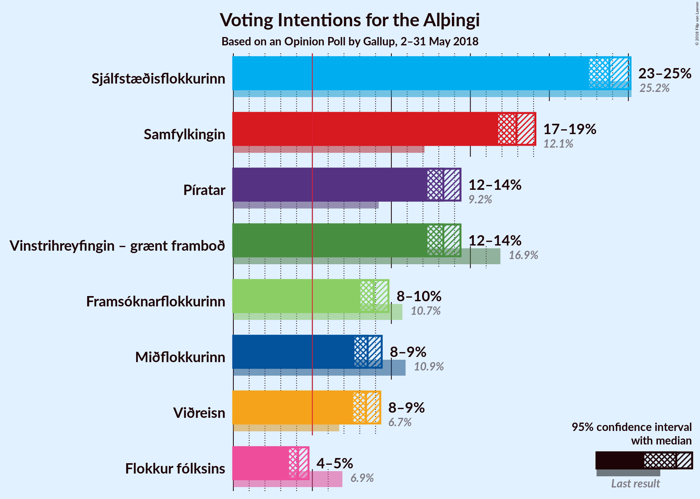

### Confidence Intervals

| Party | Last Result | Poll Result | 80% Confidence Interval | 90% Confidence Interval | 95% Confidence Interval | 99% Confidence Interval |
|:-----:|:-----------:|:-----------:|:-----------------------:|:-----------------------:|:-----------------------:|:-----------------------:|
| Sjálfstæðisflokkurinn | 25.2% | 23.8% | 23.0–24.7% |22.7–24.9% |22.5–25.1% |22.1–25.5% |
| Samfylkingin | 12.1% | 17.9% | 17.1–18.7% |16.9–18.9% |16.8–19.1% |16.4–19.5% |
| Vinstrihreyfingin – grænt framboð | 16.9% | 13.3% | 12.6–14.0% |12.4–14.2% |12.3–14.4% |12.0–14.7% |
| Píratar | 9.2% | 13.3% | 12.6–14.0% |12.4–14.2% |12.3–14.4% |12.0–14.7% |
| Framsóknarflokkurinn | 10.7% | 8.9% | 8.3–9.5% |8.2–9.7% |8.0–9.8% |7.8–10.1% |
| Miðflokkurinn | 10.9% | 8.5% | 8.0–9.1% |7.8–9.3% |7.7–9.4% |7.4–9.7% |
| Viðreisn | 6.7% | 8.4% | 7.9–9.0% |7.7–9.1% |7.6–9.3% |7.3–9.6% |
| Flokkur fólksins | 6.9% | 4.1% | 3.7–4.5% |3.6–4.6% |3.5–4.8% |3.4–5.0% |

*Note:* The poll result column reflects the actual value used in the calculations. Published results may vary slightly, and in addition be rounded to fewer digits.

## Seats

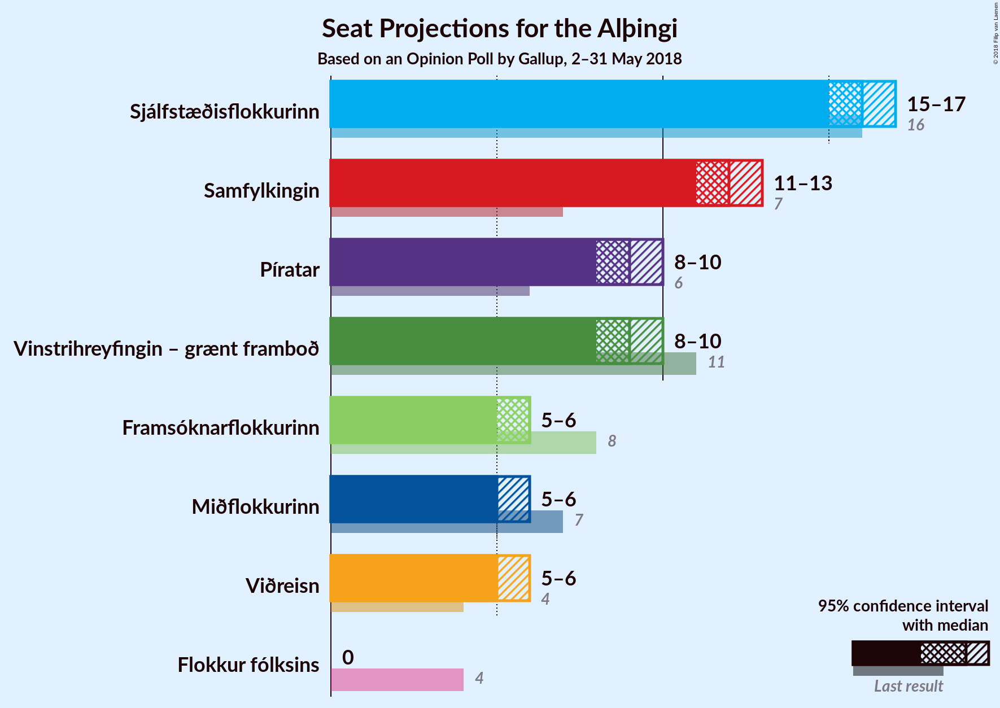

### Confidence Intervals

| Party | Last Result | Median | 80% Confidence Interval | 90% Confidence Interval | 95% Confidence Interval | 99% Confidence Interval |
|:-----:|:-----------:|:------:|:-----------------------:|:-----------------------:|:-----------------------:|:-----------------------:|
| <a href="#sjálfstæðisflokkurinn">Sjálfstæðisflokkurinn</a> | 16 | 16 | 16–17 |15–17 |15–17 |15–18 |
| <a href="#samfylkingin">Samfylkingin</a> | 7 | 12 | 12–13 |11–13 |11–13 |11–13 |
| <a href="#vinstrihreyfingin-–-grænt-framboð">Vinstrihreyfingin – grænt framboð</a> | 11 | 9 | 8–9 |8–10 |8–10 |8–10 |
| <a href="#píratar">Píratar</a> | 6 | 9 | 8–9 |8–9 |8–10 |8–10 |
| <a href="#framsóknarflokkurinn">Framsóknarflokkurinn</a> | 8 | 6 | 5–6 |5–6 |5–6 |5–7 |
| <a href="#miðflokkurinn">Miðflokkurinn</a> | 7 | 5 | 5–6 |5–6 |5–6 |5–6 |
| <a href="#viðreisn">Viðreisn</a> | 4 | 5 | 5–6 |5–6 |5–6 |5–6 |
| <a href="#flokkur-fólksins">Flokkur fólksins</a> | 4 | 0 | 0 |0 |0 |0 |

### Sjálfstæðisflokkurinn

*For a full overview of the results for this party, see the [Sjálfstæðisflokkurinn](party-sjálfstæðisflokkurinn.html) page.*

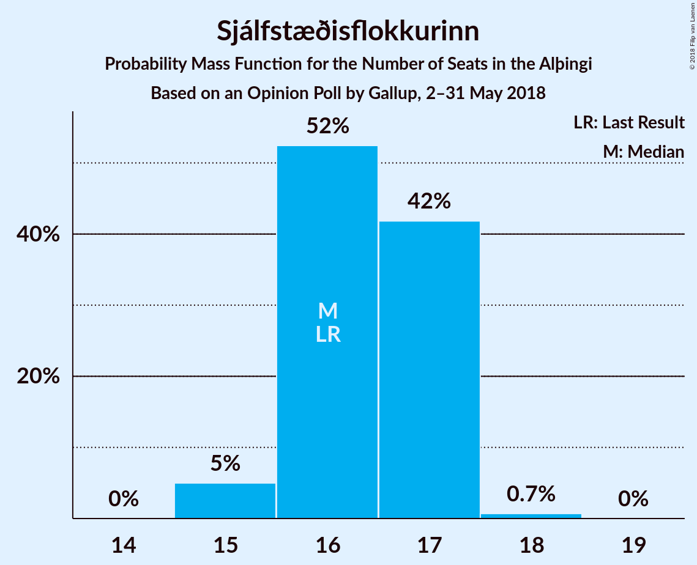

| Number of Seats | Probability | Accumulated | Special Marks |
|:---------------:|:-----------:|:-----------:|:-------------:|
| 15 | 5% | 100% |  |
| 16 | 52% | 95% | Last Result, Median |
| 17 | 42% | 43% |  |
| 18 | 0.7% | 0.7% |  |
| 19 | 0% | 0% |  |

### Samfylkingin

*For a full overview of the results for this party, see the [Samfylkingin](party-samfylkingin.html) page.*

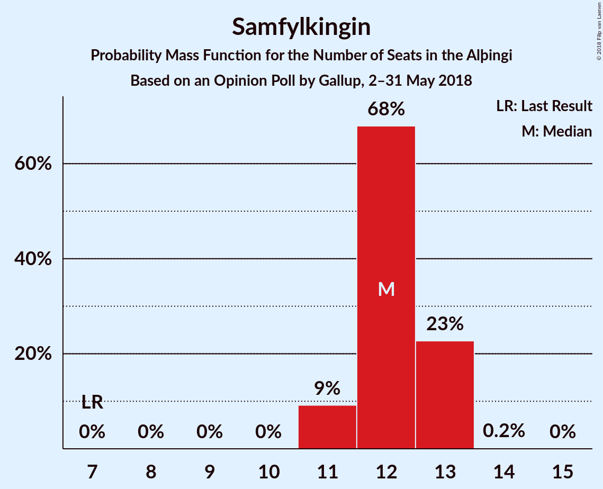

| Number of Seats | Probability | Accumulated | Special Marks |
|:---------------:|:-----------:|:-----------:|:-------------:|
| 7 | 0% | 100% | Last Result |
| 8 | 0% | 100% |  |
| 9 | 0% | 100% |  |
| 10 | 0% | 100% |  |
| 11 | 9% | 100% |  |
| 12 | 68% | 91% | Median |
| 13 | 23% | 23% |  |
| 14 | 0.2% | 0.2% |  |
| 15 | 0% | 0% |  |

### Vinstrihreyfingin – grænt framboð

*For a full overview of the results for this party, see the [Vinstrihreyfingin – grænt framboð](party-vinstrihreyfingin–græntframboð.html) page.*

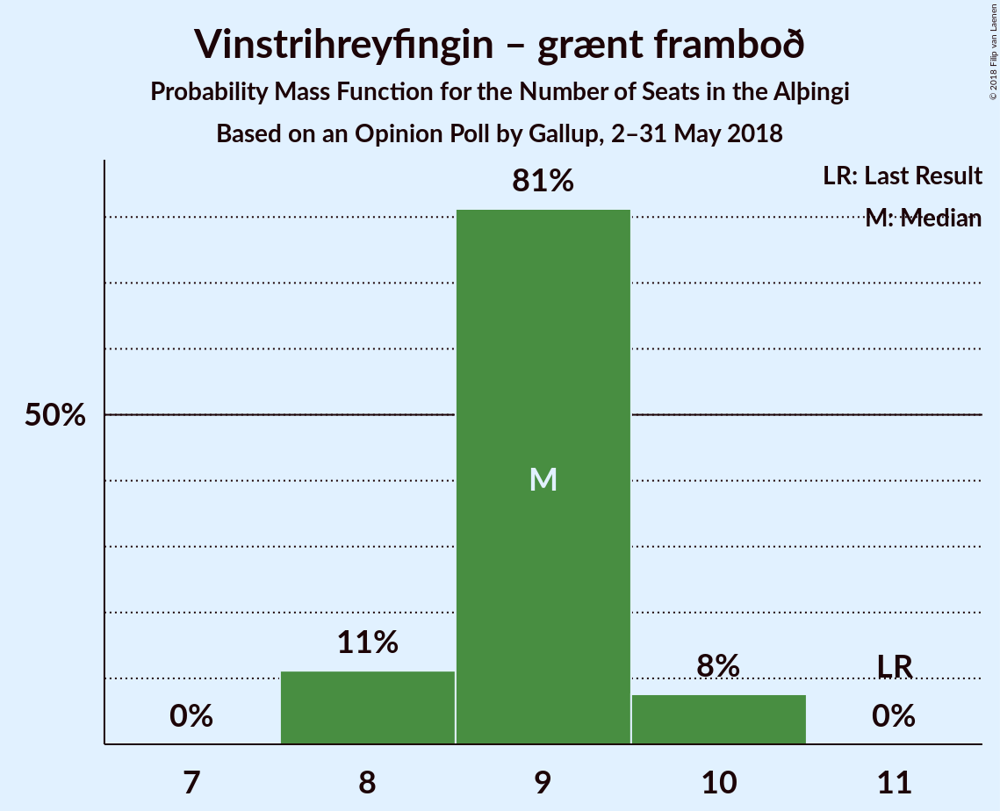

| Number of Seats | Probability | Accumulated | Special Marks |
|:---------------:|:-----------:|:-----------:|:-------------:|
| 8 | 16% | 100% |  |
| 9 | 76% | 84% | Median |
| 10 | 8% | 8% |  |
| 11 | 0% | 0% | Last Result |

### Píratar

*For a full overview of the results for this party, see the [Píratar](party-píratar.html) page.*

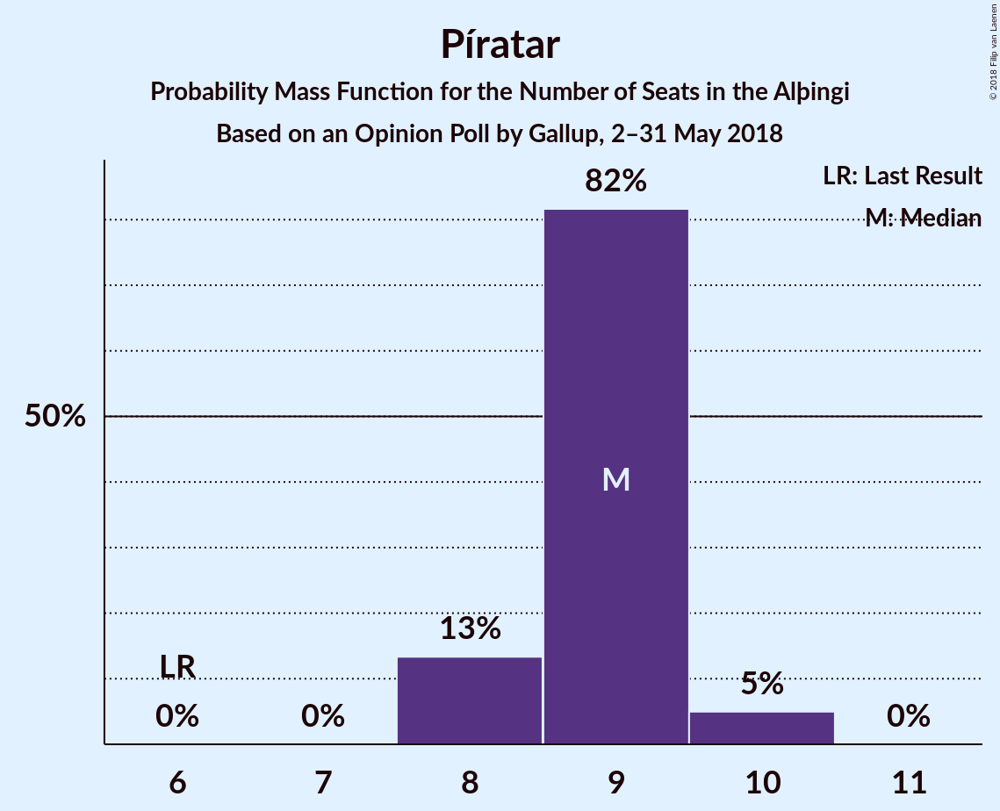

| Number of Seats | Probability | Accumulated | Special Marks |
|:---------------:|:-----------:|:-----------:|:-------------:|
| 6 | 0% | 100% | Last Result |
| 7 | 0% | 100% |  |
| 8 | 15% | 100% |  |
| 9 | 81% | 85% | Median |
| 10 | 5% | 5% |  |
| 11 | 0% | 0% |  |

### Framsóknarflokkurinn

*For a full overview of the results for this party, see the [Framsóknarflokkurinn](party-framsóknarflokkurinn.html) page.*

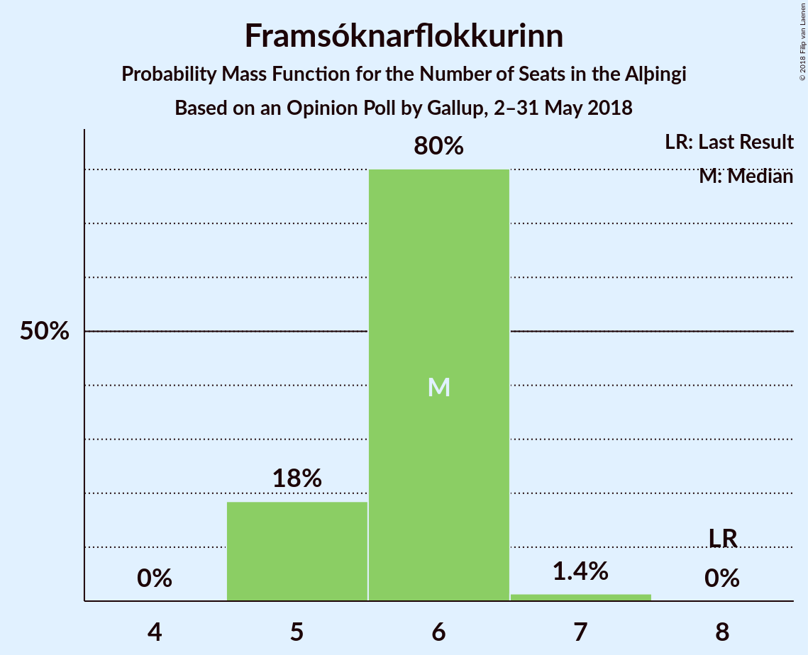

| Number of Seats | Probability | Accumulated | Special Marks |
|:---------------:|:-----------:|:-----------:|:-------------:|
| 5 | 18% | 100% |  |
| 6 | 80% | 82% | Median |
| 7 | 1.4% | 1.4% |  |
| 8 | 0% | 0% | Last Result |

### Miðflokkurinn

*For a full overview of the results for this party, see the [Miðflokkurinn](party-miðflokkurinn.html) page.*

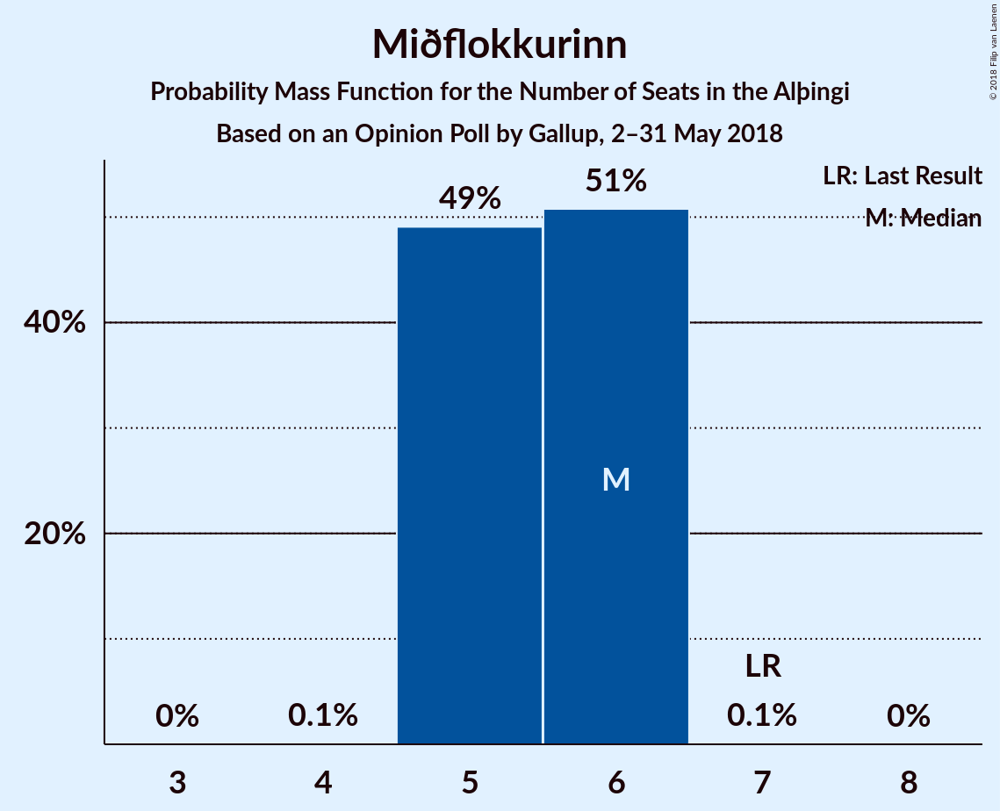

| Number of Seats | Probability | Accumulated | Special Marks |
|:---------------:|:-----------:|:-----------:|:-------------:|
| 5 | 52% | 100% | Median |
| 6 | 48% | 48% |  |
| 7 | 0.1% | 0.1% | Last Result |
| 8 | 0% | 0% |  |

### Viðreisn

*For a full overview of the results for this party, see the [Viðreisn](party-viðreisn.html) page.*

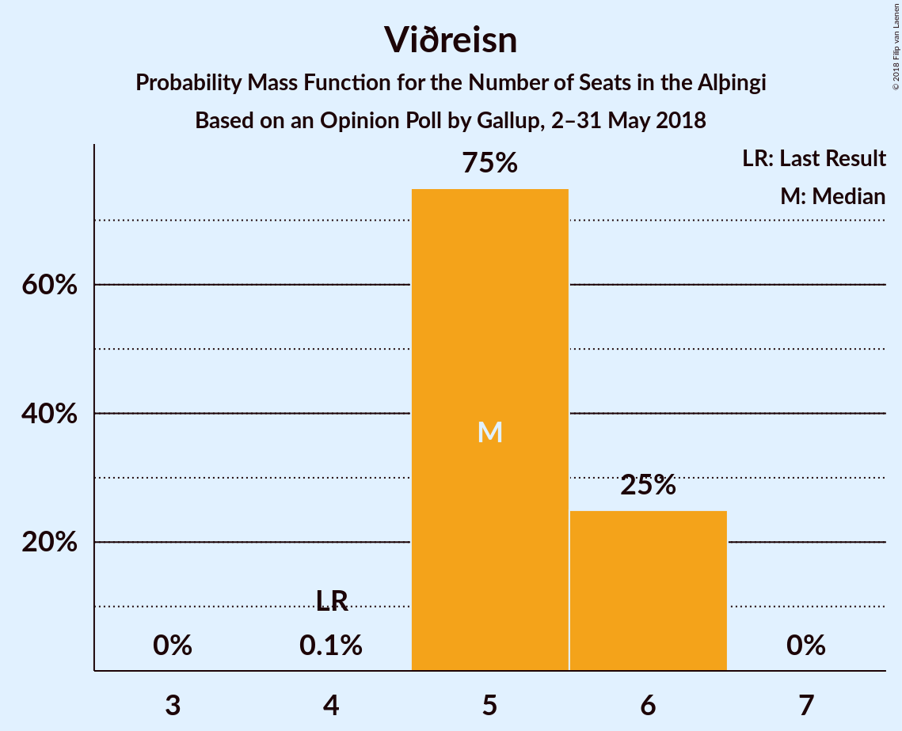

| Number of Seats | Probability | Accumulated | Special Marks |
|:---------------:|:-----------:|:-----------:|:-------------:|
| 4 | 0.1% | 100% | Last Result |
| 5 | 66% | 99.9% | Median |
| 6 | 34% | 34% |  |
| 7 | 0% | 0% |  |

### Flokkur fólksins

*For a full overview of the results for this party, see the [Flokkur fólksins](party-flokkurfólksins.html) page.*

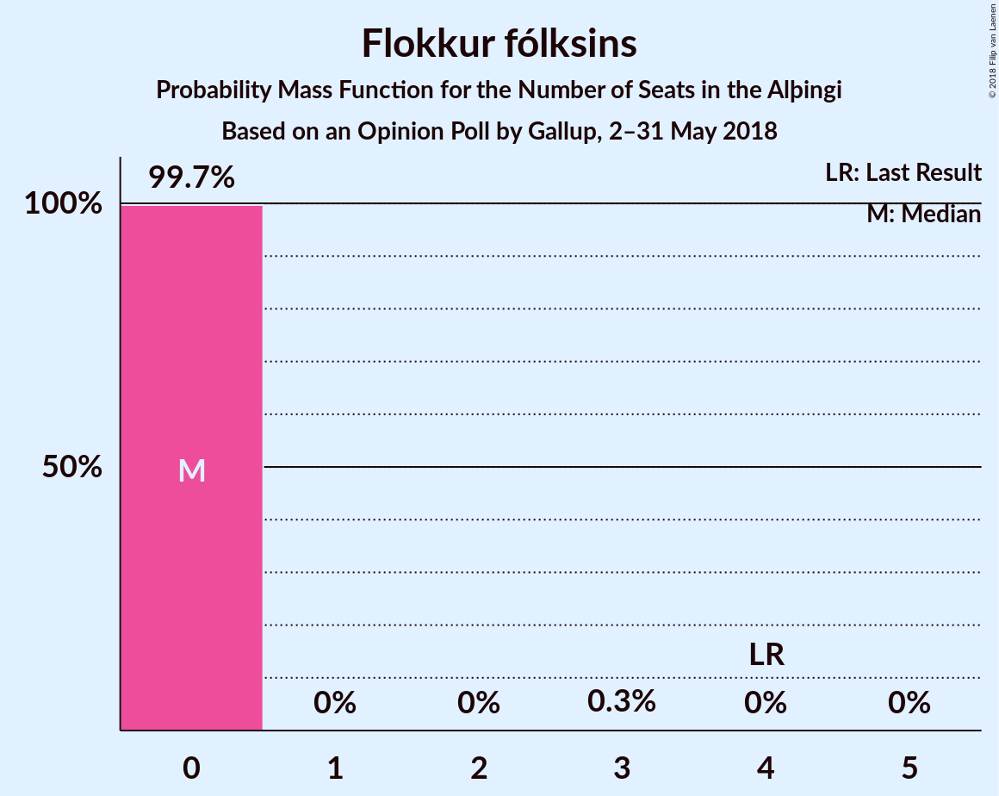

| Number of Seats | Probability | Accumulated | Special Marks |
|:---------------:|:-----------:|:-----------:|:-------------:|
| 0 | 99.7% | 100% | Median |
| 1 | 0% | 0.3% |  |
| 2 | 0% | 0.3% |  |
| 3 | 0.3% | 0.3% |  |
| 4 | 0% | 0% | Last Result |

## Coalitions

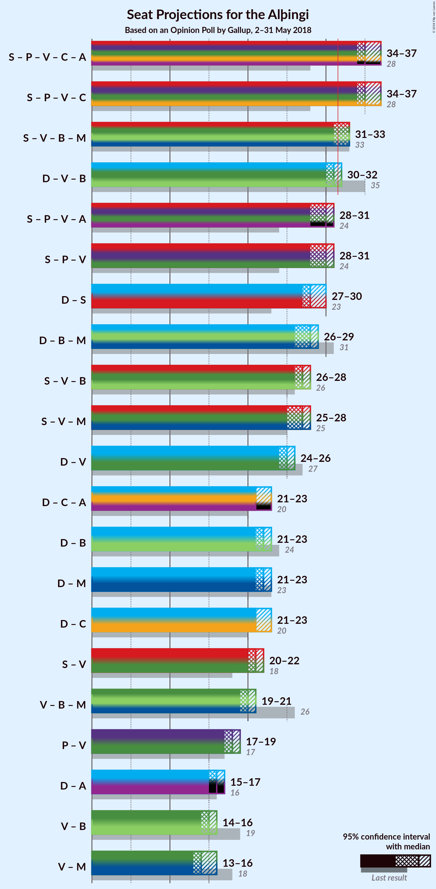

### Confidence Intervals

| Coalition | Last Result | Median | Majority? | 80% Confidence Interval | 90% Confidence Interval | 95% Confidence Interval | 99% Confidence Interval |
|:---------:|:-----------:|:------:|:---------:|:-----------------------:|:-----------------------:|:-----------------------:|:-----------------------:|
| Samfylkingin – Píratar – Vinstrihreyfingin – grænt framboð – Viðreisn | 28 | 35 | 100% | 34–36 | 34–36 | 34–37 | 34–37 |
| Samfylkingin – Vinstrihreyfingin – grænt framboð – Framsóknarflokkurinn – Miðflokkurinn | 33 | 32 | 89% | 31–33 | 31–33 | 31–34 | 31–34 |
| Sjálfstæðisflokkurinn – Vinstrihreyfingin – grænt framboð – Framsóknarflokkurinn | 35 | 31 | 30% | 30–32 | 30–32 | 30–32 | 29–33 |
| Samfylkingin – Píratar – Vinstrihreyfingin – grænt framboð | 24 | 30 | 0.8% | 29–31 | 29–31 | 29–31 | 28–32 |
| Sjálfstæðisflokkurinn – Samfylkingin | 23 | 29 | 0% | 28–29 | 27–30 | 27–30 | 27–30 |
| Sjálfstæðisflokkurinn – Framsóknarflokkurinn – Miðflokkurinn | 31 | 28 | 0% | 27–29 | 27–29 | 26–29 | 26–29 |
| Samfylkingin – Vinstrihreyfingin – grænt framboð – Framsóknarflokkurinn | 26 | 27 | 0% | 26–28 | 26–28 | 25–28 | 25–29 |
| Samfylkingin – Vinstrihreyfingin – grænt framboð – Miðflokkurinn | 25 | 27 | 0% | 26–27 | 25–28 | 25–28 | 25–28 |
| Sjálfstæðisflokkurinn – Vinstrihreyfingin – grænt framboð | 27 | 25 | 0% | 25–26 | 24–26 | 24–26 | 24–27 |
| Sjálfstæðisflokkurinn – Framsóknarflokkurinn | 24 | 22 | 0% | 21–23 | 21–23 | 21–23 | 21–24 |
| Sjálfstæðisflokkurinn – Miðflokkurinn | 23 | 22 | 0% | 21–23 | 21–23 | 21–23 | 20–23 |
| Sjálfstæðisflokkurinn – Viðreisn | 20 | 22 | 0% | 21–23 | 21–23 | 21–23 | 20–23 |
| Samfylkingin – Vinstrihreyfingin – grænt framboð | 18 | 21 | 0% | 20–22 | 20–22 | 20–22 | 20–23 |
| Vinstrihreyfingin – grænt framboð – Framsóknarflokkurinn – Miðflokkurinn | 26 | 20 | 0% | 19–21 | 19–21 | 19–21 | 19–22 |
| Píratar – Vinstrihreyfingin – grænt framboð | 17 | 18 | 0% | 17–18 | 17–19 | 17–19 | 16–19 |
| Vinstrihreyfingin – grænt framboð – Framsóknarflokkurinn | 19 | 15 | 0% | 14–15 | 14–16 | 13–16 | 13–16 |
| Vinstrihreyfingin – grænt framboð – Miðflokkurinn | 18 | 14 | 0% | 14–15 | 13–15 | 13–16 | 13–16 |

### Samfylkingin – Píratar – Vinstrihreyfingin – grænt framboð – Viðreisn

| Number of Seats | Probability | Accumulated | Special Marks |
|:---------------:|:-----------:|:-----------:|:-------------:|
| 28 | 0% | 100% | Last Result |
| 29 | 0% | 100% |  |
| 30 | 0% | 100% |  |
| 31 | 0% | 100% |  |
| 32 | 0% | 100% | Majority |
| 33 | 0.2% | 100% |  |
| 34 | 11% | 99.8% |  |
| 35 | 53% | 89% | Median |
| 36 | 32% | 36% |  |
| 37 | 4% | 4% |  |
| 38 | 0% | 0% |  |

### Samfylkingin – Vinstrihreyfingin – grænt framboð – Framsóknarflokkurinn – Miðflokkurinn

| Number of Seats | Probability | Accumulated | Special Marks |
|:---------------:|:-----------:|:-----------:|:-------------:|
| 30 | 0.2% | 100% |  |
| 31 | 11% | 99.8% |  |
| 32 | 45% | 89% | Median, Majority |
| 33 | 40% | 44% | Last Result |
| 34 | 4% | 4% |  |
| 35 | 0.1% | 0.1% |  |
| 36 | 0% | 0% |  |

### Sjálfstæðisflokkurinn – Vinstrihreyfingin – grænt framboð – Framsóknarflokkurinn

| Number of Seats | Probability | Accumulated | Special Marks |
|:---------------:|:-----------:|:-----------:|:-------------:|
| 29 | 0.7% | 100% |  |
| 30 | 16% | 99.3% |  |
| 31 | 53% | 83% | Median |
| 32 | 29% | 30% | Majority |
| 33 | 0.6% | 0.6% |  |
| 34 | 0% | 0% |  |
| 35 | 0% | 0% | Last Result |

### Samfylkingin – Píratar – Vinstrihreyfingin – grænt framboð

| Number of Seats | Probability | Accumulated | Special Marks |
|:---------------:|:-----------:|:-----------:|:-------------:|
| 24 | 0% | 100% | Last Result |
| 25 | 0% | 100% |  |
| 26 | 0% | 100% |  |
| 27 | 0% | 100% |  |
| 28 | 1.2% | 100% |  |
| 29 | 24% | 98.8% |  |
| 30 | 53% | 75% | Median |
| 31 | 21% | 22% |  |
| 32 | 0.8% | 0.8% | Majority |
| 33 | 0% | 0% |  |

### Sjálfstæðisflokkurinn – Samfylkingin

| Number of Seats | Probability | Accumulated | Special Marks |
|:---------------:|:-----------:|:-----------:|:-------------:|
| 23 | 0% | 100% | Last Result |
| 24 | 0% | 100% |  |
| 25 | 0% | 100% |  |
| 26 | 0.2% | 100% |  |
| 27 | 6% | 99.8% |  |
| 28 | 42% | 94% | Median |
| 29 | 47% | 53% |  |
| 30 | 5% | 5% |  |
| 31 | 0% | 0% |  |

### Sjálfstæðisflokkurinn – Framsóknarflokkurinn – Miðflokkurinn

| Number of Seats | Probability | Accumulated | Special Marks |
|:---------------:|:-----------:|:-----------:|:-------------:|
| 25 | 0.1% | 100% |  |
| 26 | 5% | 99.9% |  |
| 27 | 32% | 95% | Median |
| 28 | 53% | 64% |  |
| 29 | 10% | 10% |  |
| 30 | 0.1% | 0.1% |  |
| 31 | 0% | 0% | Last Result |

### Samfylkingin – Vinstrihreyfingin – grænt framboð – Framsóknarflokkurinn

| Number of Seats | Probability | Accumulated | Special Marks |
|:---------------:|:-----------:|:-----------:|:-------------:|
| 25 | 4% | 100% |  |
| 26 | 22% | 96% | Last Result |
| 27 | 57% | 74% | Median |
| 28 | 17% | 17% |  |
| 29 | 0.7% | 0.7% |  |
| 30 | 0% | 0% |  |

### Samfylkingin – Vinstrihreyfingin – grænt framboð – Miðflokkurinn

| Number of Seats | Probability | Accumulated | Special Marks |
|:---------------:|:-----------:|:-----------:|:-------------:|
| 24 | 0.1% | 100% |  |
| 25 | 6% | 99.9% | Last Result |
| 26 | 41% | 94% | Median |
| 27 | 45% | 53% |  |
| 28 | 8% | 8% |  |
| 29 | 0.1% | 0.1% |  |
| 30 | 0% | 0% |  |

### Sjálfstæðisflokkurinn – Vinstrihreyfingin – grænt framboð

| Number of Seats | Probability | Accumulated | Special Marks |
|:---------------:|:-----------:|:-----------:|:-------------:|
| 23 | 0.3% | 100% |  |
| 24 | 7% | 99.7% |  |
| 25 | 56% | 92% | Median |
| 26 | 35% | 37% |  |
| 27 | 2% | 2% | Last Result |
| 28 | 0% | 0% |  |

### Sjálfstæðisflokkurinn – Framsóknarflokkurinn

| Number of Seats | Probability | Accumulated | Special Marks |
|:---------------:|:-----------:|:-----------:|:-------------:|
| 20 | 0.4% | 100% |  |
| 21 | 13% | 99.6% |  |
| 22 | 53% | 87% | Median |
| 23 | 33% | 34% |  |
| 24 | 0.7% | 0.7% | Last Result |
| 25 | 0% | 0% |  |

### Sjálfstæðisflokkurinn – Miðflokkurinn

| Number of Seats | Probability | Accumulated | Special Marks |
|:---------------:|:-----------:|:-----------:|:-------------:|
| 20 | 2% | 100% |  |
| 21 | 25% | 98% | Median |
| 22 | 58% | 73% |  |
| 23 | 15% | 15% | Last Result |
| 24 | 0.1% | 0.1% |  |
| 25 | 0% | 0% |  |

### Sjálfstæðisflokkurinn – Viðreisn

| Number of Seats | Probability | Accumulated | Special Marks |
|:---------------:|:-----------:|:-----------:|:-------------:|
| 20 | 2% | 100% | Last Result |
| 21 | 36% | 98% | Median |
| 22 | 49% | 62% |  |
| 23 | 12% | 12% |  |
| 24 | 0.1% | 0.1% |  |
| 25 | 0% | 0% |  |

### Samfylkingin – Vinstrihreyfingin – grænt framboð

| Number of Seats | Probability | Accumulated | Special Marks |
|:---------------:|:-----------:|:-----------:|:-------------:|
| 18 | 0% | 100% | Last Result |
| 19 | 0.4% | 100% |  |
| 20 | 19% | 99.6% |  |
| 21 | 55% | 80% | Median |
| 22 | 24% | 25% |  |
| 23 | 0.9% | 0.9% |  |
| 24 | 0% | 0% |  |

### Vinstrihreyfingin – grænt framboð – Framsóknarflokkurinn – Miðflokkurinn

| Number of Seats | Probability | Accumulated | Special Marks |
|:---------------:|:-----------:|:-----------:|:-------------:|
| 18 | 0.5% | 100% |  |
| 19 | 13% | 99.5% |  |
| 20 | 52% | 87% | Median |
| 21 | 33% | 35% |  |
| 22 | 2% | 2% |  |
| 23 | 0% | 0% |  |
| 24 | 0% | 0% |  |
| 25 | 0% | 0% |  |
| 26 | 0% | 0% | Last Result |

### Píratar – Vinstrihreyfingin – grænt framboð

| Number of Seats | Probability | Accumulated | Special Marks |
|:---------------:|:-----------:|:-----------:|:-------------:|
| 16 | 2% | 100% |  |
| 17 | 24% | 98% | Last Result |
| 18 | 66% | 75% | Median |
| 19 | 9% | 9% |  |
| 20 | 0.3% | 0.3% |  |
| 21 | 0% | 0% |  |

### Vinstrihreyfingin – grænt framboð – Framsóknarflokkurinn

| Number of Seats | Probability | Accumulated | Special Marks |
|:---------------:|:-----------:|:-----------:|:-------------:|
| 13 | 4% | 100% |  |
| 14 | 23% | 96% |  |
| 15 | 67% | 73% | Median |
| 16 | 6% | 6% |  |
| 17 | 0% | 0% |  |
| 18 | 0% | 0% |  |
| 19 | 0% | 0% | Last Result |

### Vinstrihreyfingin – grænt framboð – Miðflokkurinn

| Number of Seats | Probability | Accumulated | Special Marks |
|:---------------:|:-----------:|:-----------:|:-------------:|
| 13 | 5% | 100% |  |
| 14 | 52% | 95% | Median |
| 15 | 40% | 43% |  |
| 16 | 3% | 3% |  |
| 17 | 0% | 0% |  |
| 18 | 0% | 0% | Last Result |

## Technical Information

### Opinion Poll

+ **Polling firm:** Gallup
+ **Commissioner(s):** —
+ **Fieldwork period:** 2–31 May 2018

### Calculations

+ **Sample size:** 4026
+ **Simulations done:** 1,048,576
+ **Error estimate:** 0.75%

