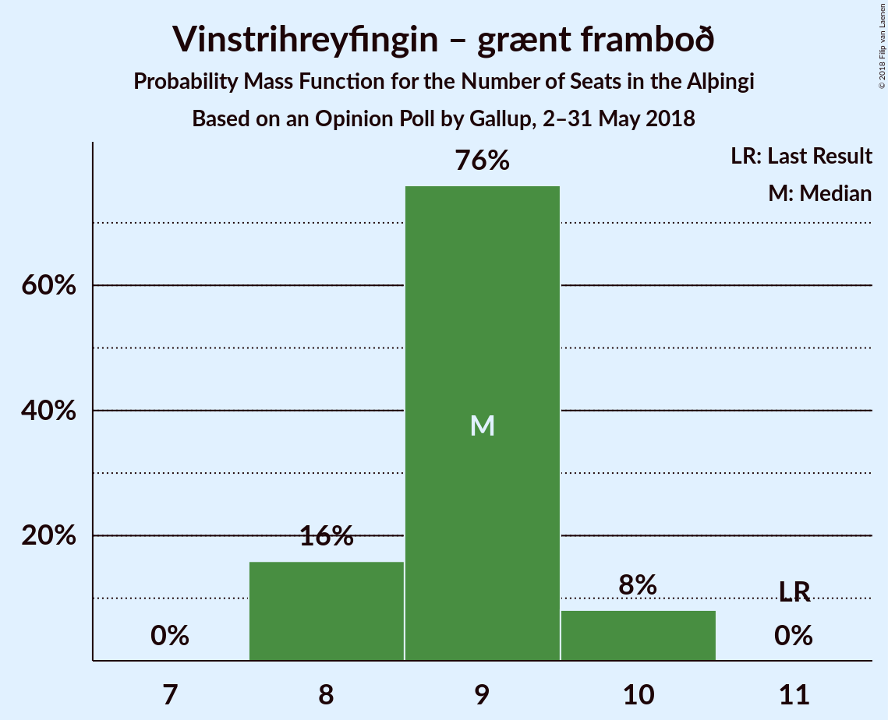

# Opinion Poll by Gallup, 2–31 May 2018

<a href="#voting-intentions">Voting Intentions</a> | <a href="#seats">Seats</a> | <a href="#coalitions">Coalitions</a> | <a href="#technical-information">Technical Information</a>

## Voting Intentions

### Confidence Intervals

| Party | Last Result | Poll Result | 80% Confidence Interval | 90% Confidence Interval | 95% Confidence Interval | 99% Confidence Interval |
|:-----:|:-----------:|:-----------:|:-----------------------:|:-----------------------:|:-----------------------:|:-----------------------:|
| Sjálfstæðisflokkurinn | 25.2% | 23.8% | 23.0–24.7% |22.7–24.9% |22.5–25.1% |22.1–25.5% |
| Samfylkingin | 12.1% | 17.9% | 17.1–18.7% |16.9–18.9% |16.8–19.1% |16.4–19.5% |
| Vinstrihreyfingin – grænt framboð | 16.9% | 13.3% | 12.6–14.0% |12.4–14.2% |12.3–14.4% |12.0–14.7% |
| Píratar | 9.2% | 13.3% | 12.6–14.0% |12.4–14.2% |12.3–14.4% |12.0–14.7% |
| Framsóknarflokkurinn | 10.7% | 8.9% | 8.3–9.5% |8.2–9.7% |8.0–9.8% |7.8–10.1% |
| Miðflokkurinn | 10.9% | 8.5% | 8.0–9.1% |7.8–9.3% |7.7–9.4% |7.4–9.7% |
| Viðreisn | 6.7% | 8.4% | 7.9–9.0% |7.7–9.1% |7.6–9.3% |7.3–9.6% |
| Flokkur fólksins | 6.9% | 4.1% | 3.7–4.5% |3.6–4.6% |3.5–4.8% |3.4–5.0% |

*Note:* The poll result column reflects the actual value used in the calculations. Published results may vary slightly, and in addition be rounded to fewer digits.

## Seats

### Confidence Intervals

| Party | Last Result | Median | 80% Confidence Interval | 90% Confidence Interval | 95% Confidence Interval | 99% Confidence Interval |
|:-----:|:-----------:|:------:|:-----------------------:|:-----------------------:|:-----------------------:|:-----------------------:|
| <a href="#sjálfstæðisflokkurinn">Sjálfstæðisflokkurinn</a> | 16 | 16 | 16–17 |15–17 |15–17 |15–18 |
| <a href="#samfylkingin">Samfylkingin</a> | 7 | 12 | 11–13 |11–13 |11–13 |11–13 |
| <a href="#vinstrihreyfingin-–-grænt-framboð">Vinstrihreyfingin – grænt framboð</a> | 11 | 9 | 8–9 |8–10 |8–10 |8–10 |
| <a href="#píratar">Píratar</a> | 6 | 9 | 8–9 |8–9 |8–10 |8–10 |
| <a href="#framsóknarflokkurinn">Framsóknarflokkurinn</a> | 8 | 6 | 5–6 |5–6 |5–6 |5–7 |
| <a href="#miðflokkurinn">Miðflokkurinn</a> | 7 | 6 | 5–6 |5–6 |5–6 |5–6 |
| <a href="#viðreisn">Viðreisn</a> | 4 | 5 | 5–6 |5–6 |5–6 |5–6 |
| <a href="#flokkur-fólksins">Flokkur fólksins</a> | 4 | 0 | 0 |0 |0 |0 |

### Sjálfstæðisflokkurinn

*For a full overview of the results for this party, see the [Sjálfstæðisflokkurinn](party-sjálfstæðisflokkurinn.html) page.*

| Number of Seats | Probability | Accumulated | Special Marks |
|:---------------:|:-----------:|:-----------:|:-------------:|
| 15 | 5% | 100% |  |
| 16 | 61% | 95% | Last Result, Median |
| 17 | 31% | 33% |  |
| 18 | 2% | 2% |  |
| 19 | 0% | 0% |  |

### Samfylkingin

*For a full overview of the results for this party, see the [Samfylkingin](party-samfylkingin.html) page.*

| Number of Seats | Probability | Accumulated | Special Marks |
|:---------------:|:-----------:|:-----------:|:-------------:|
| 7 | 0% | 100% | Last Result |
| 8 | 0% | 100% |  |
| 9 | 0% | 100% |  |
| 10 | 0% | 100% |  |
| 11 | 11% | 100% |  |
| 12 | 54% | 89% | Median |
| 13 | 35% | 35% |  |
| 14 | 0.2% | 0.2% |  |
| 15 | 0% | 0% |  |

### Vinstrihreyfingin – grænt framboð

*For a full overview of the results for this party, see the [Vinstrihreyfingin – grænt framboð](party-vinstrihreyfingin–græntframboð.html) page.*

| Number of Seats | Probability | Accumulated | Special Marks |
|:---------------:|:-----------:|:-----------:|:-------------:|
| 8 | 11% | 100% |  |
| 9 | 81% | 89% | Median |
| 10 | 8% | 8% |  |
| 11 | 0% | 0% | Last Result |

### Píratar

*For a full overview of the results for this party, see the [Píratar](party-píratar.html) page.*

| Number of Seats | Probability | Accumulated | Special Marks |
|:---------------:|:-----------:|:-----------:|:-------------:|
| 6 | 0% | 100% | Last Result |
| 7 | 0% | 100% |  |
| 8 | 13% | 100% |  |
| 9 | 82% | 87% | Median |
| 10 | 5% | 5% |  |
| 11 | 0% | 0% |  |

### Framsóknarflokkurinn

*For a full overview of the results for this party, see the [Framsóknarflokkurinn](party-framsóknarflokkurinn.html) page.*

| Number of Seats | Probability | Accumulated | Special Marks |
|:---------------:|:-----------:|:-----------:|:-------------:|
| 5 | 19% | 100% |  |
| 6 | 80% | 81% | Median |
| 7 | 0.6% | 0.6% |  |
| 8 | 0% | 0% | Last Result |

### Miðflokkurinn

*For a full overview of the results for this party, see the [Miðflokkurinn](party-miðflokkurinn.html) page.*

| Number of Seats | Probability | Accumulated | Special Marks |
|:---------------:|:-----------:|:-----------:|:-------------:|
| 4 | 0.1% | 100% |  |
| 5 | 49% | 99.9% |  |
| 6 | 51% | 51% | Median |
| 7 | 0.1% | 0.1% | Last Result |
| 8 | 0% | 0% |  |

### Viðreisn

*For a full overview of the results for this party, see the [Viðreisn](party-viðreisn.html) page.*

| Number of Seats | Probability | Accumulated | Special Marks |
|:---------------:|:-----------:|:-----------:|:-------------:|
| 4 | 0.1% | 100% | Last Result |
| 5 | 75% | 99.9% | Median |
| 6 | 25% | 25% |  |
| 7 | 0% | 0% |  |

### Flokkur fólksins

*For a full overview of the results for this party, see the [Flokkur fólksins](party-flokkurfólksins.html) page.*

| Number of Seats | Probability | Accumulated | Special Marks |
|:---------------:|:-----------:|:-----------:|:-------------:|
| 0 | 99.7% | 100% | Median |
| 1 | 0% | 0.3% |  |
| 2 | 0% | 0.3% |  |
| 3 | 0.3% | 0.3% |  |
| 4 | 0% | 0% | Last Result |

## Coalitions

### Confidence Intervals

| Coalition | Last Result | Median | Majority? | 80% Confidence Interval | 90% Confidence Interval | 95% Confidence Interval | 99% Confidence Interval |
|:---------:|:-----------:|:------:|:---------:|:-----------------------:|:-----------------------:|:-----------------------:|:-----------------------:|
| Samfylkingin – Píratar – Vinstrihreyfingin – grænt framboð – Viðreisn | 28 | 35 | 100% | 34–36 | 34–36 | 34–37 | 34–37 |
| Samfylkingin – Vinstrihreyfingin – grænt framboð – Framsóknarflokkurinn – Miðflokkurinn | 33 | 33 | 91% | 32–33 | 31–33 | 31–33 | 31–34 |
| Sjálfstæðisflokkurinn – Vinstrihreyfingin – grænt framboð – Framsóknarflokkurinn | 35 | 31 | 18% | 31–32 | 30–32 | 30–32 | 29–32 |
| Samfylkingin – Píratar – Vinstrihreyfingin – grænt framboð | 24 | 30 | 0.7% | 29–31 | 29–31 | 28–31 | 28–32 |
| Sjálfstæðisflokkurinn – Samfylkingin | 23 | 28 | 0% | 28–30 | 27–30 | 27–30 | 27–30 |
| Sjálfstæðisflokkurinn – Framsóknarflokkurinn – Miðflokkurinn | 31 | 28 | 0% | 27–29 | 27–29 | 26–29 | 26–29 |
| Samfylkingin – Vinstrihreyfingin – grænt framboð – Framsóknarflokkurinn | 26 | 27 | 0% | 26–28 | 26–28 | 26–28 | 25–29 |
| Samfylkingin – Vinstrihreyfingin – grænt framboð – Miðflokkurinn | 25 | 27 | 0% | 26–27 | 25–27 | 25–28 | 25–28 |
| Sjálfstæðisflokkurinn – Vinstrihreyfingin – grænt framboð | 27 | 25 | 0% | 25–26 | 24–26 | 24–26 | 23–26 |
| Sjálfstæðisflokkurinn – Framsóknarflokkurinn | 24 | 22 | 0% | 22–23 | 21–23 | 21–23 | 20–24 |
| Sjálfstæðisflokkurinn – Miðflokkurinn | 23 | 22 | 0% | 21–23 | 21–23 | 21–23 | 20–23 |
| Sjálfstæðisflokkurinn – Viðreisn | 20 | 21 | 0% | 21–23 | 21–23 | 21–23 | 20–23 |
| Samfylkingin – Vinstrihreyfingin – grænt framboð | 18 | 21 | 0% | 20–22 | 20–22 | 20–22 | 19–23 |
| Vinstrihreyfingin – grænt framboð – Framsóknarflokkurinn – Miðflokkurinn | 26 | 20 | 0% | 19–21 | 19–21 | 19–21 | 19–22 |
| Píratar – Vinstrihreyfingin – grænt framboð | 17 | 18 | 0% | 17–18 | 17–19 | 17–19 | 16–19 |
| Vinstrihreyfingin – grænt framboð – Framsóknarflokkurinn | 19 | 15 | 0% | 14–15 | 14–15 | 14–16 | 13–16 |
| Vinstrihreyfingin – grænt framboð – Miðflokkurinn | 18 | 14 | 0% | 14–15 | 13–15 | 13–16 | 13–16 |

### Samfylkingin – Píratar – Vinstrihreyfingin – grænt framboð – Viðreisn

| Number of Seats | Probability | Accumulated | Special Marks |
|:---------------:|:-----------:|:-----------:|:-------------:|
| 28 | 0% | 100% | Last Result |
| 29 | 0% | 100% |  |
| 30 | 0% | 100% |  |
| 31 | 0% | 100% |  |
| 32 | 0% | 100% | Majority |
| 33 | 0.3% | 100% |  |
| 34 | 11% | 99.7% |  |
| 35 | 44% | 89% | Median |
| 36 | 42% | 45% |  |
| 37 | 3% | 3% |  |
| 38 | 0% | 0% |  |

### Samfylkingin – Vinstrihreyfingin – grænt framboð – Framsóknarflokkurinn – Miðflokkurinn

| Number of Seats | Probability | Accumulated | Special Marks |
|:---------------:|:-----------:|:-----------:|:-------------:|
| 30 | 0.1% | 100% |  |
| 31 | 9% | 99.9% |  |
| 32 | 32% | 91% | Majority |
| 33 | 57% | 59% | Last Result, Median |
| 34 | 2% | 2% |  |
| 35 | 0.4% | 0.4% |  |
| 36 | 0% | 0% |  |

### Sjálfstæðisflokkurinn – Vinstrihreyfingin – grænt framboð – Framsóknarflokkurinn

| Number of Seats | Probability | Accumulated | Special Marks |
|:---------------:|:-----------:|:-----------:|:-------------:|
| 29 | 1.2% | 100% |  |
| 30 | 8% | 98.8% |  |
| 31 | 73% | 91% | Median |
| 32 | 17% | 18% | Majority |
| 33 | 0.4% | 0.4% |  |
| 34 | 0% | 0% |  |
| 35 | 0% | 0% | Last Result |

### Samfylkingin – Píratar – Vinstrihreyfingin – grænt framboð

| Number of Seats | Probability | Accumulated | Special Marks |
|:---------------:|:-----------:|:-----------:|:-------------:|
| 24 | 0% | 100% | Last Result |
| 25 | 0% | 100% |  |
| 26 | 0% | 100% |  |
| 27 | 0% | 100% |  |
| 28 | 3% | 100% |  |
| 29 | 19% | 97% |  |
| 30 | 42% | 78% | Median |
| 31 | 36% | 36% |  |
| 32 | 0.7% | 0.7% | Majority |
| 33 | 0% | 0% |  |

### Sjálfstæðisflokkurinn – Samfylkingin

| Number of Seats | Probability | Accumulated | Special Marks |
|:---------------:|:-----------:|:-----------:|:-------------:|
| 23 | 0% | 100% | Last Result |
| 24 | 0% | 100% |  |
| 25 | 0% | 100% |  |
| 26 | 0.1% | 100% |  |
| 27 | 8% | 99.9% |  |
| 28 | 44% | 92% | Median |
| 29 | 35% | 48% |  |
| 30 | 13% | 13% |  |
| 31 | 0% | 0% |  |

### Sjálfstæðisflokkurinn – Framsóknarflokkurinn – Miðflokkurinn

| Number of Seats | Probability | Accumulated | Special Marks |
|:---------------:|:-----------:|:-----------:|:-------------:|
| 25 | 0.1% | 100% |  |
| 26 | 3% | 99.9% |  |
| 27 | 42% | 97% |  |
| 28 | 44% | 55% | Median |
| 29 | 10% | 11% |  |
| 30 | 0.2% | 0.2% |  |
| 31 | 0% | 0% | Last Result |

### Samfylkingin – Vinstrihreyfingin – grænt framboð – Framsóknarflokkurinn

| Number of Seats | Probability | Accumulated | Special Marks |
|:---------------:|:-----------:|:-----------:|:-------------:|
| 25 | 1.0% | 100% |  |
| 26 | 21% | 98.9% | Last Result |
| 27 | 55% | 78% | Median |
| 28 | 23% | 24% |  |
| 29 | 0.6% | 0.6% |  |
| 30 | 0% | 0% |  |

### Samfylkingin – Vinstrihreyfingin – grænt framboð – Miðflokkurinn

| Number of Seats | Probability | Accumulated | Special Marks |
|:---------------:|:-----------:|:-----------:|:-------------:|
| 24 | 0.1% | 100% |  |
| 25 | 8% | 99.9% | Last Result |
| 26 | 18% | 92% |  |
| 27 | 70% | 74% | Median |
| 28 | 4% | 4% |  |
| 29 | 0.4% | 0.4% |  |
| 30 | 0% | 0% |  |

### Sjálfstæðisflokkurinn – Vinstrihreyfingin – grænt framboð

| Number of Seats | Probability | Accumulated | Special Marks |
|:---------------:|:-----------:|:-----------:|:-------------:|
| 23 | 0.7% | 100% |  |
| 24 | 7% | 99.3% |  |
| 25 | 58% | 93% | Median |
| 26 | 34% | 34% |  |
| 27 | 0.4% | 0.4% | Last Result |
| 28 | 0% | 0% |  |

### Sjálfstæðisflokkurinn – Framsóknarflokkurinn

| Number of Seats | Probability | Accumulated | Special Marks |
|:---------------:|:-----------:|:-----------:|:-------------:|
| 20 | 1.0% | 100% |  |
| 21 | 8% | 99.0% |  |
| 22 | 72% | 91% | Median |
| 23 | 17% | 19% |  |
| 24 | 2% | 2% | Last Result |
| 25 | 0% | 0% |  |

### Sjálfstæðisflokkurinn – Miðflokkurinn

| Number of Seats | Probability | Accumulated | Special Marks |
|:---------------:|:-----------:|:-----------:|:-------------:|
| 20 | 0.9% | 100% |  |
| 21 | 32% | 99.1% |  |
| 22 | 53% | 67% | Median |
| 23 | 14% | 14% | Last Result |
| 24 | 0.2% | 0.2% |  |
| 25 | 0% | 0% |  |

### Sjálfstæðisflokkurinn – Viðreisn

| Number of Seats | Probability | Accumulated | Special Marks |
|:---------------:|:-----------:|:-----------:|:-------------:|
| 20 | 2% | 100% | Last Result |
| 21 | 53% | 98% | Median |
| 22 | 32% | 45% |  |
| 23 | 12% | 12% |  |
| 24 | 0.1% | 0.1% |  |
| 25 | 0% | 0% |  |

### Samfylkingin – Vinstrihreyfingin – grænt framboð

| Number of Seats | Probability | Accumulated | Special Marks |
|:---------------:|:-----------:|:-----------:|:-------------:|
| 18 | 0% | 100% | Last Result |
| 19 | 0.6% | 100% |  |
| 20 | 16% | 99.4% |  |
| 21 | 47% | 83% | Median |
| 22 | 36% | 37% |  |
| 23 | 0.8% | 0.8% |  |
| 24 | 0% | 0% |  |

### Vinstrihreyfingin – grænt framboð – Framsóknarflokkurinn – Miðflokkurinn

| Number of Seats | Probability | Accumulated | Special Marks |
|:---------------:|:-----------:|:-----------:|:-------------:|
| 18 | 0.2% | 100% |  |
| 19 | 16% | 99.8% |  |
| 20 | 41% | 84% |  |
| 21 | 41% | 43% | Median |
| 22 | 2% | 2% |  |
| 23 | 0% | 0% |  |
| 24 | 0% | 0% |  |
| 25 | 0% | 0% |  |
| 26 | 0% | 0% | Last Result |

### Píratar – Vinstrihreyfingin – grænt framboð

| Number of Seats | Probability | Accumulated | Special Marks |
|:---------------:|:-----------:|:-----------:|:-------------:|
| 16 | 1.0% | 100% |  |
| 17 | 19% | 99.0% | Last Result |
| 18 | 72% | 80% | Median |
| 19 | 8% | 9% |  |
| 20 | 0.3% | 0.3% |  |
| 21 | 0% | 0% |  |

### Vinstrihreyfingin – grænt framboð – Framsóknarflokkurinn

| Number of Seats | Probability | Accumulated | Special Marks |
|:---------------:|:-----------:|:-----------:|:-------------:|
| 13 | 0.8% | 100% |  |
| 14 | 24% | 99.2% |  |
| 15 | 71% | 75% | Median |
| 16 | 4% | 4% |  |
| 17 | 0% | 0% |  |
| 18 | 0% | 0% |  |
| 19 | 0% | 0% | Last Result |

### Vinstrihreyfingin – grænt framboð – Miðflokkurinn

| Number of Seats | Probability | Accumulated | Special Marks |
|:---------------:|:-----------:|:-----------:|:-------------:|
| 13 | 5% | 100% |  |
| 14 | 47% | 95% |  |
| 15 | 43% | 48% | Median |
| 16 | 5% | 5% |  |
| 17 | 0% | 0% |  |
| 18 | 0% | 0% | Last Result |

## Technical Information

### Opinion Poll

+ **Polling firm:** Gallup
+ **Commissioner(s):** —
+ **Fieldwork period:** 2–31 May 2018

### Calculations

+ **Sample size:** 4026
+ **Simulations done:** 131,072
+ **Error estimate:** 0.98%

