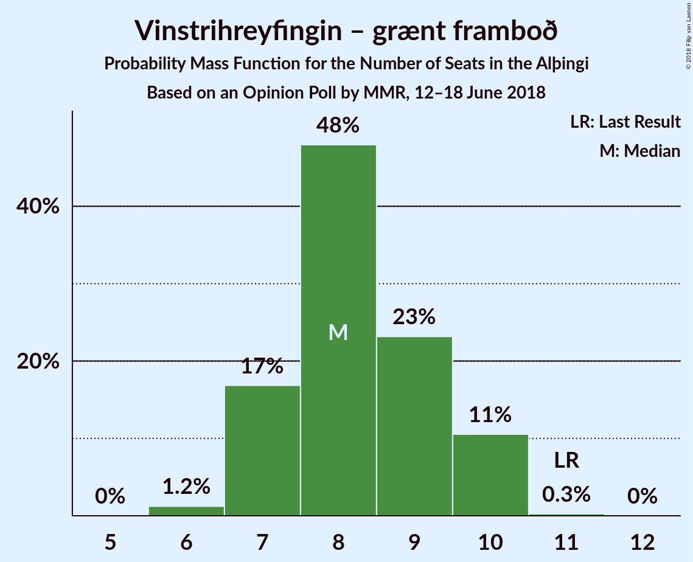

# Opinion Poll by MMR, 12–18 June 2018

<a href="#voting-intentions">Voting Intentions</a> | <a href="#seats">Seats</a> | <a href="#coalitions">Coalitions</a> | <a href="#technical-information">Technical Information</a>

## Voting Intentions

### Confidence Intervals

| Party | Last Result | Poll Result | 80% Confidence Interval | 90% Confidence Interval | 95% Confidence Interval | 99% Confidence Interval |
|:-----:|:-----------:|:-----------:|:-----------------------:|:-----------------------:|:-----------------------:|:-----------------------:|
| Sjálfstæðisflokkurinn | 25.2% | 21.6% | 20.0–23.4% |19.5–23.9% |19.1–24.4% |18.3–25.3% |
| Samfylkingin | 12.1% | 15.1% | 13.7–16.7% |13.3–17.2% |13.0–17.6% |12.3–18.4% |
| Píratar | 9.2% | 14.3% | 12.9–15.8% |12.5–16.3% |12.2–16.7% |11.5–17.5% |
| Vinstrihreyfingin – grænt framboð | 16.9% | 12.6% | 11.3–14.1% |11.0–14.6% |10.7–15.0% |10.1–15.7% |
| Miðflokkurinn | 10.9% | 10.6% | 9.4–12.0% |9.1–12.4% |8.8–12.7% |8.2–13.4% |
| Framsóknarflokkurinn | 10.7% | 9.5% | 8.4–10.9% |8.1–11.2% |7.8–11.6% |7.3–12.3% |
| Flokkur fólksins | 6.9% | 8.2% | 7.2–9.5% |6.9–9.8% |6.6–10.2% |6.1–10.8% |
| Viðreisn | 6.7% | 5.8% | 5.0–7.0% |4.7–7.3% |4.5–7.5% |4.1–8.1% |

*Note:* The poll result column reflects the actual value used in the calculations. Published results may vary slightly, and in addition be rounded to fewer digits.

## Seats

### Confidence Intervals

| Party | Last Result | Median | 80% Confidence Interval | 90% Confidence Interval | 95% Confidence Interval | 99% Confidence Interval |
|:-----:|:-----------:|:------:|:-----------------------:|:-----------------------:|:-----------------------:|:-----------------------:|
| <a href="#sjálfstæðisflokkurinn">Sjálfstæðisflokkurinn</a> | 16 | 14 | 13–15 |13–16 |12–16 |12–17 |
| <a href="#samfylkingin">Samfylkingin</a> | 7 | 10 | 9–11 |9–11 |8–12 |8–12 |
| <a href="#píratar">Píratar</a> | 6 | 9 | 8–10 |8–11 |8–11 |7–12 |
| <a href="#vinstrihreyfingin-–-grænt-framboð">Vinstrihreyfingin – grænt framboð</a> | 11 | 8 | 7–10 |7–10 |7–10 |6–10 |
| <a href="#miðflokkurinn">Miðflokkurinn</a> | 7 | 7 | 6–8 |6–8 |5–9 |5–9 |
| <a href="#framsóknarflokkurinn">Framsóknarflokkurinn</a> | 8 | 6 | 5–7 |5–7 |5–8 |4–8 |
| <a href="#flokkur-fólksins">Flokkur fólksins</a> | 4 | 5 | 4–6 |4–6 |4–6 |4–7 |
| <a href="#viðreisn">Viðreisn</a> | 4 | 4 | 0–4 |0–4 |0–5 |0–5 |

### Sjálfstæðisflokkurinn

*For a full overview of the results for this party, see the [Sjálfstæðisflokkurinn](party-sjálfstæðisflokkurinn.html) page.*

| Number of Seats | Probability | Accumulated | Special Marks |
|:---------------:|:-----------:|:-----------:|:-------------:|
| 11 | 0.1% | 100% |  |
| 12 | 3% | 99.9% |  |
| 13 | 15% | 97% |  |
| 14 | 39% | 82% | Median |
| 15 | 35% | 43% |  |
| 16 | 7% | 8% | Last Result |
| 17 | 1.0% | 1.4% |  |
| 18 | 0.3% | 0.4% |  |
| 19 | 0% | 0% |  |

### Samfylkingin

*For a full overview of the results for this party, see the [Samfylkingin](party-samfylkingin.html) page.*

| Number of Seats | Probability | Accumulated | Special Marks |
|:---------------:|:-----------:|:-----------:|:-------------:|
| 7 | 0.1% | 100% | Last Result |
| 8 | 4% | 99.9% |  |
| 9 | 29% | 96% |  |
| 10 | 44% | 68% | Median |
| 11 | 20% | 24% |  |
| 12 | 3% | 3% |  |
| 13 | 0.1% | 0.2% |  |
| 14 | 0% | 0% |  |

### Píratar

*For a full overview of the results for this party, see the [Píratar](party-píratar.html) page.*

| Number of Seats | Probability | Accumulated | Special Marks |
|:---------------:|:-----------:|:-----------:|:-------------:|
| 6 | 0% | 100% | Last Result |
| 7 | 1.0% | 100% |  |
| 8 | 16% | 99.0% |  |
| 9 | 46% | 83% | Median |
| 10 | 29% | 37% |  |
| 11 | 7% | 8% |  |
| 12 | 0.6% | 0.6% |  |
| 13 | 0% | 0% |  |

### Vinstrihreyfingin – grænt framboð

*For a full overview of the results for this party, see the [Vinstrihreyfingin – grænt framboð](party-vinstrihreyfingin–græntframboð.html) page.*

| Number of Seats | Probability | Accumulated | Special Marks |
|:---------------:|:-----------:|:-----------:|:-------------:|
| 6 | 1.3% | 100% |  |
| 7 | 17% | 98.7% |  |
| 8 | 46% | 82% | Median |
| 9 | 25% | 36% |  |
| 10 | 10% | 11% |  |
| 11 | 0.3% | 0.3% | Last Result |
| 12 | 0% | 0% |  |

### Miðflokkurinn

*For a full overview of the results for this party, see the [Miðflokkurinn](party-miðflokkurinn.html) page.*

| Number of Seats | Probability | Accumulated | Special Marks |
|:---------------:|:-----------:|:-----------:|:-------------:|
| 5 | 3% | 100% |  |
| 6 | 32% | 97% |  |
| 7 | 43% | 65% | Last Result, Median |
| 8 | 17% | 22% |  |
| 9 | 4% | 5% |  |
| 10 | 0.4% | 0.4% |  |
| 11 | 0% | 0% |  |

### Framsóknarflokkurinn

*For a full overview of the results for this party, see the [Framsóknarflokkurinn](party-framsóknarflokkurinn.html) page.*

| Number of Seats | Probability | Accumulated | Special Marks |
|:---------------:|:-----------:|:-----------:|:-------------:|
| 4 | 0.8% | 100% |  |
| 5 | 26% | 99.2% |  |
| 6 | 44% | 73% | Median |
| 7 | 25% | 29% |  |
| 8 | 4% | 4% | Last Result |
| 9 | 0.3% | 0.3% |  |
| 10 | 0% | 0% |  |

### Flokkur fólksins

*For a full overview of the results for this party, see the [Flokkur fólksins](party-flokkurfólksins.html) page.*

| Number of Seats | Probability | Accumulated | Special Marks |
|:---------------:|:-----------:|:-----------:|:-------------:|
| 3 | 0.2% | 100% |  |
| 4 | 17% | 99.8% | Last Result |
| 5 | 52% | 83% | Median |
| 6 | 29% | 31% |  |
| 7 | 2% | 2% |  |
| 8 | 0% | 0% |  |

### Viðreisn

*For a full overview of the results for this party, see the [Viðreisn](party-viðreisn.html) page.*

| Number of Seats | Probability | Accumulated | Special Marks |
|:---------------:|:-----------:|:-----------:|:-------------:|
| 0 | 14% | 100% |  |
| 1 | 0.1% | 86% |  |
| 2 | 0% | 85% |  |
| 3 | 34% | 85% |  |
| 4 | 48% | 51% | Last Result, Median |
| 5 | 4% | 4% |  |
| 6 | 0% | 0% |  |

## Coalitions

### Confidence Intervals

| Coalition | Last Result | Median | Majority? | 80% Confidence Interval | 90% Confidence Interval | 95% Confidence Interval | 99% Confidence Interval |
|:---------:|:-----------:|:------:|:---------:|:-----------------------:|:-----------------------:|:-----------------------:|:-----------------------:|
| Samfylkingin – Vinstrihreyfingin – grænt framboð – Miðflokkurinn – Framsóknarflokkurinn | 33 | 31 | 39% | 29–33 | 29–33 | 29–34 | 28–35 |
| Samfylkingin – Píratar – Vinstrihreyfingin – grænt framboð – Viðreisn | 28 | 31 | 25% | 29–32 | 28–33 | 28–33 | 27–34 |
| Sjálfstæðisflokkurinn – Vinstrihreyfingin – grænt framboð – Framsóknarflokkurinn | 35 | 29 | 2% | 27–30 | 27–31 | 26–31 | 25–33 |
| Sjálfstæðisflokkurinn – Miðflokkurinn – Framsóknarflokkurinn | 31 | 27 | 0.1% | 25–29 | 25–30 | 25–30 | 24–31 |
| Samfylkingin – Píratar – Vinstrihreyfingin – grænt framboð | 24 | 27 | 0.1% | 26–29 | 25–30 | 25–30 | 24–31 |
| Samfylkingin – Vinstrihreyfingin – grænt framboð – Miðflokkurinn | 25 | 25 | 0% | 23–27 | 23–27 | 22–28 | 22–29 |
| Samfylkingin – Vinstrihreyfingin – grænt framboð – Framsóknarflokkurinn | 26 | 24 | 0% | 23–26 | 22–26 | 22–27 | 21–28 |
| Sjálfstæðisflokkurinn – Samfylkingin | 23 | 24 | 0% | 23–26 | 22–26 | 22–27 | 21–28 |
| Sjálfstæðisflokkurinn – Vinstrihreyfingin – grænt framboð | 27 | 23 | 0% | 21–24 | 21–25 | 20–25 | 19–26 |
| Vinstrihreyfingin – grænt framboð – Miðflokkurinn – Framsóknarflokkurinn | 26 | 21 | 0% | 20–23 | 19–23 | 19–24 | 18–24 |
| Sjálfstæðisflokkurinn – Miðflokkurinn | 23 | 21 | 0% | 20–23 | 19–23 | 19–24 | 18–25 |
| Sjálfstæðisflokkurinn – Framsóknarflokkurinn | 24 | 20 | 0% | 19–22 | 19–22 | 18–23 | 17–24 |
| Samfylkingin – Vinstrihreyfingin – grænt framboð | 18 | 18 | 0% | 17–20 | 16–20 | 16–21 | 15–21 |
| Píratar – Vinstrihreyfingin – grænt framboð | 17 | 17 | 0% | 16–19 | 16–19 | 15–20 | 15–21 |
| Sjálfstæðisflokkurinn – Viðreisn | 20 | 18 | 0% | 15–19 | 14–19 | 14–20 | 13–21 |
| Vinstrihreyfingin – grænt framboð – Miðflokkurinn | 18 | 15 | 0% | 14–17 | 13–17 | 13–17 | 13–18 |
| Vinstrihreyfingin – grænt framboð – Framsóknarflokkurinn | 19 | 14 | 0% | 13–16 | 13–16 | 12–17 | 12–17 |

### Samfylkingin – Vinstrihreyfingin – grænt framboð – Miðflokkurinn – Framsóknarflokkurinn

| Number of Seats | Probability | Accumulated | Special Marks |
|:---------------:|:-----------:|:-----------:|:-------------:|
| 27 | 0.2% | 100% |  |
| 28 | 1.1% | 99.8% |  |
| 29 | 11% | 98.7% |  |
| 30 | 23% | 88% |  |
| 31 | 27% | 65% | Median |
| 32 | 23% | 39% | Majority |
| 33 | 11% | 16% | Last Result |
| 34 | 3% | 5% |  |
| 35 | 2% | 2% |  |
| 36 | 0.1% | 0.1% |  |
| 37 | 0% | 0% |  |

### Samfylkingin – Píratar – Vinstrihreyfingin – grænt framboð – Viðreisn

| Number of Seats | Probability | Accumulated | Special Marks |
|:---------------:|:-----------:|:-----------:|:-------------:|
| 26 | 0.3% | 100% |  |
| 27 | 1.3% | 99.7% |  |
| 28 | 4% | 98% | Last Result |
| 29 | 16% | 94% |  |
| 30 | 24% | 78% |  |
| 31 | 29% | 54% | Median |
| 32 | 18% | 25% | Majority |
| 33 | 6% | 7% |  |
| 34 | 1.2% | 1.3% |  |
| 35 | 0.1% | 0.1% |  |
| 36 | 0% | 0% |  |

### Sjálfstæðisflokkurinn – Vinstrihreyfingin – grænt framboð – Framsóknarflokkurinn

| Number of Seats | Probability | Accumulated | Special Marks |
|:---------------:|:-----------:|:-----------:|:-------------:|
| 24 | 0.1% | 100% |  |
| 25 | 0.7% | 99.9% |  |
| 26 | 4% | 99.2% |  |
| 27 | 14% | 96% |  |
| 28 | 30% | 82% | Median |
| 29 | 28% | 52% |  |
| 30 | 15% | 24% |  |
| 31 | 7% | 9% |  |
| 32 | 1.3% | 2% | Majority |
| 33 | 0.8% | 0.8% |  |
| 34 | 0% | 0% |  |
| 35 | 0% | 0% | Last Result |

### Sjálfstæðisflokkurinn – Miðflokkurinn – Framsóknarflokkurinn

| Number of Seats | Probability | Accumulated | Special Marks |
|:---------------:|:-----------:|:-----------:|:-------------:|
| 23 | 0.1% | 100% |  |
| 24 | 2% | 99.9% |  |
| 25 | 9% | 98% |  |
| 26 | 18% | 90% |  |
| 27 | 28% | 71% | Median |
| 28 | 26% | 43% |  |
| 29 | 11% | 17% |  |
| 30 | 5% | 6% |  |
| 31 | 1.0% | 1.1% | Last Result |
| 32 | 0.1% | 0.1% | Majority |
| 33 | 0% | 0% |  |

### Samfylkingin – Píratar – Vinstrihreyfingin – grænt framboð

| Number of Seats | Probability | Accumulated | Special Marks |
|:---------------:|:-----------:|:-----------:|:-------------:|
| 23 | 0.1% | 100% |  |
| 24 | 1.2% | 99.9% | Last Result |
| 25 | 4% | 98.7% |  |
| 26 | 17% | 95% |  |
| 27 | 32% | 78% | Median |
| 28 | 24% | 45% |  |
| 29 | 16% | 22% |  |
| 30 | 4% | 6% |  |
| 31 | 2% | 2% |  |
| 32 | 0.1% | 0.1% | Majority |
| 33 | 0% | 0% |  |

### Samfylkingin – Vinstrihreyfingin – grænt framboð – Miðflokkurinn

| Number of Seats | Probability | Accumulated | Special Marks |
|:---------------:|:-----------:|:-----------:|:-------------:|
| 21 | 0.2% | 100% |  |
| 22 | 3% | 99.8% |  |
| 23 | 9% | 97% |  |
| 24 | 22% | 88% |  |
| 25 | 28% | 66% | Last Result, Median |
| 26 | 25% | 38% |  |
| 27 | 10% | 13% |  |
| 28 | 2% | 3% |  |
| 29 | 0.7% | 0.8% |  |
| 30 | 0% | 0% |  |

### Samfylkingin – Vinstrihreyfingin – grænt framboð – Framsóknarflokkurinn

| Number of Seats | Probability | Accumulated | Special Marks |
|:---------------:|:-----------:|:-----------:|:-------------:|
| 20 | 0.1% | 100% |  |
| 21 | 1.1% | 99.8% |  |
| 22 | 5% | 98.8% |  |
| 23 | 26% | 94% |  |
| 24 | 27% | 67% | Median |
| 25 | 22% | 41% |  |
| 26 | 13% | 18% | Last Result |
| 27 | 4% | 5% |  |
| 28 | 1.2% | 1.3% |  |
| 29 | 0.1% | 0.1% |  |
| 30 | 0% | 0% |  |

### Sjálfstæðisflokkurinn – Samfylkingin

| Number of Seats | Probability | Accumulated | Special Marks |
|:---------------:|:-----------:|:-----------:|:-------------:|
| 21 | 2% | 100% |  |
| 22 | 7% | 98% |  |
| 23 | 18% | 91% | Last Result |
| 24 | 28% | 73% | Median |
| 25 | 33% | 45% |  |
| 26 | 8% | 11% |  |
| 27 | 2% | 3% |  |
| 28 | 0.6% | 0.7% |  |
| 29 | 0.1% | 0.1% |  |
| 30 | 0% | 0% |  |

### Sjálfstæðisflokkurinn – Vinstrihreyfingin – grænt framboð

| Number of Seats | Probability | Accumulated | Special Marks |
|:---------------:|:-----------:|:-----------:|:-------------:|
| 19 | 0.5% | 100% |  |
| 20 | 3% | 99.5% |  |
| 21 | 14% | 96% |  |
| 22 | 24% | 82% | Median |
| 23 | 41% | 58% |  |
| 24 | 12% | 17% |  |
| 25 | 4% | 5% |  |
| 26 | 0.7% | 0.8% |  |
| 27 | 0.1% | 0.1% | Last Result |
| 28 | 0% | 0% |  |

### Vinstrihreyfingin – grænt framboð – Miðflokkurinn – Framsóknarflokkurinn

| Number of Seats | Probability | Accumulated | Special Marks |
|:---------------:|:-----------:|:-----------:|:-------------:|
| 17 | 0.1% | 100% |  |
| 18 | 0.8% | 99.9% |  |
| 19 | 9% | 99.1% |  |
| 20 | 20% | 90% |  |
| 21 | 30% | 70% | Median |
| 22 | 22% | 40% |  |
| 23 | 14% | 18% |  |
| 24 | 4% | 4% |  |
| 25 | 0.5% | 0.5% |  |
| 26 | 0% | 0% | Last Result |

### Sjálfstæðisflokkurinn – Miðflokkurinn

| Number of Seats | Probability | Accumulated | Special Marks |
|:---------------:|:-----------:|:-----------:|:-------------:|
| 18 | 0.7% | 100% |  |
| 19 | 9% | 99.2% |  |
| 20 | 19% | 91% |  |
| 21 | 31% | 71% | Median |
| 22 | 25% | 40% |  |
| 23 | 12% | 15% | Last Result |
| 24 | 3% | 3% |  |
| 25 | 0.4% | 0.5% |  |
| 26 | 0.1% | 0.1% |  |
| 27 | 0% | 0% |  |

### Sjálfstæðisflokkurinn – Framsóknarflokkurinn

| Number of Seats | Probability | Accumulated | Special Marks |
|:---------------:|:-----------:|:-----------:|:-------------:|
| 17 | 0.8% | 100% |  |
| 18 | 4% | 99.2% |  |
| 19 | 18% | 95% |  |
| 20 | 36% | 77% | Median |
| 21 | 21% | 41% |  |
| 22 | 17% | 20% |  |
| 23 | 2% | 3% |  |
| 24 | 1.0% | 1.1% | Last Result |
| 25 | 0% | 0.1% |  |
| 26 | 0% | 0% |  |

### Samfylkingin – Vinstrihreyfingin – grænt framboð

| Number of Seats | Probability | Accumulated | Special Marks |
|:---------------:|:-----------:|:-----------:|:-------------:|
| 14 | 0.1% | 100% |  |
| 15 | 0.9% | 99.9% |  |
| 16 | 5% | 99.1% |  |
| 17 | 22% | 94% |  |
| 18 | 32% | 72% | Last Result, Median |
| 19 | 28% | 40% |  |
| 20 | 9% | 11% |  |
| 21 | 3% | 3% |  |
| 22 | 0.3% | 0.3% |  |
| 23 | 0% | 0% |  |

### Píratar – Vinstrihreyfingin – grænt framboð

| Number of Seats | Probability | Accumulated | Special Marks |
|:---------------:|:-----------:|:-----------:|:-------------:|
| 14 | 0.2% | 100% |  |
| 15 | 3% | 99.8% |  |
| 16 | 12% | 97% |  |
| 17 | 35% | 84% | Last Result, Median |
| 18 | 29% | 49% |  |
| 19 | 15% | 20% |  |
| 20 | 4% | 5% |  |
| 21 | 0.7% | 0.7% |  |
| 22 | 0% | 0% |  |

### Sjálfstæðisflokkurinn – Viðreisn

| Number of Seats | Probability | Accumulated | Special Marks |
|:---------------:|:-----------:|:-----------:|:-------------:|
| 13 | 0.6% | 100% |  |
| 14 | 5% | 99.4% |  |
| 15 | 7% | 94% |  |
| 16 | 10% | 88% |  |
| 17 | 18% | 77% |  |
| 18 | 39% | 59% | Median |
| 19 | 16% | 20% |  |
| 20 | 4% | 4% | Last Result |
| 21 | 0.5% | 0.5% |  |
| 22 | 0.1% | 0.1% |  |
| 23 | 0% | 0% |  |

### Vinstrihreyfingin – grænt framboð – Miðflokkurinn

| Number of Seats | Probability | Accumulated | Special Marks |
|:---------------:|:-----------:|:-----------:|:-------------:|
| 12 | 0.5% | 100% |  |
| 13 | 7% | 99.5% |  |
| 14 | 26% | 93% |  |
| 15 | 26% | 67% | Median |
| 16 | 27% | 41% |  |
| 17 | 12% | 14% |  |
| 18 | 1.3% | 2% | Last Result |
| 19 | 0.3% | 0.4% |  |
| 20 | 0% | 0% |  |

### Vinstrihreyfingin – grænt framboð – Framsóknarflokkurinn

| Number of Seats | Probability | Accumulated | Special Marks |
|:---------------:|:-----------:|:-----------:|:-------------:|
| 11 | 0.2% | 100% |  |
| 12 | 4% | 99.8% |  |
| 13 | 21% | 96% |  |
| 14 | 31% | 74% | Median |
| 15 | 26% | 43% |  |
| 16 | 14% | 17% |  |
| 17 | 3% | 3% |  |
| 18 | 0.4% | 0.4% |  |
| 19 | 0% | 0% | Last Result |

## Technical Information

### Opinion Poll

+ **Polling firm:** MMR
+ **Commissioner(s):** —
+ **Fieldwork period:** 12–18 June 2018

### Calculations

+ **Sample size:** 925
+ **Simulations done:** 524,288
+ **Error estimate:** 1.86%

